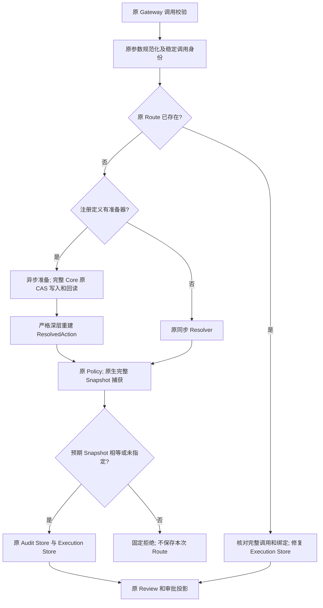
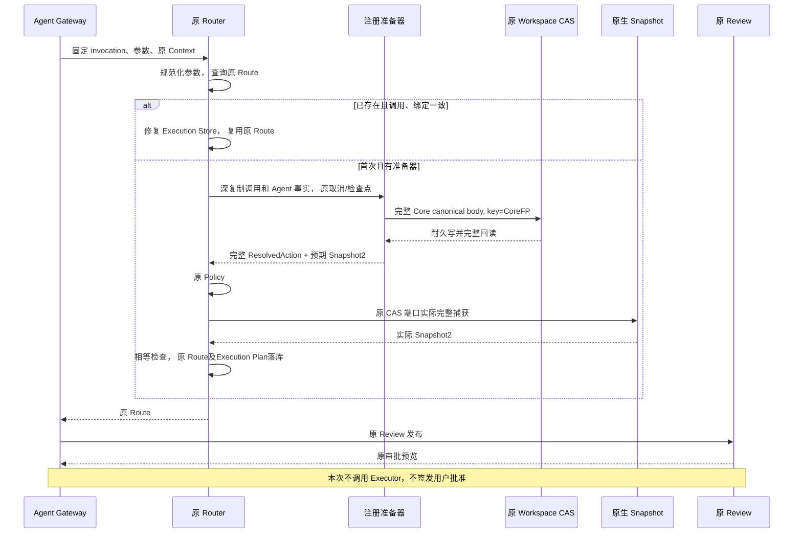
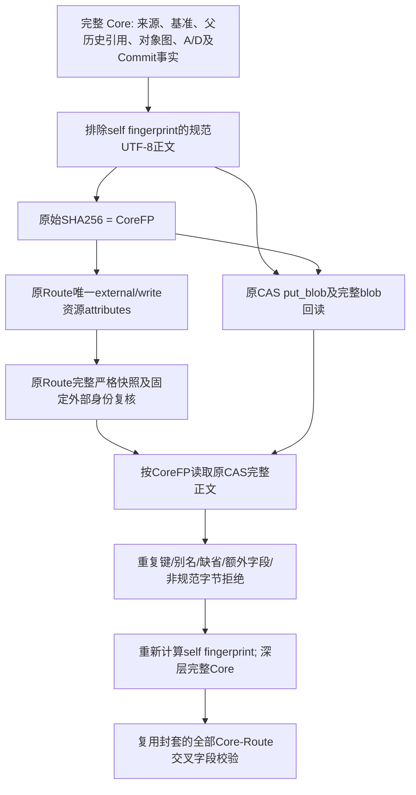

# Agent 审批前可信准备与完整 Git Core 耐久恢复设计

## 1. 需求背景与设计目标

原 Gateway 在同步 Router 规划后才调用异步 Review。Git 完整对象读取、基准和来源
观察需要异步受控宿主；若在 Review 中才生成 Core，已落库的 Route 无法绑定完整 Core
指纹。重新规划、循环摘要或用占位引用代替完整事实，均不能形成正式执行契约。

本变更提供真实 Gateway 使用的审批前准备阶段。完整 Core 在原 Workspace CAS 中以
排除自指纹的规范字节耐久保存，原 Route 的唯一资源绑定 Core 指纹；重启后的消费者
可据原持久 Route 找回完整 Core，而不是观察当前工作区并重新生成交付意图。

### 1.1 当前实现与未完成范围

| 已实现 | 明确未实现 |
|---|---|
| 原 Gateway 首次规划前调用注册准备器，已有 Route 查询优先 | 默认 Git Planner 和 Tool Catalog 注册 |
| 原参数规范化、Policy、Snapshot 捕获和 Route 持久化仍为唯一算法 | 实际原认证 Session 的 Git 归属采集与全原生基准组装 |
| 完整 Core 原 CAS 耐久写、完整回读和内容寻址恢复 | ProductLink 阶段写入、Git Review Artifact 的正式发布及分页 |
| 完整 Core 与真实原 Route 的共享交叉字段验证 | 实际新 A、prepared T2、D 物化、独立 Commit 与 NativeBridge |
| 真实原 Stores 的重启、漂移、取消及错误边界回归 | 跨库业务 Backup2、三平台业务验收及商用发布 |

准备器属于宿主注册能力，默认 Patch、Rollback、Process、MCP、Skill 和 Hook 定义
均没有新增准备器。此变更不增加默认模型工具、批准或 Git 外部写权限。

## 2. 架构决策、约束与取舍

1. 在 `TrustedActionDefinition` 上增加可选 `agent_prepare`，而不是让模型指定准备器。
   注册时保留其原宿主对象；Gateway 调用冻结的 Router 定义，不维护第二套工具注册表。
2. 准备器只返回原 `ResolvedAction` 的完整资源、Workspace 请求及可选 Snapshot2
   预期值。不得替换 Policy、Sandbox、Context、Executor、Route 或批准。
3. 原生重新捕获的 Workspace 必须精确等于预期值后才保存 Route。比较覆盖根身份、
   目标文件存在性、对象身份、内容、完整父历史引用及原 Snapshot2 revision，不只比较
   文件 SHA。预期 Snapshot2 不能在缺少原 CAS 端口时降为 Snapshot1。
4. 原同步入口首次遇到有准备器的定义时失败关闭，防止绕过准备；已有精确 Route
   仍可查询复用。没有准备器时 Gateway 继续调用原同步规划实现。
5. 不增加 SQL 表、签名平台、独立队列、Git 对象编码器、同步后台线程或垃圾回收。
   Core 与完整 Plan 都保持原 512KiB 上限；完整 Source2 父历史引用不截断。
6. 内容寻址只能证明字节完整，不能证明 Session 归属、Store MAC、Owner、批准或效果。
   一致性验证和业务执行准入分别维护，纯组件不能补签或追认业务记录。

## 3. 总体架构与核心流程



读取已有 Route 优先于准备，因此同一调用重启后不重新分配 A/D 身份，也不把当前 U
重算成另一份交付内容。准备完成后原生捕获当前工作区，关闭材料观察与原规划之间的
漂移窗口。这不是跨数据库原子事务，也不替代批准后、执行前的原始安全检查。

### 3.1 时序图



图中 Core 写入为注册 Git 准备器的实现职责，通用 Gateway 不自动替准备器创建 Core。
当前集成测试使用真实原 Stores 和完整材料验证该调用顺序；默认 Git 准备器仍待装配。

### 3.2 数据流程图



CAS 私有正文是完整 Core 的内容地址载荷，不是公开完整模型序列化：只省去可由全部
正文派生的自身 `fingerprint`，保留 `spec_version`、所有嵌套摘要和每个业务字段。原
完整 Plan Wire 仍包含 Core 自指纹、完整 Route、ArtifactRef 和封套指纹，旧字节不变。
父 Manifest/Chunk 正文由原 CAS 独立保存，Core 保留全部原版本引用；本组件不能用
引用存在替代原材料回读，也不把 CAS 缺失当作可重新采集的授权。

## 4. 源码、重点类、接口设计与数据结构

| 责任 | 实际源码与接口 | 输入、输出及边界 |
|---|---|---|
| 唯一注册能力 | [`router.py`](../../src/harnessix/trusted_actions/router.py) `TrustedActionDefinition.agent_prepare` | 宿主 Provider 或 None；不进入模型输入 Schema |
| 受限准备接口 | [`agent_gateway_invocation.py`](../../src/harnessix/trusted_actions/agent_gateway_invocation.py) `AgentActionPreparer.prepare` | invocation、规范化 arguments、原 Context、Thread/Turn/Call、原 CancelToken → ResolvedAction |
| 真实 Agent 接线 | [`agent_gateway_support.py`](../../src/harnessix/trusted_actions/agent_gateway_support.py) `prepare_action` | 调用 `plan_agent_action` 后仍运行原 Route 校验、Review 和审批投影 |
| 首次准备/恢复 | [`agent_preplanning.py`](../../src/harnessix/trusted_actions/agent_preplanning.py) `plan_agent_action` | 只选注册定义；原稳定调用验证、查询优先、有界异步准备及并发冲突拒绝 |
| 返回结果快照 | [`prepared_resolution.py`](../../src/harnessix/trusted_actions/prepared_resolution.py) `snapshot_prepared_resolution` | 只接纳确切原模型/tuple和全字段；拒绝子类、伪造、extra及容器别名 |
| 唯一原规划 | [`planning.py`](../../src/harnessix/trusted_actions/planning.py) `plan_action` | 首次同步绕过拒绝；原 Policy和捕获后比较 expected_workspace，才保存 Route |
| 一次参数解码 | [`planning.py`](../../src/harnessix/trusted_actions/planning.py) `_plan_normalized_action` | 同步与异步共用规范化后的原算法，准备后不重复执行Decoder或改变调用输入 |
| 唯一外部身份 | [`planning.py`](../../src/harnessix/trusted_actions/planning.py) `external_action_identity` | 原 uuid5 算法共享；没有新的模型自报 Delivery UUID 通道 |
| 完整 Core 耐久 | [`git_delivery_core_store.py`](../../src/harnessix/product_config/git_delivery_core_store.py) `ProductGitDeliveryCoreStore.persist/load` | 原确切 SQLiteWorkspaceTransactionStore，完整回读、固定IO错误，无业务成功事件 |
| 原 CAS 单次控制 | [`store.py`](../../src/harnessix/delivery/store.py) `blob/put_blob` 的可选 `checkpoint` | 局部组合原 Store 检查点与本次检查点；不替换共享属性，原默认调用不变 |
| 唯一有限 Wire | [`git_delivery_plan_wire.py`](../../src/harnessix/product_config/git_delivery_plan_wire.py) `encode/decode_product_git_delivery_core` | 同一逐块512KiB预算、严格JSON算法；注入仅派生自身指纹 |
| Route寻址恢复 | [`git_delivery_route_core.py`](../../src/harnessix/product_config/git_delivery_route_core.py) `load_product_git_delivery_route_core` | 原持久 Route2 → 唯一资源 → 完整 Core → 完整交叉字段验证 |
| 共享绑定算法 | [`git_delivery_plan_contracts.py`](../../src/harnessix/product_config/git_delivery_plan_contracts.py) `validate_product_git_delivery_route` | 封套与恢复共用；完整调用、来源Workspace、资源、Policy、外部身份一致 |

准备器收到的 Thread/Turn/Call 是深复制的交互事实，**不是认证 Reader 回执**。实际
Git Planner 必须从原 Session、Router、Transaction Reader 再证实归属，不能因对象类型
正确就认为其拥有选中 Patch。接线不复制原 Git 观察、对象编码或来源归并算法。

### 4.1 重点字段

| 字段 | 解释 | 不代表什么 |
|---|---|---|
| `agent_prepare` | 注册定义持有的异步准备对象 | 模型可选准备策略、自动批准 |
| `ResolvedAction.resources` | 原规范资源，准备结果严格重建后交给原 Policy | 可跳过原风险策略 |
| `workspace_resources` | 原 WorkspaceResourceRequest 完整tuple | 另一个路径、目录或外部根授权通道 |
| `expected_workspace` | 可选完整 Snapshot2；原生实际捕获必须精确匹配 | 一组只有 SHA 的摘要、可直接持久化的替代观察 |
| `Core.fingerprint` | 完整私有规范正文原始 SHA256；CAS 唯一地址 | Session/MAC/批准、材料可用性或当前根身份 |
| `Route.resources[0].attributes_sha256` | 恢复完整 Core 的原地址 | GitDB 成功、原 Review 完整正文、可执行效果 |
| `Route.external_action_id` | 原 stable invocation及binding派生的外部身份 | 任意随机 ID，旧批准可复用的新交付 |

## 5. 核心逻辑伪代码

```text
plan_agent_action:
  如果注册定义没有准备器: 调用原 Router.plan
  检查原取消和检查点
  invocation 必须等于原 Agent 稳定身份构造结果
  用原算法规范化参数并查询原 Route
  如果已存在: 核对完整调用/绑定，修复原 Execution Store，返回
  先验证原幂等要求
  在原 Router 操作上限和 CancelToken.run 下等待注册准备器
  深重建原资源、请求及可选 Snapshot2; 消费原检查点
  调用唯一规范化后的原 _plan_normalized_action，不再次执行Decoder:
    原 Policy → 原生实际 Snapshot → 完整预期相等 → 原 Audit/Execution Stores
  如果并发中已有另一不同资源/Workspace的 Route: 拒绝冲突，不覆盖旧计划

persist Core:
  严格深快照 → 全字段规范编码(排除self fingerprint)
  raw SHA == CoreFP → 原 put_blob → 完整 blob 回读
  字节精确相等 → 同一严格规范解码 → 返回新完整快照

load Route Core:
  严格 Route2 → 必须唯一 external/write 资源 → 原外部身份算法核对
  按完整资源 CoreFP 读原 CAS → 512KiB/raw SHA/规范字节/深层契约验证
  复用原封套Core-Route全部交叉字段算法 → 返回新完整Core
```

## 6. 持久化、事务和失败恢复

| 窗口 | 持久事实 | 恢复行为 |
|---|---|---|
| 准备开始前取消/输入拒绝 | 没有本次新 Route | 不读取 Git、不执行；原错码或取消传播 |
| Core写前失败 | 没有 Core/Route | 重新发起原调用仍须完整准备，无外部效果 |
| Core已写，准备或Route失败 | 原 CAS 可有孤立完整内容 | 不认定拥有、批准或效果；不自动删除、不凭孤儿重放 |
| 原生 Snapshot 与预期漂移 | 可有孤立 Core，未保存本次 Route | 固定冲突拒绝，不截断父历史、不转Snapshot1 |
| Audit Route 已写，Execution未写 | 原 Route完整事实 | 原查询优先并修复 Execution Store；不再次调用准备器 |
| Route已写，Review或Session投影失败 | 保留原 Route状态 | 原 Review/Session恢复语义；不新增FSM边、不推断批准 |
| 重启时 Core缺失/损坏 | 原 Route保留，完整材料不可用 | 固定失败关闭；不能从当前U重建另一Core冒充原计划 |
| 并发准备另一计划先写 | 已存原 Route不可变 | 不用新观察替换不同资源；拒绝冲突 |

Core CAS 与 Route 不是原子事务；这个设计利用“无授权孤儿内容”作为保守失败边界。
完整 Plan 封套还需要单独验证 512KiB 上限，Core能保存不意味着加入 Route、真实Artifact
引用后封套一定能保存。实际 Planner 在外部写之前必须完成所有容量与材料准入。

## 7. 错误分类、取消、超时与可观测性

### 7.1 原 CAS 的单次控制异常边界

原 Store 构造时已有检查点，业务调用另有本次检查点。两者必须都被消费；仅在 Core
入口记录本次回调异常，不能识别来自原 Store 的取消或期限异常。通过异常类型、错误
码或堆栈帧猜测来源同样不是正式契约。

原 `blob/put_blob` 增加可选单次 `checkpoint` 参数。指定时局部检查函数先消费原
Store 检查点，再消费本次检查点；控制异常只用原 `UpstreamCheckpointError` 穿过 IO
错误转换，Core入口明确解包并传播原异常对象。原共享 `_checkpoint` 从不替换；未指定
新参数的调用保持原行为。原写算法、内容上限、耐久确认、只读权限和路径保护不变。
底层读写异常不能借控制包装器公开；新单次路径仅包装真实检查点，不包装普通CASIO。

### 7.2 有限公开错误

- `action_preparation_required`：有准备器的首次定义不能使用同步入口绕过。
- `action_preparation_invalid`：返回结果不是确切原 ResolvedAction 或其完整模型图无效。
- `action_preparation_workspace_changed`：实际捕获与完整预期不一致；不保存本次 Route。
- `action_invocation_conflict`：原身份已有不同参数、绑定或并发资源，原计划不覆盖。
- `action_plan_failed`：准备器内部未知异常及等待超时固定公开，不读取异常正文。
- `git_delivery_plan_invalid`：完整规范字节或 Core/Route 契约拒绝。
- `git_delivery_core_store_invalid`、`git_delivery_core_write_failed`、
  `git_delivery_core_read_failed`：有限原CAS入口和完整IO错误，不公开路径或正文。

Turn取消和父Task取消必须先回收托管子任务；从同一个上游检查点产生的异常保持原
对象，不因其类型与解析/IO错误相同而重新分类。异步准备等待使用原 Router 操作上限
兜底，不上调20/45/240/300秒门槛；实际宿主仍消费原更短绝对预算，不能逐对象重置。

不新增携带源代码的日志或审计事件。成功落库的规划仍由原 Audit事件记录Policy、资源
摘要、稳定计划身份和状态；准备前拒绝仅有固定错误，不能伪装为已成功的Route事件。
诊断证据保存完整测试、结构化结果和来源指纹，不保存模型凭据或响应正文。

## 8. 安全与部署

不增加网络、数据库服务、安装渠道或权限。原 Owner、Scope、MAC、Lease、进程端口、
Root、StateRoot、保护输出和备份边界不变。准备器必须由受信产品装配注入；模型输入
仍是原有限 Tool schema，不能携带 Route、Policy、原生路径、环境或执行命令。

CAS load 和 Route一致性不建立当前执行权。正式业务入口还必须核对原 Session归属、
当前 Store/Key/Owner、完整 Review、独立批准、实际 Git 绑定及受控执行能力，且不能
因恢复旧材料自动执行 UNKNOWN。新 A 必须真实干净，T2仅prepared，D才是物化目标。

## 9. 完整测试与验收范围

- 输入规范化先于准备；坏参数、调用冲突、同步绕过不能启动准备或Executor。
- 显式Decoder只执行一次，稳定及非幂等Decoder负例均须保持准备参数与最终Route完全相同。
- 注册准备 → 原Policy → 原生Snapshot2 → 原Route → 原Review的真实调用顺序。
- 原CAS耐久写、完整回读及重启寻址；排除仅自身指纹、旧Plan字节兼容、完整hex图与
  全父Manifest/Chunk引用保持；重复键、额外字段、缺省、别名、错SHA、损坏和超限拒绝。
- 子类/伪造容器/额外字段拒绝，原对象别名不可改变新快照；检查点异常保留。
- Turn取消、父Task取消、期限耗尽和回收，准备完成前不产生新Route或Executor效果。
- 内容、inode、父历史及平台代际漂移拒绝；缺少Snapshot2端口不降级。
- 原Stores关闭重开后Query-first；准备器设为失败哨兵也不能重新生成原意图；全部
  Core与Route字段复核。真实原Stores的集成证据不是已认证业务Session或用户批准证据。
- 旧Gateway、Router、Review、错误保护和物理门禁回归；原schema、结构策略、Native18
  和执行合同字节不放宽。完整证据见[组件验收报告](../validation/git-agent-preplanning-2026-10-07-v1/README.md)，
  包括同候选安装包回归、原治理门禁、完整输入哈希和审查记录；不将重叠测试集合相加为覆盖率。

## 10. 风险、待完成工作及发布结论

主要未决风险仍是实际业务接线，而不是本组件读写：实际脏 U 的独立物理观察、私有
父目录原身份、完整注册A、派生T2与原NativeBridge、D物化及独立Commit、认证
ProductLink/Artifact/Session关联、业务Backup2和恢复后重新绑定均未完成。

本变更只完成可信规划阶段和完整计划寻址恢复。没有新增默认Git工具，不关闭R4、
R1—R6、真实编码质量、三平台业务消费者或有限Beta，不发布商用1.0标签。
