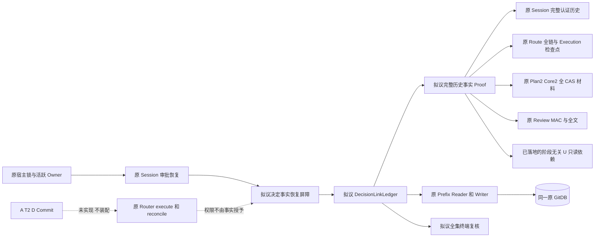
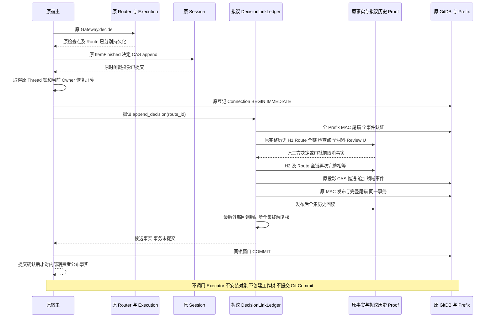
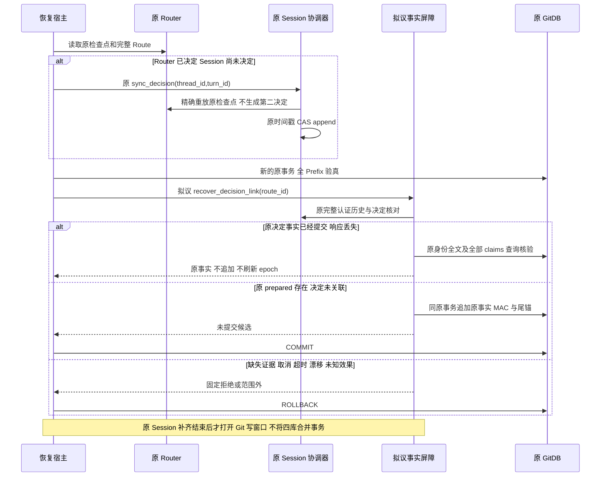
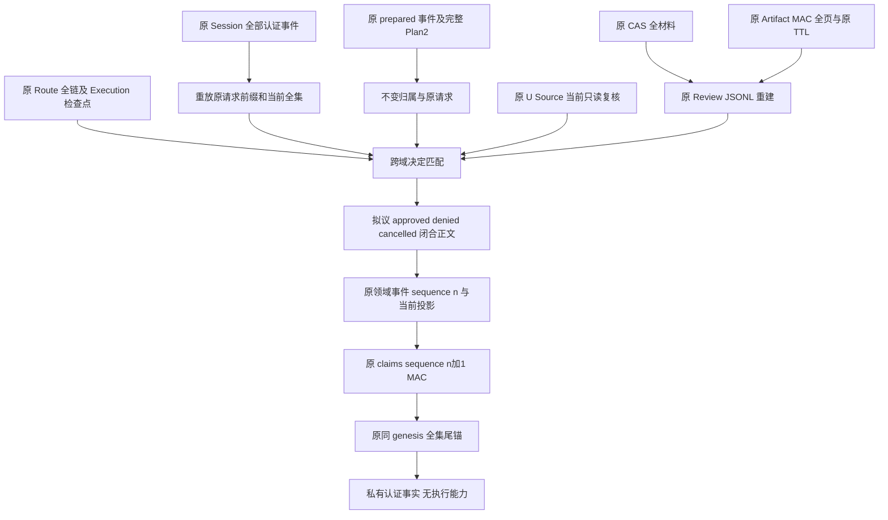
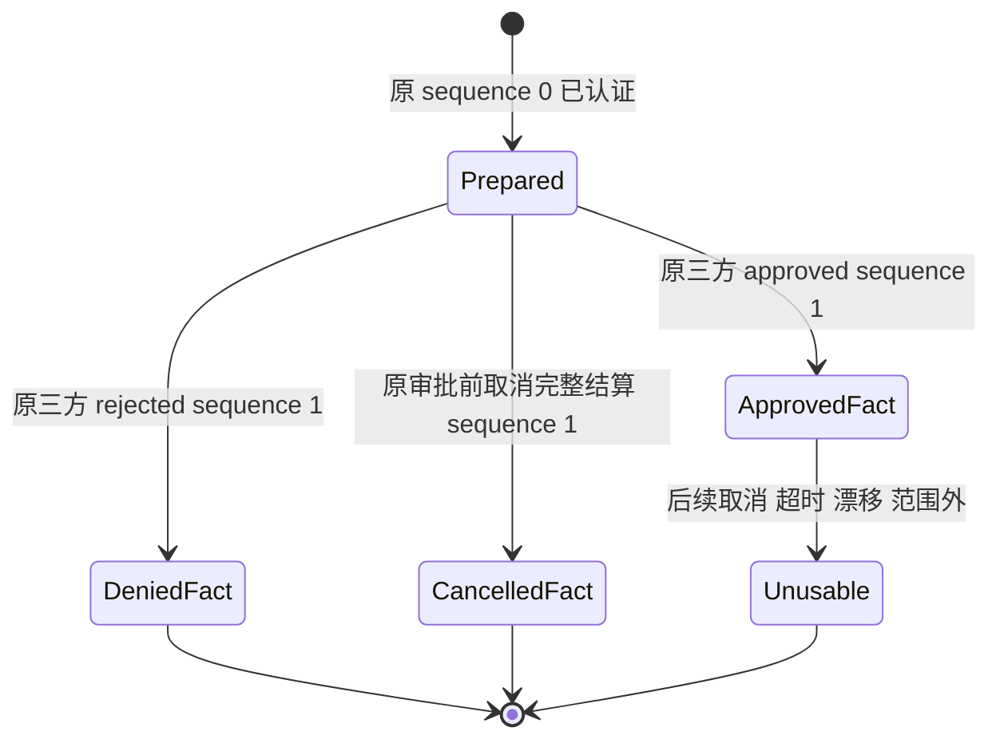

# Git prepared 后审批事实认证与恢复接线设计

## 1. 变更摘要

**正式决定接线状态：`planned`。** [三种决定数据声明与严格 Wire](m09-r4-git-decision-data-contract.md)已实现；原来源认证 Proof、事务 Writer、完整历史 Reader 及宿主恢复屏障仍未实现或装配。
数据契约通过不能签发认证、批准或执行权限；当前没有默认产品 Git 写工具。
原[事件正文定位及私有声明映射](m09-r4-git-decision-original-body-sources.md)已实现，沿原 Session 同次完整认证读取保留摘要，
内部映射复用原完整语义解释及父控制；原历史 Reader 的 `read_decided` 已新增完整只读入口。
它不接收调用方 Evidence/摘要作认证，不签发发布或执行能力；正式决定 Proof/Writer 与默认装配保持 planned。
文档治理状态保持 `draft`；`code_revision` 固定现行消费者实现，不表示拟议正式决定接口已经落地。
B3 的必需只读依赖 `verify_product_git_user_observation` 与共享末轮配方已在当前工作区落地；
它们只复核既有完整 U，原Reader绑定及每个基准成员均向原生端口求证，不接受重新计算公开摘要作为认证；不代表完整 B3 批准认证接线或正式上线。原 prepared Ledger 与审批历史 Reader 已在协调层消费该依赖；B4、B7、同步响应性 P1 与 approved Writer 均未闭合。
独立的[原 prepared 审批历史只读子切片](m09-r4-git-prepared-approval-history.md)已经实现窄域历史解释与原资源读取；
它不包含 Git 决定的来源 Proof/Writer、正式决定的完整 U 消费与同步终端一致性、协作锁和恢复屏障，不改变本文新增正式决定接口的 `planned` 状态。
本文采用真实模板 [change-design-template.md](../governance/templates/change-design-template.md) 的十四节结构。

| 项目 | 内容 |
|---|---|
| 需求 | 紧邻原 prepared 关联，认证同一原调用的 approved、denied、cancelled 事实，并定义重启后的补齐顺序 |
| 当前问题 | prepared Reader 只认证实时 pending；审批决定后必然拒绝，不能承担决定历史 Reader 的职责 |
| 目标结果 | 从原完整 Session/Route 历史认定事实，在同一原 GitDB 事务追加事件、原 MAC 旁表及完整尾锚；不产生执行授权 |
| 影响模块 | product_config 负责跨域适配；Session、Router、Execution、CAS、Artifact 保持原权威；delivery 保持领域无 Session 依赖 |
| 兼容级别 | 新增有版本的决定正文与窄域 Reader；prepared/v1 的合同、字节和 pending 语义不放宽；不改 GitDB v2 DDL |
| 发布单元 | 拟议内部认证组件及原宿主恢复屏障；本阶段无默认 Git 写工具注册、无新网络服务 |
| 回滚单元 | 停止新追加与恢复接线；保留所有认证事件；旧 prepared Reader 对新正文继续拒绝，不删除尾部历史以恢复兼容 |

现行基线及消费者实现由 `code_revision` 固定；阶段无关 verifier、共享 helper 和消费者与拟议正式决定接口分别记录。
正式决定接线属于独立的下一阶段，不纳入当前 prepared 候选范围及验收。
B3 只读依赖的[专项证据发布入口](../validation/git-user-observation-verification-2026-10-07-v1/README.md)
以实际发布原件为准，不由本设计推导测试通过、性能结果、安装或发布验收。

**可行性结论：** 已有表、连续事件、MAC 发布器及原审批模型能够承载此窄增量，无须第二个 Store、表或授权域；但不能直接使用当前 prepared Reader/Proof 完成。
成立条件是新增历史事实适配、明确负向事实编码，并关闭第 13 节列出的宿主与完整用户观察复核缺口。
直接写 SQL `phase='denied'/'cancelled'`、把 `ready` 当成人工批准、把历史批准当成当前执行权，均不可行。

## 2. 需求背景与证据

### 2.1 当前真实来源

| 已核对来源 | 当前事实 | 对本增量的约束 |
|---|---|---|
| [prepared 合同](../../src/harnessix/product_config/git_prepared_link_contracts.py#L17) | `ProductGitPreparedLink` 固定 `phase=prepared`、`sequence=0`；审批必须未决定且 pending | 不修改该合同使其接受已决定对象 |
| [prepared Proof](../../src/harnessix/product_config/git_prepared_link_proof.py#L162) | 原 Route 必须 pending；原 active Turn 必须 waiting_approval；首个 pending Call、唯一 started 审批项目及完整 `build_approval` 相等 | 决定后拒绝是当前设计边界，不是可以绕开的校验 |
| [prepared Rows](../../src/harnessix/product_config/git_prepared_link_rows.py#L46) | 全物理 MAC 先验真，再解释全部关联；每条 stream 必须只有首个认证事件 | 新 Reader 必须读完整事件链，不能仅将 `stream.count != 1` 删掉 |
| [阶段无关 U verifier](../../src/harnessix/product_config/git_user_observation.py#L184) | 显式借原 Session、transactions、Router、Reader 与 snapshot_ports；本次重读完整认证历史，不要求准备阶段 pending Call | B3 必需只读依赖已落地；不是决定来源 Proof、终端锁或 Writer |
| [共享末轮配方](../../src/harnessix/product_config/git_user_observation.py#L368) | 准备器与 verifier 共用目录、逻辑 Git、历史、Source、物理 Index 的原顺序；历史/Source 由各入口闭包提供 | 原准备器仍保留 pending Call；collector 不迁入此 helper，原前后观察窗口不变 |
| [原 Session 决定](../../src/harnessix/agent/trusted_action_session.py#L147) | Router 先提交检查点和 Route，Session 再以原时间戳 CAS 追加 `ItemFinished(COMPLETED)` | 三库提交顺序有恢复窗口，不存在共同数据库事务 |
| [原恢复](../../src/harnessix/agent/trusted_action_session.py#L96) | waiting_approval 下用原 Gateway `sync_decision` 补 Session 投影 | 先由原协调器修复，再进入 Git 事实事务；认证 Writer 自身不作决定 |
| [原 Router.decide](../../src/harnessix/trusted_actions/router.py#L218) | REQUIRE_APPROVAL 才接受决定；既有决定精确重放；approved→ready，rejected→denied | `ready` 也可能来自策略 ALLOW，必须核对原检查点与完整 Session 决定 |
| [原 execute/reconcile](../../src/harnessix/trusted_actions/operation_router.py#L40) | execute 走原批准检查和 operation claim；reconcile 从 unknown 领取原对账 operation | 新 Git 事实不是 claim，也不能替代该入口 |
| [GitDB v2 phase 枚举](../../src/harnessix/delivery/git_store_schema_v2.py#L11) | 有 approved、failed，没有 denied、cancelled | 在现有 schema 内只能使用明确的负向正文变体；不能凭 API 名声称 DDL 接受这些 phase |
| [原 Prefix Writer](../../src/harnessix/product_config/git_prefix_writer.py#L166) | 旧事件/Seal 不可改写；允许追加及推进当前投影；NativeBridge 新行仍被拒绝 | 物理能力足够，但语义必须由新业务 Proof 判断；桥接拒绝保持 |
| [原取消](../../src/harnessix/trusted_actions/preparation_rejection.py#L55) | 仅 cancelling 且 Route pending 时提交 `system.cancel / rejected / turn_cancelled`；不补一个已完成 Session 人工审批 | 取消与人工 denied 是不同事实，不能伪造取消的 ApprovalRecord |

### 2.2 指纹与认证来源不是一回事

Session 的请求指纹由原 [build_approval](../../src/harnessix/trusted_actions/agent_gateway_output.py#L90) 调用原
[trusted_action_request_fingerprint](../../src/harnessix/agent/approvals.py#L99) 生成，绑定完整 Thread/Turn/Call、Route、Execution、Policy、Review。
Router 的 `ExecutionApprovalCheckpoint.decision.request_fingerprint` 则绑定 **Execution Plan fingerprint**。
原 [_decision_projection](../../src/harnessix/trusted_actions/agent_gateway_support.py#L454) 保留 outcome/actor/reason/decided_at，将请求指纹投影为 Session 请求指纹。
两种指纹不能直接相等比较，也不能创建第三种批准算法。

原 [authenticated_thread_history](../../src/harnessix/session/sqlite_history.py#L104) 在同一只读 Session 事务认证完整事件并重放 Reducer。
原 [Router.events](../../src/harnessix/trusted_actions/router.py#L313) 经 Audit Store 核对完整 Hash 链、Plan/Resource/Policy 及末端投影。
Route Hash 链不是新增 MAC 权威：人工批准必须同时由原认证 Session 决定、原 Execution 检查点及 Route 完整链交叉成立。

### 2.3 可复用详设

prepared 的连接登记、四库观察、终端读集合详见 [prepared 详细设计](m09-r4-git-prepared-link.md)；
物理认证详见 [Prefix 账本](m09-r4-git-prefix-ledger.md)；完整 Plan/Core 及材料详见
[交付意图](m09-r4-git-delivery-plan.md)、[Checkpoint 准备](m09-r4-git-checkpoint-preparation.md)、
[用户 Git 观察](m09-r4-git-user-observation.md) 与 [父历史消费者](m09-r4-git-parent-consumers.md)。
原权限、Owner、Review、恢复语义沿用 [Trusted Actions](../modules/trusted-actions.md)、[Session](../modules/session.md)、[Artifacts](../modules/artifacts.md)。
本增量只补决定事实边界，不重新展开上述全系统设计。

## 3. 设计目标、非目标与验收标准

### 3.1 目标与对应验收

| 编号 | 目标 | 拟议验证，全部 `planned` |
|---|---|---|
| G1 | 同一原 Session 完整历史定位唯一原请求与决定，而非依赖当前 waiting 状态 | 真实认证历史中 approved/denied 成立；重复、错 Call、错 Item、Fork 借用、序号缺口拒绝 |
| G2 | 保留原 Plan2、Core2、Review 全文、claims/prefix、原活跃 Owner | 同身份材料不变可认定；任一来源/Owner/Scope/Key/正文/分页错配拒绝 |
| G3 | 人工 approved、人工 denied、审批前 cancelled 分开认证 | CANCELLED Item 不得生成决定；system.cancel 字符串不能单独证明取消 |
| G4 | 原事务内原事件与认证原子追加，精确重试不重复签发 | rollback 后无部分事实；确认丢失查询复用原 epoch/序号/尾锚 |
| G5 | 已取消、原 Turn 超时、Review 过期或可观察漂移不产生可用 approved 结论 | 原预算不能刷新；历史 approved 即使 MAC 有效也不能绕过当前拒绝 |
| G6 | 恢复先补原审批双账本，再补 Git 事实，不执行新效果 | 在各提交边界中断；无第二审批、无新授权、无 Executor 调用 |
| G7 | 所有关联先认证再解释，任何坏链拒绝全集 | 在非目标关联插入真实 MAC 但错误语义，仍必须拒绝 |

### 3.2 非目标

- 不实现 A、T2、D、NativeBridge、对象安装、Checkpoint/Commit 效果、Ref/Index 更新、结果闭合、Backup2 或完整生命周期 Loader。
- 不新增 `ApprovalOutcome.CANCELLED`，不创建第二批准服务，不新增批准 Key/MAC 用途，不另建 Git 决定表或 Store。
- 不将 planned 内部接线默认注册到产品；不声明 A/T2/D/Commit 可用，不关闭 R3/Beta/商业交付门禁。
- 不追认无证明旧历史；没有原 prepared 事件时不根据已经 decided 的模型补造 sequence 0。
- 不恢复已消失的 CAS/Review，不刷新 Review TTL，不重捕获 Core/Source，不将新根、Fork 或新 Call 继承旧批准。
- 不提供取消/超时后的继续执行、批准后撤销权威、已进入 running/unknown 的 Git 效果认证。仅定义这些输入必须停下并交给原恢复边界。
- 不把数据库观察与路径 pin 宣称为跨库原子快照或恶意外部换回的绝对防护。

## 4. 当前实现与根因


1. `ProductGitPreparedLinkLedger.prepare/read_all` 使用同一 pending-only Proof，对全部 prepared 关联都要求当前实时待审批。
2. 原决定改变 Router 与 Session，但不修改原 prepared 事件。原 prepared MAC 仍可证明**过去确实准备过**，不能证明**现在仍 pending**或**已经批准**。
3. 物理 Prefix 能覆盖连续多事件，却不解释人工批准、取消、预算或 Review；只修改正文 phase 会得到无业务来源的新声明。
4. 原 Router、Execution、Session、GitDB 是不同数据库；必须以查询优先恢复串联，不能把 Git 事务说成这些库的一次共同提交。
5. 原 Git 用户观察包含逻辑和物理事实。原 pending Proof 本身继续复核 Source/CAS/Review；Ledger 的 `_authenticate` 已在原 Evidence 后消费完整 U verifier，审批历史 `_read_all` 同样逐关联消费。异步 HEAD/Ref/配置复核不证明同步终端/COMMIT 的 B4 已闭合。

因此采用新增窄域历史 Reader/Proof，保留 prepared 实时 Reader 原拒绝。不是将当前 waiting 检查替换成宽松的状态列表。

## 5. 总体架构与变更后方案



### 5.1 替代方案与局部设计决策

| 决策 | 方案 | 优点 | 缺点/风险 | 结论 |
|---|---|---|---|---|
| D1 | 放宽 prepared/v1 phase 与 waiting 校验 | 改动少 | 破坏冻结语义，将实时 pending 证明变成批准证明 | 拒绝 |
| D2 | 新表、新 Store 或新批准 MAC | 单独查询方便 | 双账本冗余、额外事务窗口、第二权威 | 拒绝 |
| D3 | 修改 v2 DDL 增加 denied/cancelled | SQL 名称直观 | 改变精确 schema/checksum 和 Prefix schema_version，超出邻接增量 | 不采用；若要求这些 SQL 字面值，必须另行设计 schema 升代 |
| D4 | 新闭合正文：approved 使用 phase approved，denied/cancelled 使用 phase failed | 保留原表/DDL/MAC；语义显式区分 | failed 只是存储投影，消费者必须严格看正文 discriminant | 采用；禁止仅凭 failed 判断执行失败 |
| D5 | 使用原完整历史和窄域新 Reader | 保留原权威及旧合同 | 需要新增事实适配和恢复屏障 | 采用，`planned` |
| D6 | 批准后取消再调用 Router.decide(rejected) | 看似统一取消 | 原决定冲突；会改写唯一权威 | 拒绝；当前仅认证审批前完成的取消，批准后取消拒绝可用性 |
| D7 | 重跑准备器/收集器得到新 U/Core/Review | 容易取得当前模型 | 新材料、新 TTL、新指纹不能继承旧批准 | 拒绝；使用已落地只读 verifier 与原共享配方，不重捕获 |

所有决策在本文保留，不要求新增 ADR。

### 5.2 组件职责与实现边界

除阶段无关 U verifier 及其共享 helper 已落地外，下列新增决定组件与宿主恢复屏障仍为 `planned`。

| 类型/组件 | 单一职责 | 原依赖与禁止边界 |
|---|---|---|
| `ProductGitDecisionLink` 闭合联合 | 保存一条完整原 Plan2、原请求及一种决定/取消事实 | 数据声明，不持有 Owner/Key，不是授权令牌 |
| `GitSessionEventRef` | 定位原认证历史中的一个事件 | event_id/sequence/摘要只是索引，不能单独验真 |
| `GitDecisionEvidence` | 同次操作保存完整已认证历史、Route 全链、检查点、材料与 Review | 私有内存、不可序列化为执行能力 |
| `authenticate_git_link_history` | 解释原 prepared 及决定事件，形成跨来源语义证明 | 使用原历史/Reducer/build_approval，不接受调用方 ApprovalDecision |
| `ProductGitDecisionLinkLedger` | 协调全集认证、原事务追加及只读回读 | 借原 Connection；不新建 Store、不提交、不调用 Router.decide |
| `GitDecisionReadSet` | 终端复核全部关联与原 SQL 全行/尾锚 | 复用 prepared 读集合模式；不能直接套用 pending-only terminal Proof |
| `verify_product_git_user_observation`（已落地的 B3 必需依赖） | 阶段无关地复核**既有**完整 U，不生成新 U | 显式原 Session/transactions；调用同一共享末轮配方，不调用收集/准备/发布路径；未接通决定 Writer |
| `_verify_observed_git_state`（已落地的私有 helper） | 承载唯一末轮目录/Git/历史/Source/Index 复核顺序 | 入口闭包保留各自阶段约束；helper 本身不是独立认证入口，collector 保持原窗口 |
| 原宿主内恢复屏障 | 在原审批补齐与后续调度之间补齐事实或停下 | 不创建第二 Runtime，不在事实组件内启动 execute/reconcile |

### 5.3 历史认定规则

**共同前置：** 原全物理 Prefix 与独立尾锚成立；原八个稳定投影列不变；同 Route 唯一 sequence 0 是严格 prepared/v1。
从原 Router 当前持久 Route2 读唯一写资源所指 Core2，完整 Plan2 必须与该 prepared 事件逐字段、规范字节一致。
Core 的 store/key 与原 Session publication、Git verifier/prefix verifier identity 一致；Scope、原对象引用与 Owner 不能用同字节替身替换。

**原请求：** 认证读取完整 Session 历史，在原 Thread/Turn 定位唯一 `ItemStarted` 审批项目与完整 Call。
用原 `apply_event/replay` 重放到该请求的原上下文以及对应 waiting_approval 边界，验证当时首个 pending Call 与 Core.call 完全相同。
用原 `build_approval` 和原 Plan 的 Route、原 Review 重建**未决定请求**，逐字段比较 prepared.approval 与原 started 正文。
`build_approval` 固定输出 pending 请求；使用已验证且 Plan 不变的 Route 不等于将当前 Route 改回 pending。
随后重放全部历史，不能仅截取决定前缀而忽略其后的取消、超时、归档、结果或冲突。

**approved/denied：** 必须有同 Item 的唯一 `ItemFinished(COMPLETED)`，完整 decided 内容符合原 Reducer，时间等于 `decision.decided_at` 且严格早于原 Turn 截止时间。
原 completed 内容清除 decision 并还原请求 route_state 后必须等于原 started 请求。
原 Execution checkpoint 的 plan_id、execution fingerprint、outcome/actor/reason/decided_at 与 Session 一致；请求指纹分别核对各自域。
原 Route 全链必须唯一包含 pending→ready/denied 的相应审批事件，核对 policy、resources、actor 的原 `canonical_digest(actor)` 与原时间戳。
不允许 ALLOW 初态 ready、策略拒绝初态 denied、仅存在检查点而未存在 Session 决定、仅存在 Session 模型或摘要的输入。
本窄域首次形成 approved 事实时，当前 Route 必须仍为 ready，原 Turn 仍活跃且处于决定刚持久化的 waiting_approval 或尚未启动效果的 executing_tools；
后者不能靠改 Turn phase 得到，必须来自原完整 Reducer 历史。denied 的当前 Route 必须为 denied；其后允许原拒绝结果结算，但不能出现 unknown 或新效果。

**cancelled：** 本增量仅认定审批前、原 Runtime 已完成结算的取消：原认证 Session 含 cancelling 迁移、原审批 Item 的 CANCELLED 结束且 decision=None、该 Call 的唯一 cancelled ToolResult、对应 CANCELLED Turn 终态；
原 Route 全链为 pending→denied，原检查点为 rejected/system.cancel/turn_cancelled，没有任何 execute/reconcile 迁移或 operation。
这不是人工 denied；不能把系统检查点包装成 `ItemFinished(COMPLETED)`。
只有 cancelling 请求、只有 system.cancel 字符串、只有 cancelled 状态标签均不足，保持拒绝/待原协调器完成，不补造事实。

**批准后取消：** 拒绝返回可用 approved。保留过去已成立的 approved 事件，但本增量不凭空新增“无效果取消”结论。
原 ready 不能再改判 rejected，且原 `_finish` 对无法确定的写 Call 可提交 interrupted/unknown；这些不是可伪装成审批前 cancelled 的输入。
已进入 running/reconciling/unknown 或存在不确定 ToolResult，一律超出本窄域，保留原恢复路径，不启动效果。

### 5.4 Review、材料与漂移

读取原 CAS Core、完整父闭包、全 Scope、双树、净 Diff，沿原 `read_product_git_delivery_core_materials_v2` 与 Review codec 重建完整 JSONL。
原 Artifact `verify_reference/read(read_only=True)` 核对 action_review 用途、唯一原 Session 回指、全部 manifest 字段、原 MAC 与全部分页正文；终端沿原 `matching_action_review` 重验全文。
不另 publish，不以 Diff 摘要或 Preview 替代全文。Review 已过期或回收必须拒绝本 Reader/追加，不提供绕 TTL 的历史离线特例。

当前 Source 校验继续调用原 `verify_git_delivery_source`，不得追加 CAS。
阶段无关 U 复核使用已落地的 [verify_product_git_user_observation](../../src/harnessix/product_config/git_user_observation.py#L184)，
覆盖原 common/admin 目录、物理 Index、HEAD/tree/ref、逻辑 Index/status、配置名与配置值、Workspace 根及实现身份。
`session` 必须显式传入；调用方 `history` 只作完整比对，实际来源始终由本次原 Session 重读认证，不能由模型或事件前缀替代。
Workspace 来源依赖传入原 `transactions: SQLiteWorkspaceTransactionStore`，不是 `ProductGitDeliveryCoreStore`；
从原 CoreStore 取得其 `.store` 仍须通过原 Session/Router/Ports 的资源绑定。
[原准备器末轮复核](../../src/harnessix/product_config/git_checkpoint_preparation.py#L469) 与 verifier 共用
[_verify_observed_git_state](../../src/harnessix/product_config/git_user_observation.py#L368)：目录事实 →
[逻辑 Git/配置比较](../../src/harnessix/product_config/git_user_observation.py#L527) → 历史 → Source → 物理 Index → 控制检查。
原准备器的历史闭包继续调用 `_history` 和 `ToolExecutionScope.for_pending_call`；阶段无关 verifier 不调用该准备入口。
collector 保持原历史/物理前后观察窗口，不为复用 helper 改变收集顺序。只读复核不重新 collect、写 CAS、发布 Artifact 或生成审批。
终端逻辑 Git 观察与最终提交间的外部变更闭合仍为真实阻塞，详见第 13 节；不能把四库 data_version 宣称为 Git Ref/配置文件的锁。

## 6. 正常、失败与恢复时序

### 6.1 正常决定追加



原审批路径保持原顺序；拟议接线发生在 Session 决定已持久后。
本阶段恢复屏障只交付事实，不继续调度 Git Executor。其他已实现 Trusted Action 不被该 Git 专用分支拦截。
审批前取消须先由原取消与结算路径提交原三方事实，再进入同样的追加流程；事实 Writer 不代行取消。
所有业务行、领域事件、record publication 与 prefix anchor 只存在于调用方原 GitDB 事务；返回不是 COMMIT。
审批入口已经持有原 Thread 锁时直接借用该锁，不二次获取不可重入的同一锁；重启恢复先完成原 `sync_decision` 的锁作用域，再取得事实窗口锁并重新读取全部来源。

### 6.2 三库窗口与确认丢失



恢复不是新审批：只能使用已存在原检查点，由原协调器补原 Session 投影。
补齐完成后重新开启固定观察，不能在旧四库观察窗口中允许 Session/Audit 写入。
若原 `sync_decision` 不适用于当前已取消/已终结状态，停止并保留缺口；不得重开 Turn 或以新决定补齐。

### 6.3 失败与取消顺序

任何校验、回调、签发、SQL 或终端失败均抛出，调用方回滚 GitDB；已提交的原审批不回滚、不改写。
原 CancelToken 与父 Task 取消保留原异常；本次事实操作取消不代表原业务 cancelled，不因此追加取消事件。
操作 60 秒总预算沿原 `GitOperationBudget`，不分段刷新；原 Turn UTC 截止时间与 Review TTL 另行核对。
原 Turn 超时后不追加 approved。已提交事实仍留在原链，但当前继续使用请求必须拒绝，不发新授权。
如果 COMMIT 返回异常，先结束不明事务、以原登记连接和原资源重新查询；只有原完整事实存在且相等才确认，不按猜测重签。

### 6.4 数据 flow



## 7. 领域契约、接口设计与数据结构

### 7.1 原结构与兼容策略

| 契约/字段 | 当前 | 拟议 `planned` | 兼容、迁移与回退 |
|---|---|---|---|
| prepared/v1 | 原完整 Plan2、approval、phase prepared、sequence 0 | 不变，仍只支持实时 pending Reader | 保留原 Schema、wire 和拒绝语义；新历史 Reader 可核对其历史字节 |
| `git_product_links` | 十一列当前投影 | 同行推进 phase/sequence/payload，原八列身份及指纹不变 | 不新增列；严格 CAS 更新，禁止换 Route/Core |
| `git_product_link_events` | sequence 0 prepared | 追加 sequence 1 决定或取消正文 | 旧事件及冗余 phase 不可改写 |
| 新正文 spec_version | 旧 prepared 不接受决定 | `harnessix.product-git-decision-link/v1`（数据 Wire 已实现） | 明确版本分派；未知 spec/phase 拒绝，不自动升代 |
| approved | DDL 已保留名字，尚无本认证消费者 | `fact_kind=approved`、SQL phase approved | 名字存在不等于能力已经实现 |
| denied/cancelled | 无相应 SQL phase | `fact_kind=denied/cancelled`、SQL phase failed | 只表示未进入本 Git 效果链的负向事实；不等同 Executor failed |
| `git_record_publications` | 同实体唯一 epoch 连续认证 | 原 epoch、原身份延续；领域序号 n 对应 claims n+1 | 原 MAC 用途、Key、Scope 不变；不再 uuid4 |
| `git_prefix_anchor` | 原 genesis、全集 revision | 同 genesis 按真实新增事实推进 revision | 不签创世、不重建缺失尾锚、不追认旧未签数据 |
| Owner | 原 Session token、原 Audit fence、原资源引用 | 本次操作冻结并逐检查点核对 | 不持久化可重放 token，不创建新 Owner 账本 |

### 7.2 闭合正文与字段：数据已实现，来源认证待接线

采用 closed union，不给 prepared 添加可选批准字段，不构造一个允许任意 phase 的通用 Link。
共同字段只保存一次 `plan: ProductGitDeliveryPlanV2` 与 `approval_request: TrustedActionApprovalRequestContent`；后者为原始未决定请求。
每条新正文保持 512 KiB 预算，完整编码，不截断。prepared 恰好满足上限不保证加决定后仍满足；超限必须拒绝，不能缩减完整 Plan。
严格 wire 继续双遍解析：拒绝重复键、非有限数、额外字段、缺字段补默认、非规范 UUID/日期/hex、bool/float 冒充序号；
消费前以原深层 snapshot 算法重建完整模型，规范编码必须逐字节等于持久正文，不能相信 construct/copy 或 serializer 外形。

| 字段（拟议） | 类型/来源 | 必须核对的约束 |
|---|---|---|
| `spec_version` | 固定新版本字符串 | 与严格解码分派一致 |
| `fact_kind` | approved / denied / cancelled discriminant | 与实际原来源及存储 phase 一致 |
| `phase` | approved 或 failed | approved 仅配 approved；failed 仅配 denied/cancelled |
| `sequence` | 严格整数 1，本邻接切片的首个决定事实 | 不接受 bool/float；不得越过 sequence 0 或进入 A/T2/D phase |
| `plan` | 原 prepared.plan 完整快照 | Plan/Core/Route/Review 每个原字段不变 |
| `approval_request` | 原 prepared.approval | 原 build_approval 全正文相等，不修改请求指纹 |
| `request_event` | `GitSessionEventRef` | 原 ItemStarted：event_id、thread 全局 sequence、经原 MAC 验证的原 UTF-8 event_json 正文 SHA-256；同 Turn/Item/Call |
| `prepared_body_sha256` | 原规范 prepared 事件字节摘要 | 仅为前驱定位；必须先认证原事件 MAC 和 stream |

approved/denied 变体另含 `session_decision`（完整原 completed 审批内容）、`decision_event`（原 ItemFinished 定位）、
`router_approval: ExecutionApprovalCheckpoint`（原完整检查点）、`route_decision_sequence` 与 `route_decision_digest`（原完整 Route 审批事件定位）。
字段不能从自由传入的 ApprovalRecord 填充；必须从原资源核验后形成。

cancelled 变体另含 `cancel_event`、`approval_cancel_event`、`call_result_event`、`turn_terminal_event`、原 `router_approval` 与原 Route 拒绝事件定位。
该变体禁止 `session_decision`，不得声称存在人工决定；四个 Session 定位分别绑定原取消迁移、审批 Item 取消、Call 结果 `ItemFinished(COMPLETED)` 及 Turn 终态。
持久正文不包含完整 Session 事件副本，回读仍须读取完整历史；事件定位摘要仅检测错配，不是来源认证。

### 7.3 既有限额与全部认证门禁

**保留既有 128 / 512 KiB / 60 秒边界，不升配、不分批规避、不刷新。** 128 必须按原合同所属维度消费，不新增“128 个关联”或“128 并发”的解释：
原路径最多 128 段、材料输入 argv 最多 128 项、原 operation 尝试上界 128、Artifact 每 Turn 默认 128 项均继续由原端口/策略控制。
对应来源为 [原路径规划](../../src/harnessix/delivery/planner.py#L196)、
[材料输入合同](../../src/harnessix/delivery/git_material_input_contracts.py#L231)、
[operation claim](../../src/harnessix/trusted_actions/operation_store.py#L93)、
[ArtifactPolicy](../../src/harnessix/artifacts/contracts.py#L48)；不将默认值误当不可配置的新全局容量。
512 KiB 来自原 `MAX_PRODUCT_GIT_PLAN_BYTES`；60 秒来自原 `_BASELINE_TIMEOUT_SECONDS`，覆盖一整次认证操作。
原物理捕获仍为每表 100000 行、每列 512 KiB、全集捕获 32 MiB；Review 仍按原最多 200 条分页、页面字节限额与最多 50 页完整覆盖，不采样。
原 Session 历史、Scope/父闭包、8 MiB 文件、32 MiB 镜像、原 Artifact/Secret 及平台门禁均不放宽。
校验超限时保留固定拒绝，不返回部分事实，不降低全文、claims、原 epoch/prefix、独立尾锚与终端全集核验强度。

### 7.4 内部接口及实现状态

正式决定 Ledger 与恢复屏障的签名仍为拟议，尚无对应实现或公开 SDK：

```python
# 拟议接口，仅为设计签名；尚无对应实现或公开 SDK。
class ProductGitDecisionLinkLedger:
    # 构造参数沿 prepared 的原资源；B3 verifier 显式借原 Session 和 core_store.store。
    async def append_decision(
        self, route_id: UUID, *, cancel: CancelToken, checkpoint: Callable[[], None]
    ) -> ProductGitDecisionLink: ...

    async def read_all(
        self, *, cancel: CancelToken, checkpoint: Callable[[], None]
    ) -> tuple[ProductGitLinkHistory, ...]: ...


async def recover_decision_link(
    ledger: ProductGitDecisionLinkLedger,
    route_id: UUID,
    *,
    cancel: CancelToken,
    checkpoint: Callable[[], None],
) -> ProductGitDecisionLink: ...
```

B3 必需只读依赖的实际源码签名如下，返回成功仅表示本次既有观察复核未发现不一致：

```python
async def verify_product_git_user_observation(
    expected: ProductGitUserObservation,
    history: AuthenticatedThreadHistory,
    router: TrustedActionRouter,
    transactions: SQLiteWorkspaceTransactionStore,
    reader: GitReadRuntime,
    *,
    session: SQLiteSessionStore,
    cancel: CancelToken,
    budget: GitOperationBudget,
    checkpoint: Callable[[], None],
    snapshot_ports: WorkspaceSnapshotPorts,
) -> None: ...
```

`session`、`transactions`、`snapshot_ports` 均为必需原资源，不提供缺失时的替身或隐式重开。
`AuthenticatedThreadHistory` 不持有 Session 连接；实际认证历史由原 Session 重读并与传入完整历史相等比较。
该入口不要求当前调用仍为 pending，也不判断人工批准、生成决定事件或获得执行权；历史合法增长在同次复核内仍作为变化拒绝。
同一绝对预算、取消、父 Task 与原控制异常保持；共享 helper 不替代原 prepared 的 pending-only Proof。

`append_decision` 只接收原稳定 Route ID 与控制参数，不接收期望 outcome、任意 Plan、外部决定或签名声明。
`recover_decision_link` 是原宿主内部编排入口，不是第二 Store，不创建新批准；只有原审批恢复已完成后才允许调用。
所有写接口要求原已登记 Connection、调用方已有写事务和原锁窗口；成功仍未提交，失败必须回滚。
`read_all` 要求已有只读事务，完整认证全集，无 DML、补签、迁移、回收或修复。

`ProductGitLinkHistory`（拟议）返回原有规范事件链和当前记录事实，不含 `can_execute=True` 或批准 capability。
允许集合仅为 sequence 0 prepared，以及其后的一个已认证决定/取消事实；非本切片的任何 phase、任何效果表新行必须范围拒绝。
对已决定但尚未追加的原 prepared，历史 Reader 可认定其过去绑定，并报告 `decision_not_linked`（拟议有限状态），不能返回 approved 声明或新签发证明。
历史 Reader 不要求过去请求今天仍 pending；当前执行可用性另受取消、原 Turn 期限、Review 和全部漂移约束。

## 8. 状态、事务、并发与幂等

### 8.1 本增量有限状态机



`Unusable` 是本次消费结论，不是新增 SQL phase 或伪造取消事件。它不改写历史 approved，也不返回可用于下一效果阶段的事实。
本阶段不实现 approved→A/T2/D/Commit；approved 后出现效果态只返回范围外。
阶段间合法历史增长与操作期间变化必须区分：准备之后追加原决定是正常前驱；H1/H2 之间任何增长或变化都是本次漂移，必须重新观察而非接受旧候选。

### 8.2 原事务中的追加

1. 原宿主持有 Thread 锁、当前 Session Owner 与 Audit Runtime fence；从原活跃连接工厂取得确切 GitDB Connection。
2. `BEGIN IMMEDIATE` 后在原 `git_prefix_sql_window` 验证事务代际和全 Prefix，读取**全部**原链及唯一 prepared 前驱。
3. 验证原完整 Session/Route/Execution/材料/Review/U；固定四库观察连接与三个原 writer 计数，借原读集合控制。
4. 先查询原 Route 的 sequence 1：若存在，先验全 MAC 再精确比较全部事实来源及正文；一致返回，不追加、不刷新 epoch/TTL。
5. 新追加前取得原 `begin_git_prefix_write`；CAS 更新原行 `WHERE route_id=? AND phase='prepared' AND sequence=0 AND payload=?`，必须恰好一行。
6. 追加原 `git_product_link_events(route_id,1,storage_phase,canonical_body)`；旧 sequence 0 原字节保持。
7. 从原 stream.first 延续 publication_epoch、record/delivery/thread/turn/call/route，claims.sequence=2，previous_sha256=原 stream.prefix_sha256。
8. 调用原 `publish_git_prefix_changes`；同事务追加 publication 并写完整独立尾锚；发布后用新窄域 Reader 全集回读。
9. 首段最后外部回调后采用操作局部终端只读控制同步重验全部证据及 SQL 全行/尾锚/计数，再由调用方同锁窗口提交。

物理 Writer 允许 sequence 推进，但业务 Reader 必须强制 sequence 1、前驱全文、不变 Plan 与本切片状态机。
不能先调用 v1 自提交 Store 再补 MAC；不能旧 epoch 丢失后新建 epoch；不能认证一个无 sequence 0 的决定。

### 8.3 原 Owner、重启与授权边界

[Owner 前置详设](m09-r4-git-readonly-owner-fence.md)已形成原算法提取与宿主收紧候选：
[require_git_review_host](../../src/harnessix/product_config/git_delivery_review_host.py#L64)冻结原 Audit、连接、Fence 与标量；原连接核验后增加一次短 mode=ro 观察，复用原算法并关闭，首末原身份门禁保留。
该修订不以新连接替代原身份或写事务，明确增加两项连接级 PRAGMA；已拒绝原隐式游标旧快照反例。它仍不等于原 DB FD 认证、查询后永久所有权、全部 dispatch 或完整 B7。approved Writer 仍未实现、未装配。
Audit events/Execution checkpoint 的同步读接口当前没有本操作 checkpoint 参数；拟议接线在调用前后检查控制，并在终端原读作用域内重验，不虚构已有有参 API。

重启后的进程不能复用过去的 token。必须由原 Runtime 正常启动取得原库的新活跃 Owner generation，再以原 Store/Key/Scope/Route 身份只读重验历史。
这属于原宿主所有权生命周期，不是重新签发业务批准；操作内 token/fence 替换一律拒绝，历史正文不携带可重放 Owner token。

原 Router `execute` 仍核对持久 Execution Plan、原 binding/Workspace/approval 并领取 execute operation；原 `reconcile` 仍从 unknown 领取对账 operation。
本阶段不调用它们，也不把新事实作为 `_prepare_execution` 的替身。
未来消费者接线必须先完成本事实屏障并再次遵循原授权入口；缺失未来 Git Executor 或 A/T2/D/Commit 时保持不装配。
running/reconciling 的宿主中断由原 `recover_interrupted_plan` 收敛 unknown，再由原恢复流程判断是否 reconcile，禁止退回 ready 后 execute。

### 8.4 UNKNOWN 与跨库并发

本增量没有外部 Git 写效果，不能将本次认证失败记作“已执行失败”。
原效果 UNKNOWN/不明 operation 一律范围外，不能借决定事实或新计划自动重放。
四库观察、前后完整历史、原读集合与终端重验是变化检测，不是 SQLite ATTACH 或跨库原子事务。
原宿主屏障须覆盖本 Git 调度分支的所有入口，包括重启恢复、审批后执行与取消；只在一个回调插入校验不足以约束旁路 execute。

## 9. 安全、隐私与可观测性

原 Session 事件 MAC、Git record MAC、完整 Prefix anchor MAC、Artifact MAC 保持各自原用途；不新增认证域、Key 或 Store。
原 CAS 摘要及 event selector 只能定位内容，不能独立证明来源。
所有 stdout/模型输出/公开 Artifact 禁止携带完整 Link、Core、Review、作者、reason、对象正文、路径与 Owner token。
原 SecretOutputProtection 沿原签发路径继续执行；只读恢复不需要模型、凭据服务或新密钥获取路径。

拟议错误与内部观测全部状态 `planned`：

| 分类 | 拟议固定码 | 行为 |
|---|---|---|
| 原决定未完整闭合 | `git_decision_link_unproven` | 停止追加；仅原协调器可以补 Session/Route |
| 全文、前驱、归属或可观察漂移 | `git_decision_link_changed` | 拒绝全集；回滚写事务，不修复 |
| 与已存事实冲突 | `git_decision_link_conflict` | 不覆盖、不改 epoch、不追加另一 outcome |
| 原取消/原 Turn 过期 | `git_decision_link_not_usable` | 不返回可用 approved；不是本次 CancelToken 的业务翻译 |
| 非本阶段生命周期 | `git_decision_link_scope_unsupported` | 停止；不提前开放效果表或 NativeBridge |

原取消、父 Task、Owner 回调异常保留原实例；原 `publication_history_unproven`、Artifact/CAS/Source 错误保持原固定分类，不重分类为拟议决定冲突。
内部计数可按 append/reused/rejected、approved/denied/cancelled、有限失败分类观测；Thread/Route ID 不作 Metric label。
不记录完整 actor/reason 或底层异常文本。不新增公开事件流；持久事件只追加于原 Git 领域链。

## 10. 核心伪代码

以下全部为拟议流程，不是现有可调用实现。标注为“原”的调用确实存在，其余动作需要按实施切片实现。

```text
原宿主恢复屏障(route_id):
    保持原 Thread 锁、原活跃 Owner、Git 专用调度停止
    若原 Router 检查点已存在、Session 原审批仍 started:
        在 Git 事务之外调用原 Session sync_decision
        不传新 ApprovalDecision，不生成新审批身份
    开启原登记 Git Connection 的新 BEGIN IMMEDIATE
    try:
        候选 = 拟议 append_decision(route_id)
        在原锁窗口确认内部提交前控制有效
        COMMIT
    except:
        回滚仍活跃的 Git 事务
        保留原 Session/Router 已提交权威
        raise
    仅公布已确认的内部事实；本阶段不调用 execute/reconcile

拟议 append_decision(route_id):
    冻结原宿主/连接/事务代际/Owner、四库观察、原 writer 计数
    原 read_git_prefix_catalog 完整验 MAC 和独立尾锚
    严格解析全部 prepared + 决定事件链；拒绝任何效果表与范围外 phase
    对全部链读取原完整认证历史，不要求历史 prepared 今天仍 pending
    目标 = 从唯一原 sequence 0 定位原 Plan2/Core2/Review
    H1 = 原 authenticated_thread_history
    R1 = 原 router.status；E1 = 原 router.events；A1 = 原 router.approval
    重放 H1：原唯一请求、waiting 边界、原完整决定或完整取消
    请求 = 原 build_approval(原上下文, 原 Call, 已验证原 Route, 原 Review)
    比较原请求全文、两域决定指纹、时间、Policy 与 Route 全链
    读取原完整 CAS 材料并重建原 Review 全文
    原 Artifact verify_reference/read(read_only=True) 核对原 MAC 和全页
    调用已落地 verify_product_git_user_observation，显式借原 Session/transactions/ports
    verifier 内使用原 verify_git_delivery_source 当前只读复核，不重收集
    H2/R2/E2/A2 必须与本次首轮完全相等
    拒绝取消后的 approved、原 Turn 超时、Review 过期、漂移和未知效果
    事实 = 从原来源生成拟议 closed union，而非调用方声明
    若原 sequence 1 存在:
        认证原全文与所有 claims/prefix，再比较事实全文；相等复用，否则冲突
    否则:
        W = 原 begin_git_prefix_write
        原投影 CAS 推进；原事件 INSERT sequence 1
        claims = 原 stream.first 保留原 epoch/身份，sequence 2，previous=原 prefix
        原 publish_git_prefix_changes(W, claims)
    用拟议 Reader 发布后认证全部关联，保存完整读集合
    完成所有外部 callback；此后无 await，无共享 Store callback
    在原 terminal_read_scope 下同步重验所有证据、原全文、U 末端见证
    原 SQL 全行/尾锚/total_changes/事务代际前后完全相等
    返回未提交候选
```

`U 末端见证` 是尚待关闭的设计依赖，不是现有端口或已证明能力；其验收失败时禁止启用 Writer。
对其他关联同样完成全文与终端复核，不只核对目标 Route 或最后一条证据。

## 11. 实施切片

正式决定切片仍为 `planned`；切片 3 中必需只读依赖及共享配方已落地，两个现行消费者已经接通原完整 U；其同步终端一致性及正式决定宿主接线仍未闭合。

| 顺序 | 拟议改动 | 行为与新契约 | 拟议回归 | 可独立回滚 |
|---|---|---|---|---|
| 1 | closed union、严格 wire、事件定位 | prepared 字节不变；负向事实显式映射 failed；512 KiB 上限 | 严格字段、变体交叉错配、构造绕过、规范字节、上限 | 无持久写，可撤回新类型 |
| 2 | 原完整 Session/Route 决定 Proof | 原 Reducer 与 build_approval、两域指纹、完整取消来源 | ALLOW ready、系统拒绝冒充人工、错时间、后续取消 | 不启用 Writer |
| 3 | 阶段无关 U verifier/shared helper 与两个现行消费者已落地；fence 与终端闭合仍待实施 | 原 Ledger `_authenticate` 与历史 `_read_all` 显式借原 Session/transactions/ports，同预算、cancel、check；不重准备、不新增 CAS；准备器 pending Call 和 collector 窗口保持 | 既有只读复核用例见第 12.2 节；终端提交漂移与全部 dispatch 接线仍待验证 | 不启用 Writer；不更改产品权限 |
| 4 | 新窄域全集 Reader 与读集合 | 历史 prepared 解释不调用 pending-only Proof；效果范围继续拒绝 | mixed pending/decided、坏非目标链、终端全集 | 只读组件可停用 |
| 5 | 同原事务追加与精确重试 | 原 event/publication/anchor 一次提交；原 epoch 延续 | 逐写边界中断、rollback、确认丢失、并发 CAS | 已写历史保留；停用新追加 |
| 6 | 原宿主审批后/重启内部屏障 | 先原 sync，再认证追加；全部 Git dispatch 入口受约束 | 三库恢复窗口、取消竞争、调用计数零 | 关闭 Git 专用接线，不影响其他 Action |

切片 3 的终端一致性及宿主接线缺口未关闭时，后续切片只能在隔离测试中验证，不能据此发布可用认证 Writer。

## 12. 源码与测试映射

### 12.1 源码定位与拟议变更点

| 变更点 | 已存在源码与符号 | 当前边界/拟议处理 |
|---|---|---|
| 原请求合同及重建 | [trusted_action_contracts.py:28](../../src/harnessix/agent/trusted_action_contracts.py#L28)、[build_approval:90](../../src/harnessix/trusted_actions/agent_gateway_output.py#L90) | 复用完整请求，不另造指纹 |
| 认证完整 Session | [sqlite_history.py:104](../../src/harnessix/session/sqlite_history.py#L104)、[apply_event:50](../../src/harnessix/agent/reducer.py#L50) | 原完整认证后定位与重放前缀；不只读取当前 Thread |
| 决定事件与原恢复 | [record_action_decision:147](../../src/harnessix/agent/trusted_action_session.py#L147)、[sync_action_decision:96](../../src/harnessix/agent/trusted_action_session.py#L96) | 原恢复完成后再接 Git 屏障 |
| 原时间与 Item 不变量 | [_finish_item:343](../../src/harnessix/agent/item_reducer.py#L343)、[runtime approval:1191](../../src/harnessix/agent/runtime.py#L1191) | 事件时间与原 Turn 预算；不刷新批准期限 |
| 原 Router 授权 | [decide:218](../../src/harnessix/trusted_actions/router.py#L218)、[_prepare_execution:327](../../src/harnessix/trusted_actions/router.py#L327) | 新事实不作决定、不替代 execute 检查 |
| 原 Route 全事件与检查点 | [Audit.events:186](../../src/harnessix/trusted_actions/store.py#L186)、[load_approval:247](../../src/harnessix/execution/store.py#L247) | 完整链与原检查点交叉；不虚构 checkpoint 参数 |
| 原 operation 与 Owner | [claim_operation:93](../../src/harnessix/trusted_actions/operation_store.py#L93)、[ownership_store.py:43](../../src/harnessix/trusted_actions/ownership_store.py#L43) | 原租约不变；拟议只读 fence 核验 |
| 原取消与终结 | [cancel_pending_approval:55](../../src/harnessix/trusted_actions/preparation_rejection.py#L55)、[runtime._finish:2593](../../src/harnessix/agent/runtime.py#L2593) | 严格区分审批前取消、批准后取消与 unknown |
| 原 Plan/Core 全绑定 | [PlanV2:113](../../src/harnessix/product_config/git_delivery_observed_contracts.py#L113)、[load_route_core_v2:41](../../src/harnessix/product_config/git_delivery_route_core.py#L41) | 原 Plan2 与完整材料不变，不重新生成 |
| 原 U/Source 复核 | [verify_product_git_user_observation:184](../../src/harnessix/product_config/git_user_observation.py#L184)、[_verify_observed_git_state:368](../../src/harnessix/product_config/git_user_observation.py#L368)、[_verify_observation:469](../../src/harnessix/product_config/git_checkpoint_preparation.py#L469)、[verify_git_delivery_source:271](../../src/harnessix/product_config/git_delivery_source.py#L271) | 必需只读依赖和共享配方已落地；准备器保留 pending Call，collector 保持原窗口；决定接线及终端缺口未闭合 |
| 原 Review 全文与 MAC | [Artifact.read:334](../../src/harnessix/artifacts/sqlite.py#L334)、[matching_action_review:141](../../src/harnessix/artifacts/action_review_store.py#L141) | 原只读验证、全页与终端全文；不 publish |
| 当前 prepared 边界 | [contracts:17](../../src/harnessix/product_config/git_prepared_link_contracts.py#L17)、[proof:162](../../src/harnessix/product_config/git_prepared_link_proof.py#L162)、[rows:46](../../src/harnessix/product_config/git_prepared_link_rows.py#L46)、[ledger:50](../../src/harnessix/product_config/git_prepared_link_ledger.py#L51) | 旧接口不放宽；新增窄域历史适配 |
| 原物理事件/claims 连续性 | [record_bodies:63](../../src/harnessix/product_config/git_prefix_records.py#L63)、[verify_record_streams:116](../../src/harnessix/product_config/git_prefix_records.py#L116) | 原 sequence+1 关系及唯一 epoch |
| 原事务发布与连接 | [begin:138](../../src/harnessix/product_config/git_prefix_writer.py#L138)、[publish:256](../../src/harnessix/product_config/git_prefix_writer.py#L256)、[connection:85](../../src/harnessix/product_config/git_prepared_link_connection.py#L85) | 同原事务追加，NativeBridge 原拒绝保持 |
| 全集观察与终端 | [observation:56](../../src/harnessix/product_config/git_prepared_link_observation.py#L56)、[terminal_read_control.py](../../src/harnessix/workspace/terminal_read_control.py) | 复用原局部控制；新增决定证据，不直接复用 pending-only terminal Proof |
| 精确 DDL | [git_store_schema_v2.py:11](../../src/harnessix/delivery/git_store_schema_v2.py#L11) | schema 不变，负向 storage phase 为 failed |

### 12.2 已存在测试锚点与证据边界

| 已存在文件 | 已核对符号/覆盖意图 | 本增量关系 |
|---|---|---|
| [prepared contracts](../../tests/product_config/test_git_prepared_link_contracts.py) | `test_even_a_valid_original_decision_is_not_prepared` | 旧 prepared 边界必须保留；不能改期望以放宽合同 |
| [prepared ledger](../../tests/product_config/test_git_prepared_link_ledger.py) | `test_valid_original_mac_does_not_prove_prepared_business_semantics` | 真 MAC 不等于业务正确，扩展为决定事实反例 |
| [Agent Trusted Action](../../tests/agent/test_trusted_action_runtime.py) | `test_runtime_recovers_router_first_approval_crash_without_second_prompt` | 原 Router-first 恢复已有测试入口；不是 Git 决定联调结果 |
| [审批崩溃恢复](../../tests/agent/test_approval_crash_recovery.py) | `test_approval_crash_boundaries` | 原审批提交边界回归基础 |
| [Prefix 账本](../../tests/delivery/test_git_prefix_ledger.py) | `test_caller_rollback_preserves_previous_genesis_without_partial_authentication` | 原事务回滚不留部分认证的既有验证意图 |
| [精确 schema](../../tests/delivery/test_git_store_schema_v2.py) | 已存在测试文件 | DDL/checksum 不变的回归承载位置；本增量用例待定 |
| [U 只读 verifier](../../tests/product_config/test_git_user_observation_verification.py) | `test_real_completed_patch_history_verifies_read_only_without_recapture_or_cas_write`、`test_caller_history_cannot_replace_original_authenticated_complete_history` | 实际 Session 完整历史与原 Git/Source2 的只读复核用例，不代表决定 Writer 或发布认证 |
| [共享末轮配方](../../tests/product_config/test_git_observation_verification_recipe.py) | `test_shared_final_recipe_preserves_order_and_closes_pin`、`test_original_preparer_delegates_same_stage_history_and_source` | 检查原顺序、关闭 pin 与准备器阶段闭包；模拟配方端口不能作为实际认证成功证据 |

B3 只读依赖的验证结果以[专项发布原件](../validation/git-user-observation-verification-2026-10-07-v1/README.md)为准，
本文不推导通过数量，不据源码或用例存在宣称完整 B3 认证、同候选安装或正式上线。
两个现行消费者的完整 U 接线见[真实消费者回归](../../tests/product_config/test_git_link_user_observation_consumption.py)；它们共享原预算/取消/检查点，先原 Proof 后 U，任何关联失败拒绝全集。正式决定 Proof/Reader/Writer 与终端接线仍须另行建立实际用例和证据，不能继承只读结论。

### 12.3 必须新增的真实回归矩阵，全部 `planned`

本矩阵面向正式决定接线及终端闭合；第 12.2 节的 B3 只读依赖用例不因此重新归为未实现。

| 场景组 | 必须验证的输入 | 预期 |
|---|---|---|
| 正向 | 实际原 SDK 认证 Session、原 Route2、原 Core2、Review、真实 MAC 的 approved/denied/审批前 cancelled | 正确事实序号与原事务发布；Executor 调用为零 |
| 来源 | forged model、construct/copy 绕过、同字节替身、错 store/key/scope/Owner、Fork/new Call、缺原 prepared | 全部拒绝，无补签 |
| 审批 | ALLOW ready、策略 denied、仅 checkpoint、仅当前 completed、错 actor/reason/time、两域指纹交换 | 全链失败关闭 |
| 取消 | 原取消完整结算、仅 system.cancel 字符串、仅 cancelling、父 Task 取消、批准后取消 | 仅第一项可新增 cancelled；批准后消费 refused，不改原决定 |
| 期限 | 原 Turn 决定前/后超时、恢复时已超时、60 秒操作超时、Review TTL 过期/回收 | 不追加可用 approved，不刷新任何期限 |
| 限额 | 原 128 维度的边界/边界外、512 KiB/多一字节、60 秒总期限、原全集/页面预算 | 原拒绝保持；不以拆分、截断、重新计时或升配通过 |
| 漂移 | HEAD/ref/tree、common/admin、物理/逻辑 Index、status、配置值、父目录闭包、Source 模式/正文、实现身份 | 任一可观察变化拒绝；验证终端提交间窗口，不能只测四库 |
| Review/CAS | 缺一个父材料、分页中途缺失、末页错配、manifest/TTL 改动、原 MAC 有效但正文业务错绑 | 全文拒绝，无新 Artifact |
| 原事务 | event/update/publication/anchor 每一边界故障、COMMIT 确认丢失、同 Route 并发、旧 epoch/尾锚 | rollback 原子性、精确查询复用、不产生第二事实 |
| 全集 | mixed pending/decided、坏非目标链、旧事件改写、错冗余列、删除尾部、两条冲突决定 | 拒绝全集，无跳过坏记录 |
| 末端 | 最后外部 callback 改早期证据、SDK callback 使 CAS 失效、作用域写入、Task/线程继承、Owner 被替换 | 原局部终端控制生效，异常撤销，无共享回调替换 |
| 恢复/范围 | 各跨库提交窗口、running/reconciling/unknown、effects 表非空、NativeBridge 新行 | 原恢复屏障停下，不 execute、不将 unknown 回 ready |
| 兼容 | 原 prepared/v1 wire/Schema/实时 Reader、其他 Trusted Action | 原行为不变；新决定链不被旧 Reader 默许 |

## 13. 风险、发布和回滚

### 13.1 真实阻塞及关闭条件

| 编号 | 真实阻塞/约束 | 拟议处理与启用条件 |
|---|---|---|
| B1 | v2 DDL 没有 denied/cancelled phase | 本文采用 failed+闭合 fact_kind 保持 DDL；消费方必须认同该映射。要求字面 phase 时本切片不能在不升代条件下交付 |
| B2 | 当前 prepared Proof/Reader/terminal 仅接受实时 pending | 必须新增窄域完整历史 Proof/Reader；不能调用 `prepare/read_all` 追认已决定前驱 |
| B3 | 必需阶段无关只读 verifier 与共享末轮配方已落地；现行 prepared/审批历史消费者已经接通该依赖；正式决定认证尚未实现 | 显式原 Session/transactions/ports、本次完整历史认证；原准备器 pending Call 与 collector 窗口保持。验证以专项原件为准，不将依赖落地认定为完整 B3 认证或上线 |
| B4 | 末轮异步逻辑 Git 观察与同步终端/COMMIT 之间没有已证实的外部 Ref/配置一致性原语 | 必须明确可执行的终端见证或原协作锁方案及剩余外部边界，实测最晚窗口漂移；四库观察/路径 pin 不足以关闭。关闭前禁止启用可用 approved Writer |
| B5 | Review TTL 与原 Turn 预算不是永久恢复凭据 | 只支持仍有原完整材料、Review 未过期且当前有效窗口内的恢复；过期拒绝，不能续期或重新审批同事实 |
| B6 | Router ready 不能被取消改判 denied；原 Session 终结可能保留 unknown | 本增量 cancelled 限定审批前完成结算；批准后取消必须拒绝可用性。若需要批准后无效果取消闭合，另需真实模型与执行所有权证据，不在此切片宣称完成 |
| B7 | 原身份/字段、显式事务与短新快照 Owner 核验已有候选；原 DB FD、锁及全部 dispatch 仍未闭合 | 见原 Owner 详设的短只读观察合同修订与反例闭环；不复制授权、终端写保护保持。完整 B7 与旁路闭合前禁止启用 approved Writer |
| B8 | 本研究输入包括未提交候选，并且原候选验收不由本文完成 | 实现前固定完整输入版本与复核以上源码定位；本文不替代候选封板或实际 SDK 验收 |
| P1 | 原材料、Core 及完整回读/终端认证的同步响应性仍未收口 | verifier/shared helper 复用不构成协作调度或性能整改；须在原取消、期限及完整认证语义下独立完成真实响应性验证 |

B1 是已明确的存储兼容决策；B2、B3 的决定消费接线与 B7 仍是实施缺口，B3 必需只读依赖及两个现行消费者本身不再列为缺失 API。
[真实晚窗口验证](../validation/release-followup-2026-10-08-v5/README.md)已复现末轮历史后的配置与同 OID symbolic HEAD 漂移、
完整 U 结束后的 prepared 同步终端配置漂移仍被接受；这不是仅有设计上的担忧。
只读连接的真实 A→B→A 路径恢复也不能证明 SQLite 实际 FD 来源；
`asyncio.Lock.locked()`不能证明当前 Task 持锁。原 Runtime 响应审批和 sync 恢复确实持锁，
但正常 prepare/execute、初始化及 Extension dispatch 并非同一全程锁窗口。
这些反例不表示正式 Writer 已存在或默认产品已执行错误写入；不关闭 B4/B7，不降低原期限或安全门禁。

B4 是严格漂移门禁尚未关闭的关键正确性条件；P1 独立开放；B5/B6 是不能通过本增量绕过的能力边界。
没有证据支持完整生命周期恢复或未来效果链可用。

### 13.2 部署与迁移

本增量拟议为现有 Python 产品内部模块，无新增依赖、模型配置、凭据、网络端口、服务或容器部署。
先部署兼容新正文的只读内部消费者，再允许同原事务追加；不得先写新正文再让仅 prepared Reader 的旧消费者读取。
已有精确认证 v2 无 DDL 数据迁移；保留原 store/key/genesis/epoch、原 prepared 规范字节和所有历史 Seal。
无认证的旧非空库、缺尾锚库、缺原 prepared 的 decided 调用、错误 schema 均拒绝；不运行初始化/升代/重建以“修好”业务事实。
跨平台需验证原 Connection 工厂、路径/Owner/fence、父闭包、Git 物理观察与回收边界；macOS 局部组件证据不能替代三平台业务验收。

### 13.3 灰度、停止和回滚

先在原认证资源隔离场景验证只读事实分类，再验证同原事务追加与全部故障边界；最终进行原宿主恢复屏障联调。
任一不明效果、非本范围 phase、未知正文、尾锚不一致、Owner 丢失、取消/超时/漂移、终端一致性缺口均立即停止新追加和消费。
由 core 维护原恢复流程和数据保全；无“重签后继续”的操作选项。
停用组件后保留已经提交的认证决定事实；不可删除 sequence 1、重置 projection 或改写 tail anchor 来伪装只含 prepared。
旧二进制无法消费新正文时保持停用 Git 写分支或使用兼容只读版本，不宣称可无损降级为 pending-only Reader。

### 13.4 消费者耗时与仍开放的 P1

两个只读消费者没有改变生产期限或完整认证。原准备操作的真实分段测量显示，
耗时主要来自规范正文与原细粒度检查点的新鲜 Owner 复核，不能把此成本归结为 U 的 native Git 或原历史认证。
具体数据及不可相加的嵌套计时边界见[prepared 详设](m09-r4-git-prepared-link.md#41-真实耗时根因与验收约束)。
独立原 Turn 的正向功能通过与强制实际到期负控不等于 P1 响应性通过；
不得延长审批期限、增大生产默认预算或省略完整认证以获得 Writer 的 Go。

## 14. 实现偏差与最终结论

原历史 Reader 的 `read_decided` 完整只读入口已实现，复用原全资源读取和同步终端；
这是实际资源来源依赖，不是不可伪造发布 Proof，不能据此启用 approved Writer。
跨 Git/SQLite 强一致性和实际 FD/Task 锁方案仍待决，重复观察或普通返回模型不替代该决策。

正式决定接线状态仍为 `planned`，文档保持 `draft`。三种完整数据声明及严格 Wire 已落地，详见[数据详设](m09-r4-git-decision-data-contract.md)；
它们不认证来源、不读写原库、不返回执行权。B3 必需只读 verifier/shared helper 及现行 prepared/审批历史消费者已落地，
实际接口显式使用原 Session/transactions/ports，而非拟议的 CoreStore 参数；此差异不关闭完整 B3、B4、B7、P1 或 approved Writer。
验证结论仅以专项发布原件为准，不声明安装、产品验收或正式上线。
原表与原 Prefix/MAC 能承载连续决定事实，原 Session/Router 审批恢复可复用；新增历史适配不需要第二 Store 或第二授权体系。
负向 SQL phase 使用 failed 是现有精确 DDL 下的显式取舍，不能隐去；批准后取消与完整 U 终端闭合也不能冒充已经具备的原 API。

本阶段交付终点是**原事实认证与窄域恢复接线**，不是 Git 效果执行。
A/T2/D/NativeBridge/Checkpoint/Commit、完整 Loader/Backup2 及发布门禁保持未实现或未关闭，不因新增 approved 记录提前默许。
当前 `code_revision` 仅固定实现基准；元数据固定现行消费者实现；正式决定接线完成后仍须另行固定其实现提交并更新既有模块设计。
在决定源码、终端及宿主接线和实际回归证据闭合前，不得将本文提升为现行决定认证依据。
