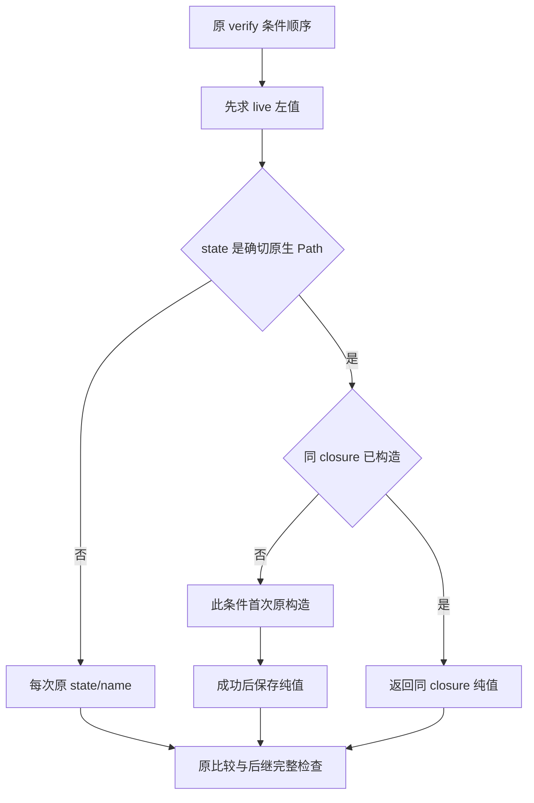
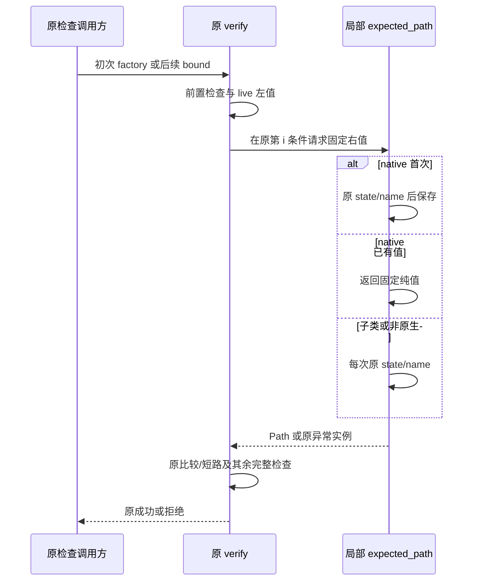

# Git 原宿主授权检查的固定期望路径复用详细设计

## 1. 变更摘要

| 项目 | 内容 |
|---|---|
| 需求 | 减少高频完整宿主检查中的纯 Path 右值构造，不降低认证 |
| 当前问题 | 同 closure 每次 verify 重建四个固定期望路径 |
| 交付结果 | exact-native Path 在原条件位置首次懒构造并在同 closure 复用；子类原样逐次构造 |
| 影响模块 | 仅 product_config.git_user_authority 的内部实现 |
| 兼容/发布/回滚 | 签名、错误、配置、数据与所有安全检查不变；无迁移，源码可独立撤回 |

这是一项纯值优化，不是缓存 Owner、文件身份、数据库连接或授权。同步响应性 P1 仍开放。

## 2. 需求背景与证据

[成本研究](../research/git-prepared-cost-attribution.md)显示原完整回读在插桩窗口有约149百万调用，
高频 SQLite 与物理检查是主要自耗；四个右值构造也有重复成本。该原剖析60秒超时保持，不与无 profile 样本混算。
独立原快照 `faec7a017e801dd5376fdb1ca0fb6490c67ef4ba` 与单文件候选各执行一次实际 full-check SDK 回读：
990,412→8次右值构造；壁钟35.719→31.602秒。每种原重控计数相同、各自只读数据/MAC不变。
单次有计数包装，不是稳态 SLA 或全面安全等价。候选最大事件循环间隔仍约14.300秒，不能关闭 P1。

## 3. 设计目标、非目标与验收标准

目标：同 factory 的四个 native 期望值只构造一次；每次仍读取所有 live 左值；保持首轮构造时点、
短路、错误实例；子类覆盖 `/` 的副作用每次保留；原实际全检查与60/120秒预算不变。
验收分别用纯绑定单测、原 verify AST 对照和实际 SDK 重控计数/只读摘要；不把模拟分配对象当认证实例。

非目标：减少 callback/stat/SQL/Owner/MAC；缓存 URI、resolve 或连接；异步分层控制；
启用 approved Writer；关闭B4/B7；刷新Turn；Windows 原生实跑或1.0质量验收。

## 4. 当前实现与根因


`require_git_user_authority` 已冻结 state 与原 Store/Reader/Scope 引用；重复的是不可变词法值，
不是实际宿主属性或物理观察。预先构造四项会把异常移到更早拒绝之前，因此不采用 eager 初始化。

## 5. 方案与变更后总体架构



替代方案：eager 构造改变错误顺序，拒绝；全局 LRU 延长生命周期并跨宿主共享，拒绝；
直接改成字符串可能改变 Path 比较/子类语义，拒绝；exact-native 懒构造有最多四项局部字典成本，采用。

## 6. 正常、失败与恢复时序



更早条件失败不构造后续右值；构造抛异常不写字典；live 左值异常不提前构造右值。
无持久状态或恢复动作，失败继续原调用方取消/事务保全流程，不捕获后重试。

## 7. 领域契约、数据结构与接口设计

| 字段/符号 | 生命周期和含义 |
|---|---|
| `state` | 原 session.path.parent 捕获值，未加 absolute/resolve/物理读 |
| `native_state` | exact type in PosixPath/WindowsPath；不是 isinstance |
| `expected_paths` | 当前 factory closure 内最多四个固定词法值；不可用作证明 |
| `expected_path(name)` | 私有helper，调用点只有四个固定名称；先构造成功后存入 |
| 四个 live 左值 | session.path、transactions._root、audit._path、plans._path；每次仍从原对象求值 |

没有持久字段、Schema、公开接口或配置变更。relative Path 也只按旧词法拼接，不由 cwd 决定右值。

### 7.1 接口设计

`require_git_user_authority(session, router, transactions, ports, reader) -> Callable[[], None]`公开签名不变，
返回同次可复核的原宿主检查函数。新增helper `expected_path(name: str) -> Path`仅在closure内部调用，
不导出，不接受调用方填充expected_paths，不返回Proof。

## 8. 状态、事务、并发与幂等

字典不是业务状态或认证缓存；每个 factory 新建，原引用绑定和首末 verify 不变。
同步函数没有新增 await/后台线程；不跨操作共享。没有数据库事务、租约、恢复或 UNKNOWN 解释变化。
不声称本纯值生命周期成为跨库/Git 锁，也不从某次成功 verify 推论后续仍获授权。

## 9. 安全、隐私与可观测性

全部 PublicationScope/Store/Reader 身份、原 Owner、freshOwner、physical、MAC、外callback及终端检查保持。
URI/连接/授权未缓存，无新日志、Metric、Secret 或端口。路径值不外发、不写验证日志正文。
只接受标准 native Path 的公开纯值语义；不声称全局 monkeypatch、反射改写 Path 私有字段/closure、
极端分配 MemoryError 下任意行为都等价。这些输入不能被提升为有效产品授权。

## 10. 核心伪代码

```text
在原 factory 冻结 state 后建立空 closure 字典
expected_path(name):
    非确切 native Path -> 原 state/name
    尚未保存 -> 在原条件位置执行 state/name，成功后保存
    返回同 closure 的固定纯值
verify:
    原所有前置条件
    live 左地址 != expected_path(原固定名称)，顺序不变
    原其余完整条件
```

## 11. 实施切片

先独立 tracked archive 候选/原基线；RED 保留1 FAIL/17 PASS；后续40短测和两次各自SDK通过。
主仓独立审阅后合入原单文件差异，并增加不依赖私有路径的39项回归；原完整实际控制/Owner定向矩阵60项随后通过，其中39项纯路径重复；整套1498.19秒，原单操作60秒/Turn120秒不变。
这21项新增控制/Owner节点与主仓另903项去重合计924；不是完整SDK或三平台验收。
原已保存profile、layered研究和失败不覆盖；layered仍未合入。主仓最终结论以新原件为准。

## 12. 源码与测试映射

| 变更 | 源码/符号 | 对应验证 |
|---|---|---|
| 四右值复用 | [git_user_authority.py](../../src/harnessix/product_config/git_user_authority.py)，`require_git_user_authority/expected_path` | [纯路径测试](../../tests/product_config/test_git_authority_pure_paths.py)，native 构造次数、四live地址及子类回退 |
| 错误顺序 | 同文件原 `verify` 布尔树 | 首构造位置、前置拒绝零构造、六类异常三个位置原实例 |
| 原完整认证 | [宿主](../../src/harnessix/product_config/git_delivery_review_host.py)与[Ledger](../../src/harnessix/product_config/git_prepared_link_ledger.py)未改 | [controls](../../tests/product_config/test_git_prepared_link_controls.py)、freshOwner、runtime fence及Owner observer |

## 13. 风险、部署、兼容与回退

候选读31.602秒仍有长同步窗口；当前改动不能承担协作取消整改，P1保持。
候选只在macOS实测一组，未关闭全部矩阵/Windows/原生反射边界。精确回撤一文件及其测试即可恢复原构造，
无数据回滚；不能把已捕获纯路径替代现实时点物理复核。正式决定Writer在B4/B7等门禁关闭前保持停用。

## 14. 实现偏差与最终结论

主仓采用候选相同 source 差异；新增回归从私有原/候选对照适配为独立当前行为测试，
私有完整对照/AST证据不因适配变为主仓新测试成绩。源码优化范围仅纯值，不改变控制语义或减少认证次数。
该必要性能增量可独立维护，不能以单样本收益宣称生产响应性、安装、实际编码质量或商用发布完成。
