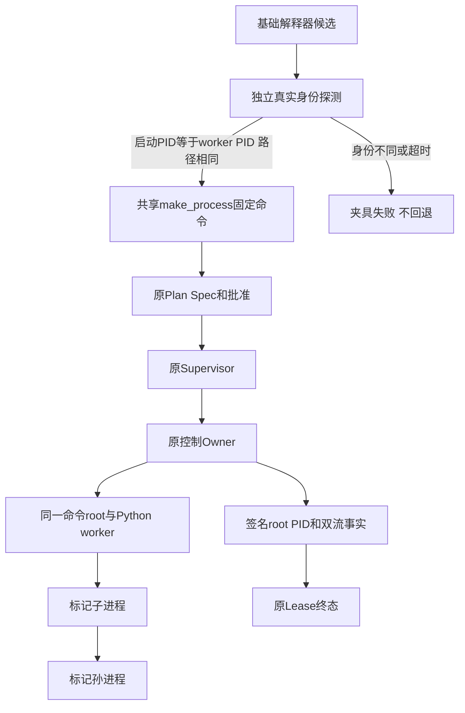
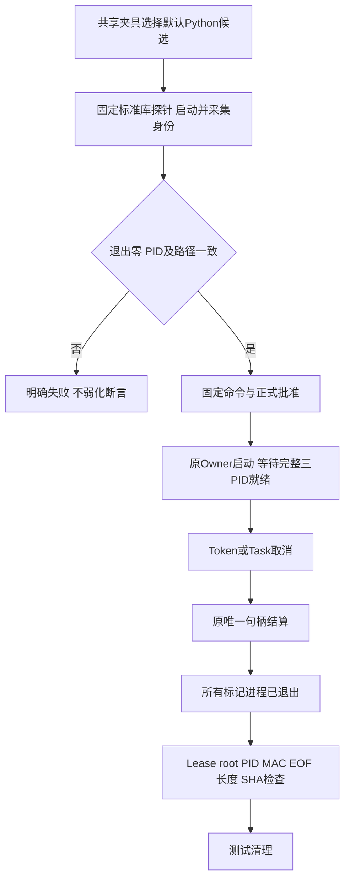
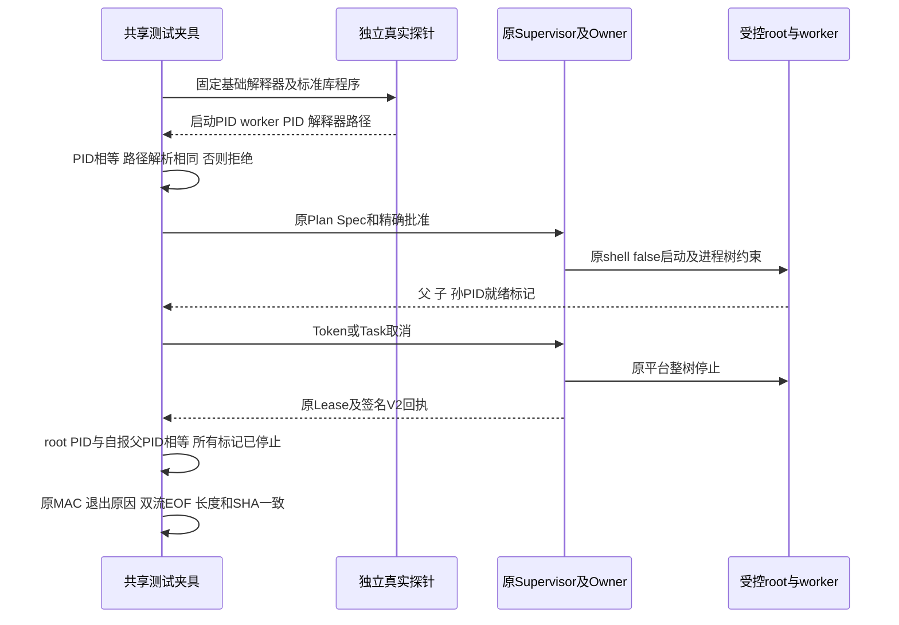

# 0.9 R4 Git 取消测试的 root PID 与解释器身份合同

## 1. 需求背景

提交 `4e66135` 的 [Windows 原生作业 110054323389](https://github.com/carrie1988/Harnessix/actions/runs/36764263388/job/110054323389) 在取消参数 `token`、`task` 的 `lease.pid == pids[0]` 断言失败，分别观察到 `7336 != 8964`、`3108 != 5780`。作业中的 Git 读取步骤成功；raw/Git 基准步骤记录 `375 passed, 6 skipped, 2 failed`，后续步骤跳过。不能把单个步骤的成功扩大为整个 Windows 作业成功。

原共享夹具以 `sys.executable` 作为 Python 测试命令。Windows 虚拟环境的 `Scripts/python.exe` 可以是 redirector：Owner 启动它，redirector 再创建运行测试程序的解释器 worker。Owner 的 `Popen.pid` 与 worker 的 `os.getpid()` 因而不是同一进程身份。固定版本 [CPython 3.12.10 Windows launcher](https://github.com/python/cpython/blob/v3.12.10/PC/launcher.c) 的 `VENV_REDIRECT`、`CreateProcessW` 与等待子进程退出路径支持这一解释。

两个失败发生前，`_wait_stopped(pids)` 已通过父、子、孙三个标记 PID 的退出检查，Lease 的 `exited/cancelled` 断言也已通过。原始日志证明的是 PID 等值合同失败，而不是这些标记进程没有收回。实际 runner 的 launcher 二进制与父子关系追踪未采集，redirector 对该历史运行的归因仍属于源码支持的推断。

## 2. 设计目标与非目标

- 默认 Python 夹具选择经过真实进程身份探测的基础解释器，使测试命令 root 与 Python worker 明确为同一 PID。
- 修复置于共享 `make_process`，所有通过 `python_code` 且不显式覆盖 `executable` 的调用者获得相同绑定；进程树程序及调用接口保持不变。
- 保留 `lease.pid == pids[0]` 强断言，并检查 Lease 与签名回执中的同一 root PID、退出状态、取消原因、完整输出 EOF 与摘要。
- 保留原执行审批、Executable/CWD 漂移拒绝、unknown 失败关闭与禁止自动重放规则。

非目标：改变生产 Supervisor/Owner、生产 Git 材料读取、CI、输入/输出预算或业务材料通道；不增加发行包能力，不把本机测试表述为 Windows 11、完整 R3 或商用验收。

## 3. 总体架构与身份分层

历史夹具可能形成：

```text
Supervisor 的控制 Owner
  -> 被 Owner 启动的命令 root：venv redirector（Lease.pid / receipt.pid）
       -> Python worker（parent.pid 中的 os.getpid()）
            -> child.pid
                 -> grandchild.pid
```

`Lease.pid` 表示受控命令 root，不是控制 Owner 守护进程本身的 PID。将 worker 的自报 PID 写回 Lease，或者删除等值断言，都会绕开原身份合同，因此不采用。

修复后默认 Python 测试命令形成：

```text
基础解释器候选 sys._base_executable
  -> 独立短进程：启动 PID == 自报 PID，解析后路径 == 候选路径
  -> make_process 固定解释器和测试程序前缀
  -> 原审批 Plan / ProcessSpec / Supervisor / Owner
  -> 同一命令 root / Python worker
       -> child.pid
            -> grandchild.pid
```

选择直接解释器而不是在测试中放宽 launcher/worker PID 等值规则，避免额外维护进程关系查询、重定向器 PID 发现与两套取消身份合同。基础解释器不是仅凭路径名称被信任，实际短进程探测失败时夹具立即失败。

## 4. 流程与时序

1. `make_process(python_code=...)` 在默认 executable 分支调用 `_verified_base_interpreter()`；显式传入的 executable 分支不变，真实 Git 默认分支也不变。
2. 严格解析 `sys._base_executable`；以固定 `-I -c` 探测程序启动真实进程，标准输入关闭，收集 JSON 身份。
3. 验证进程退出码为零、worker 自报 PID 等于 `Popen.pid`、自报解释器解析路径等于所选路径。探测超时先终止并等待该探测 root，再失败；没有回退到未经验证的 venv launcher，也不跳过测试。
4. `_GitRunner` 绑定验证后的解释器，沿用既有固定前缀、command identity 与执行审批构建。探测只验证测试夹具的候选解释器，不替代生产启动前后的命令绑定检查。
5. `_tree_program()` 报告父、子、孙 PID。`_live_tree()` 仍以全部标记和实际存活作为就绪条件，不以固定睡眠替代就绪证明。
6. 发出 token 或 Task 取消，等待预期取消异常与原执行句柄结算；正式退出检查在 emergency cleanup 之前完成。
7. 核验无 active Lease、`exited/cancelled`、Lease root PID 等于标记父 PID；核验原 `process_id`、spec digest、capability digest，以及 V2 签名回执的 PID、returncode、状态和取消原因。
8. 对 stdout、stderr 分别核验 raw 与观察流 EOF、无截断、完整长度与 SHA-256 一致；Owner receipt MAC 仍绑定原 Lease token、process ID 和 owner identity。

## 5. 接口设计

| 测试接口 | 入参与返回 | 责任及拒绝条件 |
|---|---|---|
| `_verified_base_interpreter()` | 无入参；返回严格解析的 `Path` | 从当前 CPython 基础解释器生成固定探测命令；只有启动进程与解释器身份一致才返回。 |
| `_assert_interpreter_identity(executable, root_pid, stdout)` | 预选路径、真实 `Popen.pid`、实际 JSON stdout；无返回值 | 拒绝 launcher/worker PID 分层以及解释器路径漂移；无效 JSON/字段也导致夹具失败，不产生可用绑定。 |
| `make_process(python_code=None, executable=None, output_redaction=None)` | 原接口不变；返回 `_ProcessCase` | 仅默认 Python executable 选择变化。显式 executable 负例保持原行为，不绕过其漂移拒绝验证。 |
| `_tree_program()` / `_live_tree()` | 原接口不变 | 父子孙 PID 报告、就绪、实际停止与应急清理保持原流程。 |

## 6. 数据结构与领域契约

| 字段/事实 | 来源 | 核验关系 |
|---|---|---|
| 探测 `pid` | 固定程序中的 `os.getpid()` | 必须等于独立探测 `Popen.pid`；不能接受转发 launcher 的 worker PID。 |
| 探测 `executable` | 固定程序中的 `sys.executable` | 严格解析后必须等于候选基础解释器路径。 |
| `PreparedGitProcess.command.argv` / `spec.argv` | 原固定命令与 ProcessSpec | 新正例验证两者相同且首项为基础解释器；不创建持久执行状态。 |
| `parent.pid`、`child.pid`、`grandchild.pid` | 实际测试进程 | 三个进程均先被证明存活，再被证明退出；父 PID 必须等于终态 Lease root PID。 |
| `Lease.process_id` / `process_spec_digest` / `capability_digest` | 原 Supervisor 持久记录 | 对应原 prepare 的 process ID、spec digest 和 capability digest。 |
| `Lease.owner_identity` / `owner_token` | 原 Supervisor 的 Owner 绑定 | 原 token 用于验 MAC；原 process ID、owner identity 用于回执身份核验。不会在报告中导出 token。 |
| `Lease.pid` / `receipt.pid` | Owner 发布的命令 root PID | 两者必须一致，且等于直接解释器自报父 PID；不重写 Lease。 |
| `state` / `stop_reason` / `returncode` | Lease 与 V2 Owner receipt | 两者为 `exited/cancelled`，returncode 一致；不能用正常完成吞掉取消。 |
| `raw_stdout/raw_stderr` 与 Lease 观察流 | 已认证回执与持久观察 | 两流 EOF；无截断；observed/persisted 长度与 SHA-256 一致。 |

## 7. 失败、取消、超时与 unknown

身份探测中的路径缺失、启动失败、退出码非零、无效 JSON、PID 或解释器路径不匹配都使夹具失败。探测的五秒上限只属于独立夹具启动验证，不修改 GitOperationBudget、业务命令 timeout 或 CI 步骤期限。

token/Task 取消后的 Lease 与 receipt 必须可验真。原 `test_mock_uncertain_settlement_overrides_outer_timeout_or_cancellation` 的五类结算异常与三种外部停止组合保持不变：终态未知、回执无效、输出损坏、控制失联、token 无效均必须优先产生 `git_process_unknown`，不能降级为普通 timeout/cancellation 或自动重放。本修复不改任何生产 unknown 判定。

应急清理只在夹具退出时兜底，不能作为正式进程已停止断言的证据。

## 8. 持久化与事务

不新增生产数据库、表、字段或回执版本。解释器探测仅执行标准库程序并通过 stdout 返回两项身份事实；创建 prepare 仍不得创建 Plan、Lease、Owner 或命令 marker。执行用例继续复用原 `execution-plans.db`、`process-owner/process-leases.db` 与原 runs 目录中的认证回执。测试工作状态限定在 pytest 临时目录，证据导出位于独立私有目录。

## 9. 安全、权限与信任边界

- 不调整 Lease 的真实 root PID，不把自报 worker PID 当作新的 Owner 权威。
- 默认固定解释器仍经原 `_GitRunner.verify_command` 与审批派生合同核验；显式 executable 替换负例不被自动替换为基础解释器。
- `read_owner_receipt` 和显式 `verify_owner_receipt` 校验原 MAC、process ID、owner identity；EOF/摘要核验是附加测试断言，不替代 MAC。
- 校验不能退化为“同一进程树即可”或“PID 非空即可”。路径、root PID 与原签名身份必须同时成立。
- 不输出实际 Owner token，不访问用户凭据或模型接口。新测试只使用临时程序与标准库子进程。

## 10. 可观测与错误分类

探测 PID 不匹配使用“解释器 worker PID 与启动 PID 不一致”，路径不匹配使用“解释器路径绑定不一致”，探测超时使用“基础解释器身份探测超时”。这些是测试失败诊断，不增加产品错误码或产品界面文案。

独立证据保存精确 selector、命令、平台/Python 版本、运行时间、JUnit 逐项结果、修改前后测试文件摘要和限定 diff。原 Windows 失败与本机成功分开保存；本机成功不覆盖历史失败结论。

## 11. 测试、验证与验收

独立夹具覆盖：

1. `test_python_fixture_binds_verified_base_interpreter`：共享默认绑定指向经探测的基础解释器；command/spec argv 相同；prepare 不创建执行状态。
2. `test_python_fixture_probe_rejects_nonmatching_process_identity[forwarder]`：真实 Python launcher 转发给真实 worker，自报 PID 与 launcher PID 不同，验证器必须拒绝。
3. `test_python_fixture_probe_rejects_nonmatching_process_identity[different-executable]`：真实探测 root PID 相同，但预选解释器路径不同，验证器必须拒绝。

真实回归保留取消 `[token]`、`[task]`，关联 command timeout、共享操作预算 timeout、busy、close、precancelled、Executable/CWD/命令漂移拒绝、真实 Git stdin、V2 raw 输出与脱敏拒绝。unknown 的十五个组合单独保留其模拟边界：它们证明错误优先级，不声称证明真实进程回收。

本机平台为 macOS / CPython 3.12.7；精确 selector 与结果以私有证据包的 JUnit 和结构化 summary 为准。不运行整个项目测试、不运行新材料测试文件、不运行源码外安装、不构建或冻结 Wheel。所有复用共享 `make_process/_tree_program` 的取消调用者继续保留强 PID 断言；其关联回归与未来原生 Windows 候选必须另行证明。

2026-10-01 的限定本机验证：核心选择器 `5 passed`，关联选择器 `36 passed`，均无失败、错误或跳过。核心五项是关联三十六项的子集，不相加为四十一项独立用例。关联集合包含十四项真实 Owner 执行相关、三项夹具身份验证、四项禁止启动负例和十五项模拟 unknown 错误优先级用例。该结果来自未提交修改工作树，不是冻结源码、Wheel 或 Windows 原生候选的证明；元数据 `code_revision` 标记修复基线，补丁内容由证据中的文件摘要绑定。

## 12. 源码映射与完整调用链

| 位置 | 责任 |
|---|---|
| [`test_git_delivery_process.py`](../../tests/product_config/test_git_delivery_process.py) 的 `_verified_base_interpreter`、`make_process` | 固定并核验基础解释器；复用原 `_ProcessCase`。 |
| 同文件 `_plan`、`_checkpoint`、`_tree_program`、`_live_tree` | 原 V2 approval、capability、Workspace snapshot、进程树就绪与清理。 |
| [`GitDeliveryProcess`](../../src/harnessix/product_config/git_delivery_process.py) 的 `prepare/run/_execute_process` | 原 prepare/plan 验证与执行结算；本修复不改生产端口。 |
| [`git_command.py`](../../src/harnessix/delivery/git_command.py) 与 [`_GitRunner`](../../src/harnessix/delivery/git.py) | 固定 executable/CWD/environment/argv 身份；启动前后验证原命令。 |
| [`supervisor.py`](../../src/harnessix/processes/supervisor.py) | 原审批执行绑定、Lease、Owner 控制与终态回执读取。 |
| [`windows_owner.py`](../../src/harnessix/processes/windows_owner.py) 的 `_launch/_publish` | `Popen(shell=False)` 启动 root 并分配 Job Object；发布 `self.process.pid`。 |
| [`posix_owner.py`](../../src/harnessix/processes/posix_owner.py) | 本机真实 POSIX Owner 与命令进程树执行。 |
| [`owner_receipt.py`](../../src/harnessix/processes/owner_receipt.py) 的 `read_owner_receipt/verify_owner_receipt` | 原 process ID、owner identity 与 MAC 验证；V2 raw 流事实。 |
| [`supervision_contracts.py`](../../src/harnessix/processes/supervision_contracts.py) 与 [`supervision_store.py`](../../src/harnessix/processes/supervision_store.py) | 原 ProcessSpec、Lease 和持久加载/active 状态。 |

调用顺序为：`make_process -> 真实解释器探测 -> _GitRunner -> prepare -> _plan/_checkpoint -> run/_execute_process -> Supervisor.start -> 原平台 Owner -> 签名 receipt -> Lease 结算 -> 三个 PID 退出检查 -> root PID/MAC/EOF 断言`。生产侧保持原实现，本设计只规定测试夹具与取消验收事实。

## 13. 部署、兼容与回退

补丁只涉及该测试文件与本独立设计文档，不引入依赖、不修改生产源码、CI 或发行预算。默认真实 Git 路径选择和显式 executable 测试参数保持兼容。测试程序仅依赖基础解释器标准库，不依赖虚拟环境中的第三方包。

移除夹具修复会重新引入 Windows venv launcher/worker PID 混淆，不能通过移除 PID、MAC 或 EOF 断言替代回退。补丁不是 Wheel 冻结、安装回归或原生 Windows 通过证明。

## 14. 风险与取舍

基础解释器来自当前 CPython 的 `sys._base_executable`；候选不存在、仍为转发器或路径/PID 检查不通过时，夹具失败关闭而非回退。每个默认 Python case 多一次短进程探测，属于测试 setup 开销，不更改生产启动路径与业务预算。

独立真实 forwarder 负例可在本机验证身份分层和拒绝行为，但不等同于验证未来 Windows runner 的具体二进制。必须保留未来原生 Windows 与共享调用者的独立回归边界；源码外安装和完整业务验收另行执行。

## 15. 架构、流程、时序与身份数据图



此图区分控制Owner、受控命令root和程序worker。探测只选择测试程序解释器，
正式Plan/Spec、Lease和Receipt仍由原生产执行链构造，不能用探测结果代替其验真。



正式退出和回执断言必须先于应急清理执行；应急清理不能把生产取消失败掩盖成通过。
unknown仍由生产失败关闭规则处理，不进入已知退出成功路径。



身份数据只用于测试验真，不写回生产Lease，也不重签原回执。未来Windows候选必须真实执行该链，
不能将本机探针或已跳过的用例视为Windows通过证据。
