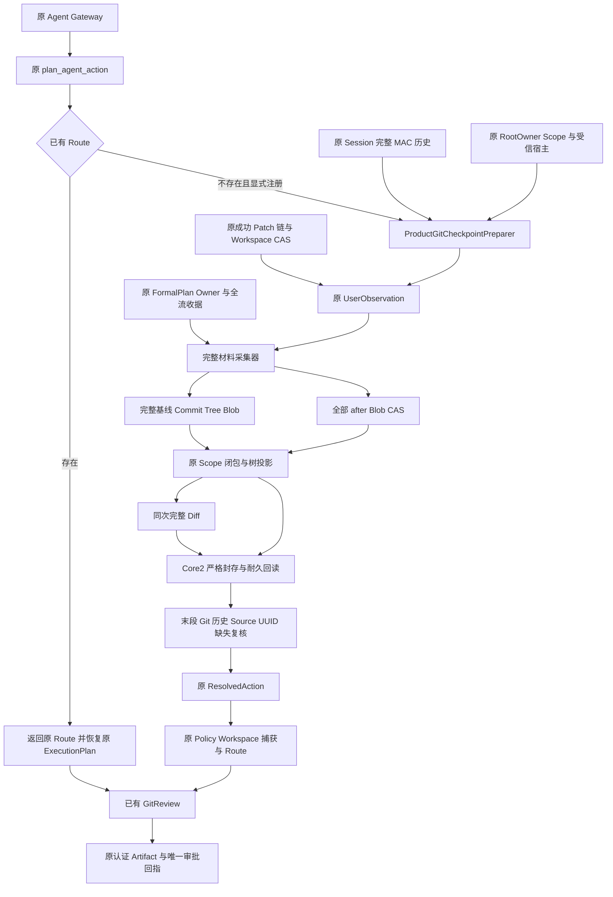
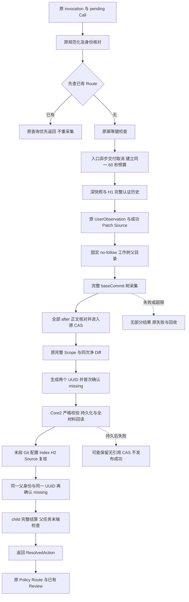
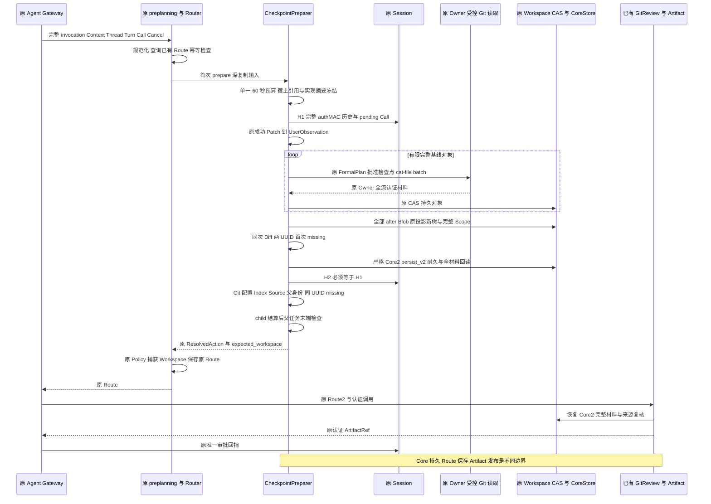
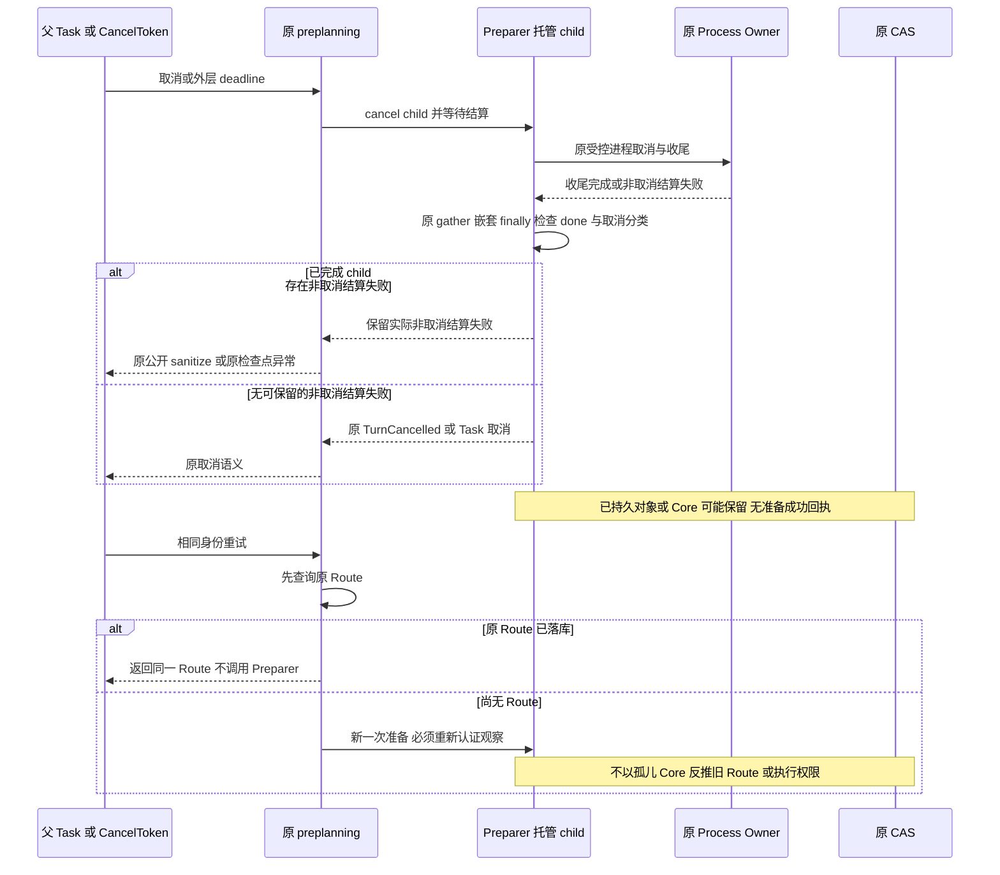
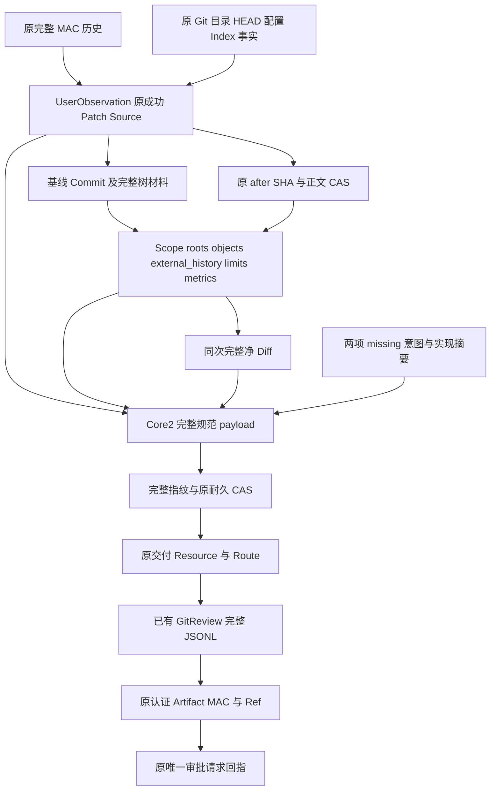

# 原认证 Git Checkpoint 准备链详细设计

## 1. 文档摘要与需求背景

### 1.1 版本与实现状态

本设计描述原 Agent 可信准备入口中的 Git Checkpoint 内部实现，覆盖真实用户观察、完整对象材料采集、对象范围组装、Core2 持久化，以及与原 Route、已有 Git Review 的衔接。

| 项目 | 当前边界 |
|---|---|
| 已提交基础版本 | `29402f764eae88d50364a37817635fbb77ba907b` |
| 设计版本 | 版本 2，2026-10-07；以第 19 节列出的源码内容摘要固定实现 |
| 基础版本与增量的关系 | `code_revision` 标识共同基础，不表示新增准备源码或既有源码微调已包含在该提交中 |
| 主要增量 | `git_checkpoint_preparation`、`git_checkpoint_materials`、`git_checkpoint_scope` 三个模块 |
| 既有模块调整 | InventoryWire 增加内部字段投影选项；CancelToken 增加可选失败保留；Agent preplanning 显式启用失败保留 |
| 对外启用状态 | 默认未注册 Checkpoint 准备器；内部组件可由受信装配及测试夹具显式接入 |
| 成功含义 | 返回经复核的准备资源，随后由原 Router 进行策略判断、形成 Route，并由已有 Review 发布认证 Artifact |
| 不包含的成功含义 | Git 业务执行批准、默认写工具上线、A/T2/D 写入、独立 Commit、业务 Backup2 或商业验收完成 |

### 1.2 需求背景

已有 Core2 和正式 Git Review 能够表达、恢复和审阅完整交付事实，但声明级材料组装不能证明材料来自同一次原认证调用。若准备入口只接收调用方构造的 Core 或只采集变化文件，将缺少以下必要证据：

1. 传入 Thread、Turn、Call 与原 Session 完整认证历史一致，且 Call 确实仍待执行。
2. Patch 引用属于原成功 Patch 链，连续变更和当前最终文件版本一致，而非任意文件声明。
3. 读取命令、Session、PlanStore、Workspace Scope、RootOwner 和保护端口属于同一实际宿主。
4. 基线提交及其完整树、全部变更后正文均可由同一原 CAS 回读；未变化文件没有被遗漏。
5. 材料采集后，HEAD、配置、Index、物理目录、历史、Source 和工作树意图仍保持原观察事实。

因此，准备器只补齐“真实调用到耐久 Core2”的纵向链，不新增执行器、审批器、认证体系或交付写入协议。已有 Review 的合同、原认证 Artifact 发布、分页读取和唯一审批回指继续由[正式 Git Review 设计](m09-r4-git-review.md)规定。

### 1.3 同步准备热路径的候选整改

后继 prepared 组件完整安装回归为 336 通过、5 失败。五项失败均发生在实际业务关联验证之前，
由 SDK 等待审批时的公开输入／输出保护超时或未授权相关 ID 返回触发；不得将其归为 CAS 损坏，
也不能以单例诊断通过覆盖完整失败。单例 `cProfile` 诊断记录准备实现摘要调用 86,771 次、
固定相对路径重建 347,420 次；插桩本身增加运行成本，该诊断不是生产任务耗时或 SLA。

整改只移除重复不变的路径计算：模块装载时形成私有 `_PREPARATION_SOURCE_PATHS`，
保存原四个规范字段名和对应安装 `Path`；POSIX／Windows 字段分隔符沿原 `str(Path(...))` 规则。
每个原检查点仍执行四次 `read_bytes`、四次完整 SHA256 及原 `canonical_digest`；
不缓存文件正文、SHA、mtime、size 或批准，也不降低检查点频率。
四份源码在相同长度、相同 mtime 下改变字节时，摘要仍须改变；源文件读取失败仍为原固定准备错误。

流程仍为：原检查点 → 原预算／取消／宿主／引用检查 → 四文件完整字节摘要 → 与冻结值比较。
没有新线程、后台任务、SQL、持久数据结构或协议字段；原 60 秒准备期限及 10 秒公开保护期限不变。
对应回归见 [`test_git_checkpoint_preparation_digest.py`](../../tests/product_config/test_git_checkpoint_preparation_digest.py)。
此修复的实际 SDK 和固定 Wheel 全套结果由[组件验证](../validation/git-prepared-link-2026-10-07-v1/README.md)
区分候选记录；最终一致候选尚未通过时，不关闭业务交付或商业发布门禁。

## 2. 设计目标、范围、非目标与验收标准

### 2.1 设计目标

| 目标 | 必须成立的事实 | 验证依据 |
|---|---|---|
| 原认证归属 | 首末读取实际 Session 完整 MAC 历史；匹配同一 Thread、Turn、pending Call 和原 invocation 构造规则 | `_history`、真实准备测试、原 preplanning 调用归属测试 |
| 原宿主一致 | RootOwner、Session、Router、原事务库、Reader、Scope、Process Host 与 PlanStore 不被替换 | `_preparation_control`、`_verify_host`、材料采集控制点 |
| 原成功 Patch 来源 | UserObservation 从原成功 Patch 链生成，并在末段只读复核完整 Source | `collect_product_git_user_observation`、`verify_git_delivery_source` |
| 有限且完整材料 | 采集完整 baseCommit 树和全部 after CAS；超限拒绝，不截断、不采样 | 实际准备测试、Scope 完整性与精确容量边界测试 |
| 同次 Scope 与 Diff | 从原树投影得到同次完整净 Diff，再核验实际对象图、角色、指标和外部父边 | `build_product_git_checkpoint_scope` 与原闭包验证器 |
| 耐久 Core2 | 严格 Core2 合同、完整字段指纹、原 512 KiB 上限、耐久 CAS 回读与全材料回读 | `_persist_core` 与原 `ProductGitDeliveryCoreStore.persist_v2` |
| 原 Route 衔接 | 返回原 `ResolvedAction`；保持原 Policy、Workspace 捕获及 Route 查询优先 | `plan_agent_action` 及原 preplanning 回归 |
| 取消失败不丢失 | 显式托管调用在原 gather 的嵌套 finally 中检查已完成 child，仅保留非取消结算异常 | `CancelToken.run(..., preserve_failure=True)` 与专项结算测试矩阵 |

### 2.2 当前范围

正常链为：原 Session authMAC / RootOwner / Scope 与成功 Patch → UserObservation → 有限完整 baseCommit 树及 after CAS → Scope / Diff → Core2 耐久 CAS → 原 Route → 已有 GitReview 认证 Artifact。

这里的“完整”指本次对象范围内的完整材料和完整净变更，不指递归获取整个仓库历史。基线提交的直接父 Commit 只记录为外部历史边界；父对象及其祖先不进入本准备器的采集目录。

### 2.3 非目标与禁止推导

- 不默认注册 `git_checkpoint`，不修改默认 Planner、Executor 或产品 Policy。
- 不写 A、T2、D，不创建 anchor/delivery 工作树，不写用户 Index、Git 对象库、Ref 或提交。
- 不签发 Git 业务执行批准，不把 Core 指纹、Scope 摘要、命令读取授权或 Review Artifact 当作执行能力。
- 不增加 Session 表、Route 表、认证密钥、独立批准器、数据库迁移或后台任务。
- 不提供跨 Session、Router、CAS 和物理 Git 状态的原子快照或分布式事务。
- 不以声明级 Scope 测试替代真实认证链，不以离线 SDK 链路替代默认注册、真实部署或商业验收。
- 不将测试中的 `GitTreeClosureLimits(4096, 64 MiB, 4096, 128)`、`max_parents=3` 宣称为产品默认容量。
- 命令授权测试使用既有 FormalPlan 夹具及原批准检查点；它证明原受控读取合同可被消费，不证明默认 Policy 放行或 Git 业务批准成立。

### 2.4 验收判定

验收分别记录数据算法、实际认证准备链和原 Gateway 兼容性。成功路径应保留用户工作区及 Git 物理状态，返回可由原 Route 恢复的同一 Core 资源；失败路径不得发布部分 Review 或登记准备成功。发生 CAS 持久化后失败时允许保留无引用材料，不要求物理 CAS 回滚。具体运行结果必须以实际测试报告为准，本文不列推测的通过数量。

## 3. 源码研究、根因与架构决策

### 3.1 原实现的可复用边界

| 源码入口 | 研究结论 | 采用决策 |
|---|---|---|
| [原 Agent preplanning](../../src/harnessix/trusted_actions/agent_preplanning.py) | 已有异步 `agent_prepare`、调用规范化、先查 Route、原 Policy、真实 Workspace 捕获与并发结果校验 | 不另建 Router；新准备器仅进入首次准备分支 |
| [原 CancelToken](../../src/harnessix/agent/cancellation.py) | 原 `run` 会取消并 gather child；取消时若只回收任务，child 的非取消结算失败可能被取消表象覆盖 | 可选 `preserve_failure=False`；两处显式 `True`；gather 的嵌套 finally 核对 done/not-cancelled 并排除 `TurnCancelled` |
| [准备协调器](../../src/harnessix/product_config/git_checkpoint_preparation.py) | 实际入口可以获得原 Session、Router、CoreStore、Reader、Process Host 与 pending Call | 在入口内建立单一预算、深快照、首末认证和宿主冻结 |
| [材料采集器](../../src/harnessix/product_config/git_checkpoint_materials.py) | 原对象读取端口支持正式命令计划、原 Owner 全流收据与固定 `cat-file --batch` | 按 OID 读取完整对象，不用普通命令输出或未经认证的摘要替代材料 |
| [Scope 组装器](../../src/harnessix/product_config/git_checkpoint_scope.py) | 原投影、闭包、Inventory 材料验证可生成完整范围与同次 Diff | 只组装数据和持久化新树，不承担 Session 认证或权限签发 |
| [原 InventoryWire](../../src/harnessix/delivery/git_inventory_wire.py) | 公开规范字节使用 `name_hex`，Core 内嵌模型需要原字段 `name` | `_wire` 默认保持旧字节；仅 Core 内嵌调用使用 `native_fields=True` |
| [原 CoreStore](../../src/harnessix/product_config/git_delivery_core_store.py) | 已有严格 Core2 的内容地址持久化及读取边界 | 使用 `persist_v2`，不另建 Core 数据表或扩大原 512 KiB 上限 |
| [已有 Git Review](../../src/harnessix/product_config/git_delivery_review.py) | 已有 Route/Core 恢复、来源复核、正式 JSONL、认证 Artifact 与原审批衔接 | 准备器不发布 Artifact，只提供原资源供后续 Review 消费 |

根因不是缺少第二套模型或审批器，而是声明材料与真实认证调用之间缺少受控采集、首末事实复核和耐久封存。新增职责沿三层拆分：协调认证和宿主边界、采集完整对象材料、复用原算法组装 Scope。

### 3.2 关键取舍

| 候选方案 | 优点 | 缺点或风险 | 决策 |
|---|---|---|---|
| 仅采集变化路径 | 读取量少 | 无法证明未变化子树、完整 target 树和闭包；遗漏可能被误当完整交付 | 不采用 |
| 递归采集父提交历史 | 材料覆盖更广 | 历史无界、额外权限和成本、改变原业务范围 | 不采用；只保留直接父边 |
| 新建 Git 专用准备 Router | 可独立编排 | 重复原身份、Policy、幂等和审计规则 | 不采用 |
| 将 Scope SHA 当作认证 | 接口简单 | SHA 只证明字节，不证明调用、Owner 或批准 | 不采用 |
| 一次预算贯穿所有准备步骤 | 失败边界明确，不能通过多阶段重置延长 | 大仓库可能被完整性与期限门禁拒绝 | 采用 |
| Core 写入后再次验证 | 能拒绝采集期间变化 | 失败可能留下 CAS 孤儿，无法承诺跨资源原子回滚 | 采用，明确恢复边界 |
| 全局改变取消优先级 | 使用方便 | 影响旧调用者的既有取消语义 | 不采用；仅可选参数和显式托管调用 |

## 4. 总体架构与模块边界



图中的新实现只有 C、M 和 Scope 组装适配层。Session 认证、成功 Patch 事实、Workspace CAS、对象解析、树投影、原策略、Route、GitReview 和 Artifact 发布继续使用既有实现。Scope 与 Diff 没有认证能力；可信性来自上游原认证与宿主边界，完整性来自原 CAS 和闭包验证。

准备器收到的是受信宿主资源引用，不从模型参数获取路径、Owner、策略或授权函数。其输出只含原交付资源、原 Workspace 资源请求和完整 expected Workspace；后续 Router 仍须按原规则处理这些数据。默认无注册时，原 `router.plan` 路径不经过新准备器。

## 5. 核心流程与控制顺序



### 5.1 入口与认证

`_prepare_entry` 首先 `await asyncio.sleep(0)`，让进入时已经挂起的父 Task 取消有机会交付，再检查实际 `CancelToken`、`ActionPlanningContext`、CoreStore 和 Process 端口类型。之后创建 `GitOperationBudget(_BASELINE_TIMEOUT_SECONDS)`；生产常量为原 60 秒，不按阶段重新分配。

`_prepare` 使用原 `_snapshot` 对 Thread、Turn、Call、`ProductGitCheckpointInput`、invocation 和 binding 作严格深快照。它核对注册定义的 `agent_prepare is planner`、binding、工具名 `git_checkpoint`、原 `build_agent_action_invocation(..., requires_idempotency=True)` 结果，以及参数 JSON 与完整 Call 参数的一致性。仅调用 UUID 相同不构成认证。

H1 通过原 `authenticated_thread_history` 读取完整认证历史，携带相同 CancelToken、绝对 deadline 和 checkpoint。读取结果必须与提供的 Thread、对应 Turn 一致，并通过 `ToolExecutionScope.for_pending_call`。末段 H2 必须与 H1 完整相等，既拒绝认证篡改，也拒绝期间合法追加造成的历史变化。

### 5.2 UserObservation 与受控完整读取

UserObservation 由[原用户观察实现](../../src/harnessix/product_config/git_user_observation.py)生成，消费实际 Session、成功 Patch 引用、原 Router、原事务库、Reader 和 SnapshotPorts；不是本准备器构造另一套基线。原认证和来源规则保持，包括连续 Patch 链、净变更、最终版本以及原 Root/Owner/Scope 约束。

`worktree_parent` 必须是绝对路径，并位于 Session 状态目录内；随后用原物理目录 pin/no-follow 实现固定父目录身份。词法路径包含关系不是唯一安全判断，物理身份和末段复核同时保留。

材料采集从 `baseline.head_oid` 的一个 Commit 开始。每个对象均通过原 `prepare_object_read`、`_authorize_read` 和 `port.run` 完成：固定命令 `cat-file --batch`，使用原正式命令 Plan 和批准检查点，由原 Owner 的全流认证收据证明实际完整材料。返回对象必须是准确的 `GitObjectMaterial`，其类型、OID 和格式与请求逐项一致。

遍历只展开基线 Commit 的树以及树的全部后代 Tree/Blob。Commit 的直接父边由原解析器保留原顺序，但不压入读取队列；不运行递归历史采集。允许树项模式为 `40000`、`100644`、`100755`；其他模式拒绝，不通过忽略符号链接或子模块来伪造完整树。

### 5.3 完整 after CAS、投影与意图

所有 `source.mutations` 的 `after.presence == "file"` 正文都从原 Workspace CAS 读取，核对 SHA256 和字节数后转为对应 Git 对象格式的 Blob，并持久到同一原 CAS。缺失或不匹配立即失败；删除项没有 after Blob。采集层按 OID 去重，组装层继续按原规则验证完整、准确的 after 目录，不接受多余、重复或缺失材料。

Scope 层调用原 `prepare_git_tree_diff`，验证 before OID/模式、完整 base 树和净 Mutation；完整 target 树由原投影产生。基线目录允许包含显式 base Commit，但不能夹带其他历史或无关对象。整个对象并集先经过容量核对，再把投影生成的新 Tree 原样写入 CAS，并以原闭包及 Inventory 材料算法重新核验。

两个 `ProductGitWorktreeIntent` 分别表达 `anchor` 和 `delivery`。它们使用两个新 UUID、同一固定父路径和父身份、同一平台及基线 Commit；只是未来意图。首次检查及 Core 持久后的末次检查都要求这两个**相同 UUID** 的子项为 `missing`。已有文件、目录、符号链接，包括指向不存在目标的符号链接，均不得被当作缺失；失败不重新挑选 UUID。文件或目录由准备器判为 `git_checkpoint_preparation_invalid`；符号链接先由原 NativeRoot no-follow 观察以 `workspace_path_denied` 拒绝，不能将三者统一改写为准备器错误。

### 5.4 Core2 与末段事实复核

`_persist_core` 使用完整 Call、UserObservation、两项意图、完整对象 Scope、同次 Diff 摘要/字节数和实现摘要形成 Core2。`checkpoint_delivery_id`、`commit_spec` 均为 `None`。先以原 `canonical_digest` 计算完整 payload 指纹，再进行严格 Core2 JSON 校验、原 `persist_v2` 持久化和原全材料回读，不返回只含 SHA 的替代品。

末段重新定位并 pin 原 Git common/admin 目录，逐项比较物理目录事实，核对 HEAD、配置摘要及逻辑 Index，读取 H2 完整认证历史，调用原 `verify_git_delivery_source` 只读复核当前 Source，最后比较物理 Index 文件观察。整个复核不重捕获 Source，不补写成功 Patch，不更新用户 Git 状态。

Source 变化不必等到末段 Git Source 验证才被发现。实际读取前，原正式 ExecutionPlan 会先核对完整 Workspace；已变化的 Source 可首先以 `execution_plan_stale` 拒绝，且不启动失效对象读取。该较早失败与末段来源错误是不同层级，应按实际发生位置分类。

固定工作树父目录在该阶段仍被持有；原 UUID 缺失事实再次核对后才退出 pin。child 结算完成后，父任务再次执行取消、deadline、宿主和实现摘要检查，返回前不新增异步步骤。首次生成的结果此时仍不是 Route，也不是业务批准。

## 6. 正常、失败与恢复时序

### 6.1 正常时序



时序中的正式读取命令批准只覆盖对象读取过程；最后的审批回指属于已有 Review/Gateway 链，不由 Preparer 签发。原 Policy 在准备结果产生后执行，准备器不能改变 binding、执行器或策略判定。Review 继续执行其自己的认证、来源、全文保护与分页门禁，不能因为准备成功而跳过这些步骤。

### 6.2 取消、结算失败与持久后恢复



外层取消、原进程终止和 child 结算是不同阶段。`preserve_failure=True` 不将未知结算伪装成成功，也不创建新的恢复写入器；它仅在 child 已完成、非 cancelled 且异常不是 `TurnCancelled` 时保留实际失败。child 的领域取消不作为额外结算故障提升优先级；无可保留失败时，领域取消、父 Task 取消和外层 timeout 继续按原来源分类。

## 7. 数据流与证据归属



MAC、OID、SHA256 和规范指纹的职责不同：Session MAC 证明原历史认证；Owner 收据证明受控读取及完整流；Git OID 绑定对象类型、格式和正文；CAS SHA256 绑定存储正文；Core 指纹绑定完整声明；Artifact MAC 与原审批回指绑定正式审阅归属。任何单独摘要都不能代替这些证据链。

Core 保存 Diff 的摘要和字节数，不把不完整 Diff 片段当作全文。后续原材料算法能从完整 Scope/CAS 恢复同次 Diff，已有 GitReview 再按其正式合同发布完整正文。外部父边只承诺准确的直接引用，不承诺父 Commit 正文已被读取。

## 8. 模块、类与接口设计

### 8.1 职责划分

| 模块与关键符号 | 单一职责 | 不承担的职责 |
|---|---|---|
| `ProductGitCheckpointPreparer` | 将原认证 pending Call 协调为经复核的 Core2 准备资源 | Policy、业务批准、Git 写入、Review 发布 |
| `_preparation_control` / `_verify_host` | 冻结原宿主引用、原授权边界和准备配方，提供同一检查点 | 替换宿主、重绑定 Owner 或续期 |
| `_history` / `_verify_observation` | 首末完整认证历史和物理/逻辑 Git、Source 事实复核 | 修复历史、重捕获来源或补签 |
| `_capture_intents` / `_verify_intents` | 固定两项 UUID 意图及首末 missing 事实 | 创建工作树或生成占位文件 |
| `collect_product_git_checkpoint_materials` | 原受控读取完整基线对象，核对全部 after 正文 | 遍历父历史、写 Git 对象库 |
| `build_product_git_checkpoint_scope` | 原 CAS 数据深快照、树投影、完整范围及同次 Diff | Session 认证、命令批准或 Artifact 发布 |
| `_wire` | 有限已知模型的完整字段投影 | 对象正文存储、对象图认证、批准签发 |
| `CancelToken.run` | child 回收及显式选择结算失败保留 | 原 Process Owner 的终止与未知状态判定 |
| 原 `plan_agent_action` | 调用身份、查询优先、原策略、Route 与并发资源一致性 | 替代准备器内部 Git 事实复核 |

### 8.2 实际接口签名

```python
class ProductGitCheckpointPreparer:
    def __init__(
        self,
        session: SQLiteSessionStore,
        router: TrustedActionRouter,
        core_store: ProductGitDeliveryCoreStore,
        reader: GitReadRuntime,
        material_port: GitDeliveryProcess,
        worktree_parent: Path,
        *,
        binding: TrustedToolBinding,
        authorize: Callable[[PreparedGitProcess], Awaitable[GitRepositoryReadAuthorization]],
        limits: GitTreeClosureLimits,
        max_parents: int,
        snapshot_ports: WorkspaceSnapshotPorts,
    ) -> None: ...

    async def prepare(
        self,
        invocation: CodingActionInvocation,
        arguments: BaseModel,
        context: ActionPlanningContext,
        thread: Thread,
        turn: Turn,
        call: ToolCallContent,
        cancel: CancelToken,
    ) -> ResolvedAction: ...


async def collect_product_git_checkpoint_materials(
    port: GitDeliveryProcess,
    root: Path,
    baseline: ProductGitDeliveryBaselineV2,
    cas: GitMaterialCAS,
    *,
    authorize: Callable[[PreparedGitProcess], Awaitable[GitRepositoryReadAuthorization]],
    limits: GitTreeClosureLimits,
    max_parents: int,
    cancel: CancelToken,
    budget: GitOperationBudget,
    checkpoint: Callable[[], None],
) -> tuple[GitInventoryScope, GitTreeDiff]: ...


def build_product_git_checkpoint_scope(
    cas: GitMaterialCAS,
    baseline: ProductGitDeliveryBaselineV2,
    base_commit: GitObjectMaterialReference,
    base_catalog: tuple[GitObjectMaterialReference, ...],
    after_catalog: tuple[GitObjectMaterialReference, ...],
    *,
    limits: GitTreeClosureLimits,
    max_parents: int,
    checkpoint: Callable[[], None],
) -> tuple[GitInventoryScope, GitTreeDiff]: ...


def git_checkpoint_preparation_implementation_digest() -> str: ...


def _wire(
    value: object,
    checkpoint: Callable[[], None],
    *,
    native_fields: bool = False,
) -> JsonValue: ...


class CancelToken:
    async def run(self, operation: Awaitable[T], *, preserve_failure: bool = False) -> T: ...


async def plan_agent_action(
    router: TrustedActionRouter,
    invocation: CodingActionInvocation,
    context: ActionPlanningContext,
    thread: Thread,
    turn: Turn,
    call: ToolCallContent,
    cancel: CancelToken,
) -> ActionRouteSnapshot: ...
```

`prepare` 的协议参数声明为 `BaseModel`，实际内部快照要求准确的 `ProductGitCheckpointInput`；不能将宽泛签名理解成接受任意模型。上述 `_wire` 属于内部适配接口，不改变公开 Inventory 编解码函数签名。`CancelToken.run` 的 `preserve_failure` 只允许关键字传入。

### 8.3 宿主与上下文约束

`session`、`router`、原 Workspace 事务库、Reader 和 SnapshotPorts 必须通过原 `require_git_user_authority`。此外必须满足：

- 实际 Process Host 是 `GitProcessRuntimeHost`；其 PlanStore 与 `router._plans` 为同一对象。
- Process 的 protection 与 Session 发布事件保护端口、输出脱敏端口为同一对象。
- 原 runtime owner token 非空且未被替换；Process state 对应 Session 状态目录。
- `context.workspace_root == reader._root`、`context.cwd == "."`，不接收额外 external roots。
- `context.snapshot_ports is planner.ports`；闭包 limits 是准确类型，`max_parents` 是非负实际整数，不能用布尔值代替。
- 检查点冻结 planner 属性集合、顺序及全部原值引用，并冻结 Host owner、supervisor、plans、protection 和 runner 引用；变化即失败，不自动重绑定。

这些约束作用于原对象身份，而非只比较序列化内容；相同字段的替身不能接管认证边界。Scope 组装器独立调用时只证明严格数据及实际 CAS 图完整，不能凭这些参数自行取得 Session 或 Owner 身份。

## 9. 数据结构、领域契约与字段设计

### 9.1 Core2 重点字段

| 字段 | 来源及含义 | 不变量 |
|---|---|---|
| `spec_version` | `harnessix.product-git-delivery-core/v2` | 使用原严格 Core2 合同，不降级为旧代际 |
| `delivery_id` | 原 `external_action_identity(invocation, binding)` | 不由模型或随机 UUID 指定 |
| `store_id` / `key_id` | 原 UserObservation 认证归属 | 与原 Session/Store 证据一致 |
| `thread_id` / `turn_id` / `call` | 首末认证的原调用 | 保存完整 Call 与参数，不仅保存 UUID |
| `user_observation` | 原完整用户观察 | 包含原 baseline/source 和目录、配置、Index 等事实 |
| `anchor_intent` / `worktree_intent` | 两个新 UUID 的未来意图 | 同一父身份、原基线；首末同 UUID 为 missing |
| `checkpoint_delivery_id` | 本阶段无业务 Checkpoint 发布 | 固定 `None` |
| `object_scope` | 原完整 Scope | 以 `_wire(..., native_fields=True)` 适配原 Core 字段 |
| `diff_sha256` / `diff_bytes` | 本次 `GitTreeDiff.content` | 同次全文 UTF-8 摘要与字节数，不是 Artifact 正文 SHA |
| `commit_spec` | 本阶段不准备独立 Commit | 固定 `None` |
| `implementation_digest` | 四份实际准备配方源码的规范摘要 | 进入 Core 指纹，并在本次所有控制点与冻结值比较 |
| `fingerprint` | 除自身外的完整 payload 规范摘要 | 字段不能缺省补全、截断或以子摘要替代 |

原 CoreStore 继续执行严格 **512 KiB** Core 容量门禁及耐久内容回读。InventoryWire 的 64 MiB 规范记录边界、对象材料预算、完整 Diff 上限和 Core 上限是不同层级；材料图有效不意味着可容纳于 Core2，不允许为了通过 Core 门禁而省略对象条目。

### 9.2 原 Scope 与对象字段

| 结构或字段 | 含义与构造规则 |
|---|---|
| `action_kind` / `platform` | `checkpoint` 及原 Workspace 平台；不从主机字符串猜测 |
| `roots.base_commit` | 原 `baseline.head_oid` 的准确 Commit 请求 |
| `roots.base_tree` | 从实际 base Commit 正文解析出的 Tree，必须等于 `head_tree_oid` |
| `roots.target_tree` | 原完整树投影的 target 根 |
| `roots.delivery_commit` | 固定 `None`；没有本阶段生成的交付提交 |
| `objects[].material` | `object_type`、`object_id`、`object_format`、正文 SHA256、字节数与原 CAS 引用 |
| `objects[].roles` | 原角色声明顺序；`base_commit`、`base_tree`、`target_tree`、`tree_member` 可按实际关系组合 |
| `objects[].tree_entries` / `commit` | 从实际 CAS 正文解析的全部直接边，不采用调用方自述边 |
| `external_history.kind` | `base_commit_parent_edges`，只声明基线提交的直接父边 |
| `external_history.parents` | 原父边次序；重复引用不被静默删改 |
| `external_history.unique_parent_ids` | 原父 OID 的排序去重集合；只作外部边界索引 |
| `limits` / `max_parents` | 调用方显式提供的原严格容量合同，不新增隐含默认值 |
| `metrics.object_count` / `unique_body_bytes` | 完整对象并集的唯一对象数和正文总字节数，包含 base Commit |
| `metrics.direct_tree_edges` / `commit_parent_edges` | 实际全部直接树边与基线 Commit 父边数 |
| `metrics.base_expanded_entries` / `target_expanded_entries` | 两树按路径展开的项数；共享子树不能只按唯一 OID 计一次路径 |
| `metrics.base_tree_depth` / `target_tree_depth` | 原完整闭包算法计算的实际树深度 |

对象目录按 OID 排序，按准确引用去重；同一 OID 对应不同类型、格式、SHA 或大小时拒绝。完整并集包括基线 Commit、base 树全部对象、after Blob 和投影新 Tree。父历史对象不因出现父边而自动加入目录。

### 9.3 深快照与编码兼容

Scope 入口使用原有限模型深快照，要求准确模型类型、准确 tuple 目录及实际标量类型；拒绝列表替代、子类、布尔值冒充整数、嵌套字段篡改和额外字段。输入快照完成后，上游原容器的后续变化不得改写内部结果。快照不是认证，随后仍需读取实际 CAS 并验证材料。

旧 InventoryWire 公开编解码保持原 `name_hex` 字段、排序键、紧凑分隔符、UTF-8、完整规范字节和 SHA 语义。新增 `native_fields=True` 递归投影仅使 Core 内嵌 `GitTreeEntry` 保留原 `name` 字段名；字节值仍按原规则投影为十六进制，不转换为路径文本、不补字段。公开 Inventory 解码仍要求 `name_hex` 和唯一规范重编码，不接受该内部 Core 投影作为另一套 Inventory 格式。

### 9.4 最小材料示例

设基线树含 `src/a.py` 和未修改的 `keep.txt`，原成功 Patch 只修改 `src/a.py`。准备器仍读取 base Commit、根 Tree、`src` Tree、旧 `a.py` Blob 和 `keep.txt` Blob；新 `a.py` 正文从原 Workspace CAS 核对后形成 after Blob。原投影生成新的 `src` Tree 和根 Tree，target 闭包仍包含 `keep.txt`。

Diff 只表达原净变更，Scope 则覆盖两树和全部必要对象。Commit 的父边只进入 `external_history`。即使父 Commit 还有更早祖先，也不会为本准备过程额外读取父正文或递归历史。任何材料缺失、无关对象夹带或容量超限，都拒绝整个准备结果。

## 10. 核心算法伪代码

### 10.1 原查询优先与准备协调

```text
定义 = 原 Router 根据 invocation 查定义
若定义未注册 agent_prepare：返回原同步 plan 路径
核对原 Agent invocation；深复制；原 normalize 解析参数
已有 = 原 load_existing_route(规范调用, binding)
若已有：检查取消；原 PlanStore 保存/恢复其 ExecutionPlan；检查；返回已有
要求原非幂等/破坏调用具有原幂等键

在原 Router 外层操作期限内：
    以 preserve_failure=True 托管调用 prepare
    prepare 首先异步交付既有父取消
    budget = 原单一 60 秒绝对预算
    freeze = 原宿主引用 + 实际准备实现摘要
    check = 原取消 + 父新增取消 + 剩余期限 + 上游 checkpoint + freeze
    深快照 Thread/Turn/Call/参数/invocation/binding
    核对实际注册定义和原 invocation 构造规则
    H1 = 原 Session 完整认证历史；要求原 pending Call
    observation = 原成功 Patch 到 UserObservation，共用 budget/check
    pin 原状态目录内工作树父目录，保持 no-follow 与物理身份
    scope, diff = 完整材料采集与原 Scope 组装
    intents = 两个新 UUID；首次检查同 UUID 子项 missing
    core = 原完整 payload + 规范 fingerprint
    原严格 Core2 校验；原 persist_v2；全材料回读
    复核 Git 目录/HEAD/config/Index；H2 == H1；只读复核完整 Source
    复核原父身份和同一 intents 的 missing，不换 UUID
    返回原 ResolvedAction
    child 结算后父 check；不再 await；返回

原 preplanning 深快照准备结果
原 Policy + Workspace 捕获 + Route 持久化
校验并发已落库 Route 与 prepared/context 一致；检查；返回原 Route
已有 GitReview 从原 Route 恢复 Core2 并发布原认证 Artifact
```

### 10.2 完整材料与 Scope

```text
pending = [(原 base Commit 请求, 深度 0)]
base_refs = {}；base_body_bytes = 0
while pending：
    check；取出请求；同 OID 去重且核对类型/格式
    原唯一对象数与深度预算检查
    material = 原正式命令 Plan + 原 Owner cat-file batch 全流读取
    核对实际材料类型/OID/格式；累加正文预算；原 CAS 持久；check
    若 Commit：解析原父边，核对 HEAD Tree，仅排入 Tree
    若 Tree：解析全部项；只接受原普通树/文件模式；排入全部子项

after_refs = 每个净 Mutation 的完整 after 正文
逐项原 Workspace CAS 回读，核对 SHA256/size，转 Blob 并原 CAS 持久
深快照 baseline/base_commit/catalogs/limits
读取实际 base Commit，核对实际根和 baseline
diff = 原 prepare_git_tree_diff(完整 base, 净 mutations, 准确 after, 原 Diff 上限)
拒绝 base_catalog 中不属于完整 base 树或显式 base Commit 的对象
核对 baseline.members 的 OID/模式
union = base Commit + 全 base 对象 + 全 after + 全新 Tree
原并集对象数/正文预算通过后，原样持久投影新 Tree
验证 target 完整闭包
从实际 CAS 解析全部边、角色、父边和 metrics，构造原 Scope
原 Scope 深快照；原 Inventory 全材料图验证；check
只返回完整 scope 与同次 diff
```

### 10.3 child 结算失败保留

```text
task = 托管 operation；waiter = 等待 CancelToken 事件
等待 task 或 waiter 首个完成
若 waiter 完成：提出 TurnCancelled
否则：取得 task 结果
finally：
    cancel 所有未完成 child
    try：
        await 原 gather(task, waiter, return_exceptions=True)
    finally：
        若 preserve_failure 且 task.done() 且 not task.cancelled()：
            failure = task.exception()
            若 failure 非空且不是 TurnCancelled：重新抛出该实际非取消失败
```

原默认 `False` 的行为不变。实际 Preparer 和原 preplanning 都显式传 `True`，防止嵌套托管层在回收时吞掉原 Owner 或准备 child 的非取消结算失败。`task.done()` 防止双取消打断 gather 时对未完成任务调用 `exception()`；`task.cancelled()` 排除 Task 取消；`isinstance(failure, TurnCancelled)` 排除子任务领域取消。

核对位于原 gather 的嵌套 finally，即使 gather 自身被再次取消，只要 child 已完成且有非取消失败，仍可保留该失败。实现不新增 shield、uncancel 或循环重试 gather；未完成时不读取 exception，不宣称已完成结算。双取消与子任务领域取消须分别验证，不能按“任何 child 异常都覆盖取消”解释。

## 11. 失败、取消、超时与恢复设计

### 11.1 单一预算与检查点

准备阶段只有一个 60 秒 `GitOperationBudget`。认证历史、UserObservation、对象命令授权与读取、CAS/解析控制点、Scope/Diff、Core 持久回读和末段事实复核消费同一个绝对 deadline。原 preplanning 另有 Router 外层操作期限，它只能形成额外上限，不能延长内部准备预算；后续 Route 和 Review 不应被表述为共享此 60 秒的原子端到端事务。

同步解析及 CAS 调用前后均保留检查点。预算不是可抢占所有同步系统调用的硬实时承诺；超时在原受控 await 或下一检查点被发现。取消与期限耗尽不得返回部分 Scope、Diff 或成功资源。

`parent_cancel_checkpointer` 记录创建时的父 Task 取消计数，只传播本次操作新增的父取消；入口的初始异步让渡负责交付已有挂起取消。各层 `UpstreamCheckpointError` 只用于穿过原解析器或 CAS 的错误映射，出口解包一次并保留原回调异常身份。

### 11.2 失败边界

| 失败阶段 | 可能已持久事实 | 返回和恢复要求 |
|---|---|---|
| 调用/宿主/认证失败 | 无本次有效 Core | 不进入成功准备；不得补签或换宿主重试 |
| 基线对象采集失败 | 先前完整对象可能已在 CAS | 不返回部分目录；原 ExecutionPlan 可先报 stale；原 Process 收尾保留非取消结算失败 |
| after 正文或 Scope 失败 | base/after CAS 可能已存在 | 不忽略缺失正文，不减少目录以绕过容量 |
| 新 Tree 持久失败 | 已写新 Tree 子集可能存在 | 不返回 Scope；原错误不伪装为完整投影 |
| Core 持久或材料回读失败 | 可能有完整 Core 或对象 CAS | 不返回资源，不据内容地址推导 Route 已存在 |
| Core 后 H2/Source/Index/UUID 失败 | 完整 Core 可能成为无引用孤儿 | 不创建 Route；不重新生成 UUID 掩盖竞争 |
| 原 Route 保存或并发校验失败 | Route 可能已由原事务或另一并发调用落库 | 相同身份先查原 Route，再按原规则核对；不替换既有观察 |
| 后续 Review/审批失败 | 由已有 Review 规定 Artifact 与回指边界 | 不由 Preparer 补发布或制造审批 |

### 11.3 不确定结算与错误保留

准备器不会把 Owner 已报告的非取消未知/失败结算映射成普通“已取消”。显式失败保留确保已完成 child 的实际非取消错误传回；原 Process 的状态、收据和恢复规则继续由[原进程取消及恢复设计](../adr/0042-process-saga-recovery-and-cancellation.md)约束。本组件没有新的 `UNKNOWN` 表或自动执行恢复器。

| 结算情形 | `preserve_failure=True` 的分类 |
|---|---|
| child 已完成且存在普通/Owner 非取消失败 | 以实际异常对象传播，不被外层取消表象覆盖 |
| child 最终为 Task cancelled | 不读取其 exception，保持原取消链 |
| child 异常是 `TurnCancelled` | 不作为 finally 的额外结算失败覆盖父取消；原主路径的领域取消行为保留 |
| 第二次父取消中断原 gather | 嵌套 finally 仍核对 done；只有已完成的非取消失败可保留 |
| 第二次取消时 child 尚未完成 | 不读取 exception，不制造 `InvalidStateError` 或成功结算；不新增屏蔽取消循环 |
| 原默认或显式 `False` | 保持旧取消优先与原回收行为 |

专项测试中的非取消 Owner 结算故障为模拟注入，只验证错误优先级、分类和传播。它不证明真实原生进程停止失败、收据损坏或 Owner 故障恢复已经通过验收。

`_prepare_entry` 对实际总超时形成固定 `git_process_timeout`。若抛出的 `TimeoutError` 本身就是已记录的上游检查点异常，则保留原异常对象而不重新分类。Scope 入口同样将原检查点错误解包，不把原取消、超时或回调失败吞并为数据格式错误。

### 11.4 原 Route 查询优先与 CAS 孤儿

重复请求先由原 preplanning 规范化并查询 Route。已有 Route 时，不调用准备器、不重读对象、不生成第二组 UUID、不重跑 Policy；原 PlanStore 可按既有 Route 恢复其 ExecutionPlan。这是旧事实的恢复，不是重新授权。

若没有 Route，孤儿 Core/CAS 仅是耐久内容，不能证明前次末段复核成功。新一次准备须重新满足原认证与当前事实要求，不能根据孤儿 Core 补造原 Route、续期旧观察或复用旧业务批准。对象 CAS 可按原内容地址复用存储，但必须重新核验其实际正文及引用。

不在本组件中删除孤儿 CAS。删除需要原全引用分析、并发安全和保留策略；没有这些证据时自动清理可能破坏其他 Route 或共享材料。持久失败也不触发对用户文件、Git 状态或其他调用修改的还原。

## 12. 持久化、事务、并发与幂等边界

### 12.1 持久化所有权

| 事实 | 原所有者 | 本阶段行为 |
|---|---|---|
| Session 认证历史与成功 Patch 结果 | 原 Session / 原成功发布链 | 只读认证和复核，不新增成功结果 |
| 原 Patch 正文及 Git 对象材料 | 原 Workspace 事务库与 CAS | 读取原正文，持久完整 Git 材料及新 Tree |
| 完整 Core2 | 原 ProductGitDeliveryCoreStore / CAS | 严格规范封存、耐久回读，不新增业务表 |
| ExecutionPlan / Route | 原 PlanStore / Router Audit | Preparer 不写；由原 preplanning 正式规划分支处理 |
| Review 正文、MAC 与审批回指 | 原 Artifact / Session Gateway | Preparer 不写；由已有 GitReview 与原 Gateway 处理 |
| 工作树、Index、Ref、Commit | 用户 Git 与后续正式执行链 | 本阶段不写 |

### 12.2 非原子边界

对象 CAS 写入、Core2 持久化、原 Route 保存、认证 Artifact 发布和 Session 审批回指不是一个事务。多个 CAS 文件之间也不承诺整体回滚。物理 Git 状态不是 SQLite 事务成员；首末相等只是有界观察和复核，不能消除复核之后的竞争窗口。

原 Session、Route 和 Artifact 各自继续使用其原事务、认证和恢复合同，本设计不扩大其事务范围。Core2 回读成功是准备所需条件，但直到末段全部检查及 child 结算通过才可返回 `ResolvedAction`；直到原 Router 保存和核对 Route，才存在正式路由事实。

### 12.3 并发与身份

原 `external_action_identity` 和原规范调用身份决定交付/Route 归属；两项工作树 UUID 只决定未来路径意图，不作为幂等身份。并发准备可能各自持久材料，但原 preplanning 的 `validate_prepared_route_resolution` 禁止将另一调用已落库的不同资源静默接受为当前观察。

相同身份、不同参数须在原 Route 查询/规范化边界冲突，不能进入新的准备。无 Route 的失败请求重做准备可能产生新的意图和孤儿内容，这是非原子边界的显式结果；已有 Route 则必须恢复相同 Core 资源。未来执行必须再按原正式批准和新鲜事实校验，不能直接执行已审阅 Core。

## 13. 安全、权限与信任边界

### 13.1 四种边界不得混同

1. **原 Session 认证**：完整 MAC 历史及原 pending Call，拒绝仅凭传入模型、摘要或 UUID 认定身份。
2. **原宿主/Workspace Scope**：`require_git_user_authority`、RootOwner、实际资源引用与物理目录 pin，拒绝同值替身和跨宿主资源。
3. **命令读取授权**：原 FormalPlan、PlanStore、批准检查点及 Owner 全流收据，只允许本次受控对象读取。
4. **业务执行与用户审批**：由原 Router/Policy、已有 Review/Gateway 及后续执行链负责；准备器和 Scope 都不签发。

### 13.2 宿主与实现冻结

每个控制点均检查取消、剩余预算、原上游 checkpoint、原 authority 和宿主引用。实现摘要覆盖三份新增准备源码及 `delivery/git_inventory_wire.py` 的实际字节 SHA256，再由原规范摘要封装。启动时冻结该值，采集/持久/末段期间变化即失败；Core 保存同一配方摘要，不能继承旧实现的批准含义。

该摘要不是代码签名、发行包认证或权限凭据，也不包含 CancelToken、preplanning 或所有传递依赖。第 19 节对相关既有源码另列审计摘要，不能把二者混为同一个运行时覆盖集合。源码摘要的读盘成本属于本次准备，异常则固定失败。

### 13.3 路径、对象与材料保护

工作树父目录及 Git common/admin 目录使用原 no-follow/物理身份观察。首末同 UUID 的 missing 检查不跟随链接，也不以“父目录没有变化”替代子项缺失复核。工作区上下文不允许任意 external roots。

只接受原允许的树项和完整严格对象图；拒绝缺失/污染 CAS、错误 OID/格式/大小、before 不一致、夹带历史和不准确 after 目录。sha1/sha256 格式按原准确 OID 和对象合同处理，不修改原 Git 对象规则。

作者、消息、配置、用户路径和对象正文不得进入公开诊断。受控读取沿用原输出脱敏和 Owner 材料通道；后续 Review 仍以原 Scope 做完整原文保护。完整 base 采集本身不承诺所有 Blob 都已经按 Review 文本合同审阅，也不把未进入 Diff 的正文公开给日志或 UI。

### 13.4 公开错误保护

原 `plan_agent_action` 对准备器异常使用既有 `sanitize_plan_exception(..., stage="preparation")`。普通准备失败对外仍为固定 `action_plan_failed`，消息为“Action计划阶段失败；内部原因不公开”，非 retryable，不附内部 cause 或私有正文。

`TurnCancelled`、父 Task 取消和原控制回调异常沿既有边界保留；内部结算失败被保留不等于向公开接口透出私有细节。不得为了诊断而放宽 Gateway 固定 sanitize，或把内部 `git_checkpoint_*` 代码直接改作公开成功/批准事件。

## 14. 可观测性、错误分类与运维诊断

### 14.1 错误分类

| 内部分类或原错误 | 触发条件 | 公共边界与处置 |
|---|---|---|
| `git_checkpoint_preparation_invalid` | 认证调用/宿主不一致、Core 校验失败、末段事实变化、原 UUID 出现文件/目录 | 原准备阶段 sanitize；不修复认证或挑选新 UUID |
| `workspace_path_denied` | A/D 原 UUID 子项为符号链接，由原 NativeRoot no-follow 观察拒绝 | 保留原路径拒绝分类；公开仍走原 sanitize，不改为 preparation_invalid |
| `git_checkpoint_materials_invalid` | 端口/宿主/CAS 不一致、返回对象错配、不允许树模式、after 正文不匹配 | 原准备阶段 sanitize；不返回部分目录 |
| `git_process_timeout` | 同一准备预算耗尽 | 内部保留固定超时；公开仍按原边界分类，停止准备 |
| `git_inventory_limit` 等原容量错误 | 唯一对象、总正文、树项、深度或父边预算不足 | 不截断、不改原限额，不自动重置期限 |
| `git_delivery_plan_invalid` 等原严格合同错误 | 基线、目录、根、类型或原字段不一致 | 保留原算法错误，公开固定 sanitize |
| `git_tree_projection_after_mismatch` / 原闭包错误 | after 缺失、多余、重复或树不完整 | 不补材料声明、不跳过闭包 |
| `git_material_cas_read_failed` 等原 CAS 错误 | 正文缺失、污染或引用不匹配 | 保留原存储失败，禁止将已写内容当作成功 |
| `git_tree_diff_limit` | 原完整 Diff 超限 | 无截断 Review；原最大 Diff 边界不放宽 |
| `execution_plan_stale` 等原读取计划错误 | 正式读取前 Workspace 或批准事实变化；实际 Source 变化可先在此被发现 | 原 ExecutionPlan 先拒绝，不启动失效读取；不能只归为末段 Git Source 错误 |
| 原 Owner 非取消结算失败 | child 已完成且取消收尾出现实际非取消失败 | `preserve_failure=True` 保留，原 Owner 恢复规则处理 |
| `TurnCancelled` / `asyncio.CancelledError` | 领域取消/父 Task 取消且无可保留的已完成非取消失败 | 保持原分类；子任务 `TurnCancelled` 不额外覆盖父取消，不登记准备成功 |
| 双取消 | 原 gather 被再次取消 | 嵌套 finally 先核对 done，不访问未完成 exception；不增加无限收尾承诺 |
| 原上游 checkpoint 异常 | 原宿主期限/关闭/取消检查失败 | 保留原对象身份，不吞并为解析错误 |
| `action_invocation_conflict` / 原并发资源冲突 | 同身份异参数或竞争 Route 资源不一致 | 查询原事实，禁止重新观察覆盖 |

此表用于区分内部根因与公开投影，不承诺所有内部错误码可经公共 API 读取。具体子层错误继续以原实现为准，不能据表自行新建错误映射。

### 14.2 观测与诊断顺序

本增量没有新增日志服务、Metric、Trace 后端或持久业务事件。可用诊断事实来自原 Session、Route、ExecutionPlan、Process lease/收据、Core/CAS 与 Artifact。排查顺序为：

1. 先查相同调用是否已有原 Route，区分已路由恢复与从未路由的失败准备。
2. 核对 Route 指向的 Core 资源、完整指纹、Store/Key/Thread/Turn/Call 归属。
3. 核对原读取 Plan、Owner lease 与完整收据，区分命令未启动、已退出和不确定结算。
4. 按实际 Core/Scope 引用回读材料；无 Route 时，孤儿 CAS 只作存储事实，不作成功证据。
5. 若 Route 存在而 Review 不可读，沿原 Artifact 认证、TTL、Scope 及唯一审批回指诊断。

观测不得记录配置值、作者、消息、Diff 或对象正文。错误分类使用有限枚举；调用/内容地址仅作受保护关联标识，不作为高基数 Metric 标签，不输出整个输入模型或异常 traceback 到公开面。

## 15. 测试矩阵、源码映射与验收

### 15.1 已有测试职责与证据级别

| 测试入口 | 具体覆盖 | 证据边界 |
|---|---|---|
| [实际准备测试](../../tests/product_config/test_git_checkpoint_preparation.py) | sha1/sha256、单次/连续成功 Patch、实际对象读取、原 Owner/Plan、完整 Core、未修改用户物理状态、Route 查询优先 | 真实原认证准备与已有 Review 链；命令授权由 FormalPlan 夹具提供，不是默认 Policy |
| 同文件 `test_actual_preparation_failure_never_publishes_partial_review` | Source 改变、同一预算到期、原回调错误身份 | Source 情形先由原 ExecutionPlan 以 `execution_plan_stale` 拒绝；无新 Route/部分 Review |
| 同文件 `test_planner_preserves_injected_owner_settlement_not_outer_cancellation` | 实际原宿主和两层托管中注入非取消结算错误，覆盖 token/Task/期限 | 模拟 Owner 故障，不启动故障进程或伪造收据；只证明原错误及原因保留 |
| 同文件 `test_original_intent_becomes_present_after_core_persistence_is_rejected` | 两个 role 的原 UUID 在 Core 后出现文件、目录或符号链接 | 文件/目录为准备失败，链接为 `workspace_path_denied`；不换 UUID；允许 Core 已持久 |
| [Scope 测试](../../tests/product_config/test_git_checkpoint_scope.py) | 两种对象格式、两种声明平台、完整两树、父边顺序/去重、共享子树路径展开、精确容量、缺失/污染 CAS、严格深快照、原异常身份、新树写入边界 | 纯数据和原 CAS 算法，不证明 Session/Owner 认证，也不证明 Windows 原生运行 |
| [原 preplanning 测试](../../tests/trusted_actions/test_agent_preplanning.py) | 原 Policy、无准备器旧路径、挂起 child 取消/超时结算、原检查点身份、固定公开 sanitize、Route 恢复与并发冲突 | 原 Gateway/Router 合同兼容性，不证明 Git 业务执行 |
| [CancelToken 结算专项](../../tests/agent/test_cancel_settlement.py) | 关键字可选且默认 False、token/Task/期限、原默认失败优先级、True 保留非取消错误身份、嵌套托管及 child 回收 | 模拟 finally 故障，不代表真实 Owner 故障验收 |
| 同文件 `test_second_task_cancel_during_drain_preserves_simulated_owner_failure` | 一层/两层 drain 期间再次 Task 取消，保留原模拟异常及 `reason_group` 身份 | 已完成 child 的非取消失败传播用例，不证明任意真实进程必可结算 |
| 同文件 `test_child_turn_cancelled_does_not_replace_outer_cancellation` | 默认/显式开关、一层/两层，child finally 抛 `TurnCancelled` | 保持外部 token/Task/期限分类；子任务领域取消不覆盖外层取消 |
| [preplanning 结算专项](../../tests/trusted_actions/test_agent_preplanning_settlement.py) | 一层/两层准备、token/Task/外层与 Router 期限、固定公开失败、私有原因不渲染、无 Route/Review/业务效果 | 模拟注入验证原 Gateway 边界；不以内部原因保留证明其公开可见 |
| 同文件 `test_gateway_second_task_cancel_during_drain_keeps_private_owner_failure` | drain 期间二次 Task 取消；内部原异常与原因保留，公开固定 `action_plan_failed` | 私有原因及 `reason_group` 不进入公开渲染或原业务库；模拟故障，不是原生 Owner 故障验收 |
| [原 Agent 取消/结算回归](../../tests/agent/test_runtime.py) | 用户取消、Task 取消、工具取消、shutdown、Turn 终结及流清理 | 原默认取消和运行时终结；不替代 `preserve_failure=True` 专项失败用例 |
| [原 InventoryWire 测试](../../tests/delivery/test_git_inventory_wire.py) | 完整规范 roundtrip、原字段/摘要、非规范输入拒绝、原检查点及 64 MiB 门禁 | 旧公开字节兼容性，不提供认证或 Core 可容纳性证明 |

### 15.2 必须核对的多场景矩阵

| 类别 | 正向或边界用例 | 负向用例 | 验收判据 |
|---|---|---|---|
| 认证调用 | 同一真实 pending Call、原成功 Patch 链 | 仅 UUID 相同、错 Turn/Thread、合法历史追加、认证篡改 | 首末完整历史与原 pending 归属，非声明替代 |
| 宿主冻结 | 同一 Session/RootOwner/Scope/PlanStore/Reader/Ports | 任一引用替换、关闭、属性集合变化、实现字节变化 | 原控制点拒绝，不能重绑权限 |
| 完整基线 | 多层树、未变化 Blob、共享子树、两种 OID 格式 | 缺失子树、错误 Commit Tree、符号链接/子模块模式、额外历史 | 全树读取或整体拒绝，父历史无递归读取 |
| after CAS | 修改/增加/删除的准确净 Mutation | 缺失正文、SHA/size 不一致、多余/重复 after、错误 before | 完整原版本与原投影规则，不忽略缺失文件 |
| 容量 | 原对象/正文/项/深度/父边精确上限 | 每个维度不足、完整 Diff 超限、Core 超过 512 KiB | 失败而非截断；不得将夹具额度当默认值 |
| Core 后复核 | H2、Git 配置/HEAD/逻辑与物理 Index、Source 均保持 | 任一事实变化、原 UUID 出现链接/文件/目录 | 链接为原路径拒绝、文件/目录为准备失败；不换 UUID；CAS 可留孤儿 |
| 取消基本语义 | child 正常完成、旧默认 `False` | token、父 Task、外层期限、同步检查点取消 | 回收 child；原默认行为不改变 |
| 取消结算失败 | `True` 且 child 无失败 | `True` 时 child 在取消 finally 抛非取消结算错误、操作失败与取消同时出现 | 原 gather 后/嵌套 finally 核对 done/not-cancelled，仅保留非取消失败 |
| 双取消与领域分类 | 第二次取消时 child 状态明确、领域取消沿原来源 | gather 被再次取消、child 在 finally 抛 `TurnCancelled`、child 尚未 done | 不取未完成 exception、不提升子任务领域取消优先级；按实际用例核对泄漏 |
| 嵌套托管结算 | Preparer 与 preplanning 都用 `True` | 内层非取消结算失败被外层取消竞争 | 模拟注入只验证原失败不丢失；公开仍按原 sanitize |
| Route 恢复 | 同身份已落库，原 ExecutionPlan 可恢复 | 同身份异参数、并发 prepared 资源不一致 | 原查询先于采集，不生成第二组意图 |
| Review 衔接 | 原 Route/Core 恢复到认证 Artifact | 准备失败、缺失材料、过期/失效原来源 | 原 Review 自身门禁仍执行，无部分发布 |
| 编码兼容 | 旧 Inventory `name_hex` 字节不变；Core 原 `name` | 将内部 native 投影输入公开 Inventory 解码 | 旧 Schema/摘要保持；Core 不引入另一套 Wire |

矩阵是验收要求，不是已执行结果。专项结算失败、宿主替换、实现冻结、Core 精确容量等条目必须以实际测试文件、符号和报告逐项登记；不能从相邻取消或声明级测试推导已验证。参数化用例不在本文换算成未经实测的总数。

### 15.3 源码阅读与维护映射

| 阅读顺序 | 源码链接 | 核心符号或维护关注点 |
|---|---|---|
| 1 | [原 preplanning](../../src/harnessix/trusted_actions/agent_preplanning.py) | `plan_agent_action`、已有 Route 优先、原 sanitize、原 Policy 与 prepared 一致性 |
| 2 | [准备协调器](../../src/harnessix/product_config/git_checkpoint_preparation.py) | `_prepare_entry`、`_preparation_control`、`_history`、`_persist_core`、`_verify_intents`、`_verify_observation` |
| 3 | [材料采集](../../src/harnessix/product_config/git_checkpoint_materials.py) | `_read_material`、`_collect_base`、`_collect_after` |
| 4 | [Scope 组装](../../src/harnessix/product_config/git_checkpoint_scope.py) | `_catalog`、`_union`、`_build`、`_scope` 与原回调异常解包 |
| 5 | [原对象闭包](../../src/harnessix/delivery/git_tree_closure.py)、[原树 Diff](../../src/harnessix/delivery/git_tree_diff.py)、[原 Inventory 材料验证](../../src/harnessix/delivery/git_inventory_materials.py) | 完整性、对象可达性、路径展开、after 精确性及原容量合同 |
| 6 | [原 Core2 合同](../../src/harnessix/product_config/git_delivery_observed_contracts.py)、[原 CoreStore](../../src/harnessix/product_config/git_delivery_core_store.py) | 完整 Core 字段、严格 512 KiB、规范持久与回读 |
| 7 | [原材料恢复](../../src/harnessix/product_config/git_delivery_plan_materials.py)、[原来源](../../src/harnessix/product_config/git_delivery_source.py) | 完整 Scope/CAS、同次 Diff 和成功 Patch 来源复核 |
| 8 | [原用户 authority](../../src/harnessix/product_config/git_user_authority.py)、[原目录观察](../../src/harnessix/product_config/git_user_observation_paths.py) | RootOwner/Scope、物理 pin/no-follow、Index 与子项缺失观察 |
| 9 | [原读取 Process](../../src/harnessix/product_config/git_delivery_process.py)、[原 Host](../../src/harnessix/product_config/git_process_host.py) | 正式读取 Plan、原 Owner、预算与原进程结算 |
| 10 | [原 CancelToken](../../src/harnessix/agent/cancellation.py)、[原公开错误](../../src/harnessix/trusted_actions/public_errors.py)、[原 Wire](../../src/harnessix/delivery/git_inventory_wire.py) | 可选失败保留、固定 sanitize、旧字节兼容 |
| 11 | [已有 GitReview](../../src/harnessix/product_config/git_delivery_review.py)、[Review Host](../../src/harnessix/product_config/git_delivery_review_host.py) | 原 Route/Core 到认证 Artifact 的独立门禁 |

### 15.4 文档门禁与验证记录

本文标题覆盖[文档策略](../../governance/documentation-policy-v1.json) `change-design.required_sections`：需求背景、设计目标、总体架构、流程/时序/数据流、接口设计、数据结构/领域契约、失败/恢复/取消/超时、持久化/事务、安全/权限、可观测/错误分类、测试/验收、源码映射、部署/兼容/回退及风险/取舍。

文档验证应限定本文件，使用[原文档门禁实现](../../scripts/documentation_check.py)解析 frontmatter、校验上述语义标题、源码/测试相对链接和 Mermaid 结构；Mermaid 渲染结果需另行登记，不以结构检查等同视觉验证。业务测试须选取明确文件/符号，不因撰写设计触发全目录测试、凭据读取、模型、Docker 或 CI。文档验证不构成运行时或产品验收。

## 16. 部署、兼容、回退与维护

### 16.1 装配与安装边界

本实现沿用原本地产品宿主、SQLite、Workspace CAS、Git 可执行文件与原 Process Owner，没有新增服务、端口、数据库迁移或后台 Worker。新增 Python 模块需随原包安装；实际发行验证须对已安装源码和实现摘要做核对，不能仅凭源码目录导入成功宣布独立安装通过。

当前默认未注册准备器。显式装配必须提供同一原 Session、Router、CoreStore、Reader、Process、RootOwner/Scope、SnapshotPorts、准确 binding、已存在并可 pin 的状态内父目录、显式闭包 limits/max_parents，以及受信读取授权函数。必须验证原工具定义的 `agent_prepare` 指向该实例；不得让模型参数选择宿主资源或授权函数。

测试中的 supervisor、Process Host、读取授权函数及 FormalPlan 是受控验证装配，不是产品默认启用方式。将来默认启用需要独立的默认策略、真实批准、写入与恢复验收，不能在本设计内宣称完成。

### 16.2 兼容性

| 项目 | 保持条件 |
|---|---|
| 未注册准备器的工具 | 原 preplanning 继续直接走 `router.plan` |
| 旧 CancelToken 调用者 | `preserve_failure` 默认 `False`，原调用无需修改 |
| 实际托管准备 | 两处显式 `True`，仅已完成 child 的非取消结算失败优先；排除 `TurnCancelled`，公开错误仍保持原边界 |
| 旧 InventoryWire | `native_fields=False`，公开 `name_hex`、完整字节、摘要及解码不变 |
| Core2 | 原 v2 合同及 512 KiB 不变；只使用原 `name` 字段内嵌投影，不接受旧代际替代 |
| Route 与原 Policy | 原身份、先查、策略、Workspace 捕获和并发校验不变 |
| GitReview / Artifact | 继续独立恢复和认证；准备器不放宽原全文、分页、Scope 或审批要求 |
| 跨平台 | 使用原端口与平台合同；声明平台测试不等于对应原生系统部署验收 |

### 16.3 回退与恢复步骤

1. 默认未启用时，新准备器不影响正常旧工具路径；不为回退修改既有数据。
2. 显式启用后，应先停止接收新的相关调用，按原取消规则等待受控 child/进程结算。
3. 保存原 Route、Core/CAS、Process 收据和 Artifact 事实；不得删除共享 CAS 或修改原调用身份。
4. 新调用可撤销显式准备注册，但已有 Route 的恢复必须保留原查询语义和兼容读取能力；不能重规划成不同观察。
5. 代码回退改变实现摘要时，停止新旧准备混用。旧 Core 的摘要不是新实现批准；按原 Core/Review/Route 门禁处理不兼容结果，不能重封签旧 Core。
6. 对没有 Route 的孤儿材料，不生成成功回执，不执行工作树/Index/Ref 写入，也不自动清理其他调用内容。

回退不包含用户 Git 数据迁移或回滚，因为本准备链不写这些业务状态。恢复负责人沿原运行时/存储/Process Owner 模块所有权处理各自事实，不增加跨库修复工具。

## 17. 风险、约束与取舍

| 风险或限制 | 影响 | 明确取舍 |
|---|---|---|
| 有限完整基线读取 | 未变化的大树、特殊模式或大 Blob 也可能导致拒绝 | 保持完整性；不降级为仅变化文件或截断目录 |
| Core 512 KiB 小于材料范围 | 原对象预算允许的图可能仍超 Core 容量 | 原 Core 合同不放宽；不能把完整目录替成摘要 |
| 同一 60 秒准备期限 | 慢盘、多对象、受控授权或摘要复核可能耗尽预算 | 不分阶段续期；失败由正式分类报告 |
| 反复读取实现字节 | 检查点成本与源码文件可读性影响准备 | 只预计算固定字段名／安装路径，每次仍验全部原字节；不是包签名或通用防篡改系统 |
| 多资源非原子 | Core 后失败可能保留孤儿，末段后仍有竞争窗口 | 明确非原子事实；未来执行必须新鲜复核 |
| no-follow/身份观察依赖原端口 | 不同平台的物理身份与收尾需要原生验证 | 复用原端口，不以平台声明测试替代实机验收 |
| 显式结算失败保留 | 在 `True` 调用中，已完成 child 的非取消失败可能替代外层取消错误 | 原默认不变；done/not-cancelled 与 `TurnCancelled` 排除；原 gather 不新增屏蔽；sanitize 不变 |
| 父历史仅边界 | 不证明父 Commit 正文或全部祖先可用 | 这是当前设计范围，不是遗漏后补；保持历史有界 |
| 默认未注册及无执行批准 | 准备测试通过仍不能供默认产品执行 | 默认注册、业务批准、A/T2/D、Backup2 属于后续独立验收 |

本设计不把“默认未注册”与“内部实现缺失”混同：内部完整准备链已经具备明确入口；默认启用和业务执行闭环尚未由该入口实现。父历史不递归属于当前有界设计，非等待补全的隐性全历史功能。

## 18. 实施切片与实现偏差

| 切片 | 当前实现 | 行为边界与验证入口 |
|---|---|---|
| Scope 数据组装 | 已有新增源码，复用原投影/闭包/Inventory 验证 | 纯数据及实际 CAS 测试；不取得认证身份 |
| 材料采集 | 已有新增源码，完整 base/after、原受控读取 | 原 Plan/Owner/全流材料，不递归父历史 |
| 准备协调 | 已有新增源码，首末认证、同一预算、宿主/配方冻结、Core 持久和同 UUID missing | 实际准备测试与失败测试；无业务写入 |
| InventoryWire 适配 | 既有源码内部参数增量 | 原默认旧字节保持；只有 Core 使用原 `name` 字段 |
| 取消结算 | 既有 CancelToken 可选参数及两处显式启用，原 gather 的嵌套 finally 核对任务状态 | 原默认保持；只保留非取消失败；双取消/领域取消及模拟故障专项矩阵独立验证 |
| Route / Review 衔接 | 复用原 preplanning 和已有 GitReview | 原查询优先、原策略及认证 Artifact，不另建审批 |
| 默认注册与 Git 写执行 | 不在当前范围 | 不宣称 Policy 放行或商业验收完成 |

实现中的两个重要边界是：Core 持久化早于末段事实复核，因此允许 CAS 孤儿；60 秒只约束单次准备，外层 Router 及后续 Review 仍有各自原操作合同。两者都是实际控制顺序，不应在图示或验收结论中改写成原子端到端成功。

## 19. 源码版本封存与最终边界

下表固定本文研究对象的实际源码内容，补充 frontmatter 的已提交基础版本。运行时 `implementation_digest` 只覆盖前三个新增模块及 InventoryWire，另外两项用于标识取消和原 Gateway 微调的配套版本。

| 源码 | SHA256 |
|---|---|
| `src/harnessix/product_config/git_checkpoint_preparation.py` | `2688cc28e30cab371d7104fd580041cfa18681c29119d0137ed34c22e4f2c6f4` |
| `src/harnessix/product_config/git_checkpoint_materials.py` | `51f374ea373a45b537436b22262554cd6105145367b9bcc1ceedd7b190681313` |
| `src/harnessix/product_config/git_checkpoint_scope.py` | `a0831bc73f3fce298cad19b2f08ecaf2fa5715c4663e0d3232cd56f6c1d3a8a3` |
| `src/harnessix/delivery/git_inventory_wire.py` | `6666cdbadee96a9103eb9b3b620cbc77c3f01667aceae6a089082eca2e686e43` |
| `src/harnessix/trusted_actions/agent_preplanning.py` | `b7a537dfcc403ac1db0c0427f8ee804a3c880be5840ec6547dc3c8eb5ef1ac50` |
| `src/harnessix/agent/cancellation.py` | `429b1ade34e2f78666114806961ef59d720a5c606d044734eb34fa96b8ee19be` |

后续源码微调必须按实际字节复核本设计及上述摘要；不能只保留基础提交号而宣称增量说明持续对应现状。发布时应将已整合增量的实际提交/安装源码证据与该设计版本关联，不能把工作树实现描述当作已发布证明。

最终边界为：真实原认证调用和成功 Patch 被转换成有界完整、耐久且末段复核的 Core2 准备材料，再交给原 Route 和已有认证 GitReview。默认未注册、无 A/T2/D 写入、不授权 Git 业务执行、命令授权夹具不代表默认 Policy 或业务批准，均保持不变。
