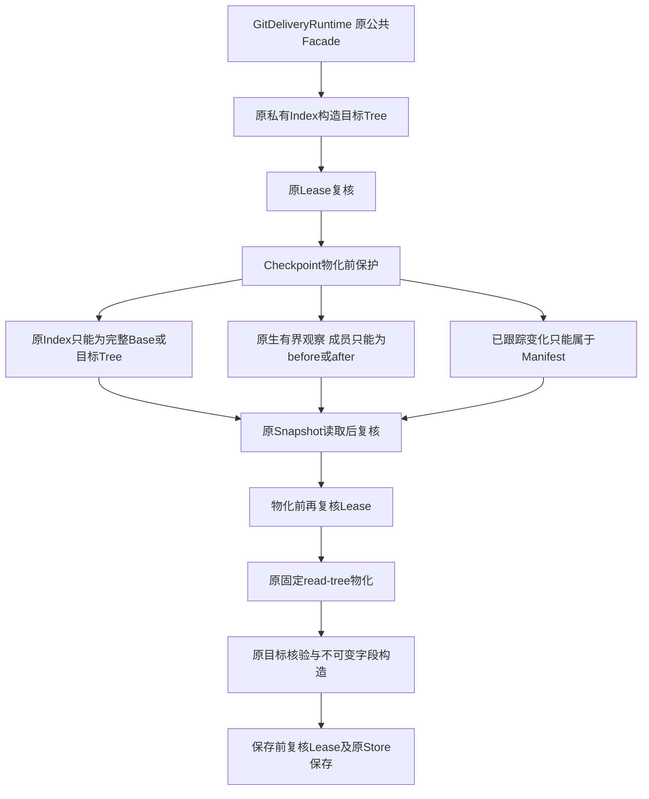
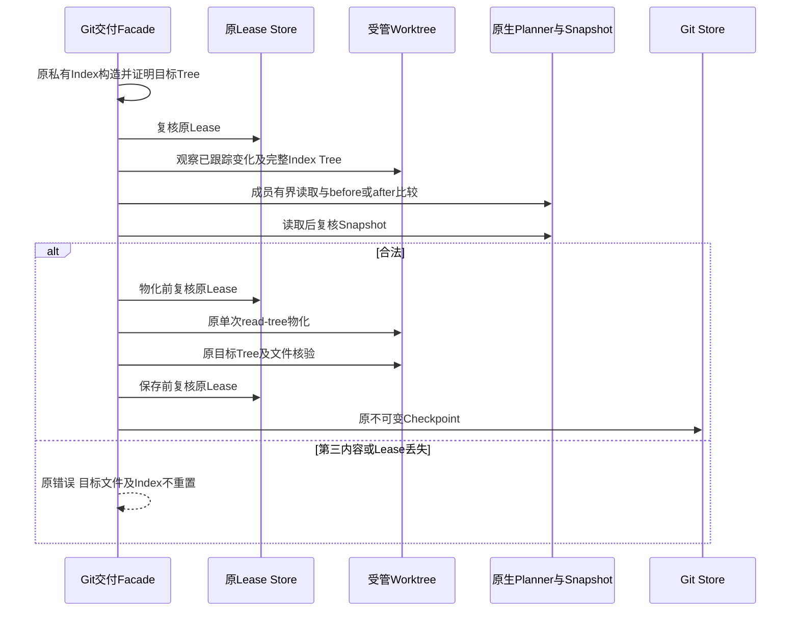

# Git Checkpoint物化前来源保护与租约复核设计

## 1. 需求背景、设计目标与非目标

正式Commit/Checkpoint/Rollback接线前，必须确保原组件不会破坏任务工作区的后续修改。
原`create_checkpoint`验证Worktree的Root、Git回链和HEAD，但不验证内容与Index；
随后`read-tree --reset -u`会把整个受管工作区重置为目标树。
同一Worktree在规划后被用户或编辑器修改，原路径身份仍相等，不能因此证明内容可覆盖。
原Lease只在入口验证，构造目标Tree期间失去Lease后仍可物化。

真实Git与SQLite用例在原源码复现六项失败：计划内修改、删除和新增路径的第三内容被覆盖，
计划外已跟踪文件的未暂存/已暂存修改被重置，以及失去Lease后仍继续物化。
这不是模拟Git成功或Provider效果，不是消费者三平台完整验收。

目标：物化前拒绝第三内容、计划外已跟踪改动和未知Index；保留无关未跟踪文件，
保留物化已完成但Checkpoint落盘失败后的确定性重建，并在关键副作用边界复核原Lease。
非目标：新增产品入口、开启任意Git命令、改变来源HEAD/Index、自动恢复用户变更或承诺OS多文件原子事务。

## 2. 总体架构、模块边界与取舍



[`git.py`](../../src/harnessix/delivery/git.py)保留公共Facade、固定命令、生命周期和Lease责任。
[`git_checkpoint.py`](../../src/harnessix/delivery/git_checkpoint.py)集中物化前保护和不可变Checkpoint字段构造；
只接受有限`run/oid`观察端口，不拥有Store、Lease、Process或批准权。
[`planner.py`](../../src/harnessix/delivery/planner.py)的原生有界读取、模式和Windows元数据校验复用，
不新建沿路径`read_bytes`的弱校验。

选择拒绝而非覆盖/自动暂存，保留用户修改和原批准范围。
Index只允许完整Base或目标Tree，不自动接纳部分用户暂存组合；文件成员可为各自before或after镜像，
这样物化失败后的已知部分结果可以重新观察，而不是把任意脏文件归入恢复。
无关未跟踪文件不进入Diff/Commit，也不删除；与目标冲突的未跟踪文件仍必须匹配已知after，否则拒绝。

原大文件不能继续增长，初修超出文件/类/函数上限；因此提取唯一Checkpoint职责模块并移动原字段构造，
不是复制Git执行器或改变原上限。实现摘要新增该模块的实际源码Hash，不能让保护代码游离于Binding证明之外。

## 3. 接口设计、领域契约与重点字段

| 元素 | 规则与业务含义 |
|---|---|
| `GitDeliveryRuntime.create_checkpoint` | 原公共签名与返回合同不变，物化前增加保护，保存前复核Lease |
| `verify_checkpoint_worktree(git, record, mutations, target_tree)` | 不写用户文件；已跟踪变化、Index及成员镜像不合法立即拒绝 |
| `_CheckpointGitPort.run/oid` | 结构化固定Git观察能力；实际环境、程序身份、输出和期限仍由原Runner控制 |
| `build_git_checkpoint` | 移动原字段构造及Digest算法；不写Store、不新增状态 |
| `head_tree_oid/target_tree` | 当前Index只能是这两个完整树之一，不接受计划外或部分未知暂存 |
| `mutation.path/before/after` | 原Manifest及内容SHA、长度、模式；不是只比较文件名 |
| `WorkspaceSnapshot` | 验证有界读取期间的原生身份与资源漂移；不能代替OS多路径原子锁 |
| `lease` | 同一来源Workspace、Owner、Epoch和期限；每次复核使用原Store事实 |
| `implementation_digest` | 包含`git.py/git_checkpoint.py/git_contracts.py/git_store.py`，旧实现不得继承新批准 |

无新Schema、DB字段、状态机、分支类型、Commit对象格式或依赖。
同一Worktree仍最多一个不可变Checkpoint，既有Checkpoint重读保持原行为；不把历史Snapshot说成当前文件内容。

## 4. 时序、数据流与核心伪代码



文字数据流：原Manifest提供允许路径和已批准before/after；原Git基准提供Base Tree；
当前Worktree提供真实文件、模式、Index与已跟踪变化；Guard只比较这些事实，不生成新批准。
通过后原命令物化目标Tree，原后置核验确认结果，原Checkpoint字段与Store记录冻结该结果。

```text
build_original_target_tree_in_private_index()
assert_original_lease()
require tracked_changed_paths subset of manifest_paths
require current_index_tree in {base_tree, target_tree}
snapshot = capture_native_members()
for mutation:
    actual = bounded_native_file_version_or_absent()
    require actual in {mutation.before, mutation.after}
verify_original_snapshot_after_reads()
assert_original_lease()
materialize_original_target_tree_once()
verify_original_materialized_result()
checkpoint = build_original_immutable_fields_and_digest()
assert_original_lease()
save_original_checkpoint()
```

## 5. 持久化、事务、失败恢复、取消与超时

物化前拒绝不改变Worktree文件/Index、不保存Checkpoint，原临时Index仍在`finally`清理。
目标Blob/Tree可能已写入共享Object Database但没有发布Ref；它们是不可达对象，不伪称零存储副作用。
保护阶段`write-tree`用于观察当前Index，同样可能产生不可达Tree，不修改Index或工作文件。

原内容不在before/after或计划外跟踪变化使用`git_checkpoint_diverged`；Lease失效使用原`workspace_lease_lost`。
原生路径、元数据或读取期间变化仍按原Workspace/Delivery拒绝，不把全部异常改成成功。
物化成功但保存失败保留已知after结果；再次调用只有完整Index合法且成员镜像匹配才能重建，不自动覆盖第三内容。
保存前Lease丢失同样拒绝记账，不能凭一次目标文件存在推断交付已完成。

原固定Git命令期限、输出上限与同步执行方式不变，没有新增重试、无限续租或提前报取消成功。
复核是合作式Fence，不是OS执行锁；最后观察到实际Git写入之间仍有外部编辑竞争窗口，
原命令期间Lease到期也不能把已经发生的效果撤销。更强原生事务和正式取消/恢复接线仍属于产品验收。

## 6. 安全、权限、信任边界与可观测性

Source HEAD/Index和现有分支保持不变，Commit/Push授权不增加。
固定Runner保持禁止Hook/filter、用户全局配置和交互凭据；保护观察显式关闭external Diff/textconv/rename。
原生读取保持链接、类型、模式及Windows元数据边界；不把`stat`后任意路径读取当作可信内容。
无关未跟踪文件只保留，不加入目标Tree，不自动清理或暂存。

公开错误为固定代码和中文分类，不输出Git stderr、文件正文、路径、作者或本机私有状态。
指标只记录拒绝阶段、原件数量、耗时和哈希；不得把拒绝次数视作真实编码成功。

## 7. 测试验证、源码映射与验收边界

九项新测试：三类计划内第三内容、计划外已跟踪未暂存/已暂存修改、物化前Lease丢失、
无关未跟踪文件与已知after镜像、保存失败重建，以及保护模块源码进入实现摘要。
原六项RED使用真实Git、原SQLite和原Lease取得，不造假返回或伪造published记录。
重复重建必须得到同一Tree，后继重读同一Checkpoint；原Source仍干净，HEAD不变。

源码阅读顺序：
[`create_checkpoint`](../../src/harnessix/delivery/git.py) →
[`verify_checkpoint_worktree/build_git_checkpoint`](../../src/harnessix/delivery/git_checkpoint.py) →
[`_read_existing`](../../src/harnessix/delivery/planner.py) →
[`snapshot.py`](../../src/harnessix/workspace/snapshot.py) →
[`git_store.py`](../../src/harnessix/delivery/git_store.py)。
实际原件、计数、源字节和有限评审结论见[验证报告](../validation/git-checkpoint-source-2026-09-30-v1/README.md)。
新测试进入原Windows Git焦点，原测试、三分钟保护和60秒堆栈观察保留；原生结果须固定新候选。

## 8. 部署兼容、回退、风险与剩余产品接线

无数据库迁移；安装固定新Wheel和完整模块，不能仅替换Facade而漏掉保护模块。
旧Git Binding因实现摘要变化不得继承新执行批准，旧Store只读事实不补签。
回退还原原Facade与实现摘要输入，不删除Worktree、Blob、用户文件或分支。

该组件保护不等于正式产品已开放Checkpoint；现行默认产品仍只有Patch及条件Process。
受管任务Worktree与现有“每Transaction一个交付Worktree”不是同一生命周期，不能拼接伪装成已完成产品接线。
正式入口还需工作区模式、Thread绑定、审批、恢复、完整备份布局与消费者平台验收。
不关闭R1/R4或商用门禁，不降低真实质量、独立Beta或费用保护要求。
