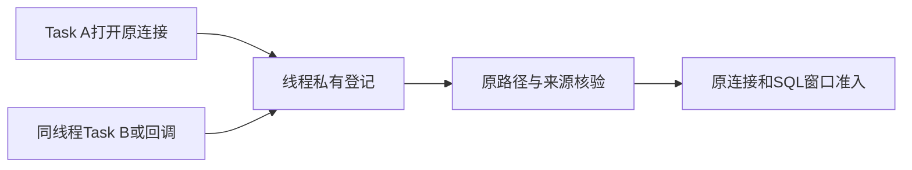
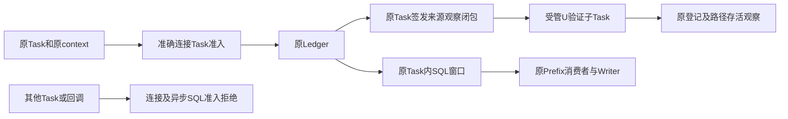
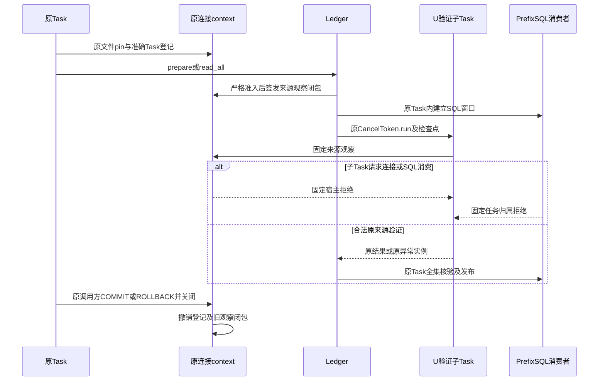
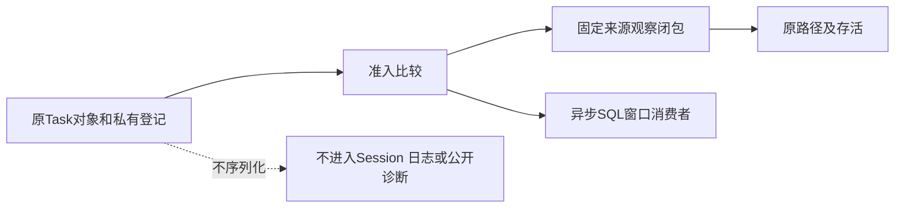

# Git原连接的任务准入与只读来源观察分层

## 1. 变更摘要

| 项目 | 内容 |
|---|---|
| 缺陷 | 原连接及SQL窗口只按线程登记，同线程其他asyncio Task可以借用活跃准入 |
| 目标 | 产品原Task独占连接及SQL消费窗口，受管U验证子Task只观察来源 |
| 影响 | 连接工厂、prepared Ledger协调、PrefixSQL；不改数据库、MAC、Owner、审批或默认工具装配 |
| 兼容 | 原Task跨await及同步调用保持；产品连接不得转交子Task。通用同步SQL窗口仍是线程合同，不作为Task认证 |
| 发布/回滚 | 三个生产模块及测试整体更新，无持久迁移；回退重新暴露跨Task准入缺口，不能作为发布解决方案 |

只解决连接/异步SQL窗口的跨Task借用子缺口；实际SQLite FD、协作锁归属、B4、B7、P1和完整Git交付仍开放。

## 2. 需求背景与证据

[连接工厂](../../src/harnessix/product_config/git_prepared_link_connection.py)的`threading.local`
原只登记确切Connection及路径pin。其他同线程Task、`CancelToken.run`子Task和loop callback共享登记。
新增12项场景在原源码上8项预期失败、4项正常通过，不需要替换Key、Owner或路径。

单文件严格Task原型会误拒绝原合法链：
`Ledger._authenticate → U verifier → CancelToken.run → 子Task checkpoint → Ledger.internal`。
该子Task观察来源而非请求执行准入，不能简单删除其原检查点或全部放行子Task。

## 3. 设计目标、非目标与验收

1. 原Task及线程精确准入：兄弟Task、回调及同步context向异步Task借用连接均拒绝。
2. 原Task跨await、独立Task自开连接仍正常；父来源不被独立连接撤销。
3. 原Task先准入，再签发固定来源观察闭包；子Task不能调用连接准入或签发观察闭包。
4. 原路径pin、普通文件、连接存活、私有登记、Owner、事务代际、取消和期限检查不减少。
5. 实际prepare、非空回读、原审批/决定来源回读保持；原异常实例及首失败优先级保留。
6. 异步SQL窗口消费、epoch取得、WriteWindow注册与消费属于原Task；progress只观察原来源。

非目标：实际FD认证、限制持有裸Connection的任意Python代码执行SQL、持锁证明、跨库快照、Git COMMIT一致性、响应性优化或启用默认Git写工具。

## 4. 当前实现与缺陷流程



SQLite线程亲和不区分同一事件循环中的Task。`Lock.locked()`也不证明当前Task持锁，本改动没有借此认证。
ContextVar会被子Task继承，故选择准确Task对象而非任务名称、上下文值或公开witness。

## 5. 变更后总体架构与取舍



| 方案 | 取舍 |
|---|---|
| 保持线程登记 | 缺口不变，拒绝 |
| 单文件严格Task | 合法U子Task检查点误拒绝，拒绝 |
| 放行全部子Task | 观察与执行混淆，拒绝 |
| 删除CancelToken.run或检查点 | 破坏取消、回收及首失败，拒绝 |
| Task准入与来源观察分层 | 配套SQL消费门禁，采用 |

观察闭包捕获原私有登记tuple，只执行固定来源检查，不返回Connection、epoch或WriteWindow。
它不是持久或执行能力；通用同步窗口保留原线程兼容，产品Ledger则在异步消费者Task内创建窗口。

## 6. 正常、失败与恢复时序



组件不COMMIT；异常由原调用方回滚，未提交事务仍随关闭回滚。
取消/期限保留原Token、Budget及检查点，不建新Task或新期限。恢复在实际消费者Task新开context，不能复活旧登记。

## 7. 接口设计、数据结构与重点字段

| 元素 | 责任及约束 |
|---|---|
| `_current_task()` | 准确运行Task；无running loop时None；不使用ContextVar或任务名称 |
| 连接登记tuple | 原path/before/after加原task引用；仅本次context有效 |
| `require_prepared_git_connection` | 先准确Task准入，再原来源核验；固定`git_prepared_link_host_invalid` |
| `_observe_source` | 同一私有登记对象、路径pin、PRAGMA报告及存活；不授予SQL准入 |
| `_prepared_git_connection_observer` | 原Task先准入，返回固定无参数、无载荷观察闭包 |
| `_SQLCheckpoint.task` | 创建窗口时的Task；异步窗口要求同Task，同步通用窗口保持线程合同 |
| `_SQLCheckpoint.prepared_source` | 原产品连接私有登记对象；建立及消费窗口时均核对，防止产品连接降为通用模式 |
| `require_git_prefix_sql_window` | 原checkpoint前后均核对原首失败、原控制实例、连接登记和Task；只调用一次checkpoint |
| `_require_control_owner` | 无额外回调的准入复核；原首失败优先，禁止回调正常返回后继续消费已撤销来源 |

没有新增数据库、协议、MAC用途或Key。同步连接不得移交异步产品消费者；None不是Task认证证明。

## 8. 状态、事务、并发与幂等

原生命周期保持打开→验证→有效→撤销→关闭，Task引用不延长登记寿命。
观察闭包要求同一私有tuple仍存在，context退出、关闭和路径替换拒绝。
progress消费原来源检查点但不核发执行权；原WriteWindow注册和消费继续经过SQL准入。
epoch只核验原控制实例及事务边界，不单独充当Task、锁或业务授权。
原MAC、精确重试、确认丢失和UNKNOWN对账不变，不增加自动重试。

## 9. 安全、隐私、可观测性与数据流



不导出Task名称、对象地址、摘要、路径或SQL。原路径pin不是FD证明，源观察不是文件锁，准确Task不是持锁证明。
原Owner、MAC、Review、认证材料、原期限和工具装配均不放宽。

## 10. 核心伪代码

```text
打开：原pin和exact Connection成立 -> 私有登记原path/pin/Task
准入：当前Task必须是原Task -> 全部原来源核验
观察工厂：先准入 -> 捕获原tuple -> 返回只检查来源的闭包
异步SQL消费：
    已捕获首失败 -> 原异常
    原控制实例、原产品连接登记或Task不同 -> 固定拒绝
    原Owner/取消/期限/来源checkpoint
    再核对首失败、原控制实例、原产品连接登记与Task
    checkpoint抛出异常 -> 原异常直接传播，不由后检查覆盖
退出：撤销登记及窗口，关闭连接，不自动COMMIT或重签历史
```

## 11. 实施切片

| 切片 | 内容及验证 |
|---|---|
| 红测 | 12项连接借用及正常使用，原源码8 FAIL/4 PASS |
| 分层 | Task准入、观察闭包、Ledger消费；实际U子Task及原异常身份正控 |
| SQL | 异步窗口准入、同步通用兼容；兄弟Task/回调拒绝、progress和首失败 |
| 文档 | prepared、Delivery、路线图同步；不提前关闭B7或R4 |

## 12. 源码与测试映射

| 源码 | 关键验证 |
|---|---|
| [连接来源](../../src/harnessix/product_config/git_prepared_link_connection.py) | [连接回归](../../tests/product_config/test_git_prepared_link_connection.py)：借用拒绝、来源观察、退出/替换拒绝 |
| [Ledger协调](../../src/harnessix/product_config/git_prepared_link_ledger.py)：`_control/_authenticate` | [实际Ledger](../../tests/product_config/test_git_prepared_link_ledger.py)、[原审批历史](../../tests/product_config/test_git_prepared_approval_history.py) |
| [原U子Task](../../src/harnessix/product_config/git_user_observation.py)：`verify_product_git_user_observation` | 原CancelToken.run/preserve_failure及实际调用正控 |
| [SQL窗口](../../src/harnessix/product_config/git_prefix_sql.py) | [Task负控](../../tests/delivery/test_git_prefix_task_owner.py)、[原生命周期](../../tests/delivery/test_git_prefix_sql_lifecycle.py)、[物理账本](../../tests/delivery/test_git_prefix_ledger_review.py) |
| [原Writer](../../src/harnessix/product_config/git_prefix_writer.py) | 原begin/initialize/publish仍经SQL准入，不新建签发算法 |

## 13. 风险、部署、兼容与回退

误拒绝合法U子Task和同步通用组件是主要风险，采用分层而非删除检查。
实际消费者与原异常身份必须独立验证，不以连接单测代替Ledger链。
正控失败则不发布；保留原FAIL，不扩大期限或减少认证。无状态迁移，三个模块整体更新，不能只发布单文件Task判断。

## 14. 实现偏差与结论

相较单文件原型，增加只读来源观察与SQL消费准入，并明确保留通用同步线程兼容。
独立审查进一步定位“其他Task或回调在原产品连接上自建通用SQL窗口”的遗漏。
新增三项负控在中间候选均FAIL，通用同步正控PASS；窗口建立前后及消费时现均绑定同一原产品登记与Task。
另一项实际负控表明，上游checkpoint可正常返回但已经退出原连接context，原先消费准入仍返回成功。
该负控修复前1 FAIL；现按同一原控制实例在checkpoint前后复核，不增加回调、不替换原异常。
最终原语及模型边界回归389项通过；其中41项是新增场景，实际认证SDK消费者另行验证。
完整证据与适用边界见[交付报告](../validation/r3-r4-connection-boundaries-2026-10-08-v1/README.md)。
完整B7仍要求实际FD与协作锁归属；B4、P1、approved Writer、三平台完整编码及R3质量继续开放。
