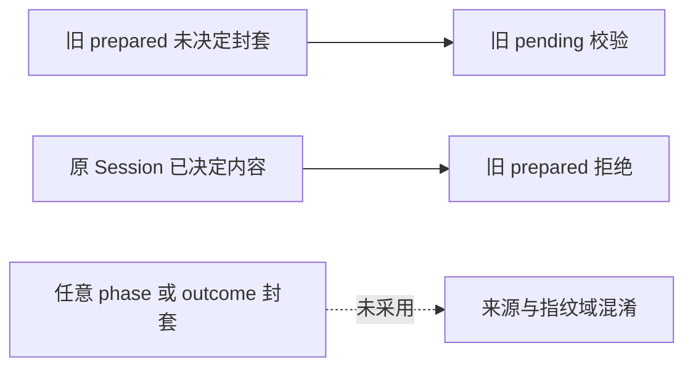
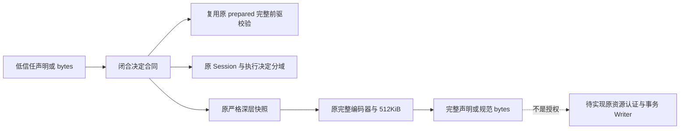
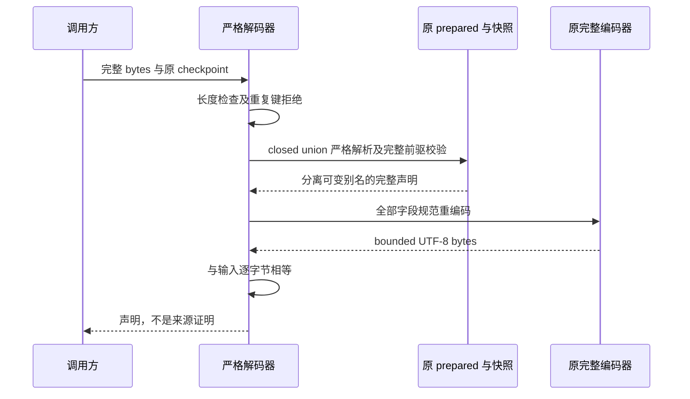
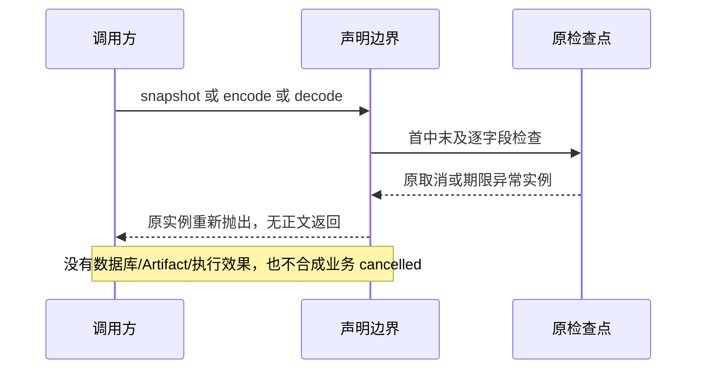

# Git 决定事实的数据契约与规范字节详细设计

## 1. 变更摘要

| 项目 | 内容 |
|---|---|
| 需求 | 为同一 prepared 前驱声明 approved、denied、审批前已结算 cancelled 三种决定正文 |
| 当前问题 | 原 prepared 合同只能表示未决定请求；放宽其 phase 会混淆既有兼容性与来源认证 |
| 交付结果 | 闭合三变体、完整前驱/两域决定约束、严格快照和规范 UTF-8 编解码 |
| 影响 | 内部 product_config 数据边界；原 Session、Router、执行批准、GitDB 模型不改 |
| 兼容 | 新 spec 分派；旧 prepared/v1 仍只接受 pending、sequence=0 |
| 发布/回滚 | 无默认注册、配置、DDL、网络或效果；内部代码可撤回，不迁移或改写旧库 |

本切片实现**声明及字节合同**，不是[完整决定认证与恢复接线](m09-r4-git-approved-link.md)。
字段相等及事件摘要不能证明来源。认证 Proof、同原事务 Writer、完整历史 Reader、恢复屏障与终端一致性仍未交付。

## 2. 需求背景与证据

[原 prepared 合同](../../src/harnessix/product_config/git_prepared_link_contracts.py)保存完整 Plan2 与原未决定审批请求。
[原 Session 决定投影](../../src/harnessix/agent/trusted_action_session.py)与
[执行检查点](../../src/harnessix/execution/contracts.py)使用不同请求指纹域：Session 绑定原审批请求，Execution 绑定原执行计划。
如果只保留 outcome 或把两个指纹混用，格式正确的错误正文可能成为后续认证输入。

[GitDB v2](../../src/harnessix/delivery/git_store_schema_v2.py)有 approved、failed，没有 denied、cancelled；
所以负向正文必须用 discriminant 明确区分业务事实，不能增加未设计的 SQL phase 或把 failed 解读为 Executor 失败。
本次沿既有[深层快照](../../src/harnessix/product_config/git_delivery_plan_snapshot.py)及
[完整编码器](../../src/harnessix/product_config/git_delivery_plan_wire.py)，不新增另一套摘要或类型归一化算法。

## 3. 设计目标、非目标与验收标准

| 目标 | 可执行验证 |
|---|---|
| 三种声明保留完整字段，旧合同不变 | 三变体往返、深别名分离、旧 prepared/new decision 互相拒绝 |
| 两域指纹及完整请求一致 | 更换 actor/reason/time/各指纹/plan_id/call_id 等负例 |
| cancelled 不伪造人工决定 | 禁止 session_decision；原系统拒绝形状及五个事件严格顺序 |
| 严格持久字节 | 重复键、非有限、缺省补全、额外字段、实际类型/序号与规范字节比较 |
| 完整控制与物理上限 | 首/中/末原异常实例、三变体完整 512KiB 及多一字节 |

非目标：认证 Session/MAC/Owner；观察真实 Git；查询或追加数据库；审批/执行/对账；续期；发布 Artifact；产品写工具注册。
测试采用真实 CAS 材料和普通索引声明，不冒充 authenticated Session 或成功业务决定。

## 4. 当前实现与根因



旧拒绝是契约边界，而不是需要删除的校验。问题是缺少另一种明确的完整数据类型；
数据声明也不足以解决完整认证和跨库恢复。实现顺序先建立有限合同，再由后继认证器从原资源形成相同正文。

## 5. 方案与变更后总体架构



`_DecisionLink` 仅复用完整前驱、原执行检查点和索引字段；`_HumanDecisionLink` 仅复用人工决定约束。
二者为内部基类，边界入口只接受三个确切公开变体。没有一个允许任意 fact_kind/phase 的通用 Link。

| 替代方案 | 优点 | 问题及取舍 |
|---|---|---|
| prepared 增加可选决定 | 文件少 | 扩大旧状态集合及旧读语义，不采用 |
| 只保存决定摘要/少数键 | 正文小 | 丢失完整请求与决定，不能核对跨域错配，不采用 |
| 三种完整封套与共用字段基类 | 有限状态、显式兼容 | 字节更大；超原预算就拒绝，采用 |
| 修改 GitDB DDL | SQL 标签直观 | 改变精确 schema/MAC 前缀合同；本切片不采用 |

## 6. 正常、失败与恢复时序



双遍解析先用 Python JSON 拒绝重复键及非有限数，再用 Pydantic 严格 JSON 模式保留 UUID/日期语义；
随后原快照按实际类型重建，最后以原编码器比对。遗漏默认字段即使能构造模型也不能通过原字节比较。



无持久化恢复动作；异常后调用方保存原权威事实并决定是否继续。不能刷新原 Turn 或将操作取消解释为业务 cancelled。

## 7. 领域契约、数据结构与接口设计

| 字段/结构 | 类型及重点约束 |
|---|---|
| `spec_version` | 固定 `harnessix.product-git-decision-link/v1` |
| `fact_kind` / `phase` | approved/approved；denied/failed；cancelled/failed，无其他组合 |
| `sequence` | 确切整数 1；不是 bool、float 或任意后继序号 |
| `plan` | 原完整 ProductGitDeliveryPlanV2，不精简材料/父历史/Review |
| `approval_request` | 原 TrustedActionApprovalRequestContent，decision=None、pending_approval；沿原 prepared 约束 |
| `prepared_body_sha256` | 原规范前驱正文索引，Revision 格式；不是 MAC 或来源认证 |
| `request_event` | GitSessionEventRef：UUID、严格正整数 thread-global sequence、Revision digest；后继来源映射使用原已验真事件UTF-8正文SHA，不是模型规范摘要 |
| `router_approval` | 完整 ExecutionApprovalCheckpoint，绑定 plan.route.execution 的 ID/指纹；决定必须有时区 |
| `route_decision_sequence/digest` | 原 Route 决定索引；正整数及 Revision，无权威能力 |
| `session_decision` | approved/denied 专有，完整请求只允许 decision、route_state 两字段变化 |
| `decision_event` | 人工决定事件定位；晚于 request_event 且 ID 不同 |
| 四个取消事件定位 | 取消迁移、审批 Item 取消、Call 结果、Turn 终态；与 request_event 一起 ID 唯一、sequence 严格递增 |

人工两域决定必须 outcome、actor、reason、decided_at 一致；Session 的 request_fingerprint 等于原请求，
Execution 的 request_fingerprint 等于原执行指纹。aware datetime 相等仅表达同一时间，真实事件正文仍需后继认证。
cancelled 保留 rejected/system.cancel/turn_cancelled 检查点，没有 Session 人工决定字段。
仅有这些字符串和有序索引仍不证明取消确已结算。Thread/Turn/Call 归属、原事件完整正文、MAC、期限/Review TTL 是后继 Proof 责任。

### 7.1 接口设计

`encode_product_git_decision_link(value: object, *, checkpoint: Callable[[], None]) -> bytes`完整编码低信任声明；
`decode_product_git_decision_link(body: object, *, checkpoint) -> 三变体 union`严格重开字节；
`snapshot_product_git_decision_link(value: object, *, checkpoint) -> 三变体 union`按实际类型深重建。
三入口必须提供原无参检查点，无默认授权、回调替换、异步或外部Store参数。GitSessionEventRef只作索引。

## 8. 状态、事务、并发与幂等

本模块没有运行状态机、锁、事务、租约或 UNKNOWN 恢复，也没有追加序号行为。
`sequence=1` 是数据约束，不证明库中存在 sequence=0 或允许直接写入；新 Writer 必须认证完整前驱与连续链。
相同输入产生相同规范字节，不等于事务级幂等。每次调用重新深快照，不缓存认证结果或共享可变声明。

## 9. 安全、隐私与可观测性

所有输入均为低信任数据。确切类型、完整字段集、额外存储拒绝及深层重建阻止保留在对象中的 construct/copy 篡改。
Pydantic `model_construct` 若已丢弃未知入参，边界只能验证实际对象；不可据此声称检测构造之前被丢弃的信息。
有效 construct 对象可重建，但没有来源证明含义。

入口公开错误固定为 `git_delivery_plan_invalid`，不回显作者、消息、路径、原 JSON 或解析器异常正文；
checkpoint 提供的控制异常保留身份，即使类型是 ValidationError、ValueError、KernelError 也不重新分类。
无新增日志、Metric、Trace、Secret、Key、PublicationScope 或网络；不得把 complete 数据状态映射为 approved 权限。

## 10. 核心伪代码

```text
snapshot(value, checkpoint):
    原 checkpoint
    按确切三变体选择原深层快照
    原 prepared 重建完整 Plan 和未决定请求
    原执行检查点重建并核对其自身指纹域
    人工决定: 全请求差异只允许两字段; 两域决定相等; 索引有序
    取消: 原系统拒绝形状; 禁止人工决定字段; 五索引唯一有序
    返回完整独立声明，不签发认证

decode(bytes, checkpoint):
    exact bytes 且 1..512KiB
    第一遍拒绝重复键和非有限数
    第二遍严格 closed union 解析
    snapshot -> 原完整 encode
    重编码与原输入不相等则拒绝
    checkpoint 异常抛原实例; 其他数据异常固定公开分类
```

## 11. 实施切片

| 顺序 | 已实现内容 | 测试/独立回滚 |
|---|---|---|
| 1 | 三变体及 GitSessionEventRef | 改 ID/指纹/决定/取消顺序负例；删除新模块不动旧合同 |
| 2 | 唯一深快照与原编码器类型标注扩充 | 构造绕过、别名、首中末异常；不改变原编码分支 |
| 3 | 严格新 wire | 缺字段、非规范、512KiB 边界；旧 wire 互相拒绝 |
| 后继 | 原资源认证、Reader/Writer、恢复屏障 | 尚未实施；不得因本切片通过提前装配 |

## 12. 源码与测试映射

| 变更点 | 源码与符号 | 测试及证据 |
|---|---|---|
| 前驱与决定一致性 | [contracts](../../src/harnessix/product_config/git_decision_link_contracts.py)，`complete_predecessor/same_original_decision` | [测试](../../tests/product_config/test_git_decision_link_contracts.py)，请求字段、执行域及两域决定负例 |
| 取消 | 同文件 `settled_cancel_shape/_ordered_events` | cancelled 禁字段、形状及有序唯一索引 |
| 原深快照 | 同文件 `snapshot_product_git_decision_link`；[原算法](../../src/harnessix/product_config/git_delivery_plan_snapshot.py) | 类型/字段/别名/全部控制异常阶段 |
| 完整字节 | [wire](../../src/harnessix/product_config/git_decision_link_wire.py)，encode/decode；[原编码器](../../src/harnessix/product_config/git_delivery_plan_wire.py) | 逐字段删除、三变体合法 512KiB/多一字节 |
| 旧兼容 | [原 prepared wire](../../src/harnessix/product_config/git_prepared_link_wire.py) | [旧212项](../../tests/product_config/test_git_prepared_link_contracts.py)及双向 schema 拒绝 |

首次 RED 保留 missing module；新142项与旧212项合计354 PASS。错误选择不存在测试文件的辅助命令单独保留，未计通过。
实际验证与独立审阅以专项发布证据为准，不由本设计证明安装或商业发布。

## 13. 风险、部署、兼容与回退

三变体有重复请求正文且不扩容512KiB；prepared 可保存不保证决定封套也可保存，超限拒绝且不裁剪字段。
不得先把声明传给低层 MAC 发布器；须在完整原资源 Proof、B4/B7及同步响应性闭合后实现并验证正式接线。
没有生产新记录，因此本切片撤回仅移除内部数据 API；后继若有持久新正文，不能再用此无数据回滚描述。
不涉及 Windows 原生 Git/IO 验收；跨平台元数据或本机纯模型通过不替代 R4。

## 14. 实现偏差与最终结论

数据层已实现闭合声明和严格字节；整体正式决定接线仍 planned。
共同 router_approval/Route 索引提升至内部基类是无字节偏差的职责复用，三个公开变体仍明确。
未改变原 prepared、原指纹算法、DDL、认证角色、默认工具与预算。此交付是后继认证的必要数据边界，不是成功 Git 审批、业务执行或商用发布证明。
