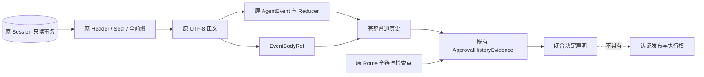
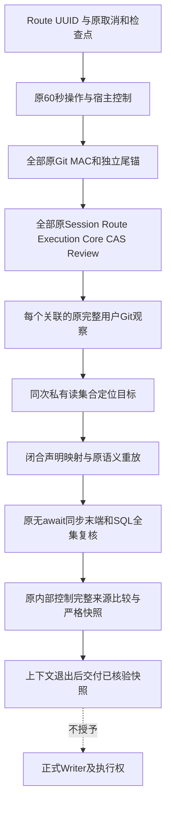
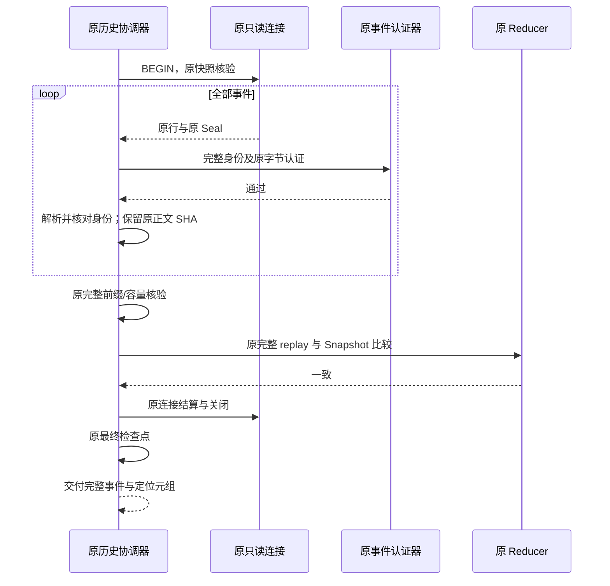
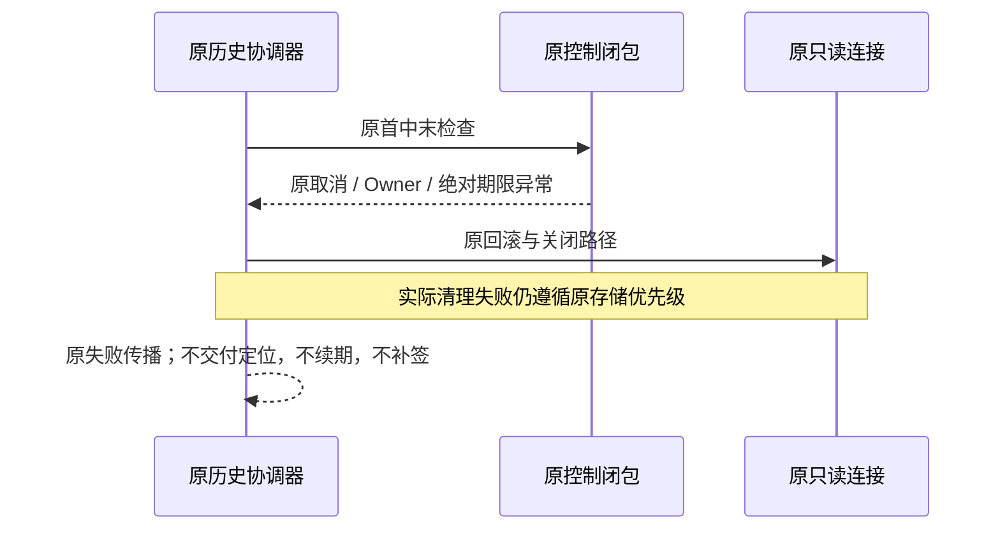
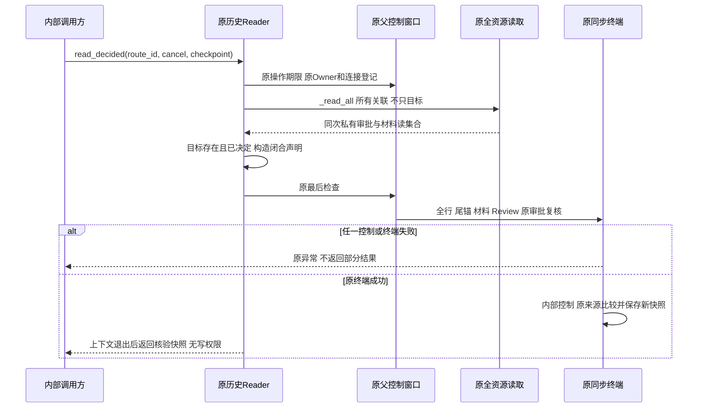
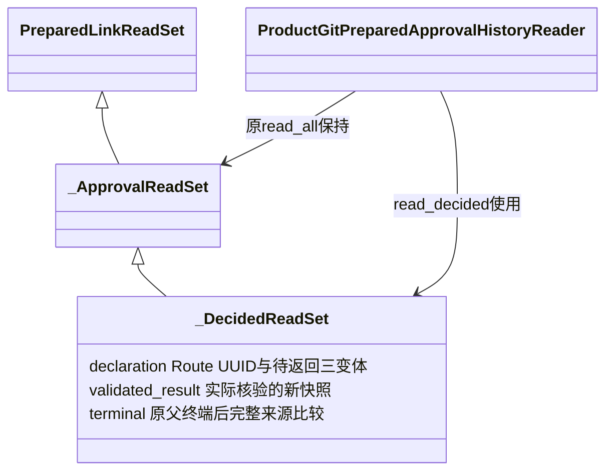

# Git 决定声明的原正文来源与同次读取详细设计

## 1. 变更摘要

| 项目 | 内容 |
|---|---|
| 需求 | 从原完整审批证据构造三种决定声明时，事件摘要必须指向经原 MAC 核验的实际正文 |
| 当前缺口 | `AgentEvent` 没有原正文摘要；历史解释器保存事件对象，但对象重编码不等于原字节来源 |
| 实现切片 | 原 Session 保留 `EventBodyRef`；私有映射消费原来源；原历史 Reader 新增 `read_decided` 完整只读入口，不增加认证权威 |
| 影响 | 原 Session 来源元数据、Git 内部适配及原历史 Reader；没有 DDL、Key、配置、依赖或公开协议变更 |
| 明确未完成 | 正式决定 Proof、原事务 Writer、完整生命周期 Reader、B4/B7、恢复屏障、默认 Git 写入及发布验收 |

总体方案仍由[正式决定设计](m09-r4-git-approved-link.md)定义；本切片实现原事件正文来源、内部映射及复用原活跃资源的完整只读决定入口。
`EventBodyRef`、`AuthenticatedThreadHistory` 与 `ApprovalHistoryEvidence` 均为普通事实对象，
可以由 Python 调用方构造，不能作为不容伪造的认证令牌或执行授权。

## 2. 需求背景与源码证据

[事件模型](../../src/harnessix/agent/models.py#L838)只有事件身份、Thread、Sequence、时间及载荷；
没有数据库 `event_json` 原字节。[原事件读取](../../src/harnessix/session/sqlite_publication.py)
先用 `verified_event` 检查原 Seal、身份和 UTF-8 正文，再解析模型、核对完整前缀与容量。
原 Seal 的 `body_sha256` 绑定原字节，并非一个模型树排序后的 JSON。

[历史投影](../../src/harnessix/product_config/git_approval_history_projection.py)已经保留原请求、
人工决定、四个取消事件、Router 检查点和 Route 决定。因此不增加另一组事件副本或重复索引缓存。
唯一丢失的信息是同次认证读取期间已核验的原事件正文摘要。

既有 Session 读事务之外再查 `event_json` 会引入第二读版本；直接对模型做 `canonical_digest`
又会混淆数据声明与原字节来源。两种捷径均不采用。

## 3. 设计目标、非目标与验收标准

- G1：每个返回事件都有同序的原字节定位，Thread、ID、Sequence 与经核验的原行一致。
- G2：摘要只从实际 UTF-8 `event_json` 生成；禁止事件模型重编码作为摘要输入。
- G3：原同连接、只读事务、完整 MAC/前缀、Reducer、容量、取消、期限及 Owner 检查保持。
- G4：原公开 `events/get_thread` 与协议不变；旧两参历史构造保留，但空引用不能提供原字节来源。
- G5：已决定的声明保存完整原 Plan、未决定请求、原事件及 Router 决定，不接受仅 `ready` 状态。
- G6：新事实不开放认证发布或执行；pending、缺失来源、混合 Thread、重复/错序定位必须拒绝。
- G7：新入口只接受 Route UUID 与原控制参数；必须先认证全部关联、原资源、完整 U 和同步终端，不能只查目标或接收调用方 Evidence。

不实现新批准、MAC 签发、SQL 追加、数据库迁移、重签旧历史、自动恢复、Git 效果或业务密码整改。
不将单个 SQLite 夹具的回调/SQL计数证明扩大为全链性能等价或商业验收。

## 4. 当前实现与根因流程


原完整认证有效，但结果对象没有携带后继决定声明所需的原字节定位。这是读取结果信息损失，
不是事件认证失败；修复必须发生在原读取边界，不能在 Git 适配层重新发明认证算法。

## 5. 方案、总体架构与取舍



| 方案 | 取舍 | 结论 |
|---|---|---|
| 对事件模型规范编码并取摘要 | 简单但输入不是原数据库字节 | 拒绝 |
| 在原读事务外再次查询原行 | 引入第二读版本及额外 SQL | 拒绝 |
| 保留所有事件正文/Seal | 重复正文、扩大敏感材料及内存面 | 拒绝 |
| 同次读取保留小型不可变定位元组 | 复用实际已核验字节，无额外 SQL；增加每事件元数据 | 采用 |

原事件字段在定位映射前沿 `_snapshot` 原字段快照及原 `AgentEvent` 严格 Schema 验证，坏的非目标正文、UUID 子类及旧版本非法字段均拒绝。不能借会隐去字段的 serializer 投影替代原对象校验；该验证不得用于重算来源摘要。
已存决定的新增只读入口及跨域时序见[决定设计第 7.5 节](m09-r4-git-approved-link.md#75-已存决定的实际只读回读)。

### 5.1 原资源只读入口

[`ProductGitPreparedApprovalHistoryReader.read_decided`](../../src/harnessix/product_config/git_prepared_approval_history.py#L184)
复用既有 `_resources`、`_control`、`_ApprovalReadSet` 和 `_read_all`。没有第二个 Store、锁表、缓存或批准状态机。
先读取全部原 prepared 关联并完成原资源认证，再从同次私有集合选目标映射；目标不存在也不能跳过坏的其他关联。
与接收普通 `ApprovalHistoryEvidence` 的纯 mapper 不同，该入口自己回读实际原资源；返回值仍是普通事实，
离开读操作后不携带锁、不可伪造能力或未来 Writer 可消费的授权。



保持原 `read_all` 输出、构造器及旧 pending Reader 合同。审批资源读取与完成边界抽取为共享私有 helper；不以 AST 字节相等代替行为回归。
新入口不默认装配到 SDK/Protocol，也不是正式决定历史 Loader。

仅原 `authenticated_thread_history` 请求累积定位，原 `authenticated_events` 的默认返回仍是事件列表。
累积参数只接受内建空列表，拒绝列表子类、自定义累积器和复用非空列表，不增加可执行回调。

## 6. 正常与失败时序



摘要只在该事件认证通过及解析身份一致后累积；完整历史、Reducer、连接结算和最终检查全部成立
才交付历史对象。内部临时列表不对外发布，任何失败不返回部分历史或部分来源成功。



### 6.1 完整决定读取时序



新方法在 `_control.__exit__` 全部成功后才返回 `validated_result`，不再交付 body 中先求值的旧对象。
最后外部检查点之后原同步终端不新增 await、不重入共享 Execution 回调。该语句顺序不能证明外部 Git 永久不变。

## 7. 接口设计、领域契约与数据结构

| 结构/字段 | 约束与职责 |
|---|---|
| `EventBodyRef.thread_id` | 原行解析并核验后的 UUID；Git 适配必须与原 Core/完整历史一致 |
| `event_id` | 原事件 UUID，与数据库索引一致；不是来源权威 |
| `sequence` | 原 Thread 全局连续序号，不是 Route 序号或 Git Link 序号 |
| `body_sha256` | 经原 MAC 核验的实际 UTF-8 字节 SHA-256；不保存正文或 Seal |
| `AuthenticatedThreadHistory.body_refs` | 与 `events` 对应的不可变元组；旧两参构造默认空元组 |
| `_body_refs` | `authenticated_events` 私有累积参数；只允许 exact-list 且初始为空，不作为公开扩展点 |
| 原 `GitSessionEventRef` | Git 决定声明中的定位结构；从完整历史中的对应原字节定位转换，不重新计算事件摘要 |

[`session_event_refs`](../../src/harnessix/product_config/git_decision_link_sources.py)核对完整定位并生成 Git 索引；
`build_git_decision_link_sources`复用原 `interpret_git_approval_history`重放全部合法历史及完整 Route 链，
再与已有普通投影比较，不仅信任 `state` 标签。不以 Python 普通类型作为认证凭据。
三种模型均通过 `model_validate(context={checkpoint})`重建；复用原 `UpstreamCheckpointError`
隔离宿主异常，使 ValueError/TypeError 不被 Pydantic 当成输入错误改写，首/中/末原对象保持。

`EventBodyRef` 是冻结、带 slots 的普通 dataclass，不宣称构造器会验证原数据库或 MAC。
结构验证只能保证格式及对应关系，真实性仍取决于原活跃资源、原完整认证读取和未来正式终端 Proof。
人工 approved/denied 和审批前已完整结算 cancelled 分别映射，不能从系统检查点合成人工决定。

### 7.1 新入口参数、返回与错误分类

| 字段/接口 | 正式约束 |
|---|---|
| `route_id: UUID` | exact UUID；不是调用方 SHA、Evidence、ApprovalRecord 或认证 Token；非 UUID 在进入资源控制前拒绝 |
| `cancel: CancelToken` | 原对象交给 `_control` 与 `_read_all`；不构造新的父取消身份 |
| `checkpoint: Callable[[], None]` | 原控制闭包消费；异常保持原实例，不包装为输入错误 |
| 返回三变体 | 原完整 Plan、原请求与真实事件正文定位、两域决定检查点；普通 Pydantic 数据，不是持久 Git 事件 |
| `git_decision_source_invalid` | 非 exact UUID，拒绝前不调用外来比较或哈希 |
| `git_decision_source_missing` | 全集原资源读取成功后仍无目标，不合成前驱 |
| `git_decision_source_pending` | 原请求未决定，不能调用 mapper 造 approved |
| `git_decision_source_changed` | 同步终端中返回值与原完整来源不同，拒绝已求值对象，不交付部分结果 |
| `git_process_timeout` | 本操作原 timeout 实际到期；上游自行抛出的 TimeoutError 保持原实例 |
| 原认证/材料/Owner错误 | 全链原异常直接传播；不部分返回、不补签、不继续效果 |

返回值支持 approved、denied、审批前完整 cancelled；pending 由原 `read_all` 表达，新入口明确拒绝。

### 7.2 返回绑定类设计与同步末端



`_DecidedReadSet.declaration`只保存本次目标与已求值的返回对象，不签发Token，不写数据库，不缓存认证。
父 `_ApprovalReadSet.terminal`及SQL全行复核保持；在最后外部callback之后，仅以原内部check从同Evidence重建完整expected，
再用原 `snapshot_product_git_decision_link`严格重建实际返回值，比较全部字段。不能仅校验SHA格式，在原内部终端中保存已经完整比对的新快照为`validated_result`，在父上下文退出后只交付该快照。
不能在body中提前return旧result；合法副本重定向也不能使旧对象成为实际返回值。来源不同以`git_decision_source_changed`拒绝；原严格快照先排除外来字段/比较运算，再进行相等比较。
新增深构造控制成本仍在原60/120期限内，不宣称检查点计数或性能完全等价，响应性P1继续开放。

## 8. 状态、持久化、事务与并发

不增加表或写入，定位在原 Session 的单连接、单只读事务内生成；没有新事务、跨库快照或锁。
原所有失败关闭规则保留。同次前后历史相等判断新增定位元组比较：即使模型值相同，原正文摘要不同
也不再作为同一个读取事实。这是显式的来源收紧，不是所有观察语义完全等价的声明。

新定位有每事件一份的内存开销，受原事件数/历史字节上限约束；不提高这些上限。
既有 `read_all` 输出和 `linkage_state` 不变；新增只读 `read_decided` 不装配默认产品入口或 Writer。
新方法要求调用方已经打开原登记连接并持有显式原事务；不 BEGIN/COMMIT、不自动回滚调用方事务，也不从模型参数初始化数据库。
声明和只读结果供内部事实消费使用，不能跨 Task、操作或重启复用为已批准能力。
当前未关闭的外部逻辑 Git 终端窗口、原 SQLite FD 来源及全部 dispatch 持锁证明不能由此新入口补齐；
四库变化检测和路径 pin 不等于跨 SQLite/Git 事务或操作系统排他边界。

## 9. 安全、隐私与可观测性

没有新 Key、MAC 域、凭据来源、网络、公开协议或执行入口。摘要定位不携带正文、Seal 或能力端口。
原 Session 认证与完整 Git U/材料/Review/Owner/四库终端边界不能由定位代替。
不新增正文日志或高基数公开指标，固定结构拒绝沿现有错误分类传播。
普通 dataclass 的调用方构造值不得直接交给原 Prefix 发布器；正式来源 Proof/Writer 仍待实现。

## 10. 核心业务逻辑伪代码

```text
read_original_history_in_original_transaction():
    verify_original_header_and_snapshot()
    for original_row in complete_ordered_rows:
        verified_event(original_row, original_seal)
        event = parse_original_json_and_check_identity(original_row)
        collect_original_utf8_body_reference(event, original_row)
    verify_complete_prefix_and_original_limits()
    require(original_replay(events) == original_snapshot)
    settle_original_connection_and_final_checkpoint()
    return ordinary_history(events, immutable_body_refs)

read_decided_from_original_resources(route_id, cancel, checkpoint):
    require_exact_uuid(route_id)
    enter_original_control_with_one_60_second_budget()
    read_all_original_prepared_links_and_resources()
    require_same_read_set_contains_decided_route(route_id)
    declaration = map_same_original_evidence()
    bind_pending_return_object_to_private_decided_read_set()
    require_original_final_checkpoint_and_synchronous_terminal()
    rebuild_expected_from_original_evidence_with_internal_control_only()
    require(strict_snapshot(pending_return) == complete_expected)
    return ordinary_declaration_without_writer_capability

build_decision_declaration_from_original_evidence():
    require_complete_same_thread_events_and_body_refs()
    locate_original_request_and_decision_or_four_cancel_sources()
    preserve_original_route_checkpoint_and_decision_indices()
    preserve_complete_prepared_canonical_bytes_digest()
    return_closed_declaration_without_authentication_or_execution()
```

## 11. 实施切片、测试与验证

| 切片 | 验证 | 退出范围 |
|---|---|---|
| 原 Session 定位 | 真实 SQLite 原字节比对；禁止以 AgentEvent 重编码代替来源摘要；冻结、只读、两参兼容 | 只保证同次来源元数据 |
| 原控制保持 | 原认证历史、事件 Seal、Store 回归；窄夹具 SQL/检查点与增量前采集比较 | 不宣称全 SDK 或 SLA |
| Git 声明适配 | 三变体、pending 拒绝、缺失/混合/错序定位及原回调异常 | 只保证声明映射，不是来源认证 Proof |
| 原资源入口 | 19项接线控制短测与12项末端绑定：三变体、missing/pending、异常身份、非原资源拒绝、期限归类；真实 SDK 单独记录 | 替身短测不是 MAC 或 SDK 通过证明 |
| 发布治理 | 有限源码/测试扫描、详细设计、链接/图及源摘要清单 | 不关闭 R1～R6 |

原主仓单事件基线为 8 个宿主检查点、13 条 SQL（12 SELECT、1 BEGIN）。
此计数只绑定该实际夹具，不用于替代其他负例或主链控制验证；初败必须保留。

## 12. 源码与测试映射

| 位置 | 重点逻辑 | 对应验证 |
|---|---|---|
| [event_body_refs.py](../../src/harnessix/session/event_body_refs.py) | `EventBodyRef` 普通冻结定位 | [独立原字节测试](../../tests/session/test_authenticated_body_refs.py) |
| [sqlite_publication.py](../../src/harnessix/session/sqlite_publication.py) | 原逐事件认证之后的原字节定位 | 禁止模型重编码、自定义累积器拒绝 |
| [sqlite_history.py](../../src/harnessix/session/sqlite_history.py) | 原同次事务完整聚合与原控制 | [原历史完整回归](../../tests/session/test_authenticated_history.py) |
| [git_approval_history_projection.py](../../src/harnessix/product_config/git_approval_history_projection.py) | 原请求/决定/取消完整语义 | [原投影回归](../../tests/product_config/test_git_approval_history_projection.py) |
| [git_approval_history_proof.py](../../src/harnessix/product_config/git_approval_history_proof.py) | 原跨来源读集合与末端复核 | 后继正式 Proof 不得跳过该边界 |
| [git_decision_link_sources.py](../../src/harnessix/product_config/git_decision_link_sources.py) | 原语义重放、完整定位、原前驱编码与闭合声明 | [51项纯映射负控](../../tests/product_config/test_git_decision_link_sources.py) |
| [原历史 Reader](../../src/harnessix/product_config/git_prepared_approval_history.py#L184) | `read_decided` 全集原资源读取、同次选择与同步末端后返回 | [19项接线控制](../../tests/product_config/test_git_decided_source_reader.py)及[12项末端绑定](../../tests/product_config/test_git_decided_source_terminal.py)；真实 SDK 另立来源绑定 |
| [实际SDK测例](../../tests/product_config/test_git_decision_source_sdk.py) | 在原证据读取与末端全复核之间借同一父控制消费 approved 来源 | 不装配产品 Writer，不修改 linkage_state |

## 13. 风险、部署、兼容与回退

没有安装依赖、DDL 或存量迁移。旧两参语义夹具继续可构造，但其 `body_refs=()` 不能提供原字节来源；
基于反射列举该内部 dataclass 字段的代码须适配新增字段。公开协议/SessionStore 端口未扩大。
回退需同时撤销依赖该新字段的 Git 私有适配及 Session 元数据增量，不删除数据库、事件或认证历史。
旧 prepared Reader 对已决定事实继续严格拒绝；不能为回退删掉后继正式账本事件。

默认 Docker/Profile、实际编码质量、三平台、有限 Beta 和响应性 P1 继续独立验收。
取消/期限/Owner 故障不能被费用预算或纯数据回归通过掩盖。

## 14. 实现偏差与最终结论

原历史 Reader 已新增完整只读 `read_decided` 入口。主仓本次451唯一功能节点通过，包含19项新接线测试；
前版验证中的构造器、read_all 和辅助函数 AST 保持只描述该固定版本，不要求后继实现复制业务规则。最终同源码主仓SDK一次通过：完整夹具123.154秒、实际原资源批准读取与非目标MAC拒绝，读写计数0。
首次候选完整SDK117.454秒发生在末端返回Guard前，不替代最终版本；Apple Git初始化FAIL保持。
独立审阅P2发现末次callback只改合法返回摘要仍能交付；新增私有读集合末端原来源重建与严格深快照关闭该三变体反例，
第二个P2涉及合法副本重定向后返回旧别名，已改为原上下文完整退出后仅交付实际核验的新快照；独立最终AST探针确认闭环。
foreign equality负控执行数0，不增加外callback/await/权限。终端反例及来源绑定由
[本次验证](../validation/release-followup-2026-10-08-v5/README.md)单独判定，不能用451项替代实际整链、安装或商用质量。
正式决定发布 Proof、事务 Writer、完整决定历史 Loader 与恢复屏障仍待实现，B4/B7/P1 保持开放。

### 14.1 前版来源元数据与映射验证

Session 定位和私有声明映射已实现。最终两组主仓 JUnit 为166项原事件/历史/Store及329项映射/原语义/旧合同，
合计495个唯一功能节点；文档治理另计。详细结果、初败、来源绑定及研究限界见[专项交付](../validation/release-followup-2026-10-08-v4/README.md)。
一次真实本地 SDK 原已批准证据消费通过，整项夹具113.204秒，不是一次 read_all 的时长；原60秒consumer/120秒Turn不提高。
该SDK先于定位UUID比较前置整改；随后9项foreign-equality Spy及最终完整纯集合验证收紧，未重复整链，
不宣称最终同候选SDK/安装或商用发布通过。原17及36项映射中间节点被最终51项包含，不重复统计。
主审发现初始私有 mapper 未向闭合模型传入父控制、仅信任投影标签；通过原模型context和原解释器复用整改，
没有另外一套批准状态机。新增纯负控明确展示格式合法的调用方摘要仍能形成声明，恰恰证明它不是来源认证。
本切片不补造审批、执行权限或正式 Git 决定持久事实，不能据此把 `decision_not_linked` 改为已发布决定。
完整 Source Proof、Writer、恢复屏障和 B4/B7 是后继工作，不纳入本次完成度。

返回绑定的可信宿主合同不将同进程任意Python代码视为隔离沙箱。内置callback仍需符合原控制边界，
以上混沌探针验证已识别的别名/类型错误，不声明能够防止任意Python替换所有frame、函数代码或进程内存。
