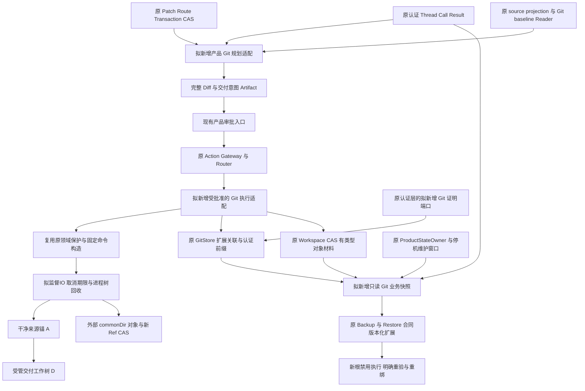
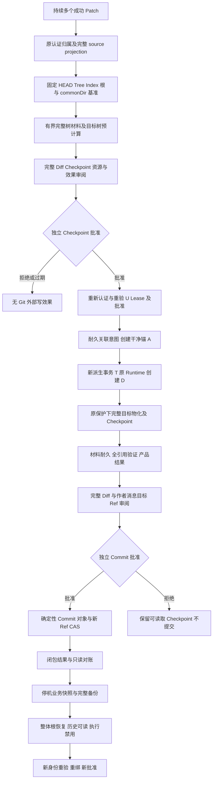
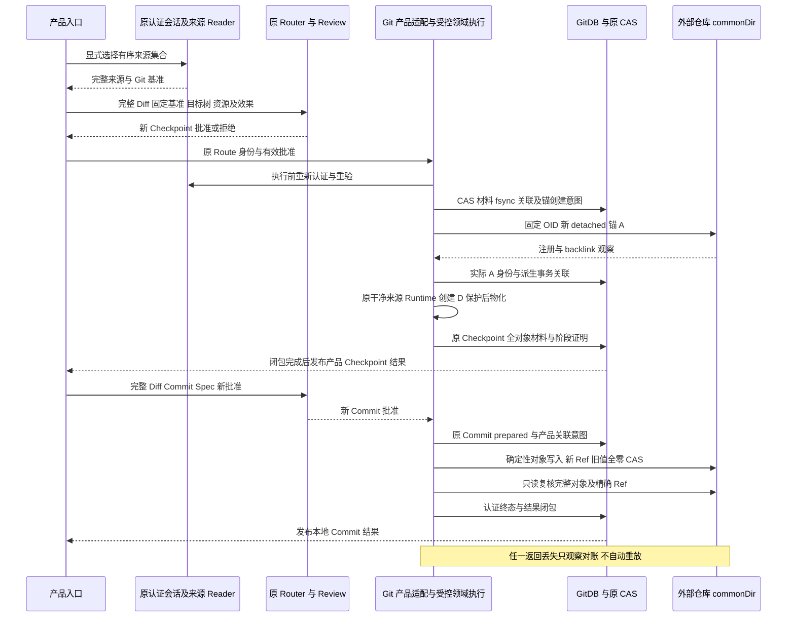
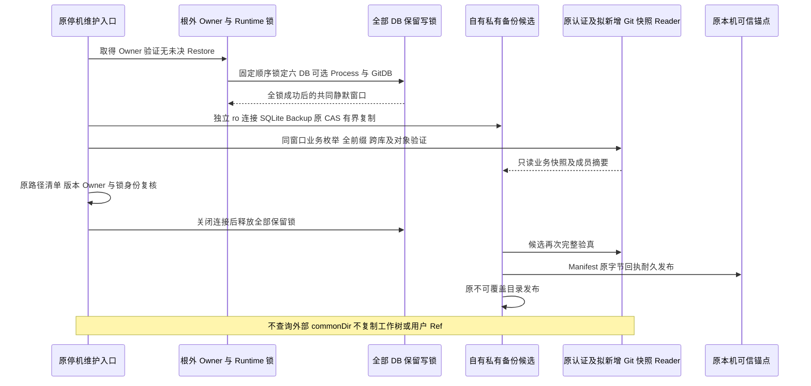
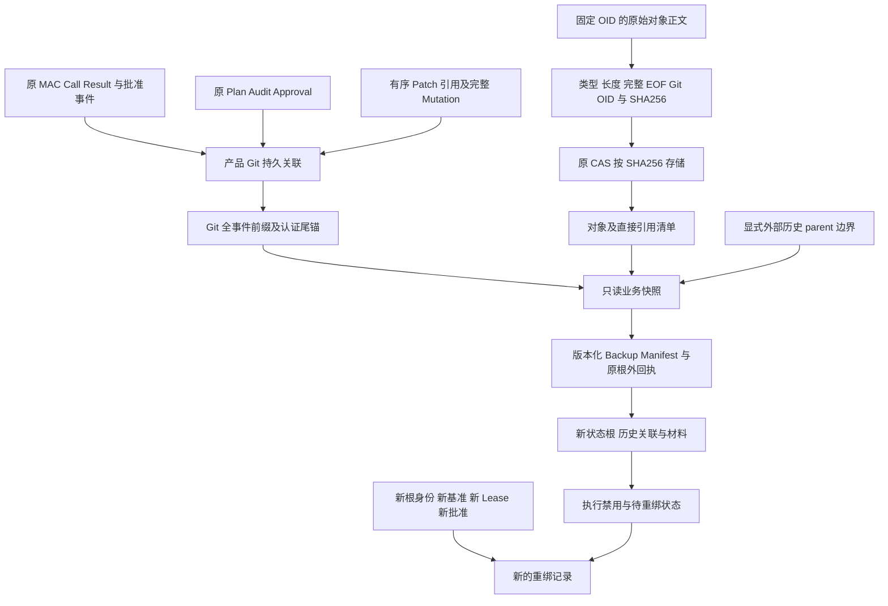

# Git Commit／Checkpoint 产品接线与业务备份闭包详细设计

## 1. 需求背景、状态与交付定义

**实施状态：业务闭包待实现，内部 IO、完整对象材料、只读文件树验真与完整目标树纯规划前置已实现。** 本文为 `status: draft` 的详细设计草案，以元数据中的提交为研究基线，并纳入已实现的 GitStore 只读接口、受控命令 IO、完整对象读取／输入、原 CAS 类型适配、完整普通文件树验真及完整目标树纯规划。产品 Git Action、持久关联、认证前缀、业务快照、认证对象目录闭包及恢复重绑均未由本文交付；现有测试链接仅指向复用边界，不表示完整业务方案已经通过验收。

当前默认产品能完成 Patch 和显式 Rollback，能从认证会话提取持续多 Patch 的完整来源投影，并观察 Git 基准；尚未装配 `GitDeliveryRuntime`／`SQLiteGitDeliveryStore` 形成默认产品 Commit／Checkpoint 闭环。直接把用户已修改的工作区交给要求干净来源的宿主 Runtime，会产生真实的生命周期和身份冲突。

另一方面，GitDB 并不是 Git 交付的完整业务状态。Git 对象在仓库 commonDir 内，受管工作树的注册和 backlink 跨越产品状态根及外部仓库，用户 Ref 也是外部效果。把 GitDB 目录加入旧备份白名单，既不能恢复对象，也可能把临时 Index、工作树实体、失效注册或用户代码误当作受管 CAS。

本纵向切片的交付单位必须是：

> 同一认证 Thread 持续完成多个 Patch → 全部选中修改的完整来源投影 → 明确 Git 基准及完整 Diff → 独立批准 → Checkpoint／本地 Commit → 可验真的业务关联与有界对象材料 → 停机备份／恢复 → 新根身份下明确重验、重绑和重新批准。

只完成单次 Patch、只有 Checkpoint、只有数据库复制或只有领域 Runtime 回归，均不能关闭这一产品范围。

## 2. 设计目标、非目标与不变量

### 2.1 目标

1. 经现有产品 Action Catalog、Gateway、Router、Review Artifact 和批准机制开放有限的 Checkpoint、本地 Commit 能力，采用相同 Owner 生命周期，不另建执行入口。
2. 将原 Thread／Turn／Call、来源 Patch 链、产品 Route／Approval 与原 Git Worktree／Checkpoint／Commit 领域事实持久关联。
3. 为备份和恢复提供正式、只读、版本化的 Git 业务快照；完整验证事件前缀、跨库引用和对象引用，不补签、不补库、不重放。
4. 在 Git 产品效果确认前耐久保存可恢复的有界对象材料，使正式备份不依赖当时外部仓库仍存在或仍保持相同 Ref。
5. 扩展现有完整备份／恢复合同，实现停机一致捕获、整体状态根切换及外部 Git 状态的保守重新绑定。

### 2.2 非目标

- 不交付 Push、force push、创建远端仓库、创建 PR、凭据管理或任何新网络认证；Commit 批准永不授权 Push。
- 不交付在线原子快照、全仓镜像、任意历史克隆、所有 Ref／reflog／Hook／配置归档、远端备份服务、SDK、队列或迁移平台。
- 不以状态恢复回退用户 HEAD、Index、分支 Ref、仓库工作文件或删除外部 worktree 注册。
- 不自动恢复旧 Lease、Owner Fence、批准、进程控制权限；不自动执行 UNKNOWN 或“看起来还可以继续”的旧动作。
- 不追认无原认证的旧 GitDB，不把新物理根重新命名成旧 `RootIdentity`，不扩大现有 Patch 文件类型范围。
- 对象材料可迁移不等于认证状态可跨机／跨用户迁移。首个切片沿用现有同机同用户恢复边界；Windows DPAPI Key 不作跨用户移植。

### 2.3 必须保持的不变量

| 编号 | 不变量 | 可观察约束 |
|---|---|---|
| GD-1 | 多 Patch 是正式主路径 | 选中 1～256 个唯一原事务，按原成功结果持久顺序归并，持续同文件修改不能只保留最后一次 before |
| GD-2 | 原始归属先于任何材料读取 | 未知、跨 Thread、Fork 继承、未完成或非成功来源，不能触发 Git、Route、Transaction 或 Blob 读取 |
| GD-3 | 完整 source projection | 每条连续链的前一个 after 精确等于后一个 before；保留首 before、末 after、模式、存在性、SHA 和长度；净零路径也必须验证 |
| GD-4 | 原干净来源合同保持 | 原 `bind_repository`／`plan_worktree` 不增加脏仓库开关；产品用户来源与干净交付来源使用不同身份，不能冒充同一根 |
| GD-5 | 独立完整批准 | Patch 批准不授权 Checkpoint；Checkpoint 批准不授权 Commit；完整 Diff、基准、目标树、对象范围及具体效果进入新的批准指纹 |
| GD-6 | 用户已有开发状态不改变 | 不执行用户 Index 暂存、HEAD 切换、reset 或原分支更新；经批准创建新注册、对象与本地交付 Ref 仍是外部写效果，Ref 仅以不存在旧值的 CAS 创建 |
| GD-7 | 历史认证与执行权限分离 | MAC／SHA／原备份回执证明材料来源和一致性，不赋予当前执行权 |
| GD-8 | 效果确认先有业务闭包 | 所有必需材料先 fsync，再由 GitDB 原子登记；不得成功返回后才尝试收集对象 |
| GD-9 | UNKNOWN 不重放 | 启动和恢复只观察、核对、记录结论；对象或 Ref 返回丢失不触发第二次发布 |
| GD-10 | 新物理根必须重绑 | 原历史 RootIdentity 永久保留；新身份另记，旧批准不能作用于新根、新 commonDir 或重建 worktree |
| GD-11 | 静默捕获真实成立 | 根外 Owner、独立 Runtime 锁、全部受管数据库保留写锁及已结算 IO 构成一致窗口；多次 ro 查询不是原子快照 |
| GD-12 | 外部 Git 不回退 | 恢复旧产品状态不恢复旧用户 Ref；外部消失、第三 OID、旧注册存在均不能被自动修复 |
| GD-13 | 容量、取消和期限闭合 | 任何省略、截断、无法证实或超限均拒绝“完整”结果；释放 Owner 前结算原任务 |

## 3. 源码对应的当前边界

以下均为现有源码入口；后文新增名称另行标明“拟新增”，不将计划接口当作现有实现。

| 当前组件及真实源码 | 已实现边界 | 本设计要求的增量 |
|---|---|---|
| [`action_runtime.py`](../../src/harnessix/product_config/action_runtime.py) 的 `_open_action_dependencies`、`open_default_product_action_runtime` | 装配 Plan、Audit、Workspace Transaction、Lease 及条件 Process；没有默认 GitStore／GitDeliveryRuntime | 在同一 Owner 中条件装配 Git 依赖，备份合同与恢复门禁就绪后才开放能力 |
| [`action_composition.py`](../../src/harnessix/product_config/action_composition.py) 的产品组合、[`agent_gateway.py`](../../src/harnessix/trusted_actions/agent_gateway.py) 的 `RouterBackedAgentActionGateway` | 产品 Patch／Rollback／条件 Process 复用原可信 Action 路径 | 同路径加入有限 Git 定义、Review 和只观察恢复，不新增模型可指定命令 |
| [`git_delivery_source.py`](../../src/harnessix/product_config/git_delivery_source.py) 的 `collect_git_delivery_source` | 原认证成功归属、连续修改链、最终 Workspace 观察、来源摘要；无新 Git 持久化 | 每次规划、批准后执行前重新消费原 Reader，持久化完整有序来源引用 |
| [`git_baseline.py`](../../src/harnessix/product_config/git_baseline.py) 的 `collect_product_git_baseline`、[`git_baseline_contracts.py`](../../src/harnessix/product_config/git_baseline_contracts.py) 的 `ProductGitDeliveryBaseline` | 首 before 与 HEAD blob 核对、选中 Index 与 HEAD 相同、完整观察摘要及漂移检查；允许观察无关用户修改但不收集其正文 | 补充写交付所需的 commonDir 身份及原 Index 文件只读身份／字节保护；现有逻辑 Index 摘要不是物理 Index 摘要 |
| [`git.py`](../../src/harnessix/delivery/git.py) 的 `GitDeliveryRuntime.bind_repository`、`plan_worktree`、`create_worktree`、`create_checkpoint`、`plan_commit`、`commit` | 显式宿主、干净来源、私有 Index、确定性原始 Commit、新 Ref CAS、原 Lease；`plan_worktree` 还执行 `verify_workspace_snapshot(transaction.plan.source, repository_root)`，包括原物理 RootIdentity；不是默认产品入口 | 保留旧干净来源接口，新增受批准的持久原生桥接；不能把原 U 事务直接传给私有镜像，即使镜像内容相同且 Git 干净也会身份不符 |
| [`git.py`](../../src/harnessix/delivery/git.py) 的 `_repository_root_from_binding`、`_capture_worktree_binding` | 从 commonDir 邻接候选恢复来源路径，验证注册、gitfile、commondir、backlink、HEAD | 干净来源锚位于产品私有根时不能依赖该邻接推导；拟改为已登记、已验证的明确来源根解析，不扩大为路径搜索 |
| [`git_checkpoint.py`](../../src/harnessix/delivery/git_checkpoint.py) 的 `verify_checkpoint_worktree`、`build_git_checkpoint` | 物化前拒绝第三内容、未知 Index 和计划外跟踪变化；复核 Lease；已知物化结果可验证 | 保持原拒绝语义；产品包装层不能用“恢复”绕过该保护 |
| [`git.py`](../../src/harnessix/delivery/git.py) 的 `_GitRunner.run` | 当前同步 `subprocess.run` 默认单命令20秒，退出后才检查输出长度；没有产品取消令牌，也不是原生Job监督端口 | 产品写接线前必须将固定命令构造与IO执行分离，复用现有监督端口实现有界捕获、原生进程树回收、合作取消及统一绝对期限；不能仅把现有同步Runtime放入线程就声称完成取消 |
| [`git_store.py`](../../src/harnessix/delivery/git_store.py) 的 `SQLiteGitDeliveryStore`、`_check_event`；[`git_store_schema.py`](../../src/harnessix/delivery/git_store_schema.py) 的 `verify_git_store_schema` | 原 v1 六表、CAS 转移、严格模型／SHA、冗余列；新增 `read_only=True` 复用原端口。事件校验仅尾部及总数 | 全事件前缀、关联认证、正式枚举快照、对象材料登记均待实现；不能声称现有只读构造器已完成这些验证 |
| [`sqlite_readonly.py`](../../src/harnessix/sqlite_readonly.py) 的 `readonly_database` | `mode=ro`、`query_only`，真实已提交 WAL 可见；不初始化或迁移 | 所有新增 Reader 继续使用该端口；不使用 `immutable=1` 掩盖 WAL |
| [`store.py`](../../src/harnessix/delivery/store.py) 的 `SQLiteWorkspaceTransactionStore.blob`、`_put_blob`；[`contracts.py`](../../src/harnessix/delivery/contracts.py) | before／after CAS、原 SHA／长度约束、事务模型和镜像限额 | 复用同一 CAS 的耐久写入与只读核验，将 Git 对象材料作为有类型的引用；不另建 Blob 平台 |
| [`diff.py`](../../src/harnessix/delivery/diff.py) 的 `build_workspace_diff`；[`workspace_patch_review.py`](../../src/harnessix/product_config/workspace_patch_review.py) 的 `publish_workspace_review` | 完整 Diff、结构化条目、稳定 Review Artifact、原发布和分页 | 提取唯一纯 Diff 构造逻辑供来源投影复用；Git Review 复用 Artifact 发布机制，但不冒用 Patch Review 的批准语义 |
| [`publication_seal.py`](../../src/harnessix/session/publication_seal.py) 的 `EventPublicationAuthority`、[`store_publication.py`](../../src/harnessix/session/store_publication.py) 的 `SessionPublicationBinding` | 原 Key 生命周期、Session 事件／投影／Artifact 认证；没有 Git 专用签发方法 | 原认证层拟增加域分离的有限 Git 证明端口，不向 GitStore 暴露 Key，不把 Session Seal 直接当 Git Seal |
| [`state_backup_contracts.py`](../../src/harnessix/product_config/state_backup_contracts.py) 的 `DATABASES`、`state_file_kind`、`ProductStateBackupManifest` | 六 DB、原 Key、事务 CAS、可选 Process 闭合 v1；未知路径拒绝 | 版本化 Git 业务剖面、固定 GitDB、材料及快照校验；不是加目录白名单 |
| [`state_backup.py`](../../src/harnessix/product_config/state_backup.py) 的 `_quiet_databases`、`_copy_database`、`backup_product_state`、`verify_state_snapshot` | 根外 Owner、独立 Runtime 锁、全部 DB 保留写锁、独立连接 SQLite Backup、原回执、不可覆盖发布 | GitDB 同时参加锁集合；同一静默窗口产生关联一致快照；外部 Git 不参与复制 |
| [`state_backup_validation.py`](../../src/harnessix/product_config/state_backup_validation.py) 的 `validate_product_state`、[`state_backup_records.py`](../../src/harnessix/product_config/state_backup_records.py) 的 `validate_state_records` | 原 Schema、Session 全认证、领域引用和原 CAS 校验 | 增加 Git 全前缀、产品关联、材料闭包、生命周期分类；纯只读核验 |
| [`state_restore.py`](../../src/harnessix/product_config/state_restore.py) 的 `restore_product_state`；[`state_restore_flow.py`](../../src/harnessix/product_config/state_restore_flow.py) 的 `settle_restore` | 整体状态根替换、根外 Journal、启动门禁、显式结算；不协调用户仓库效果 | 恢复后 Git 执行禁用，另经认证规划重绑，保留外部用户状态 |

当前只读 GitStore 接口的依据见[只读设计](m09-r4-git-store-readonly.md)；既有来源、基准和恢复分别见[来源投影](m09-r4-product-git-delivery-source.md)、[基准设计](m09-r4-product-git-baseline.md)、[备份设计](m09-r1-product-state-backup.md)、[恢复设计](m09-r1-product-state-restore.md)。这些设计的现状不能自动推导本文的待实现能力已可使用。

## 4. 方案取舍与模块边界

### 4.1 产品来源与干净交付来源明确分离

采用三种物理根角色：

1. **用户来源根 U**：原 Thread 的 Workspace。多 Patch 已在这里完成，允许存在现有基准 Reader 可观察的无关脏状态；产品只核对，不清理、不暂存、不复制无关工作文件。
2. **干净来源锚 A**：批准后从固定 `base_commit_oid` 创建的私有 detached managed worktree。它与 U 共享已验证的 commonDir，但具有新的物理根身份；完整清洁状态经原 `bind_repository` 验证。A 不发布业务目标变更，交付期间保持干净。
3. **交付工作树 D**：原 `plan_worktree`／`create_worktree` 创建的独立受管工作树，消费 A 上派生的完整目标事务，供原 Checkpoint 物化。D 与 A、U 均不能互换身份。

使用 A 与 D 两个受管工作树的代价是额外物化和两个外部注册；收益是保持原干净来源及原 Checkpoint 安全合同，不把用户脏状态塞进 `GitRepositoryBinding`。A 是按固定 Commit 产生的工作树，不是 clone、独立对象库或完整 Git 副本平台。两个工作树的创建、对象材料和注册都必须在 Checkpoint 独立批准的资源／效果范围中明确列出。仅建立 A 不足以复用旧 `plan_worktree`：它还要求事务来源 Snapshot 的实际 RootIdentity 与 A 相符，因此必须完成下述持久桥接，不能直接复用 U 的原事务。

锚 A 的初始创建不能调用要求干净 U 的 `plan_worktree`。拟在现有 `GitDeliveryRuntime` 内复用固定 Runner、注册观察和状态记账，增加**受产品批准的固定锚创建适配**：只接受已认证的产品计划、固定 OID、新 UUID 私有目标及父目录身份。锚创建意图先在 GitDB 登记；创建结果完整验证后，才允许把 A 作为原干净宿主来源。禁止采用任意路径／任意 Git 参数接口。

恢复来源路径时显式消费持久化的 A 根登记，复核其 RootIdentity、路径摘要、commonDir 和 backlink；不再仅凭 commonDir 邻接关系猜来源路径。原普通干净来源路径仍保留原行为及回归。

### 4.2 不伪装原 Patch 事务

原 Patch UUID／原 Route／原事务不可改写。产品计划冻结完整归并后的净 Mutation；批准并创建 A 后，用原 `prepare_workspace_transaction` 在干净 A 上生成**新的交付派生事务 T**，desired 正文来自已核验的原 CAS，派生结果必须与批准的首 before／末 after／模式／目标树逐项一致。

T 的来源 Snapshot 是真实 A，绝不是 U 的旧 Snapshot；T 使用新的 UUID，并在关联中明确标记 `role=git_projection`。它不得生成虚假的“用户 Patch 成功”结果，不发布回 U，不计入下一次 source projection 的原成功 Patch 集合。

原 Runtime 的批准参数仍是领域指纹。产品适配层只有在原 Router 新批准有效且**确定性派生关系验证成功**时才可调用原 Runtime；不能把 `T.plan.fingerprint` 字符串本身称为新的人工批准。批准绑定的是完整派生配方、目标内容、新目录意图和允许的效果，执行后记录实际产生的根身份及 T 指纹。该授权转换必须封装在受信适配层，禁止成为公开“传入任意指纹即可执行”的能力。

### 4.2.1 正式原生绑定桥接

明确采用拟新增 `ProductGitNativeBridge`，由产品发布适配器建立并在原 GitDB 中认证持久化，阶段如下：

| 阶段 | 必须冻结或证明的事实 | 不允许的替代 |
|---|---|---|
| 来源冻结 | 原 `ProductGitDeliverySource`／`ProductGitDeliveryBaseline`、全部有序 Patch 引用、完整净 Mutation、U 的原 RootIdentity | 只拿最后一次 Patch、只拿来源 digest 或重新拼装 Thread |
| 新批准 | 完整 Diff、固定 base／target Tree、派生配方、A／D 的 UUID 和原生父目录身份、允许的新注册与对象写效果 | 复用 Patch 批准，或用未来生成的 T 指纹假装用户已批准 |
| 新原生绑定 | 按批准意图新建 A；原生捕获 A 的 RootIdentity 和 WorkspaceSnapshot，原 `bind_repository` 证明 A 干净且 HEAD 为固定 base OID | 复制 U 的 Snapshot、只比较文件 SHA、放宽旧 RootIdentity 校验 |
| 确定性派生 | 在真实 A 上运行原 `prepare_workspace_transaction` 生成新 T；完整 Mutation／模式／CAS／目标树符合已批准配方；原库耐久保存 T | 将 U 原事务换路径、换根身份后覆盖保存 |
| 桥接提交 | 在 GitDB 事务中绑定原 Route／新批准、U 来源、新 A 身份／Snapshot、T UUID／指纹、base／target Tree 及配方摘要，签发新的事实证明 | 修改旧事件或向模型提供通用指纹转换能力 |
| 原领域调用 | 重新核对桥接、原批准及 U／A Lease；以 T 和 A 调用旧 `plan_worktree`，让原 `verify_workspace_snapshot(T.plan.source, A)` 真实通过 | 省略原验证，或把 U 的旧事务传入 A |

桥接字段至少为 `bridge_id`、`delivery_id`、`source_digest`、`baseline_digest`、`approved_product_plan_fingerprint`、`approval_reference`、`recipe_digest`、`anchor_root_identity`、`anchor_snapshot`、`projection_transaction_id/fingerprint`、`base_tree_oid`、`target_tree_oid` 及认证前缀锚。它是新批准下产生的有界事实证明，不是旧授权在新根上的自动继承；必须与 `ProductGitDeliveryLink` 同一认证阶段关联。创建 A、保存 T、提交桥接之间任一崩溃只保存已有事实并对账，未完成桥接不得进入旧领域调用。

旧公开干净来源接口及其校验合同保持不改；新增产品桥接不要求原宿主接受脏源、不改变原事务身份。对私有锚来源的定位仅增加已登记根的明确解析分支，仍执行原根、commonDir、注册、backlink 及 HEAD 核验，不采用任意目录搜索。

### 4.3 业务闭包采用内部材料，而非外部目录复制

- 在规划阶段预检完整材料范围；效果确认前将材料写入原 CAS，随后在 GitDB 登记类型、OID、SHA、长度和引用关系。
- 业务快照只读取已持久化的材料、原认证业务关联及领域事件；不在备份阶段连接外部仓库重新补材料。
- GitDB、CAS 与认证会话跨库不作虚假全局事务承诺。以先材料、后意图、再效果、最后结果的可恢复阶段及引用核验建立业务闭包；静默备份允许捕获明确在途／UNKNOWN 状态，但不得把它解释成成功。
- 工作树实体、临时 Index、WAL／SHM／锁、外部 commonDir、用户 Ref 均不加入状态制品。旧工作树登记作为历史绑定证据保留；恢复时重新创建，不能复制旧 gitfile 或 backlink。

### 4.4 有界历史边界

材料范围为：选定 base Commit 原始对象、完整 base Tree 与目标 Tree 的普通文件对象闭包、已生成的交付 Commit 原始对象，以及所有关联及阶段实际声明的必需对象。base Commit 的 parent OID 全部严格解析并记录，但不无限追溯历史。

因此“完整”具有两个明确层次：

- **业务材料闭包**：全部声明的业务对象、完整树内容、Diff 和精确对象引用都存在并可独立校验。
- **仓库历史闭包**：base Commit 之前的历史不在本切片中自动归档；其 parent OID 是明确的 `external_history_parent` 边界，迁入现有仓库时必须由目标仓库提供并验证必要历史锚点。没有这些锚点时可读取业务材料、重建 Diff，不能声称已恢复完整仓库或执行旧 Commit。

禁止把树／blob 缺失标成历史边界。初始支持完整普通文件树；base／目标树中 symlink、gitlink、无法安全解码或平台比较键冲突均明确拒绝，不把 submodule 或链接当普通文件物化。容量超限必须整体拒绝，不能减为只归档选中路径或只支持一个 Patch。

## 5. 总体架构、流程、时序与数据流

本节全部图示为计划架构，实线表示计划依赖，不表示当前产品已经接线。

### 5.1 总体架构



规划层只决定来源、资源、对象范围及审阅内容；执行适配只把已经批准的意图转换为原领域动作；GitStore 只承担领域状态与关联持久化；CAS 不拥有批准权；认证层只签发受信宿主已验证的新事实。备份／恢复不构造 Git Executor，重绑不得由快照 Reader 自行完成。

### 5.2 产品流程



Checkpoint 和 Commit 是两项独立有限 Action。Commit 输入引用已认证 Checkpoint，但仍重新发布该完整来源 Diff，不仅显示一个 Checkpoint UUID。Checkpoint 后用户源漂移、新的 Patch 或 Index／HEAD 变化不能隐式纳入 Commit；需要新的来源计划／Checkpoint 或明确拒绝。

### 5.3 执行时序



### 5.4 备份时序



### 5.5 数据流与授权界线



从历史材料到新执行权限之间不存在自动授权连线。公开 Review Artifact 是受原保护策略处理的展示材料；内部完整内容摘要和原始 CAS 才是目标构造依据。若展示无法完整保留批准所需信息，必须拒绝批准，不能以脱敏前缀或分页截断冒充完整 Diff。

## 6. 重点类设计、接口设计与数据结构

### 6.1 现有接口与拟新增职责

| 状态 | 类／接口 | 职责与限制 |
|---|---|---|
| 现有 | `collect_git_delivery_source`、`collect_product_git_baseline` | 认证来源、连续链和固定原始基准；每次使用重新验证，不将旧对象作为执行票据 |
| 现有 | `GitDeliveryRuntime`、`SQLiteGitDeliveryStore` | 固定领域执行及持久状态；原干净宿主合同保持 |
| 现有 | `WorkspaceTransactionPlan`、`PreparedWorkspaceTransaction`、`prepare_workspace_transaction` | 在真实干净 A 上生成新派生事务；不把 U 的已发布事务伪装成 A 的事务 |
| 现有 | `WorkspaceDiffDocument`、`SQLiteArtifactStore.publish_action_review` | 完整 Diff 及认证 Artifact 发布；Git 审阅使用独立版本和身份 |
| 拟新增 | `ProductGitDeliveryPlanner.prepare_checkpoint`／`prepare_commit` | 消费原认证会话及固定 Reader，生成有限产品计划和完整 Review；不创建 worktree、不写对象或 Ref |
| 拟新增 | `ProductGitDeliveryExecutor.execute`／`reconcile` | 实现原 `TrustedActionExecutor` 的薄适配；前者消费新批准，后者只观察。锚创建及来源解析增量留在原 Git Runtime，不复制 Git Runner |
| 拟新增 | `SQLiteGitDeliveryStore.read_business_snapshot` | 仅在只读连接和指定捕获窗口／候选快照中枚举并核验业务事实；不借用 Writer 修复缺失记录 |
| 现有内部 | `GitDeliveryProcess.prepare_object_read/prepare_object_write`、`GitObjectMaterial`、`GitMaterialCAS` | 原批准／Owner 下完整8MiB单对象读取／输入及原 CAS 类型引用；业务认证目录及产品接线仍待实现 |
| 现有内部 | `parse_git_tree`、`parse_git_commit`、`verify_git_tree_closure` | 原始直接引用和全部普通文件树只读内容验真；不授予业务角色、历史范围或批准 |
| 现有内部 | [`prepare_git_tree_projection`](../../src/harnessix/delivery/git_tree_projection.py)、[`GitObjectMaterial.from_body`](../../src/harnessix/delivery/git_object_material.py) | 完整base/after回读、首before比较、路径独立目标变更和完整tree正文/OID；不是持久化、业务批准或默认产品接线 |
| 现有内部 | [`GitPublicationAuthority`／`GitPublicationVerifier`](../../src/harnessix/session/store_publication.py) | 原Key及Git专属域的有限记录签发/验真已实现；只读消费者取得无公共issue的Verifier，备份Scope拒绝签发。对象业务目录、GitDB全前缀及备份消费接线仍待实现，见[详设](m09-r4-git-record-publication.md) |
| 拟新增 | 原 `validate_state_records` 的 Git 验证职责 | 联合 Session、Route、派生事务、GitDB、对象材料和生命周期状态；不是独立备份服务 |

`ProductGitDeliveryPlanner`、`ProductGitDeliveryExecutor` 及上述新增方法均不存在于当前源码。实现时按单一职责放入现有产品／交付模块，避免继续扩大已有热点类；固定命令、对象构造、Diff、原生文件观察不得复制第二套实现。

### 6.2 产品输入与计划

拟新增 `ProductGitCheckpointInput` 只接受显式 Patch UUID 集合及有限意图版本；集合在入口检查唯一性，最终顺序由原 Session 决定。拟新增 `ProductGitCommitInput` 只接受已归属的 Checkpoint ID、分支、作者、消息和有时区时间；不接受 executable、commonDir、环境、Git 参数或文件正文。

拟新增 `ProductGitDeliveryPlan` 的重点字段如下：

| 字段 | 语义与校验 |
|---|---|
| `spec_version / delivery_id / action_kind` | 独立版本、稳定新交付身份，`checkpoint` 或 `commit`；不是原 Patch UUID |
| `store_id / key_id / thread_id / turn_id / call_id` | 来自原认证 Session，绑定原调用；不能从模型提供的字段授予归属 |
| `route_plan_id / route_fingerprint / binding_digest` | 原产品可信 Route 与工具 Binding；恢复必须核对原实现绑定 |
| `source` | 完整 `ProductGitDeliverySource`，有序 Patch 引用及 source digest；不可只保存最后一个事务 |
| `baseline` | 完整 `ProductGitDeliveryBaseline`，与 `source` 逐字段匹配 |
| `source_root_identity / root_path_digest` | U 的原物理身份及地址摘要；路径相同或内容相同不等于根身份相同 |
| `common_directory_identity / common_directory_path_digest` | 写交付前有界原生观察所得 commonDir 身份；不能从普通只读基准未提供的字段猜值 |
| `index_file_observation` | U 的物理 Index 存在性、身份、长度及完整字节 SHA；与逻辑 Index 观察分别保存，不用于修改或恢复 Index |
| `base_commit_oid / base_tree_oid / target_tree_oid` | 固定 Git 对象格式与完整目标树 OID；目标由完整 base Tree 加净 Mutation 纯计算，不包含无关用户暂存内容 |
| `diff_sha256 / diff_bytes / review_artifact_reference` | 内部完整 Diff 与展示 Artifact 的明确对应；Artifact 必须原认证、稳定身份和完整分页可读 |
| `anchor_intent / worktree_intent` | 新 UUID、固定私有相对目标、父目录身份、预期目标不存在、base OID；模型不能任意指定路径 |
| `projection_recipe_digest` | 对首 before、末 after、模式、CAS 引用及派生规则的完整摘要；审批后实际 T 必须精确符合 |
| `object_scope_digest / material_limits` | 完整材料目录及显式历史边界、配额版本；批准范围不能在执行时扩张 |
| `commit_spec / expected_new_ref` | Commit 时绑定原 `GitCommitSpec` 全字段、预期 OID、旧 Ref 不存在；Checkpoint 时为空 |
| `implementation_digest / fingerprint` | 覆盖适配、来源验证、原 Runtime 与对象验证实现；任一变更使旧执行批准不可用 |

目标树预计算需从固定 base Tree 读取全部必要 tree 正文和已选 after CAS，在内存中以原始 Git 对象编码计算 OID。不得在未批准时用 `write-tree` 或 `hash-object -w` 作为“只读规划”。拟提取原对象构造的纯计算逻辑复用；实际发布后的 OID 必须逐项等于计划结果。

完整对象材料采集已由内部固定 Git 端口提供，而非基准 Reader 的输出前缀。
[完整读取](m09-r4-git-object-material-read.md)与[完整输入](m09-r4-git-object-material-input.md)
复用原批准、Owner、原始流、完整 EOF 和实现绑定；
[原 CAS 单对象类型适配](m09-r4-git-material-cas.md)提供完整正文耐久及回读。
这些接口不登记业务对象图、产品归属、MAC 关联或总量容量，不证明认证目录闭包。
后继[直接引用及完整普通文件树验真](m09-r4-git-tree-closure.md)已经提供原 CAS 上的只读内容验证；
它没有对象角色、历史范围或产品默认配额，不能代替本设计的 GitDB 认证目录及跨 Store 关联。
后继规划仍只做有界观察，写效果仍需新批准；未知效果不重放，未取得完整材料的对象不得登记为已备份。

### 6.3 持久产品关联

拟新增 `ProductGitDeliveryLink` 与其事件，放入原 GitDB 的版本化扩展，不建第八个业务库。

| 字段组 | 重点字段与用途 |
|---|---|
| 身份 | `delivery_id`、产品原调用四元组、`route_plan_id`、`store_id/key_id` |
| 来源 | 全部有序 `patch_references`，包含原 `transaction_id`、Turn／Call、Route 指纹及 Transaction 指纹 |
| 计划 | `product_plan_fingerprint`、`source_digest`、`baseline_digest`、`diff_sha256`、`review_artifact_id`、`approval_reference` |
| 派生 | `native_bridge_id/digest`、`projection_transaction_id/fingerprint`、`recipe_digest`、`anchor_id`、实际 A 根身份及 Snapshot、原 `worktree_id/plan_fingerprint/binding_digest` |
| 领域结果 | `checkpoint_id/digest`、`commit_id/spec_fingerprint`、`expected_commit_oid`、完整对象目录摘要、原领域序号 |
| 物理绑定 | U、A、D、commonDir 的各自身份和路径摘要；历史绑定与后继新绑定分开保存 |
| 生命周期 | `phase`、单调 `sequence`、`previous_event_digest`、捕获的原 Route 状态、固定错误／对账结论 |
| 认证 | Git 证明版本、域、完整正文摘要、前缀摘要、MAC；不含原 Key 字节 |
| 恢复 | `binding_epoch`、`restored_from_backup_id`、`execution_binding_state`、可选新 `rebind_delivery_id` |

唯一约束至少包括原产品调用 → 单一交付意图、Route → 单一相同计划、Checkpoint → 原 worktree／派生事务、Commit → 原 Checkpoint／新 Ref。使用组合外键／冗余列核对内部引用；跨 DB 用完整身份、指纹和阶段校验，不能依赖 UUID 恰好相同。

### 6.4 对象材料目录

原 `GitObjectMaterial` 已是不可变完整正文合同，新增 `GitObjectMaterialReference` 已提供七字段 CAS 类型绑定；
不得重复定义同名材料。拟新增的是 GitDB 认证业务目录 `GitObjectInventory` 及其对象登记记录，
消费既有类型引用并补充角色、直接引用、历史边界、目录摘要及认证前缀。
正文复用 `workspace-transactions/blobs/<sha256>`，不是 `.git/objects` 格式副本。

| 字段 | 规则 |
|---|---|
| `object_format / oid / object_type` | `sha1`／`sha256` 与 OID 长度一致；只允许已建模的 `blob/tree/commit`，不导入任意 tag 或伪类型 |
| `body_sha256 / body_bytes / cas_digest` | CAS 存原对象正文，三者经完整读取校验；Git OID 为 `hash(type + 空格 + 十进制长度 + NUL + 正文)`，不是正文 SHA |
| `role` | `base_commit`、`base_tree`、`target_tree`、`tree_member`、`delivery_commit` 或阶段明确的对象角色 |
| `references` | tree 的原路径字节／模式／子 OID，commit 的 tree／有序 parent OID；每个直接引用有明确类型和范围 |
| `external_history_parents` | 只允许 base Commit 的历史 parent 边界，去重并保持原语义；不允许在此隐藏缺失 tree/blob |
| `inventory_digest / prefix_anchor` | 固定整个目录、直接引用、边界和阶段；材料是否已完成属于认证业务事实 |

普通文件对象正文可与原 Patch CAS 去重；对象类型与 Git OID 仍各自登记，同一正文在不同 Git 类型下不能混淆。空文件、二进制、模式变化、删除、新增和无变化原文件都必须正确表示。父提交原字节中的未知合法头字段可以按原字节保留；必须严格解析必需 tree／parent 字段，拒绝重复歧义、格式不一致、截断或超限。

### 6.5 只读业务快照

拟新增 `GitDeliveryBusinessSnapshot` 包含版本、逻辑 Store／Key 身份、捕获窗口 ID、完整关联和领域记录、全部认证前缀尾锚、对象目录、历史边界及执行绑定状态。它返回不可变合同或固定拒绝，不提供 `repair`、`resume`、Key 导出、Git 执行器或 Ref 写入接口。

捕获窗口 ID 仅作为快照成员关联，不是认证 Owner，也不是持久执行 Fence。工作树路径／Ref 是历史事实，不是恢复命令。摘要不能取代原认证；不允许快照自己提供一把 Key 后自行签发可信结论。

## 7. 核心业务伪代码

以下为业务伪代码，名称为职责描述或拟新增接口，不表示现有 Python 调用签名。

### 7.1 多 Patch 规划及完整审阅

```text
规划 Checkpoint：
  检查有限输入、唯一事务集合、取消与总期限
  从原认证 Session 取得本 Thread，不接受调用方拼装的 Thread
  先检查全部选择的原成功归属，再读取任何 Route／Transaction／Git
  source = 原 collect_git_delivery_source
  baseline = 原 collect_product_git_baseline
  核对两次所得来源逐字段相同，否则整体拒绝
  只读核对 U 根、commonDir、物理 Index 及固定实现身份
  有界读取固定 base Commit 与全部 base Tree 材料
  核对普通文件类型、完整对象正文、路径比较键及容量
  从原 CAS 的首 before 和末 after 构造完整 Diff
  纯计算 target Tree、对象范围及双工作树创建配方
  重新观察 source／baseline／根／Index／commonDir，任何漂移均拒绝
  通过原 Artifact 机制发布完整审阅材料
  原 Route 冻结完整计划及资源，等待独立批准
```

规划可在原 Plan／Audit／Artifact 中保存待审批事实，但不得提前创建 Git 外部效果。若已有待审批关联，按稳定调用身份读取并比较同一计划，不制造重复交付。

### 7.2 Checkpoint 执行

```text
执行 Checkpoint：
  检查原 Route、新批准、实现绑定、归属和总期限
  按确定顺序取得 U 与 commonDir 的合作 Lease，并保持续期／Fence 校验
  重新认证完整来源及基准；核对批准的 Index、HEAD、RootIdentity
  将已预检的必需对象正文写入原 CAS，逐项验证、fsync
  在 GitDB 同一事务保存认证关联与锚创建意图，再执行外部写
  按批准的固定 base OID 创建新 detached 锚 A
  完整核对 A 的根、干净状态、注册、backlink、commonDir 及 HEAD
  在 A 上用原 prepare_workspace_transaction 生成新的派生事务 T
  require T 的首 before／末 after／模式／目标树 == 批准配方
  耐久保存 T；GitDB 原子登记认证 ProductGitNativeBridge
  复核桥接及 T.plan.source 的真实 A RootIdentity／Snapshot
  在原 A Lease 下调用原 plan_worktree／create_worktree，创建 D
  原 Checkpoint 保护后物化 D，禁止覆盖第三内容
  检查 target Tree、全部材料、原 Checkpoint 及产品关联引用
  再验 U／A／D／commonDir 身份、各 Lease 和取消／期限
  GitDB 原子保存闭包完成阶段及认证尾锚
  原 Router／Session 发布对应的成功结果
```

U、commonDir、A 的 Lease 都复用现有 `WorkspaceLeaseStore`，以域分离的身份键避免混同；A Lease 必须满足原 Runtime 的 `workspace_id` 要求。共同 commonDir 的 Lease 只约束合作产品写入者，不声称能锁住用户 Git 命令。外部非合作变化仍通过对象内容、身份观察及 Ref CAS 拒绝；不增加用户 Git 锁文件常驻占有。

### 7.3 本地 Commit 执行及返回丢失

```text
规划 Commit：
  原认证归属核对 Checkpoint、全部来源 Patch 与闭包
  重新展示完整 Diff、固定 parent／tree、作者、消息、时间和新 Ref
  固定原 GitCommitSpec 与完整产品计划，等待独立 Commit 批准

执行 Commit：
  重验新批准、当前物理绑定、Lease、来源基准和对象目录
  先将已知的确定性 Commit 原始正文写入原 CAS 并 fsync
  先登记产品提交意图及原 Commit prepared，关联同一稳定请求
  原 Runtime 按确定性原字节写入且仅创建预期的新 Ref
  复核完整 Commit 正文及 Ref == expected OID
  fsync 交付 Commit 材料并登记完整认证闭包
  原 Route／Session 结算同一产品结果

重开或返回丢失：
  不调用 execute，不调用会写对象／Ref 的旧 continuation 路径
  只读观察对象原字节、精确 Ref、注册与原业务阶段
  若原已开始意图且全部效果与闭包匹配：仅补记已证明结果
  若未开始意图却存在效果：标记不可归属，不追认成功
  若 Ref 为第三 OID／原对象不匹配：diverged 或 unknown
  若对象存在但 Ref 不存在：记录未完成，不自动创建 Ref
```

原宿主 `commit` 对已知 interrupted 状态存在可继续路径；默认产品恢复不能直接复用为自动续写。复用其精确对象／Ref 对账能力，但执行准入由新产品批准和当前绑定控制。明确继续一个未完成效果也必须形成新的批准意图，不能借原 UNKNOWN 自动重试。

### 7.4 静默业务备份

```text
完整备份：
  原根外 ProductStateOwner.require_ready
  取得原 Session／Audit Runtime 锁，确认原产品写任务全部已结算
  从受管版本化布局确定全部 DB 集合，拒绝未知事实
  按固定路径顺序对全部 DB 取得 BEGIN IMMEDIATE，失败释放全部锁
  在全锁同时持有的共同窗口：
    固定原文件清单和版本
    独立 ro 连接执行原 SQLite Backup，消费已提交 WAL
    有界复制 Key、原 CAS 和可选 Process 材料
    读取原 Session 全前缀与 Git 全前缀，验证所有跨库阶段和引用
    输出同捕获 ID 的 Git 业务快照
    复核原 Owner、锁、清单和文件版本无变化
  关闭 Reader／Backup 连接后释放 DB 锁
  对候选的全部 Schema／MAC／关联／CAS／对象目录再次验真
  原 Manifest 和根外可信回执耐久、原不可覆盖发布
```

单库 `BEGIN` 可固定该库读视图，不能解决不同库提交间隙。各库锁逐个取得的过程也不是瞬时全局时刻；只有**全部写锁已同时取得、合作跨库写任务已停机结算之后**，才存在本文所使用的一致窗口。

现有 `_quiet_databases` 已在 ProductStateOwner 外部锁下同时覆盖六库，属于可直接扩展的静默策略，不需要另建快照锁服务。增量仅是版本化布局确认的 GitDB 纳入同一次固定排序的 `BEGIN IMMEDIATE` 集合，并在全锁持有期间完成 Git 业务与原六库的联合核验；不能先释放六库锁再单独读取 GitDB。

### 7.5 恢复与重绑

```text
整体恢复：
  原回执及候选全部材料只读验真
  原 Restore Journal 激活并整体切换状态根
  不访问外部仓库、不复制工作树、不写用户 Ref
  正常启动前比较当前状态根身份与捕获身份
  Git 写能力保持禁用，历史业务记录和对象材料可读取

明确重绑：
  取得新的认证调用与有限目标根选择，不信任旧路径作为目的地
  验证新 U／commonDir／Git 实现／完整 base tree／历史依赖
  原历史来源引用仅用于证明来源，不直接复用原根的成功 Patch 权限
  新调用冻结旧闭包引用、新根内容证明、新身份和新的目标 Diff
  展示新根重绑及拟创建工作树／材料导入／新 Ref 的完整效果
  取得新批准及新 Lease，保存新的绑定 epoch 与前继关系
  按新批准创建新的 A／D，旧 gitfile／backlink 从不恢复
  新父提交或目标内容不同则新建交付计划，不改写旧 Checkpoint／Commit
```

重绑不是把新 Thread 伪装成原 Thread 的 Patch 所有者。原归属历史保留；新 Action 必须证明其对历史材料的合法引用及新目标根的当前授权，得到新的计划和新的批准。没有这一完整新调用时，只有历史只读视图。

## 8. 持久化、认证与跨存储一致性

### 8.1 拟定存储布局

```text
产品状态根/
  原六数据库与 session-auth/key.v1
  workspace-transactions/
    transactions.db
    blobs/<sha256>                 原 Patch 镜像及有类型 Git 对象正文
  git-delivery/
    git-delivery.db                 原领域表及版本化产品关联、认证、对象目录
    worktrees/<新UUID>/             运行时 D，非备份成员
    source-anchors/<新UUID>/        运行时 A，非备份成员
    tmp/                           原临时 Index 等，非备份成员
  process-owner/                   沿用原可选布局
```

`source-anchors` 为拟新增固定运行时路径。状态扫描必须分开识别“正式备份成员”“明确运行时实体”“已知临时生命周期文件”；不能因为目录名称合法就递归复制工作树。运行时实体至少要求与 GitDB 登记完全一致、身份安全、非链接／reparse point；未登记工作树或未知目录仍拒绝备份，不能静默跳过。

备份 v2 拟定布局仍为原 `manifest.json` 与 `state/`；新增成员只有固定 `state/git-delivery/git-delivery.db` 和固定 `state/git-delivery/business-snapshot.json`，对象正文仍在原 CAS 路径。对象目录存于 GitDB／业务快照，不新开任意归档子树。快照大小受单文件 256 MiB 及全制品预算控制，并以流式有界读取验证；Manifest 自身仍不超过 1 MiB。

### 8.2 GitDB v2 与证明范围

原 v1 六表及原领域模型保留，不修改旧 payload 字节、摘要或序号；新 Schema 版本明确增加关联、产品阶段事件、对象目录、认证事件旁表与认证尾锚。Writer／Reader 共享唯一 DDL，v1／v2 必须按各自明确结构核验，不能通过“允许额外表”兼容未知格式。

认证事实至少覆盖：

1. 新产品交付的全来源、完整计划及批准引用。
2. 锚创建意图及真实根／注册／backlink 结果。
3. 新产品拥有的每条原 Worktree／Commit 事件原 payload、身份、序号及前缀；Checkpoint 全字段及关联。
4. 每个产品阶段的完整对象目录、边界及效果结论。
5. 最新前缀尾锚与对应领域投影，禁止只对最后一条普通 SHA 验真。

Git记录认证已经复用原Key托管层的有限域分离端口：
[`store_publication.py`](../../src/harnessix/session/store_publication.py)的
`GitPublicationAuthority.issue`与`GitPublicationVerifier.verify`使用固定
`harnessix.git-delivery-publication/v1`域；
[`GitDeliveryRecordClaims`](../../src/harnessix/session/git_publication_contracts.py)
绑定原调用、实体、认证epoch、序号和前序prefix，原Seal同时绑定Store／Key及完整正文长度／SHA。
实际端口与反篡改验证见[Git记录认证详设](m09-r4-git-record-publication.md)。
这些方法不解析对象图、不证明跨库拥有者，也没有完整GitDB独立尾锚；
后继仍须实现全目录锚的独立用途、严格模型和原子账本接线，不能以现有issue或read_only替代。

签发与领域事件写入在同一 GitDB 事务中提交；MAC 由宿主验证的新事实构造，不允许对任意已有未认证行批量补签。备份采用原核验 Authority 角色，禁止签发。前缀尾锚只证明所捕获历史，不能证明整个状态目录从未被回滚；合法旧备份回退仍由原 Restore 明确决策控制。

### 8.3 全前缀验证算法

对每个 Worktree／Commit，从序号 0 到当前序号完整读取，不只检查 `count == sequence + 1`：

- 严格解析每条原模型；核对原实体 ID、内嵌 Plan／Spec、不可变指纹及所有冗余列。
- 序号唯一连续、首条必须为原 prepared；后续状态转换必须满足原 GitStore 转移集合，未知枚举拒绝。
- 逐条核对域、逻辑 Store／Key、MAC、正文 SHA、前序前缀、完整原 payload；尾锚绑定最高序号及最终投影。
- 当前记录必须逐字段等于最后事件，时间和终态字段必须符合原模型；不能把中间事件换成另一份合法 payload。
- Worktree、Checkpoint、Commit 与产品关联的 transaction、binding、tree、parent、mutations digest、spec fingerprint 全部逐项核对。
- 产品阶段事件另行完整核验，从意图到结果的顺序不能跳跃；原成功 Session Result／Audit 状态不得引用未闭包终态。
- 孤立事件、孤立认证旁表、对象目录引用不存在的实体、额外显式结构、越界行数或 JSON 总量均拒绝。

真实全前缀认证不能在 Reader 中重算 SHA 后补签，也不能在恢复中调用 Writer “修复中间事件”。原 v1 宿主记录没有新证明时只能标为旧只读历史，不进入默认产品的新认证关联集合。

### 8.4 对象引用验证算法

从业务快照列出的全部根对象开始有界遍历，使用 OID 去重及固定对象格式：

1. 经原 CAS Reader 取得完整正文，核对长度、正文 SHA 和 Git OID；读取失败或正文截断立即拒绝。
2. tree 逐原始条目解析 mode／路径字节／子 OID，验证排序、重名、平台比较键、长度、深度和允许类型；目录递归，普通文件 OID 必须对应 blob。
3. commit 解析固定 tree 和所有 parent；交付 Commit 必须等于原 `GitCommitSpec` 的确定性原字节及预期 OID。
4. base／目标 Tree 的全部文件必须闭合；`target - base` 的路径／模式／内容变化必须精确等于完整 source projection，不包含用户无关变更。
5. 只有 base Commit 的历史 parent 可以命中明确记录的外部历史边界；其他引用必须是内部材料。边界也必须符合 OID 格式和原始 parent 字段，不能凭目录清单随意声明。
6. 对象类型不符、不同格式混用、重复同 OID 不同正文、无归属的对象材料目录或对象引用环／超深结构均拒绝。合法无引用 CAS 孤儿保持原备份语义，不删除、不充当授权对象。

不依赖 `git fsck` 一次成功替代业务归属、MAC 和跨 Store 引用，也不通过 alternates、replace object、lazy fetch 或网络补齐缺失对象。

### 8.5 跨库阶段与崩溃窗口

不采用 SQLite ATTACH 假装与已有异步 Session／Audit 连接形成单一事务；不增加队列或通用事务协调服务。复用稳定 Route 身份和现有 write-ahead 领域阶段，保留明确在途关联。

| 阶段 | 耐久事实与写入顺序 | 静默快照及恢复允许行为 |
|---|---|---|
| 待批准 | 原 Session／Plan／Audit 及完整 Review；可有仅规划产品关联 | 可备份待批准事实；无外部效果，不合成成功 |
| 材料准备 | CAS 原子写入与 fsync 先于 GitDB 目录登记 | 未登记的合法 CAS 为孤儿；缺材料的已登记意图拒绝闭包 |
| 执行意图 | 原 Route 执行准入已耐久，GitDB 冻结同一批准与阶段 | 两库之间允许显式在途组合，必须有认证调用及精确计划；无 Route 的外部写不得归属 |
| 外部创建／物化 | 意图先登记；锚／D／对象效果后观察，结果记录后置 | 返回丢失记录为待对账／UNKNOWN；备份原样保存，不执行清理或续写 |
| 领域完成 | 原 Git 记录、对象材料与认证关联终态先耐久 | Route 未结算时可标为已证明效果待结算，不对外合成新的调用成功 |
| 产品结果 | 原 Audit 结果、原认证 Session 结果结算 | 最终 Session 成功必须引用闭包；结果丢失重开只发布同一已证明结果，不再次执行 |
| 不可判定 | 一项引用不符、对象缺失、第三内容或外部效果无归属 | 保留 UNKNOWN／diverged；执行禁用，不允许修复成成功 |

一致捕获包含两部分：合作宿主的跨库业务任务已经停机结算；所有库在共同写锁窗口内保持不变。额外嵌入式 Writer 能被每库写锁阻止，但如果它绕过产品语义留下了跨库断裂，验证器必须拒绝而不是称其为“原子快照”。只读核验可接受正式定义的在途／UNKNOWN 组合，不接受悬空必需引用。

### 8.6 外部对象与注册一致性

外部 commonDir 不是受管快照的一部分。对象材料在动作期间就以不可变正文捕获，备份仅消费内部持久闭包，因此用户后续提交、移动 Ref、删除仓库或执行 GC 不会使已闭合备份需要回写外部仓库。此保证要求每个成功产品效果已经完整登记所有必需材料。

Action 中采用固定 OID 读取、完整 EOF、重复身份观察及副作用前 Lease 复核；对象不存在／变化时拒绝。外部 GC 或非合作 Git 与本地动作并发时不承诺 OS 级跨命令原子性。新 Ref 使用原零旧值 CAS；用户 Ref 的后续移动只作为对账冲突，不能被恢复回退。工作树注册写入结果必须与指定 admin directory 和 backlink 精确匹配，异常不能触发 `worktree prune` 或泛目录删除。

### 8.7 外部注册恢复的可验证策略

明确采用“**旧注册不还原，新绑定新建注册**”，而不是待定的注册修复机制。状态恢复阶段只恢复已认证历史注册事实，不执行 `worktree repair`、不移动 admin directory、不改写旧 backlink，也不把 Previous 根中的旧 A／D 搬入新根。

新批准的重绑动作以新的 A／D UUID 和新目标不存在条件登记注册创建意图，使用原固定 detached worktree 创建能力。实际新注册必须通过以下完整核验后才可登记为新绑定：

1. 明确指定目标仓库根，以原生方式固定并复核目标 commonDir 身份，禁止由旧 gitfile 反向选择新目的地。
2. 原固定 worktree 注册观察完整包含预期的新路径，输出不得截断；目标根的实际 RootIdentity 与新创建结果一致。
3. 安全读取目标根的 `.git` 原字节；其规范解析结果必须指向该 commonDir 的 `worktrees/` 中一个确定的 admin directory，原生身份及路径范围均匹配。
4. admin `commondir` 必须解析回同一已固定 commonDir；admin `gitdir` 的 backlink 必须精确回到该新目标的 `.git`，不接受另一工作树、旧根或重定位后的同名路径。
5. 新工作树 HEAD 必须为批准的固定 base Commit，初始完整 Index／树及清洁状态必须满足原干净来源合同；后续 D 目标物化继续走原 Checkpoint guard。
6. 在提交新绑定前再次复核 parent／target／admin／commonDir 的原生身份、注册集合及当前 Lease；任一变化保留 UNKNOWN／diverged，不通过重新创建或改 backlink 掩盖。

新注册的完整字段及直接字节摘要写入新 `binding_epoch`、原 worktree Binding 和认证桥接，旧注册事实保持原字节和历史关系。旧注册可能仍指向 Previous 根，也可能失效；新动作只记录其只读观察，不清理它。若它与新目标产生真实冲突，整体拒绝并保留历史材料，不使用 `--force` 或自动 prune。

| 外部观察 | 恢复／重绑结果 |
|---|---|
| 原仓库不可用，内部材料闭包有效 | 状态恢复成功，Git 历史可读；执行为 `rebind_required` 或 `dependency_missing` |
| 原注册完整但仍指向旧根／Previous | 保留旧注册；新根仍需新 UUID 注册及新批准，不能继承旧绑定 |
| 原注册缺失或 backlink 已变 | 不修复旧注册；将旧绑定视为不可执行，新的注册必须独立满足上述全部条件 |
| 新注册已出现但创建返回丢失 | 仅在原新创建意图、完整路径／身份／backlink／HEAD 全匹配时补记绑定；否则 UNKNOWN，不重复创建 |
| 原／新用户 Ref 等于历史预期 OID | 仅记录当前外部事实，不自动认领新交付、不恢复旧授权 |
| 用户 Ref 为第三 OID | 不变更该 Ref；若新计划需发布，只能另选不存在的 Ref 并取得新批准 |

该策略恢复的是可验证的业务能力，不是外部目录的字节回退。新 commonDir 对象格式或历史依赖不满足时，注册创建之前就失败关闭。

## 9. 异常、崩溃恢复、取消与超时

### 9.1 失败保守态

产品层拟使用 `execution_binding_state` 区分 `bound`、`rebind_required`、`dependency_missing`、`diverged`、`unknown`。这不是修改原 `GitWorktreeState`／`GitCommitState` 枚举；原领域终态保持不变。状态码面向外部时复用现有安全错误出口，新增固定分类必须登记，不能暴露原异常、路径、作者邮箱或 Commit 正文。

| 场景 | 保守结果 | 禁止行为 |
|---|---|---|
| 来源不归属、漏选同文件中间 Patch、最终版本漂移 | 规划／执行拒绝，无新增 Git 效果 | 自动补选、压成单 Patch、覆盖用户内容 |
| HEAD／Index／U／commonDir 或实现身份变化 | 原计划失效；新计划和新批准 | 更新计划指纹后沿用旧批准 |
| 批准拒绝、过期或取消发生在写前 | 不执行外部效果；保留原正式审计 | 先建工作树再等待批准 |
| 锚创建后记账前硬退出 | 意图与注册只读对账；无法归属则 UNKNOWN | 再创建同路径、删旧注册或自动 prune |
| T／GitDB 跨库保存中断 | 已知缺口分类；不使用未完整关联执行 | 猜 ID、补签旧记录或伪造原成功结果 |
| D 中第三内容、未知 Index 或计划外跟踪改动 | 原 Checkpoint guard 拒绝，材料及用户修改保留 | reset 覆盖、自动暂存或删除无关文件 |
| 物化后 Checkpoint 保存返回丢失 | 观察精确目标树及原来源，记录待结算；产品不自动重新物化 | 把原宿主可重建路径当自动产品恢复 |
| Commit 对象已写、Ref 未创建 | 保留未完成事实和材料；需新批准才能继续发布 | 自动补建 Ref、生成第二个 Commit |
| 新 Ref 已更新但结果丢失 | 原已开始意图、原字节与精确 Ref 匹配才补记结果 | prepared 下认领无归属已有效果 |
| Ref 已指向第三 OID | diverged，保留外部 Ref | reset、force update 或回退用户 Ref |
| 材料缺失、MAC／全前缀／引用损坏 | 只读验真失败，未发布备份或阻止执行 | 从外部 Git 默默补材料后追认历史 |
| 旧工作树路径消失或恢复根已更换 | rebind_required，历史可读 | 恢复旧 backlink、复用旧 Lease／批准 |
| 取消／超时发生在有副作用阶段 | 先结算原进程／线程，再按真实效果定状态 | 无锁后台续写、把取消一概报告为未执行 |

合法业务 UNKNOWN 可原样备份；未知来源、未知 Schema、未定义跨库状态或缺失必需材料不属于合法 UNKNOWN，必须验真拒绝。

### 9.2 期限与取消

| 操作 | 拟定期限与容量策略 |
|---|---|
| 来源／基准规划 | 复用原基准总期限 60 秒及单 Git 读取 5 秒；新增对象遍历共享该总期限，不重置计时 |
| Checkpoint／Commit 执行 | 每项默认 120 秒，显式有限预算不得超过 300 秒；产品 Route 期限必须覆盖原子结算及进程回收余量 |
| 停机备份／验真／恢复 | 沿用现有默认 120 秒、最大 300 秒和 `MaintenanceIOControl`；新增验证不另获无限预算 |
| 对象读取 | 原完整流统计、正常退出及 EOF；元数据正文必须完整。流截断、非正常退出、前缀可见但正文未闭合均拒绝 |
| Lease | 每个副作用及阶段提交前复核 Fence；续期仍受同一总期限，不以不断续期延长动作 |

必须统一绝对单调期限，成员循环、原生读取前后、SQLite 进度及 fsync／发布边界均检查。当前领域 `_GitRunner.run` 是同步 `subprocess.run`，只有单命令超时和退出后长度检查；它不能直接满足本节的产品取消、捕获内存和子孙进程回收合同。

拟提取唯一的固定命令／环境／程序身份构造，将产品IO执行接入既有受控 Process／Windows Job 监督端口。原干净来源及Checkpoint保护算法继续复用，不复制一份弱化状态机；同步显式宿主Facade保留，新增产品异步执行入口逐阶段传递原取消令牌和绝对期限。单命令预算取剩余总期限与固定上限的较小值；原始对象消费必须在捕获阶段限制内存，而非等待结束后才检查长度。SQLite连接在其创建任务内使用和关闭，不把默认线程受限连接传入任意工作线程。

该IO适配、同步Facade等价性、取消后原进程树停止及Owner释放顺序属于首次产品Git写接线的必需实现与回归，不从当前20秒参数推导已经具备。维护 IO 继续复用 [`run_maintenance_io`](../../src/harnessix/session/maintenance_io.py) 的单任务派发与取消结算。

原 Ref CAS、单次领域事务 COMMIT 及原备份“回执耐久 → 不可覆盖发布”属于短提交区：进入前检查期限／取消，开始后先取得真实结果再传播取消。若结果无法确认，保留可对账意图，不返回虚假未执行。底层文件系统不提供可中断 fsync 时不承诺硬实时停止；不得因上层期限到达提前释放 Owner。重复取消不能派发第二个任务。

### 9.3 清理原则

备份候选清理沿用原身份匹配的自有候选规则。运行时 worktree 清理不是本切片的自动恢复动作：取消或硬退出后保留原登记／历史关联及私有目录，待明确的新受批准维护意图处理。禁止全目录扫描删除、按 UUID 字符串猜归属、直接移除外部 commonDir 中的注册或删除用户 Ref。

### 9.4 可观测性与错误分类

复用现有低敏诊断、Route状态和产品结果投影，不新增监控服务。规划、批准、材料准入、锚创建、
派生事务、目标物化、Checkpoint、Commit、备份和重绑各有明确阶段；阶段开始与结束不能合成
成功效果。历史业务事件必须耐久，普通诊断日志丢失不能替代业务事实或影响其认证结论。

| 诊断字段 | 语义与保护边界 |
|---|---|
| `delivery_id / route_plan_id / phase / sequence` | 精确关联一次交付和原Route；不能把Trace ID当成执行身份 |
| `source_digest / inventory_digest / binding_epoch` | 只输出已有校验后的摘要和绑定代次；未校验输入不得直接作为诊断身份 |
| `object_count / material_bytes / elapsed_ms / remaining_ms` | 唯一对象计数、完整原字节和单调时钟毫秒；不记录文件正文、原参数或绝对路径 |
| `effect_observation / execution_binding_state / error_code` | 区分未开始、已证明效果、未知效果、旧绑定和待重绑；未知不能报告为未执行 |

拟新增产品错误分类由有限映射处理，名称在正式合同实现时冻结。以下是规划分类，不是当前已实现错误码：

| 分类 | 用户可采取的操作 | 自动行为 |
|---|---|---|
| 来源或基准已变化 | 重新选择有效修改并生成完整审阅计划 | 不调整目标、不沿旧批准执行 |
| 完整材料容量超限 | 减少新的任务范围或采用经验证的更大容量版本 | 不裁剪已选材料、不清除旧历史 |
| 历史依赖缺失 | 补齐目标仓库必要依赖后重新规划并批准 | 不联网补齐、不伪造shallow边界 |
| 新根需要重绑 | 新身份、基准和完整效果审阅后明确批准 | 不继承旧Lease、注册或批准 |
| 效果无法确定 | 保留诊断并只读对账 | 不重复创建工作树、Commit或Ref |
| 认证、结构或引用无效 | 停止执行，使用独立验证的状态或备份处置 | 不补签、不自动修库 |
| 取消或期限到达 | 查看结算后的真实阶段状态 | 先回收原进程并保留事实，不直接重试 |

低敏诊断包应包含版本、能力是否广告、上述分类和必要原件摘要，不携带Key、模型正文、CAS正文、
用户名或外部仓库配置。公开错误说明使用正式中文，内部异常文本不能直接显示给产品用户。

## 10. 安全与批准完整性

1. **来源认证**：原 Session 全事件／投影及 Artifact 认证先于业务解析；原成功 Call／Result 配对、稳定 Invocation ID、Route 和 published Transaction 共同确定来源。Fork 的继承内容不产生原调用归属。
2. **批准资源**：Checkpoint Review 必须覆盖完整 Diff、base／target Tree、U／commonDir 身份、A／D 创建、全部对象写入、CAS 材料范围和派生配方。Commit Review 另覆盖原完整 Diff、作者／消息／时间、parent／tree、精确新 Ref 及 expected OID。
3. **字节一致**：同路径的 before／after 比较包含完整原字节 SHA、长度、模式和存在性；Git OID 与 CAS SHA 分别核验。不用文本重新编码、换行归一化或脱敏统计替代原目标内容。
4. **最小 Git 能力**：固定程序、绑定实现、固定参数、清洁环境；禁止 Hook、fsmonitor、filter／textconv、外部 attributes、配置 include、replace object、alternates、lazy fetch 和所有网络协议。不得读取凭据来完成本地 Commit。
5. **私有材料**：沿用当前用户私有目录／原生 Handle 或 FD、无链接／reparse point、受信父目录及原 CAS 检查。备份目标不与 U、A、D 重叠，原 Key 不进入工作树或对象材料。
6. **公开与内部分离**：Review 用原 Artifact 保护及分页，内部 CAS 正文保持真实；日志与公共结果只含固定状态、ID、摘要、数量及字节数，不含文件正文、Key、配置值、个人路径或未经保护的原参数。
7. **重绑授权**：旧 MAC 和备份回执只能证明旧事实。新根、新 commonDir、新实现或新物化目录必须形成新的执行 Binding、新 Lease 及新批准，不能通过复制字段继承旧授权。
8. **威胁边界**：沿用现有同用户私有文件与合作宿主信任模型；MAC 不证明同 UID 恶意进程不能操作已有 Key，也不提供不可回滚硬件证明。安全边界不能表述为操作系统隔离沙箱。

## 11. 部署、兼容、备份版本与迁移

### 11.1 产品启用顺序

随原 Wheel 分发，无新服务、端口、SDK、队列或远端依赖。默认 Git 能力只有在以下条件全部满足时才广告：支持的本地 Git 固定实现、原认证 Session、GitDB v2、新完整备份／恢复 Reader、可用的安全工作树端口及无未决 Restore／重绑阻断。

未启用产品 Git 时，不创建隐藏 GitDB 或工作树目录。已有有效 Git 业务状态时不能因为当前能力关闭就在备份中省略；停机备份必须识别并捕获该业务剖面。能力广告与状态是否存在分别处理。

三平台必须分别验证程序身份、私有目录、文件模式、路径比较、工作树注册及进程回收。Windows 缺少安全端口或实际安装验证时，Git 写能力失败关闭；共享代码通过不能代替原生 Windows 证据。

### 11.2 Backup v2 合同

新增明确版本的 Manifest／File 合同，复用 v1 的原成员、私有复制、SQLite Backup、回执和 Restore Journal，不原地改写 v1 的固定字面值。v2 的重点增量：

- `business_profiles` 明确声明 Git 剖面及其版本；`git-delivery.db`、业务快照和对象目录引用必须全有或全无。
- `captured_state_root_identity`、逻辑 Store／Key、Git 前缀锚及业务快照 SHA 固定捕获身份和材料；不得把源绝对路径当迁移目的地。
- `ProductStateFile` 的受管类别明确增加固定业务快照类型，固定 GitDB 仍是数据库；每一类别都有路径与内容校验，不允许 arbitrary path。
- GitDB 一旦已初始化为产品状态，即使当前无完成交付，也必须纳入相应剖面；不能以“记录为空”落回 v1。
- 原根外可信回执固定 v2 Manifest **原字节**及 Store／Key／版本身份，不能把回执打包后自授权。
- 现有 v1 Reader 保持旧语义，遇见 v2 拒绝；新 Reader 可验证有效 v1，并将其明确视为无 Git 业务剖面，不从目录猜测补齐。

原 Restore Journal 固定版本分派与原 Manifest 字节，继续整根切换，不逐库覆盖。切换结果不修改外部 Git；新状态根与捕获根身份不同即标记 Git 执行待重绑。原 Previous 根保留时，其工作树可能仍被外部 commonDir 注册，必须列为外部历史依赖，不自动删除或改 backlink。

### 11.3 Schema／旧状态兼容

1. 在原停机 Owner 中检查原结构、版本和完整旧状态，持久记录版本化迁移意图及原 Schema checksum；迁移失败不能开放产品 Git。
2. v1 无 Git 状态的默认产品可经明确升级创建 v2 GitDB；第一次产品 Git 记录采用新的认证事实，不能追认旧独立宿主 GitDB。
3. 原 v1 显式宿主记录保留只读访问和原领域语义。若需要并入产品，必须新建认证导入／重绑计划并重新批准；首个切片不自动完成这种历史追认。
4. GitDB v2 未被旧 Wheel 识别时必须版本拒绝。回退应用版本只能使用原已验证的兼容状态备份／整根回退，不删除新表让旧程序误以为可写。
5. Schema 迁移不重签原 Session、不重写原 Git 事件、不迁移 Key 到不同用户；缺失来源证明、未知 DDL 或迁移校验不符均停止。

### 11.4 对象材料迁移及新根重绑

迁移先将原业务材料恢复到原 CAS／私有候选，只读验证完整业务闭包；不能把 CAS 直接当 Git 对象目录。材料导入目标 commonDir 属于新的显式写效果，必须先完成目标根／对象格式／历史边界预检及新批准，再按固定原始对象写入端口导入，逐项核对实际 OID。

目标仓库已有同 OID 时校验完整正文，不覆盖不同对象；缺少历史锚点时 `dependency_missing`，不自动 fetch，也不写 shallow 文件伪装完整历史。已有目标 Ref 等于历史 expected OID 时只证明外部当前事实，不自动认领新交付；第三 OID 不回退。需要新 Ref 时由新计划明确选择此前不存在的 Ref，仍使用零旧值 CAS。

在新 U 中继续开发时，重新观察完整新根内容与 HEAD／Index，再从新的授权调用形成新目标 Diff。原历史 Checkpoint／Commit 不改变其 root、parent、fingerprint 或批准引用。新增重绑记录仅保存前继关系及新绑定，不使旧调用重新获得执行权限。

### 11.5 有界容量

现有 source projection 上限保持：最多 256 个原 Patch，最多 255 个不同触及路径，单镜像 8 MiB，总镜像 32 MiB；不通过缩小 Patch 数解决备份问题。

本切片拟定的对象材料限额为单正文 8 MiB、单交付最多 2048 个唯一对象、完整对象正文最多 512 MiB、树深度最多 64、解析条目总数最多 100000。完整原始 Commit／tree 也计入单正文和总预算。该新增限额为待实现合同，不是当前运行时能力声明。

原备份总上限仍为 4096 文件、8192 扫描条目、2 GiB，总 Manifest 1 MiB，单数据库／文件 256 MiB、每表 100000 行／JSON 总量 64 MiB。所有存量交付的对象并集与原 Patch／Process 共同计入总预算；单交付通过不代表整个状态根仍有无限备份容量。

规划和准入必须预估并核对新增并集预算及当前备份闭合容量，超限拒绝新动作并显示正式固定限额结果；不能先执行后裁剪材料、清除旧历史或扩大限额。后续容量增长需单独受批准的维护策略，不在本切片引入清理平台。

## 12. 测试矩阵与验收证据

### 12.1 现有真实测试只作为复用基线

| 测试链接 | 已有关注点 | 不可推导的结论 |
|---|---|---|
| [来源测试](../../tests/product_config/test_git_delivery_source.py)、[默认 SDK 来源](../../tests/product_config/test_git_delivery_source_sdk.py) | 持续多 Patch、原成功归属、当前最终版本和重开认证读取 | 不证明 Commit／Checkpoint 产品已接线 |
| [基准测试](../../tests/product_config/test_git_baseline.py)、[固定交付 Reader](../../tests/tools/test_git_delivery_reader.py) | 首 before、HEAD／Index、完整原始观察、无关修改保护 | 不证明已拥有写交付批准或业务备份闭包 |
| [原 Git 领域](../../tests/delivery/test_git.py)、[Checkpoint guard](../../tests/delivery/test_git_checkpoint_guard.py) | 干净来源、确定性提交、原 Lease、第三内容拒绝、硬退出对账 | 不证明默认产品持续多 Patch 的纵向闭环 |
| [只读 GitStore](../../tests/delivery/test_git_store_readonly.py) | 原 v1 DDL、Reader／Writer 禁写、WAL、尾部／数量检查及缺失库不创建 | 不证明新增 MAC、全事件前缀或对象闭包已实现 |
| [完整备份](../../tests/product_config/test_product_state_backup.py)、[整体恢复](../../tests/product_config/test_product_state_restore.py)、[Windows 文件端口](../../tests/product_config/test_product_backup_files_windows.py) | 原六库、CAS、回执、整体根替换、取消、硬退出 | 不证明 GitDB／外部注册／Ref 已纳入可恢复业务状态 |
| [Push 分离](../../tests/delivery/test_git_push.py) | 原 Push 独立 Route／批准和返回丢失对账 | 不授权默认产品 Push，不代替本地 Commit 的独立批准 |

本文不报告执行上述测试的通过数量，也不宣称计划接口通过测试。

### 12.2 待实现的完整矩阵

下表是新增测试要求，不引用不存在的测试文件或假定用例已落地。

| 编号 | 场景及组合 | 必须观察的结果 |
|---|---|---|
| T01 | 同 Thread 同文件至少三次连续 Patch，跨文件新增／替换／删除／模式变化；输入重排 | 首 before → 末 after 完整 Diff、全有序引用；Checkpoint 与 Commit 均走默认产品独立批准 |
| T02 | 漏选中间 Patch、重复 UUID、跨 Thread、Fork、失败／UNKNOWN／非 published、伪造成功 | 全集合归属先拒绝；无 Git IO、无新 worktree／对象／Ref |
| T03 | 净零路径混合净变更、全部净零、模式相同正文不同、二进制和大于前缀的完整正文 | 净零也重验；全净零拒绝；批准内容和目标树完整，不依赖输出前缀 |
| T04 | U 无关未跟踪／未暂存／已暂存内容，选中 Index flags／冲突／重叠 | 允许原基准支持的无关观察但不提交／导出其正文；选中冲突拒绝；用户 HEAD／物理 Index／Ref 全不变 |
| T05 | 干净 A 与 D，不同根但相同内容、直接用 U 事务调用私有 A、commonDir 替换、gitfile／backlink／注册篡改 | 旧 `verify_workspace_snapshot` 拒绝原 RootIdentity 不符；认证原生桥接与新 T 正控通过；三种根不能混用 |
| T06 | Checkpoint／Commit 拒绝、期限、批准后 Patch／Index／HEAD／RootIdentity 漂移 | 无旧批准续用；拒绝前后外部用户内容不变 |
| T07 | D 第三内容、计划外跟踪改动、未知 Index、Lease 丢失 | 原 guard 拒绝，第三内容保留；关键副作用前 Fence 复核 |
| T08 | 目标 Tree 预计算与实际写入，SHA-1／SHA-256，无关树内容 | 完整目标与 projection 精确相等；计划期间没有 `-w` 或 Ref 写入 |
| T09 | Checkpoint 后 Commit 新批准；消息／作者／时间／Ref／parent／tree 改动 | 批准指纹失效；不覆盖已有 Ref；Commit 批准不能调用 Push |
| T10 | 每个 CAS、关联意图、锚注册、T、D、Checkpoint、对象／Ref、Audit／Session 结算边界硬退出 | 同稳定请求仅只读对账；无第二次对象／Ref 发布；定义的在途组合可捕获，其余拒绝 |
| T11 | 修改中间事件但保持尾部与数量，删事件、重排、非法转移、替换另一合法实体、伪 MAC | 全前缀 Reader 拒绝；原只读构造器不足的负对照明确记录 |
| T12 | 断 Route／Approval／Patch／T／Worktree／Checkpoint／Commit 引用，错误 Store／Key／绑定 | 不可被 UUID／普通 SHA 追认；候选备份拒绝，不补签不初始化 |
| T13 | 对象截断／类型错／OID错／同 OID 不同正文／缺 tree 或 blob／伪历史边界 | 全部直接引用验证拒绝；缺正文不能当作外部 parent |
| T14 | 完整 base／target 树材料，多 parent 基准、历史 parent 边界、symlink／gitlink、大小／深度上限 | 边界精确记录；不无限遍历历史；不支持类型及超限整体拒绝，不裁剪为单 Patch |
| T15 | GitDB 的真实已提交 WAL、活跃独立 Writer、跨库提交间隙和暂停写任务 | WAL 被 SQLite Backup 消费；全部写锁未齐不捕获；断裂阶段拒绝；ro 多次读取不被标成原子 |
| T16 | 原外部仓库删除／GC／Ref 后继变化后停机备份 | 已完成闭包仍可只读验真；备份不调用外部 Git、不回写 Ref；未闭包材料缺失拒绝 |
| T17 | 六 DB＋GitDB＋Key＋CAS＋可选 Process，空但已初始化 GitDB、未知目录／未登记 worktree | 新剖面闭合捕获；不能降回 v1；未知事实拒绝，运行时实体不递归打包 |
| T18 | Restore 根切换、取消、各 Rename 边界硬退出、Previous 中旧 worktree 注册残留 | 原 Journal 正确结算；用户 Ref／Index／文件不回退；启动 Git 写禁用，新根要求重绑 |
| T19 | 新根同路径同内容、不同 commonDir／Git 实现、旧批准／Lease；新重绑批准及材料迁入 | 旧身份不沿用；旧授权拒绝；新计划／epoch／Lease 及新目录注册成功；历史记录不改写 |
| T20 | 缺外部历史锚点、已有 Ref 等于旧 OID、已有第三 OID、跨用户 Key | 只读／dependency_missing；不 fetch、不创建 shallow、不认领旧效果、不回退用户 Ref |
| T21 | 大量存量交付触发总 CAS／文件／DB／Manifest 上限，取消／超时重复触发 | 总预算前置准入；无静默省略或后台续写；释放 Owner 前原任务已结算 |
| T22 | v1 无 Git 备份、v2 剖面、旧显式宿主 DB、新旧 Wheel、Schema／迁移 checksum 错 | 明确版本分派；未知版本拒绝；不重签旧历史；回退不删新表 |
| T23 | 源码外安装的 macOS／Linux／原生 Windows 默认产品全过程 | 同候选多 Patch → 双批准 → Checkpoint／Commit → 备份 → 恢复 → 新根重绑，非仅领域函数调用 |
| T24 | 公开分页、敏感内容保护、错误输出、取消后公开结果 | 完整可审阅证明；展示不足拒绝批准；日志无 Key／正文／原异常；不调用网络模型或凭据帮助器完成本地验证 |

### 12.3 验收材料

实施阶段在单一专项交付目录汇总正式报告、结构化 facts、manifest、Review Packet、verification、原失败与修复后正负对照；目录及文件尚未创建，不引用现有验证包作为新能力证据。每份结果至少绑定实际源码 Hash、Git／Python／平台版本、Wheel Hash 和安装位置、用例及实际返回、故障点、预期／实际副作用和未验证边界。

关键证据必须包括：

- 两项独立批准记录及完整 Diff Artifact／分页一致性，全部原 Patch 引用与稳定产品调用身份。
- 执行前后用户 HEAD、原 Ref 集合、物理 Index 字节及原生身份、无关用户文件 SHA／模式；同时验证新 Ref 仅是批准创建的那一项。
- U／A／D／commonDir 的独立根身份、注册及 backlink；真实 Lease 丢失／根替换负对照。
- 全 Git 前缀和跨库关联验证结果，真实中间事件篡改负对照；MAC 与普通 SHA 边界说明。
- base／target／交付 Commit 对象目录及原始正文核验，显式历史 parent 边界，缺失对象与超限拒绝。
- 全锁同时持有的捕获窗口、真实 WAL 可见性、独立 Writer 拒绝及跨库暂停／硬退出用例，而非仅 Reader 返回成功。
- 外部仓库不可用后仍能验证材料的备份；恢复后原用户 Ref／Index 不回退、新根旧批准拒绝及新重绑批准。
- 三平台源码外真实安装、相同候选的完整消费者流程；任何 skip、模拟 Process、仅合同测试或仅域内通过单列，不计为产品验收。

验收关闭条件是 T01～T24 的适用正负对照及真实安装证据形成完整链。健康检查、绿色回归数量或只读库模式通过，不等于本产品纵向切片通过，也不关闭其他发布门槛。

## 13. 分步落地与退出条件

按以下顺序小步实现；每步更新与实际代码一致的设计及测试，未达到业务闭包之前不广告默认 Git 写能力。

| 步骤 | 最小完整实现 | 退出条件 |
|---|---|---|
| 1. 合同与安全准入 | 产品计划／关联、对象目录、业务快照、GitDB v2 和 Backup v2 精确合同；原认证层有限 Git 证明端口 | 新旧版本／未知结构／无证明旧历史负对照；容量及身份定义可执行，无公开写能力 |
| 2. 材料与只读验真 | 原 CAS 有类型对象、全事件前缀、完整对象直接引用、跨 Store 分阶段验证；正式 ro 快照 | 中间篡改／断引用／缺正文／伪边界拒绝，真实 WAL 正控；Reader 不写、不补签 |
| 3. 完整备份／恢复剖面 | 原静默窗口纳入 GitDB；原发布／回执／整根 Restore；恢复后执行禁用 | 六库与 Git 闭合捕获、原硬退出／取消、根变化旧授权拒绝；外部 Ref 不回退 |
| 4. 多 Patch Checkpoint 产品闭环 | 原来源／基准、完整 Diff 新批准、干净锚 A、真实派生 T、原 D／Checkpoint、安全适配与持久关联 | 默认产品至少三次同文件 Patch 正控及混合三操作；原干净来源／guard／Lease 全负对照；闭包后才成功 |
| 5. 本地 Commit 产品闭环 | 原完整 Diff 再审阅、独立新批准、原 Commit Spec／新 Ref CAS、产品只读恢复 | 对象／Ref 返回丢失只对账、无重复发布、作者消息及 existing Ref 拒绝；Push 保持不广告 |
| 6. 新根重绑与有界迁入 | 新授权调用、新物理身份／基准、新 Lease、新批准、新 A／D；原历史只读保留 | 同路径同内容新根也拒绝旧批准；缺历史锚点保守；新材料导入不覆盖用户 Ref |
| 7. 同候选产品验收 | 三平台安装、持续多 Patch、双批准、Check／Commit、停机备份／恢复／重绑及正式证据包 | 完整验收矩阵及实际业务结果通过，未验证门槛仍明确保留 |

步骤 4 和 5 不得以单 Patch 交付、直接把最后一次事务传入原 Runtime、删除完整 Diff、取消原干净来源或先开放能力后补备份来简化。步骤 3 是首次默认产品 Git 外部写的硬前置，而不是上线后补项。

## 14. 必须冻结的产品决策

本设计明确选择原组件复用、双受管工作树、内部有界材料、离线一致备份及新根重新授权；实现不得同时保留另一套弱化路径。以下两项需要在首次实现前冻结为正式产品门槛：

1. **历史边界的产品承诺**：确认“完整业务材料＋完整 base／target 文件树＋显式外部历史 parent”，而不是“无条件离线恢复整个 Git 历史”。若要求后者，必须另定有界祖先闭包及完整性门槛，不能仍使用本文的历史边界并宣传为完整仓库恢复。
2. **容量下的准入承诺**：确认完整树材料和全部存量业务状态均受固定预算约束，超限拒绝新动作，不能静默裁剪。若需覆盖更大仓库／更长历史，必须同时调整材料合同、原 CAS／备份容量、性能和三平台证据，不能只放宽一个常量。

这些决策只改变产品承诺或配额，不改变持续多 Patch、独立完整批准、原干净来源、未知不重放、不回退外部用户 Ref 及 Commit 不授权 Push 等硬不变量。

当前设计评审、图源与实际PNG、原文档问题及修正结果、规范门禁和待冻结决策见
[设计评审交付包](../validation/git-business-backup-design-2026-10-01-v1/README.md)。
该包不属于第12章的产品实现验收材料，不证明拟新增接口已经存在或业务流程已经运行。


## 15. 内部 IO、完整对象与只读文件树实现状态

[受控命令 IO](m09-r4-git-supervised-command-io.md)已复用原 ExecutionPlan、批准、Owner／Lease
及共享操作期限。POSIX pipe 使用 V2 原始双流认证，PTY 保持 V1。
[完整对象读取](m09-r4-git-object-material-read.md)与[完整对象输入](m09-r4-git-object-material-input.md)
支持 blob／tree／commit、sha1／sha256 和原完整 8MiB，普通控制输入仍为1MiB。
输入使用小 manifest 和完整只读文件快照，不把正文管道前缀当作完整对象。

[原 CAS 类型适配](m09-r4-git-material-cas.md)已增加单对象引用、完整写入／回读及只读写准入。
它不创建 GitDB 目录、关联、对象图、历史范围、总量配额或业务 MAC。
内部引用不赋予执行权；原生平台、完整产品与正式备份门禁仍需各自证据。

[直接引用与完整普通文件树验真](m09-r4-git-tree-closure.md)已解析原 tree 的模式／basename／子 OID
及 commit 的唯一 tree／有序 parent，并从原 CAS 核对全部普通文件树闭包。
该内部验真显式消费宿主预算与取消／期限 checkpoint，缺失 tree／blob 不作为历史边界。
它不冻结第14章产品容量或历史承诺，不签发业务来源 MAC，也不登记交付成功。

[完整目标树纯规划](m09-r4-git-tree-projection.md)和[完整树与Diff同源规划](m09-r4-git-tree-diff.md)
已复用原完整base／after、严格深层净Mutation和唯一Diff内容算法。原CAS二次回读、完整展示容量及
取消／别名负对照不增加业务认证或写入；原Workspace事务身份与历史表示不变。
完整Diff内容已可纯规划，Artifact发布、独立批准及第13章步骤2的业务证明仍需另行接线。

完整领域算法的异步接线、双工作树、正式 Checkpoint／Commit、全认证前缀、
GitDB／Backup v2 和新根重绑仍未完成。只读内容验真不能代替第13章步骤2的完整只读业务验真，
也不能提前开放默认 Git 写 Tool；业务8MiB及全部树材料范围不得缩减。
