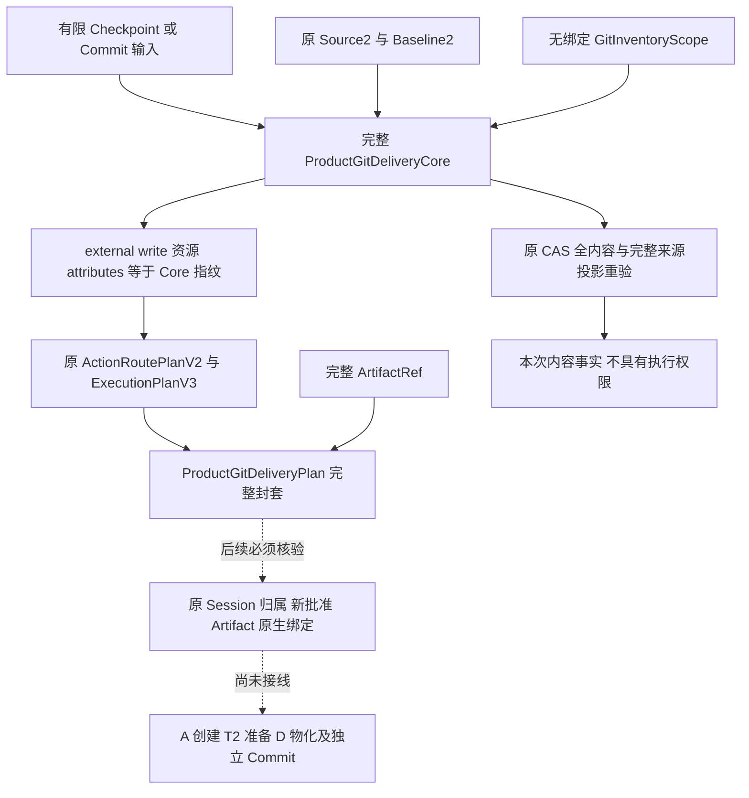
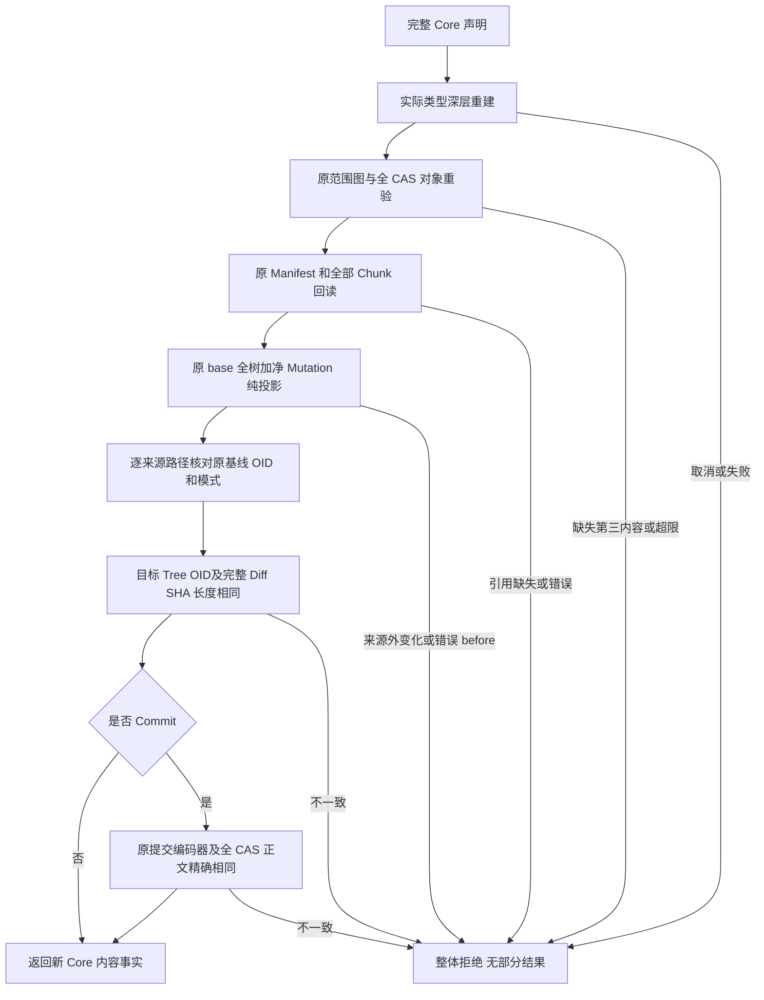
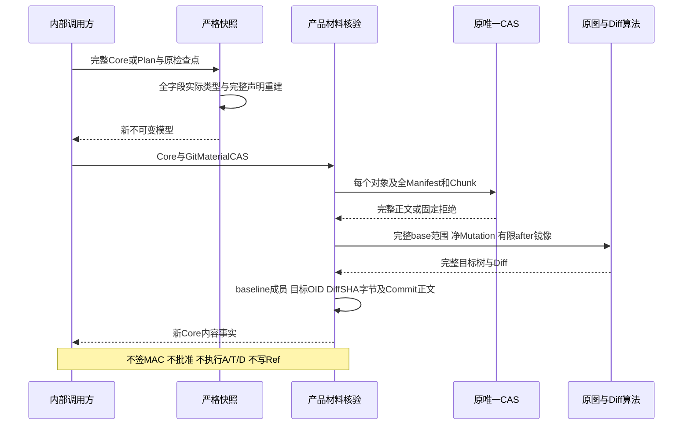

# 完整 Git 交付执行意图与单向审批计划详细设计

## 1. 需求背景与变更摘要

Coding Agent 的 Git 交付必须只包含选定、原会话拥有的修改，不能将用户工作区的无关
暂存内容合入提交。原成功 Patch 发生在用户根 U；交付采用干净私有锚 A、在 A 上准备
但不发布的派生事务 T2、原受管交付树 D。Checkpoint 与 Commit 分别需要新的批准。

产品计划若包含 Route 指纹，而 Route 资源又包含产品计划指纹，会形成摘要循环。
原对象目录的 binding 同时包含产品计划和 Route 指纹，将其直接嵌入待规划意图会形成
另一个循环。任意占位指纹、伪造阶段或缺省绑定均不能作为正式方案。

本变更实现两个不具有授权能力的正式组件：

1. 无 binding、无阶段的完整 `GitInventoryScope`，复用原目录图及实际 CAS 算法。
2. 完整 `ProductGitDeliveryCore` 先冻结执行意图，原 Route 再绑定 Core 指纹，最后封装
   完整 Review 引用为 `ProductGitDeliveryPlan`。持久字节仍受原 512KiB 上限控制。

### 1.1 当前实现与未完成范围

| 已实现 | 明确未实现 |
|---|---|
| 有限 Checkpoint/Commit 输入合同 | 默认 Agent Tool Catalog 注册、模型工具调用接线 |
| 完整 Source2/Baseline2、物理 Index、commonDir、A/D 意图、对象范围及提交字段绑定 | 这些声明的受控原生采集与实际 Session/Router 归属交叉验证 |
| 严格深层快照、完整规范字节、重复键/别名/超限拒绝 | 正式 ProductLink 阶段读写、认证业务关联及跨库恢复 |
| 原 CAS 两树及有序外部父边重验、全父历史 Manifest/Chunk 回读 | 新 A 创建、实际 T2 持久派生、NativeBridge 发布及 D 物化 |
| 原算法重算目标树、完整 Diff 与提交原字节 | 正式 Git Review Artifact 发布/分页语义及新批准消费 |
| 原 Route 必须 REQUIRE_APPROVAL，资源必须绑定相同完整 Core | 实际人工批准证明、执行权限、发布成功或备份 v2 |

**构造、解码、摘要匹配或材料校验成功均不是执行准入。** 当前默认产品工具范围不变。
总体业务闭包仍以 [Git 产品接线与备份设计](m09-r4-git-delivery-business-backup-closure.md)
为目标，本文只将已落地的计划合同与材料核验从该目标中明确分离。

## 2. 设计目标、约束与非目标

### 2.1 设计目标

- 执行意图全部进入 Core；不允许后继封套加入第二份业务目标或任意 Git 参数。
- 完整来源与父引用保持新代际；不降级 Source1、Snapshot1 或截断 CAS 引用。
- 不重新实现 Git 图解析、树投影、Diff 或提交编码。
- 输入集合的顺序不是执行事实；来源 Patch 顺序仍由原认证 Session 收集器决定。
- 用实际类型与原字段重建阻止 `model_copy`、`model_construct`、子类及额外字段绕过。
- 超限整体拒绝，取消与超时通过原检查点传播；无部分可用计划、对象目录或 Diff。
- 声明、实际内容、认证归属和批准分别校验，不把任一层冒充其他层。

### 2.2 固定约束与取舍

原路径资源 256、镜像 32MiB、单对象/Index 8MiB、完整 Diff 64MiB、计划记录 512KiB
上限保持。树限制和 `max_parents` 显式保存，不凭当前机器自动扩大。
Core 保存完整图声明而不是对象正文；对象正文及父目录历史仍在原唯一 CAS。
复杂或长名字的完整范围超出记录上限时必须拒绝，不能裁剪节点或增大上限。

选择 Core→Route→封套的代价是区分 Core 指纹与封套指纹；收益是无循环摘要且
原 Route/Execution 批准合同不变。原对象目录持久格式不变，新 Scope 没有虚构身份。

### 2.3 非目标

本变更不提供新服务、Git shell、任意 executable/env/commonDir 参数、clone、对象库、
审批转换 API、自动重试、自动 UNKNOWN 续写或新的数据库。不调用模型或 Keychain。
当前 macOS 的 Windows 逻辑元数据测试不是原生 Windows 执行或商业平台验收。

## 3. 总体架构与模块边界



`delivery` 只负责无认证的对象图/材料算法，不能访问 Session 或解释产品批准。
`product_config` 负责正式产品意图、原合同关联、完整字节入口及同源材料核验。
原 `trusted_actions`、`execution`、`session`、`artifacts` 合同与原 Gate 不变；图中虚线
表示后续准入及写阶段，不能解释为当前默认产品已经具备这些能力。

### 3.1 源码索引与调用关系

| 源码与入口 | 单一职责 |
|---|---|
| [`git_inventory_contracts.py`](../../src/harnessix/delivery/git_inventory_contracts.py) `GitInventoryScope`/`snapshot_git_inventory_scope` | 严格完整无绑定图声明，与旧目录共享 `_inventory_shape` |
| [`git_inventory_materials.py`](../../src/harnessix/delivery/git_inventory_materials.py) `verify_git_inventory_scope_materials` | 与旧 Inventory 共享 `_verify_materials`，原 CAS 两树和完整 union 重验 |
| [`git_delivery_plan_contracts.py`](../../src/harnessix/product_config/git_delivery_plan_contracts.py) | 有限输入、Index/A/D 意图、完整 Core、单向资源、Route/Artifact 封套 |
| [`git_delivery_plan_validation.py`](../../src/harnessix/product_config/git_delivery_plan_validation.py) | 唯一完整交叉字段算法；合同类仅声明数据和校验入口，不扩大类长度门禁 |
| [`git_delivery_plan_snapshot.py`](../../src/harnessix/product_config/git_delivery_plan_snapshot.py) | 依据已声明字段实际类型，逐层新建模型及 JSON 容器 |
| [`git_delivery_plan_wire.py`](../../src/harnessix/product_config/git_delivery_plan_wire.py) | 完整规范 JSON 字节、原 512KiB 限制及检查点传播 |
| [`git_delivery_plan_materials.py`](../../src/harnessix/product_config/git_delivery_plan_materials.py) | 完整 Scope、父历史、基线 OID/模式、目标/Diff/Commit 同源核验 |
| [`git_tree_diff.py`](../../src/harnessix/delivery/git_tree_diff.py) `prepare_git_tree_diff` | 复用完整原始树投影与唯一 Diff 编码器 |
| [`git.py`](../../src/harnessix/delivery/git.py) `_commit_bytes` | 保持原提交头、作者/提交者、时区及消息编码，不增加第二个编码器 |

## 4. 完整数据结构与重点字段

### 4.1 有限公开输入

`ProductGitCheckpointInput` 使用 `harnessix.product-git-checkpoint-input/v1`：
`patches` 为 1～256 个唯一事务 UUID。不得为空、重复或携带执行参数。
Core 必须证明该集合与完整 Source2 的 Patch UUID 集合完全相等；集合排序不得覆盖
Source2 中由 Session 决定的持久成功顺序。

`ProductGitCommitInput` 使用 `harnessix.product-git-commit-input/v1`：
`checkpoint_id`、`branch_ref`、`author_name`、`author_email`、`message`、`authored_at`。
分支使用原 `validate_git_branch_ref`；作者字段拒绝 NUL 及头注入，消息拒绝 NUL 且必须有末尾 LF，
时间必须有时区且时区偏移是整分钟。输入引用不证明 Checkpoint 归属或新 Ref 不存在。

### 4.2 无绑定完整对象范围

`GitInventoryScope` 恰好包含八个字段：

| 字段 | 完整含义与约束 |
|---|---|
| `action_kind` | checkpoint/commit；Commit 必须有 delivery_commit 根，Checkpoint 不得有 |
| `platform` | 路径比较及普通文件树语义的平台，不由执行时隐式切换 |
| `roots` | 固定 base_commit、base_tree、target_tree、可选 delivery_commit 的原类型请求 |
| `objects` | 全部原七字段 CAS 引用、规范角色、tree 直接边与解析提交引用；按 OID 排序唯一 |
| `external_history` | base Commit 的全部有序父边及唯一父 ID；重复父边不得丢失 |
| `limits` | 原完整树四个显式限制，不能把对象去重当作路径展开预算去重 |
| `max_parents` | 所有提交直接引用解析的显式父边上限 |
| `metrics` | 唯一正文量、对象数、直接边、两树路径展开数及深度，必须由完整图派生 |

没有 store/key/route/approval/phase/sequence/MAC 字段。Scope 是图声明，不是原持久目录。
旧 `GitObjectInventory`、旧 scope 摘要算法和持久编码保持原字节；不能以 Scope 取代
原阶段目录的 binding、认证尾锚或业务归属。

### 4.3 Index 与私有目录意图

`GitIndexFileObservation` 明确 absent/file；file 必须携带物理 identity、全 SHA 与长度；
absent 必须 identity/SHA 为 null 且长度 0。它与 Baseline2 的逻辑 Index 观察不同。

`ProductGitWorktreeIntent` 保存 role、worktree UUID、规范绝对父地址、原父 identity、
platform、base OID 及 `expected_missing=true`。目标地址只由父地址与 UUID 派生，不能
另行提供第二个 path。这不证明父目录私有、原生身份、目标不存在或位置在许可运行时根内；
上述条件必须由后续受信规划/写阶段实际复核，不能靠字符串检查替代。

### 4.4 Core 全执行意图

| 字段 | 用途与交叉验证 |
|---|---|
| `delivery_id/store_id/key_id/thread_id/turn_id` | 完整原产品调用身份声明；必须由后续认证宿主验证实际归属 |
| `call` | 原完整 ToolCallContent，工具为 git_checkpoint/git_commit，必须新审批且非只读 |
| `baseline` | 完整 Baseline2 内嵌完整 Source2，含 Mutation、Snapshot2 和全父引用 |
| `common_directory_path_sha256/common_directory_identity` | 原始物理地址和身份分别绑定，不把两者或 U/A/D 身份混用 |
| `index_file_observation` | 保留 U 原物理 Index 的完整观察，不复制正文或恢复它 |
| `anchor_intent/worktree_intent` | Checkpoint 必须同时有新 A/D，角色及 UUID 不混淆，平台/base 与来源一致 |
| `checkpoint_delivery_id` | Commit 的前序交付关联，Checkpoint 必须 null；不是重新授权证明 |
| `object_scope` | 完整八字段无绑定对象范围，base roots 与 Baseline2 完全相同 |
| `diff_sha256/diff_bytes` | 原完整 Diff UTF-8 正文的内容事实，实际重算不能截断 |
| `commit_spec` | Commit 完整原 GitCommitSpec，base/tree/newOID 与 Scope 精确一致；Checkpoint null |
| `implementation_digest` | 实现身份声明；CommitSpec 必须相同，实际宿主必须另验当前代码身份 |
| `fingerprint` | 所有 JSON 字段除自身的完整 SHA256；不包含未来 Route 或封套指纹 |

Commit 输入所有正式字段必须与完整 CommitSpec 完全一致；时间按 ISO 表达逐字一致，
不能把同一 UTC 时刻的不同偏移表达当作相同 raw Commit。原 Checkpoint 的净变化摘要
按原算法重算，并与完整 Source2 Mutation 一致。Checkpoint 不允许 CommitSpec；
Commit 不允许再次声明 A/D 新建意图。完整 Source2 的 `thread_id` 必须等于 Core。
Scope 及其树 OID 的类型/格式、基线根、提交有序父引用仍使用原领域校验。

### 4.5 Route 资源与封套

资源 kind 为 `external`、access 为 `write`。identifier 为 Store/Key/Delivery/Thread/Turn/Call
六项 UUID 完整对象的规范 SHA；attributes 为 Core 指纹。原 Route 完整资源集合必须恰为该一个资源，不能追加Core外的效果。
Invocation ID 使用原 `trusted_action_invocation_id`；工具版本、指纹、arguments、effect、
Source2 Workspace、external_action_id 与 Core 精确相同。恢复模式 external_reconcile，
原策略 REQUIRE_APPROVAL；ALLOW、DENY 或 Patch 批准均不能充当新交付准入。

`ProductGitDeliveryPlan` 保存完整 Core、完整原 RouteV2、完整 ArtifactRef 和封套指纹。
Review 引用必须 complete 且正文/记录非空；这里只检查声明，不读取或认证 Artifact。
原始 Diff SHA 与完整 Review JSONL SHA 是不同层级，**不得要求两者相等**。
实际 Session 审批须按原 request_fingerprint 绑定原 Route/Execution 指纹与 Artifact SHA。

## 5. 核心流程与完整文字说明



严格重建首先检查实际模型类型、完整字段集合、额外字段和标量类型，再交给原校验器。
`JsonValue` 只接受原生 JSON 标量/容器，UUID/Enum/日期保留原类型；所有 tuple、模型和
arguments 容器重新生成，不能共享旧可变字典。

范围核验重读每个 CAS 对象，重算类型、Git OID、全正文 SHA、长度及直接边，再复用
两根完整树遍历及精确 reachable union。它不会把未声明对象补进输入或修正 metrics。
父历史另经原 Manifest/Chunk reader 回读，不因 Git 图闭合而省略 Source2 的父历史。

树/Diff 规划将完整 catalog 与 **仅选中净变更 after blob 的镜像集合**分别传给原算法。
将 base/tree/commit 对象作为 after 镜像会违反原合同，不能通过放宽原算法解决。
基线成员的路径/实际 OID/模式逐项相同，目标根必须精确等于 Scope 目标根；因此正确的
单条 Patch 并不能遮盖完整目标树中混入的另一条无关变更。

Commit 校验复用原 `_commit_bytes`，重新计算正式作者、父/tree、日期、消息产生的原始
提交对象，再比较完整 raw SHA、Git OID 与 CAS 全正文。只检查提交头或哈希长度不足。

## 6. 时序、数据流程与持久化边界



所有同步 CPU 和 CAS 边界消费原检查点；调用方负责组合 Owner/Scope/取消/绝对期限。
本入口不新增第二个计时器，不延长截止时间。回调异常保留原对象，即使类型为
ValueError/TypeError/KernelError，也不得被解析器错误映射覆盖。

数据依赖严格为：Source/Baseline/Scope/目录意图 → Core 指纹 → 原 Route 资源及指纹 →
完整 Review 引用 → 封套指纹。原 Session request 再绑定 Route、Execution、完整调用
和 Artifact SHA。后三项认证及准入仍需实际接线，不能由材料核验自行签发。

## 7. 接口设计与核心业务伪代码

```text
snapshot_product_git_delivery_core(value, checkpoint) -> ProductGitDeliveryCore
snapshot_product_git_delivery_plan(value, checkpoint) -> ProductGitDeliveryPlan
product_git_delivery_resource(core) -> CanonicalActionResource
encode_product_git_delivery_plan(value, checkpoint) -> bytes
decode_product_git_delivery_plan(body, checkpoint) -> ProductGitDeliveryPlan
verify_product_git_delivery_core_materials(cas, value, checkpoint) -> ProductGitDeliveryCore
```

以上均是当前内部接口，无公共 CLI 命令或授权 token。

```text
encode(plan):
  深重建全部模型及可变容器
  完整JSON字段排序 UTF8 小写hex名字字节 禁止非有限数字
  逐块检查取消和累计记录上限
  超限或错误整体拒绝 否则返回完整bytes

decode(bytes):
  检查实际bytes类型及512KiB边界
  重复键检测保留原检查点异常身份
  原严格JSON模式读取UUID 日期 Enum 和完整dataclass
  深重建后重新编码
  与原bytes不完全一致则拒绝 否则返回新完整Plan

verify_materials(Core):
  deep_snapshot(Core)
  原scope_graph加全CAS两树重验
  原父历史Manifest及全部Chunk回读
  原base全树加Source净变化投影及完整Diff
  逐路径核对Baseline成员OID和mode
  比较固定target OID和完整Diff SHA及长度
  若Commit 原编码器生成对象并与原CAS全部正文比较
  最终检查点成功后返回Core 不返回批准
```

## 8. 字节、Schema 与兼容方案

新增四个完整 JSON Schema，由 [`generate_specs.py`](../../scripts/generate_specs.py) 生成：
[CheckpointInput](../../spec/product-git-checkpoint-input-v1.schema.json)、
[CommitInput](../../spec/product-git-commit-input-v1.schema.json)、
[Core](../../spec/product-git-delivery-core-v1.schema.json)、
[Plan](../../spec/product-git-delivery-plan-v1.schema.json)。
旧 272 项 Schema 不修改。Scope 的 tree basename 在新 Core JSON 中用 `name` 保存
小写偶数长度 hex；这是新 Core 的字节策略，不改变原 Inventory 的 `name_hex` 编码。
不能互换两种 Wire，也不能将原 Inventory v1 声明降级为新 Scope。

规范字节要求字段齐全，包括 null、默认 spec_version/expected_missing；解码后编码不同即
拒绝。多余字段、重复键、BOM、不同空白、同义 UUID/日期/hex 等不能成为第二种持久字节。
模型输入可采用原 Schema 默认语义；正式持久 Plan 必须是完整规范输出。

## 9. 错误分类、可观测性、失败恢复与安全边界

| 失败 | 行为与恢复 |
|---|---|
| Core/Route/输入不一致、重复键、额外字段、超限 | `git_delivery_plan_invalid` 固定公开错误，无正文、路径、作者或底层输出 |
| 原 CAS 缺失、对象类型/SHA/OID/正文或树不一致 | 保持原内容领域拒绝，不自行补材料或返回部分图 |
| 父历史引用缺失/错误 | 原 closure 拒绝，不转为缺省或旧代际 |
| 检查点取消/期限/Owner/Scope 错误 | 保留原异常身份；不重试、不产生成功计划 |
| 材料回读期间发生变化 | 每次读取仍核验内容；这是多次完整读取，不声称跨库共同原子快照 |
| 已解码历史 Plan 与当前物理环境不同 | 只能解释历史声明；必须后续新原生观察和批准，不能自动执行 |

当前入口只读原 CAS，纯计算且无持久阶段。重复调用不会创建 A/T/D、写 Git 对象、
改变 Index/Ref、签 MAC 或触发后台续写。恢复无需补写本组件状态；真实阶段恢复必须
使用尚待接线的认证 ProductLink 和原语义模型，不能从 Plan 字节推断已有外部效果。

## 10. 安装部署、测试与发布门禁

此变更随原 Python wheel 交付，不需要新中间件、数据库、服务、Docker 设置或用户配置。
运行时根布局、跨库授权、Artifact 用途、原生创建及商业平台验证仍为后续接线必要项，
不能因为组件可以安装而宣称 Git 产品交付或 R4 已完成。

测试覆盖两种对象格式、两动作、两平台逻辑元数据、完整父历史、重复外部父边、旧
Inventory Wire 回归、真实 SQLite CAS、关闭重开、任意字段/对象/Diff 篡改、错误基线成员、
源外目标变更、记录边界、取消/父取消/自定义错误身份以及无写入副作用。
验证制品、失败记录及候选 wheel 一致性见
[组件验证](../validation/git-delivery-plan-2026-10-07-v1/README.md)。

### 10.1 风险与剩余工作

- 物理观察声明必须来自受控宿主，当前合同无法证明提供者可信，不能直接暴露给模型。
- Review/Session/Router 的完整实际一致性、新批准和归属必须一起闭合；原 ALLOW 辅助函数
  不能用于新 Git 写阶段的独立审批检查。
- A/D 运行时父地址必须明确位于允许范围，不能削弱原 Process 的 StateRoot 排除保护。
- NativeBridge 必须证明真实 A 身份和实际 prepared T2，并由完整批准的确定性配方覆盖。
- 完整 typed ProductLink、业务快照、Backup2、重新绑定以及 R1～R6 同候选发布验收仍未完成。
