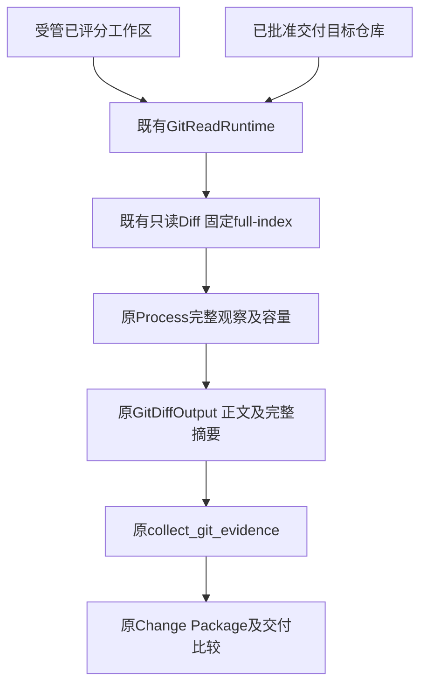
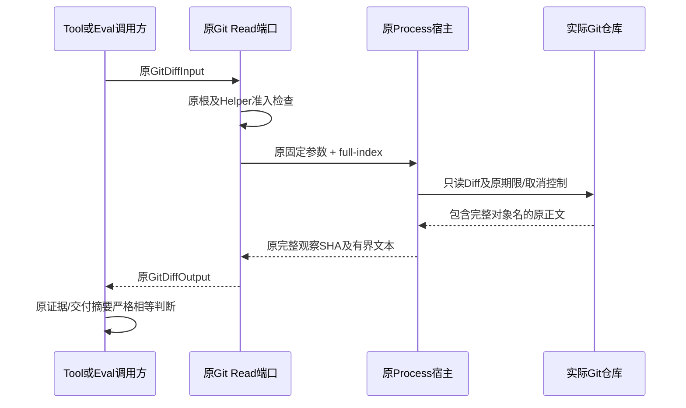
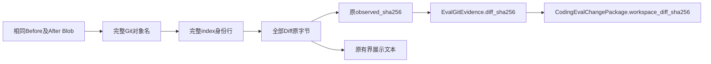

# Git Diff完整对象身份：总体与详细设计

## 1. 需求背景与已确认缺陷

当前完整干净源码回归11260项中11119通过、137跳过、4失败。其中Eval正式交付案例
`test_real_passed_eval_builds_package_and_detects_late_workspace_drift`在实际已批准应用后，
目标仓库Diff摘要不等于已评分受管工作区摘要。其他三个失败属于历史输入断言，独立处置。

两实际仓库的目标文件均9594字节、模式0644、完整SHA-256相同，未发现本次镜像损坏。
原Git Diff分别708和710字节，唯一起始身份行分别显示7位及8位对象缩写：
`index 530df50..475d060`与`index 530df503..475d0600`，导致完整正文摘要不同。
在同一原命令追加`--full-index`后，两份完整Diff摘要均为
`f4e9e01fda6dd4933b88820c1a2cc2b921fdca8982205d5f351e6de338230c87`。

该实证定位为对象身份显示宽度影响证据字节，不修改文件内容、评分或交付判定。
[Git官方合同](https://git-scm.com/docs/git-diff#Documentation/git-diff.txt---full-index)
说明该选项使用完整Blob对象名，并在Patch输出中优先于缩写设置。
不从此案例推断任意Git版本、Diff算法、路径前缀或属性配置都产生相同字节。

## 2. 设计目标、非目标与不变量

- 同样前后镜像、模式和已固定Diff设置不因对象缩写宽度产生不同摘要。
- 原完整正文SHA-256语义保持，不能忽略index行或仅比较Hunk正文。
- 在既有Git Read端口统一固定完整对象名，Eval复用，不建立第二套证据采集器。
- 原worktree/staged分支、context_lines、外部Diff/textconv禁用、取消、期限和容量保持。
- 原Git status、baseline完整树、允许路径、批准、交付和迟到漂移检查全部保留。
- 固定观察策略进入原能力指纹：GitReadRuntime.contract增加full_index=true，原工具版本计算自动绑定；
  旧能力版本请求仍由原tool_contract_changed拒绝，不能沿旧指纹静默改变观察表示。
  两个Git工具共用同一读取contract，因此git_status与git_diff共同失效；不另建分离的能力协议。

非目标：修改Grader、Task Pack、真实质量成绩、Git对象算法、二进制Diff支持或历史证据迁移。
完整对象名按实际Git算法输出，不将SHA-1长度强加到支持SHA-256的仓库。

## 3. 总体架构与模块边界



生产职责只改[`tools/git.py`](../../src/harnessix/tools/git.py)的`_execute_git_read` Diff参数列表。
[`evals/git_evidence.py`](../../src/harnessix/evals/git_evidence.py)仍复用原GitDiffOutput，
[`evals/delivery.py`](../../src/harnessix/evals/delivery.py)继续完整比较Report与当前证据，
不为缺陷添加摘要替换、正文归一化或宽松比较。

## 4. 核心流程、时序与数据流程





展示截断与完整观察摘要仍分离；完整对象名增加少量头部字节，也必须计入原输出预算。
预算不足仍按原截断/失败合同处理，不提高上限。

## 5. 接口设计、领域契约、数据结构与源码追踪

| 接口／字段 | 源码位置 | 保持的含义 |
|---|---|---|
| GitDiffInput.target/context_lines | [`git_contracts.py`](../../src/harnessix/tools/git_contracts.py) | 原worktree或staged及原上下文范围；无新用户参数 |
| _execute_git_read | [`git.py`](../../src/harnessix/tools/git.py) | 原diff_args增加full-index；原cached分支及结束分隔符不变 |
| GitReadRuntime.contract.full_index | 同上 | 固定策略元数据，进入原CodingToolRuntime能力摘要；不增加模型输入或输出Schema字段 |
| GitDiffOutput.observed_sha256/observed_bytes | 同上及原Contract | 全部实际正文，包括完整index行；不以展示文本SHA替代 |
| collect_git_evidence | [`git_evidence.py`](../../src/harnessix/evals/git_evidence.py) | 原状态完整性、变更分类、Baseline与Diff事实 |
| workspace_diff_sha256 | [`delivery_contracts.py`](../../src/harnessix/evals/delivery_contracts.py) | 私有Package仍绑定原已评分Report及完整正文摘要 |
| 原交付及迟到漂移测试 | [`test_delivery.py`](../../tests/evals/test_delivery.py) | 不更新固定预期摘要绕过，保留完整证据相等及后续漂移拒绝 |

无新类、数据库字段、公开Schema、Provider配置或执行权限。命令为原只读目的，
不读取凭据配置值、不执行Helper、不创建新工具或诊断协议。

## 6. 核心逻辑伪代码

```text
原输入与仓库根验证
原Helper配置键准入
diff_args = 原只读全局参数 + diff + 原禁止外部执行等参数
diff_args追加full-index
保留原context_lines和staged时的cached
原Process执行并结算取消/期限
返回原完整观察SHA及展示前缀
原contract的full_index=true参与原工具版本与指纹；旧版本调用失败关闭
Eval沿用原完整证据比较，不改写摘要
```

## 7. 失败、恢复、持久化与事务、安全和历史兼容

缺Git根、非法Helper、取消、超时、输出容量和文件漂移沿用原合同。
不新增重试，不删除或补签旧Eval Report、Package、批准和失败原件。
新记录按新固定命令形成，同候选评测和交付使用同一端口；旧报告不在本切片静默重新评分。
固定显示策略也必须改变既有工具能力摘要；禁止仅改变argv而让原能力指纹仍相同。
重开旧工作区时原证据逐字段不相等仍失败关闭，不能把更换观察表示当作任务重新成功。
本切片不提供历史数据迁移，也不声称旧未决Run可跨候选继续。

Report、Package及批准仍按原Store和原原子发布流程持久化，不新增记录类型或数据库事务。
观察摘要的生成发生于原只读Process结算后；交付事务仍先严格比较已评分事实，再经原审批执行。
新表示与旧持久记录不等时拒绝继续，不自动改写旧批准指纹、补签历史摘要或重置失败状态。

## 8. 部署、测试与验收方案

部署仍使用原Wheel，无中间件或新配置。实现前冻结本设计及两个实际仓库元数据对照。
先在原Git Tool测试加入worktree/staged的真实缩写设置7与8对照，预期原实现出现摘要不同，
保留红灯；原端口改为full-index后要求两次完整正文、字节数及SHA精确相同。
测试真实对象名与实际Blob身份，不替换Git命令或忽略index行。
新增真实回归分别执行SHA-1和SHA-256仓库，不将对象身份固定为40位。
原平台/Helper八种组合的完整argv断言只追加相同full-index参数，全部既有guard和精确比较保留。
新增git_status/git_diff两项能力负例：仅恢复旧contract元数据时捕获原请求，新策略产生不同版本／指纹，
旧请求由原校验拒绝，新请求正常执行。先保留无策略绑定时两项真实FAIL，再加入原contract字段。

精确执行原Git Tool、Eval Git Evidence、Eval Delivery，并保留迟到Workspace漂移负例；
受影响Windows Git读取及材料合同另作原选择回归。任何当前固定输入Catalog成员摘要刷新都必须
使用原规范生成路径、保持18最低输入与原字段/类型/CRLF合同，并独立验证精确差分；不得扩大许可差分。
Ruff、原结构门禁、Mypy、文档/Secret及实际新候选原生结果分别核验。

两个新增真实缩写宽度反例先取得2项失败；原端口固定full-index后，Git Tool、Eval Git Evidence、
Eval Delivery三个原文件共26项通过，包含批准交付后的证据相等及迟到Workspace漂移拒绝。
这些成绩是本地关联回归，不是完整后继回归、Windows原生或商用验收。
后继六文件扩展初验154项中117通过、8失败、29跳过；八项均为原完整argv断言尚未包含新固定参数。
只同步这一参数并为新增真实回归补充两种对象算法后，同一六文件最终156项中127通过、29项平台跳过，
零失败或错误。所有原参数化与guard保留，不用缩小选择范围制造通过。
后继能力兼容核对确认固定策略须进入原能力摘要，两项旧请求对照先失败；contract增加full_index=true后，
最终同六文件158项中129通过、29平台跳过，旧请求拒绝、新请求成功，零失败或错误。
原Mypy检查438件生产源码通过；可读性报告仅由原生成器同步三行源码增加和位置变化，原policy不变。
实测范围和失败保留见[正式验证报告](../validation/git-diff-history-convergence-2026-10-04-v1/README.md)。
最终八文件联合回归331项中302通过、29平台跳过。独立审查以相同最终五件源码SHA执行其中六个文件，
284项全部通过，确认能力策略缺口闭环且无未解决限定发现；284为331的子集，不累计为额外独立覆盖。
真实R3及费用未决、完整Git/Backup v2、Windows原生NTFS、消费者平台、Beta和R1～R6继续开放。

## 9. 可观测性、错误分类、风险与取舍

| 分层 | 原有可观测事实及错误 | 本次行为 |
|---|---|---|
| Tool能力准入 | `tool_contract_changed` | 新策略进入原工具版本；旧请求在Process之前拒绝 |
| 仓库与配置准入 | 原根、Helper及配置拒绝码 | 原固定根和禁止外部执行合同不改，不扩大可执行面 |
| Process观察 | stop_reason、returncode、termination及双流EOF | 按原取消、超时和不完整结果分类，不把部分输出当完整证据 |
| Diff输出 | observed_bytes、observed_sha256、truncated | 完整index计入原容量；展示前缀不替代完整摘要 |
| Eval与交付 | 原完整证据逐字段比较及漂移拒绝 | 新候选仍严格验真；旧证据不匹配不做归一化或自动迁移 |

选用官方full-index而非正文清洗，保持完整Git证据可追溯且只需既有端口固定参数。
代价是头部字节增长和工具版本改变；原输出容量可能更早触发，必须保留原限额语义。
仅解决对象缩写宽度，不承诺不同Git版本、属性、Diff算法或上下文设置得到完全相同字节。
旧持久任务跨候选延续和表示迁移不在本切片范围，仍按原严格证据合同失败关闭。
