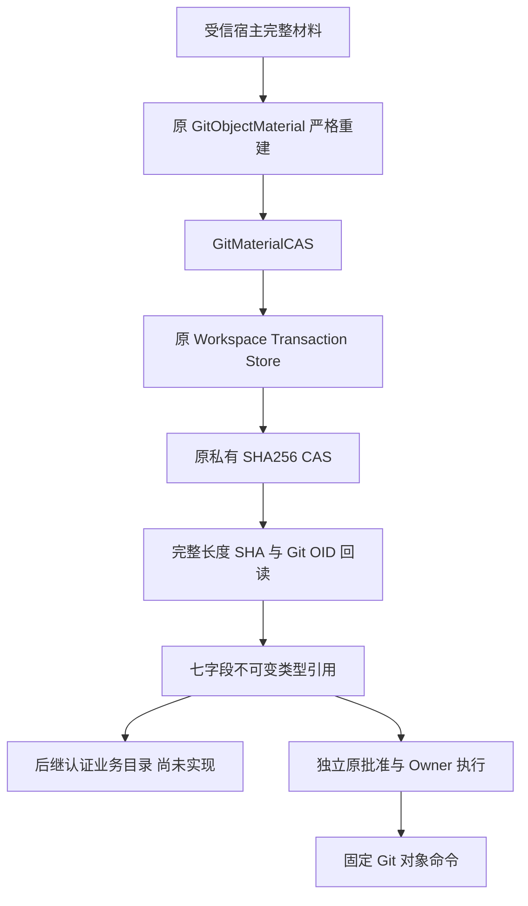
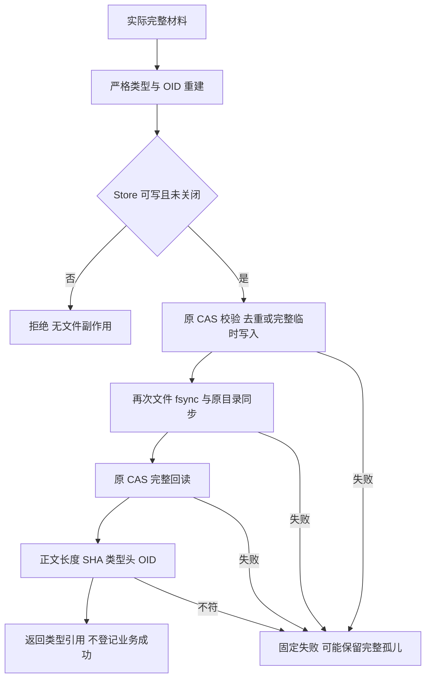
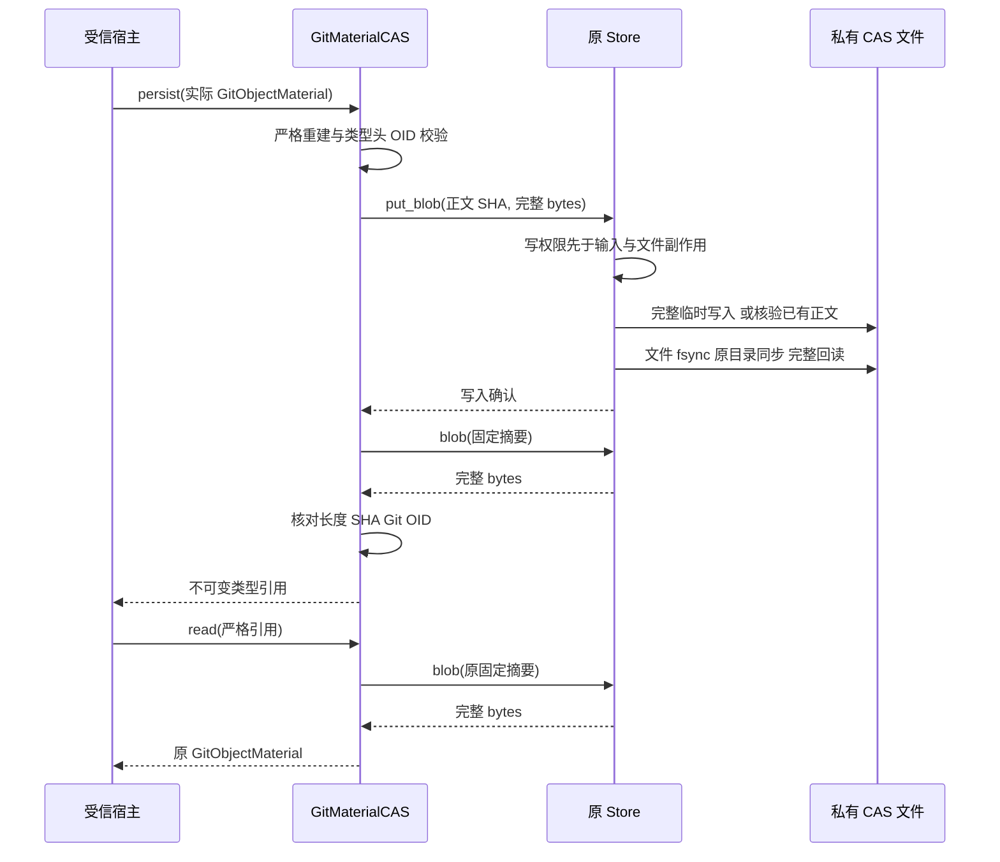
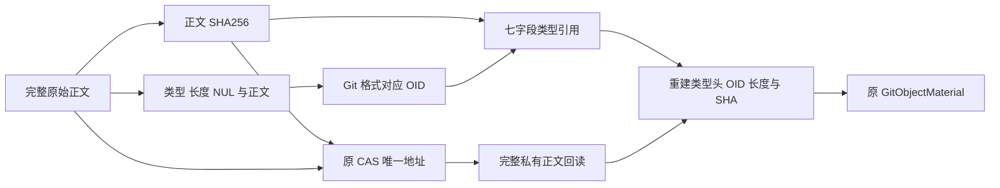
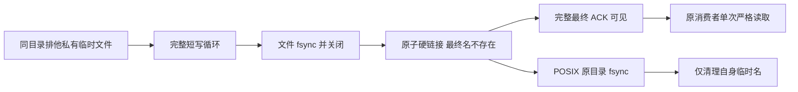

# Git 完整对象原 CAS 持久化总体与详细设计

## 1. 需求背景与实施状态

固定对象读取及完整输入已能在受批准的原 Owner 下处理三种 Git 对象和两种格式，
但对象正文仍不能作为明确类型的持久引用供后继业务目录消费。
仅持久化一个正文 SHA 会混淆 Git 对象类型、对象格式和带类型头的 OID；
仅保存外部 `.git/objects` 路径又会依赖用户仓库、GC 和外部注册的生命周期。

本实现增加原 Workspace CAS 的薄类型适配，不建立第二套 Blob 平台。
`code_revision` 是研究与比较基线；新增代码的实际字节、测试与发行物绑定由专项验证包记录。
这是完整 Git 产品交付的材料基础，不是 Commit／Checkpoint 或完整备份闭包验收。

源码核查还确认原 `read_only=True` 仅把 SQLite 置为只读：`save` 在 SQL 拒绝之前能写入新 Blob，
直接 `_put_blob` 也可写入。该文件副作用必须在写入口前拒绝，不能以 SQL 报错冒充没有落盘。
独立审查还发现原 CAS 在 O_EXCL 创建失败时仍删除同名临时文件；
公开 Store 与类型适配两条实际负对照复现后，清理权仅在排他创建成功时成立。
重启 Soak 的最终 ACK 名称在正文写满前可见，是另一个独立的发布竞态，见第13章。

## 2. 设计目标、非目标与取舍

### 2.1 目标

1. 原 `GitObjectMaterial` 完整正文经原 CAS 写入、刷盘和完整回读后，才返回严格类型引用。
2. 读取同时检查类型／格式／OID、正文 SHA、长度及原 CAS 地址，而非只比较一个摘要。
3. 保持原每对象 8,388,608 字节容量，包括二进制、空 blob／tree 和合法最小 commit。
4. 只读与已关闭 Store 在解析输入或文件副作用之前拒绝全部写入口。
5. 复用原批准、Owner 与独立批准的 Git 回读验证材料链，不赋予新的执行权限。

### 2.2 非目标

不实现对象树遍历、历史范围、对象角色、GitDB v2、MAC 业务关联、材料目录、总量配额、
跨 Store 原子提交、孤儿 GC、后台恢复、Backup v2、默认 Git Tool 或远端服务。
这些仍是[完整业务设计](m09-r4-git-delivery-business-backup-closure.md)的必要任务，不能由本引用代替。
CAS 的完整字节核验不证明原 Thread 归属、用户批准、原 Owner 回执或对象图语义有效。

### 2.3 方案取舍

- 复用 `SQLiteWorkspaceTransactionStore` 而不是新增对象数据库或存储协议：保留现有容量、私有路径、
  临时写入、文件同步与完整 SHA 核验，减少两套 IO／恢复实现。新增准入导致 Store 类超过原热点长度护栏时，
  将原完整回读及耐久确认提取到唯一 CAS IO 模块，保留原门面与326逻辑行护栏，不提高600／100／20策略。
- 类型引用独立于正文材料：正文不进入引用或 `repr`，同一正文可去重，但不同类型／格式不能混淆。
- 新公开宿主入口 `put_blob` 不创建事务行：对象内容就绪不是业务登记成功。
  后续必须先材料、后认证业务登记，不能从无行的 CAS 推导交付完成。
- 采用有界同步 IO：复用现有 Store 的线程归属，不新增后台线程。
  后继异步执行适配必须结算其拥有的 IO；本模块不提供即时取消或独立 Deadline。

## 3. 总体架构与模块边界



宿主负责来源与授权；适配层只负责对象内容绑定；原 Store 负责文件 IO 和私有持久化。
引用不保存 Key、批准、角色、路径、Ref 或执行命令。后继业务目录必须独立认证。
原同步领域 Runtime、产品装配及六库备份白名单没有因此发生变化。

## 4. 持久化流程、时序与数据流

### 4.1 写入与失败流程



只读拒绝发生在 Store 的输入校验和任何 CAS 写入之前。
Adapter 首先验证其实际材料，随后消费 Store 写入口；非法材料不能创建 Blob。
存在的同摘要正文不会替换 inode，但新入口仍重新确认文件耐久和完整读取。
失败不删除已经完整发布的合法对象，也不返回可用引用。

### 4.2 调用时序



数据流中的 Git OID 为 `hash(type + 空格 + 十进制正文长度 + NUL + 原正文)`；
CAS 地址始终是 `sha256(原正文)`。两者职责不同，不互相替代。
相同正文的不同对象引用允许共用一份 CAS，但重新读取时使用各自类型和格式计算 OID。

### 4.3 数据流程与身份区分



CAS 地址按正文去重；类型头和对象格式使 Git OID 保持独立。
引用可序列化但不包含正文、业务角色或授权。回读后必须重新计算，两条摘要链不能只验证一条。

## 5. 重点类、接口设计与源码映射

| 源码／符号 | 入参、出参与职责 |
|---|---|
| [`git_object_material.py`](../../src/harnessix/delivery/git_object_material.py) `GitObjectMaterial` | 原不可变正文材料；验证类型、格式、完整正文和 Git OID；正文不进入 repr |
| [`git_material_cas.py`](../../src/harnessix/delivery/git_material_cas.py) `GitObjectMaterialReference` | 七字段不可变引用；构造即校验；不含正文和执行权限 |
| 同模块 `binding`／`from_binding` | 输出七字段绑定；读取只接受精确 dict、全部字段及实际类型，不补默认字段、不接受额外字段 |
| 同模块 `_reference_snapshot`／`_material_snapshot` | 在实际 IO 前重建合同，拒绝通过 `object.__setattr__` 绕过 frozen 的实例 |
| 同模块 `GitMaterialCAS.persist` | 实际材料 → 原 CAS 写入与完整回读 → 引用；回读未通过不返回 |
| 同模块 `GitMaterialCAS.read` | 引用 → 原 CAS 正文 → 原 `GitObjectMaterial`；不解析对象图或第三方路径 |
| [`store.py`](../../src/harnessix/delivery/store.py) `_require_writable` | 同时保护 save、transition、put_blob、_put_blob；只读／closed 先于任何解析和写入 |
| 同模块 `put_blob` | 新受信宿主耐久入口；复用原 _put_blob，随后再次同步与完整读取，不增加事务行 |
| 同模块 `blob`／`_put_blob` | 原容量、摘要、私有文件和临时发布实现保持，不另建 CAS |
| [`workspace_cas_io.py`](../../src/harnessix/delivery/workspace_cas_io.py) `read_blob_body`／`confirm_blob_durable` | 唯一提取原完整文件回读及耐久确认；Store 门面先验证摘要和写权限，原功能不重复实现 |

这些接口是内部库能力，没有新增 CLI、SDK 操作、Action Catalog 或模型工具。

## 6. 数据结构与重点字段

| 字段 | 实际规则与来源 |
|---|---|
| `version` | 精确 `harnessix.git-object-material-reference/v1`，不隐式接受未来版本 |
| `object_type` | 精确 str：blob／tree／commit；不接受 tag、bool 或子类替代 |
| `object_id` | 对应格式的小写 Git OID；读取时重新用完整正文及类型头计算 |
| `object_format` | sha1／sha256，OID 长度分别为40／64 |
| `body_sha256` | 完整原正文 SHA256，小写64位 |
| `body_bytes` | 实际 int，拒绝 bool／float／str；0～8,388,608 |
| `cas_digest` | 精确等于 body_sha256；禁止调用方提供另外的寻址路径 |

类型引用没有 `role`、`references`、`external_history_parents`、`inventory_digest`、MAC 或批准字段。
这些属于未来业务目录，不能混入内容引用，也不能重复建立另一个名为 GitObjectMaterial 的合同。

## 7. 核心业务逻辑伪代码

```text
persist(material):
  snapshot = 严格重建实际材料，核对完整 bytes、类型头和 OID
  ref = 构造七字段严格引用
  原 Store.put_blob(ref.cas_digest, snapshot.body)
  read(ref) 必须完整成功
  返回 ref；不写 GitDB，不宣告业务完成

read(ref):
  snapshot = 严格重建实际引用
  body = 原 Store.blob(snapshot.cas_digest)
  material = 原 GitObjectMaterial(snapshot.type, snapshot.oid, snapshot.format, body)
  要求长度与正文 SHA 同时一致
  返回 material

Store 所有写入口:
  只读或 closed 时先拒绝
  之后才解析参数和调用原文件／SQLite 写逻辑
```

## 8. 失败、取消、超时与恢复语义

| 情况 | 行为与恢复边界 |
|---|---|
| 引用字段、类型、格式、OID、版本无效 | IO 前固定拒绝，不读取任意路径 |
| 正文损坏、丢失、截断、超限或错误类型 OID | 完整读取失败；不从外部 Git 自动补取 |
| 只读／closed 写入 | 输入和文件副作用前拒绝；不留下新 Blob |
| 临时写入／文件同步／目录同步失败 | 不返回引用；仅在实际取得临时文件所有权后按原规则清理，预存同名文件不删除 |
| 完整对象发布后回读失败 | 失败而不是成功；保留实际完整孤儿，不删除合法对象掩盖窗口 |
| 宿主硬崩溃 | 无新增阶段 Journal／业务目录；未登记对象不能当作已授权结果，孤儿清理仍未交付 |
| 调用方取消／超时 | 同步方法自身不接令牌；后继持有线程任务的适配必须结算 IO，再决定业务状态 |

POSIX 使用原文件 fsync 和目录 fsync。Windows 沿原私有目录创建与文件 fsync；
确认文件句柄使用 O_RDWR，以满足 Windows FlushFileBuffers 的写访问要求。
原目录同步在非 POSIX 平台不执行，因此本模块不宣称 Windows 断电后目录持久保证已验收。
普通进程重开／读取可由原生测试验证；断电语义与业务阶段闭包不能从本机回归推导。

## 9. 安全、事务与可观测性

- 只接受受信内部调用，不把普通摘要、引用或 read 返回材料称为来源认证／用户授权。
- SHA 与 OID 证明内容一致性；不抵御能够操作原 Key／私有根的任意同用户恶意进程。
- 原 CAS 中正文可被同用户修改；每次 read 都完整验真，不宣称操作系统不可变 Seal。
- 不创建跨 Store 事务；材料先于业务目录的顺序仍需后继认证阶段实现。
- `repr` 和引用不含正文／状态路径；Adapter 将底层异常转换为固定错误，不向外输出原生错误正文。
- 不新增日志、计量平台或服务。验证包只记录代码／原件摘要、数量、固定错误与未验收范围。

实际错误码：`git_material_cas_invalid`、`git_material_cas_reference_invalid`、
`git_material_cas_write_failed`、`git_material_cas_read_failed`；
原 Store 写准入增加 `delivery_store_read_only`、`delivery_store_closed`。

## 10. 完整测试与验证映射

| 验证范围 | 实际源码 |
|---|---|
| 全字段、缺字段／额外字段、类型及 frozen 绕过；三类型两格式完整8MiB；实际损坏／缺失；去重；重开 | [`test_git_material_cas.py`](../../tests/delivery/test_git_material_cas.py) |
| 原只读 save／_put_blob 及两入口临时冲突缺陷负对照；四写入口；文件／目录同步及回读失败；已有 inode 不替换 | [`test_cas_write_authority.py`](../../tests/delivery/test_cas_write_authority.py) |
| 实际 CAS → 完整原 Owner 输入 → 独立批准 Git 回读 → 只读 CAS 重开，包含全部类型／格式及8MiB | [`test_git_material_cas_integration.py`](../../tests/product_config/test_git_material_cas_integration.py) |
| Workspace Transaction／原 Git／Process／备份恢复受影响回归 | 原 tests/delivery、tests/processes 与产品状态专项 |
| 同一 Wheel 源码外双 Python、严格字节绑定、治理与真实图示 | 专项验证包，不以源内 import 替代安装验证 |

Windows 原生及最终同候选范围必须单独取得结果，不把 POSIX 通过或 Windows skip 记为成功。
完整产品门禁、R3 真实质量与 Beta 保持开放。

## 11. 部署、兼容与回退

随原 Wheel 分发，没有新依赖、端口、服务、数据库表、Schema 或配置字段。
Workspace Transaction DB 仍为原 v1；旧发行物能读取相同 CAS 字节及事务，
但没有新增类型适配或强写准入。应用回退不能被描述为原缺陷已经消失。

此模块不主动创建默认产品 Git 状态，不扩展原六库备份名单。
完整 Git 业务目录接入前，新增内部能力不得用于广告默认产品 Commit／Checkpoint。
测试和内部调用产生的无登记 CAS 仍按原状态验证规则处理，不自动成为备份的授权对象目录。

## 12. 风险与后续必需工作

本模块仅解决完整内容及类型引用。完整业务仍需对象图、总量预算、来源归属、
认证全事件前缀、GitDB／Backup v2、双受管工作树、多 Patch、新批准及新根重绑。
历史 parent 范围和业务总量门槛按完整设计冻结，不在本内容适配中隐式决定。
不能以单材料通过或内存引用替代正式业务登记与商用验收。

## 13. 重启 Soak ACK 原子发布整改

### 13.1 背景、根因与架构

固定候选 `310874c` 的 macOS 原生作业出现 ACK 内容无效。
原 [`_write_private`](../../scripts/soak_restart_child.py) 先排他创建最终路径，再写正文；
原 [`_wait_ack`](../../scripts/soak_restart.py) 一旦见到最终名就只读一次并精确要求 `ACK\n`。
两者之间存在真实空文件／部分正文可见窗口，不是应降低读侧校验的理由。



### 13.2 接口、字段与失败语义

`_write_private(path: Path, body: bytes)` 是受控夹具发布器，不是产品协议或普通文件写 API。
最终名不变，ACK 字节不变；child-result／child-failure 使用同一发布器。
临时名使用唯一 UUID，O_EXCL 创建成功后才拥有清理权；临时冲突不能删除外部文件。

完整短写循环 → fsync → close → 同目录 `os.link(temp, final)` 构成不可覆盖发布。
禁止用无条件 replace 覆盖已有最终名。文件、目录、硬链接及发布瞬间竞争目标均保持原内容。
写入／同步／链接前失败不会发布部分最终正文；链接后目录同步失败仍保留完整已发布正文，
但调用报错且不宣称目录耐久，不回删结果掩盖已经发生的发布。

消费者校验、真实硬退出、原退出／EOF、Soak 阈值和 Profile 不变；
已发布的错误 ACK 仍一次读取后拒绝，不采用读侧重试或延迟豁免。
同目录硬链接适用于实际 POSIX／本地 NTFS，其他文件系统无法链接则失败关闭；
Windows 结果必须新候选原生执行，不由 POSIX 方法存在推导成功。

### 13.3 确定性测试与恢复

[`test_soak_restart_child.py`](../../tests/benchmarks/test_soak_restart_child.py) 用真实 os.write 屏障
在写入前观测最终名：旧实现确定性失败，新实现最终名不可见。
还验证短写、文件同步／关闭顺序、目标不可覆盖、临时冲突、目录同步后失败及无效 ACK 单次拒绝。
原真实产品子进程硬退出、SDK 关闭与重启用例保持，旧 CI 失败及原源码屏障失败均保留。
测试线程由 finally 释放屏障并结算；不靠 sleep 推测竞争，不把夹具修复当作产品恢复整体通过。


## 14. Windows 材料输入夹具的正式私有创建合同

固定 `310874c` 的 Windows 原生材料步骤有23项失败，共同在 `stage_material` 的正式
私有目录核验前拒绝；不是23个独立业务缺陷，也不能跳过错误继续执行。
原测试 `_GitRunner` 在普通临时父目录下用普通 mkdir 创建 git-home／empty-hooks／tmp，
随后 C0 的正式私有创建器对这些已存在目录只验权、不修改存量 ACL，因此正确拒绝。
POSIX chmod 不能证明同一存量 Windows DACL 合格。

[材料测试夹具](../../tests/product_config/test_git_material_input.py) 现在先用原
`_prepare_directory` 正式创建三个目录，再委托原工厂创建 Runner 和 Process。
目录路径及全部 Plan／Owner／Lease／原回收语义保持，工厂的真实 async 清理仍由原实现拥有。
生命周期与退出专项共享该夹具，不修改生产 ACL／创建器，不在测试中篡改存量安全描述符。
新增确定性测试要求原 Runner 构造之前三个私有目录均已创建并通过同一正式核验；
旧夹具负对照失败、新夹具通过，只证明创建顺序整改。

原 CAS 新状态目录由 Store 首次按正式合同创建，不复用 Runner 的存量普通 mkdir，因此没有上述顺序冲突。
本机真实材料回归和新顺序用例不是 Windows 原生替代：23项原生失败保留，
后继同候选 Windows 必须实际执行完整旧选择器、新 CAS 和真实回读，未取得结果不关闭原生范围。
