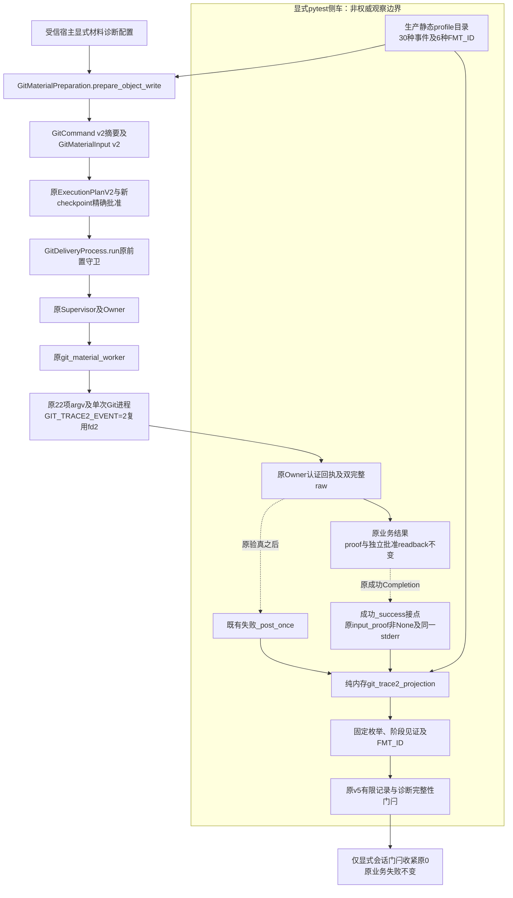
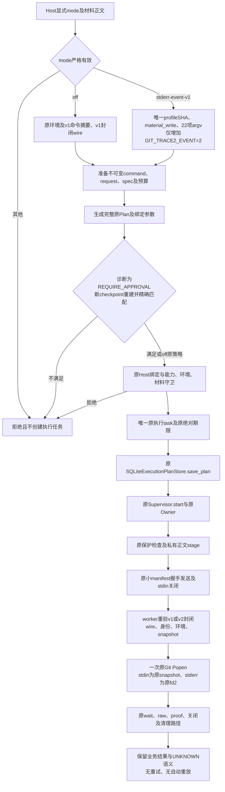
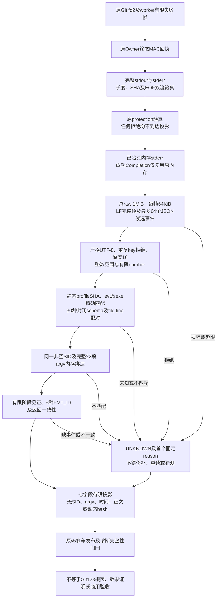
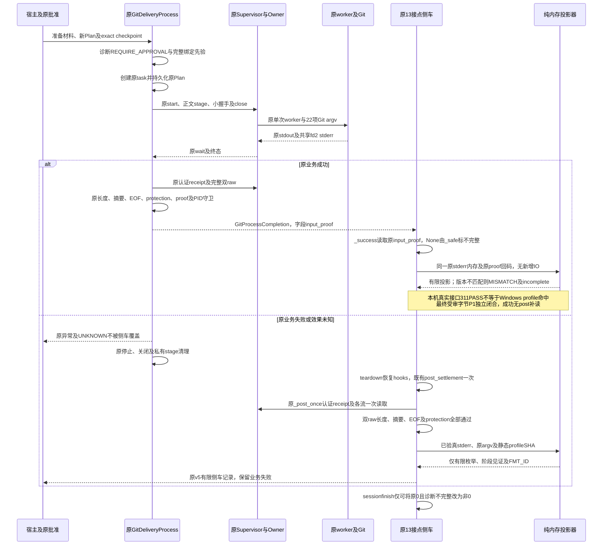

# Windows Git Trace2 正式生产诊断总体与详细设计

## 1. 需求背景、适用范围与当前结论

既有Windows材料写入诊断已证明原Git返回128、worker返回2，且成功proof缺失、独立readback未到达；固定stderr字节信号不足以区分聚合失败出口内部的具体原因。
诊断需求是增加可批准、可追溯的阶段与固定格式见证，同时保持原业务效果不确定性，而不是根据错误正文猜测权限、对象格式或输入句柄根因。
为防止观察通道扩大执行与数据暴露范围，正式绑定必须复用原fd2、原Owner、原raw认证及原批准，并在已验真内存上执行封闭投影。

本设计描述受信宿主显式开启的**完整材料写入诊断绑定**，以及既有显式pytest侧车对已认证原stderr的有限投影。
生产实现负责环境、摘要、封闭请求与批准；当前解析器和记录发布位于测试侧车，不能称为默认生产日志服务或通用Git工具。
`code_revision`仅标识工作树HEAD；未提交候选的真实身份由[交付包facts](../validation/git-material-trace2-2026-10-02-v1/facts.json)和[manifest](../validation/git-material-trace2-2026-10-02-v1/manifest.json)中的19件实际输入SHA绑定，不是全仓快照。

当前状态为**离线候选，成功接点已在最终受审字节独立闭合，四图Chrome渲染及实际视觉复核通过**。没有新Windows原生Run、没有新CI，也没有Windows/R3/fullCommit/商用R1～R6关闭依据。

### 1.1 当前源码的两项重要差异

1. 实际`TRACE2_EVENT_SCHEMAS`包含**30种**事件，`TRACE2_ERROR_FORMATS`包含6种格式；归档`interface-final.json`及规范profile同样为30项。不得将31项当成已实现，亦不得为凑数新增未知schema。
2. 原成功侧车误读`result.proof`，真实`GitProcessCompletion`字段为`input_proof`，且旧unit使用错误形状。当前`_success`已改读`result.input_proof`，None时拒绝并由原`_safe`标记不完整，无新增IO。新增真实成功接口测试及原投影回归最终311PASS；旧2FAIL及第二轮310PASS/1FAIL完整保留。独立修复闭环审查已按最终受审字节终结，状态为`P1_resolved_at_final_reviewed_bytes`，569PASS。

第二项的历史缺陷由独立档案`T2-PEER-01`及真实接口RED复现支持。原独立复核包、P1和1RED保留；修复后闭环档案为`windows-git-trace2-peer-closure-20261002-v1`，最终状态为`P1_resolved_at_final_reviewed_bytes`，原P1与全部RED保留。本机Git2.53不符合固定Windows2.55 profile，生产投影按MISMATCH标记不完整正确；本机接口通过不等于Windows profile命中或Git128根因修复。详见第9章和[评审材料](../validation/git-material-trace2-2026-10-02-v1/review-packet.md)。

### 1.2 历史失败保持

既有[Windows分支观察包](../validation/windows-git-stderr-branches-2026-10-01-v1/README.md)登记Run `36862927636`、revision `054deb6779c3faa8d7ebf920016f9b80b4f33e05`、attempt 1：原0PASS/2FAIL，Git返回128、worker返回2、成功proof缺失、独立readback未到达。
该FAIL不得被本地绿色测试、固定信号或当前候选覆盖。原Git128具体根因仍未知；本设计不宣称权限、sharing、stdin或对象正文已被确定为根因。

## 2. 设计目标、非目标与选型取舍

### 2.1 目标

- `off`默认保持原固定白名单环境、`git-fixed-command/v1`摘要结构及`git-material-input/v1`wire精确字段。
- 显式`stderr-event-v1`与唯一静态profile SHA共同绑定至v2命令摘要、v2请求、原ExecutionPlan及新checkpoint。
- 仅完整`material_write`路径可开启；一般命令、同步Runner及独立对象读取保持`off`。
- 固定`GIT_TRACE2_EVENT=2`复用Git原fd2，经原Owner捕获，不新增诊断fd、文件或Git命令。
- 只在原认证回执、双完整raw/EOF与protection之后做纯内存有限分类；不扩大执行权限或改变原UNKNOWN与禁止重放规则。

### 2.2 非目标

不提供任意Trace环境、用户指定输出目标、额外Trace文件、brief模式、通用stdout/stderr转存、动态文本摘要、动态消息hash、调用栈推断、运行binary attestation、自动修复或自动重试。
不完成Commit/Checkpoint/Ref推进、完整备份闭包、完整Git产品用户入口、Windows生产验收或商用发布。

### 2.3 取舍与约束

- 复用fd2而非新文件：保持单次进程和既有Owner链，但Trace2与原Git错误行混流，非目录内帧必须显式UNKNOWN，不能忽略噪声制造完整结果。
- 采用静态封闭目录而非泛化解析：源码和规范SHA易于批准绑定，但Git版本、schema或格式变化需独立来源求证及新批准，不能容错猜测。
- 原业务守卫先于诊断：失败的`_require_exit`可能阻断原业务raw读取，继续观察仅复用既有一次`_post_once`；成功路径不得新增后验IO。
- `off`wire兼容不代表旧批准继续有效：新增profile源码纳入实现摘要后，实际implementation identity发生变化，必须按新完整Plan取得有效批准。
- 诊断门闩只收紧显式会话退出状态：不将业务非0清零，也不以诊断数据替代业务断言。

## 3. 总体架构与模块边界



| 实际类或函数 | 职责与边界 |
|---|---|
| [Trace2Source](../../src/harnessix/delivery/git_material_trace2_profile.py#L22-L29) | 源码tag、路径、SHA及行范围；不解析raw、不授予权限 |
| [Trace2EventSchema](../../src/harnessix/delivery/git_material_trace2_profile.py#L33-L38) | 事件完整required/optional键与实际类型 |
| [Trace2ErrorFormat](../../src/harnessix/delivery/git_material_trace2_profile.py#L42-L46) | 固定FMT_ID及非穷举已求证来源 |
| [GitCommand](../../src/harnessix/delivery/git_command.py#L21-L78) | 冻结命令、环境与stdin的摘要身份 |
| [GitExecutionBinding.prepare](../../src/harnessix/delivery/git_command.py#L145-L203) | 显式诊断只准完整材料写入 |
| [GitMaterialInput](../../src/harnessix/delivery/git_material_input_contracts.py#L106-L180) | v1/v2完整材料请求与用途摘要 |
| [GitMaterialProof](../../src/harnessix/delivery/git_material_input_contracts.py#L297-L345) | 原worker生产者证明；版本仍为v1 |
| [GitMaterialExecution](../../src/harnessix/product_config/git_material_process.py#L113-L160) | 运行解释器、小握手、材料与命令绑定 |
| [prepare_object_write](../../src/harnessix/product_config/git_material_process.py#L262-L354) | 准备命令与manifest；不批准、不写正文 |
| [material_trace2_is_approved](../../src/harnessix/product_config/git_material_process.py#L207-L223) | Host模式与原审批策略入口 |
| [_diagnostic_approval](../../src/harnessix/product_config/git_material_process.py#L226-L243) | 原Plan/checkpoint严格重建与强批准 |
| [_run_process](../../src/harnessix/product_config/git_delivery_process.py#L318-L377) | 执行任务之前核对原材料、Plan、能力及批准 |
| [_execute_process](../../src/harnessix/product_config/git_delivery_process.py#L401-L475) | 原Plan持久化、Owner、stage、握手及清理 |
| [_complete_process](../../src/harnessix/product_config/git_delivery_process.py#L478-L515) | 原退出、回执、双raw、protection、proof与PID守卫 |
| [_command](../../src/harnessix/delivery/git_material_worker.py#L84-L133) | 完整22项argv与环境再次重验 |
| [_git](../../src/harnessix/delivery/git_material_worker.py#L143-L213) | 原snapshot stdin、共享fd2及单次Git子进程 |
| [Probe](../../tests/product_config/git_minimum_commit_probe.py#L188-L257) | 原有界观察记录和一次后验控制 |
| [_success](../../tests/product_config/git_minimum_commit_probe.py#L277-L309) | 成功Completion接点；读取真实input_proof，None拒绝 |
| [_post_once](../../tests/product_config/git_minimum_commit_probe.py#L401-L462) | 失败后既有完整raw取证；之后才有限投影 |
| [_Stream](../../tests/product_config/git_trace2_projection.py#L144-L233) | 当前调用内关联状态及finish有限收敛 |

生产静态profile不读取源码文件或stderr；它仅提供源身份、闭合schema及规范字节。投影器不证明MAC、Owner、权限或效果，调用方必须满足原守卫。
原Supervisor与Owner实现不是本设计修改集，也不在19件限域SHA内；其行为依据当前调用点及既有认证回执合同，不构成全依赖树验真。

## 4. 接口设计、用途与批准绑定

### 4.1 宿主接口与固定环境

`GitDeliveryProcess(..., material_trace2_mode="off")`是受信宿主显式配置入口，`checked_material_trace2_mode`仅接受实际字符串`off`或`stderr-event-v1`，不从ambient环境推导模式。
`GitMaterialPreparation.prepare_object_write(..., timeout=20.0, budget=...)`经`_material_command`生成专用命令。
`GitExecutionBinding.prepare`诊断分支要求7个用途参数：显式common、`hash-object --no-filters -t`、类型为`blob/tree/commit`、`-w --stdin`；完整inner argv为22项，正文为实际bytes，accepted为`(0,)`，无index_file，协议为`("file",)`。

环境验证按不区分大小写的`GIT_TRACE`前缀筛选所有相关键，再与唯一允许集合精确比较：off为空，诊断仅为`{"GIT_TRACE2_EVENT":"2"}`。
因此大小写变体、其他Trace键、brief键、任意文件路径或非2值均拒绝。worker `_command`还重验完整原白名单环境，不只是Trace键。

### 4.2 数据结构、领域契约与版本兼容

原领域对象与观察记录分离，命令材料不能作为批准，有限投影不能作为Owner回执或业务效果证明。

| 领域对象 | 核心结构与约束 | 消费边界 |
|---|---|---|
| `GitCommand` | 冻结cwd/argv/environment、stdin、可执行身份、accepted、timeout及mode/profile；digest覆盖实际用途 | Host与原执行Plan绑定；正文不进入repr |
| `GitMaterialInput` | 完整材料、路径身份、来源、期限、实现及用途摘要；v1/v2按mode使用精确wire字段集 | 宿主控制握手与worker严格重验，不授权Ref或Commit |
| `GitMaterialExecution` | `request/material/argv/runtime_identity/control_input`，小握手与完整正文分离 | 原端口准备与启动前verify，不构成执行批准 |
| `GitMaterialProof` | nonce、manifest/purpose/implementation身份、正文与snapshot长度/SHA、OID、EOF、回码及生产者PID | 原Owner认证后解码；仍须独立批准readback |
| `GitProcessCompletion` | `lease/receipt/stdout/stderr/material/input_proof`；成功材料写入必须使用实际`input_proof`字段 | 成功接点只消费原验真内存；不得添加旧`proof`别名或补读 |
| Trace2七字段投影 | 固定profile状态、完整性、原因、阶段见证、FMT_ID及返回一致性 | 仅低敏观察；完整字段与有限值见第8章 |

| 对象 | off | 显式诊断 |
|---|---|---|
| `GitCommand.trace2_mode` | `off` | `stderr-event-v1` |
| `GitCommand.trace2_profile_sha256` | 空字符串 | 唯一规范SHA |
| `GitCommand.digest`规范version | `git-fixed-command/v1` | `git-fixed-command/v2` |
| command digest新增字段 | 不加入Trace字段 | 纳入mode和profileSHA |
| `GitMaterialInput.version` | `harnessix.git-material-input/v1` | `harnessix.git-material-input/v2` |
| wire与purpose digest | 删除两个内存默认Trace字段 | 完整纳入两个Trace字段 |
| `GitMaterialProof.version` | 原v1 | 仍为原v1 |
| `GitMaterialExecution.binding().version` | 原v1 | 仍为原v1，request内部为v2 |
| `PreparedGitProcess.approval_arguments().version` | 原v1 | 仍为原v1，command摘要和material_input体现诊断 |

v1 wire不能带新增键；v2不能缺mode/profile；未知版本、未知键、重复键、错类型、非规范ASCII JSON、非唯一profile或版本/mode不一致均拒绝。
`GitMaterialInput.binding`完整绑定nonce、来源digest、stage/body身份、正文长度/SHA、expected_oid、对象类型/格式、repo/common/objects身份、control_files、argv/environment、Git可执行身份、原绝对期限及implementation digest。
上述原用途内部包含私有路径及正文身份，并不意味着可以导出到诊断投影。

### 4.3 exactapproval与前置顺序



`PreparedGitProcess.approval_arguments`包含实现摘要、command摘要、原ProcessSpec；写用途另包含完整`GitMaterialExecution.binding`。
`_run_process`在`asyncio.create_task`之前核对原预算对象、准备材料、输出保护来源、命令身份、Owner能力、完整intent arguments、capability digest、cwd及无secrets。
显式诊断必须满足：

1. Host模式与`prepared.command`一致，非写用途强制off。
2. Plan和checkpoint必须为精确实际类型；经原`model_dump_json`和`model_validate_json`重建，拒绝构造绕过及深层无效字段。
3. policy必须为`PolicyDecisionKind.REQUIRE_APPROVAL`，不接受诊断ALLOW即使无checkpoint，也不接受DENY。
4. 原`execution_is_approved`核对plan_id、完整plan fingerprint及APPROVED结果；checkpoint原validator另核对decision.request_fingerprint及非空actor。
5. 原`build_host_process_binding`再次核对完整环境、spec、capability和intent。全部满足后才创建唯一执行task。

旧off Plan/checkpoint不能批准v2诊断command；改变材料、profile、模式、环境或实现身份均必须重新准备并取得匹配批准。
默认off仍复用原`execution_is_approved`策略，未强行改为新的诊断批准规则。

## 5. 单次进程流程与持久化设计

### 5.1 原执行链

```text
prepare_object_write
  → GitCommand及GitMaterialInput严格验真
  → GitMaterialExecution.verify与原PreparedGitProcess
  → 原完整Plan及新checkpoint
  → _run_process全部先验
  → 唯一_execute_process任务
  → 原SQLiteExecutionPlanStore.save_plan
  → 原Supervisor.start
  → 原protection输入检查及私有正文stage
  → 小manifest控制握手与stdin关闭
  → worker.run_worker：manifest、nonce、期限、实现、command、namespace、snapshot
  → worker._git：原snapshot stdin、原stdout PIPE及stderr=sys.stderr.buffer
  → 原wait、snapshot/namespace重验、proof、关闭及stage清理
```

worker `_git`使用`shell=False`、`close_fds=True`，不设置新session或breakaway；Git仍属于原Supervisor进程树。显式诊断不创建第二个Git进程，也不扩张原句柄所有权。
原正文stage与snapshot是原材料输入机制，不是新增诊断文件。“无新增文件/fd”限定本次Trace2增量，不能理解为原执行链从不创建材料文件或进程管道。

### 5.2 持久对象与身份

| 数据 | 持久化或存活位置 | Trace2增量 |
|---|---|---|
| 完整ExecutionPlan | 原`execution-plans.db`，`save_plan`在Owner启动前 | 原参数绑定新command/request，未新增表 |
| 小manifest | 原控制输入，规范bytes、SHA及完整request绑定 | v2增加mode/profile，不新建诊断文件 |
| 正文stage | 原私有根、O_EXCL文件、完整写入及fsync | 机制不变，身份匹配后仅清理本次文件 |
| Git原raw及终态回执 | 原Owner捕获和认证通道 | fd2复用，不新增raw导出或诊断副本 |
| SID、argv、时间、动态msg/fmt | 仅本次投影内存 | 不写入投影结果；不生成动态hash |
| 七字段Trace2投影 | 原v5侧车有限记录，原发布通道 | 不具有执行或业务成功权威 |

生产`implementation_digest()`绑定六个材料模块及两个包入口；其中包括profile文件。领域`git_delivery_implementation_digest()`及产品`git_process_implementation_digest()`分别覆盖原领域代码和适配代码。
这些是实际实现输入身份，不是OS封印，不证明任意同用户安装篡改不可发生，更不是原Git二进制构建attestation。

### 5.3 容量与期限保持

原正文8MiB、manifest 64KiB、proof 4096字节、单raw流1MiB、原写spec总output 2MiB保持。
原两个载体用例默认命令20秒、操作总期限45秒；worker使用同一绝对monotonic期限，不为子命令重新发放预算。工作流保护仍为5分钟。
生产prepare接口原有可配置timeout校验仍在，不能把载体默认20/45秒误写为所有调用的不可配置常量。
原13hooks、原两个selector、原业务断言、关闭/取消/未知效果语义保持，不新增重试、补跑或自动重放。

## 6. 静态profile与来源证明

profile ID为`harnessix.git-material-trace2-profile/v1`，规范bytes长度13224；SHA为`7120ca7cc6d73275bd29980b3b7f66be5ff0608d02ec1b241b86505677ea6e48`。
`trace2_profile_bytes()`以排序键、紧凑JSON、ASCII、禁止NaN及末尾LF生成固定字节，覆盖evt、exe、固定环境、22项argv、brief关闭、配对键、事件schema、格式来源及解释规则。
当前目录期待`evt="4"`、`exe="2.55.0.windows.5"`。实际version事件的两个字符串必须精确相等；不能只验证宿主声明的profileSHA。

### 6.1 完整30项事件目录

全部schema必有`event/sid/thread/time`，全部只允许配对出现的可选`file/line`；额外字段如下。来源统一为`v2.55.0.windows.5:trace2/tr2_tgt_event.c`，每字段实际类型及完整SHA见facts。

| event | 公共字段以外的必选键 | 公共字段以外的可选键 | 来源行 |
|---|---|---|---|
| `too_many_files` |  | 无额外项 | `117–128` |
| `version` | `evt`, `exe` | 无额外项 | `130–146` |
| `start` | `t_abs`, `argv` | 无额外项 | `148–165` |
| `exit` | `t_abs`, `code` | 无额外项 | `167–182` |
| `signal` | `t_abs`, `signo` | 无额外项 | `184–198` |
| `atexit` | `t_abs`, `code` | 无额外项 | `200–214` |
| `error` |  | `msg`, `fmt` | `233–254` |
| `cmd_path` | `path` | 无额外项 | `256–268` |
| `cmd_ancestry` | `ancestry` | 无额外项 | `270–288` |
| `cmd_name` | `name` | `hierarchy` | `290–305` |
| `cmd_mode` | `name` | 无额外项 | `307–319` |
| `alias` | `alias`, `argv` | 无额外项 | `321–337` |
| `child_start` | `child_id`, `child_class`, `use_shell`, `argv` | `hook_name`, `cd` | `339–369` |
| `child_exit` | `child_id`, `pid`, `code`, `t_rel` | 无额外项 | `371–391` |
| `child_ready` | `child_id`, `pid`, `ready`, `t_rel` | 无额外项 | `393–413` |
| `thread_start` |  | 无额外项 | `415–427` |
| `thread_exit` | `t_rel` | 无额外项 | `429–444` |
| `exec` | `exec_id`, `argv` | `exe` | `446–465` |
| `exec_result` | `exec_id`, `code` | 无额外项 | `467–482` |
| `def_param` | `scope`, `param` | `value` | `484–502` |
| `def_repo` | `repo`, `worktree` | 无额外项 | `504–517` |
| `region_enter` | `nesting` | `repo`, `category`, `label`, `msg` | `519–544` |
| `region_leave` | `t_rel`, `nesting` | `repo`, `category`, `label`, `msg` | `546–571` |
| `data` | `t_abs`, `t_rel`, `nesting`, `category`, `key`, `value` | `repo` | `573–598` |
| `data_json` | `t_abs`, `t_rel`, `nesting`, `category`, `key`, `value` | `repo` | `600–626` |
| `printf` | `t_abs` | `msg` | `628–644` |
| `timer` | `category`, `name`, `intervals`, `t_total`, `t_min`, `t_max` | 无额外项 | `646–668` |
| `th_timer` | `category`, `name`, `intervals`, `t_total`, `t_min`, `t_max` | 无额外项 | `646–668` |
| `counter` | `category`, `name`, `count` | 无额外项 | `670–686` |
| `th_counter` | `category`, `name`, `count` | 无额外项 | `670–686` |

`alias/exec/exec_result/child_start/child_exit/child_ready/too_many_files`虽有合法源码schema，但在本固定用途出现时标记`UNEXPECTED_EXECUTION_EVENT`；“目录合法”不等于“当前用途允许”。
`file/line`是事件报告点字段，不证明原fatal调用栈；不将它与6个格式调用点强行一一对应。

### 6.2 六种固定格式与非唯一解释

| FMT_ID | 当前已求证源码调用点 | 解释边界 |
|---|---|---|
| `SETUP_EXPLICIT_NOT_REPOSITORY` | `setup.c:1171–1171` | 仅见证固定格式所属分支，不认定唯一调用者或根因 |
| `SETUP_GITDIR_ENV_BOUND` | `setup.c:1157–1157` | 仅见证固定格式所属分支，不认定唯一调用者或根因 |
| `HASH_OBJECT_ADD_AGGREGATE` | `builtin/hash-object.c:31–33` | fstat或index_fd聚合失败，不能定位其中具体失败调用 |
| `HASH_OBJECT_HASH_AGGREGATE` | `builtin/hash-object.c:31–33` | 同一聚合出口的另一格式；不能由目录项推断本次-w实际到达 |
| `OBJECT_FORMAT_MALFORMED` | `object-file.c:1014–1014` | 仅见证固定格式所属分支，不认定唯一调用者或根因 |
| `GENERIC_DYNAMIC_FORMAT` | `setup.c:781–781` | 通用动态格式，原msg与errno均不解释、不导出 |

格式字面量仅在生产静态表中精确匹配，公开投影只输出FMT_ID。`GENERIC_DYNAMIC_FORMAT`可被目录识别，但不解释动态msg，也不推断errno。
六项来源都是**已求证的非穷举样例**，不保证唯一caller或穷举根因；尤其聚合格式不能区分fstat、输入读入、格式检查或对象库写入等内部失败。

### 6.3 来源验真伪代码

```python
# 离线源码来源核对，不处于运行Git热路径。
for source in 静态目录内去重的Trace2Source:
    原字节 = 读取已归档的指定tag与path源码
    assert sha256(原字节) == source.sha256
    assert source.line_start <= source.line_end <= 源码行数
    核对范围内事件写入键或固定格式调用点

规范字节 = trace2_profile_bytes()
assert sha256(规范字节) == TRACE2_PROFILE_SHA256
assert expected_evt == "4"
assert expected_exe == "2.55.0.windows.5"
# 不读取运行binary，也不据此建立binary构建证明。
```

本次实际读取并核对4件目录来源归档原字节：事件目标、setup、hash-object及object-file；SHA逐件与当前静态表一致。
来源与profile证明**源码格式合同**，而非运行binary attestation。事件exe字符串、可执行文件路径身份、来源tag与官方构建链是不同证据层，禁止合并。

## 7. raw验真与纯内存有限投影数据流



### 7.1 原认证前置条件

成功业务由原`_complete_process`检查退出后取得`_terminal_owner_receipt`，核对`ProcessOwnerReceiptV2`、双流实际长度/SHA/EOF、protection，再验证command及worker proof/PID。
失败业务仅在原清理后，`Probe.post_settlement`选取已结束、未取得原成功Completion、尚未post尝试的写操作；`post_attempted`先置位，最多调用一次既有`_post_once`。
该后验要求原handle为exited且protection可用，随后原认证回执、各流一次原output读取、双raw守卫及protection全部通过，才能识别原固定信号、worker有限失败帧并调用Trace2投影。
任何MAC、流长度、摘要、EOF或保护拒绝都不能到达分类，不另取替代回执，不重读、不修补、不解码原错误正文。

### 7.2 资源及JSON限额

| 项目 | 当前精确规则 |
|---|---|
| raw | 实际bytes，最多1,048,576字节 |
| frame | LF完整分帧，CRLF可由JSON/固定帧规则处理；单帧含末尾LF不超过65,536字节 |
| JSON候选event | 最多64个；包括会被拒绝的JSON候选，不等于64种schema |
| 深度 | 根depth=0，递归depth>16拒绝 |
| 整数token | 最多20字符，实际int，范围`-2**63 <= value < 2**64`，bool不作为整数 |
| number token | float token最多64字符，必须有限；NaN/Infinity及溢出拒绝 |
| 字符串 | 实际str且无孤立surrogate；输入UTF-8严格解码 |
| 键及类型 | JSON任意层重复key拒绝；顶层必须dict；完整封闭键集与实际类型核对 |
| 源码公共配对键 | `file`和`line`必须同时存在或同时缺席 |
| 未完成最后一帧 | 标记`MALFORMED_FRAME`，不拼接或猜测 |
| worker有限帧 | 既有失败帧及sentinel各至多一条，重复或无效标记损坏 |
| 其他stderr完整行 | 固定`UNCLASSIFIED_STDERR`，不忽略正文 |

总raw或expected-profile错误可直接返回有限不可用/不匹配记录；逐帧错误将完整性锁定UNKNOWN。达到frame/event限额即停止，其他错误可继续消费剩余有界帧，但不得恢复为KNOWN。
首个非NONE原因保留；后继原因不能抹去原unknown状态，先前合法见证可仍保留。因此“有见证”不等于“流完整”。

### 7.3 `_Stream`实际字段

| 字段 | 当前用途与导出边界 |
|---|---|
| `expected_argv` | 原完整22项argv，仅内存精确比较 |
| `result` | 七字段有限结果对象 |
| `sid` | 首个合法事件的SID，要求非空且后续相同，不导出 |
| `version_seen/start_seen` | version唯一、start唯一及argv绑定状态 |
| `event_count` | JSON候选计数，上限64，不导出 |
| `failure_frames/sentinels` | 原固定worker帧计数，各至多一条，不导出 |
| `codes` | exit/atexit实际code集合，用于有限一致性，不导出原数值集合 |
| `witnesses/formats` | 固定见证集合与固定FMT_ID集合，按固定顺序/排序导出 |

`version`严格匹配evt/exe并拒绝重复；`start`严格匹配完整argv并拒绝重复；`cmd_name`只允许`hash-object`，`def_repo`只见证事件出现；error只匹配静态fmt；signal标记返回不可用。
thread/time只接受schema类型，不据此证明线程身份、时间有效性或因果顺序。SID/argv相等只证明当前解析调用内流关联，不建立跨进程binary attestation。

### 7.4 `_Stream.finish`实际收敛规则

```python
if 缺version or 缺start or codes为空:
    unknown("MISSING_EVENTS")
if len(codes) > 1:
    return_consistency = "MISMATCH"
    unknown("RETURN_MISMATCH")
elif codes的唯一值不在{0, 128}:
    unknown("RETURN_UNAVAILABLE")
elif git_returncode是实际int and codes非空:
    if codes == {git_returncode}:
        return_consistency = "MATCHED_ZERO"或"MATCHED_128"
    else:
        return_consistency = "MISMATCH"
        unknown("RETURN_MISMATCH")
stage_witnesses = 按固定三项顺序选择已见证项
error_format_ids = sorted(formats)
return 七字段result
```

finish要求至少一个exit或atexit code，而非强制二者都有；也不要求`DISPATCH_HASH_OBJECT`或`REPO_EVENT_SEEN`全部出现。
若调用方未提供实际int的git_returncode，即使已见0/128，当前规则也可能保持`KNOWN`但`return_consistency="UNAVAILABLE"`；不能将KNOWN直接等同于返回已匹配。
若重复相同code，集合只保留一个值，当前finish不据重复次数拒绝。所有这些均是实际实现边界，不增写未实现的更强合同。

## 8. 输出字段及最小示例

Trace2投影自身只含以下7个字段，不含SID、argv、time、动态msg/fmt、原stderr、原路径或动态hash。

| 字段 | 有限值 |
|---|---|
| `profile_status` | `OFF/UNAVAILABLE/MATCHED/MISMATCH` |
| `completeness` | `KNOWN/UNKNOWN` |
| `reason` | `NONE/PROFILE_MISMATCH/LIMIT/STREAM_BINDING_MISMATCH/UNKNOWN_EVENT_OR_SCHEMA/UNEXPECTED_EXECUTION_EVENT/UNCLASSIFIED_FORMAT/RETURN_UNAVAILABLE/MISSING_EVENTS/RETURN_MISMATCH/MALFORMED_FRAME/UNCLASSIFIED_STDERR/RAW_UNAVAILABLE` |
| `stage_witnesses` | 固定顺序子集：`ENTRY_START_MATCHED/DISPATCH_HASH_OBJECT/REPO_EVENT_SEEN` |
| `error_format_ids` | 六种静态FMT_ID的有序去重子集 |
| `return_consistency` | `UNAVAILABLE/MISMATCH/MATCHED_ZERO/MATCHED_128` |
| `source_profile_id` | 固定profile ID或null；错误expected-profile时为null |

以下仅为有限投影合同示例，不是实际Windows运行结果或原stderr正文：

```json
{"profile_status":"MATCHED","completeness":"KNOWN","reason":"NONE","stage_witnesses":["ENTRY_START_MATCHED"],"error_format_ids":[],"return_consistency":"MATCHED_ZERO","source_profile_id":"harnessix.git-material-trace2-profile/v1"}
```

原v5探针外围仍含既有事件elapsed_ns、lease PID、raw摘要、材料SHA/OID及source_sha256；“无时间/动态hash”限定Trace2新增投影，不能写成整个原探针所有字段均为枚举。
原探针保留64个观察事件、8层异常链、2个操作、64KiB记录上限。发布失败或记录截断导致不完整，不能靠省略字段得到PASS。

## 9. 成功失败时序、取消与会话门闩



### 9.1 成功路径、P1修复与真实接口证据

原成功Completion的stderr已由原生产守卫验真；目标接点仅在`_success(..., phase="complete")`内做同步内存投影，无新增await、读取或后验调用。
原实现读取不存在的`result.proof`，旧治理正例用`SimpleNamespace(..., proof=...)`未覆盖实际dataclass字段；独立复核及原真实接口测试均保留RED。
当前接点读取`result.input_proof`；None时抛出有限ValueError并由原`_safe`置`incomplete=True`，不消费替代证明、不新增IO。
成功顺序为：原Completion认证完成→置`original_completion_authenticated=True`→读取lease→检查原input_proof非None→使用同一`result.stderr`内存和原proof回码进行同步投影。
`post_settlement`仍排除已认证Completion，不新增成功后验；缺proof导致不完整也不能补取流。

新增`tests/product_config/test_git_trace2_success_observation.py`真实执行原Supervisor/Owner/port.run，并核对原receipt、proof、PID、真实`GitProcessCompletion`类型、无proof旧字段、同一stderr内存引用及原input_proof回码；断言没有post尝试，reason非RAW_UNAVAILABLE，incomplete精确等于completeness非KNOWN。
原unit改用实际Completion形状，但仍为合成流合同检查，不能代替新增真实Owner接口测试。
最终`real-completion-confirmed.xml/log`为311PASS；前一轮2FAIL和中间310PASS/1FAIL均保留。
中间失败是新测试错误要求本机Git2.53命中固定Windows2.55 profile的KNOWN，而不是生产解析规则失效；最终只修正测试期待，未放宽profile或原生KNOWN强门槛。
当前probe为590行，仍在原600行限制内，未调整策略。修复后独立复核最终569PASS，P1在最终受审字节上解决；本包19件代码/测试/工作流SHA逐件与复核一致，复核20件另含原共享`pyproject.toml`配置。该闭合不等于Windows验收。

### 9.2 失败后验

原business错误、取消、timeout、control_lost或UNKNOWN均按原异常语义返回；侧车只观察。`post_status="raw_verified_only"`表示raw守卫通过，不表示Git对象写入成功。
stdout为空时`post_proof.status="absent"`；存在stdout仍须经原decode_proof合同，错误只标侧车不完整，不能改变原业务结果。
缺handle、非exited、缺保护、MAC或双raw/EOF失败均不可分类；失败后验仍只有原一次机会。

### 9.3 sessionfinish

`diagnostic_probes_complete`要求恰好A/B两个探针、显式mode、发布成功、非incomplete/非truncated、13hooks、call为passed或failed、teardown passed、每探针恰好一个write，其Trace2记录为MATCHED且KNOWN。
该函数不自行重新检查七字段所有键，也不要求三项见证全齐；不读取进程、不等待、不补IO。
`pytest_sessionfinish`只在mode非off、诊断不完整且原exitstatus=0时将session.exitstatus置TESTS_FAILED；原非0不被清零。
诊断完整且call failed的探针仍不能让原失败变PASS。off不启用新增会话门闩。

## 10. 可观测性、错误分类与安全边界

可观测性沿用原v5有限记录：`events`记录固定phase/outcome与原异常类型/代码分类，`operations`记录原lease、认证回执、raw校验、proof及新增`post_git_trace2`。
原外围elapsed_ns、PID、raw摘要和材料身份保持既有边界；新增Trace2投影只输出七字段固定枚举/见证/FMT_ID，不写入SID、argv、动态正文、时间或动态hash。
`profile_status/completeness/reason`用于区分格式匹配、观察完整性和首个固定拒绝原因；`return_consistency`独立表示回码关联，不能从KNOWN直接推导返回已匹配。
`diagnostic_incomplete/diagnostic_truncated`和发布结果仅约束显式诊断会话；任何分类都不能替代原业务断言、扩大批准或把原失败改成PASS。
不新增监控线程、后台轮询、指标持久库、stdout/stderr日志转存或诊断文件。失败分类以原KernelError、Owner状态及有限投影原因为界，完整异常/取消处理见第9章。

| 分层 | 拒绝或不完整情形 | 保持的边界 |
|---|---|---|
| Host/command/request | 未知mode/profile、非写用途、Trace键扩张、v1/v2混用或材料变化 | 执行任务与stage副作用之前拒绝 |
| Plan/checkpoint | ALLOW/DENY、缺批准、旧批准、构造绕过、深层字段不一致 | 强REQUIRE_APPROVAL及exactapproval |
| Owner/raw | 认证回执失效、任一流不完整/摘要不符/保护拒绝 | 不到达投影，无替代数据 |
| parser | 未知schema、非有限JSON、超限、流绑定不一致、缺事件或返回不一致 | 固定UNKNOWN原因，不修补、不扩权 |
| callback/publication | 缺input_proof、侧车异常、截断或发布失败 | 标记诊断不完整，原业务返回/异常不改 |
| 业务效果 | 输入可能送达但未完整验真、停止不确定、stage清理失联 | 原`git_material_effect_unknown`等禁止自动重放语义 |

固定枚举不能证明消息作者、唯一caller、数值errno或具体权限问题。Stock Trace2自身仍可能含敏感数据；固定环境与profile不是脱敏器，新增投影必须严格限制在内存。
设计与公开验证资料不复制私有档案个人路径或原stderr正文；私有证据以档案名、成员名、原字节SHA定位。任何未来公开发布仍须单独检查产物和旧外围字段暴露范围。

## 11. 部署、配置、执行、兼容与回退边界

生产代码没有新增第三方运行依赖。同一Wheel已在本机源码目录外全新Python3.12.7／3.13.8安装，
明确176文件关联范围各4819通过、57跳过，包字节、RECORD和无源码回退均通过。
两版本初轮各两个私有启动器导入范围失败保留，后继只修验证环境，产品、依赖、测试及跳过策略不变。
本机安装不代表目标Windows二进制、原生Owner或消费者批准入口已经通过；这些仍须独立验证。
正式缺省为off，不通过ambient环境启用。受信宿主配置诊断后，先准备新材料、完整Plan及新checkpoint，方可执行。
回退配置为off必须重新准备command/request/Plan并按原策略取得匹配批准，不能沿用诊断Plan或重放UNKNOWN操作。

当前manual workflow为`workflow_dispatch`，contents只读，拒绝attempt非1和已存在fixture根；固定依赖动作版本，原5分钟载体调用原两个selector并显式传入诊断mode。
工作流代码存在不代表已运行。`NEW_PRIVATE_FIXTURE_DIR`须由受信宿主显式设置为尚不存在的全新私有目录。以下命令仅描述当前载体，不属于本次实际执行记录，亦不代表Windows已通过：

```bash
uv run pytest -p tests.product_config.git_minimum_commit_probe \
  -q -s --tb=no -rN --show-capture=no --disable-warnings --no-header \
  --basetemp "$NEW_PRIVATE_FIXTURE_DIR" \
  --git-material-trace2=stderr-event-v1 \
  'tests/product_config/test_git_material_input.py::test_real_complete_input_and_independently_approved_readback[empty-or-valid-minimum-commit-sha256]' \
  'tests/product_config/test_git_material_cas_integration.py::test_complete_cas_material_original_owner_and_independent_readback[legal-minimum-commit-sha256]'
```

成功接点本机修复及最终受审字节独立闭合已验证，但Windows原生验收未完成，预期exe仍须与目标运行Git严格核对；禁止据本机绑定两例通过直接启动默认生产诊断或宣称完整侧车通过。

## 12. 验证事实、失败保留与未验证范围

| 证据批次 | 已有实际结果 | 不可推导的结论 |
|---|---|---|
| 生产绑定focused | 196PASS：74新增、122旧项；无失败/错误/跳过 | 不是新WindowsRun，不证明v5完整侧车成功接点 |
| 原twoexplicit | 新mode重执行2PASS；不是新增唯一案例 | 未加载完整v5 carrier，不与196累加 |
| 静态检查 | 原mypy 7源码；ruff/format 11文件 | 不是全仓类型或风格验收 |
| 历史投影focused | 310PASS：190旧项、120新增；无失败/错误/跳过 | 原错误unit形状未覆盖实际成功接口，不能作为当前接口全覆盖证明 |
| 真实成功接口及回归终结 | confirmed 311PASS；前两轮2FAIL和310PASS/1FAIL保留 | 本机成功接口通过不等于Windows profile命中、完整v5载体通过或Git128修复 |
| 原独立复核档案 | `T2-PEER-01`及1RED原件保留 | 不改写旧报告或历史缺陷 |
| 修复后独立闭环 | 最终569PASS；`P1_resolved_at_final_reviewed_bytes`，最终受审范围无P0/P1/P2；19件代码/测试/工作流加pyproject共20件 | 不覆盖Windows、完整v5载体、全仓或商用验收；各批次不累加 |
| 历史Windows | Run36862927636原0PASS/2FAIL | 原Git128根因未知、readback未到达，不能覆盖旧FAIL |
| 本次设计验证 | 当前19件SHA、4件官方归档SHA、JUnit重计数、字段合同及内存规则核对 | 不计为重跑pytest、mypy、ruff、原生或CI |
| 四图 | 4件mmd与文档块一致 | 集中Chrome渲染及逐图实际视觉复核均通过 |

关联整合组由`r3-trace2-candidate-20261002-v1/focused-v2.xml`登记：179测试文件、5186案例，5129PASS/57SKIP/0FAIL/0ERROR，pytest退出0；432件生产源码加179件测试输入共611件零漂移。
该结果是关联整合组，不是Trace2独有覆盖、全仓、Windows原生或商业GO，也不与311/569子范围批次累加。初次同组2FAIL、零源码漂移及后继2项导入范围control PASS均保留；最终仅修正PYTHONPATH执行环境，未修改源码或断言。
初次LR数据流宽图视觉FAIL原件私有保留；最终仅将布局方向改为TB，节点、边和语义不变，重新渲染及实际视觉复核通过。四个mmd及四个PNG的最终实际SHA由manifest绑定。

原RED、导入失败、helper collision、开发中间失败和复核RED保留于原私有档案；未删除、重写或复制原stderr正文。
测试计数按实际档案和selector去重边界分别记录，不汇总成全仓覆盖率。详细结果与当前输入匹配见[verification](../validation/git-material-trace2-2026-10-02-v1/verification.json)。

## 13. 源码输入映射、限域身份与维护要求

19件输入集身份为`7da875ba1e84f97d9647b5d0bd3be2cbb826088692e5640c4ec92fe4647a1d07`，算法与完整数组见facts。它只覆盖本设计明确范围的源码、测试、两fixture、新增真实成功接口测试及manual workflow，不涵盖CAS用例文件、Supervisor依赖或全仓输入。

| 输入相对路径 | 本次实际字节SHA256 |
|---|---|
| `src/harnessix/delivery/git_material_trace2_profile.py` | `f0cac9ca79e9d38d54d8b38ecfed5ccd25f0abb2b3347536fe18c5ef1bf63259` |
| `src/harnessix/delivery/git_command.py` | `77518b538954ab9a940748f9a2afd1893bd0df493381a39536c7f2331725d6b1` |
| `src/harnessix/delivery/git_material_input_contracts.py` | `4080c84dc577ac24116e6efd97f3db38d54ec7262bc9b71d78f4282d80a75b71` |
| `src/harnessix/delivery/git_material_worker.py` | `f56b25e5d230abf56702bc12ccf27f8344c67c34bbb8b0777128caea764bf37d` |
| `src/harnessix/delivery/git.py` | `8848a6aaaefe6b2987fb41fab0fa8b52ecf8d7533fba090e450881bae2e8de74` |
| `src/harnessix/product_config/git_delivery_process.py` | `15b394e6eb3ded3f6e67638a9d6e3ec414e01e9692ac779b238e74fa4946d403` |
| `src/harnessix/product_config/git_material_process.py` | `6c203b86d4729fc3ced38f42850e3c8744826c867d0bfeb316c22c7f09c86f4a` |
| `tests/product_config/git_minimum_commit_probe.py` | `bceaff4fdb87524189e48f28fcf3d038e50e6b428240b150c99565bcd196cf19` |
| `tests/product_config/git_trace2_projection.py` | `a86a106e35f731f46c81acc9e872e038d391130461cd674a7395a9c05d58d43f` |
| `tests/product_config/git_stderr_signals.py` | `b05e233ff9b6d73ccfe01702de22d8bb82d65283b545c4ab75f0df0be3df56cf` |
| `tests/delivery/test_git_material_trace2_contracts.py` | `3eebccb0ebd8f60714cfe1abb92ea4d2a6b85b948c2991099d76071d70ef802b` |
| `tests/product_config/test_git_material_trace2_binding.py` | `1c02451e1bb39fb50a4e9ba371ad72f1e27a667934eba53e7128724f3df5660e` |
| `tests/product_config/test_git_delivery_process.py` | `6fd8a096e54bd8c9d3e3aa3c167d1533984ad08d5c8f99880d8b2babf71a69ba` |
| `tests/product_config/test_git_material_input.py` | `2a48f4a9ee130711fe0c7726f1c329400652767b50aeb5b897b4ebd4e0c72b02` |
| `tests/governance/test_git_trace2_projection.py` | `0baf5570fb088b6cce030bbb4550cd8766395bdc15f61b97764294c47344d41c` |
| `tests/governance/test_git_minimum_commit_probe.py` | `5ae721facc2edc4eb3d7249ab7c6239134f134bc6fe425fe6976007ad33c0550` |
| `tests/governance/test_git_stderr_branches.py` | `afdd401a32ffaae6d15ff68ee70a2a9f5eced3554649b88b08ab16dacc63a2f2` |
| `.github/workflows/windows-git-minimum-commit-probe.yml` | `2dd79bdd79b5bf2a2408079d131c36ba959b68b7b37b8e9f009b070aa3c6b8a5` |
| `tests/product_config/test_git_trace2_success_observation.py` | `15d262fa11b9c23d32aea640cd6c6485c01e20031982ca5072c3c4464243534a` |

独立闭环复核枚举20件输入；与本包19件代码/测试/工作流的差项仅为原共享`pyproject.toml`，SHA为`e4929170958bb3d104b0b45ac90cc1806b67c11fae6439d7add7e84eba734bd9`，单独列于facts支持输入，不重复计入19件。复核最终输入身份为`a965313ab1cf1ce8b973e04e6419c4eafe3ef1834117848e2393fa8181cd0d6c`；该身份来自其实际20件数组，不等于本包19件身份，也不是全仓。

任何输入SHA变化均须重新核对受影响设计段、字段合同、profile及图示；不能以HEAD相同视为内容相同。
来源格式变化应更新完整静态目录并取得新profileSHA与新批准，不能放宽未知键、增添容错或将所有FMT视为唯一根因。

## 14. 评审与验收清单

- [x] 总体/详细设计、真实类/函数/字段、批准、持久化、来源证明及四个mmd原件交付。
- [x] 默认off兼容与实际implementation digest变化明确区分。
- [x] 原双raw/MAC/EOF/protection先于投影、一次失败后验和成功无新增IO边界明确。
- [x] 静态目录实际30项、6项格式及binary attestation边界明确。
- [x] 原真实Completion字段差异、P1修复、全部RED及最终受审字节闭合列入资料，不以绿色用例掩盖。
- [x] 成功接点最小修复及本机真实返回合同回归311PASS。
- [ ] 目标Windows固定profile下完整v5载体重验。
- [x] 独立复核按最终受审字节闭合T2-PEER-01，569PASS；原失败保持。
- [x] 四图经统一验证使用Chrome渲染并逐图实际视觉检查；第四图最终为TB。
- [ ] 新独立批准、固定输入及新fixture下Windows原生诊断；保留失败并定位Git128根因。
- [ ] Windows/R3/fullCommit/商用R1～R6各自的独立业务验收。
