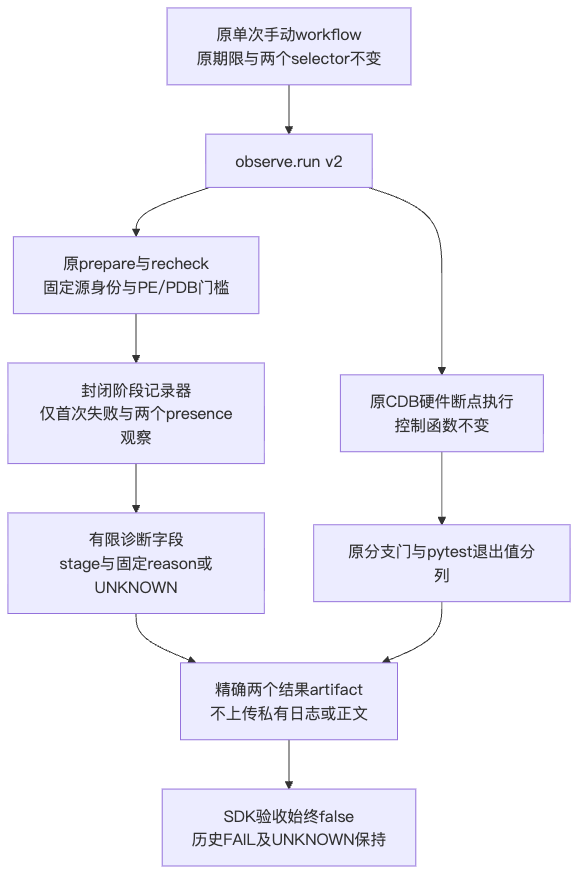
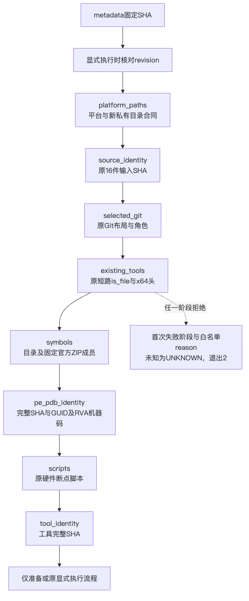
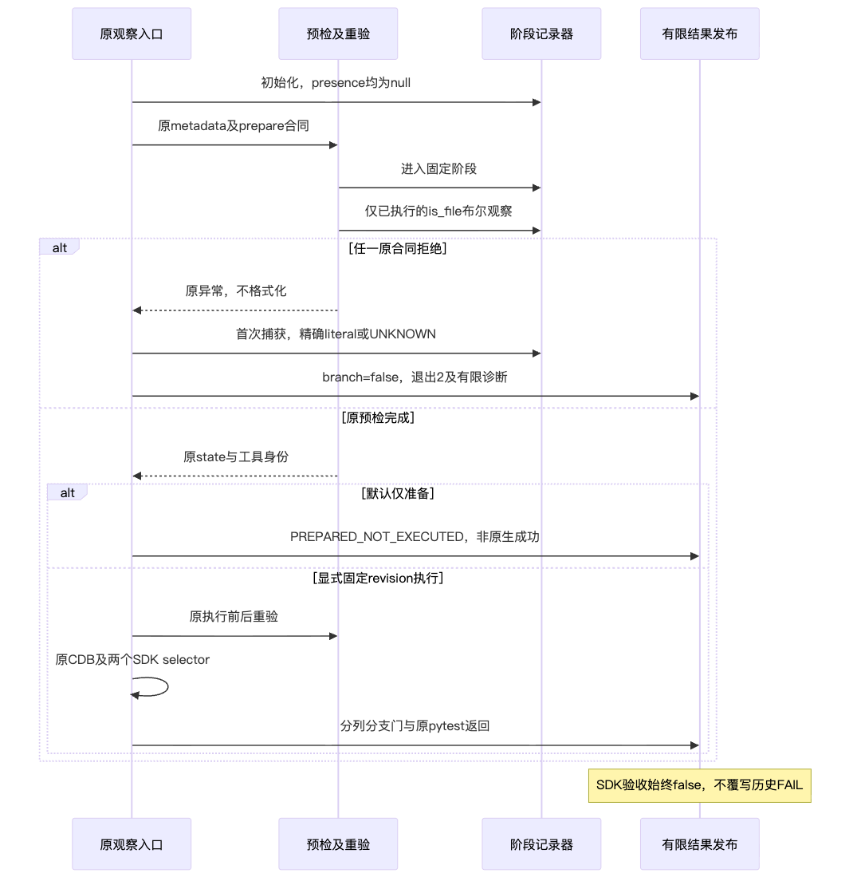
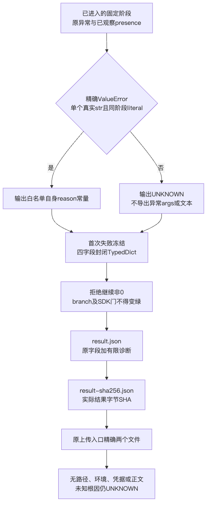

# Windows Git 定点观察发布输入接合设计

## 1. 文档摘要

本变更将已发布09a386c5269d476f6d9053c6b1b4c5ad83764372输入与既有有限诊断v2精确接合。只修改contract.json的base_revision和pyproject.toml行的四个字节身份字段，contract.py仅更新CONTRACT_SHA256字面量。不是诊断算法、源码安全策略、依赖或运行范围升级。

原v2 730冻结包、63成员清单、21件文件及index字节保持；旧Windows FAIL不覆盖。原730候选正式132与独立私有9项结果是历史证据，不能替代新输入复验。本轮实际重新执行正式132项及私有33项，全部通过，并保留接合前真实current_source_drift的1FAIL RED。

新身份由[接合验证包](../validation/git-native-authenticated-input-2026-10-02-v1/README.md)及其中SOURCE/manifest限定。09a386是发布输入基线，不是尚未发布的接合提交；后继执行必须使用包含本接合字节的完整固定revision。源码输入验真通过不是Windows断点、认证业务、R3质量或商用验收。

## 2. 需求背景

09发布基线的pyproject.toml新增三个精确历史脚本Ruff exclusions：

1. `docs/validation/m09-r3-eval-publication-wiring-20261002-v1/run_offline_tests.py`
2. `docs/validation/r3-authenticated-host-integration-2026-10-02-v1/run_offline_tests.py`
3. `docs/validation/r3-authenticated-host-integration-2026-10-02-v1/validate_documents.py`

真实TOML深比较证明，仅原extend-exclude列表增加上述三个成员；依赖、测试、安全、构建等其他模型相同。工作树实际pyproject字节也与09提交中的blob完全相同。旧v2 manifest的63成员在接合前仅pyproject一处变化。

原read_contract仍能验证原metadata SHA；随后原source_checks按旧pyproject长度/SHA检查真实当前文件，明确拒绝current_source_drift。该拒绝是正确的固定字节合同执行，不是原生CDB或Git唯一根因。输入尚未合法时进入新的Windows运行只会消耗一次运行取得已知拒绝，不构成新的原生观测证据。

## 3. 设计目标

- 将base_revision绑定09发布基线；按当前真实字节计算pyproject的LF与唯一LF→CRLF表示。
- 除上述五个JSON叶字段外，所有字段、顺序、资产、PE/PDB、历史状态、selector和预算深比较相同。
- Python只替换CONTRACT_SHA256一次；原API函数/类AST及全部其他源字节相同。
- 不编辑pyproject，不重新冻结旧21资料，不写index，不补填旧Windows诊断、不重跑旧Run。
- 保持精确source_checks；相同语义但不同字节、任意空白、混合换行、长度或SHA不符仍拒绝。

### 3.1 选型、风险与取舍

选择更新固定合同身份而不是去掉pyproject输入、忽略Ruff段或将TOML语义归一化。精确字节门禁能够识别任意变形，同时要求发布输入变化后明确生成新的合同与证据。语义比较只解释这次已发布变化，不参与运行期放行，不能成为下一次未知变化的自动许可。

新包保留旧contract.json和完整旧contract.py原字节，避免只记录常量值而丢失旧解析/校验实现身份。旧包不回写，新包单列继承与接合身份；代价是旧manifest在当前输入下不能继续作为无漂移证明。

## 4. 总体架构

运行架构不变，复用原v2四幅已渲染并逐图查看的冻结MMD/PNG。新包只复核其字节SHA，不重复生成平台、图源或像素，不声称本轮重新渲染。



新增交付边界仅包含两份合同的精确绑定及新SDD/验证包。observe、preflight、diagnostics、identity、projection、run_cases、workflow、生产材料/Owner/Job模块和两份正式测试全部不改。新SOURCE按28件实际源码输入生成身份；新manifest同时覆盖接合写集及继承的固定资料，原63/21清单保持历史原件。

CONTRACT_SHA256是离线合同完整性锚点，不是MAC、Owner授权或官方资产真实存在证明。source_checks只证明声明的16件输入逐件字节相符，不证明全仓身份、执行成功或业务完整性。

## 5. 流程时序数据流

### 5.1 原运行阶段与调用时序





调用顺序继续是read_contract先验metadata身份，再进入原平台/私有目录、source_identity、selected_git、existing_tools、symbols、PE/PDB、scripts和tool_identity阶段。显式执行仍先验证实际固定revision和单次attempt；执行前后原recheck不变。本变更没有把source_checks移到实际平台检查之前，也未为本机提供原生成功替身。

这次离线输入接合验证直接调用真实read_contract和source_checks，不调用prepare、下载或调试器。它能在macOS确认已知源码输入拒绝及接合后的16件完整匹配，不能绕过Windows平台或推断现场工具状态。

### 5.2 数据流程与持久化边界



接合生成顺序为：保存旧合同与源常量原字节；核验09实际pyproject；计算原字节长度/SHA和LF→CRLF长度/SHA；仅替换允许字段；生成新JSON真实字节SHA；仅将Python常量绑定该SHA；使用真实API离线复验。

这里没有数据库迁移、账本、Owner写入或运行期自动刷新。两份合同的本地生成不承诺跨文件原子性；发布前必须同时复核两份最终字节身份。原运行结果仍先写result.json、再写result-sha256.json，上传仍精确限定两个文件；半发布不算完整artifact。

### 5.3 图源继承

| 图 | 冻结MMD SHA256 | 已渲染PNG尺寸 |
|---|---|---|
| [architecture.mmd](../validation/git-native-branch-preflight-2026-10-02-v2/architecture.mmd) | 8612e5843fce02c5989cc275ca2bcb53959a898ea8256746a679191608ccce6a | 586×886 |
| [preflight-flow.mmd](../validation/git-native-branch-preflight-2026-10-02-v2/preflight-flow.mmd) | fc0dfa6785ce14fc9155a7914a0440c4d831c7109fa9e82d29d127f2aa8acf74 | 571×1376 |
| [execution-sequence.mmd](../validation/git-native-branch-preflight-2026-10-02-v2/execution-sequence.mmd) | d7481ed7c291119c2ba18060ccaedc16977ad3be746a3b1df75d4cf28be160f7 | 1075×1109 |
| [publication-dataflow.mmd](../validation/git-native-branch-preflight-2026-10-02-v2/publication-dataflow.mmd) | fde612386e8170837a4679cc2cd6332fab30fc0bf1a6a9afbdcbca99efdaab9e | 541×1309 |

## 6. 接口设计

| 原接口/常量 | 当前合同与边界 |
|---|---|
| `CONTRACT_SHA256` | 只绑定当前contract.json的精确LF字节SHA，不接受语义相同的新JSON |
| `read_contract(path: Path = CONTRACT_PATH) -> dict` | 原metadata验真、唯一JSON键解析及唯一完整CRLF表示规则保持 |
| `unique_object(pairs: list[tuple]) -> dict` | 重复键仍拒绝duplicate_json_key，不修改解析器 |
| `source_checks(repository: Path, contract: dict) -> list[dict]` | 逐件读取16声明文件，长度与SHA同时匹配LF或精确CRLF，否则拒绝；运行调用方必须先read_contract |
| `prepare/recheck` | 原平台、源身份、Git、PE/PDB、脚本及工具校验不改 |
| `observe.run` | 原v2封闭诊断字段、状态、执行/分支/pytest/SDK分列语义不改 |

核心伪代码：

```text
保留旧JSON和旧Python原字节
核验真实pyproject等于09发布blob
计算len(raw)、SHA256(raw)、len(raw中LF精确换CRLF)、SHA256(crlf)
new = 旧完整合同
仅更新new.base_revision和唯一pyproject行四个身份值
恢复上述五字段后必须与旧合同深比较相同
new_sha = SHA256(实际写出的新JSON LF字节)
仅替换Python的CONTRACT_SHA256一次，其他字节必须相同
另一个进程从旧原件独立复算，不使用生成报告作为预期值
真实read_contract → 真实source_checks，恰有16行完整匹配
任意新漂移仍拒绝，不自动续绑或修复
```

第二进程独立复算是独立于生成派生值的合同核验，不冒充另一人员/Agent的独立审查。有限外部审查的输入和聚焦点在新review-packet中单列。

## 7. 数据结构

contract schema继续为`harnessix.git-native-branch-contract/v1`；不增加字段、parser分支或版本容错。

| 字段 | 接合前 | 当前 |
|---|---|---|
| `base_revision` | dfba34e707ed845f3e9d844461e124015c22dca7 | 09a386c5269d476f6d9053c6b1b4c5ad83764372 |
| `source_inputs[12].path` | pyproject.toml | 原样保持 |
| `bytes` | 2149 | 2520 |
| `sha256` | e4929170958bb3d104b0b45ac90cc1806b67c11fae6439d7add7e84eba734bd9 | ba5fe71749748b17fcf36a77710dc37725d73401e3f3421225e4a1ca188404ad |
| `crlf_bytes` | 2239 | 2614 |
| `crlf_sha256` | 8d54e36f7351161f88ef2b824b9de99597e98600949a802eef15176aa0ac2643 | 57314239cdf6a9e016f4cfcb9a912b01d2006274840b1c58cbab43687293f972 |

bytes/crlf_bytes仍为原整数，SHA仍为64位lowerhex字符串，base_revision仍为40位发布基线标识。base_revision说明输入谱系，不替代execute_authorized对实际GITHUB_SHA/attempt/expected_revision的原校验。

| 当前合同文件 | SHA256 |
|---|---|
| `contract.json` | 3fdfc2ac2f69e63517d6bdfd747d6242a7c4f734553c289908b48c3c0fffb39f |
| `contract.py` | 6180abd735ee7bdeac177218344630f6a7859269404f87612a4b3d70dca394ea |

所有其他15件source行、资产URL/尺寸/SHA、官方发行身份、两对PE/PDB、GUID/age、RVA/机器码、selector、预算和历史FAIL字段深比较完全相同。旧合同快照原样保存，包括既有历史身份字段；这不是读取或重跑历史Run，也不导出原私有日志正文。

## 8. 异常安全

### 8.1 失败、取消、超时与恢复边界

- 原metadata非精确字节或混合LF/CRLF拒绝offline_metadata_sha_mismatch；没有TOML/JSON语义归一化放行。
- source长度或任一SHA不匹配仍拒绝current_source_drift；少一个文件传播原读取异常，不能返回部分列表作为通过。
- source_checks接合前拒绝是正确行为；新绑定只解除这次已发布字节变化，不自动消除现场其他拒绝。任意后继源码变化仍停止。
- 原v2首次失败、reason白名单、两个bool/null presence、UNKNOWN及拒绝退出2保持；不输出任意异常、路径、正文、环境或凭据。
- 取消/超时与CDB kill/wait、日志界限及外层清理不改。有限进程观察超时不重启测试进程或原生Run，也不制造第二次运行。

### 8.2 安全与预算

保持20秒command、45秒operation、300秒workflow step、240秒外部watchdog，官方Git/SDK/PE/PDB身份、两个固定selector和13 installed_hooks合同不变。硬件断点、Owner/Job、RO/DOD、MAC/raw/EOF/protection、安全容量、argv和精确两artifact上传不改。

没有下载、SDK安装、Git替换、凭据、模型、Docker、账本、CI、stage/commit/push或dispatch。Secret扫描只对这次精确新写集作完整零命中验证，不代替全系统无Secret证明。旧原件和有限公开证据不包含私有模型正文或raw stderr；新包不复制私有配置或个人绝对路径。

## 9. 可观测性

接合前RED由实际read_contract成功后source_checks拒绝构成，可定位已知输入不匹配；不是原WindowsRun新增诊断或CDB缺失证据。接合后必须区分源码输入合法、prepare现场门槛、原生执行、branch_gate_passed、实际pytest_exit与original_sdk_acceptance，不能合并成一个绿色状态。

原v2报告schema、四字段诊断策略和历史FAIL/UNKNOWN不变。本轮execution_performed=false、native_blocker=UNKNOWN，输入匹配没有证明选中Git、CDB、解释器或符号现场可用。旧63清单与当前字节在接合后预期三处不同，新manifest负责当前有限身份，不能回写旧manifest抹去历史。

## 10. 测试验证

### 10.1 当前输入真实复验

原两份正式测试源码完全不变，实际132 PASS＝原50＋v2新增82，0失败/错误/跳过。新增私有33项实际通过，覆盖当前真实16件完整匹配、全部16件独立单字节漂移拒绝、全16件CRLF表示、混合metadata换行、JSON/key/source顺序或空白变形、长度和SHA同时要求、缺文件、TOML同语义异字节、旧合同继续拒绝、五叶字段边界、仅常量变化及原21/index保持。

真实临时复制件来自固定源码，不以fake成功替代actual source_checks。下载入口在私有负例中禁止调用；没有原生或模型请求。第二进程从旧原字节重新计算所有长度/SHA/CRLF、五处JSON差异、Python API/类AST、发布pyproject三项排除及旧21/index身份，实际通过。

Ruff check/format各10件Python通过；strict mypy仅原新诊断模块1件，真实结果以verification为准。新SDD/README两件文档门禁和精确新写集Secret扫描结果单列，不复跑全仓、360治理或实际原生SDK selector。

### 10.2 历史结果、RED与未验证边界

原730候选独立审查132＋9的XML SHA及基线已只读核验，本轮不重跑、不累加。原v2缺诊断字段的RED及旧Windows FAIL保持；本次新输入拒绝的1FAIL另存，不删除或将失败改为平台成功。

四图原像素/图源身份不变，沿用已有实际渲染/视觉验收；本轮不重渲染。没有Windows/CDB现场实测，实际原生阻塞原因仍UNKNOWN。另一Agent外部复审未由本轮第二进程记录代替。

## 11. 源码映射

| 合同/行为 | 实际源码 | 证据 |
|---|---|---|
| 当前输入绑定 | [contract.json](../../scripts/windows_git_native_branch_observation/contract.json) | 五叶字段深比较；16真实输入双表示 |
| metadata常量/API | [contract.py](../../scripts/windows_git_native_branch_observation/contract.py) | 仅CONTRACT_SHA256字节改变；原函数/类AST相等 |
| 发布配置只读 | [pyproject.toml](../../pyproject.toml) | 与09 blob相等；仅三项精确Ruff排除语义差异 |
| 原有限诊断 | [diagnostics.py](../../scripts/windows_git_native_branch_observation/diagnostics.py)、[observe.py](../../scripts/windows_git_native_branch_observation/observe.py)、[preflight.py](../../scripts/windows_git_native_branch_observation/preflight.py) | 原21源SHA/index不变；132实际复验 |
| 官方PE/PDB与分支 | [identity.py](../../scripts/windows_git_native_branch_observation/identity.py)、[projection.py](../../scripts/windows_git_native_branch_observation/projection.py) | 继承源SHA及所有原PE/PDB字段不变 |
| 两selector/13hooks | [run_cases.py](../../scripts/windows_git_native_branch_observation/run_cases.py)、[probe](../../tests/product_config/git_minimum_commit_probe.py) | 原source与projection.installed_hooks=13合同保持 |
| 正式回归 | [原50](../../tests/governance/test_windows_git_native_branch_observation.py)、[原v2 82](../../tests/governance/test_windows_git_native_branch_preflight_v2.py) | 当前132，不改断言/选择器/skip |
| 原单次入口 | [workflow](../../.github/workflows/windows-git-native-branch-observation.yml) | 字节不变；单次attempt/固定revision/两artifact |

完整字段、API/图源/源码身份、原件、有限命令及复审聚焦点见新验证包；私有测试及XML只投影有限计数、固定reason与SHA，不公有个人路径或私有日志正文。

## 12. 部署与回退

精确集成两份合同及新SDD/验证包，原21件已冻结资料不编辑、index不改。发布后必须重新用实际checkout运行read_contract/source_checks并核对冻结成员，随后才能通过原手动入口取得一次新的固定revision现场有限结果；不得以09基线替代尚未发布的接合revision，也不重跑旧Run。

原Git/SDK/工具/符号或机器码任一不符仍拒绝，不安装SDK、不替换Git、不修改生产控制。若只回退两份合同到旧原件而保留09 pyproject，会恢复预期current_source_drift拒绝；这是安全停止，不应为恢复运行绕过检查或覆写旧失败。回退不得覆盖并行改动或旧证据。本接合不关闭Windows、R3、完整Git交付或商用验收。
