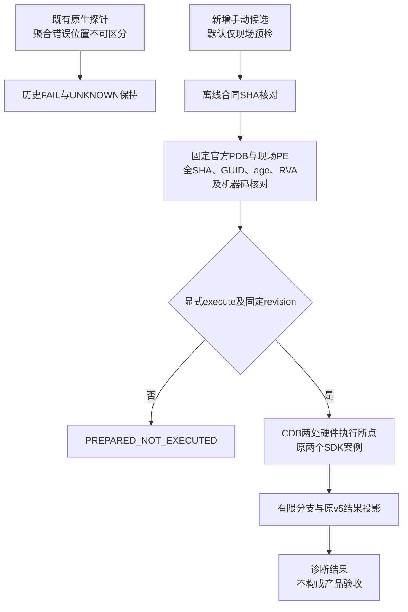
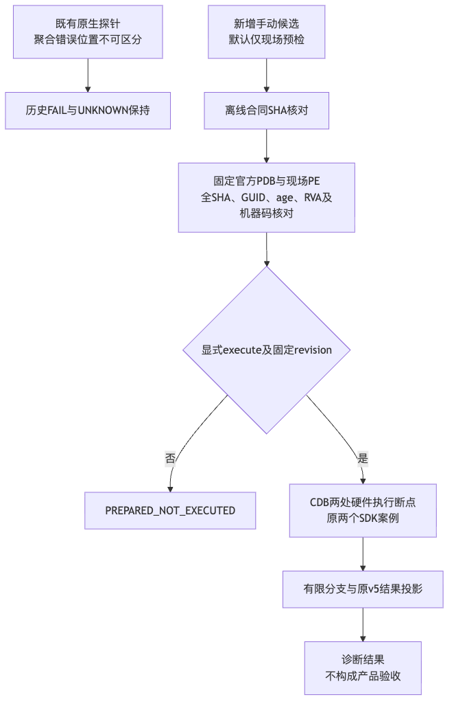
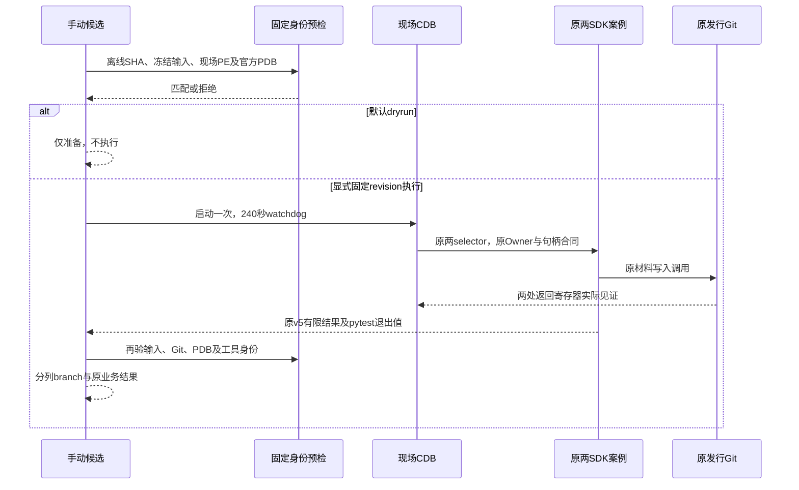
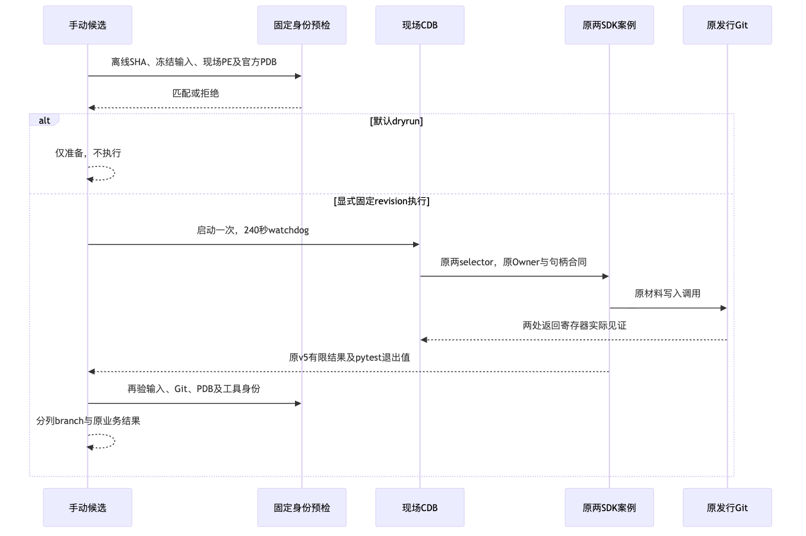
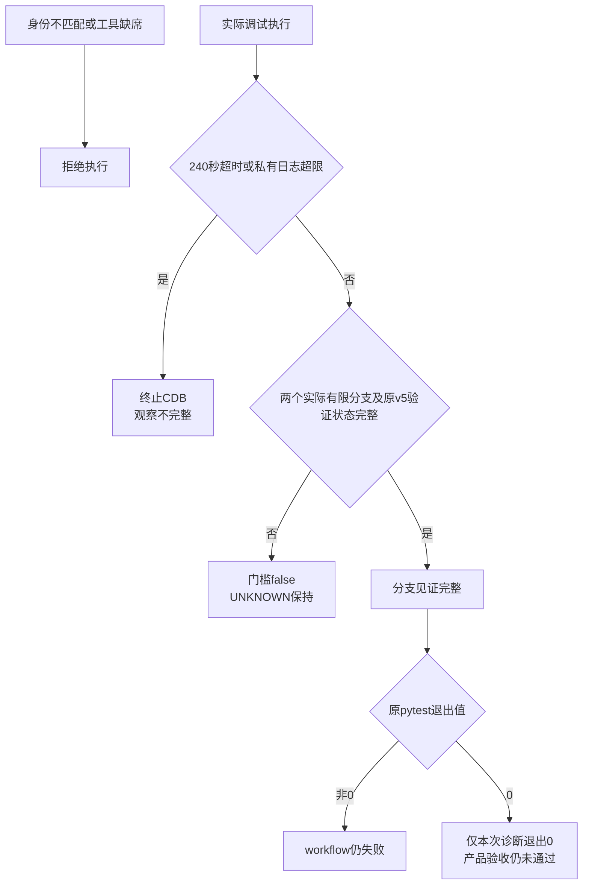
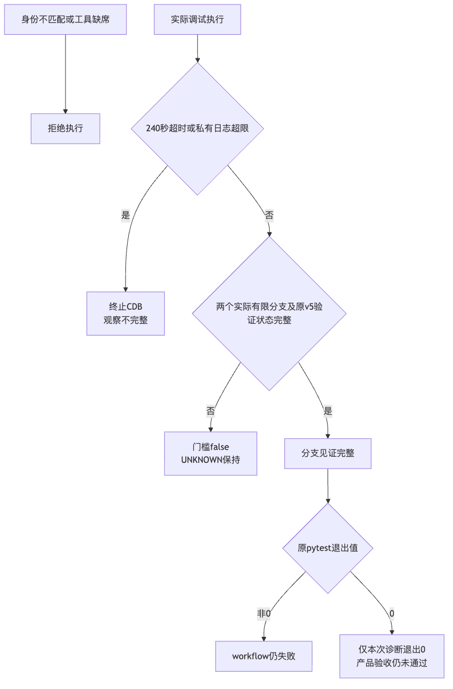

# 固定发行 Windows Git 两处返回分支定点观察设计

## 1. 需求背景与文档摘要

Windows原生Run `36949391610`、attempt 1、revision `4a9264bfeb84f04fb4976894bf350091dd8870b0`终态FAIL。原两个案例的call失败，已认证有限记录显示Git返回128、worker返回2，成功proof缺席、独立readback未到达。聚合错误格式不能唯一识别内部失败位置。

静态官方发行PE/PDB已定位`hash_fd`的两处返回检查：`mingw_fstat`调用后的RVA `0x70b74`、`index_fd`调用后的RVA `0x70bc1`。本设计新增一个独立、手动、默认不执行的诊断workflow候选，用硬件执行断点观察同次真实Git调用的EAX返回值，不增加生产诊断字段。

**当前边界：未合入、未提交、未运行Windows、未启动CI。** 本机合同测试只证明候选规则，不证明现场CDB命令语法、实际分支命中或Windows修复。历史FAIL保留，原根因保持UNKNOWN。完整输入及实际离线结果见[验证候选包](../validation/git-native-branch-observation-2026-10-02-v1/README.md)。

## 2. 设计目标、非目标与约束

- 观察实际发行Git的两处返回分支；helper成功、ARM记录、模板正文、CDB退出0、pytest退出0均不能代替真实分支记录。
- 仅一个Windows Job、仅`workflow_dispatch`；`execute`默认false，执行还要求`expected_revision`精确等于现场`GITHUB_SHA`，且attempt为1。
- 保持原Git命令20秒、操作45秒、观察step 5分钟和外层CDB 240秒watchdog。超时终止观察，不延长任何产品预算。
- 不改变原13个hook、22项argv、MAC/双raw/EOF/protection、Owner/Windows Job、容量、降权READ_ONLY句柄或DELETE_ON_CLOSE。
- 不替换现场Git，不安装调试器，不下载SDK或收费工具，不存入PE/PDB/ZIP等二进制资源。
- 非目标包括自动修复、CI自动触发、生产Owner链验收、历史Run回放、商业GO以及Windows/R3/fullCommit关闭。

术语：`branch_gate_passed`仅表示本次受控调试观察完整；`original_sdk_acceptance`始终false。分支事件按两个原selector顺序归为A/B，不是Owner PID或跨进程认证证明。

## 3. 总体架构、模块职责与变更前后



图示说明：既有失败档案保持不变；新增通道在原产品执行边界之外。离线身份或现场预检失败即拒绝，不进入调试。源码映射：`contract.read_contract`、`preflight.prepare`、`observe.run`分别负责三个门槛；`projection`不导入生产端口，也不执行Git。



| 模块 | 职责、依赖及禁止事项 |
|---|---|
| `contract.py`及`contract.json` | 唯一固定资源、身份、16件输入和预算目录；网络前验离线metadata SHA，不能接受任意URL |
| `identity.py` | 复用既有MSF7/PDB和PE解析规则；仅读取固定发行文件，不启动Git |
| `preflight.py` | 查实际`shutil.which("git")`、原wrapper/core及现场已有x64 CDB，生成两处硬件断点；不替换Git |
| `run_cases.py` | 调试根进程执行原两selector，截取原v5发布结果；不添加hook或替换材料端口 |
| `projection.py` | 严格整行有限分支解析、原v5有限字段投影；不存raw正文、对象内容、argv、SID或动态正文hash |
| `observe.py` | 默认仅预检；显式执行时前后重验身份、独占执行标记、watchdog和结果发布；不把调试器退出码当业务结果 |

## 4. 接口设计

新增[workflow](../../.github/workflows/windows-git-native-branch-observation.yml)使用与原探针一致的固定checkout/setup-uv Action SHA及锁定依赖同步，`contents: read`且checkout不保存凭据。没有push、pull_request、schedule或matrix入口。

```text
python -m scripts.windows_git_native_branch_observation.observe
  --output <RUNNER_TEMP中新建独占私有目录>
  --report <RUNNER_TEMP中新建独占有限报告目录>
  [--execute --expected-revision <经批准的40位当前提交>]
```

默认不传`--execute`：核对metadata、16件冻结输入、原Git、现场工具和固定PDB后生成CDB脚本，不启动调试器或业务案例。私有目录必须位于仓库外，且路径不能含空白、引号或分号；不能复用已存在目录。报告目录也必须新建且在仓库外。

显式执行使用已有项目venv和已有CDB，`-o`覆盖其子进程、`-G`避免退出停顿、`-hd`保持正常heap、`-sins -netsyms:no -failinc`限制到固定本地符号。不使用`-pd`，不调用目标函数、不写寄存器、不设软件断点、不Dump内存或对象正文。两处处理器只读取`PID/TID/RIP/EAX/EBX/RDI/ESI`，其中后三者确认fd=0、path=NULL和写入flag。

## 5. 数据结构/领域契约与官方身份

离线合同SHA：`abf17437af228f0f47f3c913627d399de9362e3097bf6d4de4b7dab5ea5ecc9a`。只允许原LF或精确LF→CRLF表示；16件原输入各自保留这两种明确字节SHA，不允许内容规范化容错。

[官方固定发行资产](https://github.com/git-for-windows/git/releases/tag/v2.55.0.windows.5)对应身份在[contract.json](../../scripts/windows_git_native_branch_observation/contract.json)中完整列出：

| 身份 | 固定值与核对 |
|---|---|
| PDB ZIP | `pdbs-for-git-64-bit-2.55.0.5-1.zip`；17,051,902字节；SHA `2772406eb625feaf608dee59ed37150a3ed3c1071d0001770326e3f9111e86ea` |
| 下载/解压 | 固定HTTPS发行URL，完整长度和SHA核对后只取`cmd/git.pdb`、`mingw64/bin/git.pdb`；每件再验完整SHA；无`extractall` |
| 原wrapper | SHA `78211c7ed73988da93a6d8a33d47ec6187f464d7ea2a9a00c182bbd7a1ecf30f`；GUID `BCA70EF0-BD8D-409C-A58B-43E7ED929DAD`、age 1 |
| 原core | SHA `d1b62b94aa15e5c3bbcdd6440d5f716f78daa2736a951b0f1fad11d38c5f16da`；GUID `39D2A98E-19C9-4B52-8975-0846EEB28D9C`、age 1；SizeOfImage `0x49d000` |
| 静态符号 | `hash_fd=0x70b40`、`mingw_fstat=0x315ca0`、`index_fd=0x1e7fd0`，与现场加载的符号表达式再次匹配 |
| 返回位置 | `0x70b74`七字节`85c00f889f0000`；`0x70bc1`七字节`85c07556488d8c`；同时检查前序call七字节 |

MinGit ZIP只作为已有官方PE来源身份，不在候选中下载、安装或替换现场Git。现场原Git布局必须为固定wrapper/core角色，任一文件大小、SHA、GUID/age、符号或机器码不匹配即拒绝。

结果schema为`harnessix.git-native-branch-observation/v1`。结果字段包括状态、是否执行、branch门槛、固定身份、预算、debugger/pytest退出值、超时/日志限额布尔值、A/B有限结果以及历史FAIL/UNKNOWN。原v5记录内正文、路径和动态digest不转存。

| 分支记录 | 合法序列与结论 |
|---|---|
| FSTAT=-1，INDEX未出现 | `FSTAT_FAILED`，`index_return=NOT_ENTERED`；不伪造INDEX返回值 |
| FSTAT=0后INDEX非0 | `INDEX_FAILED`；只定位到`index_fd`返回失败，不推断errno或对象原因 |
| FSTAT=0后INDEX=0 | `BOTH_SUCCEEDED`；后续错误仍可能存在，不推断Git整体成功 |
| 缺失、重复、逆序、额外调用、错误RVA/上下文/返回范围 | `UNKNOWN`或门槛false；禁止使用ARM或echo补足 |

两个材料调用必须是两个不同的Git PID，各自事件保持同TID；公开结果不输出PID/TID。A/B映射为顺序见证，不宣称与原Worker PID建立Owner认证绑定。

## 6. 流程/时序/数据流与核心伪代码



图示说明：CDB观察与原SDK执行同步发生，但不是新的正式Owner。源码映射：`observe.run_debugger`启动外部调试器；`run_cases.main`保持两个selector；原`WindowsJob.assign_suspended`仍必须成功，不因调试器冲突跳过。





图示说明：故障定位可以成功而业务仍失败；不能把二者合并成PASS。源码映射：`projection.branch_records`与`observe.observation_result`决定见证完整性，`observe.run`保留原pytest非0。原raw认证在既有端口发生，外部投影仅标记`OBSERVED_V5_VERIFIED_NOT_INDEPENDENT_MAC`，没有独立重算MAC。



```text
核对离线合同SHA及原输入；确认现场原Git与匹配官方PDB；生成两个硬件断点
若无显式执行：发布PREPARED_NOT_EXECUTED，branch=false，结束
执行前重验全部身份；独占创建执行标记；启动一次CDB
只在固定返回RVA且fd0/pathNULL/write条件下记录返回寄存器
原案例仍执行原Owner、预算、保护、raw认证和proof/readback断言
超时/超限/取消：终止CDB；不重放、不延长、不旁路Owner
执行后重验；严格投影两次实际分支和两个原v5有限结果
分支不完整则退出2；分支完整则保留原pytest退出值；产品验收始终false
```

## 7. 持久化、并发、事务与兼容

不新增生产持久化、迁移或业务事务。私有PDB、CDB脚本、调试元数据日志及原夹具位于Runner临时独占目录，日志超过16MiB的检测阈值立即终止观察，最终提取也拒绝超限文件。执行标记以`open("x")`只创建一次；目录存在拒绝，不覆盖失败或重跑证据。

公开artifact仅包含`result.json`与其SHA文件；上传明确列举两个文件，不能使用私有目录或glob。新的候选证据与历史档案互不覆盖。没有恢复重放：错误须新授权、新Run、新目录。

## 8. 失败、取消、超时与可观测/错误分类

| 状态 | 含义 |
|---|---|
| `OFFLINE_METADATA_REFUSED` | metadata损坏或未知输入，不访问资源 |
| `PREFLIGHT_REFUSED` | 平台、授权revision、源身份、工具、下载或PE/PDB预检失败；不执行Git |
| `PREPARED_NOT_EXECUTED` | dryrun完成；branch=false |
| `EXECUTION_INCOMPLETE` | 运行中或后验拒绝、超时、超限、缺失分支/原有限验证，退出2 |
| `OBSERVED_NOT_PRODUCT_ACCEPTANCE` | 两次实际分支见证与原有限结果齐全；退出值仍由原pytest决定 |

CDB硬件处理器使用`gc`自动继续，不交互等待。超时、日志限额或取消后的`finally`终止仍存活的CDB并等待至多5秒；没有`-pd`或保留调试目标的选项。实际Windows终止行为与硬件断点加载仍需原生验证，不能从本机mock测试认定已完成。

## 9. 安全、权限与信任边界

READ_ONLY duplicate仍为`0x120089`，已有READ_ATTRIBUTES；同FILE_OBJECT及DELETE_ON_CLOSE保护不变。生产快照、argv、Owner/Job、MAC/raw、容量和原期限源码无修改。任何Debugger/Owner冲突必须失败，不能切pipe、取消DOD、赋予写入/DELETE权限或跳过平台控制。

网络仅固定官方符号资产与官方HTTPS重定向，不接受工作流输入URL。完整ZIP核验先于解压，精确取两个成员，无任意路径解压。未提供Secret、认证Header、凭据读取或模型调用入口。

仅固定指令字节和边界寄存器用于身份/返回检查，不使用内存转储、栈/对象展开、目标函数调用或用户正文输出。CDB本身的元数据日志不上传；对外结果使用封闭字段。外部调试改变了进程运行环境，因此即使原SDK断言通过，也不能将其伪称为无调试的正式Owner链验收通过。

## 10. 测试、验证与验收标准

[新增治理测试](../../tests/governance/test_windows_git_native_branch_observation.py)覆盖复用PE/PDB算法、身份漂移、metadata先验、下载及成员SHA、精确CRLF表示、两个分支序列、错误上下文/echo、helper成功不可替代、v5有限投影、dryrun零执行、超时终止、失败退出保留和workflow静态合同。合成PE/PDB仅用于解析器测试，其SHA不同于正式发行binary，不计原生覆盖。

既有准备工具23PASS属于历史限域证据，不直接转计新候选。实际候选验证结果以[verification.json](../validation/git-native-branch-observation-2026-10-02-v1/verification.json)为准。

真正原生观察须同时满足现场发行身份、两个返回位置的实际命中或明确未进入、原两个案例有限raw/proof状态和后验身份不变。须保持原pytest失败状态，并与后续无调试正式产品验收分开。当前没有原生执行结果。

最终冻结候选已完成新增治理测试50PASS、关联治理组360PASS（含上述50项，不累加）；ruff及格式检查覆盖8件Python文件。三图已用现有Chrome渲染并实际视觉复核，文字可读且无截断。两个旧官方发行ZIP已重新核对完整SHA，复用解析器实际读取两对旧官方PE/PDB通过，仍仅是静态身份验证。当前源码输入26件（10件新增候选、16件原只读输入），不是全仓或Windows原生覆盖；冻结前初次47PASS及初次文档5项缺失链接FAIL原件保留。

## 11. 源码、测试与证据映射

| 设计元素 | 实际源码符号 | 验证映射 |
|---|---|---|
| 唯一资源/源冻结 | [contract.py](../../scripts/windows_git_native_branch_observation/contract.py)：`read_contract/source_checks/download_symbols` | 新增治理测试的metadata、CRLF、下载负例 |
| 发行身份 | [identity.py](../../scripts/windows_git_native_branch_observation/identity.py)：`pe_identity/pdb_identity/check_pair` | `test_identity_drift_is_refused`及合成结构对照 |
| 现场预检/加载 | [preflight.py](../../scripts/windows_git_native_branch_observation/preflight.py)：`prepare/debugger_scripts/recheck` | 硬件模板及非Windows拒绝负例 |
| 有限分支/原记录 | [projection.py](../../scripts/windows_git_native_branch_observation/projection.py)：`branch_records/project_case` | 序列、echo、raw/EOF和正文隔离负例 |
| 单次原两例 | [run_cases.py](../../scripts/windows_git_native_branch_observation/run_cases.py)：`main/CaseSink` | 有界有限记录测试；原两selector本次不执行 |
| 执行与门槛 | [observe.py](../../scripts/windows_git_native_branch_observation/observe.py)：`run/run_debugger/observation_result` | dryrun、helper、watchdog、业务非0保留 |

CDB调用语义依据Microsoft官方[硬件执行断点](https://learn.microsoft.com/en-us/windows-hardware/drivers/debuggercmds/ba--break-on-access-)、[条件断点自动继续](https://learn.microsoft.com/en-us/windows-hardware/drivers/debuggercmds/gc--go-from-conditional-breakpoint-)与[有限printf格式](https://learn.microsoft.com/en-us/windows-hardware/drivers/debuggercmds/-printf)。这些文档不是本候选已在CDB现场运行的证据。

## 12. 部署、兼容、回退与风险取舍

候选须先审查固定协议和源码，再冻结字节、完成本地验证，最后经独立授权合入固定提交；不得在未批准提交上dispatch。执行输入必须精确写入该提交SHA。现场工具或Git发行不同则停止，不下载安装替代程序以制造通过。

回退仅是不合入或移除新增诊断入口，既有工作流与生产接口无变更。风险包括调试器与Owner/Job冲突、硬件断点事件调度及CDB语法尚无原生运行证据。A/B分支按原串行selector顺序关联，不等价于Worker/Git间认证绑定；需要更强绑定时应独立设计而非扩展生产侧车字段。

两处分支只能缩小实际返回失败位置，不能自动证明DELETE_ON_CLOSE、权限或对象格式为根因。未观测到可区分的真实返回前不修改生产控制。
