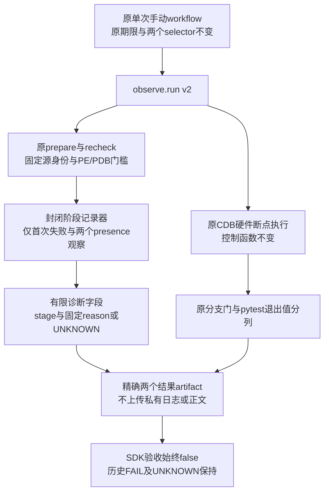
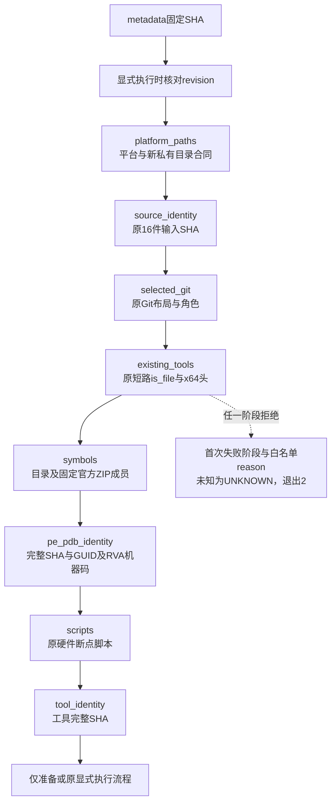
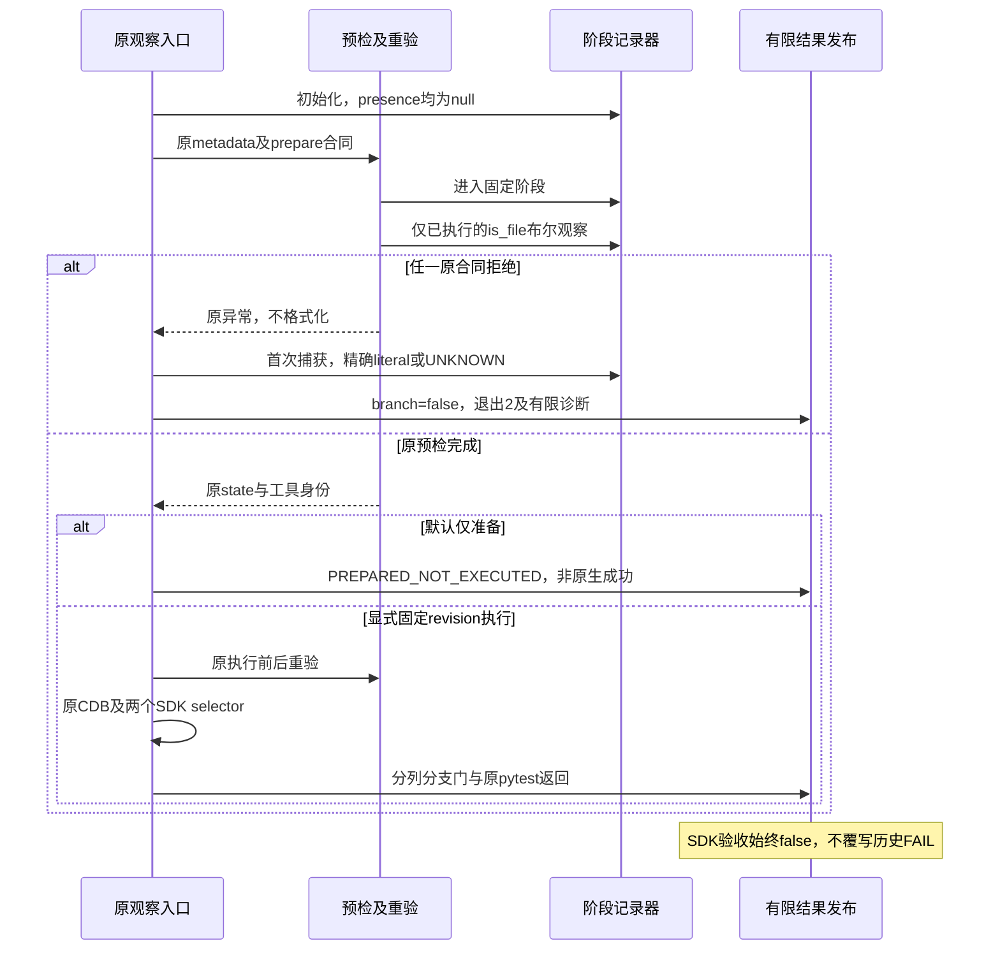
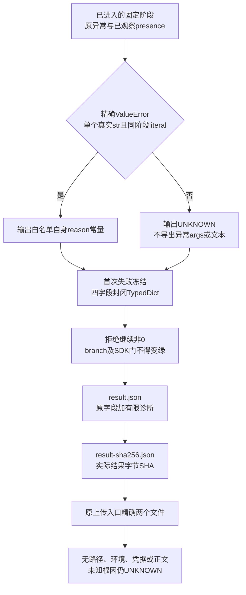

# Windows Git 定点观察有限前置拒绝诊断 v2

## 1. 文档摘要

本变更只增加有限的首次失败阶段、固定reason_code及两个文件presence观察，定位原生观察之前的拒绝边界，不修复或放宽原拒绝。已有v1现场结果为PREFLIGHT_REFUSED、execution_performed=false，未发布pair/tool身份，不能据此唯一推断CDB缺席、下载失败或某一源身份错误。

基线为已发布730f084；当前尚未提交的v2字节以[新验证包](../validation/git-native-branch-preflight-2026-10-02-v2/README.md)及SOURCE/manifest为准，基线SHA不是新发布revision。原v1及集成包、FAIL、源身份原件全部保留。原29件owned与16件只读输入中，仅两个必要诊断脚本演进，其余43件字节不变；没有产品src源码修改。

## 2. 需求背景

原观察入口捕获固定异常类别但只发布泛状态。多个不同实际前置合同都会生成同样的PREFLIGHT_REFUSED，调用方不能判定失败发生在哪个已进入的步骤。v2输出拒绝位置及已知合同码，未知错误仍为UNKNOWN；位置不是根因，presence不是身份或权限证明。没有重跑旧Run，也未读取旧原stderr、私有正文或凭据。

## 3. 设计目标

- 贯穿原源身份、selected_git、existing_tools、symbols、PE/PDB与scripts，并覆盖metadata、执行revision、工具SHA及原外层执行/投影调用边界。
- 只发布12个固定stage、38个既有literal reason与UNKNOWN；未知错误、异常子类、多参数或跨阶段码均不能导出动态文本。
- presence只复用原两个短路is_file观察；实际bool才可进入字段，未执行保持null，不增加探测路径、SDK安装或替代程序。
- 原拒绝退出2、branch=false；原pytest失败仍非0，SDK验收始终false。默认dryrun不执行CDB或两个SDK案例。
- 保持原16件输入SHA、metadata SHA、官方PE/PDB、RVA机器码、硬件断点、两个selector、20/45/240/300秒预算及精确两个上传文件。
- 非目标：通用异常系统、自动修复、权限旁路、任意资源入口、新诊断Owner、完整Windows/R3或商业验收。

### 3.1 约束与取舍

采用固定阶段与既有literal白名单而非异常文本，可限制公开数据面，但不能覆盖所有底层原因。两个presence复用原短路观察，避免扩展探测；代价是后续未执行的观察必须保留null。该取舍优先维持拒绝、安全控制和数据最小化，不追求自动修复或通用根因诊断。

## 4. 总体架构




新增diagnostics.py负责封闭字段，observe.py只负责创建上下文、在原捕获位置记录一次失败并发布snapshot，preflight.py在原步骤前标明固定阶段。contract.py、identity.py、projection.py、run_cases.py和原workflow不改；生产Owner/Job/材料端口不改。新记录器没有文件、网络、环境或凭据读取，也不保存异常对象。

## 5. 流程时序数据流

### 5.1 原预检阶段




每个阶段先enter再运行原逻辑。symbols阶段包括原私有输出目录创建及官方固定下载/成员准备；失败位置只表示该阶段拒绝，UNKNOWN不得解释成已确认网络、权限或某成员原因。工具完整SHA在scripts之后的原读取位置保持tool_identity阶段。recheck复用source_identity、selected_git、pe_pdb_identity、tool_identity，不增加第二套验真规则。

### 5.2 调用时序




失败在原异常捕获处统一记一次。首次失败不被后续事件替换；成功时两个失败字段都为null。原预检完成后的执行前重验若拒绝，状态从准备态改为PREFLIGHT_REFUSED并退出2，不能留下准备成功状态。原CDB或结果投影异常保持EXECUTION_INCOMPLETE。

### 5.3 发布数据流




原异常不格式化、不转存。只有精确ValueError、单个真实str且等于当前阶段白名单literal时，输出记录器持有的常量；不复制args。其余输出UNKNOWN。生成result.json真实字节后计算SHA，原workflow仍只上传两个精确文件。原私有CDB日志、PDB、fixture及raw正文不进入artifact。

### 5.4 数据流程与持久化边界

记录器只保存进程内有限值，不建立数据库、事务或恢复记录。发布顺序保持原实现：先写result.json，再写result-sha256.json；第二个文件承载第一个文件实际字节SHA。两个文件不是跨文件原子提交，发布中断不能据此声明完整artifact或原生成功；上传仍限定原两个文件。

## 6. 接口设计

| 类/函数 | 接口与职责 |
|---|---|
| `PreflightDiagnostic()` | 初始化metadata阶段、无失败、两个presence为null，无I/O |
| `enter(stage: Stage) -> None` | 只接受固定真实str stage，拒绝扩展动态输出 |
| `presence(field: Literal[...], value: bool) -> None` | 只接受两个固定字段及实际bool，整数1/0不是bool |
| `capture_failure(error: BaseException) -> None` | 只保存首次stage/固定reason；不保存异常对象、原因链或动态参数 |
| `snapshot() -> DiagnosticResult` | 返回恰为四字段的TypedDict |
| `prepare(repository, output, contract, diagnostic=None) -> dict` | 原三参数调用兼容；额外上下文只记录原步骤 |
| `recheck(repository, state, contract, diagnostic=None) -> None` | 原前后验真不变，拒绝位置可追溯 |
| `existing_tools(repository, diagnostic=None) -> tuple[Path, Path]` | 保持原is_file短路顺序和x64头检查，不自动安装 |
| `run(...) -> int` | 原CLI输入不增；结果schema升级v2，增加一个封闭诊断对象 |

核心伪代码：

```text
创建诊断上下文；原metadata验真
进入原固定阶段；运行原步骤及原拒绝条件
两个is_file只在实际执行时记真实bool
若原异常进入既有捕获边界：
  若尚未保存失败：保存当前固定stage
  若精确ValueError的单个真实str匹配同阶段literal：取白名单自身常量
  否则reason=UNKNOWN
  branch=false；拒绝退出2，不推断根因
发布四字段snapshot，原pytest结果及SDK门语义保持
```

## 7. 数据结构

整体schema为`harnessix.git-native-branch-observation/v2`，原字段继续保留，新增`preflight_diagnostic`，字段如下：

| 字段 | 精确类型/范围 | 语义 |
|---|---|---|
| `first_failed_stage` | `Stage | null`，12固定值 | 当前调用首次被原捕获边界拒绝的位置；无拒绝为null |
| `reason_code` | 38固定literal/UNKNOWN/null | 同阶段已知合同码；其他错误UNKNOWN；无拒绝null |
| `cdb_file_present` | 实际`bool | null` | 原CDB配置路径is_file观察，不代表x64/可信身份 |
| `interpreter_file_present` | 实际`bool | null` | 原解释器路径is_file观察；因原短路未执行则null |

成功时stage/reason均null，不能将null解释为原生成功。CDB is_file=false时解释器观察仍null，保持原短路；不是两个文件都已检查且缺席。true也不能推导PE/PDB匹配或工具可执行。完整封闭JSON结构及逐阶段reason目录见[diagnostic-policy.json](../validation/git-native-branch-preflight-2026-10-02-v2/diagnostic-policy.json)，该文件是生成的审查合同，不是新的运行权限来源。

| 固定stage | 允许的既有literal reason（每个阶段另允许UNKNOWN） |
|---|---|
| `metadata` | `duplicate_json_key`、`offline_metadata_sha_mismatch` |
| `execution_revision` | `explicit_fixed_revision_execution_required` |
| `platform_paths` | `private_nonrepository_simple_output_path_required`、`private_output_preexists`、`windows_x64_required` |
| `source_identity` | `current_source_drift` |
| `selected_git` | `selected_git_changed`、`selected_git_layout_unrecognized`、`selected_git_missing`、`selected_git_not_verified_role` |
| `existing_tools` | `existing_cdb_pe_invalid`、`existing_cdb_x64_required`、`existing_tools_missing_no_install_performed` |
| `symbols` | `official_download_digest_mismatch`、`official_download_limit`、`official_redirect_refused`、`official_symbol_member_mismatch` |
| `pe_pdb_identity` | `official_branch_machine_bytes_mismatch`、`official_branch_symbol_rva_mismatch`、`official_pair_guid_age_mismatch`、`official_pair_image_size_mismatch`、`official_pair_sha_mismatch`、`official_pair_size_mismatch`、`pdb_branch_symbol_duplicate`、`pdb_dbi_missing`、`pdb_info_missing`、`pdb_msf_bounds_invalid`、`pdb_msf_signature_invalid`、`pdb_stream_block_invalid`、`pdb_symbol_bounds_invalid`、`pdb_symbols_missing`、`pe_dos_signature_invalid`、`pe_nt_signature_invalid`、`pe_rva_unmapped`、`pe_x64_required` |
| `scripts` | 仅`UNKNOWN`，没有既有literal错误码 |
| `tool_identity` | `existing_tool_changed` |
| `debugger_execution` | 仅`UNKNOWN`，没有既有literal错误码 |
| `result_projection` | `case_report_invalid`、`duplicate_json_key` |

字段不含错误参数、errno、异常类别动态名称、路径、argv、环境、凭据、对象正文或旧Run ID。历史FAIL_RETAINED与historical_root=UNKNOWN保持原字段语义，不新增旧Run内容。

## 8. 异常安全

保留原捕获异常类别与原异常产生位置；diagnostic.capture_failure不调用str/repr，不检查原因链，不输出args或动态值。ValueError子类和str子类不参与白名单匹配，避免动态方法影响发布。

原预算、Popen/kill/wait、16MiB日志检测及RO/DOD、Owner/Job、MAC/raw/EOF/protection、安全容量和argv不变。六个原控制函数AST与730基线一致：debugger_scripts、selected_paths、execute_authorized、run_debugger、observation_result、main。prepare/recheck只新增阶段，existing_tools只拆开原短路表达式以记录实际结果。

### 8.1 失败、取消、超时与恢复边界

没有新事务、恢复重放或共享账本。取消/超时仍依赖原外层清理；本变更不把本机合同测试当Windows实际调试树回收证据。最外层报告目录建立或文件发布失败不保证生成完整artifact，仍由原调用/上传失败关闭；v2不是任意CLI参数、文件系统故障或强制进程退出的万能诊断协议。

## 9. 可观测性

v2只提升既有拒绝的有限定位精度，不提升成功率或根因可信度。消费顺序是先读status/execution_performed，再读first_failed_stage/reason，最后按presence的观察语义解释。不得将PREFLIGHT_REFUSED变为绿色、从无pair/toolSHA推断具体工具缺席，或用presence替代身份验证。

schema v1历史结果不能补填v2 stage/reason；阶段未知继续UNKNOWN。新的runtime结果只描述当前固定revision；没有旧Run重放或自动恢复。branch_gate_passed、原pytest_exit和original_sdk_acceptance继续分列，SDK门始终false。

## 10. 测试验证

原50项正式测试源码不变；新增82项正式回归位于tests/governance，均纳入正常tests选择器。两组实际132PASS，0失败/错误/跳过。覆盖全部literal来源及同阶段归属、12阶段未知文本、首次失败不覆盖、子类/类型拒绝、真实source validator及selected_git缺席、实际临时文件presence/短路、合成工具头拒绝、准备/重验定位、成功dryrun非原生成功、拒绝非0及原pytest=1保留。

下载/PE-PDB成功与调试执行路径使用明确mock，仅验证编排与有限结果；工具头为合成结构，不是官方现场文件。旧50中的合成PE/PDB及既有算法测试也不能冒充Windows。本轮没有下载PDB、启动CDB或运行原两个SDK selector。

原v1字段缺席的实际离线RED为1FAIL，KeyError=preflight_diagnostic，初版源码SHA及原日志/XML保留。后续初版129PASS与最终132PASS分别保留，不累加；汇总辅助脚本一次格式输出匹配过窄失败也单列保留，不归为产品发现。新诊断模块mypy strict 1件通过，Ruff/format 10件Python通过。四图本地Chrome渲染及视觉验收状态见verification，不预标Windows实测。

## 11. 源码映射

| 元素 | 实际源码与符号 | 正式验证 |
|---|---|---|
| stage/reason/type/首次失败 | [diagnostics.py](../../scripts/windows_git_native_branch_observation/diagnostics.py)：`Stage/REASONS_BY_STAGE/DiagnosticResult/PreflightDiagnostic` | 新测试全部literal/子类/类型/首次失败负例 |
| 原步骤定位与presence | [preflight.py](../../scripts/windows_git_native_branch_observation/preflight.py)：`prepare/recheck/existing_tools` | 阶段编排、真实文件及头拒绝、原短路 |
| 外层拒绝与发布 | [observe.py](../../scripts/windows_git_native_branch_observation/observe.py)：`run` | 实际结果schema/四字段、退出2及两文件SHA |
| 原硬件/退出控制 | [preflight.py](../../scripts/windows_git_native_branch_observation/preflight.py)、[observe.py](../../scripts/windows_git_native_branch_observation/observe.py)六个函数 | AST与730基线相等 |
| 原资源/PE-PDB/投影 | [contract.py](../../scripts/windows_git_native_branch_observation/contract.py)、[identity.py](../../scripts/windows_git_native_branch_observation/identity.py)、[projection.py](../../scripts/windows_git_native_branch_observation/projection.py) | 源码字节不变与原50PASS |
| 新正式测试 | [test_windows_git_native_branch_preflight_v2.py](../../tests/governance/test_windows_git_native_branch_preflight_v2.py) | 新增82PASS |
| 原正式测试 | [test_windows_git_native_branch_observation.py](../../tests/governance/test_windows_git_native_branch_observation.py) | 原50PASS、字节不改 |
| 原手动入口 | [workflow](../../.github/workflows/windows-git-native-branch-observation.yml) | 原SHA、两文件、预算与单次范围保持 |

四件演进源码/测试的冻结SHA如下；没有把旧v1 manifest改写为新身份。

| 文件 | SHA256 |
|---|---|
| `scripts/windows_git_native_branch_observation/observe.py` | 9e1451cace8ec82d1444b71a2702b96d9bef1c87676bf35b44f591e6d59dfab4 |
| `scripts/windows_git_native_branch_observation/preflight.py` | c08aa0ee6b274a4712daa8f670023797ef07f7966a5330f6722e5aa3a714217a |
| `scripts/windows_git_native_branch_observation/diagnostics.py` | e407fb96979bb448ce111dda6ceb6ecced4e07301e05d47c306b343cc02af3b5 |
| `tests/governance/test_windows_git_native_branch_preflight_v2.py` | 53c641f4f6ee65a3ad1689c0f8ba2f309b6b09ffca865b58add4557a46a7305e |

## 12. 部署与回退

只集成两个必要旧脚本演进、新diagnostics、新正式测试及本SDD/新验证包。基线730不是未来新提交，发布后以新完整revision与冻结成员SHA绑定原手动workflow，不重跑旧Run；当前不stage/commit/push/dispatch。

现场原Git/PE-PDB/源身份/工具/符号/机器码任一不匹配仍拒绝，不安装SDK、不替换Git、不改生产控制。执行入口参数及原预算、selector和artifact上传不变；新的消费者需按v2读取新增封闭对象，旧v1原件继续保留而不补写。

回退只撤销这组v2演进和新增入口模块，使原观察返回v1有限结果；不得回滚其他并行变更或覆盖失败档案。新有限stage可以支持后继技术定位，但实际native blocker及修复仍须新的固定revision现场事实，本变更不关闭Windows/R3/fullCommit或商业验收。
