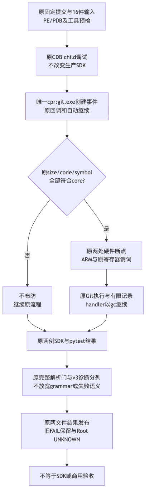

# Windows Git 主映像创建事件布防详细设计

## 1. 摘要与需求背景

[Run37077033494](../validation/git-native-v3-result-2026-10-03-v1/README.md)的原生结果保留两个SDK案例的Git128、Worker2失败，但完整分支见证缺失。三个marker语法计数均为0，不证明没有Git进程或唯一故障原因。

实际脚本生成字节检查确认三个`.printf`格式串均以单个反斜线和`n`结束，符合换行转义；不存在双重转义缺陷。本变更不修改格式串，也不通过宽松解析寻找marker。

原bootstrap只在`ld:git.exe`事件调用布防脚本，并忽略`cpr`。Microsoft将子进程创建定义为`cpr[:Process]`，模块加载定义为另一个`ld[:Module]`事件；Windows创建进程事件携带新进程主映像信息。因此主映像入口改用过滤到Git的创建事件。这是可求证的事件覆盖修复，尚不是历史Git128的排他根因证明。

## 2. 设计目标、约束与取舍

- 布防由唯一`cpr:git.exe`过滤触发，不对所有Python、Worker或其他子进程设置断点。
- 同名wrapper和core仍经过完整映像大小、四处机器码及三处PDB符号RVA检查；不能仅凭进程名布防。
- 只替换bootstrap的事件入口，删除被替代的`sxi cpr`；保留既有脚本文件名和回调路径以控制修改范围。
- 保持两个硬件执行断点、原寄存器谓词、`gc`及`g`自动继续、原日志解析和所有有限结果合同。
- 不改变生产SDK、Windows句柄共享方式、Git命令、PATH、审批、认证、旧十三hook或费用。
- 原16件固定源、两对PE/PDB、两项SDK选择器和20/45/300/240秒期限不变。真实验证必须使用新固定提交，旧Run不重跑覆盖。

取舍：不用同时监听`ld`和`cpr`的双路径，避免同一主映像重复ARM、重复断点和含混的见证来源；也不新增按PID去重的宽松解释。原重复ARM拒绝合同不变。

## 3. 总体架构与模块边界



现有`observe.run`负责固定提交授权、预检、原CDB启动及结果发布；`preflight.debugger_scripts`只生成脚本，不创建进程；`projection`仅解析实际日志，不执行脚本；`run_cases`仍调用原两项pytest选择器。没有新服务、数据库、产品端口或通用诊断平台。

## 4. 核心流程、时序与数据流程

1. `prepare`核对Windows x64、原源文件、实际selected路径、现场工具、PE/PDB并生成四份ASCII脚本；后继`recheck`再核对原身份。
2. 原CDB以`-o`及`.childdbg 1`跟踪原Python测试的子进程。bootstrap启用唯一Git创建事件回调，其他事件处理合同保留。
3. Git创建事件将当前进程上下文交给既有`on-git-load.cdb`。该名称是受限临时文件名称，不表示继续使用模块加载事件。
4. 同名小wrapper未通过size guard，不安装断点。core依次通过机器码与PDB/RVA guard后安装两处`ba e 1`，发布ARM，再由外层`g`继续。
5. 实际断点触发时，原寄存器谓词成立才发布FSTAT/INDEX记录；handler始终由原`gc`继续，不更改寄存器、输入或返回值。
6. 原两个SDK用例发布有限案例帧；CDB结束后，原解析器只按整行grammar、ARM顺序、PID/TID、RVA、谓词和值域验证两次材料调用。
7. 原result.json和摘要回执分别发布。真实SDK失败继续使workflow失败，完整分支见证和业务验收分列。

时序为`原测试 → Windows子进程创建 → CDB当前Git上下文 → guard → 断点 → 自动继续 → 原Git执行 → 原断点记录 → 原pytest结果 → 有限发布`。私有日志不上传，数据从实际调试进程向有限结果单向投影，不反向授予执行权。

## 5. 类设计、接口设计、数据结构与源码映射

没有新增领域类或公开接口。[debugger_scripts](../../scripts/windows_git_native_branch_observation/preflight.py)原签名`(output: Path, core: dict) -> None`不变；`core`只来自原固定发行合同的core行。

| 元素 | 当前职责与解释 |
| --- | --- |
| bootstrap.cdb | 原符号策略、child调试、唯一Git创建事件过滤和继续执行 |
| on-git-load.cdb | 原size/code/symbol guard及两处断点；保留原文件名 |
| on-fstat.cdb / on-index.cdb | 原谓词、有限返回记录及自动继续 |
| cpr:git.exe | 匹配子进程创建名称；名称匹配不替代映像身份验真 |
| FHX_NATIVE_ARM | 通过原全部guard后的有限记录；普通日志字段不等于独立认证 |
| branch_gate_passed | 原完整见证与案例门计算，算法和取值不变 |
| original_sdk_acceptance | 观察器仍固定false，不以布防成功宣告产品验收 |
| historical_root | 仍UNKNOWN，历史FAIL不回写 |

## 6. 核心代码业务逻辑伪代码

```text
生成原两个handler及机器码/PDB布防脚本
生成bootstrap:
    配置原符号策略和child调试
    保持ibp/epr原处理
    cpr:git.exe => 执行原布防脚本；g
    g
原布防脚本:
    若size、四处机器码、三处符号全部符合固定core:
        原FSTAT硬件断点
        原INDEX硬件断点
        原ARM记录
原结果解析:
    不读取或执行上述模板
    只验证实际完整日志和原有限案例
```

## 7. 持久化、事务与数据完整性

脚本只存在原非仓库私有输出目录，不进入数据库或产品状态。脚本生成发生在调试进程启动之前；任一准备错误仍原样拒绝，不能使用部分准备结果执行。

公开持久化仍为原两文件合同：result.json先按原ASCII字节生成，摘要回执绑定原结果字节。二者不是跨文件原子事务；下载方必须确认精确文件集合、原ZIP/API摘要及回执一致性。保留Windows回执CRLF，不通过文本转换修复摘要。

## 8. 失败语义、取消、超时、恢复与可观测性

- 新入口未触发、guard不匹配、脚本报错、断点未命中、语法不完整：不能提升完整见证或SDK成功；依原状态与非零退出处理。
- 如果有重复ARM或未知marker，仍原完整解析器拒绝；没有新容错去重或substring搜索。
- 原240秒外部watchdog及16MiB日志限额、原杀死调试器的进程控制、执行前后身份检查不变。
- 原CaseSink帧边界及v3未认证诊断字段不变；0仅表示未找到完整语法行，不表示没有创建或执行Git。
- 不恢复或重跑旧Run。回退只恢复这两处bootstrap字符串，不更改生产数据或历史结果。

## 9. 安全、兼容与部署

沿用原固定提交显式执行、attempt1、私有简单路径、现场已有CDB、官方PE/PDB身份和锁定依赖。没有新shell、内存dump、外部网络权限、进程读写权限或包安装策略。

新候选只部署到原受控Windows workflow用于一次有限观察，不能广告Windows消费者支持。Linux/macOS离线测试只证明文本合同、guard保留与解析拒绝边界，不证明CDB实际执行。

## 10. 完整测试矩阵与验收

| 场景 | 证据范围 |
| --- | --- |
| 原bootstrap回归负例 | 新8例在旧字节下1失败/7通过，明确入口差异 |
| 新唯一cpr入口 | 精确脚本、过滤、单路径、自动继续 |
| 三个printf格式 | 逐格式确认单反斜线转义、无双重转义、无格式内实际换行 |
| size/code/PDB与两断点 | 原完整guard和寄存器谓词保留 |
| 三个模板负例 | 生成模板不能充作实际分支见证 |
| 原四组观察器回归 | 原227例和新增8例同候选235通过 |
| 原固定输入与期限 | 16件输入逐字节核对，不变更原合同 |
| 真实原生执行 | 必须另有固定新提交的Run、Job、精确两文件Artifact；未执行前不得标PASS |

源码与验证命令见[限定验证资料](../validation/git-native-process-arming-2026-10-03-v1/README.md)。完整Git默认交付、Backup v2、R3质量、消费者Windows、Beta与商用R1～R6继续开放。

## 11. 查档来源与结论边界

- [Microsoft事件定义](https://learn.microsoft.com/en-us/windows-hardware/drivers/debugger/controlling-exceptions-and-events)：区分cpr创建和ld模块事件，以及child调试前置条件。
- [Windows DEBUG_EVENT](https://learn.microsoft.com/en-us/windows/win32/api/minwinbase/ns-minwinbase-debug_event)：创建进程和加载DLL是不同事件种类。
- [SX事件命令](https://learn.microsoft.com/en-us/windows-hardware/drivers/debuggercmds/sx--sxd--sxe--sxi--sxn--sxr--sx---set-exceptions-)：过滤和自动命令语义。
- [脚本执行](https://learn.microsoft.com/en-us/windows-hardware/drivers/debuggercmds/-----------------------a---run-script-file-)及[printf](https://learn.microsoft.com/en-us/windows-hardware/drivers/debuggercmds/-printf)、[转义](https://learn.microsoft.com/en-us/cpp/c-language/escape-sequences)：支持保持原脚本调用和正确格式串，不证明旧原生Run的实际回调状态。

修复依据为上述文档及实际生成字节；历史Run没有公开私有CDB日志，故不能从缺失marker倒推唯一事件故障或Git材料故障。
