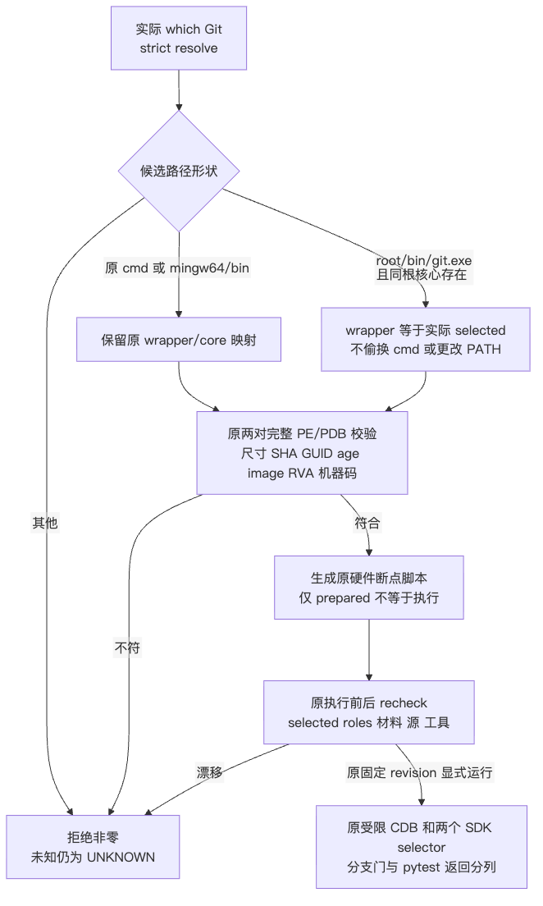

# Windows Git 选中 launcher 布局的固定材料适配设计

## 1. 文档摘要

本变更仅扩展定点观察器的 `selected_paths()`：在原 `cmd/git.exe`、`mingw64/bin/git.exe` 之外，识别具有同根核心文件的 `bin/git.exe` 为候选 wrapper。候选映射的 `wrapper` 必须是实际 selected 本人，随后使用原固定官方 PE/PDB 完整身份校验；路径形状不是放行凭据，不能静默替换为 cmd 或更改 PATH。

发布基线为110185d9d2d24bb138f7ca0941dac5b32873f918，候选字节由[新验证包](../validation/git-native-selected-layout-2026-10-02-v1/README.md)及 SOURCE/manifest 单列，不将基线提交冒充尚未发布的修复提交。唯一既有源码修改为观察器 preflight.py 的一个函数；生产 SDK resolver、Owner、Job、hooks、两个 SDK selector、workflow 和合同均不改。

本轮正式定点153项通过，包含原132与新21。另在项目外固定九脚本新快照上，使用实际缓存官方 PE/PDB 完成13项离线材料验证；保留修复前本地1项失败和独立官方七例6通过/1失败。上述结果不证明 Windows 现场 `shutil.which`、debugger 启动、两项 SDK 用例成功或原 Git128 唯一根因。

## 2. 需求背景

### 2.1 已发生的拒绝与证据层级

[实际布局拒绝包](../validation/git-native-layout-refusal-2026-10-02-v1/README.md)记录 Run36977642845、attempt1、head82efa8e56e8699dba30b05da6cefbe0ad4beb2f3：状态 PREFLIGHT_REFUSED，首失败阶段 selected_git，固定原因 selected_git_layout_unrecognized，execution_performed=false。CDB/Python presence 均为 null，不能推断缺少工具；没有执行 debugger 或两个 SDK selector。旧 Git128 的根因继续 UNKNOWN。

已有 checkout 日志第57～58行显示 checkout 工具使用 `bin/git.exe`，版本为2.55.0.windows.5；它不是随后 Python `shutil.which("git")` 的同一次测量，也不包含选中 PE 的完整 SHA/CodeView 身份。本包仅投影角色、版本、行号、计数和摘要，不复制原始 PATH、宿主个人路径或仓库日志正文。

固定上游 [Install-Git.ps1](https://github.com/actions/runner-images/blob/1c7b9f1e082099ad9e2cfa02f257a2e352e753ee/images/windows/scripts/build/Install-Git.ps1) 的本地既有原件已逐字节核验：Git blob29c63d596a37db054705c6a167eb9a1830b15416，SHA256为8b7320968c3f3f984e89ae9eab5fd097c0b8fb31aad401bdf1ccf91e7ad06603。第34行 PathOption=CmdTools，第51行将 Git 安装根的 bin 加入机器 PATH。此证据证明上游安装映射，不证明本次实际 Python which 或 bin 文件身份；本轮不访问网络。

### 2.2 官方材料与未知项

已有固定 MinGit2.55.0.5 ZIP仅含 cmd/git.exe 和 mingw64/bin/git.exe，没有 bin/git.exe；相配 PDB ZIP有两个对应成员。两个 ZIP 的实际完整 SHA与原合同相符，两对材料使用原 check_pair 实际通过。MinGit 缺少 bin 成员不能否定完整版 bin 角色；缓存中没有实际完整版 bin 文件，因此现场 bin/cmd 全字节是否相等仍为未知。

修复采用运行期对实际 selected 的固定身份验证，不依赖预先猜测这种相等关系，也不从上游 main、2.56或UCRT64布局扩大版本支持。项目外正例只是将已验证的固定 wrapper 完整复制至标准 bin 路径，证明算法可安全接受等身份材料，不冒充现场映像证据。

## 3. 设计目标

- 保留原 cmd/core 两条路径及函数接口。
- root/bin 只声明 wrapper 候选；必须存在同 root 的 mingw64/bin/git.exe，并且 selected 文件名为 git.exe。
- wrapper 引用实际 selected 本人；不要求 cmd 存在，不使用其有效材料替坏 bin 解围。
- 原 prepare 的完整 pair 校验成功前不启动 Git、CDB、解释器或 SDK 用例；原 recheck 在执行前后再次验证实际 selected、roles、PE/PDB、工具及源输入。
- 拒绝未知布局、错误尺寸/SHA/GUID/age/image、错误核心 RVA/机器码、任一身份漂移；不变更 reason 白名单或 UNKNOWN 语义。
- 保持固定源码合同、13hooks、两个 selector、原期限和两个输出文件；不扩展通用环境诊断。

### 3.1 选型、约束与取舍

选择“实际 selected 成为候选 wrapper，再校验固定材料”，而不是改变 PATH、强制 cmd、放宽固定 SHA 或仅依据文件名/版本。前者无需执行未验真的 `--version`，并能对 bin 中其他版本或错误 PE 明确拒绝。代价是只有与原固定 pair 精确一致的映像可通过，不能据此支持任意 Git 安装版本。

同根核心存在只是布局判定辅助，不是身份认证；即使目录、文件名或完整 wrapper 复制正确，也必须通过另一核心和 PDB 的全部原验真。安装根不依赖个人目录名，因而不把合法性与某个固定绝对路径绑定。不存在跨文件原子快照承诺，不能将前后重检查夸大成对恶意宿主竞态的绝对防护。

## 4. 总体架构


原架构图源和 PNG 字节保持。变更位于 prepare/recheck 共用的路径角色判定内部；平台、源码、工具、官方符号、PE/PDB、调试脚本、执行、投影和发布边界均保持。[本次角色判定图](../validation/git-native-selected-layout-2026-10-02-v1/selected-layout.png)展示当前实际新增分支。



模块职责：contract 提供唯一固定合同及16件源码校验；preflight 只准备和重检查；identity 只读核验二进制材料；observe 持有受限执行与有限结果发布；diagnostics 只保留首次失败、白名单 reason 和两个 nullable presence。没有新增服务、数据库、SDK resolver 或安装器。

## 5. 流程时序数据流

### 5.1 当前流程与调用时序


原阶段图的 selected_git 节点在本次候选中增加 bin 候选分支；阶段顺序不变：metadata → 执行 revision（仅显式执行）→ 平台/输出目录 →16源输入→ selected/roles → 现场工具 → 固定符号 → 两对完整材料 → 调试脚本 → 工具 SHA → prepared。


selected_paths 先对实际 which 结果 strict resolve。cmd/core 保留原根推导；bin 候选根必须具有 mingw64/bin/git.exe，wrapper 直接保存 selected。prepare 对 contract.pairs 每一项调用原 check_pair；只有全部通过才生成 debugger 脚本和返回 state。显式执行前 recheck，成功后原 run_debugger，终结后再次 recheck；没有在候选路径判定处执行进程。

### 5.2 数据流与持久化


which 字符串只进入私有 Path/state，不进入公开 JSON。路径判定只产生 selected 与两个 roles；身份校验读取 PE/PDB，返回真实匹配结构；有限发布依旧不导出路径、异常动态文本、对象正文、原始环境或调试器日志。唯一公开运行输出仍为 result.json 与 result-sha256.json。

无业务持久化、Owner、账本或 schema 迁移。官方符号及 debugger 脚本仍写原私有输出目录，输出必须新建且非仓库路径；本变更不修复半成目录、不假装跨文件发布原子性。历史拒绝、原清单和旧测试原件不回写；旧清单对当前 preflight 的预期漂移以新身份说明，不再冒称旧清单完整匹配当前实现。

### 5.3 图源与视觉状态

四幅既有图沿用已渲染、逐图查看的原v2证据，本轮仅核验图源与像素 SHA保持，不声称重新渲染。新增角色判定图单独实际渲染并查看；其尺寸和视觉结果见[verification.json](../validation/git-native-selected-layout-2026-10-02-v1/verification.json)。所有图均纳入当前 manifest，旧图原件不修改。

## 6. 接口设计

| 接口 | 当前实际职责与失败边界 |
|---|---|
| `selected_paths() -> tuple[Path, dict[str, Path]]` | 读取实际 which，strict resolve，返回实际 selected 与 wrapper/core 候选；本接口成功不表示材料通过 |
| `prepare(repository, output, contract, diagnostic=None) -> dict` | 原阶段顺序；所有 check_pair 通过后才返回准备状态，无进程启动 |
| `recheck(repository, state, contract, diagnostic=None) -> None` | 重新取得实际 selected/roles，必须与准备状态相同，再逐对材料及工具完整 SHA 校验 |
| `check_pair(executable, symbols, expected) -> dict` | 尺寸、完整 SHA、x64 PE、SizeOfImage、CodeView GUID/age、PDB 身份及核心符号/机器码全检；不加载 PE |
| `observe.run(..., execute, revision) -> int` | 原执行入口；拒绝仍非0，执行/断点门/pytest返回/SDK验收分列 |

伪代码对应唯一新增行为：

```text
selected = strict_resolve(actual_which_git)
if selected位于原cmd或mingw64/bin:
    原根推导与wrapper/core映射
else if selected位于bin，且同根mingw64/bin/git.exe存在:
    要求selected文件名git.exe
    wrapper = selected本人；core = 同根mingw64/bin/git.exe
else:
    拒绝selected_git_layout_unrecognized
确认selected属于候选roles；返回候选，不执行
prepare: 对两个roles执行原完整fixed PE/PDB check_pair
显式执行: recheck实际selected及roles、fixed PE/PDB、源及工具，再启动原受限CDB
```

没有新 class、公共 CLI 参数或可覆盖模型。根文件名判断不导出动态 args；新增拒绝继续使用既有 selected_git_not_verified_role。函数外所有 AST、import 和代码字节保持。

## 7. 数据结构

### 7.1 Path/state 字段

| 字段 | 内容与不变量 |
|---|---|
| `selected` | 实际 which 返回路径的 strict resolve；不是 cmd 替身 |
| `git_paths.wrapper` | cmd/core 旧分支为 root/cmd/git.exe；新 bin 分支为实际 selected 本人 |
| `git_paths.core` | 固定相对角色 root/mingw64/bin/git.exe；必须执行原核心验真 |
| `pdb_paths` | 原固定 ZIP两个白名单成员；新布局不选择另一套符号 |
| `cdb/python`及其SHA | 原现场既有工具；prepare记录，recheck原样验真 |
| `command` | 原受限CDB执行解释器/固定run_cases；参数及保密控制不改 |

### 7.2 固定材料与公开有限字段

wrapper PE为43352字节，SHA256为78211c7ed73988da93a6d8a33d47ec6187f464d7ea2a9a00c182bbd7a1ecf30f；CodeView GUID为BCA70EF0-BD8D-409C-A58B-43E7ED929DAD、age1、SizeOfImage327680。core PE为4378456字节，SHA256为d1b62b94aa15e5c3bbcdd6440d5f716f78daa2736a951b0f1fad11d38c5f16da；GUID为39D2A98E-19C9-4B52-8975-0846EEB28D9C、age1、SizeOfImage4837376。完整PDB及核心RVA/机器码仍由[原contract.json](../../scripts/windows_git_native_branch_observation/contract.json)限定，不另造可配置宽松规则。

公开结果结构不变：schema=v2，诊断只含 first_failed_stage、reason_code、cdb_file_present、interpreter_file_present。未知异常输出 UNKNOWN，presence未观察为 null。阶段拒绝不会填 pairs_matched 或工具 SHA为成功证据；原 SDK验收始终false，旧FAIL和UNKNOWN保持。

## 8. 异常安全

### 8.1 失败语义

未知路径、非git.exe、新bin缺同根核心、实际selected尺寸或完整SHA错误、PE/PDB或核心身份不符均拒绝。cmd正确不能遮蔽bin错误；bin有效时也不偷换到cmd。recheck对同样字节但 selected 路径由bin变cmd仍拒绝 selected_git_changed。已开始执行后的拒绝依旧不能制造 branch绿态；未知异常不被猜成工具缺失或旧Git故障唯一根因。

### 8.2 取消、超时与资源关闭

本变更不添加执行或等待，原命令20秒、操作45秒、workflow step300秒、外部watchdog240秒保持。原CDB硬件断点仅两处返回值RVA70b74/70bc1，保留size/code/symbol guards及auto-continue；原进程终结和取消清理不变，不以异常文本诊断清理成功，也不在观察超时后启动第二进程。

### 8.3 安全边界与风险

路径候选本身没有官方身份意义。固定完整 PE SHA与PDB SHA是必要材料条件，不是签名、MAC、可信宿主证明或产品权限认证。原13hooks、SDK两selector、源安全控制、Owner/Job拒绝全部不改。未验真的版本命令、PATH替换、Git/SDK安装、任选下载、模型、凭据和正文输出均不进入本次交付。

原前后recheck不提供跨文件原子锁或硬实时承诺；不把这种未承诺能力误报为本适配新缺陷。2.56/UCRT64不是当前固定合同，不以合成未知布局负例冒充实际该版本二进制验证。

## 9. 可观测性

原v2诊断精确定位阶段但不导出 actual which 路径或任意异常文本。本次没有新增诊断字段，只让合法候选能够继续进入后续真实材料验证；若实际bin不同于固定wrapper，将在原identity阶段拒绝，而不是执行它。

现有 checkout路径/版本、上游bin安装映射、缓存MinGit pair与项目外复制正例是不同证据层，不能相互替代。正式[事实投影](../validation/git-native-selected-layout-2026-10-02-v1/facts.json)分别标记现场Python路径未观察、实际bin映像未知、debugger未执行、原Git根因UNKNOWN。布局通过不形成产品权限或质量结论。

## 10. 测试验证

### 10.1 本次实际执行

1. 原源码c08aa上，新正式bin正例实际1 FAIL：selected_git_layout_unrecognized；原失败记录与摘要保留。
2. 当前正式三个selector153 PASS：原132保持；新21覆盖cmd/core/bin路径、实际wrapper绑定、不依赖cmd、未知布局、非exe、缺核心、尺寸/SHA/GUID/age、selected/PE/PDB/工具/源漂移及拒绝非0/有限输出。
3. 项目外九脚本唯一新快照：实际缓存官方PE/PDB13 PASS，其中七个既有用例程序正文不变，仅快照入口变更；六个新增用例核查执行前材料/selected/工具漂移与不偷换cmd。原check_pair、debugger_scripts及recheck未替代；仅隔离宿主平台、source_checks、已有工具准备和符号下载，不启动进程。
4. 本轮早先实际原132与旧布局10 PASS为分析历史，不累计到最终153；独立官方原七例6 PASS/1 FAIL只引用原证据，非本次新增执行。
5. 初次测试因带空格fixture输出路径拒绝、随后fixture缺budgets字段的两项失败均保留为测试宿主配置历史，不称产品红态。正式测试复用既有合成PE/PDB fixture，补齐原合同，不复制第二套二进制解析器。

Ruff与format精确11文件通过；固定read_contract及原16件source_checks实际通过。文档、链接、图、Secret扫描及最终成员身份结果以[verification.json](../validation/git-native-selected-layout-2026-10-02-v1/verification.json)为准。公开测试摘要是有限投影，原XML/日志摘要可追踪，不公开宿主路径或完整私有失败栈。

### 10.2 未验证与退出条件

没有执行新Windows Run、CDB、Git/SDK selector、CI、网络、模型或全仓回归；不是旧Run续跑、W1、三平台、R3或商用验收。正式测试中的合成材料只验证算法合同，实际官方材料13项单独计数，二者均不能给现场Pythonwhich背书。

发布后如需原生观察，必须使用包含本次精确修复字节的唯一固定完整revision、原单次workflow及原全部门槛；实际现场材料不符继续拒绝，不重跑旧Run以填成功。流程不得以本地153/13替代现场断点与原pytest结果。

## 11. 源码映射

| 源码位置 | 本次状态 |
|---|---|
| [preflight.py](../../scripts/windows_git_native_branch_observation/preflight.py) L57–81 | 唯一修改的selected_paths，新bin候选引用实际selected |
| [preflight.py](../../scripts/windows_git_native_branch_observation/preflight.py) L111–127、130–189 | 原recheck/prepare函数保持；新行号仅由上部增加十行产生 |
| [identity.py](../../scripts/windows_git_native_branch_observation/identity.py) | PE/PDB全部验真保持 |
| [observe.py](../../scripts/windows_git_native_branch_observation/observe.py) | 原执行前后重验、取消清理、有限结果与非0返回保持 |
| [contract.py](../../scripts/windows_git_native_branch_observation/contract.py)、[contract.json](../../scripts/windows_git_native_branch_observation/contract.json) | 原固定双表示、16件源码、PE/PDB/selector/budget全部不改 |
| [新正式测试](../../tests/governance/test_windows_git_native_selected_layout.py) | 纳入默认tests选择器；复用原合成材料fixture |
| [原观察测试](../../tests/governance/test_windows_git_native_branch_observation.py)、[原v2测试](../../tests/governance/test_windows_git_native_branch_preflight_v2.py) | 字节不改，当前重新执行132项通过 |
| [原workflow](../../.github/workflows/windows-git-native-branch-observation.yml) | 单次手动、固定revision、原期限及两个结果上传不改 |

完整当前SHA、继承历史SHA、原函数AST保持和index未写见[源码冻结](../validation/git-native-selected-layout-2026-10-02-v1/SOURCE.json)。源码输入合同仅校验原声明16件，不冒称覆盖整个仓库；新观察器脚本及测试由本次manifest额外绑定。

## 12. 部署与回退

部署只采用本次preflight.py、新正式测试、SDD与验证包，不安装软件、不改生产resolver或环境。运行前核验当前manifest的所有成员与固定metadata常量，且工作树处于包含本次字节的发布revision。源码、材料、工具任一步拒绝即停止；不得修改PATH绕过布局或改变固定pair迁就未知映像。

回退可使用新包保存的[原preflight.py](../validation/git-native-selected-layout-2026-10-02-v1/originals/preflight.py)，恢复原cmd/core-only行为；原身份、FAIL及证据不覆写，不涉及数据迁移、费用释放或业务状态修复。回退后bin候选再次拒绝是原合同结果，不是绿态替代。最终合入和实际单次原生运行条件见[Review Packet](../validation/git-native-selected-layout-2026-10-02-v1/review-packet.json)。
