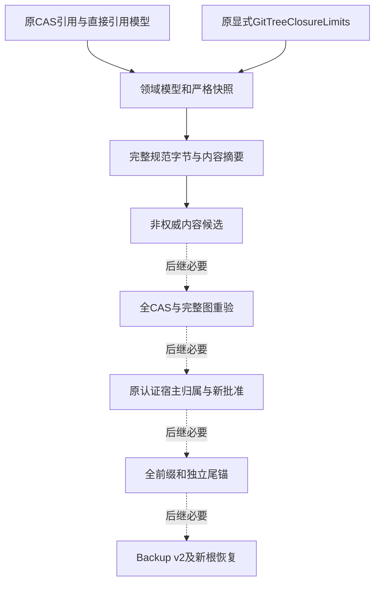
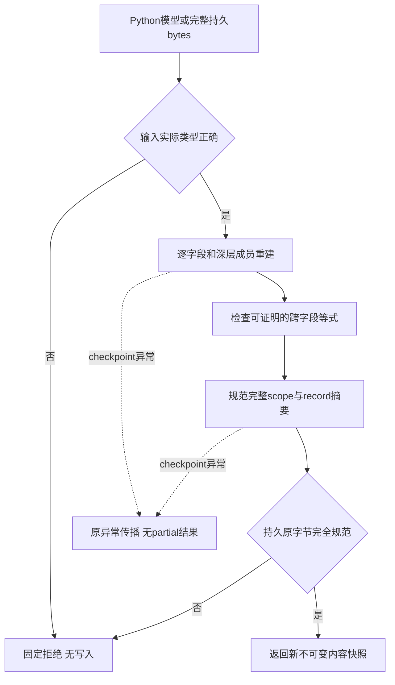
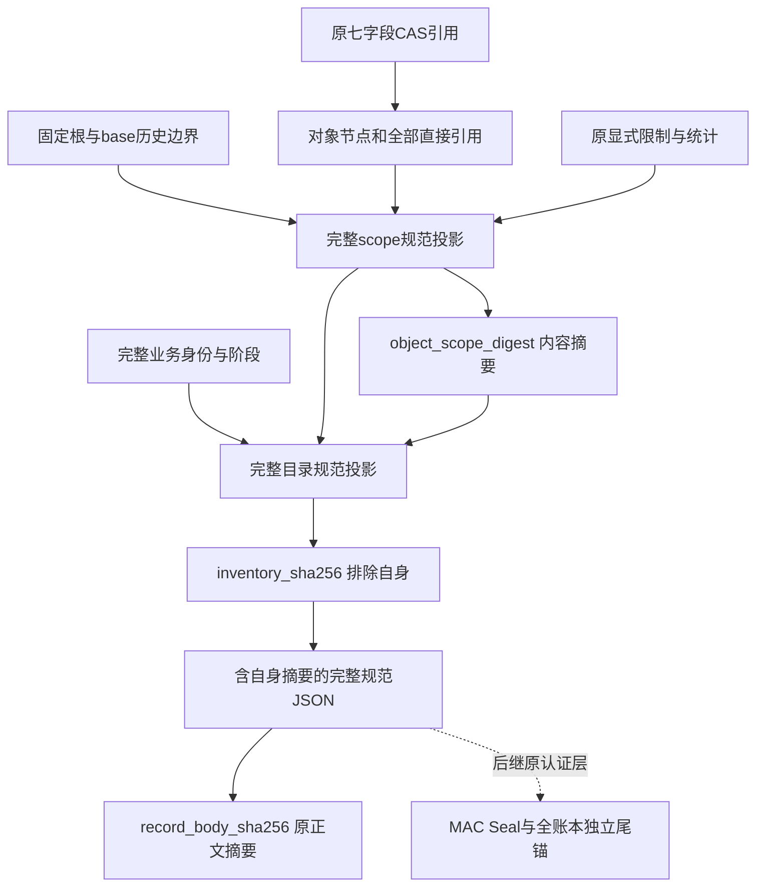
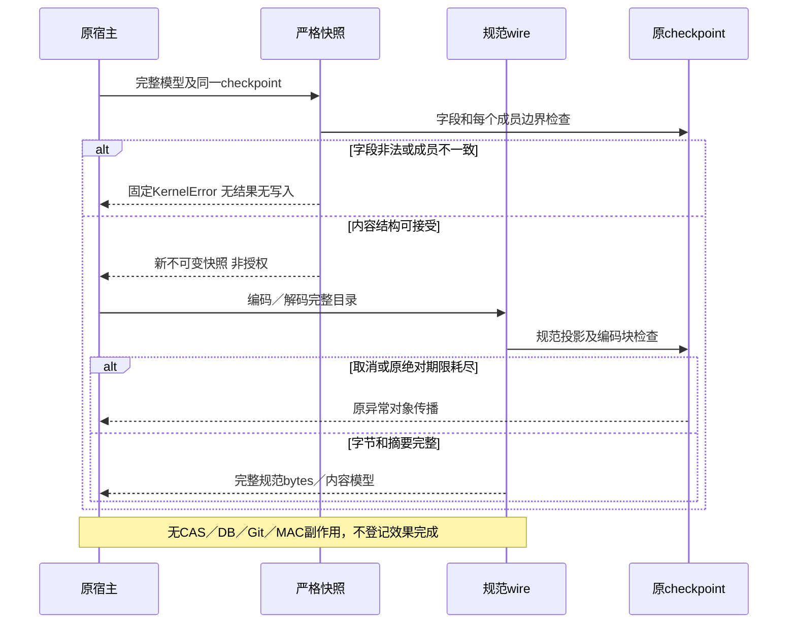

# Git对象业务目录领域契约：总体与详细设计

## 1. 需求背景与变更摘要

完整Git产品交付需要在外部仓库消失后仍能检查原交付材料，不能把GitDB复制、一个根OID、
正文SHA或者现有CAS引用视为完整交付证明。
[完整产品与备份方案](m09-r4-git-delivery-business-backup-closure.md#64-对象材料目录)
要求同时保留基准Commit、完整基准树、完整目标树、交付Commit、所有直接引用以及明确的历史边界。

现有[GitObjectMaterialReference](../../src/harnessix/delivery/git_material_cas.py)只有七字段内容绑定；
[完整普通文件树验真](../../src/harnessix/delivery/git_tree_closure.py)和
[目标树纯规划](../../src/harnessix/delivery/git_tree_projection.py)没有业务目录持久格式。
现有Git记录认证端口可以认证完整字节，但不解析对象图、不确认跨库归属，也没有GitDB独立尾锚。
因此目录契约必须先明确“保存什么、如何规范编码、什么仍未被证明”，再接实际图和原认证产品宿主。

| 项目 | 约束 |
| --- | --- |
| 当前设计状态 | 正式契约实施中；验证包发布前不登记实现完成 |
| 变更单位 | 不可变领域模型、严格快照、规范完整JSON字节及内容摘要 |
| 数据来源 | 原CAS七字段引用、原对象直接引用和原显式图限制；不建立新Blob库 |
| 兼容级别 | 新内部版本，不改变现有CAS、GitDB v1、成功proof或产品Tool Schema |
| 产品入口 | 不增加默认Checkpoint／Commit工具，不开放新的外部写入 |
| 发布边界 | 内容合同不是授权、实际图验真、材料耐久、效果成功或商用验收 |

## 2. 源码研究、设计目标与非目标

### 2.1 唯一存量复用接点

| 源码 | 关键符号 | 可复用内容与边界 |
| --- | --- | --- |
| [git_material_cas.py](../../src/harnessix/delivery/git_material_cas.py) | GitObjectMaterialReference、GitMaterialCAS | 七字段严格绑定与完整CAS读写；没有角色／目录／权限 |
| [git_object_material.py](../../src/harnessix/delivery/git_object_material.py) | GitObjectRead、GitObjectMaterial | 原类型、格式、OID和完整8MiB对象正文合同 |
| [git_object_references.py](../../src/harnessix/delivery/git_object_references.py) | GitTreeEntry、GitCommitReferences、parse_git_tree／commit | 原raw名称和直接引用语义；不重复实现Git parser |
| [git_tree_closure.py](../../src/harnessix/delivery/git_tree_closure.py) | GitTreeClosureLimits、verify_git_tree_closure | 唯一四项显式图限制与逐路径展开；没有默认产品配额 |
| [git_tree_projection.py](../../src/harnessix/delivery/git_tree_projection.py) | prepare_git_tree_projection | 完整来源净Mutation的纯目标规划；生成材料不等于CAS耐久 |
| [execution/contracts.py](../../src/harnessix/execution/contracts.py) | canonical_digest | 原UTF-8、紧凑排序JSON摘要语义 |
| [git_publication_contracts.py](../../src/harnessix/session/git_publication_contracts.py) | GitDeliveryRecordClaims | 原业务身份和认证序号；UUID本身不是归属证明 |
| [store_publication.py](../../src/harnessix/session/store_publication.py) | Git Authority／Verifier | 原完整字节认证和生命周期；不借Key另建认证层 |

### 2.2 设计目标

1. 全字段不可变、实际类型严格，拒绝缺失、额外字段、标量子类、bool冒充int和隐式转换。
2. 保存一个对象的完整角色集合及全部直接引用；同OID去重不能丢角色、路径展开或parent出现顺序。
3. 根集合、历史边界、统计、阶段和摘要用途明确；只在有足够实际事实的层级宣布验真。
4. 严格读取唯一规范字节；等义JSON、乱序目录和重复键不能被读端静默修复。
5. 所有显式checkpoint异常原样传播；编码和哈希共用宿主原绝对期限，不自行创建或续期。
6. 不裁减原完整Git产品范围；全图、权威归属、独立尾锚、完整Review、Backup v2及新根重新批准仍为后继必要项。

### 2.3 非目标

本合同不读取或写入CAS，不调用Git，不操作Ref，不签发MAC，不新建或迁移数据库，
不加载批准、Session、Route或Owner，不恢复旧执行权限。不增加自由角色、任意对象类型、
小树默认额度、自动补材料、网络历史抓取、修复接口或第二Action Plane服务。

## 3. 总体架构与模块边界



实线是本契约的纯内存边界；虚线是仍需交付的真实业务组合，不表示构造模型后这些步骤已经完成。
新合同只回答结构和内容身份。全图验证必须从原CAS重新读实际正文，权威宿主必须独立重载原归属；
不能让候选自带的UUID、SHA或“已验证”标志反向构成授权。

当前实现的具体模块为[git_inventory_contracts.py](../../src/harnessix/delivery/git_inventory_contracts.py)
和[git_inventory_wire.py](../../src/harnessix/delivery/git_inventory_wire.py)。前者负责七模型、严格深层快照和
声明元数据图的闭合校验；后者负责完整规范字节、严格解码及两种内容摘要。均不读取CAS或状态库。
`_local_fields`只检查本地字段，`_local`负责角色及阶段；`_inventory_catalog`构建声明目录并累计直接边，
`_inventory_shape`负责完整根并集、路径及派生统计。UUID和raw名称读取分别由`_uuid_from_wire`、
`_bytes_from_wire`负责。职责拆分遵守原100行／复杂度20门限，没有扩大存量热点白名单。
wire的64MiB固定格式常量独立于Session层，不引入delivery到session的依赖或第二套预算。

### 3.1 选型与取舍

| 方案 | 问题或优势 | 结论 |
| --- | --- | --- |
| 扩展原CAS引用为目录／批准对象 | 混淆内容地址、业务角色和权限，破坏七字段存量合同 | 不采用 |
| 只保存root OID或目录SHA | 不能定位缺材料、直接引用或历史边界；没有完整记录正文 | 不采用 |
| 读端接受等义JSON并排序修复 | 改变原持久字节，容易把非法旧记录转换成可签发新事实 | 不采用 |
| 独立不可变目录合同，复用原引用与规范摘要 | 模块职责明确，格式可版本化；仍需额外真实图／归属证据 | 采用 |

## 4. 类设计与数据结构设计

所有新持久模型采用不可变slots数据类。构造、快照和wire边界必须重新检查实际字段；
`frozen`不阻止恶意`object.__setattr__`，也不代表已有深层对象可以直接信任。
目录和raw名称不能进入诊断repr。以下字段全部必填，无读端默认补字段。

### 4.1 GitInventoryBinding：业务身份描述

| 字段组 | 完整字段 | 类型与用途 |
| --- | --- | --- |
| 持久身份 | store_id、key_id、delivery_id、thread_id、turn_id、call_id、route_id | 实际UUID；后继由原认证宿主重载，不因相等获得权限 |
| 两种epoch | publication_epoch、binding_epoch | 实际UUID；分别为认证流和物理执行绑定版本，均不是Owner Fence |
| 计划绑定 | route_fingerprint、product_plan_fingerprint、implementation_digest | 实际小写64hex str；完整计划／实现内容身份 |
| 来源绑定 | source_digest、baseline_digest、recipe_digest | 实际小写64hex str；原完整来源／基准／A-T-D配方，不另造缩减配方 |
| 图范围 | object_scope_digest | 实际小写64hex str；第6章无循环范围摘要，不是图或归属认证 |

### 4.2 GitInventoryRoots与GitBaseHistoryBoundary

| 模型 | 字段 | 类型及约束 |
| --- | --- | --- |
| Roots | base_commit | 原GitObjectRead，commit |
| Roots | base_tree、target_tree | 原GitObjectRead，tree；完整目录统一格式 |
| Roots | delivery_commit | null或原commit请求；checkpoint必须null，commit必须存在 |
| Boundary | kind | 固定base_commit_parent_edges，不是自由历史范围 |
| Boundary | base_commit | 等于Roots.base_commit |
| Boundary | parents | 原commit请求tuple，保留有序重复parent occurrence |
| Boundary | unique_parent_ids | 严格sorted去重的OID tuple；不能与内部目录OID相交 |

唯一外部材料边界是base Commit到其历史parents；它不能隐藏缺失tree/blob，也不能把delivery的base parent移到外部。
实际parents仍须后继重读base原正文并用原parser确认。本模型不主动追溯整个仓库历史。

### 4.3 GitInventoryObject：唯一对象与完整角色

| 字段 | 类型 | 约束 |
| --- | --- | --- |
| material | 原七字段GitObjectMaterialReference | 不新增角色、批准或MAC字段；实际body仍需原CAS读取 |
| roles | 固定角色tuple | 非空、无重复、按固定秩排序；同OID可以有多个真实角色 |
| tree_entries | 原GitTreeEntry tuple | tree保存全部直接条目；其他类型必须空 |
| commit_references | null或原GitCommitReferences | commit必须存在；其他类型必须null |

角色秩为base_commit、base_tree、target_tree、tree_member、delivery_commit。
tree_member只适用于普通文件树中的blob/tree；base和target根相同时保留两个根角色。
raw名称是bytes，wire只使用无损小写name_hex，不以UTF-8解码替代原Git名称。
原parser支持的链接mode不会因此成为产品支持；完整普通文件树业务仍拒绝symlink/gitlink。

### 4.4 GitInventoryMetrics：派生统计

全部字段是实际int且非负，不接受bool。object_count计唯一Git OID；unique_body_bytes按唯一Git OID计正文，
同CAS正文在不同Git类型下不能额外省掉对象。direct_tree_edges计唯一tree节点的全部直接条目；
commit_parent_edges保留parent出现次数；base_expanded_entries和target_expanded_entries分别逐路径展开；
base_tree_depth和target_tree_depth的根深度为零。

`_inventory_shape`从全部声明成员重算对象数、声明正文总长、直接tree边和parent出现次数；
`_walk`分别展开声明base与target树，重算逐路径条目数和深度，并检查循环、平台路径冲突、
普通文件mode和全部可达对象，随后要求八项统计与声明值逐项相等。
这些是候选元数据内部一致性，不是实际CAS长度或正文引用的观察；后继仍须重读所有CAS正文，
使用原parser独立取得引用及完整图，再比较本目录。不得把声明图正确解释为材料真实或耐久。

### 4.5 GitObjectInventory：完整持久记录

| 字段 | 类型／用途 |
| --- | --- |
| spec_version | 固定harnessix.git-object-inventory/v1 |
| inventory_id | 实际UUID，原产品action的目录流ID |
| binding | 完整GitInventoryBinding |
| action_kind | checkpoint或commit，不沿用其他Call的批准 |
| phase | materials_ready或effect_closed；不是完整产品状态机 |
| domain_sequence | ready为0，closed为1 |
| previous_inventory_sha256 | ready为64零；closed引用同一流ready的完整目录摘要 |
| platform | 原posix或windows，用于后继原路径安全核验 |
| roots、objects、external_history | 上述完整模型；objects非空、唯一OID、小写OID升序 |
| limits | 原GitTreeClosureLimits，无新的默认产品配额 |
| max_parents | 显式非负int，保留原parser语义，无隐式历史裁剪 |
| metrics | 上述完整统计 |
| inventory_sha256 | 仅排除自身后全部字段的原规范JSON摘要 |

目录成员必须最终精确为base Commit、完整base普通文件树、完整target普通文件树及commit动作的delivery Commit。
shape层要求声明成员集合精确等于两树可达集合、base Commit及可选delivery Commit，拒绝额外成员及缺边。
模型构造或该声明闭合不能推导实际CAS成员全集或材料耐久。
实际投影中生成但尚未persist的new_trees不满足真实业务的materials_ready前置。

### 4.6 GitInventoryPrefixProjection：非权威尾锚子投影

完整字段为inventory_id、delivery_id、publication_epoch、highest_domain_sequence、
highest_publication_sequence、inventory_sha256、record_body_sha256、prefix_sha256。
前三项是实际UUID；domain为0/1，publication为domain+1；其余为小写64hex摘要。
该模型没有MAC，不是独立尾锚，不得借object_inventory认证用途为自身签发“全账本已验证”。

## 5. 接口设计与处理流程

公开接口全部显式接收同一个`checkpoint: Callable[[], None]`，没有回调默认值或独立新期限。

| 接口 | 实际模块与返回值 | 处理及边界 |
| --- | --- | --- |
| snapshot_git_object_inventory(value, *, checkpoint) | contracts，GitObjectInventory | 精确类型重建、声明全图及摘要核对；不是CAS verifier |
| snapshot_git_inventory_prefix_projection(value, *, checkpoint) | contracts，GitInventoryPrefixProjection | 完整字段重建及域／发布序号关系；不是认证尾锚 |
| git_inventory_scope_digest(value, *, checkpoint) | wire，str | 全声明shape校验后计算第6章scope，不要求声明SHA先正确，供可信builder构造内容 |
| git_object_inventory_digest(value, *, checkpoint) | wire，str | 全声明shape校验后计算排除自身的完整记录摘要，不签发认证 |
| encode_git_object_inventory(value, *, checkpoint) | wire，bytes | 严格快照、两种声明SHA及阶段摘要核对，再输出包含自身摘要的完整body |
| decode_git_object_inventory(body, *, checkpoint) | wire，GitObjectInventory | 完整严格解析及重编码逐byte相等，不接受等义非规范JSON |
| encode_git_inventory_prefix_projection(value, *, checkpoint) | wire，bytes | 非权威子投影的完整规范body |
| decode_git_inventory_prefix_projection(body, *, checkpoint) | wire，GitInventoryPrefixProjection | 固定键集、完整字段和原byte规范性，不加载真实prefix |

七模型的`__post_init__`仅检查本地实际类型及本条可证明约束；深层对象和声明图必须经过snapshot。
没有实现的全CAS verifier、owned loader或publisher不提供占位接口，也不登记为已交付。



读端不能把乱序objects／roles／边界成员排好后接受；builder可以从已观察事实产生规范集合，
但Reader必须检查原输入本就规范。UUID从wire解码后要回到同一标准小写带连字符字符串；
非规范大小写、短写法和隐式标量转换拒绝。

## 6. 持久化数据流程、完整规范字节与摘要



scope投影完整字段为spec_version=harnessix.git-inventory-scope/v1、platform、roots、objects、
external_history、limits、max_parents、metrics；不包含binding、目录ID、阶段、序号或目录自身摘要，避免循环。
inventory摘要只排除inventory_sha256，其余全字段均参与。最终持久body包含inventory_sha256；
因此body SHA和inventory SHA是不同用途，均不是认证链prefix。

原规范算法为UTF-8、ensure_ascii=False、sort_keys=True、紧凑分隔符和拒绝NaN。
wire对象键集合必须精确，JSON重复键、尾数据、额外字段、缺字段、等义非规范编码全部拒绝。
原GitObjectRead在本wire中只有object_type／object_id／object_format，不借批准用途的附加容量字段。
原tree entry有mode／name_hex／child三键；commit refs只有tree／parents两键；tuple编码为array，parent顺序不变。

沿用原认证记录64MiB完整body上限，超限整体拒绝、不截断目录。原单体8MiB材料上限和四项显式图限制保持；
此处没有广告新的默认图、完整Review或Backup容量。编码／哈希在有限块间调用同一checkpoint，
有限阻塞边界必须按实际代码说明，不能宣传硬实时可取消。

实际`_chunks`使用原JSONEncoder.iterencode，对每个字符串片段按16384字符切块，UTF-8块不超过64KiB；
每块进入同一checkpoint并累计完整编码字节。哈希逐块消费，编码收集完整bytes，超限不返回partial结果。
解码先检查完整bytes类型与64MiB上限，再进行完整UTF-8和json.loads；键对、字段及重编码边界均检查checkpoint。
UTF-8解码和JSON解析器本身不是可抢占操作，故不承诺硬实时取消。超长数字、解析深度或非法格式转为固定拒绝，
不更改进程全局整数位数；回调自身的ValueError、OverflowError、RecursionError及取消仍按原异常身份传播。

## 7. 正常、失败、取消与恢复时序



纯内存合同不获得Owner、Lease或并发写权限。没有数据库事务，也没有可重放动作。
取消／期限异常不得被包装成“目录非法”；失败后不返回partial目录、不修改输入，不记录materials_ready。
历史恢复只可重读原已认证记录；纯JSON解码不能补签旧无证明历史或恢复旧批准。

ready→closed时，只有phase、domain_sequence、previous_inventory_sha256和inventory_sha256可以变化；
其他持久字段须逐项相同。单条shape只能检查本条可证明约束，跨记录连续性仍需原W1全前缀Reader。
`_check_inventory_digests`把closed本条还原为同字段ready并重算其目录摘要，核对previous_inventory_sha256。
该检查能拒绝不匹配的声明前序摘要，不能证明ready确实已经持久化、认证或位于完整账本前缀。
认证Claims.sequence为domain+1；Claims.previous_sha256是原Seal链prefix，而非previous_inventory_sha256。

## 8. 安全、隐私、失败语义与可观测性

实际类型检查必须先于序列化，不允许model_dump先把坏类型规范化再宣称严格。
原引用和深层slots实例可能被篡改，因此快照逐字段建立新对象，不共享可变集合。
未知字段、额外repr／属性、非规范成员和错误版本拒绝，错误只输出固定低敏代码，不输出名称、正文或身份集合。

本模型的UUID、SHA、epoch、phase和projection都不是capability。未来图验证只得到内容观察；
未来原MAC只得到来源认证；两者均不能代替原宿主跨Store拥有者、批准和当前执行绑定。
本合同没有新的日志／Metric高基数标签，没有读取凭据或模型调用。

## 9. 核心业务逻辑伪代码

```text
snapshot(value, checkpoint):
    checkpoint()
    require actual完整Inventory class以及全部字段
    深层重建Binding、Roots、Objects、Boundary、原Limits和Metrics
    保留parent有序出现；拒绝objects和roles乱序／重复
    检查原类型、格式、阶段、根与结构可证明的等式
    分别逐路径展开声明base和target树，检查循环、路径冲突、mode及显式限制
    要求全部声明成员精确可达，根和tree_member角色完整，八项派生统计相等
    按原规范算法重算scope和record内容摘要并逐项比较
    checkpoint()
    返回新不可变模型；不宣称CAS、MAC、归属或效果已验

decode(body, checkpoint):
    require actual bytes以及完整64MiB准入
    严格解析唯一键、固定字段和无尾数据
    按固定wire重建原引用和新模型，禁止省字段与类型转换
    snapshot全模型
    require encode(snapshot)逐byte等于原body
    返回模型；异常／取消无partial结果

后继真实业务验真（仍需实施，不由上述函数替代）：
    从原认证宿主独立加载完整归属、Source、Baseline、Spec及阶段
    重读全部实际CAS，原parser／全树closure／target projection逐项核对
    确认原写端材料耐久与原独立批准
    原GitDB同事务保存全事件、Seal、投影和完整独立尾锚
    完成Backup v2与新根重授权之后才允许默认产品外部写入
```

## 10. 测试验收、源码映射与实施边界

| 合同组 | 必须验证的正反例 | 不能外推的结论 |
| --- | --- | --- |
| 实际类型和快照 | UUID／str／int子类、bool、缺字段、slots篡改、list／bytes转换、深层重新建立 | 不代表owned loader已完成 |
| 根／角色／直接引用 | 两根同OID、多角色、顺序、重复、格式、全部parent出现、唯一边界索引 | 不代表实际CAS图存在 |
| wire和摘要 | 原canonical独立golden、插入顺序、重复键、大小写、null／缺省、尾数据、规范原bytes | 正确SHA不等于MAC |
| 阶段／projection | ready0／closed1、publication=domain+1、空前序用途、全部摘要区分 | 不代表全前缀／独立尾锚已验 |
| 取消／容量 | 回调原异常身份、边界与超限拒绝、无partial、原8MiB及64MiB准入 | 不代表Windows／完整产品／真实编码通过 |

实际测试范围、失败负对照、源码外安装包身份、四图渲染及审查分别登记于
[统一验证包](../validation/git-object-inventory-contract-2026-10-01-v1/README.md)。
原实现198项和原字节独立63项通过；原治理发现三处复杂度与delivery到session依赖共四项拒绝，
已按职责拆分并移除该依赖，整改后原198项与私有63项合并261项通过，原政策不变。
原字节审查不能直接升级为整改后独立审查；最终源码、Wheel和各回归范围逐件登记，不相加宣称全仓通过。
没有实际验证记录的条目不得记为PASS。完整Git业务范围、R3真实20 Trial、Windows消费者、Beta和商用R1～R6仍开放。

## 11. 部署、兼容、风险与回滚

增量进入原Python Wheel，不新增服务、依赖或数据库布局。默认Tool Catalog和已发布批准指纹不变。
纯内存契约没有旧数据迁移；正式GitDB v2登记、legacy未认证分类及备份闭包必须另按原完整方案实施。
回滚本合同不能视为删除已认证业务历史；在真正启用持久写端前，需要版本化Reader／迁移和失败恢复证据。

主要风险是把形状／内容摘要误称为实际图、归属、尾锚或耐久证明，以及把局部合同通过误称默认Commit完成。
启用门保持：完整原认证宿主、全CAS／graph、Review与新批准、全账本尾锚、Backup v2及新根授权均须有独立证据。
