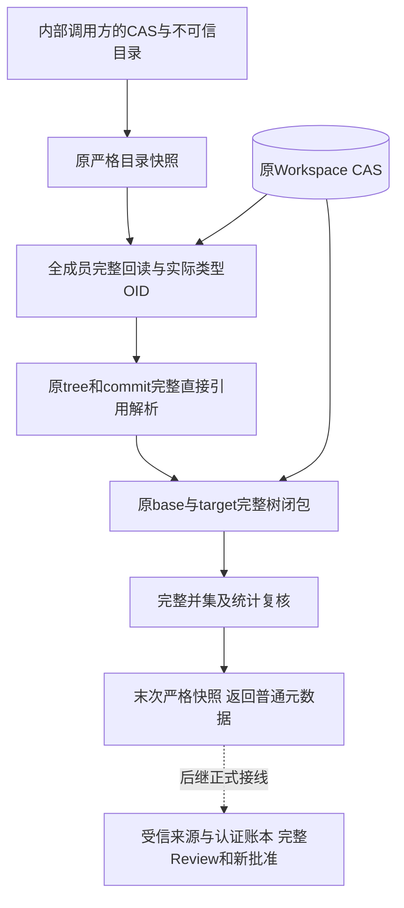
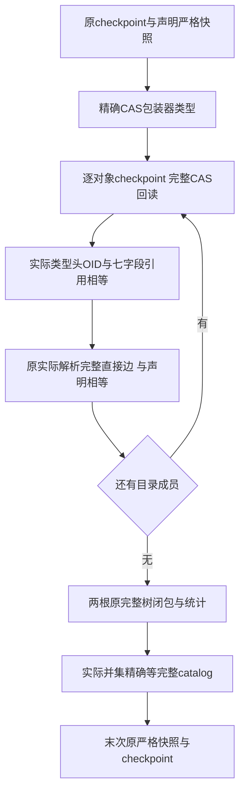
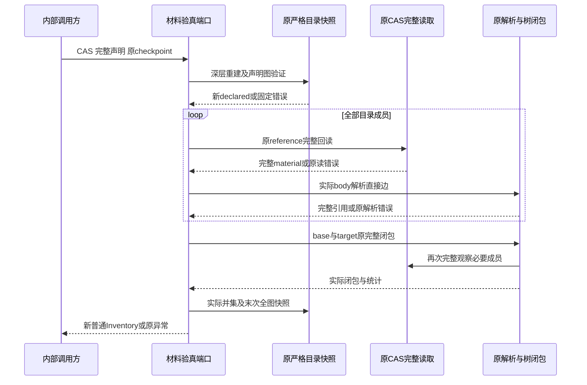
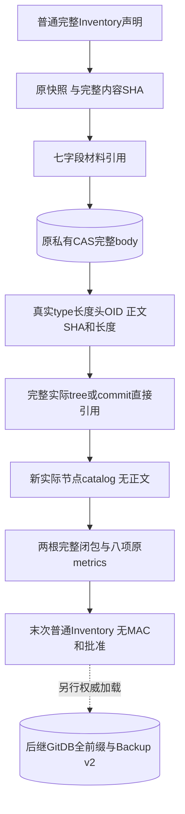

# Git完整对象目录实际材料验真：总体与详细设计

## 1. 需求背景与变更摘要

完整对象目录契约能证明声明自身闭合，不能证明实际CAS正文具有同样的类型、OID和直接引用。
例如一个元数据合法的tree可以声明另一名称或子对象；commit可以声明另一tree，或交换有序parent。
若审查、业务记录和备份只核对声明摘要，材料与展示／授权就可能形成不同内容。

本变更新增内部只读端口`verify_git_inventory_materials`，在原Workspace CAS中逐件读取整个目录，
重算真实Git类型头OID及完整正文绑定，复用原解析和两根普通文件树验真，最后返回新的普通元数据。
生产实现只有一个模块，不建立第二个CAS、对象解析器、数据库或权限系统。

该实现是完整Git产品交付的**内容验证环节**，不是完整W1、默认Commit／Checkpoint或商用R4完成。
后继受信装载、业务来源认证、GitDB全前缀与独立尾锚、完整Review／新批准及Backup v2仍属于必需接线。

## 2. 源码研究、目标、非目标与取舍

### 2.1 唯一存量复用接点

| 存量 | 当前实际行为 | 本变更复用方式 |
|---|---|---|
| [`git_inventory_contracts.py`](../../src/harnessix/delivery/git_inventory_contracts.py) | 深层严格快照、声明图／角色／指标／摘要一致性 | 首次冻结不可信声明，末次重验实际解析后的全图 |
| [`GitMaterialCAS.read`](../../src/harnessix/delivery/git_material_cas.py) | 原Store完整Blob读取，核对七字段引用、类型OID、长度和SHA | 全目录每个对象完整回读；不依赖正文前缀 |
| [`GitObjectMaterial.from_body`](../../src/harnessix/delivery/git_object_material.py) | 从实际完整bytes生成带类型头OID | 独立重建实际材料，不信任已有material字段自证 |
| [`parse_git_tree`／`parse_git_commit`](../../src/harnessix/delivery/git_object_references.py) | 原始tree名称、mode和child；commit首tree及有序重复parent | 对每个对象实际解析，与声明直接引用逐项相等 |
| [`verify_git_tree_closure`](../../src/harnessix/delivery/git_tree_closure.py) | 原CAS实际完整两树观察、路径、环、深度及逐路径统计 | 分别完整观察base与target；共享子树按路径展开 |

### 2.2 设计目标

1. 声明目录中没有任何对象仅凭摘要通过，每个成员都从原CAS完整重读；
2. 同CAS正文不同Git类型／OID必须分别验证，正文去重不得代替类型身份；
3. 原始tree名称、mode、child与commit tree／parent顺序和重复次数均不可被声明替换；
4. 实际两根闭包加业务commit根精确等于完整目录，不遗漏、补取或忽略孤儿；
5. 使用同一原检查点、显式四项图limits、max_parents及单对象8MiB，不新增产品默认容量或期限；
6. 全部失败整体拒绝，没有部分成功、正文、nonce、MAC或执行能力返回。

### 2.3 非目标与选型取舍

- 不验证UUID／SHA声明与真实产品调用者相符，不验证Store／Key／Owner归属或Approval；
- 不执行Git、不抓取外部父历史、不写SQL／CAS／Ref、不登记GitDB或效果成功；
- 不建立跨对象原子或同时静默快照，不声明耐久确认或硬实时取消SLO；
- 不把类的精确类型检查当作Python同进程攻击者的隔离边界。

受信宿主仍须装配正确的原`GitMaterialCAS.store`；本端口检查CAS包装器精确类型，但不证明其Store来源。
这样保持内容验证与产品权限职责分离，避免给任意调用者增加业务签发能力。
原树闭包再次读取材料，宁可复用同一验真语义也不另造缓存遍历；因此不能宣称只读一次或共同快照。

## 3. 总体架构、模块边界与信任边界



**文字说明：** 左侧目录不是受信事实。首次快照拒绝类型／字段／图／摘要错误，并断开嵌套别名。
每个实际材料再经原CAS与独立Git类型OID重建；解析后的对象替换到新目录，两树闭包共同覆盖全部材料。
结果仍是普通`GitObjectInventory`，虚线表示尚未接通的权限和持久业务链，不能据此启动Git写效果。

## 4. 接口设计、类与数据结构

### 4.1 唯一新增入口

```python
verify_git_inventory_materials(
    cas: GitMaterialCAS,
    inventory: object,
    *,
    checkpoint: Callable[[], None],
) -> GitObjectInventory
```

| 参数／结果 | 来源与重点语义 | 校验与生命周期 |
|---|---|---|
| `cas` | 宿主装配的原CAS适配器，隐藏Store于repr | 精确`GitMaterialCAS`类型；创建／关闭原Store由调用方负责 |
| `inventory` | 不可信完整目录声明，不接受其frozen声明自证 | 原snapshot在IO前深层重建七模型及引用，完整SHA与显式限额一致 |
| `checkpoint` | 调用者原取消／期限检查函数 | 同一个对象传入原snapshot／parse／closure；异常原对象传播 |
| 返回值 | 新的完整`GitObjectInventory` | 与原合法内容身份相同，但对象是新快照；不是capability、耐久或授权证明 |

### 4.2 七字段材料引用

`GitObjectMaterialReference`固定`version`、`object_type`、`object_id`、`object_format`、
`body_sha256`、`body_bytes`、`cas_digest`。
factory从实际完整正文重建前六字段，原版本使用固定v1；整个引用精确比较包括版本。
`cas_digest`必须等于完整正文SHA，Git OID则包含真实类型和长度头，两种摘要用途不能互换。

`GitInventoryObject`仍有四字段：实际`material`、完整原`roles`、实际`tree_entries`和实际`commit_references`。
role未由本函数授予业务权限：末次W0按真实解析图重新计算期望角色并拒绝不一致，不自动修复输入。

### 4.3 原两树观察及重点字段

| 数据 | 实际消费 | 比较对象 |
|---|---|---|
| `roots.base_tree`／`roots.target_tree` | 原实际闭包两次调用，使用整个catalog和原limits | 实际root七字段引用 |
| `closure.objects` | 两树各自实际可达对象列表 | 每个原引用与完整实际catalog节点相等 |
| `closure.body_bytes` | 本根唯一Git对象正文量 | 从实际引用逐件累加，不以CAS digest去重 |
| `closure.expanded_entries` | 包含共享子树的逐路径展开数 | 原metrics的base／target对应字段 |
| `closure.tree_depth` | root深度零、最深tree层级 | 原metrics的两根深度字段 |
| `roots.base_commit`／可选`delivery_commit` | 首轮全成员回读及commit解析 | 与两树对象并集精确覆盖catalog |

完整目录七模型及15字段记录不变，详见
[目录领域契约设计](m09-r4-git-object-inventory-contract.md#4-类设计与数据结构设计)。

## 5. 处理流程及核心业务逻辑伪代码



**文字说明：** 声明快照失败时CAS读取数为零。节点逐件验证后才进入两树观察；任何节点、边、统计或并集
不一致直接拒绝，不跳过坏对象或把另一正确root视为部分成功。最终快照还复核原完整SHA、角色和指标。

```text
checkpoint()
declared = 原snapshot(inventory, 原checkpoint)
拒绝不是精确GitMaterialCAS的端口

for node in declared.objects:
    checkpoint → 原cas.read(node.material) → checkpoint
    actual = 原from_body(实际type, format, 完整body)
    重建并比较完整七字段reference
    使用原parse取得完整tree／commit直接边
    比较原名称、mode、child、tree、有序parent及重复次数
    加入新actual节点和catalog；没有正文留在返回目录

base = 原完整tree_closure(base_tree, 全catalog, 原limits, 原checkpoint)
target = 原完整tree_closure(target_tree, 全catalog, 原limits, 原checkpoint)
逐对象核对各closure引用、正文量、逐路径展开与深度
base.objects ∪ target.objects ∪ base_commit ∪ 可选delivery_commit == 全catalog
result = 原snapshot(实际节点的新目录, 原checkpoint)
checkpoint()
return result
```

## 6. 调用时序、取消与异常收敛



**文字说明：** 同一个checkpoint贯穿全部原接口及前后IO边界；调用者取消、超时、ValueError等保留原对象。
端口不捕获检查点异常，不重试，不改变调用者原期限。`GitMaterialCAS.read`本身没有checkpoint参数，
完整文件读取和哈希的系统调用不可抢占；两次原closure也不是跨对象共同观察。
取消／失败无部分返回，没有新写者、句柄Owner或待续写事务，原Store关闭仍由调用方负责。

## 7. 数据流程、持久化与部署方案



**文字说明：** 实际正文仅在原私有CAS与验真过程内出现，返回数据保存引用和实际直接边，不保存正文。
完整元数据仍可能含敏感路径名，不能当作公开日志。当前无新DDL／表／Key／服务／依赖／配置，也无数据迁移。
原Store创建、原CAS材料持久化和测试损坏注入均发生在验真之前，不能计作本函数写效果。
部署沿原Python包，宿主未显式消费本函数时默认产品行为不变。

## 8. 安全、错误分类与可观测性

| 错误 | 当前行为 | 恢复边界 |
|---|---|---|
| 原W0严格输入／图／摘要错误 | 原固定KernelError传播，发生于CAS IO前 | 修复来源声明后重新准备，不自动补对象或修SHA |
| `git_inventory_materials_invalid` | 非精确CAS包装器拒绝 | 宿主正确装配，不回退任意reader |
| 原`git_material_cas_read_failed` | 缺失、损坏、错误长度／OID等原读错误保持 | 不以声明或缓存替代实际正文 |
| 原tree／commit／closure错误 | 原错误码保持，限额不提高 | 不过滤不支持模式或放宽路径／父边 |
| `git_inventory_materials_mismatch` | 实际七字段、直接边、closure引用／统计／并集不一致 | 整体拒绝，无部分输出 |
| 原checkpoint异常 | 原对象直接传播 | 原调用者结算，不续写或重新执行Git |

新增错误消息固定，不拼接正文、OID、路径或第三方异常。原错误可能来自受信CAS底层，公开边界沿原合同。
本模块不新增遥测、公开日志、MAC或成功Seal；返回普通内容相等不是业务归属、授权、耐久或效果认证。
原8MiB单对象、显式max_objects／max_body_bytes／max_entries／max_depth和max_parents保持。

## 9. 类、函数与测试源码映射

| 符号／测试 | 源码位置 | 阅读重点 |
|---|---|---|
| `_read_object` | [`git_inventory_materials.py`](../../src/harnessix/delivery/git_inventory_materials.py) | 全body重建、七字段与完整直接引用比较 |
| `_actual_closure` | 同上 | 原两根遍历、引用、正文量、逐路径与深度 |
| `_complete_union` | 同上 | 两树与commit根精确全目录并集，外部父不抓取 |
| `verify_git_inventory_materials` | 同上 | 原声明前置、逐件实际节点、两根、最终snapshot和检查点 |
| 完整实际CAS正反例 | [`test_git_inventory_materials.py`](../../tests/delivery/test_git_inventory_materials.py) | 两格式／动作／阶段／逻辑平台、坏材料／边／预算、取消身份及零写 |
| 完整8MiB tree | [`test_git_inventory_materials_capacity.py`](../../tests/delivery/test_git_inventory_materials_capacity.py) | 原真实CAS中完整大tree、每个路径及两个路径合同，不是空摘要占位 |

## 10. 测试设计、验证输入与验收标准

新增主测试使用真实SQLite Store／CAS，缺失及损坏在调用前制造；计数包装器仍调用原read／parse／closure。
覆盖七字段错误、W0合法但实际直接边不同、parent顺序与重复、全角色／并集、预算恰界／超一、
共享子树逐路径、两类型同正文、深层别名断开、同回调六阶段六异常身份及只读Store零SQL／零写。
8MiB blob／commit和新增tree均为原CAS真实完整正文；树补验的Windows参数仅验证路径规则，不是原生Windows。

独立审查、实际新候选源码／同Wheel源码外验证、治理／文档／Secret及源输入清单须分别绑定实际字节。
原collection RED、开发测试错误、职责复杂度拒绝与各次结果保留；不以测试相加或旧Wheel继承形成新候选PASS。
当前设计没有凭空登记完整W1、R3真实Suite、消费者Windows11或Beta验收结果。

## 11. 风险、兼容、回滚与后继完整产品接线

新增内部函数不改变原公开Schema、SQLite布局、工具Catalog、审批或执行环境。卸除未装配函数不影响既有历史；
不通过放宽政策、预算、超时或未知效果规则获得兼容。
原CAS可能在对象间被外部改变，验证只证明各次完整观察，不能承诺同时原子视图；实际产品必须使用原Owner／Lease
及受信装载、完整认证目录和独立尾锚来建立自己的来源／生命周期约束。

后继必须完成真实Source／Baseline及产品调用者的逐字段归属、全GitDB认证前缀与独立尾锚、
完整Review及新批准、A／T／Bridge／D双受管工作树、原Runtime效果对账、Backup v2与新根新Epoch重授权。
本地Commit／Checkpoint不延期；公网Push仍按首发范围延期。
详细全产品目标见[完整Git产品交付与备份设计](m09-r4-git-delivery-business-backup-closure.md)。
