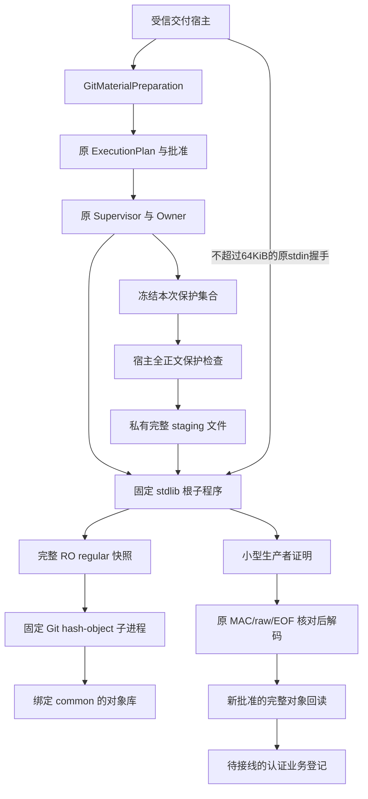
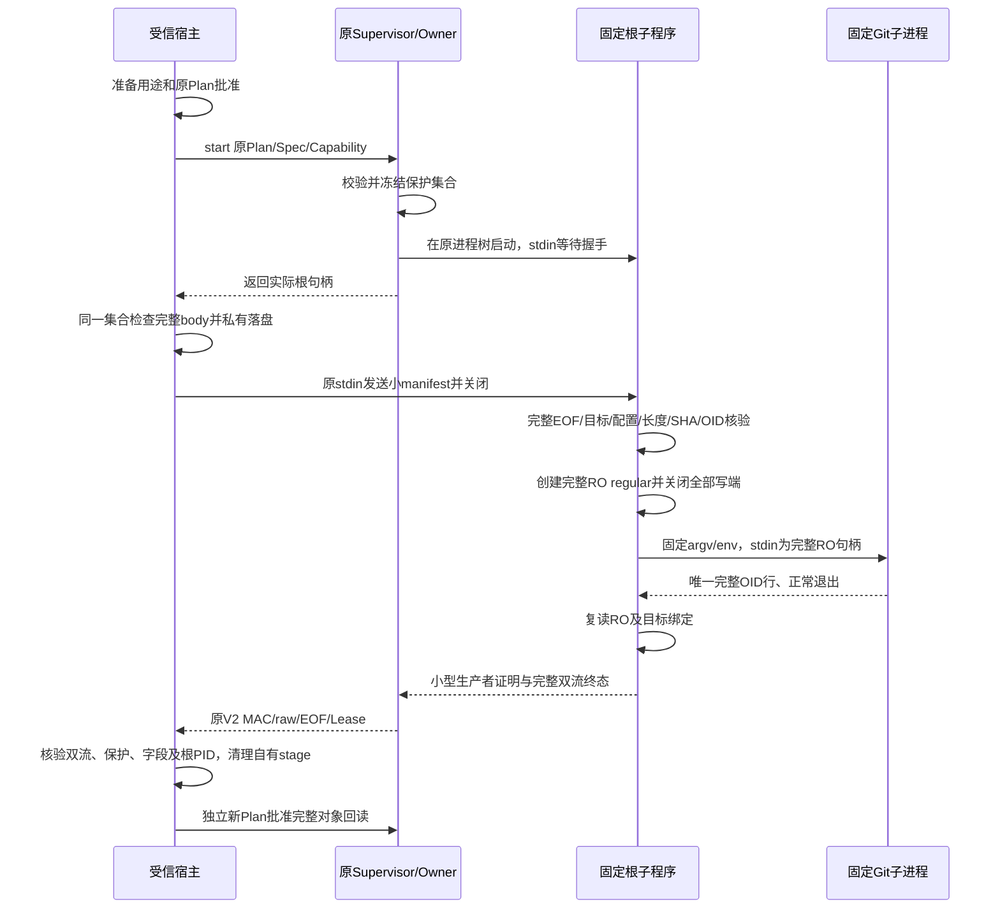
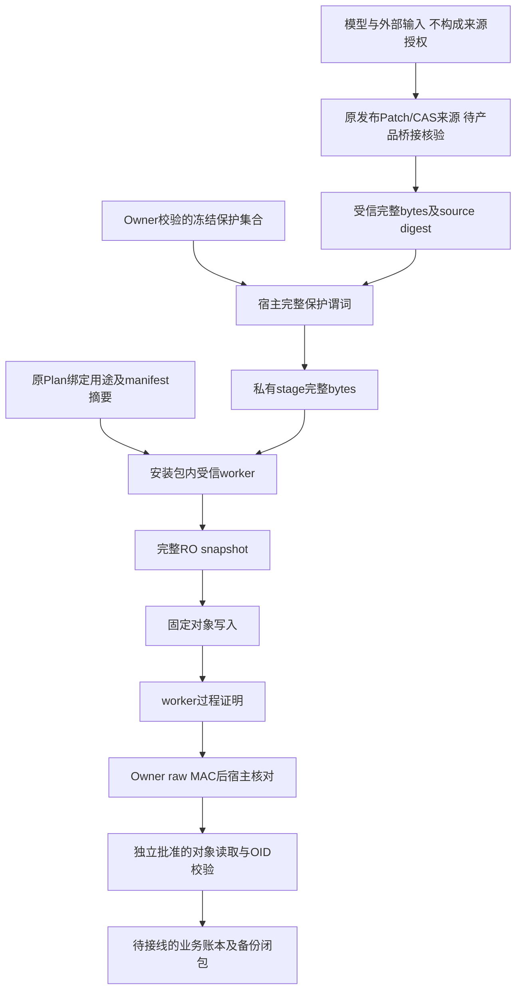

# 固定 Git 对象完整输入总体与详细设计

## 1. 需求背景与问题定义

[完整业务闭包设计](m09-r4-git-delivery-business-backup-closure.md)需要持续多 Patch、完整对象材料、
独立批准、持久交付和备份恢复。[完整对象读取](m09-r4-git-object-material-read.md)已保留 blob/tree/commit、
SHA1/SHA256 和完整 8MiB 正文，但不能解决向 Git 提交同样大小的输入。
原 Process 控制输入和普通 Git 流额度均为 1MiB，不能提高通用输入上限，也不能截断材料后执行。

另一关键问题是取消语义：把大正文分块送入 Git 的管道，进程死亡时 Git 可能把已经收到的前缀当作一个
完整 blob 写入对象库。管道 EOF 不等于批准正文的 EOF。仅验证退出后 stdout 或材料路径摘要不能消除该风险。

本方案把原 Supervisor 启动的根进程固定为受信 stdlib 子程序：原 stdin 只承担小握手，完整正文另行核验；
Git 启动前必须持有已经完整写入、关闭全部写端并复读验真的只读普通文件句柄。

## 2. 设计目标、范围与非目标

1. 保留 blob/tree/commit、SHA1/SHA256 和每对象 8MiB，空 blob/tree 与合法最小 commit 均有对应语义；
   不使用 `--literally` 把不合法 tree/commit 当成成功对象。
2. 复用原 ExecutionPlan、批准、Process Owner、Lease、取消、原始流 MAC 和共享绝对期限；
   不新增 Owner 协议、数据库或自动批准路径。
3. 完整输入在落盘和 Git 启动前，通过原 Owner 已校验并冻结的同一保护集合；有效空集合与缺少来源分开。
4. 固定目标 common/objects、Git 程序、环境、安装代码和基础解释器，拒绝配置或身份漂移。
5. 原过程证明只能认证子程序的输出。对象业务后置条件必须另取批准，沿完整 `cat-file --batch` 回读验真。

当前实现是内部受控 IO 准备与执行能力，不新增默认模型 Git 写 Tool，不授权 Ref/Commit/Push，
不完成 CAS 耐久登记、Git 认证业务账本、Backup v2 或跨崩溃阶段登记。
安装包和相同用户的受信宿主属于 TCB；路径/句柄核验不宣称阻止任意相同 UID 外部程序攻击。
本文前置 Revision 是研究基线，未宣称该基线提交已经包含新增实现。

## 3. 源码研究、架构决策、风险与取舍

| 方案 | 结论 | 原因 |
|---|---|---|
| 仅向 Git 传递 CAS 路径 | 不采用 | 0600 不等于不可变；路径可换、同 inode 可改，摘要观察不是封印 |
| 扩充 Owner 协议传大输入/FD | 本能力不采用 | 两平台控制协议、捕获和回执需同步变更，已有材料目的不应提升通用权限 |
| 原小 stdin + 完整 RO 普通文件快照 | 采用 | 原 Owner 保持单一；Git 前已取得完整 EOF、长度、SHA 和 OID，死亡不会把管道前缀补成对象 |

原 [ProcessSpec](../../src/harnessix/processes/supervision_contracts.py) 的 stdin 描述实际根进程输入，
不是另一个不可见的控制协议。原 [Supervisor](../../src/harnessix/processes/supervisor.py) 启动前构造保护封套；
宿主不能在此之前先读一个可轮换来源再假定等同于 Owner 读取结果。

Windows 创建和关闭行为依据
[CreateFileW](https://learn.microsoft.com/en-us/windows/win32/api/fileapi/nf-fileapi-createfilew)：
从创建开始设置删除关闭标志，删除等待所有原始及复制句柄关闭。
权限降级依据
[DuplicateHandle](https://learn.microsoft.com/en-us/windows/win32/api/handleapi/nf-handleapi-duplicatehandle)：
显式请求读权限且不使用 `DUPLICATE_SAME_ACCESS`，不按路径重新打开快照。
这是 API 依据，不代替新候选的 Windows 原生执行证据。

目录及既有对象保护句柄必须请求实际 `FILE_READ_DATA/LIST_DIRECTORY`，不能仅设属性读和分享数字。
[微软共享检查算法](https://learn.microsoft.com/en-us/openspecs/windows_protocols/ms-fsa/8c0e3f4f-0729-49f4-a14d-7f7add593819)
只对相应的数据/执行/写入/删除访问进行共享冲突检查；属性句柄不能作为同等保护证明。
配置值按照引号外注释解释 `#`/`;`，引号内字符保持；无效引号、禁止 include/filter 和兼容格式仍拒绝。

## 4. 总体架构与模块职责



`GitMaterialPreparation` 只从原宿主取得命令材料、私有目录和关闭状态；它没有执行权限。
唯一执行入口仍是 `GitDeliveryProcess.run`。根 PID 是基础 Python 子程序 PID，不是其内部 Git PID。
Git 子进程不新建 session/group、不使用 shell、不 breakaway，留在原 POSIX 进程组或 Windows Job 中。

| 源码 | 单一职责 |
|---|---|
| [git_material_process](../../src/harnessix/product_config/git_material_process.py) | 准备用途、固定启动参数、保护后 staging、线程结算和自有文件清理 |
| [git_delivery_process](../../src/harnessix/product_config/git_delivery_process.py) | 原批准/Owner 编排、双流验真、生产者 PID 对照和不确定效果优先级 |
| [input_contracts](../../src/harnessix/delivery/git_material_input_contracts.py) | stdlib 冻结数据、严格 canonical JSON、用途和实现摘要、生产者证明 |
| [native](../../src/harnessix/delivery/git_material_native.py) | 路径/配置控制集合、对象命名空间、有界完整读取、完整 RO 快照 |
| [native_windows](../../src/harnessix/delivery/git_material_native_windows.py) | 本地 NTFS 句柄、私有 ACL、拒共享写/删除及从创建开始的快照生命周期 |
| [worker](../../src/harnessix/delivery/git_material_worker.py) | 小握手 EOF、固定 Git argv/env、共享期限、子进程输出上界和证明生成 |

## 5. 接口设计与重点类设计

```text
GitDeliveryProcess.prepare_object_write(
    cwd, repository_binding, common_directory, material,
    source_digest, shared_budget, timeout
) -> PreparedGitProcess

GitDeliveryProcess.run(prepared, original_plan, cancel,
                       shared_budget, checkpoint) -> GitProcessCompletion

prepare_material_stdin(write, frozen_protection, cancel, budget)
    -> StagedGitMaterial

decode_manifest(canonical_bytes) -> GitMaterialInput
decode_proof(canonical_bytes, original_request) -> GitMaterialProof
```

`source_digest` 是受信宿主的来源绑定，不接受模型自报摘要作为产品授权证明。
调用该内部接口本身不证明摘要已经来自原发布 Patch/CAS；正式产品桥接仍需核验原来源。

`PreparedGitProcess.command` 保留内层 Git 命令及完整 body 摘要，`spec.argv` 是固定子程序启动；
两个角色不能混淆。`write` 与原读取用途 `material` 互斥。批准参数同时绑定两者，不持久化 body 正文。
`GitMaterialExecution.verify` 重验请求、完整不可变 bytes、固定启动入口、物理身份及控制文件集合。
`GitProcessCompletion.input_proof` 与回读 `material` 分开，不能将一份过程证明当作对象业务完成。

## 6. 数据结构、字段解释与容量

| 数据/字段 | 含义与核验 |
|---|---|
| `nonce`、`body_ref` | 单次随机用途与私有名称；握手、Plan 和证明必须一致，不按旧过程重放 |
| `source_digest` | 原受信来源摘要；当前 IO 不自行伪造来源业务登记 |
| `body_sha256`、`body_bytes` | 完整正文 SHA256 和长度，正文为严格 bytes，范围 0～8MiB |
| `expected_oid`、`object_format`、`object_type` | 按 Git 类型/长度头与正文计算 SHA1/SHA256；仅三个固定类型 |
| `repo/common/objects_*identity` | 实体目录和原定位目标，不能重定向到别的对象库 |
| `control_files` | config、可选 worktree config 和 worktree 指针闭包的完整 SHA/长度/身份；最多8件，每件最多1MiB |
| `git_argv`、`git_environment` | 原 Runner 固定材料；无过滤、无懒取对象、仅 file 协议、无继承用户配置/凭据 |
| `runtime_identity` | 基础解释器实体版本；不用 Windows venv launcher PID 冒充子程序 PID |
| `implementation_digest` | 四个 stdlib 模块和两个包入口的完整内容摘要；宿主适配实现另由原批准绑定 |
| `purpose_digest` | 除自身之外的全部用途字段 canonical 摘要，含 nonce 和绝对期限 |
| `expiry_monotonic_ns` | 原 `GitOperationBudget` 的绝对单调期限；每阶段不能获得新预算 |
| `manifest_sha256` | 实际小 stdin 的 canonical 字节摘要，固定 argv 再绑定一遍 |
| `source_eof`、`snapshot_*` | 子程序观察完整 stage 和 RO snapshot；长度/SHA须等于原正文 |
| `producer_pid` | 实际子程序 PID，宿主解码后与原已认证 Lease PID 比较 |
| `git_stdout_eof`、`git_returncode` | 完整唯一预期 OID 行且 Git 正常返回0，不接受捕获前缀 |

握手上限64KiB；生产者证明上限4096字节。根过程双流捕获仍沿原受控 IO，内层 stdout 只允许唯一
完整 OID 与 LF。原普通输入1MiB、普通命令每流1MiB均不变。不能把这些控制限制解释为业务材料降到1MiB。

## 7. 正常流程、时序与完整说明



根子程序必须观察小 stdin EOF 才会处理请求，不提前执行 Git。宿主输入保护命中时不落 stage、不发 manifest，
只停止并结算等待中的原根进程。保护检查和 staging 在线程执行，直接 Task 取消也先取消原令牌并排空该线程。

POSIX 快照先排他建空文件、开 RO 端并去名，随后才写任何正文；写满、fsync、关闭写端后复读 RO。
Windows 从 `CREATE_NEW` 设置删除关闭与拒共享写/删除，写满后显式降权复制只读句柄，关闭写端后复读。
两个实现都在 Git 前取得完整普通文件，不以正文管道模拟只读快照。

## 8. 数据流与信任边界



保护集合不传给 Git，也不出现在 manifest/证明；子程序通过完整 body SHA、OID 和受信代码继承宿主已核验的
保护谓词。这是受信生产者机制，不是 Owner 直接观察 Git stdin 的声明。
公开脱敏输出不能替代完整私有正文或原 raw 认证，正文及个人路径不进入公开验证包。

## 9. 核心业务逻辑伪代码

```text
prepare:
    验证原仓库实体绑定、Git实体、完整类型/长度/OID和同一预算
    固定内层命令、私有body名称、小manifest和基础解释器入口
    返回待批准材料，不创建body或启动过程
run:
    重验全部材料、原Plan/批准/环境/能力/Workspace
    原Owner启动固定子程序并冻结保护集合
    检查完整body；完整私有stage；向原stdin发送小manifest并close
worker:
    完整读取manifest到EOF；严格字段和canonical校验
    核验目标和控制闭包；完整读取stage，核对长度/SHA/OID
    建立从正文写入前开始的快照死亡生命周期
    写满并关闭所有写端；完整RO复读
    同一进程树启动固定Git，接受唯一OID行及0退出
    复验snapshot和目标，生成小型证明
settle:
    原Lease/MAC/raw/EOF完整核对；保护集合不得改写结果
    校验证明全部绑定和根PID；仅清理同一实体自有stage
    任何握手可能送达后的不完整结果 -> material effect unknown，不重放
    该用途标志覆盖原Supervisor整个退出；其关闭异常不能把强错误降级
    Supervisor退出后清理自有stage；实体变化保持强错误，不删除陌生文件
    新批准的完整对象回读后，才允许后继业务登记判断对象后置条件
```

## 10. 异常、取消、超时与恢复

| 阶段/故障 | 语义与动作 |
|---|---|
| 无批准、用途/目标/程序漂移、原保护来源缺失 | Owner 和 stage 创建前拒绝；不执行 Git |
| 完整输入保护命中 | 原 Owner 已启动，但无 stage/manifest/Git；停止并验真原根终态 |
| staging 取消或期限耗尽 | 先排空线程和原根句柄；仅清理 O_EXCL 创建且实体匹配的文件 |
| manifest 可能送达后退出、取消、超时、损坏证明、PID不匹配 | `git_material_effect_unknown`；对象可能存在，禁止自动重试、删除对象或回退 Ref |
| 原 Owner 失联/损坏/unknown | 原强错误及业务不确定性不能被普通取消或超时覆盖；Lease真实终态不伪装为另一个状态 |
| 原 Supervisor 退出再次抛出控制失联错误 | 用途标志保留至整个 `async with` 结束；可能送达后的任何退出异常仍归类为 `git_material_effect_unknown` |
| stage 清理身份变化或清理失败 | 强失败，不返回过程成功；不按 glob 删除陌生文件 |
| 宿主硬崩溃 | 不靠 finally 声称全部清理；body stage 的耐久归属/恢复由后继业务阶段账本闭合 |

快照的首次真实正文写入后死亡屏障分别验证取消、强杀和超时，不代表排他重放每个历史调度。
原控制写失联存在两层关闭：内部停止/等待和 `Supervisor.__aexit__` 再次关闭原句柄。
仅在内部 helper 保存强错误不完整，后者仍可能以 `process_not_owned` 覆盖该错误。
宿主在进入 Supervisor 前建立 `input_sent` 与自有 staging 引用；在每次原控制发送之前标记可能送达。
最终错误分类覆盖整个 Supervisor 退出，私有实体清理在此边界之外完成。
真实进程故障回归保留内部及外层实际关闭失败，没有吞掉故障、修改原 Lease 或自动重发材料。
POSIX 创建空名称至去名之间仍存在短窗口；不宣称抵御此窗口的任意硬退出，也不把空文件残留等同于
批准正文的前缀对象。正式业务阶段登记与崩溃扫描仍必须补齐，不能因此提前开放默认 Git 写 Tool。

## 11. 持久化、可观测性、安全与部署

沿原 ExecutionPlan SQLite 和 Process Lease/Owner receipt 保留意图及实际过程；不增加数据库格式或密钥。
阶段目录为私有权限，代码正文隐藏于 repr，失败仅公开固定错误码。原 Plan 中的受控路径/参数属于私有状态，
不复制到公开报告。记录 process ID、用途摘要、输入长度/SHA、失败阶段和实际 Lease，不记录保护值或正文。

子程序仅依赖 stdlib，以固定安装根导入，`-I` 隔离 cwd/PYTHONPATH，避免工作区伪装包入口；
四模块及两个 `__init__` 进入实现摘要。基础解释器和 Git 均另有实体身份。
新快照读端没有写/追加权限；Windows Job 与原 POSIX Owner 回收整个原进程树。
路径、ACL、无 hardlink/reparse、配置闭包和有界对象命名空间检查仍保留，不自动 fetch 对象或执行过滤器。

宿主和子程序共用原绝对单调期限；原 Owner 的实际启动期限可以更严格。
不把传输到子程序的预算值宣称为 Owner 内部实际 deadline 的同一数值。
默认 CLI、SDK/Protocol、MCP 和 Provider 注册均不新增 Git 写入口，安装后只增加内部实现文件。

## 12. 完整测试、验证范围与发布条件

| 测试文件 | 覆盖 |
|---|---|
| [完整输入](../../tests/product_config/test_git_material_input.py) | 三类型×两格式×完整8MiB/合法最小；真实Owner/Git写入、新批准回读；保护、批准、严格JSON、身份/用途漂移、线程取消/期限和不确定证明 |
| [快照死亡生命周期](../../tests/product_config/test_git_material_snapshot_lifecycle.py) | 实际根PID和第一次真实快照写入屏障；取消/强杀/超时，原MAC和进程回收；不执行Git，不冒充写业务成功 |
| [完整原监督器退出](../../tests/product_config/test_git_material_owner_exit.py) | 真实 Owner 控制写 OSError、内部停止及外层关闭均失败；普通错误/调用取消/期限耗尽保持未知效果；清理前实际更换实体，分别验证未送达拒绝及已取得证明仍不返回成功 |
| [配置与原生保护](../../tests/product_config/test_git_material_native.py) | Git配置引号/注释解释及禁止输入；实际SHA256对象写入；Windows属性句柄负对照与数据读句柄拒共享写/重命名/删除，单机跳过不算原生通过 |
| [原对象读取](../../tests/product_config/test_git_object_material.py) | 原209案例及后继四负例保持，完整OID/EOF/容量/保护读取合同 |
| [原受控IO](../../tests/product_config/test_git_delivery_process.py) | 原62案例、1MiB、计划批准、PID、进程树、取消和raw回执保持 |

同候选[验证包](../validation/git-material-input-2026-10-01-v1/README.md)固定1232件代码输入，
关联1014通过/43跳过；同一实际Wheel的419模块与源码及两处安装逐字节一致，
源码外Python3.12/3.13各356通过/2跳过。原控制失联缺陷3失败与后继回归分开保留，
五项真实Owner/实体清理案例覆盖整个退出边界，独立复核确认该发现静态闭合。
不将单机通过推导为消费者Windows11、Linux/macOS全部发行输入或完整商用门禁。
正式接线仍需来源桥接、完整 Diff 与独立批准、双受管工作树、耐久材料和原认证账本、阶段恢复、Backup v2；
R3完整20 Trial、独立 Beta 和同候选 R1～R6均继续开放。测试集合重叠不相加，历史失败不覆盖。
