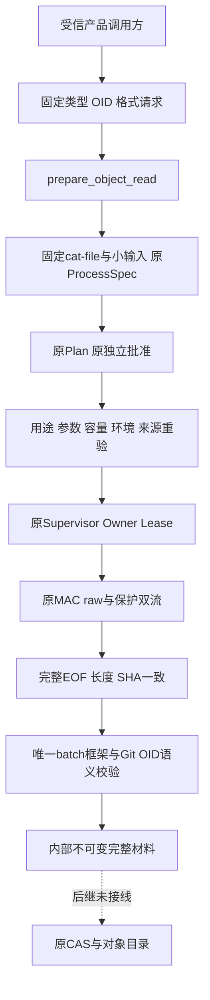
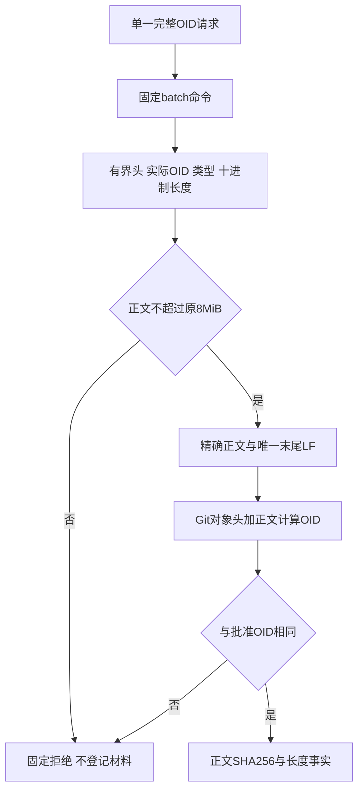
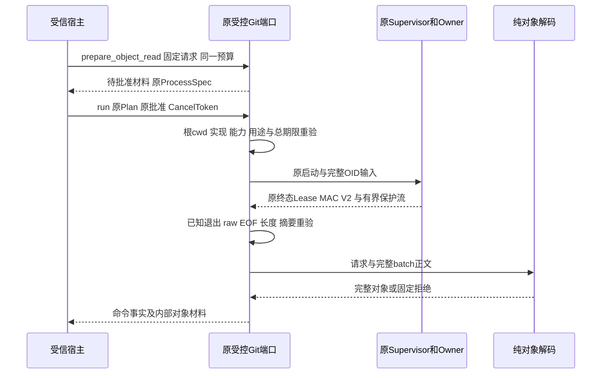
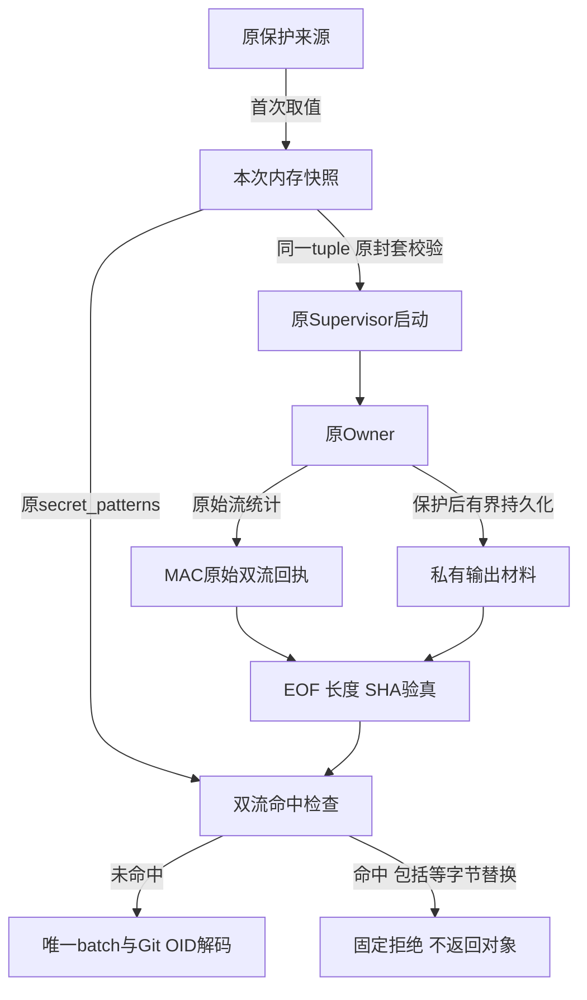
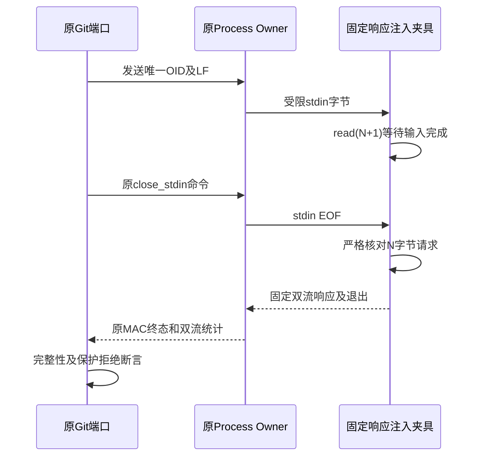

# 固定Git对象完整材料读取总体与详细设计

## 1. 需求背景

[完整业务闭包设计](m09-r4-git-delivery-business-backup-closure.md)要求8MiB普通文件和完整Git对象正文。
[内部受控命令IO](m09-r4-git-supervised-command-io.md)解决取消、原批准与认证回执，但标准命令每流1MiB结果
不能承担完整对象材料消费。旧Git基准的完整raw摘要能证明大文件版本，却没有完整正文；公开脱敏Artifact
或有界捕获前缀也不能恢复Git对象。

必须先实现真正的完整、有界、原始字节认证与语义校验，后继才能登记对象目录或备份闭包。
本设计父Revision仅是研究基线，候选实现与实测由独立SHA绑定。

## 2. 设计目标、范围与取舍

### 2.1 当前切片目标

- 增加受信内部固定OID读取用途，支持blob、tree、commit及SHA-1/SHA-256对象格式。
- 仅固定`cat-file --batch`，输入仅一个完整小写OID和LF；不用路径、Ref、任意revision表达式、filter或textconv。
- 8MiB正文经原Supervisor、Owner、MAC、Lease、EOF、长度与SHA核验，再校验完整Git对象OID。
- 申请材料用途时把对象类型、OID、格式、容量及原ProcessSpec明确绑定原Plan与批准。
- 标准命令每流1MiB及控制stdin1MiB保持原值；材料使用原ProcessSpec既有64MiB范围，不改全局上限。
- 默认禁止lazy fetch；不存在的对象拒绝，不联网补对象，不制造只读规划的对象写效果。

### 2.2 明确未交付的总体边界

本切片只实现**完整对象读取**，不是8MiB对象写入通道、CAS登记、对象目录、Checkpoint/Commit、
产品Git Tool、Backup v2或完整恢复。控制stdin仍不能发送8MiB正文，后继必须实现受信输入材料职责，
不能缩减原文件容量或改用单Patch规避。全部原业务目标保持。

命中Secret保护导致正文改写时仍拒绝；不为材料关闭脱敏、持久化未保护raw或将保护后正文当原对象。
需要保留受保护原始正文的后继材料/CAS边界仍须单独完成安全设计；本切片不能据此宣称所有材料闭包成立。

## 3. 源码研究与架构决策

| 原入口 | 已求证行为及本变更 |
|---|---|
| [`delivery/contracts.py`](../../src/harnessix/delivery/contracts.py) | 原单文件8MiB、事务镜像32MiB；复用单文件上限，不提高 |
| [`processes/supervision_contracts.py`](../../src/harnessix/processes/supervision_contracts.py) | 控制输入1MiB、输出64MiB；采用现有输出合同，不增加另一Owner协议 |
| [`product_config/git_delivery_process.py`](../../src/harnessix/product_config/git_delivery_process.py) | 原批准、固定环境、取消/期限、唯一Owner及终态raw校验；增加受限材料用途而非任意输出预算参数 |
| [`product_config/git_baseline.py`](../../src/harnessix/product_config/git_baseline.py) | 基准raw证明与完整正文区分；不能复用其捕获前缀作为材料 |
| [`processes/git_read_windows.py`](../../src/harnessix/processes/git_read_windows.py) | 已用`GIT_NO_LAZY_FETCH=1`禁补对象；固定Runner沿同一策略 |
| [`delivery/git_contracts.py`](../../src/harnessix/delivery/git_contracts.py) | 唯一完整OID格式校验器；新增纯对象职责复用，而非复制正则 |

batch响应自带实际类型和长度，能够同时核对对象格式与完整OID，避免以错误类型读取后包装成合法材料。
对象编码遵循Git原对象`type + 空格 + 十进制正文长度 + NUL + 正文`，Git OID不是正文SHA-256。
新增纯对象职责放在delivery，不依赖Process或产品装配；产品端仅协调原IO与该纯验证器。

## 4. 总体架构、核心流程与数据流







图中材料返回只是读取证明；虚线CAS是待实施职责。业务效果确认、持久关联与备份不由图中的读取成功推出。

## 5. 接口设计、类设计、数据结构与领域契约

纯合同与语义校验对应[`git_object_material.py`](../../src/harnessix/delivery/git_object_material.py)，
原受控端口新增用途对应[`git_delivery_process.py`](../../src/harnessix/product_config/git_delivery_process.py)，
固定环境对应[`git_command.py`](../../src/harnessix/delivery/git_command.py)。

新增`GitObjectRead(object_type, object_id, object_format)`为冻结内部合同：
类型仅blob/tree/commit；OID只接受40或64小写十六进制，并与明确sha1/sha256格式长度一致。
`max_body_bytes`恒等于原8MiB，`stdout_limit`只加入有界128字节头与唯一正文尾LF。
原`PreparedGitProcess.material`为可选用途绑定；没有该绑定的普通prepare保持原结果额度。
`approval_arguments()`额外包含材料合同，不能以相同argv替换对象类型或把普通批准升级为材料批准。

新增`GitObjectMaterial`保存对象类型/OID/格式及`repr=False`的完整bytes，派生正文SHA256与长度。
`decode_git_object_batch`只做纯解码/验证，不访问Git、路径、CAS、Session、Key或数据库。
新增`prepare_object_read`只生成材料，不启动；`run`仍沿原批准入口，完成后可附带内部材料结果。

### 5.1 重点字段与来源

| 类型与字段 | 含义、约束与可信来源 |
|---|---|
| `GitObjectRead.object_type` | 宿主明确的预期类型，仅接受内置字符串`blob/tree/commit`；必须与实际batch头一致，不能由模型输出补齐。 |
| `GitObjectRead.object_id` | 完整小写Git对象ID；SHA1为40位、SHA256为64位。不是Ref、缩写、路径或对象正文SHA256。 |
| `GitObjectRead.object_format` | 明确`sha1/sha256`，长度与OID对应；解码不自行猜测格式。 |
| `GitObjectRead.max_body_bytes` | 固定复用`MAX_TRANSACTION_FILE_BYTES`，8,388,608字节；没有调用方可调参数。 |
| `GitObjectRead.stdout_limit` | 正文上限加128字节有界batch头和1字节正文尾LF；不是普通命令的1MiB额度。 |
| `PreparedGitProcess.material` | 可选固定用途；存在时命令必须为`cat-file --batch`、stdin必须为唯一完整OID加LF。 |
| `ProcessSpec.input_bytes` | SHA1请求为41字节、SHA256为65字节；不传对象正文，不放宽原1MiB输入合同。 |
| `ProcessSpec.output_bytes` | 材料stdout上限加原stderr的1MiB，用于原Owner总捕获预算；返回时仍分别验证两路上限。 |
| `approval_arguments().material` | `git-object-read/v1`用途绑定，覆盖类型、OID、格式及固定容量。相同argv不等于相同读取批准。 |
| `ProcessOwnerReceiptV2.raw_stdout` | 原Owner对整个batch响应的字节数、SHA256和EOF事实，经原MAC及Lease绑定验真；不是对象正文摘要。 |
| `GitObjectMaterial.body` | 精确对象正文，内置不可变bytes、`repr=False`；batch头和末尾分隔LF不属于该正文。 |
| `GitObjectMaterial.body_sha256` | 完整正文的SHA256，用于后续材料关联；与Git OID分别保存、分别验证，不互相替代。 |
| `GitProcessCompletion.material` | 只有唯一batch和完整Git OID校验成功才返回；普通命令保持`None`，不代表Commit或Checkpoint已经完成。 |

### 5.2 重点接口与前后置条件

| 接口 | 输入、输出及业务责任 |
|---|---|
| `GitDeliveryProcess.prepare_object_read(cwd, request, *, budget, timeout=20.0)` | 输入实际Workspace、固定读取请求和原共享期限；输出待批准`PreparedGitProcess`。严格校验请求但不创建Plan、Lease或启动进程。 |
| `GitDeliveryProcess.run(prepared, plan, cancel, *, budget, checkpoint=None)` | 原正式执行入口；要求同一预算对象、用途及命令指纹、根cwd、能力和有效批准。输出已知退出且原始材料完整的`GitProcessCompletion`，否则类型化失败。 |
| `decode_git_object_batch(request, framed)` | 无IO纯函数；输入一个完整响应及固定请求，输出`GitObjectMaterial`。拒绝missing、错误类型/长度、额外对象、截断和Git OID不符。 |
| `GitObjectMaterial(...)` | 构造时再次验证类型/格式/容量，并用Git对象头加正文重算OID。不能绕过解码器直接构造损坏对象。 |

### 5.3 容量与摘要示例

对一个8MiB SHA1 blob，控制输入仍只有41字节。Git实际响应包含
`<40位OID> blob 8388608\n`、8,388,608字节正文和末尾LF；固定原生验证实际观察为8,388,663字节。
验真依次检查原MAC、响应级长度/SHA256/EOF、batch framing及对象级Git OID，
最后派生正文SHA256。零退出码、完整响应摘要或正文摘要中的任何一项，都不能独立替代其余要求。

## 6. 持久化、事务接口与业务伪代码

不增加业务数据库、公共Schema、Owner协议或Blob平台。复用原Plan、进程Lease及认证回执。
Plan只记录请求与参数摘要，不记录正文；保护后输出沿原Owner私有Artifact规则有界保存。
未登记到CAS/对象目录的读取不是备份闭包；读取成功后不能直接发布业务完成。

```text
准备：
  严格验证固定类型、完整OID与格式；不接收Ref或路径
  构造唯一batch argv和OID加LF的小输入
  派生材料结果额度，原stdout正文8MiB、stderr标准1MiB
  冻结用途到原Plan参数，不启动/自动批准
执行：
  重验原批准、用途、环境、固定命令、原预算、根cwd
  一次启动原Owner，输入唯一OID，关闭stdin
  取消/超时先结算唯一Owner，未知不改成成功
  正常退出必须原MAC v2、双流EOF、原始与实际正文长度和SHA相等
  严格解析唯一batch头、正文和尾LF，拒绝超限/截断/额外对象
  按批准类型/格式重新计算Git OID，拒绝类型替换与损坏
  返回内部完整材料；不写CAS、不创建Ref、不登记业务完成
```

## 7. 失败、恢复、取消与超时

| 条件 | 语义 |
|---|---|
| 非完整OID、错格式、未知类型或伪造材料用途 | 启动前固定拒绝，无新Plan/Lease |
| 无批准、普通批准升级用途、对象类型替换 | 按原Plan指纹拒绝，不自动修正 |
| 对象missing或类型不符 | 已知读取失败，不补取、不联网 |
| 输出超限、非EOF、截断、保护改写或SHA不同 | 不返回材料，不拿前缀补造对象 |
| 类型/长度/正文/实际Git OID不符 | 纯解码拒绝，即使退出码为零也不成功 |
| 取消/超时/关闭 | 沿原唯一Owner结算；原未知优先级保留，不自动重试 |
| 重启后状态 | 原Plan/Lease/回执保留为历史事实；本切片不自动恢复材料或重读对象，没有原控制和预算不能恢复执行权 |

## 8. 安全、可观测性与部署兼容

宿主提供固定类型/OID，不发布任意Git命令、路径或输出额度给模型。
默认`GIT_NO_REPLACE_OBJECTS=1`和`GIT_NO_LAZY_FETCH=1`，不使用filters/textconv、Shell、外部helper或凭据注入。
但guarded host不是内核网络隔离，配置白名单也不是全仓配置审计。
公开诊断只使用固定错误码、类型、数量和摘要，不回显正文、路径、命令、环境或第三方异常。
结果bytes和批次响应不进入repr，不新增用户界面或公开输出协议。

### 8.1 等字节保护命中与一次性快照

保护值可能恰好为`[REDACTED]`。原脱敏器确实命中该值，但替换后的长度与SHA256均不变化，
因此“原始字节等于保护后字节”不能证明“没有保护命中”。直接通过此响应会违反完整材料的保护拒绝规则。

本次执行用私有内存包装冻结原`OutputRedactionSource`的第一次取值。原Supervisor仍调用
`protected_owner_start`在创建Lease前校验同一个有界保护封套；Owner与返回检查共用该快照，
不得在执行后重新读取可能已经轮换的Provider值。完整双流MAC、EOF、长度和SHA验真后，
使用原`secret_patterns`对两路完整正文检查保护模式，任何命中均以`git_process_output_changed`拒绝。
原模式展开规则、Owner协议、Receipt版本、数据库和脱敏占位符不改变。

命中判断是当前执行的可信内存检查，并非新增的持久认证字段；不能据此宣称历史回执已经记录命中事实，
也不能在重启后从缺少保护快照的旧状态推导可返回完整材料。



图中的保护值只在私有控制封套和当前进程内存中流转，不进入Plan、公开回执、图示或诊断正文。
保护来源后续轮换不改变已启动Owner及返回检查使用的同一个快照。

安装无需新依赖或中间件。单一端口复用POSIX Session/Windows Job Object。
新实现摘要使旧执行材料失效；已发布旧状态只读，不重签。标准旧方法签名和限额保持。
原生CI、消费者Windows11、全业务备份及R3必须各自验证，不继承本机或旧候选结果。

## 9. 完整测试、验证与风险

计划纯验证覆盖SHA1/SHA256、空/二进制/8MiB、超限、canonical长度、长头、错误类型/格式/OID、
missing、多对象、尾随/截断与正文SHA。真实Git专项核对blob/tree/commit、实际8MiB完整正文、
原MAC/Lease/EOF、批准负对照、用途/输入/Spec漂移、保护命中与未命中、原标准1MiB不变。
关联回归覆盖原受控IO、Delivery、Process、Product Config、备份/恢复及治理；安装包源码外验证逐字节绑定。
原失败须保留，独立集合有重叠不能相加，mock不当真实进程回收，skip不当Windows通过。

剩余风险是受信输入材料、保护命中正文的闭包策略、完整对象目录和CAS耐久业务登记，以及产品桥/备份/新根恢复。
本切片不关闭完整Git/R3/R4/商用门禁；8MiB总体目标不缩减。

### 9.1 原生响应注入夹具的输入完成合同

固定`c64ebb5`的原生Windows作业中，原Git进程62项全部通过，新增材料209项中208通过、1失败。
失败用例`test_material_stderr_matched_redaction_also_rejects_valid_stdout`预期输出保护拒绝，
实际先触发`process_not_owned`。原日志和回执断言的未执行边界独立保留，不能称保护验收通过或输出泄漏。

该固定Python测试程序未读取stdin，直接写双流后退出。正式执行先发送唯一OID及LF，再发送关闭命令；
[`ProcessHandle._send_locked`](../../src/harnessix/processes/supervisor.py)拒绝已经终结或失去控制句柄的发送。
源码支持快速退出与控制输入完成竞争；原失败日志不足以区分两个guard分支，不能排他确定具体时刻。

整改仅改变[`_material_response_program`](../../tests/product_config/test_git_object_material.py)测试辅助函数，
不改变生产执行、安全拒绝、Owner协议、输出保护或Git命令：

| 输入或字段 | 含义与限制 |
|---|---|
| `request` | 原冻结读取请求；夹具预期完整小写OID及LF，与正式prepare使用同一请求 |
| `stdout` / `stderr` | 固定异常或保护响应；仅测试程序注入，不作为真实Git业务成功证据 |
| `expected_input` | SHA1为41字节，SHA256为65字节；不含对象正文 |
| `read(N+1)` | 至多42/66字节；正确N字节输入须等到EOF才完成短读，额外一个字节即拒绝 |
| 退出码`97` | 输入不匹配时无正文输出终结；正式执行仍按原接受码集合拒绝 |

核心流程如下：

```text
由原请求生成唯一 expected_input
从真实 stdin 有界读取 N+1 字节
若结果不严格等于 expected_input：退出97，不输出任何材料
否则已观察正确输入至 EOF，再写固定 stdout/stderr 并退出
原端口继续验证正常终态、MAC、EOF、长度、SHA、保护命中和对象语义
```



EOF是夹具消费输入的同步事实，不是新增控制协议确认消息。超时、取消和未知效果仍由原Owner结算，
不得通过sleep、重试、删除断言或把非预期错误视作成功消除失败。
五类异常batch、等字节stderr保护、普通stderr保护和stderr容量两边界复用同一个输入合同；
大stderr仍在子程序按固定大小生成，不将1MiB正文展开到argv而突破原命令长度上限。
保留全部209个原案例，新增SHA1/SHA256错误OID真实Owner负例验证退出97、无双流正文、原MAC及EOF。
另以原Plan/批准和真实Supervisor启动故意先退出的固定程序，先`await handle.wait()`建立终态屏障，
再分别发送stdin与close_stdin。两个回归验证原`process_not_owned`拒绝、原PID已结束、
MAC及完整双流事实有效，拒绝后Lease/回执保持不变；不修改状态、控制句柄或生产代码。
这只证明新场景的终态分支，不把它当作旧Windows失败的精确调度复现。最终材料专项为213项。

后继本地回归不能替代新候选的原生Windows结果；完整消费者Windows11、8MiB写入与Git业务闭包仍开放。
实际范围、原失败和后继候选输入摘要见[专项交付](../validation/git-material-fixture-eof-2026-10-01-v1/README.md)。
