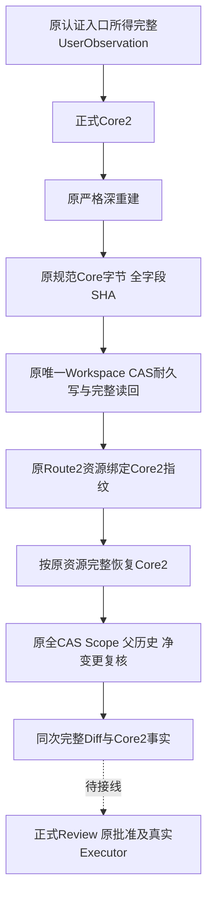
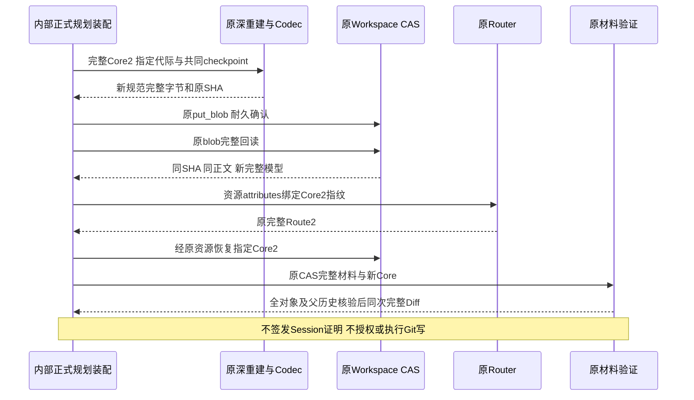
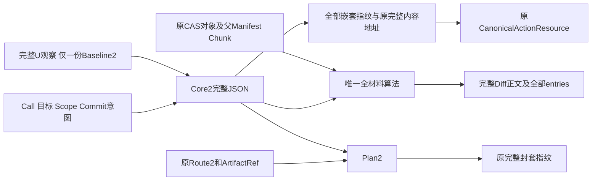

# 完整用户观察进入正式 Git Core2 与耐久恢复详细设计

## 1. 需求背景与设计目标

原用户观察已从实际认证Session和成功Patch链获得完整Source2/Baseline2、common/admin目录
身份、物理Index完整SHA/identity/size、配置值输出SHA及配方摘要。原Core1只有其中部分字段；
把新观察拆成旧基准或将配置值摘要写入旧配置名称字段，会使批准和恢复丢失执行相关事实。

目标是提供正式独立Core2/Plan2，让全部新观察进入原规范内容地址、原Router资源及原CAS，
在存读、Route恢复和材料复核后仍完整保留。旧记录不升级、不补签，不增加第二存储、SQL表
或认证用途；原512KiB、原对象/父历史限额和全部安全门禁保持。

### 1.1 当前与未完成范围

| 已实现的数据及IO能力 | 尚未完成的产品业务 |
|---|---|
| Core2/Plan2严格完整合同和显式新代际编解码 | 默认Git Planner/Executor与Tool注册 |
| 原唯一CAS规范存读及原Route完整资源恢复 | 默认Git Planner/Executor与业务交付；正式Review组件见新详设 |
| 原唯一完整材料算法返回同次完整Diff | ProductLink/NativeBridge与A/T2/D写闭包 |
| Core1/Plan1旧字节和Schema兼容 | 独立Commit、Backup2、三平台及商业验收 |

数据合同、内容地址、只读材料结果均不证明Session认证、当前Owner/Scope、批准或未来执行权。
生产调用方仍须原认证入口；本组件不重建、修复或签发缺失的历史授权。

## 2. 源码研究与架构决策

| 现有源码 | 实际复用 |
|---|---|
| [用户观察](../../src/harnessix/product_config/git_user_observation.py) | 原Session来源的完整数据，不等于执行许可 |
| [原合同](../../src/harnessix/product_config/git_delivery_plan_contracts.py) | 唯一跨字段、全字段fingerprint、原CanonicalActionResource算法 |
| [严格快照](../../src/harnessix/product_config/git_delivery_plan_snapshot.py) | 确切模型/容器递归重建，拒绝伪造、子类及额外字段 |
| [规范字节](../../src/harnessix/product_config/git_delivery_plan_wire.py) | 唯一UTF-8/duplicate拒绝/规范重编码/原512KiB算法 |
| [原CAS](../../src/harnessix/product_config/git_delivery_core_store.py) | put_blob/blob耐久确认、完整读回和固定错误 |
| [原材料](../../src/harnessix/product_config/git_delivery_plan_materials.py) | 全对象闭包、父历史、净Mutation、Diff和提交正文复核 |

关键决策：
1. Core2以`user_observation`唯一序列化基准、common/admin、Index、配置等全部事实。不同时
   保存旧baseline/common/index字段，不做字段偷换。四个只读property仅让唯一原算法消费原数据。
2. Core2/Plan2是独立确切模型而不是Core1子类，版本专属API只接纳指定代际；不存在自动
   升级或读到缺失字段后重捕获当前U的分支。
3. Core2自己的StoreID/KeyID必须与原观察一致；Thread、Call、Scope根、Diff、目标和Commit
   继续使用唯一原交叉字段算法。全部嵌套指纹保留，只有Core自身fingerprint从内容地址排除。
4. 共用原深重建、规范编码、CAS存读、Route交叉字段和材料算法。类型参数仅由模块内的
   显式Core1/Core2入口选择，不开放调用方解析器、验证器或编码器。
5. 材料算法返回原同次计算的完整GitTreeDiff，Review无需再实现Diff或虚构Workspace事务。
   `VerifiedProductGitDeliveryMaterials`是只读事实数据，不是可转授认证收据。

## 3. 总体架构、流程与时序



图中虚线是未实现的产品接线，不表示已产生批准或Git写效果。资源identifier沿原算法绑定
Store/Key/Delivery/Thread/Turn/Call；attributes绑定完整新Core的fingerprint，因此新观察变化
不能被解释成相同资源下的旧意图。



### 3.1 持久化与事务边界

时序中Router前的Core可能成为无授权CAS孤儿；CAS与Route不形成跨库原子事务。失败只能
对账已存在事实，不能自动补造Route或解释成业务成功。



配置值正文、Index正文和目录路径均不新增至Core2；原UserObservation仅保存对应摘要与
物理身份。Scope仍保留完整对象声明及hex字段，原CAS保留真实正文，不能用摘要列表代替材料。

## 4. 模块、类与接口设计

| 文件/重点符号 | 单一职责 |
|---|---|
| [新合同](../../src/harnessix/product_config/git_delivery_observed_contracts.py) `ProductGitDeliveryCoreV2/PlanV2` | 唯一完整用户观察及正式跨字段绑定 |
| 同文件`baseline/common_directory_path_sha256/common_directory_identity/index_file_observation` | 不序列化的原算法只读视图 |
| [新API](../../src/harnessix/product_config/git_delivery_observed_wire.py) | 显式新代际快照/encode/decode，无升级 |
| [CAS入口](../../src/harnessix/product_config/git_delivery_core_store.py) `persist_v2/load_v2` | 共享原耐久算法，返回完整新模型 |
| [Route恢复](../../src/harnessix/product_config/git_delivery_route_core.py) `load_product_git_delivery_route_core_v2` | 原严格Route资源唯一寻址及完整交叉核验 |
| [材料读取](../../src/harnessix/product_config/git_delivery_plan_materials.py) `read_product_git_delivery_core_materials_v2` | 返回原同次完整Core2与GitTreeDiff |

### 4.1 正式接口与原入口兼容

| 接口 | 输入与返回 | 调用约束 |
|---|---|---|
| `snapshot_product_git_delivery_core_v2(value, *, checkpoint)` | object → 确切Core2新快照 | 位于原snapshot模块，新wire模块重导出同一函数 |
| `snapshot_product_git_delivery_plan_v2(value, *, checkpoint)` | object → 确切Plan2新快照 | 递归重建所有模型和容器，不补全缺失字段 |
| `encode_product_git_delivery_core_v2(value, *, checkpoint)` | object → 完整规范bytes | 唯一原编码算法；排除自身FP，不排除嵌套FP |
| `decode_product_git_delivery_core_v2(body, *, checkpoint)` | object → Core2 | 确切bytes、重复键拒绝、规范重编码等值 |
| `encode/decode_product_git_delivery_plan_v2(...)` | Plan2 ↔ 完整规范bytes | 包含Core/Route/Artifact所有嵌套指纹 |
| `ProductGitDeliveryCoreStore.persist_v2(core, *, checkpoint)` | object → Core2 | 原CAS写入与完整回读确认；失败不返回部分计划 |
| `ProductGitDeliveryCoreStore.load_v2(fingerprint, *, checkpoint)` | object → Core2 | 固定SHA寻址，关闭重开及只读恢复不重新观察用户根 |
| `load_product_git_delivery_route_core_v2(core_store, route, *, checkpoint)` | 原Store入口与object → Core2 | 消费public load_v2结果，再深重建及交叉验证 |
| `verify_product_git_delivery_core_materials_v2(cas, value, *, checkpoint)` | 原GitMaterialCAS与object → Core2 | 完整材料与Diff验证，返回新快照 |
| `read_product_git_delivery_core_materials_v2(cas, value, *, checkpoint)` | 原GitMaterialCAS与object → VerifiedProductGitDeliveryMaterials | 复用同次算法结果，不二次重算Diff |

两代CAS共享同文件的`_persist/_load`模块函数，类仅负责原Store持有及四个显式代际入口。
这些模块函数不接受调用方可替换的codec。共享算法仍调用原public snapshot/encode/decode；
原Route仍调用public load，原材料仍调用public snapshot，不以私有直连绕过原可观测边界。
控制检查点首先保存调用方实际异常；若该异常自身就是`UpstreamCheckpointError`，亦必须
返回同一外层异常实例，不能把其`.error`当作原取消对象。原Store额外包一层时同样保留身份。

全部IO和验证API要求调用方共同`checkpoint: Callable[[],None]`；API返回完整模型或原同次
材料事实，不接受模型命令、用户Index目标、认证callback、Policy替代、批准或执行参数。

## 5. 数据结构与关键字段

| 字段/结构 | 解释及边界 |
|---|---|
| `spec_version` | Core/Plan独立v2；原v1不重解释 |
| `user_observation` | 完整原模型，包含Baseline2、所有Source2父引用、目录/Index/config/配方和嵌套FP |
| `store_id/key_id` | 必须匹配观察身份，数据外形不证明真实认证 |
| `delivery/thread/turn/call` | 原来源和Invocation交叉核验，归属与批准另由原Session边界验证 |
| `object_scope` | 原全部对象图/完整hex/父历史/指标/限制，不能变成摘要子集 |
| `anchor/worktree_intent` | 原A/D规范父目录、新UUID、基准OID与expected_missing |
| `diff_sha256/diff_bytes` | 原完整Diff UTF-8正文SHA/长度，不是Artifact JSONL SHA |
| `commit_spec` | 原提交parent/tree/author/message/time/ref与真实完整编码摘要 |
| `implementation_digest` | 原规划配方字段；观察配方另由内嵌完整观察绑定，不偷换 |
| `fingerprint` | 原canonical算法覆盖完整当前模型，Core自身FP除外；Plan所有嵌套FP均包含 |
| `VerifiedProductGitDeliveryMaterials` | frozen且正文不进repr；core与diff是本次验证事实而非信任能力 |

旧baseline/common/index不存在于Core2序列化字段。Core2规范正文只存一份Baseline2，避免重复
父引用及大小膨胀。原512KiB单记录上限独立于8MiB blob、32MiB捕获和Diff上限，不允许截断。

## 6. 核心逻辑伪代码

```text
显式Core2入口:
  原深重建每个实际模型/tuple/dict字段
  核对完整U观察和自身嵌套FP、Store/Key与全部原交叉字段
  原规范编码完整模型，仅排除Core自身FP，要求原SHA == Core2.fingerprint
  原CAS耐久写 → 完整回读 → 同字节/SHA → 指定Core2严格解码 → 新模型

显式原Route恢复:
  原Route2严格快照 → 要求唯一external/write资源及原稳定external identity
  原CAS按attributes指纹读取指定Core2
  全部原Invocation/Policy/Workspace/Effect/资源与完整Core2精确匹配
  返回完整新Core；不授归属或批准

完整材料:
  深重建Core2 → 原Scope全CAS验证 → 原完整Source2父Manifest/Chunk读取
  原两树闭包/全部净变更/完整Diff算法
  与原baseline成员、目标tree、Diff SHA/长度以及完整Commit正文交叉核对
  返回同次core与diff，不另建Diff算法或假Workspace事务
```

## 7. 失败语义、取消、超时、恢复与可观测性

共同检查点贯穿字段递归、JSON迭代、CAS存读、材料闭包与完整Diff。原上游控制异常身份
通过原载体保留，不把相同类型的普通IO/解析错误认成取消；不得重置操作期限、自动重试。

| 失败 | 结果与恢复要求 |
|---|---|
| 错代际/子类/extra/错容器/重复键/缺省补全/非规范字节 | 原`git_delivery_plan_invalid`，无部分计划 |
| 原Store类型或IO错误 | 原有限store/write/read分类，不公开路径和正文 |
| 原CAS确认或回读丢失 | 可能遗留无授权完整材料；重试必须沿原身份，不登记成功 |
| 用户观察或嵌套FP/Session IDs漂移 | 拒绝完整新合同，不改字段或降级 |
| 原Route资源/Invocation/Policy/Workspace不匹配 | 拒绝恢复，不重算旧意图 |
| CAS正文/对象闭包/父历史/Diff/提交不一致 | 原材料失败，不能只凭根OID继续 |
| 超过512KiB或原材料上限 | 原固定拒绝，不截断、不提高阈值 |

Store关闭重开或只读加载仍只消费原规范字节，不重新观察U补字段。没有新业务记录、MAC、
批准或Git效果日志；留存固定错误、完整验证结果、输入哈希与失败证据，不输出材料正文。

## 8. 安全、部署、兼容、风险与取舍

选择显式新代际而不是改写Core1，代价是产品接线需明确选择Core2；收益是旧字节和历史
不会被重新解释。选择CAS与Route分步耐久而不是新增跨库事务，代价是可能出现无授权孤儿；
收益是复用原存储与失败语义。孤儿清理仍属于原生命周期，不由此入口额外承担。

沿原Python包和Workspace CAS部署，无数据库迁移、新网络服务、Keychain访问或密钥加载。
旧Core1/Plan1字节、Schema和API保持；两代入口互相拒绝，不能从v1恢复新观察。

UserObservation三次交叉读取不是原子快照，H3期间及之后的HEAD/config独立变化仍可能
发生。Core2完整持久化该观察并不关闭此窗口，后续Executor必须用原生入口重新核验当前
源/HEAD/config/Index/Owner/Scope，并将陈旧计划按原语义拒绝。

实际Review producer、原Session唯一approval backref、默认Planner/Executor、完整Link/Bridge、
A/T2/D、Commit、Backup2、真实R3和三平台有限Beta均为后继必要项；本组件不代表商业1.0。

## 9. 完整测试与验收

新合同与IO覆盖checkpoint/commit、SHA1/SHA256、完整父历史/对象hex、唯一baseline序列化、
新字段改变时内容地址/资源/封套FP改变；伪造、子类、extra、错误类型、重复键、缺省补全、
非规范字节、嵌套指纹、身份漂移及容量边界必须拒绝。完整CAS材料与Diff必须原算法核验。

耐久写入、只读关闭重开、损坏及回读失败、原Route精确恢复、取消/期限原异常身份分别验证；
旧Core1/Plan1关联及全Schema兼容回归独立执行。纯声明合同fixture和真实CAS不是Session
认证、真正用户批准、默认产品执行或Windows原生证据，验收报告必须明确区分。

同候选wheel独立安装，实际导入、源码/候选/wheel/安装字节、原门禁、Schema、完整文档、
Ruff/Mypy/Secret扫描、渲染图像、失败与修复、Review Packet和manifest一并交付。

### 9.1 测试与源码对应

| 测试函数（同一新测试模块） | 检验对象与独立预期 |
|---|---|
| `test_first_real_cas_complete_observation_roundtrip` | SHA1/SHA256、checkpoint/commit；独立字段JSON规范bytes，不以受测codec自证 |
| `test_cas_route_materials_preserve_full_diff_once` | 原CAS→Route→完整材料；完整Diff只计算一次，读取不产生SQL或业务写 |
| `test_writer_closed_reopens_readonly_without_recovery_writes` | 原Store关闭重开、只读恢复，不补签历史或写记录 |
| `test_original_v1_bytes_and_frozen_baseline_schemas_are_unchanged` | 原代际规范bytes与冻结Schema摘要；两代入口互相拒绝 |
| `test_complete_observation_reseal_changes_full_core_and_envelope_fingerprints` | admin/config/Index/配方及其嵌套摘要进入Core和Plan完整指纹 |
| `test_any_missing_or_corrupt_complete_material_prevents_success` | 全对象、完整父Manifest/Chunk逐项缺失和损坏，不仅核对根OID |
| `test_exact_512k_canonical_body_is_accepted_but_one_more_byte_is_rejected` | 真实完整规范正文恰为上限及超出一字节，禁止降低负载或提高阈值 |
| `test_core_store_preserves_public_snapshot_codec_and_material_snapshot_hooks` | 两代共享实现仍经过原public边界，不使用私有旁路 |
| `test_route_consumes_public_load_result_and_rechecks_it` | public加载返回值被消费并深重验，损坏结果不被忽略或重读替换 |
| `test_caller_upstream_marker_inside_io_retains_same_outer_exception_object` | 两代persist/load、实际IO内检查点直接/包装抛出，原同一异常身份 |

[声明与原CAS支持代码](../../tests/support/git_delivery_observed_core.py)逐字段定义预期Core、
UserObservation及Plan，并独立规范编码。它不读取真实认证凭据、不调用模型、不创建批准；
Windows平台参数仅验证声明与路径规则，不能作为Windows原生执行验收。


## 10. 后续Review组件接线状态

[正式Git Review详细设计](m09-r4-git-review.md)复用本组件返回的同次完整Diff、原Core2存读与Route恢复，
不另算Diff或新建存储。原验证包仍是本组件历史范围，不被后续测试覆盖。默认Git业务写入与
Backup2、三平台及商业验收继续开放。
