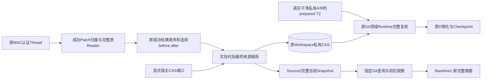
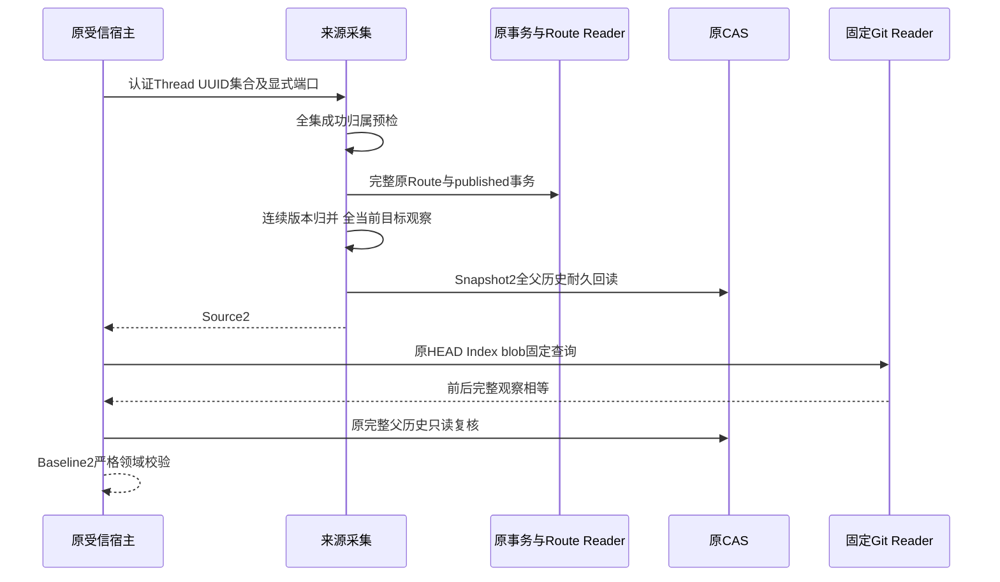

# Git完整父历史消费者：总体与详细设计

## 1. 需求背景与设计目标

默认Patch／Rollback已使用Snapshot2、事务领域2、Execution3和Route2。
Git来源、基准和原领域`plan_worktree`仍按Snapshot1捕获／复核：深父链在来源阶段重新扩张成逐项资源，
或新事务进入旧验证器而拒绝。该断点会使已经成功的正式修改无法进入后继Git交付，不能仅测试Snapshot2独立API。

本增量保持全部父目录历史，贯通原认证来源归属、连续修改链、当前最终文件观察、固定HEAD／Index基准、
真实私有A中的prepared T2与原D物化／Checkpoint。T不向A发布，U／A保持原状态；独立Commit仍要求新批准。
本增量不是默认认证GitBridge、业务Backup2或商用发布完成。

## 2. 架构决策、约束、取舍与风险

- 独立`ProductGitDeliverySourceV2`和`ProductGitDeliveryBaselineV2`，旧类、Schema、摘要域和无端口旧入口原字节保持。
  新source仅接受Snapshot2，新baseline仅接受Source2；禁止把新子对象按旧类型序列化截断父引用。
- 来源代际由实际已认证事务决定；混合旧／新事务时只要存在领域2，就使用新完整捕获，不把新事务降级为Source1。
- 新捕获需要耐久父历史，因此由宿主**显式**提供`WorkspaceSnapshotPorts`，复用原唯一Workspace CAS。
  Source2只允许追加原不可变CAS材料，不新增业务SQL记录、不写用户Workspace／Index／Ref。
  只读Transaction Store不能偷开写连接；没有新端口时固定拒绝，不隐式从Router取写能力或退回旧表示。
- 全部选中UUID先通过原Thread成功归属检查，再读Route／事务／CAS；不能因为来源采集而扩大访问权。
- Snapshot2捕获与最终复核共享原checkpoint；正文块读取也传入相同父检查。
  Baseline沿用整个60秒操作期限、原固定命令、受控Git Reader及原输出保护；不增加期限。
- 领域Git复核读取原Workspace Store完整父引用，根／HEAD／clean／commonDir／注册／backlink／Lease仍独立核验。
  新helper进入原Git实现摘要；Native18目录仅刷新git.py四个字节叶，不扩大为传递供应链清单。
- 不增建CAS、Worktree平台、调度器或HTTP服务；不把材料SHA称为来源MAC或新人工批准。

## 3. 总体架构与数据流程



**图示说明：** Source／Baseline不创建Git业务记录或交付工作树；CAS仅承载原完整父历史。
图中的A／T／D属于独立领域集成验收，不表示产品Bridge已装配。源身份与写批准仍需后继MAC桥接阶段。

## 4. 领域契约、数据结构与接口设计

| 源码／合同 | 职责和字段 | 关键校验 |
|---|---|---|
| [`git_parent_contracts.py`](../../src/harnessix/product_config/git_parent_contracts.py) | SourceV2覆写spec与workspace；BaselineV2覆写spec与source。 | 原UUID唯一、路径排序、镜像限额、after匹配、完整摘要和基准成员校验继承。 |
| [`git_delivery_source.py`](../../src/harnessix/product_config/git_delivery_source.py) | 原归属预检、版本连续归并、全部当前目标观察；新增显式snapshot_ports参数。 | 保留净零路径观察；只有最终Mutation省略净零，不能先省略读取或父历史。 |
| [`git_baseline.py`](../../src/harnessix/product_config/git_baseline.py) | 同端口采集Source，原GitReadRuntime固定查询，最终根据实际Snapshot代际复核。 | 首before必须与HEAD blob／模式一致，选中Index不得包含暂存差异或特殊flags。 |
| [`snapshot_v2.py`](../../src/harnessix/workspace/snapshot_v2.py) | 全父字典、Manifest／Chunk耐久确认及只读Native再验证。 | 共享原32MiB、8MiB和256显式资源；根和作用域、精确父集合全部验真。 |
| [`git.py`](../../src/harnessix/delivery/git.py) | 真实T source代际复核后保存原Worktree计划。 | 来源Root、目标Root、批准和Lease不能互换，缺／错历史在新记录之前拒绝。 |

### 4.1 重点字段与摘要边界

| 字段 | 业务含义与安全边界 |
|---|---|
| `thread_id`／`patches` | 原认证会话与持久成功顺序，包含Turn、Call、事务UUID和Route／事务两个指纹；不能替代原MAC Reader。 |
| `workspace.resources` | 本次当前观察的全部路径与cwd；净零路径仍参与完整观察，只能在净Mutation中省略。 |
| `workspace.parent_closure` | 原Manifest摘要、正文长度、完整目标集合摘要和父数量；所有Chunk由完整Reader核对，不能只校验Manifest字段。 |
| `mutations.before`／`after` | 首次修改前与最终修改后存在性、SHA、大小、模式；所有中间衔接必须相等，正文不放入公开Source。 |
| `source.digest` | 新spec、全部Patch引用、实际Snapshot2与净Mutation的规范摘要；不是授权票据。 |
| `head_oid`／`head_tree_oid`／`head_ref` | 固定Commit及其Tree、当前本地Ref；允许原SHA-1／SHA-256格式，不允许任意Ref字符串。 |
| `members` | 每个净Mutation首before在固定Tree中的原Blob OID／普通文件mode；创建项不得伪造空Blob。 |
| `index_observation_sha256`／`index_observation_bytes` | 完整原Index逻辑输出摘要和长度；原8MiB上限及逐目标stage／flags检查不变。 |
| `status_sha256`／`config_names_sha256`／`reader_binding` | 全状态与配置键名摘要、原固定Reader绑定；前后观察必须相等，不收集配置值。 |
| `baseline.digest` | 覆盖完整Source2及全部Git观察；任何父引用或成员变化都会改变新摘要。 |

### 4.2 接口与兼容策略

接口增量：

```text
collect_git_delivery_source(thread, targets, router, transactions,
                            checkpoint=original_control, snapshot_ports=None)
collect_product_git_baseline(thread, targets, router, transactions, reader,
                            cancel=original_token, snapshot_ports=None)
```

`snapshot_ports`是宿主Callable对象，不进入公开JSON，不包含执行批准、Root重绑或业务SQL写权限。
新返回值摘要包含新spec、实际Snapshot2和完整引用；旧格式不能成为新来源的替代证明。

## 5. 时序与核心逻辑



```text
source_collect:
  验证所有目标属于本Thread成功结果 → 原完整Reader逐件验真
  以真实成功结果顺序合并首before／末after，并检查每个中间衔接
  判定实际代际；新代际缺显式CAS端口立即拒绝
  原根身份复核 → 当前全路径捕获 → 原正文模式／大小／摘要比较
  新代际全父历史Native再验证 → 原规范Mutation与完整新领域摘要
baseline_collect:
  相同来源及原60秒控制 → 原Git Reader绑定与根
  固定HEAD、Tree、Index、status、config前后观察
  每个首before核对原blob和模式 → 来源完整原生复核 → 新严格Baseline
```

## 6. 错误、恢复、安全与兼容

未授权来源在任何新CAS写入之前拒绝；端口缺失返回`workspace_closure_unavailable`。
父对象／模式／成员、叶正文、根身份变化拒绝，不重新捕获替代旧历史并声称一致。
上游取消、超时或自定义控制异常保留；耐久确认丢失不返回正式Source／Baseline。
新CAS正文但最终来源失败的孤立材料可以存在，不记业务成功，不触发重试执行；其内容仍受原CAS限额及权限保护。
原只读Store继续拒绝`put_blob`，原Transaction／Route历史字节不迁移、不补签。
旧v1纯只读调用不要求新端口；新代际不能通过省略参数取得旧结果。

Git领域继续只观察恢复，不自动重放UNKNOWN；T2始终prepared，D实际效果由原Worktree／Checkpoint记录。
新包升级需整体替换消费者；旧程序不支持新source／baseline标签时明确拒绝，不能当v1解析。
全部既有269件Schema原字节不变，新两件单独导出。

## 7. 完整测试与验收方法

真实默认认证SDK16个深链叶／401父观察：原批准Patch、来源2、固定基准2、重启后原Thread及完整历史、
不新增模型调用、用户文件／Index／HEAD不变、无新事务／Route业务写；CAS追加必须显式。
负对照覆盖缺端口、只读Store写拒绝、历史缺块／错SHA、父成员／mode／identity变化、正文漂移、
中间链断裂、净零观察、错误Thread／Fork、上游取消／期限、原v1对照和未知代际。
领域独立验证真实私有A、prepared T2、原D物化及Checkpoint、原Lease和Root／HEAD／注册保护。
组合套件与全量结果分开记录，只有实际同候选同环境证据可以支持对应结论。


## 8. 默认宿主装配与源码阅读顺序

1. [默认Action Runtime](../../src/harnessix/product_config/action_runtime.py)持有唯一Workspace Store，
   通过[SnapshotPorts](../../src/harnessix/workspace/snapshot_ports.py)向Router共享原CAS；没有新存储平台。
2. [成功来源Reader](../../src/harnessix/product_config/workspace_patch_source.py)核对原Thread、Call、Result、
   Route和published事务，实际Record2由[完整事务Codec](../../src/harnessix/delivery/workspace_record_codec.py)恢复。
3. [来源采集](../../src/harnessix/product_config/git_delivery_source.py)先做全量归属再派生当前Source；
   `_observe_final_versions`保存全部路径，包括最终净零路径；`_verify_final_snapshot`在正文观察后复核。
4. [基准采集](../../src/harnessix/product_config/git_baseline.py)复用同一调用方checkpoint。
   `_Queries`保持固定内部命令；`_member`核对首before与原Tree／Index／Blob，`_observe`前后相等。
5. [Git Snapshot分派](../../src/harnessix/delivery/git_workspace_snapshot.py)只在领域Runtime
   `plan_worktree`中根据实际快照复核；[原Git Runtime](../../src/harnessix/delivery/git.py)继续保存和执行原计划。

Source2／Baseline2自身返回值不是新持久业务记录，不能因CAS已有材料而追认交付成功。
正式认证Bridge仍需要原MAC、Owner、Scope、源身份、新Diff、独立批准以及跨Store备份闭合；
它们不由本次宿主端口参数替代。安装升级不得仅替换Schema而继续使用旧消费者。

## 9. 可观测性、部署与失败恢复

公开错误只包含原稳定错误码与固定消息，禁止附带文件正文、CAS内容、Git输出或宿主路径。
测试证据分别绑定SDK归属、完整Snapshot、真实Git效果、原账本状态和安装包输入，不能仅统计单元测试数。
取消／超时后不生成成功Source，追加但未引用的CAS材料不进入交易状态；恢复仍由原正式状态Reader判断。
没有外部DB、进程服务或配置迁移；新增模型和两件Schema必须与消费者同一Wheel部署。
现有事务事件、旧领域JSON、269件旧Schema及Native18其余17件输入保持原字节，旧Reader不接受新标签。


## 10. 历史Reader的单次控制传递

来源收集不仅执行当前Native读取，还先读取Route和Transaction的Manifest／Chunk。
[原审计Store](../../src/harnessix/trusted_actions/store.py)的`load`、
[原Router](../../src/harnessix/trusted_actions/router.py)的`status`、
[原Workspace Store](../../src/harnessix/delivery/store.py)的`load/decode_payload`、
[原Patch Planner](../../src/harnessix/delivery/trusted_action.py)的`load`和
[归属Reader](../../src/harnessix/product_config/workspace_patch_source.py)沿同一调用链新增可选`checkpoint`。
Source／Baseline把原单次控制显式传递到**每一块**历史读取；Store原constructor控制同时保留，
不暂时替换共享实例的属性，不另开连接，不隐式重启60秒期限。

```text
Source._owned_selection
  → load_owned_workspace_patch(checkpoint)
  → Router.status(checkpoint) → Audit.load(checkpoint) → 原Manifest及各Chunk
  → Planner.load(checkpoint) → WorkspaceStore.load(checkpoint) → 原Plan及完整父历史
```

调用方控制异常使用原`UpstreamCheckpointError`跨越内部坏数据分类，最后恢复原异常对象；
即使KernelError码与归属／历史损坏码相同，也不能被改写成业务拒绝。真损坏仍保留原Store错误类别。
取消发生在历史首块读取后时，下一块不得继续；取消时不得新增CAS材料或Git记录。
无参数旧调用保持原默认Reader行为，单次检查点不进入记录JSON、Schema或批准摘要。
该调整仅增强单次读取失败控制，不改变认证、授权、Root、Owner或Lease规则。


## 11. 当前验证状态

[专项验收](../validation/git-parent-consumers-2026-10-07-v1/README.md)绑定实际源码输入、
最终Wheel、独立评审及全部FAIL／中止历史。最终源码外关联590项和治理1413项各自通过；
原255叶发布／独立回滚／全部事件重开完整用例仍保留并通过，没有删减或改变原租约。
该验证只支持本文组件边界；认证GitBridge、Backup2、Windows消费者、真实R3及商用门禁未关闭。
