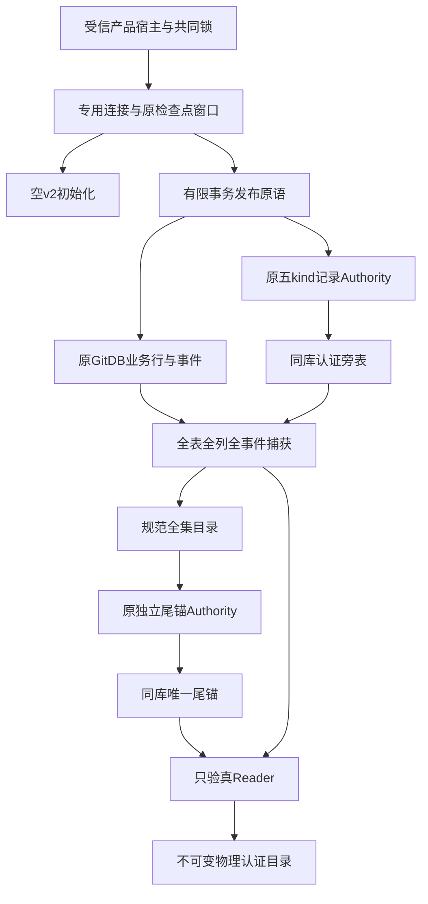
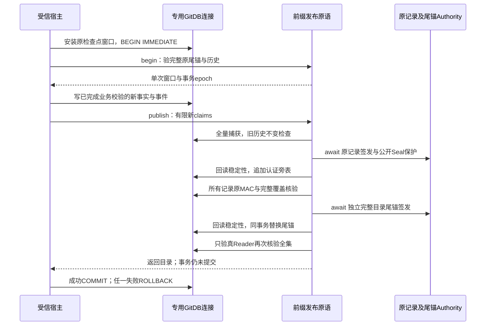

# GitDB v2 全前缀认证账本：总体与详细设计

## 1. 需求背景、设计目标与实际范围

Git领域v1持久化Worktree、Checkpoint和Commit，但普通摘要不能证明记录来源，
只认证某条记录也无法发现整条尾事件或整个实体被删除。
原Key托管层已经提供五种记录的MAC及独立目录尾锚，但尚未持久关联全表与全事件。
本增量实现空v2结构初始化、空genesis认证、有限新增事实的同事务认证发布，
以及认证后全表、全实体、全事件的只读复核。

**这是产品层的物理账本原语，不是默认GitBridge，也不是业务Backup2。**
Writer不解释尚未实现的完整ProductGitDeliveryLink、Diff、审批、A/T/D桥接或对象图。
其新事实必须由后继受信产品业务Writer完成领域校验后提交；本原语不能代替该校验。
当前明确拒绝新增`git_native_bridge_index`，没有对模型公开的工具、通用签名器或SQL API。
原Git领域默认v1读写与原产品装配均不改变。

| 目标 | 实现责任 | 不能推出的结论 |
|---|---|---|
| 不追认旧未认证历史 | 空结构初始化、空genesis检查 | 旧Git库已安全迁移 |
| 业务行、事件、Seal、尾锚同事务 | 既有事务中的有限发布原语 | 跨Session/Audit/Git全局事务 |
| 删尾、删实体、孤儿和投影偏移可检出 | 独立MAC目录与全部表/事件 | 物理状态目录从未合法回滚 |
| 合作取消覆盖SQL与字节循环 | 宿主专用连接窗口、原检查点 | 已完成外部Git进程取消/恢复 |
| 旧源码与结构契约不变 | 原v1 API及唯一v2 DDL复用 | 三平台商用门禁已完成 |

## 2. 源码研究、方案取舍与模块边界

| 源码 | 关键接口 | 设计理由 |
|---|---|---|
| [`git_store_genesis.py`](../../src/harnessix/delivery/git_store_genesis.py) | `initialize_git_store_v2` | 原领域结构复用；只创建空结构、不持Key |
| [`git_store_schema_v2.py`](../../src/harnessix/delivery/git_store_schema_v2.py) | `verify_git_store_v2_schema` | 唯一13表DDL，不复制另一套建表规则 |
| [`git_prefix_catalog.py`](../../src/harnessix/product_config/git_prefix_catalog.py) | `GitPrefixCatalog` | 固定全集、规范编码与明确合同 |
| [`git_prefix_rows.py`](../../src/harnessix/product_config/git_prefix_rows.py) | `capture_git_prefix_rows` | 不解析未认证正文，全部列与有界捕获 |
| [`git_prefix_records.py`](../../src/harnessix/product_config/git_prefix_records.py) | `verify_record_streams` | 固定五kind、逐条认证、完整连续覆盖 |
| [`git_prefix_reader.py`](../../src/harnessix/product_config/git_prefix_reader.py) | `read_git_prefix_catalog` | 原Verifier只验真，不修复、不签发 |
| [`git_prefix_writer.py`](../../src/harnessix/product_config/git_prefix_writer.py) | `begin_git_prefix_write`、`publish_git_prefix_changes` | 业务修改前冻结原已认证前缀，修改后只签新增事实 |
| [`git_prefix_sql.py`](../../src/harnessix/product_config/git_prefix_sql.py) | `git_prefix_sql_window` | 显式独占专用连接回调，SQL中断传播原异常 |
| [`store_publication.py`](../../src/harnessix/session/store_publication.py) | `GitPublicationAuthority/Verifier` | 原Store/Key生命周期、记录域与完整正文MAC |
| [`git_prefix_publication.py`](../../src/harnessix/session/git_prefix_publication.py) | `GitStorePrefixAuthority/Verifier` | 同Key独立尾锚域，不复制密钥 |

认证适配放在`product_config`，避免新增`delivery → session`领域依赖。
领域层只提供结构初始化；Key与业务装配仍由产品宿主持有。
没有独立HTTP/Worker、队列、中间件、后台写任务或额外业务数据库。

## 3. 总体架构与数据流



原始payload只进入私有SQLite、哈希和原MAC端口，不进入公开保护层。
公开保护层仅处理原低敏Seal声明，不能把私有目录正文当公开输出。
全表摘要保留所有冗余列、TEXT/BLOB类型及行边界；单记录MAC保留原正文原字节。
两者用途互补：记录MAC验来源，独立尾锚验全集覆盖。

## 4. 核心流程与执行时序



Authority签发包含`await`，因此签发后必须再次读取原事务epoch、完整物理行和旧尾锚。
在公开保护回调或同连接其他任务改变数据库时，拒绝候选而不是覆盖变化。
`BEGIN/COMMIT/ROLLBACK/SAVEPOINT/RELEASE`边界会使旧窗口失效；控制代际不是持久Owner或Lease。

## 5. 重点类与数据结构

### 5.1 `GitPrefixCatalog`

| 字段 | 含义 |
|---|---|
| `spec_version/schema_version` | 明确目录v1、物理GitDB v2；与旧领域payload v1不混同 |
| `store_id/key_id` | 原Authority/Verifier逻辑身份；不来自模型 |
| `genesis_epoch` | 空账本首次认证生成的新UUID，后继不可变 |
| `revision` | 完整认证事件总数；空genesis为0，不是批次数 |
| `tables` | 固定12张非尾锚表各自的完整行数及分帧字节SHA；尾锚不自引用 |
| `streams` | 按kind/实体排序，唯一epoch、首claims、事件总数、末正文SHA及末前缀 |

完整物理库共13表：上述12表加`git_prefix_anchor`。
`git_delivery_metadata`只接受`schema_version=2`单行；未知元数据不追认。
每个实体只能有一个publication epoch；初始领域事件序号0对应认证序号1。
当前投影的序号、phase/state及payload必须等于该实体最后完整事件。

### 5.2 `GitPrefixWriteWindow`

字段包含原专用连接、已认证目录、原完整私有行、原尾锚、事务控制对象/epoch、实例weakref见证和使用标记。
原SQL控制实例另以弱引用登记begin实际签发的窗口；自造自引用不能证明来源。
普通复制/重新构造没有原登记，跨事务/跨SQL控制窗口不能使用，发布窗口只消费一次。
它不持Key，不提供SQL能力，不是产品审批Receipt，不能充当Root/Owner/Scope/Lease。

### 5.3 全表行编码

每个值编码为`[type-tag,value]`；TEXT保留原字符，BLOB编码hex，整数与NULL各有固定标签。
每行加入8字节大端编码长度后再更新SHA256；按原唯一主键排序，不按私有payload排序。
因此空字符串、空BLOB、NULL、不同整数和不同行拼接不能混淆。
目录自身使用唯一UTF-8规范JSON；MAC后解析并回编码比较，拒绝重复键、空白别名及额外字段。

## 6. 接口设计与调用约束

| 接口 | 前置条件 | 结果与失败边界 |
|---|---|---|
| `initialize_git_store_v2(db)` | 调用者已有事务、真实可写、空新库或精确空v1 | 建结构、更新版本；不签genesis、不commit |
| `initialize_git_prefix_genesis(...)` | SQL窗口、精确v2、原Authority/Scope | 空库签genesis；已有认证库仅只验真；非空无锚拒绝 |
| `begin_git_prefix_write(...)` | SQL窗口、调用者事务、已有完整认证前缀 | 冻结单次窗口；不写记录 |
| `publish_git_prefix_changes(...)` | 同窗口、有限新claims、已业务校验的新事实 | 原事件/投影/Seal/尾锚同事务；不commit |
| `read_git_prefix_catalog(...)` | SQL窗口、稳定只读事务、原Verifier | 不可变认证目录；不补签、修复或读取模型Secret |

宿主须为SQL窗口使用**没有其他进度/trace回调的专用连接**，不复用共享Session连接。
共同Owner/Scope/Fence与绝对期限由原宿主合成同一个检查点；本原语不创建新超时或锁。
显式窗口负责释放自身回调，不声称可以恢复未知的外部回调。
调用者任何失败都必须回滚；即使只签发内存候选，或已追加旁表但尚未更新尾锚，也不能commit半成品。

## 7. 核心算法伪代码

### 7.1 创世与有限发布

```text
初始化结构：
  确认调用者已有事务；精确核验结构与版本
  空库逐句复用原DDL，不使用会隐式提交的executescript
  原v1任何业务行存在 → 拒绝；未知/部分结构 → 拒绝
  更新为v2，但不自行提交

发布：
  begin先验独立尾锚MAC，再验完整原事件与所有表
  宿主写新业务事实；冻结完整候选
  旧事件、旧Seal、旧身份/计划列不得改变
  本实体没有新事件时，其当前投影必须逐列不变
  新claims必须恰好覆盖全部新增事件；不多、不漏、不重复
  原Authority签各完整正文；await后检查候选没有变化
  同事务追加Seal；逐条MAC、前序、全集与投影再验
  签规范目录尾锚；await后再查完整候选、epoch与旧锚
  更新尾锚；只验真Reader复核；返回但不commit
```

### 7.2 只读完整验证

```text
精确schema核验 → 原尾锚MAC与完整正文SHA → 规范目录解析
核对原Store/Key/genesis/revision
捕获固定全部表、全部列、全部行
每kind实体逐事件核验原MAC/身份/唯一epoch/连续序号/前序prefix
核对全部物理事件均恰好有证明，无孤儿、无未认证事件
核对当前投影 = 最后事件（序号、state/phase、原payload）
完整表摘要及规范目录逐字节等于已认证目录 → 返回
```

认证记录原语不解析ProductLink业务语义，也不核验CAS对象图或跨Store调用归属。
后继业务快照须在该物理证明上继续运行正式模型、状态转移和跨库引用核验。

## 8. 持久化、失败语义与恢复

| 场景 | 行为 |
|---|---|
| 精确空v1 | 显式初始化v2并签空genesis，调用者提交 |
| 非空v1或非空无锚v2 | `git_delivery_store_legacy_unproven`；不迁移、不重签 |
| 未开事务/未装配SQL窗口 | 固定拒绝；不隐式BEGIN |
| 历史MAC、尾锚、前缀、当前投影不符 | `publication_history_unproven`；不修复、不签发 |
| 公开保护失败/取消/期限/Key关闭 | 保留原错误；调用者回滚整个事务 |
| 同连接在await改变事实或事务边界 | 拒绝候选；不覆盖新变化 |
| 新桥接索引 | `git_native_bridge_unavailable`；正式Bridge Writer尚未接入 |
| 尾事件及当前投影一起被删 | 原单记录Seal仍可能合法，全集目录/尾锚必须拒绝 |
| 业务写后、Seal写后或尾锚替换后未commit退出 | SQLite恢复上一次已提交前缀 |

合法旧完整备份仍可能拥有合法旧MAC；该原语不证明整库从未回滚。
回退许可、跨库共同快照与新物理根重绑继续由正式Restore/Backup2设计处理。

## 9. 安全、容量、取消与可观测性

1. 原有限五kind不新增用途；不导出Key，不调用Keychain或模型API。
2. 精确schema核验先于表查询，防止同名VIEW或触发器在拒绝前执行。
   可写入口在真实元数据表做零行UPDATE，URI `mode=ro`不能因`query_only=0`被误判为可写。
3. 单字段512KiB、完整捕获32MiB、每表100000行与原完整目录64MiB上限不提高。
   SQLite用`CASE`在驱动传出前拒绝超限TEXT/BLOB；游标累计总量，拒绝后不返回部分目录。
4. SQL进度回调每1000步调用原检查点；异常原对象在宿主层传播，不用驱动`interrupted`文本代替。
5. 专用连接事务trace只识别边界关键字，不保存SQL、payload、作者、消息、路径或对象正文。
6. 所有失败均无自动重试、无后台续写、无外部Git修复。
7. 可观测性输出限于固定错误类别、次数、版本、测试结论及摘要；物理证明不标记为业务成功。

## 10. 测试矩阵与验收口径

测试分别覆盖结构初始化、真实SQLite提交/关闭/只读重开、五kind、连续事件、删尾/删实体、
冗余列漂移、唯一epoch、Scope/Key/Store错配、复制窗口、跨事务窗口、保护期间变化、
调用者回滚、取消/SQL中断、单字段边界及32MiB总量。
合成ProductLink正文用于**物理字节认证**测试，不声称真实产品模型或独立审批已经实现。
最终结果与保留的原失败见[本增量验收证据](../validation/git-prefix-ledger-2026-10-07-v1/README.md)。

## 11. 部署、兼容及后继接线

本增量随原Wheel分发，没有新用户配置或默认工具入口。
旧Git领域API仍只接旧v1；v2由产品专用适配端显式初始化，不让旧Store静默升代。
三平台原生句柄、程序身份、进程树回收、安装升级恢复及Beta不由SQLite单测替代。

下一接线必须实现完整ProductPlan/ProductLink模型及状态机、受批准A创建、prepared T2、
原D物化和独立Commit，并将事实提交到本账本；新增桥接索引须与认证产品事件同阶段写入。
随后实现CAS目录业务语义、跨Store同锁窗口、Backup2与恢复验真。
R1—R6、R3真实编码质量及商用1.0仍开放，不减少既定产品功能或扩大容量/期限。
