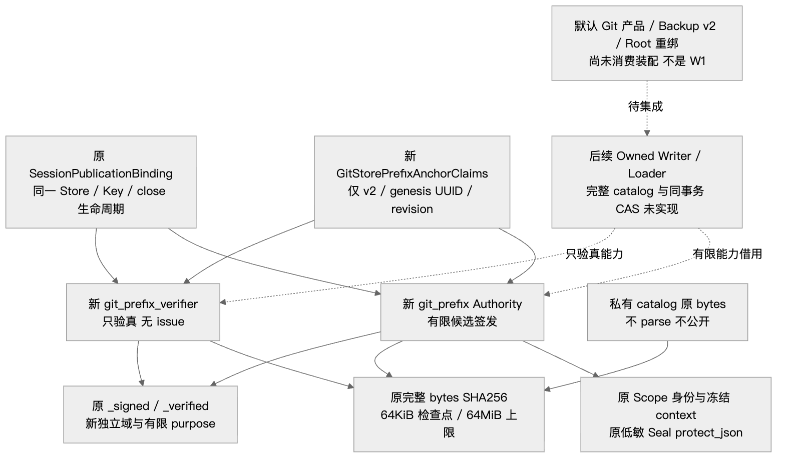
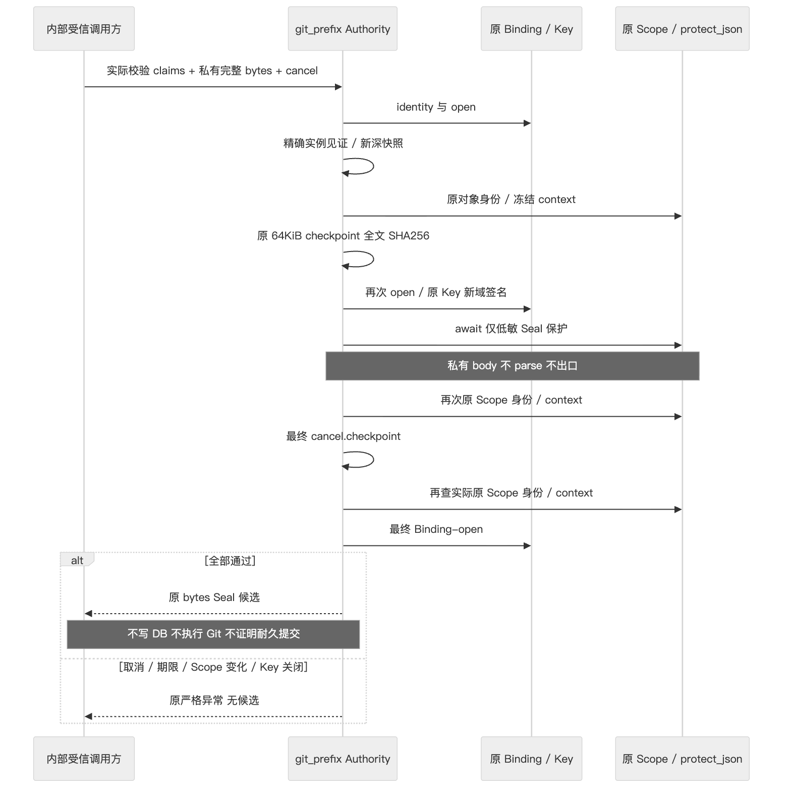
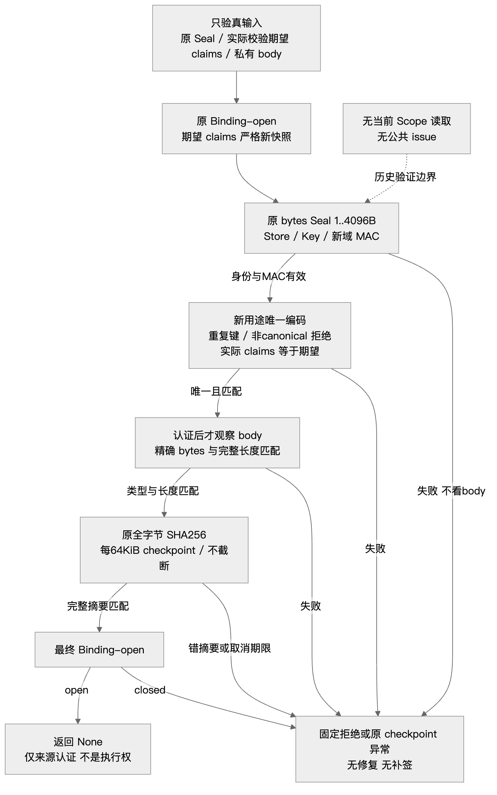
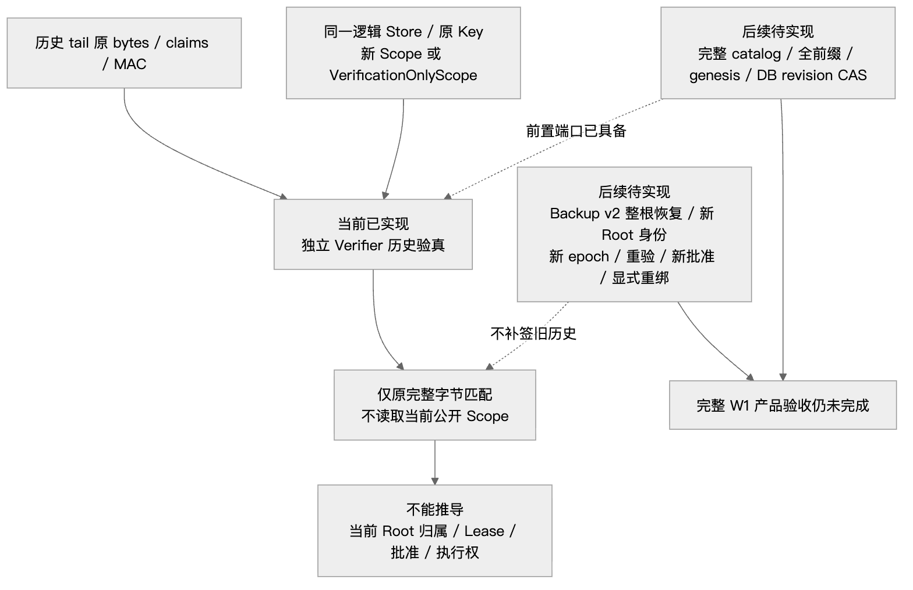

# Git 独立全前缀尾锚认证端口：总体与详细设计

## 1. 需求背景、当前状态与交付边界

原 Session Binding 已有事件、投影、Artifact 和有限 Git 记录认证。单条记录的 MAC 或普通链摘要不能证明 GitDB 的完整实体覆盖、没有漏行，以及目录与业务关联相符。完整 Git 产品闭包需要一项独立用途的认证尾锚，而不能把 catalog 伪装为原五种 Git 记录中的一种。

本变更交付 **独立尾锚的严格声明、候选签发和只验真端口**。复用原逻辑 Store/Key、原 Scope、原签名函数及关闭生命周期；私有 catalog 只按完整原字节哈希。默认产品没有 Writer/Reader、GitDB v2、revision CAS、全前缀 catalog、Backup v2 或恢复重绑的消费接线。本端口是其必需前置，**不是完整 W1、全前缀证明、当前 Root 归属或执行授权**。

元数据提交是输入基线，实际部署应核对源文件及发行物身份。候选源码和实际结果由[验证报告](../validation/git-prefix-publication-2026-10-02-v1/REPORT.md)、[源码与输入摘要](../validation/git-prefix-publication-2026-10-02-v1/SUMMARY.json)及包清单分别固定。完整业务目标沿用[Git 产品与备份闭包设计](m09-r4-git-delivery-business-backup-closure.md)；本变更不改写该设计的待实现状态。

## 2. 设计目标、非目标与安全不变量

| 不变量 | 实际约束 |
|---|---|
| 有限合同 | claims 仅三个显式字段，用途只有 `git_store_prefix_anchor` |
| 原身份复用 | 新端口引用同一 Binding，不另建 Key、Store、ledger 或权限目录 |
| 严格来源 | 边界只接纳真实校验过的精确 claims 实例；不追认 construct/copy/子类/额外字段 |
| 新域隔离 | 新 HMAC 域含末尾 NUL；旧 Session/Artifact/Git/Event 域不能混用 |
| 先认证后观察 | 验真先校验 Store/Key/MAC、唯一编码和 claims，再观察正文长度与完整哈希 |
| 私有正文不出口 | 不解码、parse、截断或传入 `protect_json`，只保护低敏 Seal |
| 原保护与生命周期 | 原 Scope 对象身份及冻结上下文必须相同；保护后检查 Scope/取消，再查实际 Scope，最后检查 Binding-open |
| 历史验证独立 | Verifier 不读取当前 Scope、不提供公共 issue，不补签历史 |
| 原格式不变 | 不增加旧五 kind，不改旧 Seal、HMAC 域或历史可接受编码 |

不增加数据库/DDL、迁移、Tool、默认动作、任意 JSON 签发平台、Key 文件、执行接口或预算；不在此端口校验 catalog JSON schema、canonical body、完整行集、CAS/OID、原批准或 Root。精确字节 MAC 认证可信 Writer 交付的候选；这些业务语义必须由后续 Owned Writer/Loader 在原 Owner 下验证，不能由调用者提供摘要替代。

## 3. 总体架构、模块边界与源码映射



| 模块/入口 | 职责与复用 |
|---|---|
| [git_prefix_contracts.py](../../src/harnessix/session/git_prefix_contracts.py) | 严格有限 claims、实际校验实例见证与新快照；不依赖 DB/Git/Provider |
| [store_publication.py](../../src/harnessix/session/store_publication.py) | 增加 `GitStorePrefixAnchorSeal` 和 Binding 的两个能力对象；原编码、Key、Scope、hash、关闭代码不改 |
| [git_prefix_publication.py](../../src/harnessix/session/git_prefix_publication.py) | 独立域的签发和只验真；引用原 `_signed`、`_verified`、`_git_body_digest` 与 Artifact scope 校验 |
| [publication_seal.py](../../src/harnessix/session/publication_seal.py) | 原 `original_artifact_scope_digest` 校验原 Scope 身份和冻结 context；不修改 |
| [publication.py](../../src/harnessix/agent/publication.py) | 原 `protect_json` 只处理低敏 Seal；沿用原取消/保护期限与错误分类 |
| 后续 Owned Writer/Loader/Backup | 尚未实现；负责 canonical 完整 catalog、全集覆盖、事务、只读装载与恢复门禁 |

`SessionPublicationBinding.__init__` 局部导入新能力类，避免 `Seal → Authority → Binding` 顶层循环。Verifier/Authority 只保留 Binding 引用，不复制密钥；Binding 原 `close()` 清零其 Key 并同时撤销新旧端口。Python 私有属性与验证见证是宿主合同，不构成抵御恶意同进程反射或同用户控制的隔离机制。

## 4. 数据结构与领域契约：完整字段及编码

### 4.1 `GitStorePrefixAnchorClaims`

| 字段 | 类型/范围 | 含义 |
|---|---|---|
| `schema_version` | 显式 `Literal["2"]`，没有默认值 | Git 产品目录 v2；不是 Seal 协议版本 |
| `store_genesis_epoch` | Python 精确 `UUID` | 原逻辑 Store 的 Git 初始化 epoch；不是单动作 publication epoch |
| `revision` | Python 精确 `int`，`0..9223372036854775807` | 候选尾锚版本，允许 genesis 0；端口不检查单调性或 CAS |

模型 `strict=True/frozen=True/extra="forbid"/revalidate_instances="always"`。Python 输入只允许原生 dict 和精确标量，拒绝 bool、字符串 UUID、int/str/UUID 子类及隐式转换；正式 JSON 校验允许标准 UUID 文本解码。未知/缺字段拒绝。

正式 after-validator 建立指向自身的 weakref 和三个原标量见证。`model_construct()` 无见证；正常字段的浅/深 `model_copy()` 仍指向原实例；两者都不能直接进入端口。边界同时核对精确模型类、完整字段集合、无 extra、见证自身身份以及字段未被篡改，再以原生标量构建新的实际校验实例。三个字段都是不可变标量，该新实例即深快照；等待保护期间原对象变化不能修改候选。见证不序列化、不进入 MAC、不成为持久身份；模型相等性仅比较合同字段。

### 4.2 `GitStorePrefixAnchorSeal`

固定编码顺序为以下表格顺序，`claims` 内顺序为上一表格顺序。

| 字段 | 合同 | 来源 |
|---|---|---|
| `version` | 严格整数 `1` | 原 `_Identity` |
| `purpose` | `"git_store_prefix_anchor"` | 新有限用途 |
| `store_id` | UUID | 原 Binding 逻辑 Store |
| `key_id` | UUID | 原 Binding Key 身份 |
| `tag` | 64 位小写十六进制摘要 | 原 HMAC-SHA256 |
| `claims` | 上述三字段模型 | 实际校验后的新快照 |
| `scope_sha256` | 64 位小写十六进制摘要 | 原 Scope 冻结 context 摘要 |
| `body_sha256` | 64 位小写十六进制摘要 | 私有正文全字节 SHA256 |
| `body_bytes` | 严格整数，`1..67108864` | 原正文完整长度 |

新域是 `b"harnessix.git-store-prefix-anchor/v1\0"`，其中 `\0` 表示末尾**一个 NUL 字节**。MAC 消息沿用原 `_claims`：域前缀 + 排序、紧凑、UTF-8、无 NaN 的 JSON，排除 `tag`；由原 Binding Key 计算 SHA256 HMAC。新旧用途共享 Key，但域和有限 purpose 不同。

收到的 Seal 必须是精确 bytes 且长度 `1..4096`。先按原 `_verified` 验身份和 MAC，再要求**收到的字节恰等于**经校验模型的 `model_dump_json().encode()`。这是本新用途固定的唯一编码，不是 RFC 8785，也不是对私有 body 的规范化。重复根/嵌套 key、重排、额外空白、转义等价键、UUID 大写、尾换行、缺省 version/purpose 都拒绝，即便解析后的字段和 MAC 相同。原历史 Seal 接受格式不受此约束变更。

### 4.3 私有正文与长度

`body` 只接受精确 bytes，不接受 subclass、bytearray、memoryview、str 或模型。原 `_git_body_digest` 保持 `1..64MiB` 上限、入口/每 64KiB/出口检查点和完整 SHA256；等号上限可通过，不截断、不 decode、不 parse。坏 MAC/错身份时，Verifier 不调用正文哈希，不观察正文长度。认证成功后才检查类型/长度并进行完整哈希。

## 5. 接口设计与实际能力分配

```text
GitStorePrefixAnchorClaims(
    schema_version="2", store_genesis_epoch=epoch, revision=0
)
snapshot_git_store_prefix_claims(value: object) -> GitStorePrefixAnchorClaims

binding.git_prefix.identity() -> tuple[UUID, UUID]
await binding.git_prefix.issue(
    claims: GitStorePrefixAnchorClaims,
    body: object,
    protection: PublicOutputProtection,
    *, cancel: CancelToken,
) -> bytes

binding.git_prefix_verifier.identity() -> tuple[UUID, UUID]
binding.git_prefix_verifier.verify(
    seal: object,
    claims: GitStorePrefixAnchorClaims,
    body: object,
    *, checkpoint: Callable[[], None],
) -> None
```

Authority 继承 Verifier，可签发并验真；真正交给 Reader 的是单独 `GitStorePrefixVerifier`，公共无 `issue`。Verifier 不借用 Authority，不依赖当前 Scope。调用方必须提供本次完整观察的 checkpoint，沿用自己的绝对期限/取消来源，不从每个正文块重新取得预算。

此端口目前只有内部 Binding/test 使用，不提供 SDK/模型/Tool 的 Seal 导出。后续集成必须让有限受信 Writer 持有 Authority，Reader/Backup 仅持有 Verifier，不能把整个 Binding 交给不受信调用者。低敏 Seal 通过保护校验不等于授权公开发布 MAC。

## 6. 签发数据流程、持久化事务边界与关闭优先级

### 6.1 当前端口：只产生候选，不持久化



```text
issue(claims, body, 原protection, cancel):
  原Binding必须open，取得原Store/Key身份
  frozen = 只从真实校验精确claims建立新快照
  scope = 原Artifact scope_digest(同一protection对象)
  digest = 原64KiB checkpoint完整body哈希
  再次Binding-open；不得用已关闭清零的Key签名
  candidate = 有限新Seal(Store/Key/frozen/scope/digest/完整len)
  encoded = 原_signed(candidate, 原Key, 新域)
  await 原protect_json(原protection, 低敏Seal, cancel)
  再次原scope_digest(原对象/冻结context)
  cancel.checkpoint()
  再次原scope_digest(实际原Scope对象/冻结context)
  再次Binding-open
  返回encoded候选；不写任何DB/文件、不执行Git
```

`await` 前已冻结 claims，body 是不可变 bytes。Scope context 改变、原 Scope 被替换/关闭、保护期间 Binding 关闭、最终取消或检查回调关闭 Key，都不能返回候选。原异步保护包含协作取消及父 Task 取消交付；哈希阶段依照传入的 checkpoint 保留异常，不包装取消/期限异常。

最终取消检查点正常返回也可能已关闭真实Scope，因此其后必须再次调用原`artifact.scope_digest(protection)`。该辅助方法重读实际原Scope、校验冻结context与对象身份，不以之前取得的摘要快照代替当前校验。最终回调已抛出取消/期限异常时先传播原对象，不进入后续Scope复核；复核中关闭Binding则由保留的末尾Binding-open检查拒绝。这里是既有协作检查顺序，不承诺恶意同进程回调、任意并发撤销之间的原子性。

### 6.2 后继持久化与事务：尚未实现

端口返回候选并不代表耐久提交。后续 Writer 应在原单任务/单连接/Owner 下：完整 CAS 验真 → `BEGIN IMMEDIATE` → 当前 revision/Lease/阶段校验 → 构造原记录与完整 catalog → 原记录签发与独立尾锚签发 → 同事务写原行/事件/Link/Inventory/Seal/tail → 短 COMMIT → 原 Audit/Session 结算。现阶段未实现这些步骤；不能先提交原同步 GitStore、再异步补签尾锚。短 COMMIT 开始前复核 Scope/取消/Owner/Key，开始后真实结算优先，不因结果丢失自动重试。

## 7. 历史验真流程



```text
verify(seal, expected_claims, body, checkpoint):
  原Binding必须open
  expected = 实际校验精确claims的新快照
  actual = 原_verified(新Seal, 原bytes, 原Store/Key, 新域)
  收到Seal字节必须等于actual唯一编码
  actual.claims必须等于expected
  body必须为精确bytes且完整len等于Seal.body_bytes
  原完整body SHA必须等于Seal.body_sha256
  再次Binding-open；仅返回None
```

`scope_sha256` 是 MAC 绑定的历史事实，不与当前公开 Scope 比较。相同逻辑 Store/Key 下的新 Scope、已关闭的当前 Scope及原 `_VerificationOnlyScope` 都能验已有证明；只验真Scope无法通过新签发所需的原保护出口。坏 MAC 不产生正文回调。正文最后一字节改变也拒绝。

## 8. 可观测性、错误分类与失败安全

| 失败 | 可观察结果 | 不能发生 |
|---|---|---|
| 直接构造类型/范围/extra非法 | Pydantic `ValidationError` | 隐式转换后接受 |
| 非真实 claims、错误身份/域/MAC、非canonical Seal、错正文/范围 | `publication_history_unproven`，固定低敏消息，无原异常 cause | body/repr/Key 泄漏、补签、修复 |
| 原 Scope 身份/context 改变 | 原 `publication_scope_changed` | 用同 context 的另一对象替代 |
| Scope 关闭/不可用 | 原 `publication_scope_unavailable` 或原保护出口分类 | 降级到无保护 |
| 低敏 Seal 命中秘密 | 原 `public_output_secret_leak` | 私有body改走公开保护 |
| 原只验真Scope尝试签发 | 原 `public_output_protection_failed` | 历史恢复补签 |
| Binding/Key 关闭 | 原 `publication_key_unavailable` | 返回已撤销候选/验真成功 |
| 哈希 checkpoint 抛出取消/期限/关闭异常 | 原异常对象传播 | 吞掉、截断正文、改为PASS |
| 异步保护期限/保护失败 | 沿用原 `public_output_*` 分类 | 新增或放宽期限 |
| 最终取消/真实父 Task 取消 | 原 `TurnCancelled`/`asyncio.CancelledError` | 返回候选、产生存储效果 |
| 最终checkpoint正常返回但已关闭真实Scope | 原 `publication_scope_unavailable` | 使用先前Scope摘要交付候选 |

原 `_verified` 的 4096B Seal 门和 `_git_body_digest` 的 64MiB 门未改变。没有重新生成上下文、允许弱替身 Scope 或新增动态 purpose 的逃生分支。异常顺序按实际调用链确定，不把已经失败的前置检查继续推进至正文。

本端口没有新增日志、指标或审计存储；当前可观察结果只有候选 bytes、验真成功返回 None 和上述严格异常。宿主应沿用原操作关联与审计出口，只记录有限错误码和完成状态，不把正文、Seal/MAC、Key、Scope材料或异常repr写入公开日志。checkpoint异常原对象传播，不从超时推导持久化或外部效果结论。测试日志和XML的公开副本是标明原归档成员与SHA256的结果投影，原始命令/异常栈留在受控归档，不是新增运行时遥测。

## 9. 恢复、持久身份与后继责任



本端口沿用原逻辑 Store/Key。已有 tail 可在新 Scope 下历史验真，不需要旧公开 Scope 仍活跃；这仅说明原 bytes/claims/MAC 匹配。它不说明当前物理 Root、U/A/D/commonDir、Lease/Fence 或批准仍有效，不能从旧 revision 推导当前执行权。

后续有限 Writer/Reader 必须校验完整 canonical catalog、全部实体覆盖、关联和认证流、原 genesis 引用、legacy 全集冻结；所有产品 append 同事务更新独立 singleton tail，并在 DB 上做单调 revision CAS。初始化空 v2 也应有 genesis 0。端口不能发现合法整份旧备份的整体回滚，不提供硬件防回滚或历次尾锚历史证明。

Backup v2 的固定新增成员、原停机多库捕获、根外 profile 存在性凭据、整根 Restore Journal 以及新 Root/new epoch/新批准重绑仍待实现。Verifier 不写 DB、不repair、不reissue、不接触外部 Git。旧历史 MAC 不能替代当前 Root 重验或新批准；UNKNOWN 外部效果不得自动重放。

## 10. 部署、兼容、回退与验证

### 10.1 部署与离线验证

没有新增依赖、环境开关或部署配置。原受控验证使用 Python 3.12.7，以被验证仓库的 `src` 为 `PYTHONPATH`；未修改共享解释器环境。公开复验模板见[命令记录](../validation/git-prefix-publication-2026-10-02-v1/COMMANDS.md)，历史原命令通过有限归档成员及SHA256定位。以下从仓库根目录运行，`PYTHON`指向已准备的Python 3.12环境；它是可移植模板，不是历史原命令的逐字副本：

```bash
umask 022
export PYTHONDONTWRITEBYTECODE=1
export PYTHONPATH="$PWD/src:$PWD"
PYTHON="${PYTHON:-.venv/bin/python}"
"$PYTHON" -m pytest -p no:cacheprovider tests/session \
  tests/agent/test_authenticated_store.py tests/artifacts/test_authenticated_body.py \
  tests/product_config/test_product_state_backup.py tests/product_config/test_product_state_restore.py
```

正规留证运行额外指定独占的 `--basetemp` 和 `--junitxml`，不能复用现存日志名覆盖失败。私有证据目录700，记录文件600；pytest fixture 使用 umask022，不递归 chmod。Ruff check/format 检查四个源/测试文件；mypy 对三个生产文件使用原 strict 配置，对含新测试的四文件限定 `--follow-imports=silent`，不冒充全仓类型检查。

后续装配须先实现受信目录语义和同事务 Writer，再把只验真端口交给完整 Loader/Backup；默认 Action、恢复执行和版本迁移必须另行实际验收。端口验证不运行模型、Docker或钥匙串，不以局部静态和用例通过代替产品验收；安装包及源码外验证以[集成记录](../validation/git-prefix-publication-2026-10-02-v1/INTEGRATION.json)的实际结果为准。

### 10.2 兼容与回退

本增量必须作为三个生产文件的一致版本部署：原Binding构造函数依赖两个新增模块，不能只更新`store_publication.py`。未改变旧五kind、旧Seal编码或旧HMAC域；原历史Git Seal的宽格式继续按原Verifier验真。新用途的严格canonical规则仅施加于新尾锚，不要求重写或补签旧记录。

当前没有新持久化事实或迁移，回退端口版本不需要删除库、清理catalog或重签历史；仍须沿用原停机Owner及Binding关闭程序，不保留跨版本运行中的能力对象。将来若正式持久化新用途/DB v2，旧版本必须明确拒绝不认识的用途/布局，并以兼容整根备份与正式恢复决策回退，不能删除新表伪装v1、转换Seal或降级验真。同一新Wheel的macOS源码外双Python验证已完成，各4971通过/57跳过；它不证明当前增量的Windows/Linux原生、完整Git业务恢复回退或商用发布通过。

## 11. 测试矩阵与可复核证据

| 维度 | 新真实 Binding/Scope 测试 |
|---|---|
| 精确标量/来源 | schema/UUID/revision、范围0/max、bool/子类/extra、construct/浅深copy/伪模型/篡改、fresh frozen snapshot |
| 身份与域 | Store/Key ID/Key bytes、旧 Session/Artifact/Git/Event 域、每个 Seal 字段和 claims 字段 |
| 唯一编码 | 根/嵌套重复键、空白/重排/转义、UUID大写、尾换行、缺默认字段 |
| 原完整限制 | Seal≤4096B，body≤64MiB、精确 bytes、上限完整 binary SHA、64KiB检查点、末字节变化 |
| 顺序/出口 | 坏MAC不哈希正文、私有body不parse/保护/导出、只保护低敏Seal及原秘密命中错误 |
| 生命周期 | 原Scope identity/替换/context/关闭、async期间关Binding、最终取消/关Key、原异常对象身份、真实父Task取消；最终checkpoint之后关闭真实Scope及最后Binding-open优先级6项补测 |
| 历史隔离 | Verifier无issue且不读当前Scope、新Scope/closed Scope/VerificationOnlyScope验历史 |
| 原行为保持 | 原Git历史宽格式仍验真；原相关378参数槽位与输入测试文件hash保持；原Artifact publication_epoch及原claims store_genesis_epoch参数ID中的运行时uuid4各按确定槽位比较，原146测试AST不变 |

测试均使用原真实 Binding/Scope，正控由真实 Authority 签发；旧域负控复用原 `_signed`，不以 fake signer 证明端口。没有 DB、模型或网络夹具。实际数目、初始红态及修复过的静态失败见[验证报告](../validation/git-prefix-publication-2026-10-02-v1/REPORT.md)；全部日志/XML保留。初版入口RED是collection error；本次P1另有固定的正式行为RED（1 failed），最小修复后同用例GREEN（1 passed），不得混淆两个阶段。当前关联组530PASS＝原378＋尾锚152，原独立负例文件开发侧复跑10PASS，不相加为新的独立审查结论。

## 12. 风险与设计取舍

| 决策 | 采用理由 | 剩余风险或明确限制 |
|---|---|---|
| 复用原Binding Key，独立域/purpose | 保持Store身份和关闭生命周期，不建立第二套Key系统 | 域隔离不是独立Key隔离；宿主泄露Key仍影响相关用途 |
| 精确实例见证加新快照 | 拒绝正常字段的construct/copy/子类，异步等待中冻结候选 | Python私有见证不是恶意同进程反射的安全沙箱，也不是可持久化身份 |
| 私有body仅完整哈希 | 不解析或公开catalog，不扩大端口职责/秘密保护出口 | 无法证明目录schema、全集覆盖、CAS或业务归属；必须由后继受信Writer/Loader完整校验 |
| 新Seal唯一模型编码 | 拒绝重复键和等价编码，不改变原历史格式 | 不是通用JSON canonical标准；模型字段顺序/序列化版本变化须单独兼容审查，不能自动重新编码追认旧尾锚 |
| 历史Verifier不要求当前Scope | 支持新Scope和只验真恢复环境，不补签历史 | 原MAC有效不代表当前Root、Lease、批准或执行权；合法整份旧备份的回滚仍不能由端口发现 |
| 限定MAC候选，不增加DB事务 | 使前置职责与原认证实现保持简单、可独立验证 | revision范围不是单调CAS；完整前缀、genesis/legacy门禁、持久提交及W1闭包仍待集成验收 |

四图描述同一当前端口及明确未实现的后继消费边界。版本3签发时序图补入最终checkpoint之后的实际Scope复核，其他三图不变；图形变更单独渲染及视觉核验。公开验证包只提供项目相对源码及有限归档成员/SHA256定位；公开路径投影不替代受控原证据。

## 13. 最终Scope撤销P1的保留与闭环

独立审查`GP-PREFIX-PEER-01`在原四源SHA下实证：最终checkpoint关闭真实Scope且正常返回、Binding仍open时，旧端口仍返回经签名保护的候选。原524PASS及独立9PASS/1FAIL都保留，不能据绿态掩盖该边界；它不是关闭后才签名、MAC伪造、秘密泄漏或耐久写效果的证据。

正式测试先纳入同一真实Binding/Scope负例，固定得到`DID NOT RAISE KernelError`的行为RED，再仅在`git_prefix_publication.py`补一项原Scope辅助校验。补测保留最终取消/期限原异常身份、Scope校验之后的Binding关闭拒绝，以及成功路径中checkpoint之后的实际Scope读取。原Key、旧五kind/MAC/Seal、严格模型、64MiB/4096B、64KiB检查点、历史Verifier与权限合同不改。

当前回归、RED/GREEN、独立负例原文件复跑及静态结果见[闭环报告](../validation/git-prefix-publication-2026-10-02-v1/REPORT.md)。后继独立审查已在相同四项源码/测试SHA下完成：原独立负例10通过、原关联530通过、同时关闭Scope和Binding的优先级2通过，限定范围没有新增P0/P1/P2。该独立结论及集成原件摘要另见[集成记录](../validation/git-prefix-publication-2026-10-02-v1/INTEGRATION.json)，不将开发侧复跑当作独立签字；默认产品未装配及完整W1未完成的边界保持。
