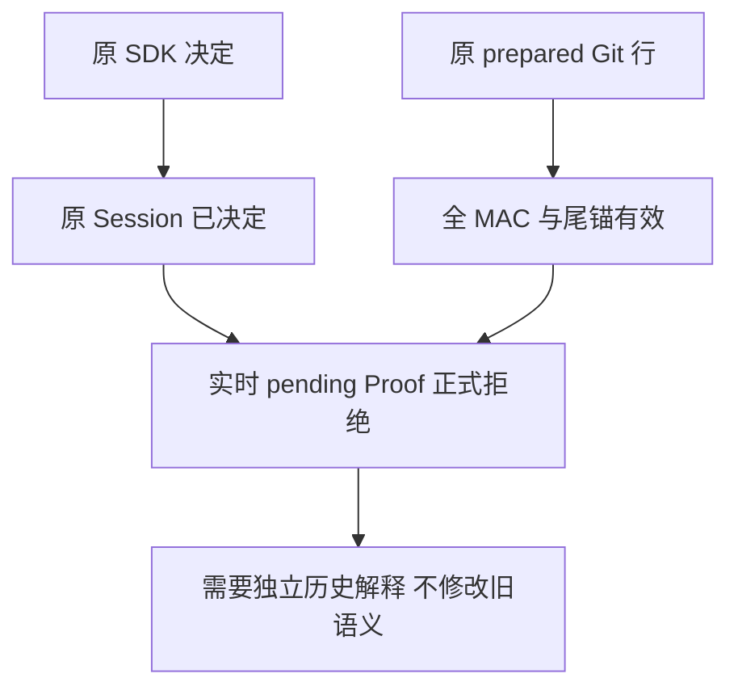
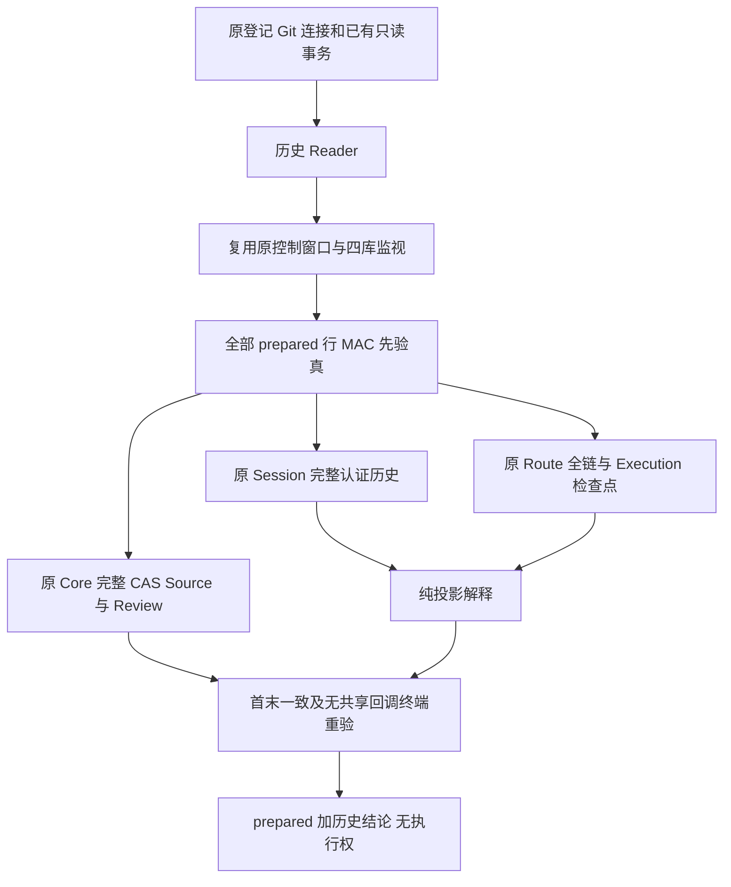
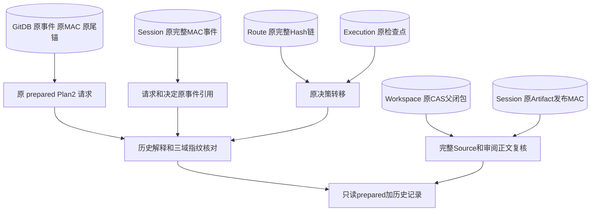
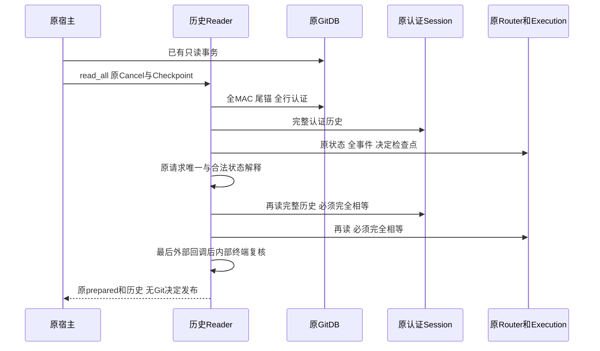
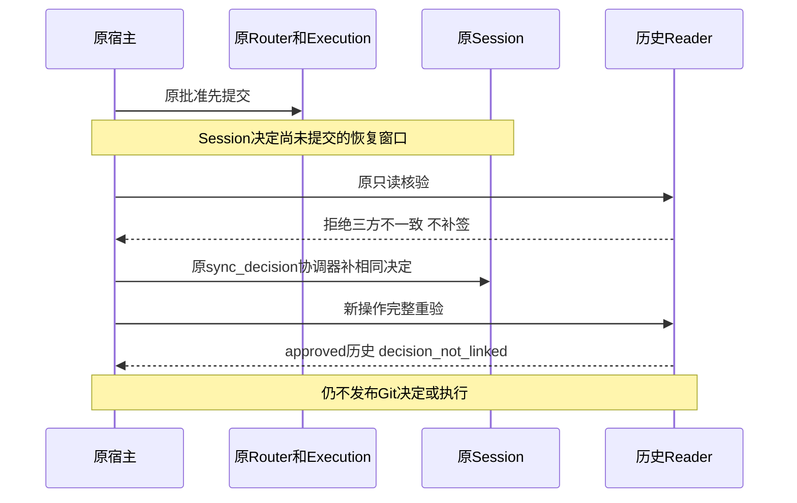

# 原 prepared Git 关联的审批历史只读核验设计

## 1. 变更摘要

本切片补齐审批历史的只读解释及原认证资源接线，不发布 Git 决定事件，不注册默认 Git 写工具。
源码研究基线为 `e088b09b20de3b2898bd2d4b8479f39b84553018`；新增实现与验证结果另行记录，基线不是新增代码的提交证明。

| 项目 | 说明 |
|---|---|
| 需求 | 在原 prepared 关联不变的条件下，辨别同一原调用的 pending、人工 approved/denied、审批前 cancelled |
| 现有边界 | prepared Reader 要求实时 pending；决定后拒绝是正确行为，不应放宽 |
| 增量 | 独立历史 Reader：先验全部 Git MAC/尾锚，再读原完整 Session、Route、Execution、Core、CAS、Review |
| 输出 | 原 prepared 加只读审批历史；已决定且 Git 仍 prepared 时明确 `decision_not_linked` |
| 兼容 | 无新公共 Schema、DDL、审批算法、Key、授权令牌或效果事实；原 Reader/Writer 不变 |
| 回滚 | 停止调用新私有 Reader；无新增持久数据，无迁移与删除 |

## 2. 需求背景与源码证据

[prepared Proof](../../src/harnessix/product_config/git_prepared_link_proof.py)检查原 active Turn、waiting_approval、首个 pending Call 及唯一 Started 审批。
原 [审批协调器](../../src/harnessix/agent/trusted_action_session.py)先提交 Router/Execution 决定，再 CAS 追加 Session ItemFinished；三库不具有共同事务。
[完整认证历史](../../src/harnessix/session/sqlite_history.py)认证原 MAC 后重放全事件，含请求之前和决定之后的历史。
[原 Row Reader](../../src/harnessix/product_config/git_prepared_link_rows.py)认证全物理前缀与独立尾锚，但仅接受 sequence 0 prepared 正文。
因此历史 Reader 可以消费原未改动的 prepared 行，但不能把其当作已追加的 Git approved 事实。

## 3. 设计目标、非目标与验收标准

| 目标 | 验收 |
|---|---|
| G1 原请求唯一、完整合法历史、三方决定一致 | 纯投影正反例；实际认证 SDK 请求/决定场景 |
| G2 全部原 prepared 行均验真，不跳过坏关联 | 坏 MAC、坏尾锚、其他关联错误拒绝 |
| G3 保持原资源与只读 | 原 Session/Workspace/Audit/Execution/GitDB 行、总写次数及用户仓库前后不变 |
| G4 取消、绝对期限、Owner、最后回调漂移拒绝 | 原控制异常不包装；终端全行、材料及决定重验 |
| G5 历史与执行权分离 | 原 prepared Reader 仍拒绝已决定；新结果不含执行权限；无 execute/reconcile 调用 |

非目标：新 Git sequence 1、approved Writer、完整 U 最终 Git 复核、协作锁、A/T2/D、NativeBridge、Commit、Backup2、默认装配和发布验收。
单人先导与独立 Beta 使用既有[操作手册](../operations/pilot-beta.md)，本切片不增加试用成绩。

## 4. 当前实现与根因



过去 prepared 事实与当前审批历史属于不同断言。只删 waiting 检查、只看 ready、或只读最新审批对象，都丢失原请求与合法历史证据。
策略 ALLOW 也可能进入 ready，故必须要求原 REQUIRE_APPROVAL、原检查点、完整 Session 决定和 Route 决定事件同时成立。

## 5. 方案与总体架构



模块边界：`git_approval_history_projection.py`只解释已提供的原模型，不自行认证 MAC；
`git_approval_history_proof.py`交叉读取原资源；`git_prepared_approval_history.py`协调全 Git 前缀认证、控制窗口和终端读集合。
复用 [PreparedLinkLedger._control](../../src/harnessix/product_config/git_prepared_link_ledger.py)而不另建 Store、Owner 或 SQL 安全机制。
窄读集合继承现有 `PreparedLinkReadSet`，原材料终端复核保持，再增加原决定与全 Route 事件复核。
初始与异步复核仍调用原 `Router.approval → Execution.load_approval` 验证完整检查点及原 Plan 父闭包。
终端不能再次调用该方法：`ExecutionPlanV3` 的原 Decoder 会进入共享 `_checkpoint`。
因此同次记录已由原方法验真的 `execution_approvals` 全物理行（plan_id、plan_fingerprint、payload）；
终端只做原连接逐字节全行比对，配合整段四库 data_version/total_changes 监视和原 Route 全链重验。
这不是第二审批解释器，不刷新检查点、不调用构造回调、不为未验真的行建立来源。

### 5.1 数据流与原事实归属



GitDB 输出原计划和过去请求，Session 输出原发生顺序与决定投影，Route/Execution 输出原执行域决定。
CAS 与 Artifact 输出完整材料而不是许可。Reader 不向上述数据库写入数据，输出也不反向更新任一原权威。

替代方案：放宽旧 Reader 会改变 pending 契约，拒绝；独立通用审批服务产生新权威，拒绝；只读状态表缺请求历史，拒绝。

## 6. 正常、失败与恢复时序



Router-first 崩溃窗口只有 Route/Execution 决定、Session 尚未决定：Reader 拒绝不一致，不主动调用 sync_decision。
恢复必须由原协调器完成，再开始新的只读核验。取消/超时、Review 过期、Owner 漂移、坏链或材料消失同样停止，既有事实不补签、不重捕获、不重放。



每次失败结束原只读操作及监视连接，不改变原 Git 行。sync_decision 属于原审批恢复，不由 Reader 隐式发起。
重新核验重新读取全历史，不沿用先前失败的局部结果或缓存通过结论。

## 7. 领域契约、类、接口与字段

### 7.1 接口设计

`OriginalGitApprovalHistory`为私有 frozen/slots 记录：state；原 request_event；可选原 decision_event；取消时四个 cancel_events；原 router_approval；原 route_decision。
正文引用不进入 repr，不序列化为许可。
`OriginalGitPreparedApprovalHistory`保存原 prepared 与上述记录；`linkage_state`区分 `prepared` / `decision_not_linked`，两者都没有 Git approved 事件。
`ProductGitPreparedApprovalHistoryReader.read_all(*, cancel, checkpoint)`只返回完整核验的 tuple；没有 prepare/append/execute 方法。

构造器参数与原 Ledger 一致：已登记 exact `sqlite3.Connection`、原 Router/CoreStore/ArtifactStore/GitReadRuntime，
以及 keyword-only 原 SnapshotPorts/WorkspaceScope。不构建认证资源，不自动 BEGIN/COMMIT，调用方必须先开启原事务。
`read_all`不接受 Thread 模型、自由 ApprovalRecord、expected outcome 或调用方 Plan 作为认证来源。
其返回为空 tuple 表示该原账本没有关联；任意原行失败则整次抛错，不返回部分成功。
业务语义用 `git_approval_history_changed`；原 SQL 门禁/Owner/MAC/材料/控制错误保留，只有本操作超时才映射 `git_process_timeout`。

### 7.2 数据结构

Session 请求指纹绑定 Thread/Turn/Call/Route/Review；Execution 检查点指纹绑定 Execution Plan；Route 事件绑定 Route 指纹。
三种域分别与原算法核对，不直接要求彼此相等。

| 字段 | 归属与解释 | 禁止推导 |
|---|---|---|
| `prepared.plan` | 原 Git MAC 覆盖的完整 Plan2；Core、Route、Review 不重捕获 | 不表示当前 Git approved |
| `request_event` | 原 Session 唯一 ItemStarted，Thread/Turn/Call 与原 Core 相同 | 不从 Fork 投影借用 |
| `decision_event` | 人工决定时同 Item 的原 COMPLETED ItemFinished | CANCELLED Item 不伪造成决定 |
| `cancel_events` | 审批前取消四个原 Session 事件引用 | 字符串 system.cancel 单独不构成证据 |
| `router_approval` | 原 Execution 检查点，包括 outcome/actor/reason/time 与原 Execution 指纹 | 不与 Session 请求指纹直接比较 |
| `route_decision` | 唯一原 pending_approval 转 ready/denied 事件及原 actor 摘要 | ready 本身不等于人工批准 |
| `linkage_state` | 是否仍未决定或原决定尚未落 Git 关联 | 不产生 can_execute |

审批前取消要求原 cancelling、同 Item CANCELLED 无决定、同 Call cancelled ToolResult、Turn CANCELLED，以及原 rejected/system.cancel/turn_cancelled 检查点。
取消检查点时间与 Session 取消事件时间自然可能不同，不能凭相等时间制造关联。


### 7.3 核心源码定位

| 符号 | 实际位置与职责 |
|---|---|
| `ProductGitPreparedApprovalHistoryReader` | [git_prepared_approval_history.py:76](../../src/harnessix/product_config/git_prepared_approval_history.py#L76) |
| `OriginalGitPreparedApprovalHistory` | [git_prepared_approval_history.py:37](../../src/harnessix/product_config/git_prepared_approval_history.py#L37) |
| `_ApprovalReadSet` | [git_prepared_approval_history.py:50](../../src/harnessix/product_config/git_prepared_approval_history.py#L50) |
| `_read_all` | [git_prepared_approval_history.py:121](../../src/harnessix/product_config/git_prepared_approval_history.py#L121) |
| `ApprovalHistoryEvidence` | [git_approval_history_proof.py:51](../../src/harnessix/product_config/git_approval_history_proof.py#L51) |
| `read_original_approval_evidence` | [git_approval_history_proof.py:118](../../src/harnessix/product_config/git_approval_history_proof.py#L118) |
| `verify_original_approval_terminal` | [git_approval_history_proof.py:184](../../src/harnessix/product_config/git_approval_history_proof.py#L184) |
| `_approval_row` | [git_approval_history_proof.py:89](../../src/harnessix/product_config/git_approval_history_proof.py#L89) |
| `OriginalGitApprovalHistory` | [git_approval_history_projection.py:39](../../src/harnessix/product_config/git_approval_history_projection.py#L39) |
| `interpret_git_approval_history` | [git_approval_history_projection.py:393](../../src/harnessix/product_config/git_approval_history_projection.py#L393) |

## 8. 状态、事务、并发与幂等

pending 要求三个原域均未决定。人工 approved 要求同原 Item 的 COMPLETED 决定、Route ready、原活跃 Turn waiting_approval/executing_tools，且无效果。
人工 denied 可包含原拒绝结果及终结；审批前 cancelled 必须有完整原取消证据。running/unknown、效果、批准后取消及 Fork 借用均拒绝。

GitDB 是已有只读事务；四库监视和全部事实首末相等只是可观察漂移检测，不是共同事务或恶意外部 ABA 防护。
最后原外部回调结束后，复用原内部控制窗口重验全行/尾锚、Core/Source/CAS/Review、原 Route 全链及已验真原审批全行，再返回；不 await、不进入共享构造回调。
重复读取不产生新事件、幂等键或副作用。Git 写原子性与协作锁仍属于后续独立设计。

## 9. 安全、隐私与可观测性

仅原活跃 Owner、原 Session/Artifact 发布 Guard、原 Scope、原 Core Store、原端口及登记的 exact Git 连接可以进入。
语义错误为固定 `git_approval_history_changed`；原物理/Owner/认证错误保留原稳定代码，原控制异常保留原实例。
不输出 Key、作者、路径、消息、正文及底层解析异常。私有证据含正文引用，不能投喂模型或当作日志正文。
复用既有审计事实，不新增业务日志/Metric/高基数标签。真实验证记录只保存低敏状态、计数、摘要和完整性证明。

## 10. 核心业务伪代码

```text
freeze_original_host_and_transaction()
verify_all_git_mac_rows_and_tail_before_decode()
for each_original_prepared_link:
    read_original_core_and_complete_session_history()
    read_original_route_chain_and_execution_checkpoint()
    interpret_unique_request_and_legal_decision_history()
    verify_original_source_complete_cas_and_review()
    reread_complete_history_route_checkpoint_and_core()
    reject_any_change()
freeze_full_git_rows_tail_and_changes()
after_last_external_callback:
    verify_full_rows_original_materials_and_decisions_without_shared_callbacks()
return_original_prepared_plus_history_without_execution_permission()
```

## 11. 测试方案

纯模型测试与原 MAC SDK 集成分开记录，不将前者宣称为认证阳性。
实际场景使用原 SDK start_turn / approval/respond / turn/cancel、原 Kernel/Router/Session 和正式 Git 规划 Review；仅在执行前观察，不调用 Git Executor。
检查 pending、approved、denied、cancelled、未同步窗口、请求错配、全前缀损坏、终端漂移、原异常实例及无业务行变化。
保留现有 pending-only、Owner fresh-view、原审批恢复及全治理回归。

## 12. 部署、兼容与回滚

私有模块进入候选 Wheel；无默认工具广告、CLI 入口、HTTP 服务、DDL、迁移或配置变化。
只读接口可在原宿主生命周期内显式调用，宿主结束后必须拒绝。旧 pending Reader 不承担历史查询。
卸载新版本不要求转换持久状态；本切片不会产生新 Git 事件。

## 13. 交付与验证边界

源级、安装级、平台级及真实用户级证据分别记录。测试通过不关闭整个 B2、B4、R3、R4、R5、R6 或商用发布。
[完整决定接线设计](m09-r4-git-approved-link.md)的 Writer、恢复屏障、完整 U 复核及终端协作边界仍为 planned。
验证结果必须注明实际源码摘要、Python/OS、Wheel 输入和未验证项；失败原件不删除。

## 14. 风险与待办

1. 外部非协作 Git/IDE 写入没有共同瞬时原子保证，不能从此 Reader 推导可以执行。
2. 大仓库完整读取仍可能造成同步调度间隔，既有 P1 不在本切片关闭；保持 60 秒总期限，不扩大预算掩盖问题。
3. 当前 Git 行只支持 prepared sequence 0；任何未实现表或新版多事件正文继续拒绝。
4. 真实质量复验、最终安装候选和 Beta 成绩独立推进，不以离线脚本通过替代。
