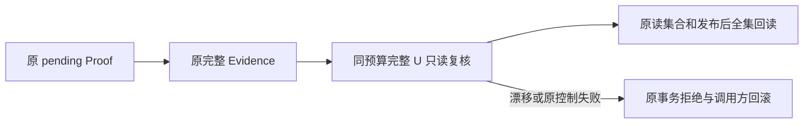
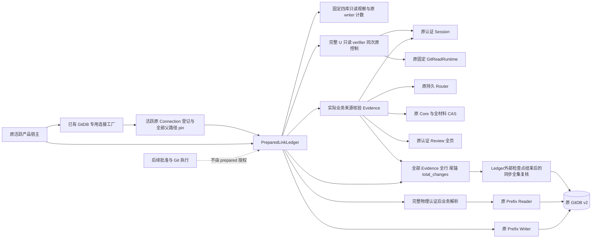
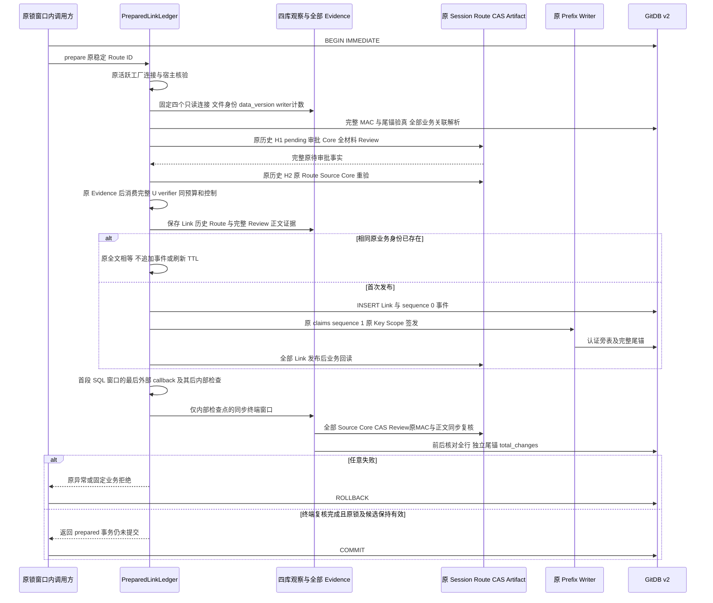
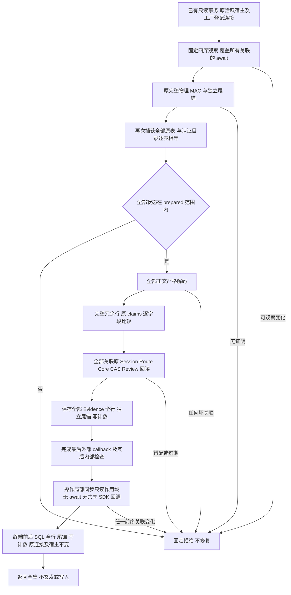
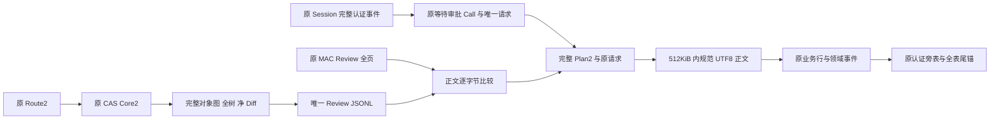
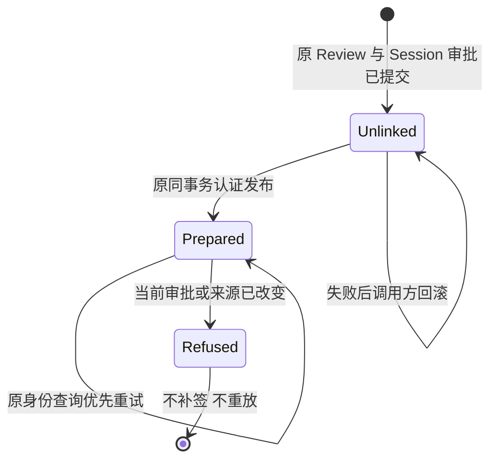

# 待审批 Git 业务关联认证写入与回读详细设计

## 1. 变更摘要

<a id="1-文档摘要与需求背景"></a>

<a id="11-实现状态"></a>

### 1.1 实现状态

本文描述实际 `ProductGitPreparedLinkLedger` 内部组件，不描述已经上线的默认 Git 写工具。
`code_revision` 固定包含现行协调层接线的源码版本；源码结果不代表默认注册或安装验收。
本文同步连接工厂、全集观察、终端读集合及 Artifact 显式只读接口的现行源码；
测试结果、输入摘要与验收状态须按同一完整候选另行固定，不在本文填写最终通过结论。

| 范围 | 当前事实 |
|---|---|
| 输入来源 | 原活跃 Session 完整认证历史、原持久 Route2、原 CAS Core2、完整对象材料与原认证 Review Artifact |
| 输出 | 原 GitDB v2 内一条 `prepared / sequence=0` 业务记录、首个原 MAC 发布及完整尾锚 |
| 成功提交 | 组件不提交事务；调用方必须在原锁窗口自行 COMMIT |
| 当前回读 | 所有关联的原物理全前缀认证、业务交叉核验、固定四库变化观察与终端同步全集复核 |
| 连接来源 | 原活跃context登记的确切Connection及原Task；来源观察不授予子Task SQL消费权；路径报告不能替代登记 |
| 默认注册 | 未注册默认 `git_checkpoint` 或 `git_commit`，不修改产品装配 |
| 未完成范围 | 实际业务批准、A/T2/D、NativeBridge、Checkpoint/Commit 效果、完整生命周期 Loader、Backup2、三平台业务验收及 R3/Beta |

<a id="12-当前验收阻断"></a>

### 1.2 当前验收阻断

连接与异步SQL窗口新增准确Task准入；原U验证子Task仅消费原Task签发的来源观察闭包，
Owner、路径pin、事务代际及取消期限检查保持。通用同步SQL窗口仍是线程合同，不能作为Task认证证明。
详见[任务准入与来源观察详设](m09-r4-git-connection-ownership.md)。
后续[原 Runtime Thread 绑定](m09-r4-git-runtime-thread-scope.md)已接入本 Ledger 的
`_control`及审批历史消费者：入口须处于原 Task 已持原 Thread 锁的活动绑定 context，
冻结实际原 Runtime 装配与同次 acquire 代际；发布目标 Thread 另外匹配。
调用方窗口覆盖原事务 COMMIT／ROLLBACK，不自动获得执行授权；全集回读不按当前 Thread 过滤。
实际 SQLite FD、全部 dispatch 与完整 B7 仍未闭合，默认 Git 写工具仍未装配。

本候选尚未封板。原先的同步复核仍会调用 SDK Store 的构造检查点，
使已读取 CAS 失效而不改变数据库版本。现行源码已引入下述操作局部终端只读控制，
覆盖 Core、Source、Route 父闭包与完整材料；不替换共享 Store 回调或重开替身 Store。
原 Store/CAS/Audit 专项已通过，实际认证 SDK 与最终固定安装候选仍须复验后才能关闭本问题。

原 CAS 正常读路径已通过原 Store 的 `UpstreamCheckpointError` 标记区分回调异常与材料损坏，
取消、期限和其他回调异常保留原实例；相同错误码由材料 IO 抛出时仍归为材料读取失败。
原 SQL 窗口在连接已关闭时撤销登记，不重复释放失效回调，避免 SQLite 清理错误遮盖首失败。
两项已有专项回归，最终安装候选仍须独立复验；所有历史失败均保留。

#### 末端读取控制整改方案

终端全集复核采用操作局部的同步只读作用域：只绑定本次原 Workspace Transaction Store、
原 Audit Store、原严格 CAS IO 与 Ledger 内部检查点。作用域由 `ContextVar` 隔离，
不赋值、不替换两个共享 Store 的构造检查点或 Blob 属性，不重新打开替身 Store。
所有 Evidence 在同一作用域内依次复核，避免后一条关联的回调使前一条材料失效。

原 Store 的 Blob／Record Reader 和原 Audit 的父闭包 Reader 在该作用域内消费同一内部控制；
Audit 父闭包显式使用绑定原 CAS 的完整严格读取端口，而不是继续调用任意构造 Reader。
Core、Source 成功 Patch、Route、父闭包、全材料及 Review 仍沿原校验算法完整重验，
不以已缓存模型或内容摘要代替正文。作用域内拒绝这两个 Store 的业务写入入口，
禁止跨任务／线程继承及重入；正常结束或异常结束都撤销作用域。

普通异步认证及作用域外 SDK 调用仍执行原构造检查点。这个控制不是授权、认证证明、
跨库快照或阻止外部进程改写 CAS 的文件锁。验收要求包括原构造回调的普通路径保留、
终端零共享回调、异常撤销、取消／期限实例保留、作用域内写拒绝及末端材料缺失拒绝。
原 Store、CAS、Audit 及上下文控制关联专项共150项通过，其中包含真实原 CAS
读后回调删除已读文件的反例、末端对照及原 Route2 父历史缺失拒绝。
首轮测试中取消令牌接口名称错误的六项夹具失败单独保留，改用原 `checkpoint()` 后复验。
这些是组件证据，不是实际认证 SDK 或最终安装候选验收。

<a id="13-需求背景"></a>

### 1.3 需求背景

[实际 Checkpoint 准备](m09-r4-git-checkpoint-preparation.md)已经生成原认证调用对应的完整 Core2、材料和审阅。
[原 GitDB 前缀账本](m09-r4-git-prefix-ledger.md)能够认证所有物理行，但物理 MAC 有效不意味着正文绑定了正确的调用、审批、材料和 Review。
若直接把调用方拼接的 JSON 交给物理发布器签发，将使错误业务事实获得真实 MAC。
若回读只检查选中的一条正确记录，还可能忽略同库内另一条已认证但语义错误的记录。

本增量因此提供两层独立检查：

1. 新事实必须从原实际权威资源重新形成，不能把任意外部 Link 模型作为签发输入。
2. 读取先核验原完整物理认证前缀，再对全部 Link 严格解析并核验全部原业务关联。

`prepared` 只表示关联材料已经准备且原调用仍在等待人工决定；它不表示已经批准或已执行。

## 2. 需求背景与证据

<a id="3-源码研究与架构决策"></a>

| 原源码 | 已有责任 | 采用方式 |
|---|---|---|
| [原 Agent 审批协调](../../src/harnessix/agent/trusted_action_session.py) | 待审批 Turn、首个 pending Call、started 审批项目、原 Router 先行决定 | 保持原阶段语义，不把待审批伪装为 executing_tools |
| [原审批投影构造](../../src/harnessix/trusted_actions/agent_gateway_output.py) | 绑定完整 Thread/Turn/Call、原 Route、策略及 Diff 摘要 | 直接调用 `build_approval`，不新增请求指纹算法 |
| [原完整历史读取](../../src/harnessix/session/sqlite_history.py) | 认证完整 Session 事件并重放原 Reducer | 首末实际读取相等，保留最后已认证历史用于终端同步复核；不以模型外形替代认证 |
| [原 Review 宿主](../../src/harnessix/product_config/git_delivery_review_host.py) | 原资源、Scope、Owner、Key 与固定端口引用 | 同次操作冻结并重复检查，不重新打开或替换 |
| [原完整材料](../../src/harnessix/product_config/git_delivery_plan_materials.py) | 原对象图、全材料、双树与完整 Diff | 全量读取，不用摘要替代正文 |
| [原 Artifact Store](../../src/harnessix/artifacts/sqlite.py) | MAC、manifest、唯一审批回指、正文和分页 | 异步调用显式 `read_only=True`；终端复用原 MAC 与 `matching_action_review` 同步匹配；不再次 publish |
| [专用连接工厂](../../src/harnessix/product_config/git_prepared_link_connection.py) | 已有文件、全部父路径 pin、活跃原连接登记与关闭 | 取代仅核对当前路径的连接判断；每个内部检查点再次核对原登记 |
| [全集观察及读集合](../../src/harnessix/product_config/git_prepared_link_observation.py) | 四库固定观察、全部证据、SQL 全行与独立尾锚 | 覆盖全部关联的异步采集与发布回读；末端检查不只消费最后一条 Link |
| [终端只读控制](../../src/harnessix/workspace/terminal_read_control.py) | 原资源身份、ContextVar 生命周期、同任务同线程控制与严格 CAS Reader | 同一全集作用域覆盖底层原 Store/Audit；不改变共享回调或认证算法 |
| [原 Git 前缀 Writer](../../src/harnessix/product_config/git_prefix_writer.py) | 全表/事件差量、原 MAC、事务代际、完整尾锚 | 同一原事务写入，不自行提交、不修改桥接拒绝条件 |
| [原 Git 前缀 Reader](../../src/harnessix/product_config/git_prefix_reader.py) | 全表认证和完整独立尾锚 | 先认证，再进入业务数据模型解析 |

选择严格 prepared 独立模型，而不是包含大量可选字段的通用 Link：当前只有准备事实具备真实生产来源。
后续执行阶段必须引入对应实际批准、桥接、工作树及效果事实，不能把当前模型填上一个新 phase 即算完成。
这属于完整 Git 交付设计的首个业务写入状态，不缩减完整交付目标。

## 3. 设计目标、非目标与验收标准

<a id="2-设计目标范围与非目标"></a>

<a id="21-设计目标"></a>

### 3.1 设计目标

| 目标 | 实现要求 |
|---|---|
| 原实际权威 | Session、Router、CAS、Artifact、Key、Scope、Reader、Owner 与原资源引用保持一致 |
| 原物理连接 | 工厂只打开已有文件；打开前后逐段检查全部父目录及文件，拒绝符号链接、入口前置换及未登记连接 |
| 正确审批阶段 | 原 Turn 为 `waiting_approval`；首个 pending Call 与 Core 相同；唯一原审批项目仍为 `started` |
| 完整请求 | 用原 `build_approval` 重建完整请求指纹，与已认证审批项目逐字段相等 |
| 完整材料 | 原 CAS 中完整 Core、Scope、双树和净 Diff 均可读且满足原合同 |
| 完整 Review | 原 Artifact MAC、用途、作用域、唯一 Session 回指、manifest 及所有分页正文全部成立 |
| 原事务认证 | 业务行、领域事件、认证旁表及尾锚在调用方同一 GitDB 事务内形成 |
| 查询优先 | 同一 Route 重试复用原业务身份，不刷新 TTL、不重新分配发布 epoch 或追加事件 |
| 只读无修复 | 所有记录先认证后解释，任何一条失败即拒绝全集；不能补签、迁移或重建 |
| 全集观察 | 固定四个只读观察连接比较各自 `data_version` 与文件身份，同时检查三个原持久 writer 的 `total_changes` |
| 终端闭合 | 最后一次外部 callback 后不再 await 或调用外部 callback；同步复核全部 Evidence、SQL 全行、独立尾锚和写计数 |
| 有界取消 | 原 60 秒单调期限、原 SQL 检查点及当前任务取消覆盖全部阶段 |

<a id="22-非目标"></a>

### 3.2 非目标

- 不更改原 GitDB v2 十三表 DDL，不增加认证用途或密钥。
- 不复用 v1 Store 的自提交 Writer 后再补签，不追认旧无证明历史。
- 不签发 ApprovalDecision；仅沿原 GitReadRuntime 执行只读观察命令，不写对象库、Ref、用户 Index 或 A/D 工作树。
- 不提供所有后续 phase 的通用状态机；遇到非 prepared 正文或未实现业务表必须失败关闭。
- 不提供历史离线归档 Reader。原审批已决定、Turn 已终结、Review 过期或当前来源已改变时，当前待审批回读应拒绝。
- 不把跨 Session、Route、CAS、Artifact 的变化观察或终端同步重验声明为跨库原子快照。
- 不把所有父路径的合作式 no-symlink pin 宣称为 OS 原子 no-follow 打开、fd 来源认证或对恶意路径换回的绝对防护。
- 不凭这一步关闭 R1～R6。完整业务生命周期、备份恢复和实际产品消费者仍须实现。

## 4. 当前实现与根因

原 pending Proof 已认证调用、Source、完整材料和 Review，但这些断言不覆盖准备后的
Git Ref、配置值及物理 Index 漂移。完整 U verifier 原先仅作为依赖存在，协调层没有消费它。
现行 `_authenticate` 在原 Proof 之后接通 verifier；不以放宽 pending-only 条件解决问题。




### 4.1 真实耗时根因与验收约束

本机 Git 2.53、Python 3.13.8、SHA1 单 Patch 的原认证 SDK 情形中，委托原实现的单调计时得到：
原 Turn 到待审批入口 23.10 秒；一次 `prepare` 56.10 秒；发布前后两次完整 U 分别 0.797 / 0.804 秒。
每次 U 包含 22 次原 Git 进程端口查询，累计 0.191 / 0.198 秒，以及两次原 Session 全历史认证，
累计 0.133 / 0.135 秒；U 严格快照分别 0.096 / 0.094 秒。
整个准备操作的原 pending Proof 两次累计 34.33 秒，严格规范 JSON 编码七次累计 14.18 秒，
原新鲜只读 Owner 复核 217620 次累计 34.70 秒；Secret JSON/JSONL 扫描不足 0.003 秒。
上述为嵌套区间，不可相加；不是生产性能门禁通过结果，也不是对所有仓库规模的保证。
主要成本是原细粒度检查点反复复核真实 Owner 与规范正文，不是新增 U 的 Git 查询或删不掉的历史认证。

原消费者每次仍共享原 60 秒预算、cancel 和 checkpoint；原 Turn 默认仍为 120 秒，审批期限不刷新。
多次准备、重试和历史读取累积在同一 Turn 会导致原 `approval_expired`。
正向测试将重开读取、原身份重试、回滚重试及提交响应丢失拆成各自真实原 Turn，
保留等待原真实期限届满后的 SDK 拒绝及历史 Reader 拒绝负控；不修改夹具时钟、生产预算或认证强度。
同步响应性 P1 继续开放；异步 U 复核不能替代同步终端/COMMIT 的外部 Git 一致性门禁。


## 5. 方案与变更后总体架构

<a id="4-总体架构与模块边界"></a>



- `contracts` 负责正式待审批数据合同，复用完整 Plan2 和原审批请求。
- `wire` 负责严格完整规范字节，复用原编码算法和原 512 KiB 单记录预算。
- `proof` 从实际资源生成事实，不接受外部声明作为权威输入。
- `connection` 仅打开已有原文件，登记同一线程中活跃 context 的确切 Connection；关闭或撤销登记后不能继续借用。
- `observation` 保持四个只读观察连接，并保存同次操作的 `PreparedLinkReadSet`；不是签发器、锁或跨库事务协调器。
- `rows` 在完整物理认证成功后解释全部行并检查所有冗余列与原 claims。
- `ledger` 协调已有事务、原登记连接、两段 SQL 检查窗口、原资源冻结、查询优先和发布后全集回读。

领域 delivery 不新增对 session 的依赖；认证适配继续位于 product_config。
组件不是第二个 Action Plane 服务，没有新网络端口或中间件。

## 6. 正常、失败与恢复时序

<a id="5-核心流程与时序"></a>

<a id="51-新准备事实写入"></a>

### 6.1 新准备事实写入



调用方负责原 Runtime 锁窗口及最终提交。组件既不借助 SQLite ATTACH 假装跨库原子性，也不获取与原 Runtime 无关的新锁。
返回 `prepared` 之后、COMMIT 之前若调用方放弃操作，应回滚；如果已经提交但响应丢失，应按原 Route 身份查询，而不是重新执行。

<a id="52-当前只读业务回读"></a>

### 6.2 当前只读业务回读



不提供“跳过坏记录”“修复后读取”或“选一个正确 Link 返回”的路径。
当前 Reader 的 scope 是待审批实时核验，不能据此宣称完整业务备份或新根恢复已经可用。

<a id="53-数据流程"></a>

### 6.3 数据流程



Core、Scope、Route 和 ArtifactRef 只通过原 Plan2 嵌套保存，不另建影子 Core 或第二份请求指纹算法。
`PreparedLinkEvidence.review_body` 是当前操作私有内存中的核验材料，不是新增持久 Review 副本或公开 Artifact。
私有 Link 正文包含业务事实，不能直接作为模型可见输出、诊断正文或公开验证附件。

<a id="54-当前生命周期"></a>

### 6.4 当前生命周期



`Refused` 是读取结果，不会由只读 Reader 写回数据库。
approved、anchor_ready、native_bridge_closed、checkpoint_closed 等后续领域状态不在本组件实现范围。

### 6.5 失败、取消、超时与恢复

<a id="10-失败取消超时与恢复"></a>

| 场景 | 行为 | 数据边界 |
|---|---|---|
| 原历史或 MAC 无效 | 原 Reader 拒绝 | 不补签、不追认 |
| 全表 MAC 有效但业务列/正文错配 | 业务拒绝 | 不返回选中记录，不更新尾锚 |
| 原审批已决定/Turn 非等待/Call 非首个 pending | 拒绝 | 不退回原状态、不生成新请求 |
| CAS 缺失、错 SHA 或对象图错误 | 原完整材料拒绝 | 不重新捕获补材料 |
| Review 非原引用、用途错、过期、正文或 MAC 错 | 原 Artifact 拒绝或业务比对拒绝 | 不再次 publish，不刷新 TTL |
| Artifact 异步读取时 Session 文件缺失 | prepared 显式 `read_only=True`，沿原只读存储错误拒绝 | 不按默认可创建连接补建 Session 文件 |
| 取消、任务取消 | 原检查点/await 退出 | 原连接事务由调用方回滚 |
| 总期限耗尽 | 固定 git_process_timeout | 不给后续步骤新 60 秒 |
| 调用方检查点抛出异常 | 保留原异常实例 | 不把同类型 TimeoutError 冒认为自身定时器到期 |
| 最后外部 callback 新取消、撤销宿主或改变资源 | callback 后再次内部检查；同步终端仍消费原取消与期限 | 不因 callback 正常返回而忽略其产生的新状态 |
| 跨 await 发生 ROLLBACK/COMMIT/SAVEPOINT | 原事务代际改变并拒绝 | 不创建替代 witness |
| await 后 SQL 行、资源或物理文件变化 | 完整回读或宿主复核拒绝 | 不修复和继续 |
| 后一条 Link 的 await 改变前序 Link 对应资源 | 四库观察及全部 Evidence 的同步终端复核拒绝 | 不只重验最后一条 Link |
| 最后 Session await 后 CAS/Review 已改变 | 终端完整 CAS 重读及原 Artifact MAC/正文同步复核拒绝 | 不以已保存正文或最后一次历史相等替代当前材料 |
| 独立尾锚变化，或写入再还原 SQL 行 | 原 anchor 行、全行及 `total_changes` 均须相等 | 不只比较业务表摘要，不补签尾锚 |
| 工厂打开前后或 Ledger 入口前置换 DB/任一父目录 | 原活跃连接登记和全部路径 pin 拒绝 | 不接纳只报告相同路径的旧连接 |
| 无工厂登记、context 已退出或原连接关闭 | `git_prepared_link_host_invalid` | 不提供公开注册 witness，不重新打开替代连接 |
| 无已有事务、或 prepare 使用只读连接 | 原事务/只读分类拒绝 | 不自动 BEGIN，不升级或迁移 |
| 同身份重试 | 原全文相等才返回 | 不新增 epoch/事件 |

SQL progress 中断保留首次原取消/期限异常，底层 sqlite 中断不能覆盖该原因。
本组件没有外部 Git 写副作用，因此失败恢复当前只涉及调用方事务回滚及原身份查询；后续 Git UNKNOWN 结算仍须单独实施。

## 7. 领域契约、接口设计与数据结构

<a id="6-接口设计与类设计"></a>

<a id="61-正式契约入口"></a>

### 7.1 正式契约入口

```text
snapshot_product_git_prepared_link(value, *, checkpoint) -> ProductGitPreparedLink
encode_product_git_prepared_link(value, *, checkpoint) -> bytes
decode_product_git_prepared_link(body, *, checkpoint) -> ProductGitPreparedLink
```

快照检查确切实际类型及全部字段，深层重建原模型，不相信 model_construct、未校验 model_copy、子类或旧可变别名。
解码拒绝重复键、NaN、额外字段、缺省补全、非规范空白、转义等同义字节；取消检查点原异常实例保持。

<a id="62-宿主内部接口"></a>

### 7.2 宿主内部接口

```text
ProductGitPreparedLinkLedger(database, router, core_store, artifacts, reader,
                             *, snapshot_ports, workspace_scope)
prepare(route_id: UUID, *, cancel: CancelToken, checkpoint) -> ProductGitPreparedLink
read_all(*, cancel: CancelToken, checkpoint) -> tuple[ProductGitPreparedLink, ...]
```

`prepare` 接收稳定 Route ID，不接收外部 Link、Core、ApprovalDecision 或正文作为权威来源。
`read_all` 不返回持有写权限的 window，不签发 Seal。两者只借用现有连接及资源，不拥有其关闭生命周期。
数据库必须是原固定 `state/git-delivery/git-delivery.db` 的专用连接，且由下面的工厂在当前线程活跃 context 中登记。
直接 `sqlite3.connect` 获得的同路径连接、已退出 context 的连接、额外附加数据库、内存库、符号链接及可观察到的物理替换均拒绝。
只有 SQLite 自动出现的空 temp 连接允许存在；原 Schema 验证仍拒绝未知临时结构。

```text
open_prepared_git_connection(path: Path, *, read_only: bool, checkpoint=None)
    -> contextmanager[sqlite3.Connection]
require_prepared_git_connection(database, path: Path, *, checkpoint=None) -> None
```

工厂仅接受无 `..` 遍历的路径，逐段 `lstat` 检查根目录、全部父目录与最终普通文件，
比较打开前后的 `(dev, inode)` 序列，并将路径及序列私有登记到确切连接。
写模式为 `mode=rw`、显式事务；只读模式复用 `mode=ro/query_only`。
工厂不创建目录或数据库、不迁移、不生成 Genesis、不获取业务锁；退出时撤销登记并关闭连接。
Ledger 只借用连接，调用方必须将整个操作与提交保持在工厂 context 和原 Runtime 锁内。

完整认证检查点（包括原终端边界）核对原连接来源；P1 v2 纯计算段的局部检查点仅核对原登记与存活，
不执行路径查询。准确范围与失败顺序见[分层控制契约](m09-r4-git-approved-link.md#135-p1-分层控制契约-v2)。
`PRAGMA database_list` 只是路径一致性检查，不能自行生成或替代原连接登记。
逐段检查并非内核原子操作，不提供已打开 fd 与路径的 OS 原子绑定证明，也不保证发现检查间恶意替换再换回的全部竞态。

<a id="63-权威核验入口"></a>

### 7.3 权威核验入口

[`authenticate_prepared_link`](../../src/harnessix/product_config/git_prepared_link_proof.py)的参数来自原 Ledger 宿主。
它核对原 Route 状态，完整恢复原 Core2，校验同一原 Store/Key，读取实际历史，核对活跃 Turn 和首个 pending Call，再调用原 build_approval。
该内部入口返回 `PreparedLinkEvidence`，而不是直接返回公开 Link。
Evidence 保存 `link`、最后的完整认证 `history`、原 `route` 和已经核验的完整 `review_body`。
Ledger 的两个公开方法仍只返回原 Link 或其 tuple，既不公开 Evidence，也不把它作为执行授权。

<a id="64-全集观察与终端读集合"></a>

### 7.4 全集观察与终端读集合

[`observe_prepared_state`](../../src/harnessix/product_config/git_prepared_link_observation.py)
在同一操作内保持以下连接与基准，直到终端验证完成：

| 原资源 | 固定只读观察 | 原 writer 检查 |
|---|---|---|
| Session / Artifact 共库 | `artifacts.session.path` 的文件身份与同一只读连接的 `PRAGMA data_version` | Session 原接口按操作开连接，不虚构常驻 Session writer 计数 |
| Action Audit | `router._audit._path` 的文件身份与同一只读连接的 `data_version` | 原 `_audit._db` 实例及 `total_changes` |
| Execution Plans | `router._plans._path` 的文件身份与同一只读连接的 `data_version` | 原 `_plans._db` 实例及 `total_changes` |
| Workspace Transactions | `core_store.store._path` 的文件身份与同一只读连接的 `data_version` | 原 Store `_db` 实例及 `total_changes` |

`data_version` 只与该固定观察连接自己的基准比较，不能跨连接比较数字或把它当成认证序号。
实际引起数据库变化的外部连接提交、原 writer 的同连接写入与文件身份变化均会使操作拒绝；
不产生物理变化的空事务提交不构成状态变化，不能假定它会递增 `data_version`。
同连接写入再还原行内容仍改变 `total_changes`，不能靠首末正文相等隐藏。
共享库中其他 Thread 的提交也会触发保守拒绝；当前不从行级无关性推断可以忽略，
也不回滚其他写入方的已提交状态。调用方可在原资源有效且材料完整时重新执行核验，不得绕过观察或重签错误历史。
该机制是变化检测，不替代原 Session/Route MAC、业务核验或原 Runtime 锁，也不是四库统一 SQLite 快照。

`PreparedLinkReadSet` 保存按 Route ID 索引的全部 Evidence，以及原前缀捕获范围内的完整 `GitPrefixRows`、
独立 `git_prefix_anchor` 原行和 GitDB `total_changes`。尾锚单独保存，不能只比较业务表摘要。
发布后重新读取全集可更新 SQL 基准，但不能丢弃前序关联的 Evidence。

首段 SQL 窗口的最后外部 callback 完成后，Ledger 改用只包含内部检查点的第二个 SQL 窗口。
先核对读集合的 SQL 边界，在同一 `terminal_read_scope` 内逐个执行
`verify_prepared_link_terminal`，最后再次核对 SQL 边界与宿主。
本段不再 await 或调用外部 callback，包含原 SDK 的构造检查点与 Audit 构造 Reader。
后一条关联仍处于同一作用域，不能通过共享回调使已验前一条材料失效。

终端复用已经认证的 Session 历史，同时检查四库没有可观察变化；它不再异步重放完整 Session。
对每条 Evidence 同步重验当前 Route、Source2、完整 Core、CAS 对象图与 Diff，再重新编码唯一 Review 正文。
随后用原 `readonly_database` 查询有界 Artifact 原行，调用原 `matching_action_review` 验 MAC、身份、用途、
manifest、完整正文与记录数，并核对原 ArtifactRef 和当前 TTL。
不再次异步调用 `check_body`；原异步正文保护已完成，终端要求重新形成的正文与该已核验正文逐字节相等，原 Scope/Owner 仍由内部宿主检查保持。

#### 终端作用域接口、字段与调用链

| 接口 | 原资源中的职责 |
|---|---|
| `terminal_read_scope(transactions, audit, read_blob, checkpoint)` | 为完整 Evidence 集合设置操作局部控制，退出时撤销；不创建 Store 或打开数据库 |
| `run_store_read_checkpoint(owner, original)` | 对本次绑定原资源使用内部控制，其他普通 SDK 调用保留原构造检查点 |
| `terminal_parent_reader(owner)` | 原 Audit 父闭包在末端借原 Store 严格 `_read_blob`；不消费任意构造 Reader |
| `require_terminal_read_scope(transactions, audit)` | terminal Proof 入口拒绝缺失、错资源、跨任务／线程或已撤销作用域 |
| `require_store_write_allowed(owner)` | 原事务写入口、原 Audit Owner／写准入在末端只读作用域中拒绝写入 |

私有 `_TerminalRead` 的 `owners` 保存确切原事务 Store 与 Audit 对象引用；
`read_blob` 保存原严格完整 CAS Reader；`checkpoint` 保存原 Ledger 内部控制，
不保存模型或调用方 callback。`thread`、`task` 是作用域创建时的执行身份，
`active` 在 finally 撤销，防止复制 Context 后延迟使用。
这些字段只是读取控制事实，不是认证收据、密钥、批准或可转授能力。

完整调用链为：

```text
PreparedLinkReadSet.terminal
  → terminal_read_scope（覆盖全部 Evidence）
    → verify_prepared_link_terminal → require_terminal_read_scope
      → 原 Router.status → Audit.load → 原完整 Route 解码与事件核对
        → 原父闭包算法 → terminal_parent_reader → 原 Store._read_blob
      → 原 verify_git_delivery_source → 原 Patch/Transaction Reader 与完整父闭包
      → 原 Core loader → Store.blob → 原严格 CAS IO
      → 原全对象图／双树／Diff／Commit 材料算法 → 原 GitMaterialCAS.read
      → 原 Review 编码与原 matching_action_review MAC、归属、正文和 TTL
  → finally 撤销局部控制 → 原 SDK 构造回调保持不变
```

原 Store `_check` 与原 Audit 父闭包检查只在末端绑定作用域内切换控制来源；
Blob 长度、正文 SHA、Git OID、原领域记录／索引、父闭包及 Route 状态语义不变。
原 Artifact／数据库变化监视继续执行；作用域不以取消这些检查来换取回调静默。

<a id="65-调用方事务示例"></a>

### 7.5 调用方事务示例

以下示例只表达组件内部接入合同，不表示默认产品已注册 Git 工具。
前置条件是固定文件已完成原空库 v2 与认证 Genesis 初始化，所有参数来自同一原活跃 Runtime，
原 Runtime 锁覆盖 factory context、Ledger 调用与提交；调用方不得在返回与提交之间释放该锁或引入可改变候选的外部操作。

```python
path = artifacts.session.path.parent / "git-delivery" / "git-delivery.db"
with open_prepared_git_connection(path, read_only=False) as database:
    database.execute("BEGIN IMMEDIATE")
    try:
        ledger = ProductGitPreparedLinkLedger(
            database,
            router,
            core_store,
            artifacts,
            reader,
            snapshot_ports=snapshot_ports,
            workspace_scope=workspace_scope,
        )
        link = await ledger.prepare(route_id, cancel=cancel, checkpoint=checkpoint)
        database.execute("COMMIT")
    except BaseException:
        if database.in_transaction:
            database.execute("ROLLBACK")
        raise
```

只读接入使用 `read_only=True`、已有 `BEGIN` 和 `read_all`；结束时由调用方关闭读事务。
提交确认丢失不等于尚未提交，应在原身份与锁窗口内查询认证结果，不能重新批准或执行 Git 来恢复响应。

<a id="7-数据结构与重点字段"></a>

<a id="71-productgitpreparedlink"></a>

### 7.6 ProductGitPreparedLink

| 字段 | 类型与含义 | 失败条件 |
|---|---|---|
| `spec_version` | 固定 prepared-link/v1 | 旧版本、任意其他版本或缺字段的非规范持久正文 |
| `plan` | 完整原 ProductGitDeliveryPlanV2 | Core/Route/Review 错配、指纹错误、非实际类型 |
| `approval` | 原 TrustedActionApprovalRequestContent | 非 patch_batch、已决定、非 pending_approval 或任一归属字段错配 |
| `phase` | 固定 prepared | 不接受 approved 或后续状态 |
| `sequence` | 严格整数 0 | False、0.0、非零或字符串 |

原审批请求与 Plan2 必须一致的字段包括 Call ID、Execution Plan ID、原稳定 Approval ID、Route 指纹、Execution 指纹、策略 ID/版本和完整 Diff ArtifactRef。
`request_fingerprint` 依赖完整 Thread/Turn/Call，因此数据合同只保留原 Revision 格式；实际真实性由原 build_approval 重建核验。

<a id="72-原业务表投影"></a>

### 7.7 原业务表投影

| 原列位置 | 来源 |
|---|---|
| 0 `route_id` | 原 `plan.route.execution.plan_id` |
| 1 `delivery_id` | 原 Core2 delivery_id |
| 2～4 | 原 Core2 thread_id、turn_id、call.call_id |
| 5 `action_kind` | Core 的正式 Checkpoint/Commit 类型 |
| 6 `core_sha256` | 原完整 Core 内容地址 |
| 7 `route_fingerprint` | 原完整 Route 指纹 |
| 8～9 | prepared、领域 sequence=0 |
| 10 `payload` | 完整规范 UTF-8 Link 正文 |

相同正文在 `git_product_link_events` 保存一次，领域首序号为 0；`git_record_publications` 的首认证序号为 1。
原 claims 的 record_id 和 route_id 必须相同，并与全部业务归属字段一致；首 previous_prefix 仍为原空前缀。

<a id="73-容量和声明"></a>

### 7.8 容量和声明

- 单条关联完整正文沿用原 512 KiB；封套增加审批字段后超限直接拒绝，不提高上限。
- 原物理全集捕获保留 100000 行、每列 512 KiB、全捕获 32 MiB 等既有边界。
- Review 沿原 200 条分页、页面字节预算和最多 50 页完整覆盖，不采样、不截断。
- 不修改原 8 MiB 文件、32 MiB 图像或 Native18 等独立产品门禁。
- 不把测试夹具自选 Scope 限额宣称为默认商业容量。

### 7.9 协调层完整用户观察消费

`ProductGitPreparedLinkLedger._authenticate` 先等待原 `authenticate_prepared_link`，再调用
[`verify_product_git_user_observation`](../../src/harnessix/product_config/git_user_observation.py#L184)。
实际参数为 `evidence.link.plan.core.user_observation`、`evidence.history`、原 `_router`、
`_core_store.store`、`_reader`，以及 keyword-only 原 `session=_artifacts.session`、`cancel`、
`budget`、`checkpoint=check`、`snapshot_ports=_ports`。传入 Workspace Transaction Store，不是 CoreStore。
成功后执行同一个 `check()` 并返回原 Evidence；不修改 Proof 签名、Link 字节或公开方法。
该唯一协调入口覆盖新 prepare、相同身份重试、全部既有关联及发布后全集回读。

verifier 使用原 Session 重读完整认证历史，以调用方 Evidence 历史作精确比对；沿原端口核对
Reader、基准成员、HEAD/tree/ref、逻辑 Index/status、完整配置值、目录、物理 Index 和 Source。
不重新 collect，不写 CAS，不发布 Review，不另建 Store 或预算。操作的唯一 60 秒窗口不刷新。
既有四库观察、最后外部回调后的同步读集合及调用方 COMMIT 责任保持；异步 U 观察不是终端锁。


## 8. 状态、持久化、事务、并发与幂等

<a id="9-持久化事务及并发边界"></a>

原 GitDB 的业务记录、领域事件、MAC 旁表和尾锚处于同一 SQLite 事务。
Ledger 不 BEGIN、不 COMMIT、不 ROLLBACK；专用 SQL window 只安装原合作取消及事务代际观察。
连接工厂退出会关闭连接；SQLite 对未提交事务的关闭回滚不代替调用方的显式异常处理和提交确认。
原物理 Writer 要求原发布 witness 来自同一连接、同一 SQL 控制窗口、同一事务，窗口一次性使用。

Session、Router、Artifact 和 CAS 沿各自原持久边界读取。
固定四库观察覆盖全部关联的异步核验、Seal 发布及发布后回读；完整 Evidence 与第二 SQL 窗口覆盖最后外部 callback 之后的返回前复核。
它们可以拒绝可观察到的提交、同连接写入、资源/文件替换及当前正文漂移，但不能锁定外部编辑器、其他进程或 CAS 文件系统，也不能代替调用方原 Runtime 锁。
同步终端减少应用级可重入时间窗，不是多库或文件系统原子事务；方法返回后到最终 COMMIT 的窗口仍由调用方管理。
全库业务备份仍需完整生命周期 Reader 和原静默窗口；本组件不实现 Backup2。

首次发布失败可能在当前未提交事务内留有业务行；调用方必须回滚整个事务。
这是事务内部候选而不是已耐久成功。提交响应丢失时，重试依据原稳定 Route 及已认证正文查询，无第二条 Link/事件或新的 TTL。

## 9. 安全、隐私与可观测性

<a id="11-安全与信任边界"></a>

1. 原 Key 不通过此组件导出；仅使用原 GitPublicationAuthority/Verifier 和原 Prefix 认证域。
2. 数据合同通过不是认证；有真实 MAC 也不自动拥有业务正确性或执行权限。
3. 当前写入来源只能由原活跃宿主及实际原认证 Reader 形成，不允许注入替代 Session、Scope、Artifact Guard 或 CAS 端口。
4. 工厂打开前后固定全部父路径类型及 dev/inode，Ledger 在完整认证边界再次合作式复核；纯计算段持续频检原登记与存活，context 退出即撤销登记。该内部来源条件不是跨重启 Root 授权凭证或 OS 原子 fd 证明。
5. Link 原文只进入私有状态，公开材料仅保存代码、测试统计及内容摘要，不发布用户仓库正文、凭据或 Key。
6. 原 NativeBridge 新索引拒绝条件保持；不得为了让 prepared 组件通过而打开未实现桥接路径。
7. 当前 Checkpoint/Commit 的 Core 类型投影不证明实际 Commit Planner 已接线。新增模型不扩大默认工具列表。

### 9.1 错误分类与可观测性

<a id="12-错误分类与可观测性"></a>

新增固定错误为 `git_prepared_link_changed`、`git_prepared_link_host_invalid` 和 `git_prepared_link_scope_unsupported`。
原 CAS、Artifact、Session、Schema、只读及期限错误沿既有分类传播，固定业务错误不包含 SQL、路径、正文、作者、提交消息或第三方异常正文。
连接工厂将自身打开、类型、路径及关闭状态的无效条件归为 `git_prepared_link_host_invalid`；
观察到的变化、读集合错配及终端业务错配归为 `git_prepared_link_changed`，原 MAC 和 Artifact 冲突仍使用其原分类。
四库观察和同步只读查询直接复用既有 SQLite 端口，未在 Ledger 内为每个底层 I/O 异常增加统一转换；
不能把所有可能的 SQLite 原生异常都宣称为已归一化业务错误。调用方仍须按异常路径回滚，并在公开出口保持原存储错误边界。
已有表、原发布 epoch/连续序号、目录 revision 和测试制品构成当前观测证据，不新增诊断数据库或自动上传。
公开验证需要分别标记纯声明、实际原认证离线 SDK、故障注入、原生平台和 Git 业务执行，不能混计为商业通过。
### 9.2 完整 U 失败边界

原 verifier 的 `git_user_observation_changed`、`git_user_observation_history_changed`、
`git_user_observation_host_invalid`、`git_user_observation_unavailable` 及原 Source/CAS/端口分类直接传播，
不统一包装为 prepared 错误。原外部 checkpoint 的 OSError、SQLite 错误、TimeoutError、领域取消及
父 Task 取消保持原异常实例与控制语义。任何 U 失败阻止本次返回；发布后回读失败仍由调用方
ROLLBACK 业务行、事件、publication 和尾锚，已提交的原 Session/Router 决定不改写。


## 10. 核心业务逻辑伪代码

<a id="8-核心业务逻辑伪代码"></a>

```text
prepare(route_id):
    核对原活跃工厂登记连接与全部父路径 pin
    建立同次原宿主、四库固定观察、取消、绝对期限和第一 SQL 窗口
    每次外部 checkpoint 前后都执行内部检查，消费回调新产生的取消或变化
    只读完整原 MAC 目录并认证所有已存在 prepared 关联
    保存所有已有关联 Evidence 及 SQL 全行、独立尾锚、total_changes
    从原实际 Session/Route/Core/CAS/Artifact 形成新 Evidence
    沿 _authenticate 消费该 Evidence 的完整 U verifier，成功后才加入同一读集合
    核对 GitDB 全行、尾锚和写计数在跨 await 后未变化
    若原 Route 已有关联:
        完整相等 -> 选原关联为候选；不写、不刷新、不重分配 epoch
        否则拒绝
    否则:
        开启原认证写 witness，插入原业务行与领域事件
        原发布器签发新记录 MAC 并更新独立全表尾锚
        全集再次认证和业务回读，更新读集合 SQL 基准
    完成第一 SQL 窗口的最后外部 callback 及其后内部检查
    进入下面的终端同步窗口，成功后才返回关联
    由调用方在原锁和工厂 context 内 COMMIT；任何失败由调用方 ROLLBACK

read_all():
    只在已有事务、同一原活跃宿主及有界窗口内执行
    全表原物理认证和独立尾锚验真
    新捕获表摘要必须等于认证目录
    任意非 prepared 业务表/状态 -> 拒绝
    全部 Link 规范解码，并比较全部冗余列和原认证 claims
    对每条 Link 从原实际资源重建 Evidence，并以同一预算/取消/检查点复核完整 U
    包括非目标关联；完整相等才可继续
    保存全部 Evidence、SQL 全行、独立尾锚及 total_changes
    完成第一 SQL 窗口的最后外部 callback 及其后内部检查
    进入下面的终端同步窗口，成功后才返回完整 tuple

terminal(read_set):
    第二 SQL 窗口只使用内部检查点；不 await、不调用外部 callback
    require_sql: 全行、独立尾锚、total_changes 与已认证边界相等
    对全部 Evidence 同步核对当前 Route 和 Source2
    完整重读 Core/CAS/双树/Diff，重建 Review 正文并与保存正文相等
    用 mode=ro 同步读取原 Artifact，验原 MAC、归属、manifest、正文及 TTL
    再次 require_sql，核对原活跃登记连接、四库变化观察、宿主、取消及原期限
```

## 11. 实施切片

| 已实现位置 | 行为与契约 | 回归 | 停止范围 |
|---|---|---|---|
| Ledger `_authenticate` | 原 pending Proof 后同次完整 U 复核；prepare/read_all/重试/发布后回读共用 | 真实准备、重开、漂移、原异常与发布后回滚 | 停止新消费者操作；已提交认证历史不删除 |
| 原终端读集合 | 保持同步只读和全集强度，不加入异步 Git 查询 | 原终端/控制回归 | 不把 U 复核当作锁或执行权 |
| 原产品装配 | 不更改 Catalog、Policy、Executor | 未注册 Git 写工具的现行边界保持 | B4/B7 与 approved Writer 继续 No-Go |


## 12. 源码与测试映射

<a id="13-测试与验收设计"></a>

| 验证类别 | 用例与判定 |
|---|---|
| 纯数据契约 | 全字段、跨字段、深快照、可变别名、子类/构造绕过、重复键、规范字节、精确 512 KiB 与回调身份 |
| 实际原认证 SDK | SHA1/SHA256、单 Patch/连续 Patch、真实准备到 Review，再到原 GitDB 发布/提交/重开只读 |
| 重试/事务 | 事务仍由调用方拥有；回滚后原状态；提交响应丢失只查询，事件和 epoch 不重复 |
| 原 MAC 阳性业务阴性 | 错请求指纹、冗余列、Call/Thread、phase、额外字段和非规范正文；Reader 和新 Writer 都拒绝且不补签 |
| 原资源故障 | 原 Artifact/CAS/认证尾锚或 Seal 错、宿主引用及物理文件变化、无事务 |
| 全集终端故障 | 后序 Link await 改变前序证据、最后 Session await 后改材料/Review、独立尾锚变化及同连接写后还原 |
| 连接来源 | 未登记/过期 context/已关闭原连接、打开前后与入口前置换、全部父路径符号链接、附加库及只读模式 |
| Artifact 显式只读 | prepared 全页及引用验证传 True、Session 缺失不创建；旧默认 False 调用兼容 |
| 取消/期限 | 原 token、任务、绝对期限、原异常实例、SQL 事务代际及 await 后数据变化 |
| 无业务副作用 | 原 U、原 Router、原 Session 审批保持；无 A/D、Ref、Commit 或业务执行 |
| 兼容 | 原全部 Schema 字节、原六项门禁字节、原物理账本及关联回归、源码外实际安装 Wheel |

以上是测试设计与判定要求，不是已经完成的最终验收表。
实际数量、失败原件、安装与完整输入摘要须在同一候选的组件交付中固定，不能沿用此前快照的通过数字代表当前连接及终端实现。
测试中借原 Key 签发错误材料只作为物理阳性负控；不能计为认证生产者阳性。
离线 Provider 夹具不产生计费请求，实际原认证 SDK 并不等于线上模型质量或真实用户 Beta。

消费者接线之前固定安装源码的[历史组件结果](../validation/git-prepared-link-2026-10-07-v1/README.md)已完成本机专项：
完整 prepared 377 项、关联 3784 项及原控制、公开保护、治理分别通过；全部旧失败保留，不相加重叠集合。
该历史结果不覆盖新增消费者接线；本候选须重新验证，不继承历史通过数量或安装结论。下一阶段审批后事实仍为拟议。Git 大同步段的响应性仍为独立未关闭问题，
计时边界整改见[公开保护设计](m09-4a-product-publication-boundary.md#62-调度等待与同步扫描期限的整改设计)。

### 12.1 源码阅读顺序

<a id="14-源码映射与阅读顺序"></a>

| 顺序 | 源码 | 阅读问题 |
|---|---|---|
| 1 | [contracts](../../src/harnessix/product_config/git_prepared_link_contracts.py) | 哪些完整字段和交叉归属必须成立，哪些事实不能由纯模型证明？ |
| 2 | [wire](../../src/harnessix/product_config/git_prepared_link_wire.py) | 如何保留原算法、规范字节、预算与取消身份？ |
| 3 | [connection](../../src/harnessix/product_config/git_prepared_link_connection.py) | 为什么同路径连接不等于原活跃登记连接，全部父路径 pin 的边界是什么？ |
| 4 | [proof](../../src/harnessix/product_config/git_prepared_link_proof.py) | 如何形成完整 Evidence，又如何在末端同步复核 Source/CAS/Review？ |
| 5 | [rows](../../src/harnessix/product_config/git_prepared_link_rows.py) | 物理认证成功后如何解释全部正文和冗余列，并拒绝未知状态？ |
| 6 | [observation](../../src/harnessix/product_config/git_prepared_link_observation.py) | 四库变化观察、全部 Evidence、全行/尾锚/写计数分别解决什么问题？ |
| 7 | [ledger](../../src/harnessix/product_config/git_prepared_link_ledger.py) | 最后外部 callback 与同步终端窗口如何分界，返回前还核对什么？ |
| 8 | [实际 SDK 测试](../../tests/product_config/test_git_prepared_link_ledger.py) | 原 Store 创建空库、工厂接管连接和实际认证链如何衔接？ |
| 9 | [控制与故障测试](../../tests/product_config/test_git_prepared_link_controls.py) | 哪些错误会阻止返回以及哪些状态必须保持？ |
| 10 | [原物理 Writer](../../src/harnessix/product_config/git_prefix_writer.py) | 认证序号、全文 delta、原 witness 与尾锚如何联动？ |

关键状态语义应同时阅读原 Agent trusted_action_session；`ToolExecutionScope.for_pending_call` 是执行阶段工具作用域，不能拿来验证已经进入 waiting_approval 的审批项目。

[真实消费者接线回归](../../tests/product_config/test_git_link_user_observation_consumption.py)覆盖同次控制、真实配置/Ref/Index 漂移、无重捕获、只读回读、原 Router-first 恢复和发布后回滚。测试存在不替代实际运行结果。

## 13. 风险、部署、兼容与回退

<a id="15-部署兼容与回退"></a>

组件为产品内部 Python 模块，没有公开 CLI 操作、默认启动迁移、HTTP/Worker 或独立部署。
受信装配必须提供原活跃产品资源、原 Runtime 锁、工厂 context 中的专用 GitDB 原登记连接及原已有事务。
首次显式准备空账本时，先由原 `SQLiteGitDeliveryStore` 创建私有目录与空业务 v1 文件并关闭其连接，
再由 `open_prepared_git_connection` 打开已有文件。工厂不承担创建或迁移。
随后在调用方事务内沿原空库 v2 初始化与原认证创世发布器形成 Genesis；非空 v1 不允许原地补签升级。
实际 SDK 测试 `_database` 采用该初始化顺序；故障注入副本不代表正式产品账本创建入口。

只有首次显式使用时才由受信调用方准备原固定私有目录及连接；默认产品启动不因此创建 GitDB 或装配写工具。
原 Store 初次准备采用 WAL、foreign_keys 和 synchronous 策略；新 factory 写连接使用 `mode=rw`、显式事务和 foreign_keys，
不在每次打开时自行重建 Schema 或承诺已执行全部 Store 初始化 PRAGMA。
只读 factory 使用原 `mode=ro/query_only` 连接与调用方已有 BEGIN；prepared 的 Artifact 异步引用验证及分页均显式传 `read_only=True`。
Artifact 的旧默认 `read_only=False` 保持兼容，不能把该专用只读策略描述为所有旧消费者均已切换。

旧 Core1/Plan1、原 281 Schema 及原数据库 DDL 保持。新增 prepared-link/v1 Schema 描述数据，不表示支持完整业务恢复。
旧 Reader 无法处理新认证业务状态时不能静默降级；回退程序前必须按原停机/备份协议核对状态版本，不删除新表或将新历史重新签为旧记录。

### 13.1 风险与剩余门禁

<a id="16-风险约束与后续取舍"></a>

- 多库与外部用户代码不能获得仅靠此组件实现的全局原子快照；四库观察和同步终端是合作式验证窗口而非不可变锁定。
- GitDB 所有父路径的 no-symlink pin 不提供 OS 原子 no-follow/fd 认证；SQLite WAL 读取及常规文件类型检查也不构成完整文件系统攻击防护证明。
- 大量待审批关联在同一 60 秒全回读窗口可能超时，按原预算失败，不截断读取。后续实际规模验收不能由当前小集合通过推导。
- 完整关联增加正文开销，原 512 KiB 未放宽；超限必须在发布前拒绝并保持调用方回滚语义。
- 当前回读要求原审批仍待决定且 Review 有效，历史备份 Loader 不能复用此实时条件冒充已完成恢复。
- 下一业务步骤必须真实消费新批准，并补齐 NativeBridge、A/T2/D 和独立 Commit；首次默认外部 Git 写入仍以完整 Backup2 为硬前置。
- R3 真实质量、消费者三平台、有限 Beta、权利与同候选 R1～R6 继续开放，不用组件通过替代发布退出条件。

B4 的末轮异步 U 到同步终端/COMMIT 漂移窗口、B7 的原 DB FD/锁/全部 dispatch 及 P1 响应性仍未闭合；不得启用 approved Writer。

[默认关闭的分层研究复验](../validation/git-p1-layered-research-2026-10-08-v1/README.md)取得3项真实离线SDK链及15项短测，
pending样本约18.14秒、写计数0；心跳最大间隔5.25秒仍有同步阻塞。
该历史研究纯段改变外部callback频次、瞬时漂移检测时点及失败顺序，不是逐叶完整认证的等价实现。
FD诊断连接污染、实际I/O/发布后完整故障时窗、兼容合同及稳态SLA均未闭合，保持不可合入；
已跟踪生产src的基线一致性不替代完整装配/依赖验证，不以研究桥放开Writer。

现行 P1 v2 独立于上述研究桥：明确版本化检测时点，仅适配原同步纯算法，保留全部 I/O 及认证边界，
不缓存 Owner、不借原生 Token 放行；以[分层控制契约及负控](m09-r4-git-approved-link.md#135-p1-分层控制契约-v2)为准。

## 14. 实现偏差与最终结论

实现复用已有完整 U verifier，仅在 Ledger 协调层消费，不新增 Proof/Store/审批/认证接口。
prepare 和 read_all 的公开签名、pending-only、sequence 0、原 claims/epoch/尾锚及失败回滚语义不变。
本文按项目十四节变更模板整理，旧标题锚保留用于已有链接；现行模块设计同步更新。
源码验证与安装、平台、真实产品交付分别验收。本增量不是决定 Writer、效果执行或完整恢复。
