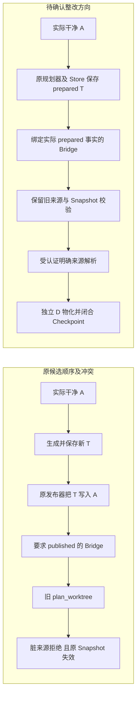
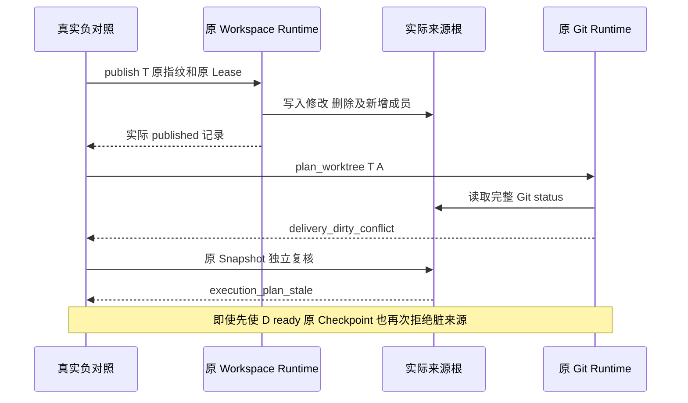
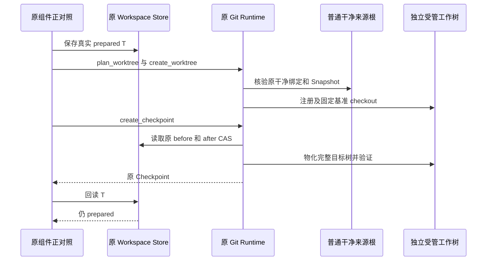
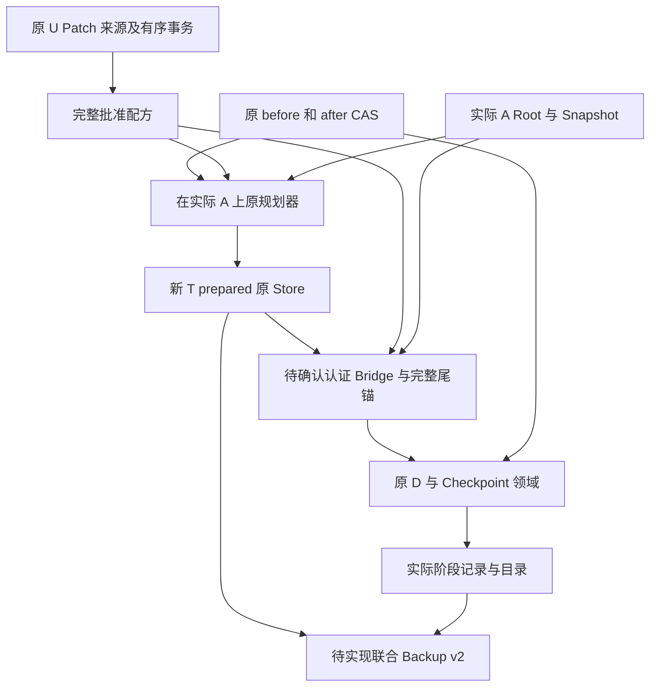
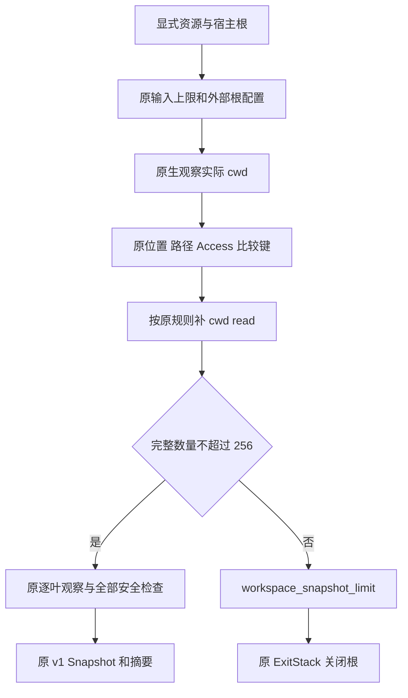
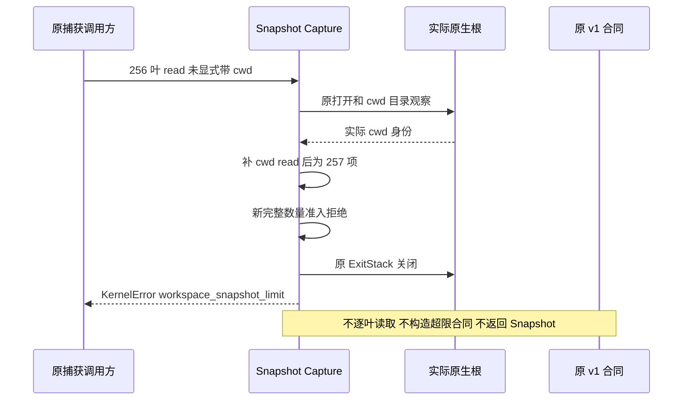

# Git 派生事务顺序、来源解析与资源容量整改设计

## 1. 文档摘要与需求背景

完整产品交付将用户根 U、干净来源锚 A、交付工作树 D 分开；目标是在不收集无关用户修改的情况下，
完成多 Patch、Checkpoint、独立批准 Commit、联合备份及新根恢复。
当前[完整业务设计](m09-r4-git-delivery-business-backup-closure.md)要求 A 保持干净，并以 A 的实际
快照生成新派生事务 T；开发候选的 Bridge 合同又要求 T 已 `published`。
这里的 `published` 不是“事务计划已保存”，而是原 Workspace 发布器已经将所有文件成员写回来源根。
两种语义不能混用。

本文已完成原组件实测和源码核验；第 5 节是**待确认整改方案，不是已实现的新合同**。
版本 1 仅新增顺序回归、设计及限定验证事实。版本 2 增补第 11 节容量实测，以及
Snapshot 隐式 cwd 超限的正式错误准入；不修改 Git Runtime、Bridge 校验或默认产品能力。
开发候选的阶段实现不能据此视为完整 Git 产品已经可用。

## 2. 设计目标、约束和非目标

- 用原发布器、原持久 Store、真实 Git 和实际 Root 证明冲突，不用手工修改事务状态。
- 区分“保存 T”“把 T 发布到 A”“在 D 物化目标树”三个动作。
- 保留干净来源、原 Snapshot、RootIdentity、commonDir、注册、backlink、Lease 和批准保护。
- 验证调整阶段顺序是否足够；不能只让一个状态断言通过。
- 完整交付范围、原容量、期限、CAS/MAC/尾锚及独立 Commit 批准保持不变。

非目标：本次不装配默认 Git 写能力、不实现新来源解析器、不扩大资源或正文限额、不迁移业务状态、不发起模型请求、
不启动 Windows 原生运行，也不将组件测试提升为 R1～R6 商用验收。

术语：U 是原用户 Workspace；A 是固定基准 Commit 的私有 detached worktree；D 是独立受管交付
worktree；T 是在真实 A 上新生成的目标事务。正对照中的普通干净来源根不是产品 A，报告明确区分两者。

## 3. 源码核验与接口设计

| 现有接口与源码 | 实际行为 | 冲突含义 |
|---|---|---|
| [`prepare_workspace_transaction`](../../src/harnessix/delivery/planner.py) | 冻结来源 Snapshot、before/after CAS、新 UUID 与完整 Mutation；生成前后均核验来源 | T 的 `source` 是变更前的 A，不是发布后的 A |
| [`SQLiteWorkspaceTransactionStore.save`](../../src/harnessix/delivery/store.py) | 写 CAS、事务记录及事件，初态为 `prepared` | 耐久保存不等于文件已发布 |
| [`WorkspaceTransactionRuntime.publish`](../../src/harnessix/delivery/filesystem.py) | 原批准指纹及实际 Lease 下逐成员写入来源根，直到 `published` | 对 T 调用此接口会真实改写 A |
| [`GitDeliveryRuntime.bind_repository`](../../src/harnessix/delivery/git.py) | 读取完整 Git status，非空则 `delivery_dirty_conflict` | 发布后的 A 不能再作为原干净来源 |
| 同文件 `GitDeliveryRuntime.plan_worktree` | 加载 T，先绑定干净来源，再执行 `verify_workspace_snapshot(T.plan.source, A)` | 即使跳过脏检查，原 T 的变更前 Snapshot 也不再匹配 |
| [`verify_workspace_snapshot`](../../src/harnessix/workspace/snapshot.py) | 重新捕获实际 Root、cwd 与资源，完整模型相等才通过 | 发布后的 A 触发 `execution_plan_stale` |
| `GitDeliveryRuntime.create_checkpoint` | 再核验来源绑定，以私有 Index 构造完整树，再在 D `read-tree --reset -u` 并验证内容 | 提前创建 D 仍不能绕过后续来源保护；原组件并不要求 T 已发布 |
| `GitDeliveryRuntime._repository_root_from_binding` | 只检查实际 commonDir 的邻接候选，并要求来源路径摘要匹配 | 私有 A 不在邻接位置，清洁且真实注册也不能被该旧推导定位 |
| `GitDeliveryRuntime._capture_worktree_binding` | 验证真实 gitfile/admin/common/backlink；将内部来源解析错误包装为 `git_worktree_binding_invalid` | 对外错误不能误写成未经包装的内部错误码 |

开发候选 `product_config/git_delivery_contracts.py` 的 `ProductGitDeliveryLink.complete_stage` 仍要求
存在 Bridge 时 `projection_transaction.state == "published"`；其 `ProductGitNativeBridge` 说明具有相同前提。
这些候选文件尚未作为本次变更合入主仓，不把路径文本冒充现行主仓源码链接。
候选与主仓本次使用的原 `git.py`、`planner.py`、`filesystem.py`、`store.py` 和复用 Git 测试夹具逐字一致。

## 4. 总体架构与已证明的失败流程



**图示说明与源码映射：** “原候选”分组使用表中原 `publish`、`bind_repository` 和 `plan_worktree`；
“待确认”分组仅为建议结构，组件“受认证明确来源解析”尚未实现。T 保存到 Workspace Store，
Bridge 保存到 GitDB；两者不是一个全局事务。D 物化属于 Checkpoint 的外部 Git 效果，不能改名为 A 发布。



**图示说明与源码映射：** 这是本次实际执行的顺序，不是拟议实现。
两个错误分别来自原 Git 绑定和 `verify_workspace_snapshot`，均没有被删除或替换。
发布后记录通过原 Store 回读，A 文件确实改变；另一根 U 保持原 HEAD 和干净状态。



**图示说明与源码映射：** 这是原组件普通干净来源的实际正对照，使用原 `_checkpoint` 夹具；
另复用原完整 Commit 测试核验新 Ref、父 Commit、确定性 Commit 和来源保护。
它不证明私有 A 已能驱动上述全过程。真实私有 A 的额外负对照表明旧来源推导失败，D 登记效果保留在 `creating`。

## 5. 待确认整改方案、数据结构与领域契约

建议一次解决两个独立边界，而不是仅把 Bridge 的 `published` 字符串改成 `prepared`。

1. **T 语义归正。** 原规划器在 A 上生成 T，原 Store 耐久保存 `prepared` 记录；
   Git 投影路径不调用 Workspace 发布器改写 A。Bridge 证明的是完整配方、实际 A、新 T 和原批准之间的关系，
   不声称 T 的文件已向 A 发布。D 的物化成功由原 Worktree/Checkpoint 事实独立证明。
2. **明确来源解析。** 产品适配仅从已认证阶段的 A 登记得到明确路径，重新验证实际 RootIdentity、
   路径摘要、commonDir、注册、backlink、HEAD 和干净状态。不得向模型暴露任意来源参数，不进行目录搜索，
   也不得仅凭内容相同接受另一根。旧普通干净来源入口及完整负对照继续保留。
3. **批准及恢复不变。** 新 T 不能归入用户 Patch 成功集合，不能复用 Patch 批准。
   Checkpoint 使用原完整 Review/Router 批准和父 execute claim，Commit 仍要求独立新批准。
   历史 `prepared` T 不能在启动或恢复时被自动送入 Workspace 发布器；产品角色必须通过认证关联核验。
4. **显式兼容边界。** 候选 Bridge/Link 的语义与摘要绑定必须共同复核并版本化。
   未核验的旧 Bridge 不自动转换、不补签、不假设安全；本次不确定新 wire 版本或迁移实现。
   公开前需要完整类型、前缀、Owner/Scope 关系与备份读取矩阵。

| 重点字段或事实 | 拟议要求 | 必须保持的权威 |
|---|---|---|
| T `transaction_id` | 新 ID，与原用户事务分离；在效果前冻结并耐久登记 | 原事务 Planner/Store 与完整配方 |
| T `plan.source` | 实际 A 的变更前 Snapshot，Root 及全部资源不改写 | 原 Snapshot 捕获器 |
| T `mutations` | 首 before、末 after、模式、完整 CAS 与批准净 Mutation 全等 | 原来源投影与完整 Review |
| T `state` | `prepared` 表示已保存，不代表 A 或 D 已物化 | 原 Workspace 状态机 |
| Bridge `projection_transaction_digest` | 绑定原 Store 的真实记录字节及实际状态，不能构造替代记录 | 原 Reader、MAC 与完整尾锚 |
| Bridge A 登记 | WorkspaceRoot 与 GitRoot 分别按原算法验证，不强求两套身份摘要相等 | 各原生观察器与认证 Root 关联 |
| D/Checkpoint 位置 | 原领域实际记录和真实树；不得从 T 状态推断交付成功 | Git 领域 Store 与外部观察 |
| 恢复后的执行权 | 历史可读不等于原根可执行；新根重绑及新批准仍必要 | 原恢复及产品授权控制 |

## 6. 持久化、事务与数据流程



**图示说明与源码映射：** Planner/CAS/T 对应原 `planner.py` 和 `store.py`；D/Checkpoint 对应原 `git.py`。
Bridge、产品阶段记录及联合备份箭头是待完成产品接线，不能视为现行原子发布能力。
GitDB 的一修订需要领域记录、Link、MAC、完整 catalog 和尾锚共同提交；Workspace Store 和外部 Git
不参加同一 SQLite 事务。保存 T 后 GitDB 确认丢失时，应保留实际记录和在途阶段，后继只读核对，不能再次任意生成 T。

### 6.1 阶段与原状态的对应

| 产品阶段 | 真实领域事实 | 后继要求 |
|---|---|---|
| `anchor_ready` | A 已实际创建且完整验证 | 原批准及父操作仍有效 |
| `native_patch_intent` | 新 T 的完整计划意图已耐久冻结 | CAS、A Snapshot、配方关系无漂移 |
| `native_patch_prepared` | 原 Store 存在对应真实 `prepared` T | 不是 A 文件发布结果 |
| `native_bridge_closed` | 拟议新 Bridge 将上述事实完整认证绑定 | 顺序语义待确认，当前候选仍有冲突 |
| `delivery_worktree_ready` | D 有完整实际登记和绑定 | 私有 A 明确解析尚需实现 |
| `checkpoint_closed` | D 目标树实际物化且原领域记录闭合 | 再独立规划、审查与批准 Commit |

后四阶段本次均未实现或宣布完成。原 Workspace `prepared→publishing→published` 状态机不改，
不得借新增产品阶段向原 Store 写入虚假状态。

## 7. 核心逻辑伪代码、失败恢复、取消与超时

```text
原候选负对照：
    T = 原规划器(A, 全部目标CAS)
    原Store保存(T)                        # prepared
    原发布器.publish(T, A, 原指纹, Lease) # 真正改写A
    原Git.plan_worktree(T, A)            # 必须拒绝脏源
    原Snapshot.verify(T.source, A)       # 必须独立拒绝快照漂移

待确认产品整改：
    验真原来源、完整Review、批准、父claim、Scope、Lease和原绝对期限
    冻结并提交新T意图
    由原规划器在实际A生成T；耐久保存prepared记录
    完整回读T/CAS/实际A；在原GitDB事务闭合认证Bridge
    从认证A登记明确解析来源；保持原所有Git根和回链验证
    原领域在D物化目标并提交真实Checkpoint
    未知效果或确认丢失 -> 保留事实，只读对账，不重放高风险动作
```

- **脏 A 或快照漂移：** 原固定错误拒绝，不刷新来源计划后冒用旧批准。
- **私有来源无法解析：** 原创建可已登记 D，但绑定未闭合；实测保留 `creating`，不能报 `ready`。
- **T/CAS 保存确认丢失：** 验真原 ID 和完整关系；不补造成功、不重新选择另一个 UUID。
- **取消/超时：** 拟议 T/Bridge 继续使用原父操作绝对期限、维护上限和 Owner 排空结算；
  本次同步原组件试验不证明新产品阶段的合作取消或硬退出恢复。
- **恢复：** 当前试验无产品恢复实现；后继必须验证 T 角色、历史只读、实际根重新授权和 Backup v2 关联一致性。

## 8. 安全、信任边界和可观测性

新 T 不是授权能力，普通模型及指纹字符串不能授予跨根执行权。
明确解析器必须绑定既有认证计划及原生观察，不将裸路径提升为权威，不删 Root/Snapshot/clean/backlink 检查。
验证只使用临时本地仓库、原组件指纹和真实 Lease，不声称拥有产品 Session/Router 联合批准。
本次没有读取凭据、发起模型请求、修改费用、抓取原 Windows raw/stderr/CDB 或修改用户仓库。

公开证据只含结果、范围、源码及私有原件摘要；完整临时 Root、记录和源码快照在私有验证目录。
`delivery_dirty_conflict`、`execution_plan_stale`、`git_worktree_binding_invalid` 是本次实际公开组件错误；
`git_repository_changed` 是额外直接只读调用来源解析器的内部拒绝，不混为同一层异常。
成功计数是预期正反例的回归结果，不是目标 Git 产品成功率。

## 9. 测试验证、验收与源码映射

本次新增[四项顺序回归](../../tests/delivery/test_git_projection_ordering.py)，复用原 Git 夹具：

| 测试 | 实际判据 | 不能据此证明 |
|---|---|---|
| `test_published_projection_on_real_anchor_rejects_old_plan_and_snapshot` | 真正 detached 私有 A、新 T、原发布及回读；原两项拒绝独立成立，U 未改变 | Bridge 或产品 A 全链已可执行 |
| `test_old_checkpoint_materializes_target_without_publishing_source_transaction` | 普通干净来源下 D 实际物化完整新增/删除/修改，T 仍 `prepared` | 私有 A 来源解析已修复 |
| `test_publishing_after_worktree_ready_still_rejects_checkpoint` | D ready 后再发布来源，原 Checkpoint 拒绝且未保存结果，D 保持基准内容 | 调整顺序足以满足旧合同 |
| `test_clean_private_anchor_needs_explicit_source_resolver` | 真正干净私有 A 可规划；D 创建后原回链绑定拒绝，实际 `creating` 效果保留 | Windows 原生或新解析器通过 |
| 原 `test_managed_worktree_checkpoint_and_commit_preserve_source` | 复用原完整 Checkpoint/确定性 Commit/新 Ref/父 Commit/来源保护正对照 | 默认产品 Commit 已装配 |

开发候选的首次四项运行为 3 通过、1 失败：新测试错误期待未包装的内部错误码。
仅修正新增测试，未改生产源码或旧断言；最终五项通过，477 件输入前后零漂移。
主仓重新执行同一五项，结果及输入范围见[正式验证记录](../validation/git-projection-ordering-2026-10-03-v1/README.md)。
候选和主仓结果分列，不相加为新的十项验收。原失败日志、源码和结果均保留。

实施后另需产品真实联合批准、父操作认领、过期/换代 Lease、错 Root/漂移、缺 CAS、
跨库确认丢失、各意图边界硬退出、取消及超时、多 Patch 完整树、独立 Commit、联合备份与新根恢复矩阵。
本次不把这些待实施项记为通过。

## 10. 部署、兼容、回退与风险取舍

顺序专项仅包含测试和文档；版本 2 的 Snapshot 准入只统一原超限错误，不改变公共 Schema、配置或依赖。
成功 Snapshot 的算法、规范化、字段、排序和摘要保持；无需状态迁移，回退程序也不产生新的数据格式。
原产品能力保持关闭；已有状态及冻结证据不重写。新 Bridge 语义未确认前不修改当前校验。

推荐方案复用原领域契约，代价是需要明确区分投影计划、D 物化及历史角色，并补认证 A 来源解析。
拒绝以下替代：假填 `published`、删脏状态检查、刷新 Snapshot 冒用原批准、给 U/T 换身份、
仅提前创建 D、复制外部仓库到备份、以降低业务范围绕过冲突。

两项冲突证明更改阶段语义确有必要，但不证明方案已经获得架构确认或完整实现。
后继顺序为：确认 T/Bridge 语义与兼容边界 → 实现 T 耐久准备 → Bridge 认证 → 明确 A 来源解析和 D
→ Checkpoint → 独立 Commit → 联合 Backup v2 与新根恢复 → 三平台及真实用户验收。

## 11. 完整资源容量核验与 Snapshot 错误准入

### 11.1 背景、目标及实测范围

Git 来源选择每个叶的 read 观察，Workspace Planner 则增加每叶 write 及全部父目录 read。
二者受同一个 Snapshot 256 项合同限制，但资源扩张量不同。只验证叶读取成功，不能证明完整 T 可准备。
本节使用真实微小普通文件、原捕获器和原 Planner，不构造替代 Snapshot，不拆 T，不裁剪父目录。
普通叶读表示不是完整产品 Session/Router、批准、父认领或 Lease 的成功证明。

| 文件布局 | 原叶读 Snapshot | 原 Planner 输入或返回 | 原始结论 |
|---|---:|---:|---|
| 127 个不同单层父目录 | 128，捕获及复核通过 | 255，127 mutations，返回 | 边界内正对照 |
| 128 个不同单层父目录 | 129，捕获及复核通过 | 257，`workspace_snapshot_limit` | 读集合可表示，完整写规划不闭合 |
| cwd 内 255 个叶 | 256，返回 | 256，255 mutations，返回 | cwd 父观察合并后仍在限额内 |
| cwd 内 256 个叶 | 隐式 cwd 后原合同异常 | 257，`workspace_snapshot_limit` | 资源数超限，不是正文或 mutation 超限 |

128 个叶的 before/after 镜像合计仅 1664 字节；单文件 8 MiB、总镜像 32 MiB 和
mutation 256 项限制均未触顶。原新测试 8 项通过，独立复跑附带 4 项既有回归共 12 项通过；
两组重叠，不累计。主仓再次执行原 12 项，结果保留为修复前基线。

### 11.2 原因、当前实现与明确未解决事项

原 [`capture_workspace_snapshot`](../../src/harnessix/workspace/snapshot.py) 在补 cwd 前只检查
显式请求数。256 个叶请求会在随后补入 cwd/read，最后构造 257 项的
[`WorkspaceSnapshot`](../../src/harnessix/workspace/contracts.py)，抛出 Pydantic
`ValidationError / resources / too_long`，而不是调用方已有的 `KernelError` 错误合同。
原异常日志及源字节保持只读，不将历史结果改写成修复后的错误。

当前仅增加第二次数量准入：完成原 cwd 观察和平台比较键计算，按原规则补 cwd/read，
然后在逐资源 native.observe 前检查完整请求数量。超过 256 返回原 `workspace_snapshot_limit`。
未返回 Snapshot，不开始逐叶正文读取；已打开的主根和外部根由原 ExitStack 退出关闭。
这修复错误分层，**不解决父目录扩张造成的完整 T 容量缺口**。

完整容量兼容方案仍待设计：必须同时覆盖来源、全父目录安全观察、Planner、记录编码长度、
Store/CAS、审批指纹、Bridge、旧 Reader 和备份。禁止增加业务拒绝来宣称所有原可表示叶集合闭合，
禁止拆事务、截断 parents 或仅提高某一个常数后忽略下游合同。

### 11.3 接口、字段、源码和核心逻辑

公共签名、`harnessix.workspace-snapshot/v1` 和 `selected-resources-sha256/v1` 不变。

| 源码或变量 | 当前职责与关键约束 |
|---|---|
| `snapshot.py::capture_workspace_snapshot` | 原输入和 cwd 补齐后的完整数量分别准入；不改变路径、根、正文观察 |
| `resources` | 显式原请求，最多 256；保留数量，不用去重集合掩盖重复 |
| `cwd_key` / `keys` | 位置、原平台路径比较键、access 三元组；仅完全相同的 Workspace cwd/read 可抵扣隐式项 |
| `requested` | 原请求加至多一个 cwd/read；新检查使用该列表的真实长度 |
| `WorkspaceSnapshot.resources` | 仍为不可变观察元组，`max_length=256`，字段及排序不变 |
| [`paths.py::path_comparison_key`](../../src/harnessix/workspace/paths.py) | POSIX 大小写敏感、Windows casefold；保留原规范化与非法路径拒绝 |
| [`planner.py::prepare_workspace_transaction`](../../src/harnessix/delivery/planner.py) 的 `resources` 构造 | 叶 write 和完整父目录 read，按原 path/access 合并；本修订不改 |
| `ExitStack` | 超限及任一原校验失败均释放实际原生根，不新增持久化或外部效果 |

```text
原显式输入或外部根超过上限 -> 原限额错误
打开原生根，验真外部访问配置，观察实际 cwd
计算原位置/平台路径/access 键
缺少 Workspace cwd/read -> 追加原请求
完整 requested 数量超过 256 -> 原限额错误，退出并关闭根
否则 -> 原逐项重复、位置、访问、原生观察、正文预算检查
        -> 原排序、字段和摘要 -> 原不可变 Snapshot
```

非 read 访问、外部 location 或另一目录不能代替 cwd/read。数量合格时重复资源仍走原
`workspace_snapshot_duplicate`；数量已经超限时限额拒绝优先于后续成员错误，不承诺继续读取非法集合。
原 cwd、外部配置及路径键计算发生在新准入之前，其拒绝语义不移动。

### 11.4 流程、失败时序与数据边界



**图示说明：** 新增点仅是完整数量门；Snapshot 合同、原生端口、摘要和持久消费者位于原链路，
拒绝分支没有文件写入、CAS 写入或领域 Store 提交。Planner 的父目录扩张在进入本图之前发生，尚未修复。



**图示说明：** 时序对应新增的 POSIX 旁观用例：只记录调用路径，原观察方法仍真实执行，
实际仅观察 cwd；没有模拟 Root 事实或 Snapshot。该旁观测试不能替代 Windows 原生验收。
合法 255 叶的显隐 cwd 请求则得到逐字段相等的 256 项 Snapshot，并由原 verify 重新捕获通过。

### 11.5 测试、持久化、部署与回退

新 [`test_snapshot_capacity.py`](../../tests/workspace/test_snapshot_capacity.py) 覆盖完整合法边界、
显隐 cwd、非根 cwd、access 隔离、外部 location、另一目录、原逐叶观察顺序和原重复拒绝。
原代码上 10 项为 4 通过、6 失败；失败日志保留。新增
[`test_git_projection_capacity.py`](../../tests/delivery/test_git_projection_capacity.py) 保留父目录拒绝，
只有隐式 cwd 用例按当前正式错误更新，原测试字节和修复前基线独立冻结。

没有新增数据库、表、事件或 CAS；失败请求不持久化新 Snapshot，没有 UNKNOWN 外部效果需要重放。
同步捕获函数的取消/期限仍由原上层控制，本修订不宣称增加合作式取消。
部署无需迁移；回退会恢复原隐式 cwd 合同异常，不允许以回退为由扩大有效资源范围。
实际验证结果、源码和原失败摘要见[容量专项验证](../validation/git-projection-capacity-2026-10-03-v1/README.md)。
Git 默认能力、完整 T、Bridge、Checkpoint、独立批准 Commit、Backup v2、Windows、R3、Beta 和
商用 R1～R6 仍未由本专项完成。
