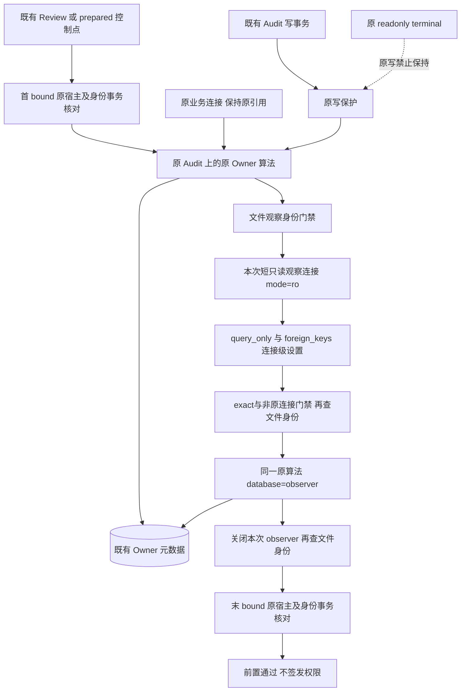
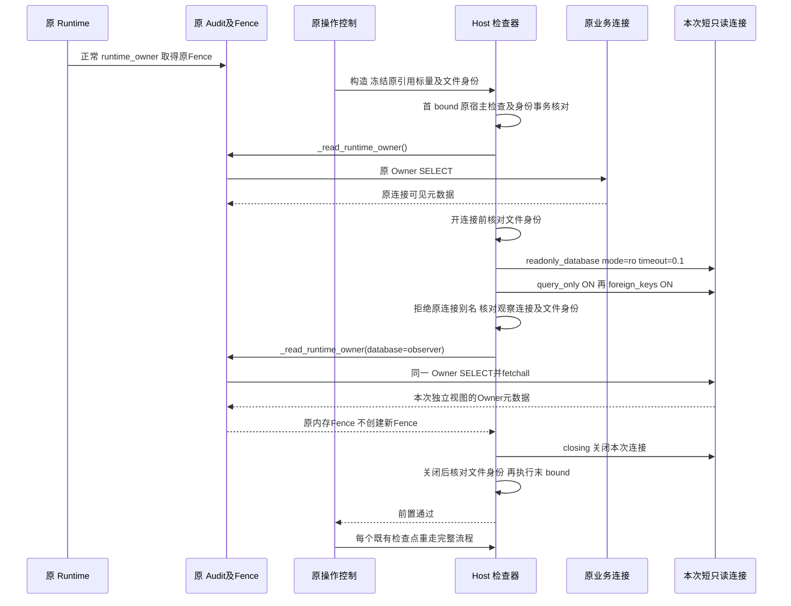
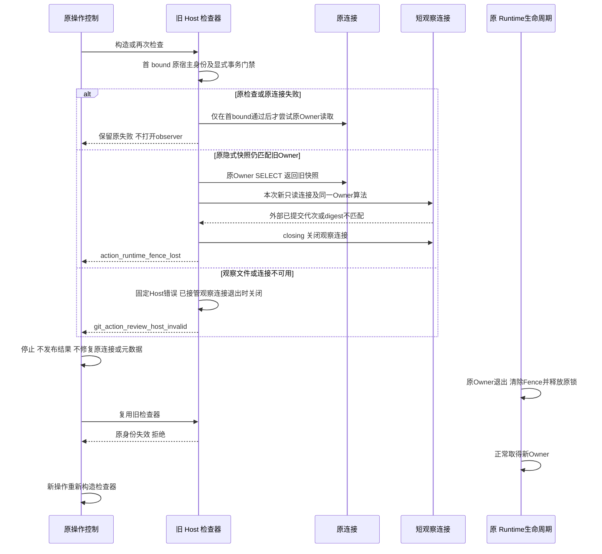
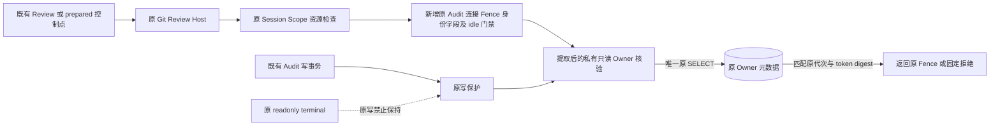
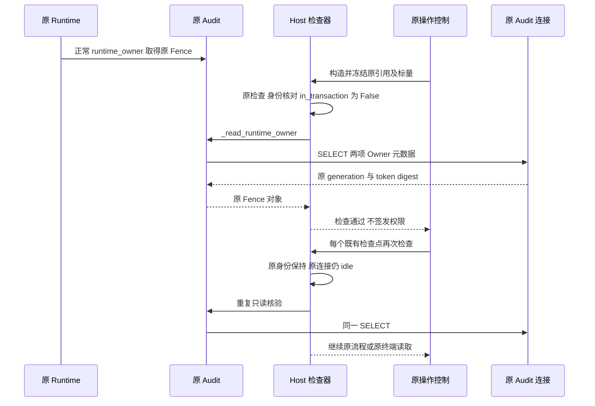
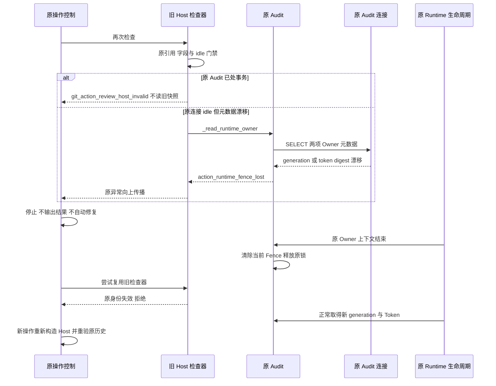
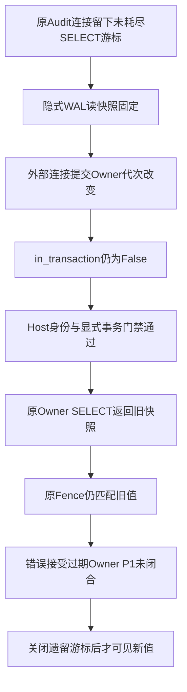

# Git 原所有权只读前置接线详细设计

## 1. 变更摘要

**接口实现状态：`reviewing`，限定同候选安装验证已完成，整体Owner门禁仍待评审。** r2源码定向36项通过/115.26秒、mypy504源通过，安装domain1009项通过/24.95秒；安装targeted36项通过/119.52秒、治理1413项通过/40.36秒。r1/r2原associated因验证宿主隔离冲突已中断，原件保留，不作为产品FAIL或验收；同candidate、label独立basetemp的全新r2 associated复验59项通过/1824.63秒。r1的32/1009/pure4、500次成本及真实清理反例1失败仍仅作历史，不验收最新r2或全部B7。本版正式修订原“不新建第二连接／核验只有SELECT”合同：原Audit/_db/Fence与写保护保持，补充短只读观察连接，不新建第二Store、不替换授权身份、不修复原连接，不静默宣称满足旧合同。

`code_revision` 是源码研究基线，不是新增候选的安装验证提交或发布批准。本文沿用[重大变更模板](../governance/templates/change-design-template.md)十四节结构，覆盖[原 approved-link 设计](m09-r4-git-approved-link.md) §8.3 与 B7 的原所有权前置子项。旧候选隐式快照失败、本版限定源码与安装成绩分别登记于第12.1节。

| 项目 | 内容 |
|---|---|
| 需求/缺陷 | 原连接保留未耗尽游标时，`in_transaction=False` 与重复 SELECT 不能证明 Owner 新鲜性 |
| 当前问题 | 原对象身份连续，但原连接隐式 WAL 旧快照仍能返回已过期 generation/token digest |
| 目标结果 | `bound()` → 原连接原算法 → 本次新只读连接上的同一算法 → `bound()`；任何阶段失败即停止 |
| 影响模块 | trusted_actions 的私有连接选择；product_config 的短观察与文件身份门禁；workspace 仅为兼容边界 |
| 兼容级别 | 私有 `_read_runtime_owner` 增加 keyword-only 可选参数；公开 Host 签名、Schema、Token、事件和批准事实不变 |
| 发布/回退单元 | 两个核心模块配套交付；复用现有 `readonly_database`，无数据库迁移或数据回退 |

## 2. 需求背景与证据

研究基线固定为本地提交 `03529962a63dfc7818d6b0d0b6874d4e9fc118a3`。本次核对时本地 HEAD 为该提交；研究与候选差异通过本地源码比较，不推断远端实时状态。此基线已经包含 `_read_runtime_owner()` 提取、Host 原引用/字段冻结、显式事务拒绝与原连接 SELECT，不应再描述为“Host 完全未查询 Owner”。更早的 `12e30d333334234c1ad73789f392aee4c7bedf36` 研究与安装成绩仅属于[旧限定验证报告](../validation/git-owner-fence-2026-10-07-v1/README.md)的固定输入。

原核验先读内存 `_runtime_fence`，按 `_require_runtime_owner` 处理 None，再查询 `action_audit_metadata` 两项键并比较 generation 字符串与 Token 的 SHA-256。原 `_assert_runtime_owner()` 首条仍为 `require_store_write_allowed(self)`，随后不传新参数地调用读取方法；正常 `save_plan()` 的 `BEGIN IMMEDIATE` 内写核验照旧。`terminal_read_scope()` 禁止原 Audit/事务资源写入口，不能以绕过写保护代替只读核验。

旧基线专项 SDK 反例记录为 **1 失败，20.72 秒**：原 Audit 保留未耗尽 SELECT，外部 WAL 提交 Owner 改动，原连接仍无显式事务且原 Host 接受旧值。这是旧单连接候选的真实目标断言失败，不是本版短观察候选的结果。初次 SDK 尝试因 AppleGit 工具失败未形成有效目标断言记录，归为工具/环境失败，不能写成产品 Owner 门禁失败。更早归档包的计时与该次基线复现独立，不混用为同一次结果。

原prepared Ledger另有操作窗口独立监视连接；单独Host反例不证明全部门禁绕过。短Owner观察不替换observe_prepared_state、事务代际或原认证。r1另有真实清理反例 **1失败**：factory先重绑audit._db，再返回construction冻结original，r1会关闭原连接；它与035旧隐式快照1失败/20.72秒是不同反例。r2已修复并有36项源码绿灯，最终安装仍待验；r1通过/失败记录均保留，不移用为r2成绩。

## 3. 设计目标、非目标与验收标准

| 设计目标 | 可执行验收要求；已知限定成绩与未完范围见第12.1节 |
|---|---|
| 单一 Owner 算法 | 只增加局部 `connection` 选择；原 None/require、固定 SQL、digest、错误码与原 Fence 返回保持，Host 不复制授权算法 |
| 原身份连续 | 原 Audit、exact 原连接、原 Fence 与三个标量首末核对；同字节替身、require 降级、关闭或字段漂移拒绝 |
| 独立当前读视图 | 原连接隐式旧快照仍匹配时，本次新观察查询对外部已提交 Owner 漂移/缺项报 `action_runtime_fence_lost`；构造与重查均覆盖 |
| 原检查不可修复 | 原 `bound()` 或原连接读取失败，观察工厂不得被调用；observer 不能代替原 `_db` 或赋予新 Owner |
| 受限只读与生命周期 | 每次新开 `mode=ro` 连接，初始化两项连接级 PRAGMA；只读 Owner 查询，无业务 DML/DDL、初始化 Store、签发、checkpoint 或主动事务结束；已接管 observer 正常/异常均关闭 |
| 原写保护与事务不退化 | `_assert_runtime_owner()` 仍先写保护并使用默认原连接；共享读取允许原写事务，Git Host 的显式事务拒绝不扩大为全局禁事务 |
| 文件观察门禁 | 冻结已有普通文件 dev/ino；观察点可见的变化、叶符号链接或 reparse 拒绝，不冒充 OS FD 认证 |
| 生命周期隔离 | 原 Owner 退出后旧检查器失效；新 Owner 由正常 Runtime 取得并重新构造操作，旧闭包不改绑 |

非目标：不关闭全部 B7、OS FD/文件锁认证、文件或对象 ABA、查询后的永久所有权、全部 dispatch 屏障、approved 事实 Writer、B4 或 R3 商用门禁；NativeBridge、A/T/D、Commit、Backup2、跨库强一致性和商业发布仍不在本子项验收范围。不扩展 Session/Scope 授权，不改变终端 Task/线程/active、父闭包读取与共享回调隔离，不新增配置开关或自动修复通道。

单用户Beta先导由项目用户自行承担；独立Beta门槛保持不变，先导反馈不替代独立Beta验收，本变更不修改该发布条件。

## 4. 当前实现与根因

研究基线调用链为 `ProductGitReviewProvider.review()` 或 `ProductGitPreparedLinkLedger._control()` → `require_git_review_host()` → 原用户宿主检查与身份/显式事务门禁 → 原 Audit `_read_runtime_owner()`。原写路径另为 `_assert_runtime_owner()` → 同一读取算法。

前一阶段拆分“写入口许可”和“Owner 元数据核验”解决了终端可读性，却没有解决隐式快照：未耗尽 SELECT 可持续固定原连接的 WAL 读视图，`in_transaction` 不报告这类隐式读快照。随后同连接 Owner SELECT，甚至该窗口内同连接 `PRAGMA data_version`，仍可能看到旧值；再查一次或缓存该标志不能解除根因。

本版不终结遗留游标、不提交/回滚原事务，也不猜测 CPython/SQLite 句柄。它先保留原连接原算法核验，再让本次新打开的只读连接执行同一算法，避免原遗留 statement 固定新观察的读视图。观察只说明其读快照建立时可见的已提交事实，不锁定后续永久 Owner。

窄审查另发现两项资源归属缺陷并形成r2：P2为观察工厂先将 `audit._db` 改为 other 再返回冻结原连接，若只比较当前 `_db`，会误把冻结原连接交给 closing；因此新增必传 keyword-only `original`，只来自Host构造时冻结的database，不得在factory返回后重新从audit._db捕获，同时拒绝冻结原连接与当前 `_db`，二者均不关闭。P3为拒绝 Connection 子类时的资源清理；当前以 `sqlite3.Connection.close(observer)` 原生基类关闭独立子类，不调用可覆盖的 `observer.close()`，避免执行子类回调。任意非 Connection 对象仍不接管或调用其清理回调。

| 既有约束 | 本版处理 |
|---|---|
| `runtime_fence` 属性返回深拷贝 | 仍冻结内部原 `_runtime_fence` 引用，不用副本认证 |
| None Fence 与可选 Owner | 原算法保留 None/require 分支；Git Host 仍拒绝缺少活跃 Fence |
| `acquired_at` 不在持久查询中 | 仅冻结内存标量，不虚构持久时间认证或租约 |
| 原写核验在 `BEGIN IMMEDIATE` 内运行 | 默认仍用原连接；显式事务拒绝仅在 Git Host |
| `runtime_owner()` 取得锁并写 Owner | 只由正常 Runtime 生命周期调用；观察不进入该上下文 |
| 只读连接 helper 已存在 | 复用 `sqlite_readonly.readonly_database`，不新增第二实现或初始化 Store |

## 5. 总体架构与模块职责

本节及第6节为**版本4修正候选**的新图；版本3的原四图完整保留在第12.2节，并统一标为旧候选历史，不用于描述当前修正路径。



图示为P2/P3修订后候选成功路径，不是旧基线能力或全部验收结论。`R1/R2` 是同一个 `ActionOwnerFenceMixin._read_runtime_owner` 的两次调用；`D`仍是唯一原 Store 的业务/Owner身份连接，`V`只是附加观察资源。Q同时排除Host构造冻结的原database与当前audit._db；子类走原生清理拒绝分支，不沿成功箭头进入Owner查询。正常Runtime锁/Owner写入不属于新增核验区间。

职责归属：trusted_actions 维护唯一算法、原写准入与 Owner 生命周期；product_config 组合首末原宿主核对、文件观察与短连接生命周期；sqlite_readonly 提供既有连接级只读配置；workspace 不提供新授权、不改终端作用域。数据流为原 Router → 原 Audit/连接/Fence/标量及路径身份冻结 → 原查询 → 本次独立查询 → 关闭 observer → 原身份复核，不发布事件、Artifact、回执或新 Token。

### 5.1 正式受限合同修订

| 原版本3合同 | 本版版本4合同 | 保持不变的边界 |
|---|---|---|
| “不新建第二连接” | 允许每次 Host 检查新增一个短生命周期只读观察连接；不缓存、不跨检查复用 | 不构造第二 Audit Store，不替换原 `_db`/Fence，不产生第二 Owner、授权身份或写入口 |
| “核验只有 SELECT，不发 PRAGMA” | 原连接算法及观察算法各只有一条固定 Owner SELECT；完整观察建立区间还执行 `PRAGMA query_only = ON`、`PRAGMA foreign_keys = ON` | 两项为新连接级设置，不修改原连接；不发业务 DML/DDL、BEGIN/COMMIT/ROLLBACK、迁移或 checkpoint |
| “零副作用” | 限定为无逻辑业务/Owner 写入、无授权与生命周期替换 | 允许 mode=ro 的 SQLite WAL/SHM 锁协调，不宣称物理零触碰或无 SQLite 内部锁；`total_changes=0` 不能证明这些命题 |

这是由真实隐式快照反例驱动的正式受限设计修订，状态仍为 `reviewing`；不能静默改写旧合同后宣称旧要求全部满足。原连接与新观察查询同时保留：原连接不健康、原身份无效或显式事务存在时，必须先失败，不能靠健康 observer 掩盖。

### 5.2 复用与取舍

| 方案 | 优点 | 缺点/风险 | 结论 |
|---|---|---|---|
| 原 `_assert_runtime_owner()` 直接接 Host | 无新算法 | 终端读被写保护拒绝；绕过保护扩大能力 | 拒绝 |
| 在 Host 复制 Owner SQL/digest | 接线直接 | 分支/错误/摘要漂移，形成第二授权算法 | 拒绝 |
| 只信原连接 idle 并重复 SELECT/data_version | 原引用不变 | 未耗尽游标仍保留隐式旧快照，旧候选已有反例 | 仅保留原检查，不能独立证明新鲜性 |
| 替代第二 Store、重绑 `_db` 或复制 Fence | 看似取得新视图 | Store 初始化、资源/授权身份替换或自动修复 | 继续拒绝 |
| 结束原游标/提交原事务或全局禁止事务 | 可能解除旧快照 | 侵入调用方资源，破坏原写事务与只读合同 | 拒绝 |
| 原查询后补充短只读连接上的同一算法 | 独立于原遗留游标，原身份与原失败保持 | 每点增加连接/文件观察成本，PRAGMA 合同调整，仍有竞态 | 本版候选；源码限定反例闭合，其他验证不外推 |

## 6. 正常、失败与恢复时序

### 6.1 正常时序



构造阶段 `check()` 即运行一次，不先返回未经检查的闭包；以后每次重新开 observer 并关闭，不缓存通过结论。首末 `bound()` 均先执行 `require_git_user_authority()` 返回的原检查，再核对原 Session token、Publication/Guard/Protection、Reader 合同、原连接/Fence/标量与 require=True。`in_transaction=False` 仅排除显式事务，不证明不存在遗留游标。

成功返回 None 只表示该检查点前置通过，不等于 approved、执行、提交或永久 Owner。正常 Runtime 取得 Owner 的写入与 Host 的两次查询分开计量；原业务连接从未重绑为 observer。首末 bound 不增加 Owner SQL，因此原连接“构造一次＋重查一次”的两条 SELECT trace 合同无需修改。

### 6.2 失败与新 Owner 恢复时序



原连接持久元数据失配直接保留原 `action_runtime_fence_lost`，不进入观察阶段；原连接属性/SELECT 的底层错误也不由 observer 重试或修复。观察阶段的 SQLite/OSError 映射为固定 Host 错误且不暴露底层正文；原 Owner KernelError 经正常 closing 向上传播。观察 SQL 错误或 Owner 拒绝均关闭已接管的本次 observer；异常路径不执行成功末 bound。

工厂返回Host构造冻结的 `original` 或当前 `audit._db` 时，在 closing 前拒绝且不关闭；即便工厂先重绑当前 `_db`再返回冻结原连接，也适用此规则。独立Connection子类拒绝，但由原生 `sqlite3.Connection.close(observer)` 关闭，不调用覆写close；任意非Connection不接管。helper第一/第二PRAGMA失败由helper自行关闭新连接，它尚未交给Host的closing。observer close不结束原游标/事务，新Owner仍由原Runtime恢复；取消与期限边界见第8.2节。

## 7. 接口设计与数据结构

以下为已核对候选源码的契约描述，不将新增能力追记为研究基线能力。

| 接口/结构 | 研究基线 | 本版候选契约 | 兼容与回退 |
|---|---|---|---|
| `ActionOwnerFenceMixin._read_runtime_owner(self, *, database: sqlite3.Connection \| None = None) -> ActionRuntimeFence \| None` | 无参数，只读原 `_db` | None 处理后仅设局部 `connection = self._db if database is None else database`；复用原 SQL、fetchall、digest、错误及原 Fence 返回 | 参数仅 keyword-only；不赋值 `_db`，不新增模型、导出、写保护或事务禁令 |
| `_assert_runtime_owner()` | 写保护后默认读取 | 顺序与默认调用不变，不传 observer | 原写点仍用原连接，原 BEGIN IMMEDIATE 正控保持 |
| `_audit_file_identity(path) -> tuple[int, int]` | 不存在 | `lstat()`；普通文件且无 `st_file_attributes & 0x400` 才返回 dev/ino | 叶符号链接/非普通文件/reparse/不可用拒绝；不是 FD 认证 |
| `_read_fresh_owner(audit, path, identity, *, original: sqlite3.Connection) -> None` | 不存在 | 必传Host构造冻结原database；每次开前核对文件，排除冻结original/当前_db；子类原生清理后拒绝；exact独立连接接管后核对事务/文件、同算法读取、关闭、成功后再查文件 | 无第二Store、缓存、原资源替换/修复；borrowed两类连接不关闭 |
| `require_git_review_host(...) -> Callable[[], None]` | 单次原检查与原连接查询 | 参数/返回不变，冻结路径身份；首末 bound 夹住原查询和短观察 | 构造即检查；每次重验，不输出新授权对象 |
| `ActionRuntimeFence` / `action_audit_metadata` | 原模型与两项 Owner 键 | 格式、持久位置及算法不变 | 无 DDL、Store 初始化、迁移、Token 格式变化或数据重写 |

| Host 冻结项/前置 | 构造与后续检查语义 |
|---|---|
| 原 Audit | exact `SQLiteActionAuditStore`；后续由原宿主闭包核对 `router._audit is audit` 与关闭/路径状态 |
| 原 `_db` | exact `sqlite3.Connection` 原引用；首末 `audit._db is database`，原连接不处显式事务 |
| 原 `_runtime_fence` | exact、非 None 的原 `ActionRuntimeFence`；首末用 `is`，不以模型相等或副本替代 |
| generation/token/acquired_at | 独立冻结三项标量；首末逐值比较，不新增持久时间证明 |
| `_require_runtime_owner` | 每次首末均要求 `is True`，拒绝 False 与真值替身 |
| 原 Audit 路径与文件身份 | 捕获 `audit._path` 及 dev/ino；原宿主检查固定领域路径；短观察在开前、开后 Owner 查询前、关闭后核对捕获文件身份 |
| 原 Session/Scope/资源 | 保留原 token 引用、发布绑定、关闭、Reader 与端口合同；首末原检查均执行，不扩展认证域 |
| 本次 observer | exact `sqlite3.Connection`，既不是Host构造冻结database，也不是当前audit._db；两类borrowed均不关闭；独立子类原生基类清理后拒绝；Owner查询前无显式事务，仅本次持有、不写回Store |

### 7.1 数据、SQL 与连接设置区间

唯一 Owner SQL 保持为：
```sql
SELECT key, value FROM action_audit_metadata
WHERE key IN ('owner_generation', 'owner_token_sha256')
```
`fetchall()` 后转字典；两项值分别与 `str(fence.generation)`、`_token_digest(fence.token)` 比较，缺项同样失配。没有新持久字段、租约或外部输入拼接；Token 只在内存参与摘要，不作为 SQL 参数输出。

| 连接/区间 | 建立或查询配置 | 语句与效果 |
|---|---|---|
| 原 Audit 连接既有初始化 | `isolation_level=None`、`timeout=5`、busy_timeout=5000；既有 WAL、foreign_keys、synchronous FULL | 不属于 Host 新增核验区间；本版不重复初始化原连接 |
| 原连接每次核验 | 默认 `_read_runtime_owner()` | 一次固定 Owner SELECT；不追加 PRAGMA，不结束原游标/事务；首末 bound 无 Owner SELECT |
| observer 建立/初始化区间 | `sqlite3.connect(path.absolute().as_uri() + "?mode=ro", uri=True, timeout=0.1)`；未新增 isolation_level 参数 | 严格先 `PRAGMA query_only = ON`，再 `PRAGMA foreign_keys = ON`；失败由 helper 关闭新连接 |
| observer Owner 查询区间 | helper 成功返回，经 exact/distinct、事务及文件门禁后调用同一算法 | 仅一次固定 Owner SELECT；已接管后成功、SQL错误或 Owner拒绝均经 closing 关闭 |

两项 PRAGMA 为新连接级设置，不是 Owner 更新或 Schema 迁移，不改变原连接的配置。Host 本身不另行读取 flags；测试的 PRAGMA 读回不能追记为生产自证门禁。完整本次观察 SQL 顺序为“两初始化 PRAGMA → 一次 Owner SELECT”，而建立后才安装 trace 的查询区间只看到 SELECT；两者不同，不能据后一记录宣称全区间满足旧“无 PRAGMA”合同。

URI由 `Path.absolute().as_uri()` 产生，中文、空格、`#`、`%` 经编码后附加 `?mode=ro`。纯实际SQLite测试从connect返回即安装trace，验证真实URI、两PRAGMA与Owner SELECT顺序；r1安装pure4项仅为历史，当前调用增加original参数后的源码定向集合已有36项通过，r2安装结果仍待确认，不能外推全部文件/平台场景。

开前缺失/目录/文件身份替换在观察 connect 与所有观察 SQL 前拒绝。开后文件复核发生在 helper 两项 PRAGMA 之后、Owner SELECT 之前；不能误写成所有文件门禁都先于全部 PRAGMA。

### 7.2 错误与资源归属

| 条件/阶段 | 错误/传播 | 资源处理 |
|---|---|---|
| 原 Session/资源关闭、引用或路径失配 | 原 `git_user_observation_host_invalid` | 不开 observer、不重建原资源 |
| 缺 Fence、原连接/Fence/标量改变、require 降级、原显式事务 | `git_action_review_host_invalid` | 首门禁在原查询/观察前拒绝；末 bound 检出不交付 |
| 共享读取：None Fence | require=True 为原 `action_runtime_owner_required`，False 返回 None | 不查询所选连接 |
| 原/观察查询的 generation/digest 失配或缺项 | 原 `action_runtime_fence_lost` | 原失败不开 observer；观察拒绝经 closing 关闭 |
| 原 `_db` 直接关闭、原属性/SELECT 或 ASCII 摘要失败 | 保留原底层异常/原分类，不整体重分类 | 不借 observer 修复、重连或结束调用方事务 |
| 文件不可用、非普通文件、reparse 或 dev/ino 改变 | 固定 `git_action_review_host_invalid` | 开前不连接；接管后的失败关闭 observer |
| observer 是冻结original或当前audit._db | 固定 `git_action_review_host_invalid` | closing外先拒绝，两类borrowed均不关闭；不因factory重绑而误认原连接为自有资源 |
| observer 为独立Connection子类 | 固定 `git_action_review_host_invalid` | 拒绝前以sqlite3.Connection.close(observer)原生清理；不运行覆写close回调，不进入Owner查询 |
| observer 为其他非exact、非Connection对象 | 固定 `git_action_review_host_invalid` | 不接管，不调用未知对象清理回调 |
| 第一个/第二个初始化 PRAGMA 失败 | helper 关闭后抛原异常；Host 对 SQLite/OSError 固定为观察不可用错误 | helper 持有的新连接关闭，不影响原连接 |
| 观察建立/查询/关闭中的 `sqlite3.Error` 或 `OSError` | 固定 `git_action_review_host_invalid`，`from None`，无底层正文 | helper 或 closing 按阶段负责关闭；不重试 |

`_read_fresh_owner` 不吞 Owner KernelError；若 close 自身又发生 SQLite/OSError，按观察不可用分类。失败不借成功末 bound、业务发布或事务提交补偿。

## 8. 状态、事务、并发与幂等

| 状态转换 | 行为 |
|---|---|
| 原 Owner 活跃 → 元数据/引用/字段漂移 | 原查询、短观察或首末 bound 在各自观察点拒绝；不重签/补行/缓存成功 |
| 原 Audit idle → 调用方显式事务 | 下一 Host 首 bound 拒绝；共享读取与原写核验仍保留事务语义 |
| 原连接保留隐式旧快照 → 外部 WAL 提交 Owner 漂移 | 原查询可能匹配旧值；本次新观察按独立视图检测，原游标由原调用方管理 |
| 本次 observer 打开 → 成功或已接管异常退出 | 关闭 observer；原连接、原游标与原事务不因 close 结束 |
| 原 Owner 退出 → 同 Store 新 Owner | 旧闭包失效；正常 Runtime 取得新代次，为新操作重新冻结身份 |
| 文件在观察点不可用/替换 | 固定 Host 拒绝；不恢复路径、创建数据库或改绑 Store |

不新增 BEGIN/COMMIT/ROLLBACK，不主动 checkpoint，不缓存观察连接或通过结论。Git Host 显式事务门禁仅针对原 Audit；prepared 调用方原 GitDB 的已有事务、独立监视与代际约束照旧。共享读取允许在原 BEGIN IMMEDIATE 内运行；observer 的读快照不替代原写事务的 Owner 核验。

两次 SELECT、文件身份与首末 bound 不是跨连接/跨库原子事务。查询只取得当时可见的已提交 Owner；观察查询后仍可能外部提交，末 bound 也不重查持久 Owner。对象或文件检查间替换后复原、同 inode 内容变化、inode 重用与 ABA 不由这些观察点完整认证；不得承诺查询后的永久所有权、OS FD/锁实际持有或全部调度屏障。

重复检查无业务幂等键、计数推进或授权写入；原连接 total_changes 保持，本次 observer 应为零逻辑变更。正常 Owner 取得、SDK 装配和外部注入与核验区间分开。`mode=ro`、query_only、零 total_changes 不等于 WAL/SHM 物理零触碰；本设计允许 SQLite 为真实 WAL 读取进行 WAL/SHM 访问、映射及内部锁协调，不宣称无 SQLite 内部锁。底层物理行为须另行采证，不能用 SQL 计数替代文件系统证明。

### 8.1 旧单连接候选的历史失败数据流

旧数据流见第12.2节历史图4：未耗尽原游标 → 隐式 WAL 旧快照 → 外部提交 → in_transaction=False → 旧 Host 通过 → 原查询旧值 → 过期 Owner 被接受。图内“P1未闭合”仅表示版本3旧候选当时的状态，不是本版限定反例的当前判定。

新查询耗尽自身结果不会结束先前游标，关闭 observer 也不清除原旧快照；本版补充独立视图，而不是篡改调用方资源。源码限定反例闭合与已完成分组不代表补测、关联或全部 Owner 新鲜性已验收。原 Ledger 窗口监视仍独立存在，不能由单独 Host 反例认定整条流程绕过。

### 8.2 性能、取消与期限

成功 Host 检查新增一次 connect/close、两项初始化 PRAGMA 和一次 Owner SELECT，连同保留的原查询共两次 Owner SELECT；首末各执行一次原宿主检查。短观察成功路径有三次文件身份查询，构造另有一次初始冻结。这是源码调用成本，不是延迟/吞吐实测；每个既有控制点重复成本，不以缓存或减少检查点优化安全边界。

observer 的 `timeout=0.1` 对应约100ms 的 SQLite 锁等待配置，不是整个 connect、PRAGMA、查询、lstat、close 或 Host 调用的硬上限；文件系统、调度、语句执行及多阶段等待均可能增时。原连接仍有5000ms busy timeout，增加 observer 不意味着整个检查至多100ms。只读查询不等于无等待、无 SQLite 内部锁或可抢占执行。

Review 与 prepared 继续各自原60秒单调总预算、CancelToken 与父任务传播。外层 control/internal 在调用 Host 前检查取消与剩余预算，在后续控制点及交付前重验；Host 内同步连接/查询/关闭不新增逐 SQL checkpoint、进度中断、异步抢占、重试或 deadline 刷新。构造 Host 同样同步运行并计入原预算，不由本方法实现硬实时中断。返回后依赖原控制拒绝已取消/超时结果，不发布部分成果；实际取消延迟与同候选回归不能由等待配置推定。

原终端 Task/线程/active、父闭包与共享回调隔离保持；不改 UNKNOWN，不领取 execute/reconcile operation，不自动重放。

### 8.3 r1实际 SDK Host 局部成本历史

| 同次实际 SDK 对照 | 检查次数 | 总耗时 |
|---|---:|---:|
| 原 Host 源码＋r1当次默认 Owner 算法 | 500 | 0.009590292秒 |
| r1短观察候选 | 500 | 0.070942750秒 |

该记录属于**r1历史，P2/P3修订前**，使用实际SDK且未用连接缓存；进程FD数为 **40→40**。对照为原Host源码＋当次默认Owner算法，不是旧Wheel或原研究版本整包性能，也不是r2采样。FD保持仅支持该有限循环未观察到计数增长，不认证原DB实际OS FD、文件锁或永久无泄漏。局部采样不是生产SLA、尾延迟、负载容量、跨平台成绩、取消硬上限或阶段完成证明，r2成本由独立安装件采样，见第12.1节；不能将r1历史升级为r2成绩。

## 9. 安全、隐私与可观测性

原所有权前置不是批准来源或执行权限。授权身份仍来自原Session/Scope/Publication、原Audit `_db`与原Fence；observer不生成证明/写回Store，不调用runtime_owner、初始化Store、迁移、共享checkpoint或签发。database参数仅是私有读取来源，原查询及首末bound不得删除。资源归属以必传冻结original和当前_db双重排除；独立Connection子类仅用原生基类清理，不执行可覆盖close回调。此修订不增加用户回调或新授权面。

`_audit_file_identity` 使用叶文件 lstat、普通文件判定和 Windows reparse 位 `0x400`，返回 dev/ino，只拒绝观察点可见的非普通文件/替换。它不逐级认证父目录，不持有绑定 SQLite 实际打开文件的 OS FD，不关闭 lstat→connect 竞态，不证明 inode 内容未变、硬链接独立性或 ABA 不存在。保持真实 WAL 语义，不以忽略活跃 WAL 的快照捷径取代观察；跨平台文件身份及 WAL/SHM 内部锁协调仍须独立验收。

Token 仅由正常 Runtime 生成并留在内存，仍用原 SHA-256；无新增 Key、凭据、模型或网络依赖。不增加持久事件、Trace/Metric/Log 接口或 UI。观察 SQLite/OSError 以固定有限错误隐藏正文；原连接底层异常维持既有传播边界，不虚构新增全局脱敏。上层日志及公开证据不得含完整 Token/Digest、连接地址、路径、actor/reason 或底层数据库正文；可记录场景号、错误码、SQL类别、生命周期布尔值及分阶段耗时。

终端内两次读取可用不意味着可写：原 `_assert_runtime_owner()` 与受保护写入口仍先受 terminal_read_write_denied 约束。观察读权限不外溢为 approved Writer、B4 或 R3 商用许可。

## 10. 核心伪代码

以下按候选源码顺序展开；关闭归属、异常分类及首末检查不可省略。
```text
_read_runtime_owner(*, database=None):
    fence = self._runtime_fence
    若 fence is None: 按原 require 分支抛 owner_required 或返回 None
    connection = self._db if database is None else database
    rows = connection 上原两项 Owner SELECT 并 fetchall
    若原 generation 字符串或 token digest 失配: 抛原 fence_lost
    返回 fence 原对象                         # 不赋值 self._db，不增加事务禁令

_assert_runtime_owner():
    require_store_write_allowed(self)        # 原写保护仍在最前
    返回 self._read_runtime_owner()          # 默认原连接，不传 observer

_audit_file_identity(path):
    lstat 失败: 抛固定 Host invalid
    若非普通文件或 reparse 位存在: 抛固定 Host invalid
    返回 (st_dev, st_ino)

readonly_database(path):                     # 复用现有 helper
    observer = connect(path.absolute().as_uri() + "?mode=ro", uri=True, timeout=0.1)
    try:
        observer.execute("PRAGMA query_only = ON")
        observer.execute("PRAGMA foreign_keys = ON")
        返回 observer
    except BaseException:
        observer.close()
        重新抛出

_read_fresh_owner(audit, path, frozen_identity, *, original):
    开前文件身份必须匹配
    try:
        observer = readonly_database(path)
        若 observer is original 或 observer is audit._db:
            抛 Host invalid                 # 先排除borrowed；绝不关闭冻结原连接或当前DB
        若 type(observer) 非 exact Connection:
            若 isinstance(observer, sqlite3.Connection):
                sqlite3.Connection.close(observer)  # 原生清理，不调用覆写close回调
            抛 Host invalid                 # 任意非Connection对象不接管
        with closing(observer):
            若 observer.in_transaction 或 Owner查询前文件身份不匹配: 抛 Host invalid
            audit._read_runtime_owner(database=observer)
    except (sqlite3.Error, OSError):
        抛固定观察不可用 Host invalid from None
    关闭后文件身份必须匹配                    # 仅在前面成功返回时执行

require_git_review_host(原参数):
    保留原参数门禁，original = require_git_user_authority(原资源)
    验证并冻结原 Audit/连接/Fence/三标量，捕获 path 与文件身份
    冻结原 Session token、Publication/Guard/Protection
    bound():
        original()                          # 首末各自先执行原宿主检查
        核对原 Session/发布/Reader、原连接 is、无显式事务、require is True
        核对原 Fence is 与三个冻结标量
        任一失败抛 Host invalid
    check():
        bound()
        audit._read_runtime_owner()         # 原连接失败不得借 observer 修复
        _read_fresh_owner(audit, path, identity, original=冻结的原database)
        bound()
    check()                                 # 构造即失败关闭
    返回 check
```

不得改为“只查 observer”或“原连接失败后再查 observer”。末 bound 不签发 Token、不再次查询持久 Owner；原写保护失败先于共享读取，observer close 不结束原游标或事务。

## 11. 实施切片与归属

| 顺序/负责人 | 改动与责任边界 | 验证与回退 |
|---|---|---|
| 1 / trusted_actions 维护者 | 私有读取新增 keyword-only database=None 与局部 connection；原 SQL/算法/错误/写路径保持 | 默认/观察入口、None、真实隐式快照及原写事务；有消费者时不能只回退方法 |
| 2 / product_config 维护者 | 叶文件身份、短观察、必传冻结original/当前_db双拒绝、子类原生清理、首末bound；复用helper | SDK构造/重查、重绑后返回冻结原连接、覆写close子类负控、关闭/错误/文件门禁；与切片1配套 |
| 3 / 测试维护者 | 保留旧只读/事务/终端测试；新增 observer、fresh-owner SDK与纯实际SQLite三份测试 | 固定同候选验证；保留旧失败，不用 xfail/跳过/Mock元数据替代真实WAL反例 |
| 4 / core 评审与文档维护者 | 合同及关联资料同步，r2源输入/环境封存、独立Wheel安装验证 | reviewing；r2源码36通过与安装36/1009/59/1413分开，r1成绩/失败保留历史，不关闭全部B7/B4/R3或独立Beta门槛 |

核心候选改动限于 ownership_store.py 与 git_delivery_review_host.py；新测试为 test_runtime_owner_observer.py、test_git_review_fresh_owner.py、test_git_fresh_owner_reader.py。现有 `_case(..., explicit_git_ledger=True)` 默认值保持，Owner Host 场景显式 False；不为核验创建 GitDB 或业务行。原连接两 SELECT trace 不需变更。workspace 终端和 readonly helper 不另起实现；关联文档、发布和代码封存由各自责任域管理。

测试外部SQLite连接明确使用closing；需要提交/回滚的注入为 `with closing(sqlite3.connect(path)) as external, external:`，事务上下文结束事务，外层closing确定关闭连接。不能把 `with sqlite3.connect(...)` 的事务退出误写为连接已close。最终源码变动后独立重建wheel-r2/installed-r2、重验导入/源字节；验证runner也须按label使用独立basetemp。共用路径冲突的r1/r2关联原件保留且中断，不能恢复共用路径或升级r1证据为r2。

## 12. 源码与详细测试矩阵

方法链接及行号对应本次核对的工作区候选，固定候选时须重核；不是研究提交已包含新增方法的证明。

| 变更/消费点 | 源方法链接与核对结论 |
|---|---|
| 唯一算法与写保护 | [`_read_runtime_owner`](../../src/harnessix/trusted_actions/ownership_store.py#L48-L68)、[`_assert_runtime_owner`](../../src/harnessix/trusted_actions/ownership_store.py#L43-L46)、[`_token_digest`](../../src/harnessix/trusted_actions/ownership_store.py#L37-L41)：仅连接选择扩展，原默认写路径不变 |
| 原生命周期 | [`runtime_owner`](../../src/harnessix/trusted_actions/ownership_store.py#L76-L120)、[`runtime_fence`](../../src/harnessix/trusted_actions/ownership_store.py#L122-L125)、[`ActionRuntimeFence`](../../src/harnessix/trusted_actions/recovery_contracts.py#L19-L25)：原身份与代次生命周期不替换 |
| Host 文件/短观察 | [`_audit_file_identity`](../../src/harnessix/product_config/git_delivery_review_host.py#L24-L32)、[`_read_fresh_owner`](../../src/harnessix/product_config/git_delivery_review_host.py#L35-L61)：冻结original/当前_db双拒绝、子类原生清理、文件观察与closing归属 |
| Host 首末接线 | [`require_git_review_host` / `bound` / `check`](../../src/harnessix/product_config/git_delivery_review_host.py#L64-L125)、[`require_git_user_authority` / `verify`](../../src/harnessix/product_config/git_user_authority.py#L23-L92)：首末原检查及original=database实参，database为构造阶段冻结原连接 |
| 观察连接配置 | [`readonly_database`](../../src/harnessix/sqlite_readonly.py#L9-L18)：URI mode=ro、timeout=0.1、两初始化 PRAGMA、配置失败关闭 |
| 原 Store/事务 | [`SQLiteActionAuditStore.__init__`](../../src/harnessix/trusted_actions/store.py#L234-L270)、[`save_plan`](../../src/harnessix/trusted_actions/store.py#L272-L294)、[`close`](../../src/harnessix/trusted_actions/store.py#L427-L430)：原5秒等待、WAL及写事务保持 |
| 原终端边界 | [terminal_read_control.py](../../src/harnessix/workspace/terminal_read_control.py)：terminal_read_scope、require_store_write_allowed、require_terminal_read_scope，未新增能力 |
| Review/取消交付 | [`ProductGitReviewProvider.review` / `control`](../../src/harnessix/product_config/git_delivery_review.py#L72-L129)、[`GitOperationBudget`](../../src/harnessix/product_config/git_delivery_process.py#L102)：原预算/取消/父任务与交付检查 |
| prepared 控制/监视 | [`_control`](../../src/harnessix/product_config/git_prepared_link_ledger.py#L108-L175)、[`observe_prepared_state`](../../src/harnessix/product_config/git_prepared_link_observation.py#L56-L88)、[`PreparedLinkReadSet.terminal`](../../src/harnessix/product_config/git_prepared_link_observation.py#L120-L144)：长观察及GitDB事务不被替代 |
| Runtime与夹具 | [`_open_action_dependencies`](../../src/harnessix/product_config/action_runtime.py#L130-L153)、[`_case`](../../tests/product_config/test_git_prepared_link_ledger.py#L34-L71)：原Runtime Owner正控、默认Ledger装配保持 |

承载简称：U为 [test_readonly_runtime_fence.py](../../tests/trusted_actions/test_readonly_runtime_fence.py)，H为 [test_git_review_runtime_fence.py](../../tests/product_config/test_git_review_runtime_fence.py)，O为新增 [test_runtime_owner_observer.py](../../tests/trusted_actions/test_runtime_owner_observer.py)，F为新增 [test_git_review_fresh_owner.py](../../tests/product_config/test_git_review_fresh_owner.py)，R为新增纯实际SQLite/文件门禁 [test_git_fresh_owner_reader.py](../../tests/product_config/test_git_fresh_owner_reader.py)。矩阵描述r2源码与补测要求；源码36项/115.26秒、mypy504及安装domain1009项/24.95秒通过，targeted36项通过/119.52秒，隔离后的associated独立复验59项通过/1824.63秒。r1的R安装4项及其他历史不验收当前候选；集合成绩不自动证明每一补测/平台行完成。

| 编号/源码承载 | 输入、注入或边界 | 预期与必须记录的证据 |
|---|---|---|
| U1 / `test_readonly_fence_preserves_original_no_owner_behavior` | None Fence；require=False/True | 原None/owner_required，无SELECT/写入；database参数入口同分支另补核对 |
| U2 / `test_actual_owner_read_is_only_select_and_uses_original_fence` | 原活跃Owner，重复默认读取，trace/authorizer | 原Fence is、原固定SELECT，changes/事务不变；不能证明observer初始化无PRAGMA |
| U3 / `test_readonly_fence_rejects_persistent_owner_drift` | generation/digest分别replace/delete | 原fence_lost，不补缺项/修复，不新增记录 |
| U4 / `test_terminal_read_accepts_readonly_fence_but_preserves_write_denial` | terminal内读取、原写核验与runtime_owner | 读取可用、原写保护先拒绝、无共享回调；观察入口terminal正控一并补验 |
| U5 / `test_readonly_fence_does_not_reuse_previous_generation` | 同Store先后两个Owner | 正常新代次、原返回身份；旧Host跨Owner拒绝另补测 |
| O1 / `test_fresh_observer_rejects_owner_hidden_by_original_implicit_snapshot` | 未耗尽原游标；外部WAL将两键分别replace/delete | 先证明原in_transaction=False且默认读取仍返回旧Fence，再证明observer报fence_lost；原连接保持、observer零逻辑变化 |
| O2 / `test_observer_uses_same_fence_and_keeps_original_write_transaction` | 原BEGIN IMMEDIATE内观察读取，再原写核验 | observer返回原Fence且只查Owner；关闭后原事务仍在，默认写核验用原连接，由调用方回滚 |
| O3 / `test_readonly_observer_cannot_update_owner_or_create_business_rows` | query_only读回、尝试UPDATE/CREATE | SQLite拒绝逻辑写入、零变化；foreign_keys读回等额外要求不由现有断言推定 |
| H1 / `test_actual_host_rejects_original_owner_identity_and_persistent_drift` | Fence副本/缺失、三字段、require降级、关闭、原连接替换、持久漂移 | 原身份失败优先，原错误码保持，不重开Store或补签 |
| H2 / `test_actual_audit_pinned_read_snapshot_cannot_prove_current_owner` | 原BEGIN后固定快照，外部WAL改代次 | 真实旧值仍可读；显式事务拒绝、不启用observer；构造阶段事务拒绝另补验 |
| H3 / `test_actual_host_terminal_fence_checks_read_only_and_never_call_shared_checkpoint` | 构造和terminal重查，接续原写核验 | 原连接仍两条SELECT trace，无需修改；observer初始化与查询另计，写保护/回调隔离保持 |
| F1 / `test_actual_host_rejects_implicit_snapshot_at_construction_and_recheck` | 真实SDK保留原游标，外部WAL分别改generation/digest | 证明原旧值及无显式事务；旧闭包重查/新构造均fence_lost；原游标仅测试finally清理 |
| F2a / `test_actual_fresh_owner_observers_are_readonly_closed_and_fail_closed` | 构造/重复检查工厂及建立后trace | 每次独立observer且查询后关闭，原changes/连接保持；trace在helper返回后安装，不含初始化PRAGMA |
| F2b / 同一函数 | require=False；工厂返回borrowed原_db | 原bound失败不调用工厂；原连接别名拒绝且原DB仍可SELECT |
| F2d / [`同一函数的冻结连接负控`](../../tests/product_config/test_git_review_fresh_owner.py#L90-L104)，r2源码承载 | 实际SDK factory先将audit._db改为另一真实连接，再返回Host冻结original | fixed Host invalid；冻结original仍可SELECT、不被closing关闭；finally恢复_db，closing关闭注入替代连接；r1真实1失败与r2源码成绩分列 |
| F2e / [`同一函数的子类负控`](../../tests/product_config/test_git_review_fresh_owner.py#L106-L115)，r2源码承载 | 真实sqlite3.Connection子类，覆写close会使测试失败 | 拒绝且原生基类关闭，覆写回调不执行，子类连接不可再SELECT；不是Mock清理证明 |
| F2c / 同一函数 | 观察缺Schema；原查询后外部提交；factory抛含私有正文SQLite错误 | SQL失败固定Host错误并close；Owner拒绝fence_lost并close；不可用固定错误无私有正文 |
| R1 / [`test_fresh_reader_runs_only_original_connection_pragmas_and_owner_select`](../../tests/product_config/test_git_fresh_owner_reader.py#L13-L38)，r2源码承载 | 真实中文/空格/#/%路径，从connect返回即装trace，传冻结original | URI等于as_uri()+mode=ro，uri=True/timeout=0.1；唯一顺序query_only→foreign_keys→Owner SELECT，原changes/事务保持、新连接关闭 |
| R2 / [`test_readonly_initialization_failure_closes_new_connection`](../../tests/product_config/test_git_fresh_owner_reader.py#L42-L69)，r2源码承载 | 真实SQLite authorizer分别拒绝第一/第二PRAGMA | helper抛DatabaseError；实际新连接不可再SELECT，两初始化失败均close；不移用r1成绩为r2安装结果 |
| R3 / [`test_missing_directory_or_observed_replacement_is_rejected_before_sql`](../../tests/product_config/test_git_fresh_owner_reader.py#L72-L87)，r2源码承载 | 缺失/目录叶文件；冻结后实际替换，记录factory调用 | fixed Host错误；开前替换factory零、所有观察SQL前拒绝；缺失/目录由identity拒绝、不建DB |
| T1 / 补测 | 原_db直接close、原SELECT报错、ASCII摘要失败 | 保留原失败、factory调用零，不借observer修复；require=False不能替代这些分支 |
| T2 / R3部分承载，补测平台边界 | 叶符号链接、Windows reparse、dev/ino替换与非普通文件 | 固定Host错误，无Store/目录/DB创建；三平台采证，不假定lstat为FD认证 |
| T3 / R3覆盖开前，其余补测 | 开后查询前、查询中和关闭后文件身份变化 | 各观察点拒绝、已接管连接close；开后检查前两PRAGMA已执行，但Owner SELECT未执行，不混淆SQL区间 |
| T4 / F2b及R2部分承载，其余补测 | 非exact observer、带显式事务observer、close失败 | 按第7.2节拒绝/固定分类；仅关闭所属本次资源，原连接/业务状态保持 |
| T5 / 补测 | observer建立/查询期间改变Session、发布、原_db、Fence/标量/require | 末bound再跑原检查并拒绝，不只检查首门禁，不自动改绑 |
| T6 / R1/F2分区承载，补测其余要求 | 完整建立trace/authorizer、flags读回、账本目录/业务行对照 | 两允许PRAGMA和一次Owner SELECT，无DML/DDL/事务/迁移/checkpoint；原查询另计，测试flags读回非生产SQL |
| T7 / 补测 | 真实SQLite争锁、慢lstat/connect/query/close | 分阶段耗时/固定错误；100ms仅等待配置，非全方法硬上限，原5秒等待保持 |
| T8 / 关联回归待安装确认及补测 | 取消/父任务取消、60秒到期、同步阶段到期及返回后控制 | 原取消/期限及最终交付门禁保持，不刷新预算/重试/部分签发；计量取消延迟 |
| T9 / 关联回归待确认 | 同字节Session/Scope/Guard/Reader/端口替身；Task/线程/active/父闭包 | 原资源与terminal合同不放宽，无新增observer授权身份 |
| T10 / Review与prepared关联回归待确认 | 既有检查点、GitDB事务、Ledger窗口监视、默认缺账本/显式False夹具 | 新Host被消费，原事务/监视不变，不建账本，不等同全部dispatch验收 |
| T11 / 补测与明确边界 | 观察后外部提交、检查间替换复原、同inode/ABA | 记录下一点能否发现及剩余竞态，不宣称永久Owner、OS FD或ABA闭合 |

外部第二写连接仅用于真实WAL注入，显式事务上下文与closing分别负责提交/回滚和关闭；产品连接仅为短只读observer。先证实旧快照/提交再断言Host拒绝，不以Mock元数据替代SQLite。r1安装pure历史、r2源码36项及固定安装成绩分别登记；限定安装已完成，未完成补测不记为完成。

### 12.1 限定成绩与历史记录隔离

| 验证对象 | 当前记录 | 可支持的结论与边界 |
|---|---|---|
| r2源码定向 | **36项通过，115.26秒** | 当前源码限定记录，含冻结连接/子类清理负控；不替代最终安装/完整矩阵/业务验收 |
| r2源码mypy | **504份源文件通过** | 当前类型成绩，不替代SQLite运行、安装或安全边界验收 |
| r2安装domain | **1009项通过，24.95秒** | 当前独立安装件该固定集合的结果，不外推targeted/associated或全部业务验收 |
| r2 Host成本单项 | **1项通过，24.95秒**；500次调用0.068520秒，FD40→40 | 与旧Host源码＋当前默认算法0.010089秒对照，无缓存；不是旧Wheel、生产SLA或系统响应性验收 |
| r2安装targeted | **36项通过，119.52秒** | 当前固定安装件结果，含初始化/SQL/文件门禁4项；集合有交集，不与domain或源码相加 |
| r2安装governance | **1413项通过，40.36秒** | 独立克隆内治理集合，不替代整产品或三平台验收 |
| r2安装associated全新独立复验 | **59项通过，1824.63秒**，按label使用独立basetemp | 当前同输入关联结果；单例含多次操作，集合耗时不等同单操作期限；不使用冲突轮次验收 |
| r1源码定向历史 | **32项通过，112.04秒** | P2/P3修订前特定隐式反例闭合记录，不证明r2资源清理修订通过 |
| r1源码mypy历史 | **504份源文件通过** | 类型成绩仅属当次输入，不替代r2复验或安装 |
| r1安装targeted历史 | **32项通过，120.13秒** | 修订前输入，与源码定向分开，不是r2最终Wheel成绩 |
| r1安装domain历史 | **1009项通过，25.82秒** | 当次固定集合，不等同r2/全部平台/业务验收 |
| r1安装pure历史（R） | **4项通过，0.06秒** | 修订前URI/顺序/初始化拒绝关闭/开前门禁记录，不并入32项 |
| r1/r2原安装associated隔离冲突轮次 | 宿主隔离冲突中断，资源原件保留，不用于验收；同candidate独立复验已通过，见当前r2行 | system python3被kill导致basetemp修正未生效、两轮共用路径；不是产品FAIL，r1集合规模59非通过数 |
| r1实际SDK Host局部成本历史 | 500次；原0.009590292秒、候选0.070942750秒；FD40→40 | 无缓存，非旧Wheel/生产SLA/r2成本；边界见第8.3节 |
| r1真实冻结原连接清理反例 | **1失败** | factory重绑audit._db后返回construction冻结original会关闭原连接；r2修复并经当前源码36项复验，不删除r1失败 |
| 035研究基线真实SDK隐式快照反例 | 1失败，20.72秒 | 旧单连接候选真实失败保留；不是本版失败或通过成绩 |
| 初次SDK AppleGit失败 | 工具/环境失败 | 未形成有效Owner目标断言，不能作为产品回归失败 |

上述分组有交集，不相加为唯一通过数；r1历史/失败与r2源码成绩/安装状态分栏，不替代源输入、收集清单、XML、受管环境、导入路径和安装字节一致性封存。r2源码、domain及Host成本单项已有完成记录，安装targeted36项通过/119.52秒、治理1413项通过/40.36秒，associated隔离后59项全新复验已通过，整体reviewing。原r1/r2 associated因验证宿主冲突显式中断，日志/资源原件保留，不计产品缺陷、产品FAIL、通过或验收；正确解释器修正label独立basetemp后，同candidate另行采证。domain的24.95秒与Host成本单项的24.95秒是不同对象，不合并为同一次结果。有限成绩不扩大为整阶段完成。

旧版本3的算法提取、mypy、限定回归、Wheel安装与治理记录仍为[旧候选历史证据](../validation/git-owner-fence-2026-10-07-v1/README.md)，不能移用为本版database参数、短连接、文件身份与首末bound成绩。旧隐式游标失败保留；不同复现计时独立，不将更早归档计时标注为035基线的20.72秒。不得用xfailed/skipped掩盖反例，也不将限定反例闭合扩大为全部B7。

旧夹具强制GitDB与只读Owner范围冲突的失败属于前一候选；`_case`默认True/新场景显式False隔离保持，不为通过夹具建账本。SQL/changes证据隔离SDK装配、Owner取得、外部注入和清理；初始化两PRAGMA与原/观察Owner查询分别计量，原连接两SELECT trace保持，完整观察不能沿用旧“全区间只有SELECT”口径。

### 12.2 版本3旧候选四图完整历史保留

以下四图逐块保留035研究基线文档中的版本3图示，**全部为旧单连接候选历史**。图中“新增”“正常”“P1未闭合”等措辞仅指旧候选当时的设计/状态，不描述P2/P3修订后候选；当前成功架构与首末身份/短新视图/关闭顺序见第5、6节新图。旧图的渲染记录不能算作本版新图渲染验收。

#### 历史图1：旧候选单连接架构



本历史图只有原连接上的算法，没有短observer，不是当前修正架构。

#### 历史图2：旧候选正常时序



本历史图的idle只排除显式事务，“检查通过”不覆盖隐式快照反例；不能当作本版独立视图成功流程。

#### 历史图3：旧候选可见漂移与新Owner恢复



本历史图仅说明原连接可见漂移，未包含当前观察失败清理、冻结original保护或子类原生清理。

#### 历史图4：旧候选未耗尽游标的真实失败



“P1未闭合”保留旧候选当时失败，不反向否认首轮短观察的限定修正记录；最后一节点是SQLite现象，不是当前Host获准主动关闭原游标的恢复手段。历史失败不删除，当前修订的复验状态仅以第12.1节为准。

## 13. 风险、部署与回退

部署对象仍为既有Python内部组件，无新增依赖、服务、端口、模型、凭据、网络或Schema迁移。core固定同候选源输入、依赖与安装证据，停止相关Git操作并排空旧Host/Owner；配套加载两模块后由正常Runtime取得新Owner并重新构造检查器，不在运行中替换旧闭包。观察只读已存在Audit文件；不可用即失败，不准备目录、不创建DB/第二Store。

启用前确认原资源正控、负控、真实隐式/显式WAL反例、原写事务、完整连接初始化/关闭、首末身份及terminal兼容。出现原失败后启用observer修复、原连接关闭/重绑、观察泄漏、逻辑写入/迁移/签发、缺文件创建、替身接受或写保护退化时停止启用。合法的两项初始化PRAGMA和SQLite WAL/SHM内部锁协调属于明示合同，不按旧“无PRAGMA/物理零触碰”口径误判；新增其他行为须重新评审。

macOS/Linux/Windows的普通文件/reparse/dev/ino、锁与WAL/SHM分别验证。r1局部成本不代替r2/生产性能/取消延迟；100ms配置和只读SQL不替代硬实时或物理零触碰。连接开销、文件竞态、查询后漂移、原DB OS FD/ABA、全部dispatch继续开放。r2源码36项、mypy504及安装domain1009项通过，targeted36项通过/119.52秒、associated隔离复验59项通过/1824.63秒；宿主冲突中断原件保留，不计产品FAIL/验收，r1分组不验收最新候选。

回退由core负责：停止候选Git操作、排空资源，配套回退两模块或保持分支停用，不单删database参数却留下消费者。无新持久事实需撤销；保留Owner元数据、原事件/业务记录，不重置generation、不复制旧Token或删除尾锚。恢复仅走正常新Owner，不通过结束调用方事务/游标或require=False绕过。

回退到035研究基线会撤销短观察保护并重新暴露旧隐式快照问题，不能作为approved Writer、B4、全部B7或R3商用开放理由。

## 14. 实现偏差与最终结论

**结论：`reviewing`，限定同候选安装验证已完成，整体Owner门禁仍待评审。** 已核对database=None局部选择、文件门禁、短observer、原查询先执行、首末bound及r2冻结original/当前_db双拒绝、子类原生清理；original必传且只来自Host构造冻结database，不捕获factory返回后的audit._db。r2源码 **36项通过/115.26秒、mypy504源通过，安装domain1009项通过/24.95秒，Host成本单项PASS/24.95秒**；安装targeted36项通过/119.52秒、治理1413项通过/40.36秒，label独立basetemp的全新associated复验59项通过/1824.63秒。原r1/r2 associated因验证宿主隔离冲突中断，资源原件保留，不计产品缺陷或验收。r1的32/1009/pure4、500次成本及真实清理1失败留历史，不累加、不充作r2成绩，不声明整阶段完成。原_db/Fence及写路径保持，源码修正不关闭原DB FD/ABA或生产SLA。

相对原版本3，正式偏差是允许补充短观察连接，并在其初始化区间执行两项连接级PRAGMA；“不新建第二Store/不替换授权身份/不修复原连接/不新增逻辑写入”仍是硬边界。新view允许mode=ro的SQLite WAL/SHM内部锁协调，不宣称物理零触碰或无内部锁；只读查询/100ms等待非硬上限，observer close不结束原游标/事务。历史单连接失败仍保留，不能静默改写旧合同或成绩。

`code_revision=03529962a63dfc7818d6b0d0b6874d4e9fc118a3`仅标研究基线。整体收口须固定相同源输入/测试安装环境/方法链接，完成默认与观察算法、原失败优先、首末身份、初始化顺序/关闭、文件门禁、原事务/terminal、取消期限及新Owner恢复的证据对照。原四图作为版本3旧候选历史完整保留，新修正图独立描述版本4；旧图和成绩不证明本版全部安装或业务验收。

本版共7图：第5、6.1、6.2节3幅新修正图，第12.2节4幅旧候选历史图。7图已按本文源码重新渲染并逐图视觉检查，渲染原件与源码摘要独立封存；不沿用旧图渲染记录认定本版已验。

本文不关闭全部B7、OS FD、ABA、查询后的永久所有权、approved Writer、B4、R3商用或NativeBridge/A/T/D/Commit/Backup2/全部dispatch/跨库强一致性门禁；单用户Beta先导不修改独立Beta门槛，关联设计与发布判定由各自责任域独立评审。
