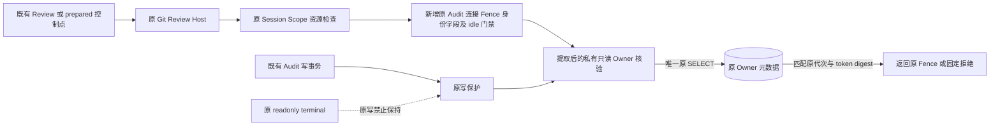
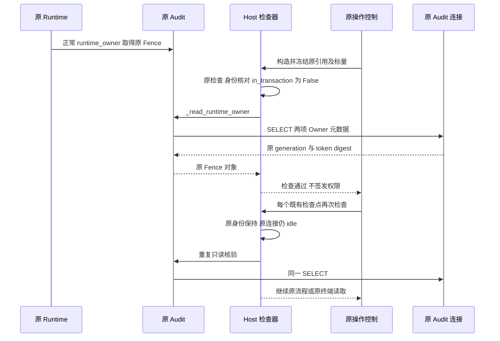
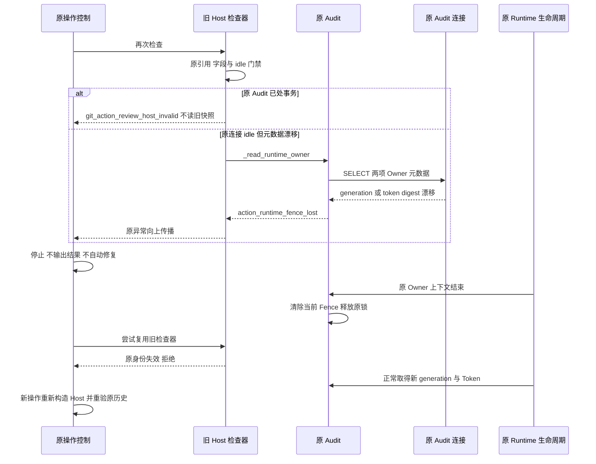
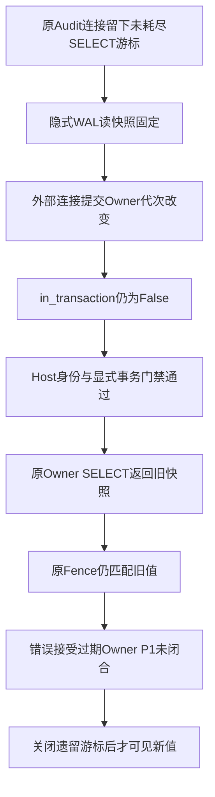

# Git 原所有权只读前置接线详细设计

## 1. 变更摘要

**接口实现状态：`reviewing`，部分实现。** 原算法提取、原身份/字段及显式事务门禁已实现并通过限定分组回归；隐式游标旧快照的真实反例仍1失败，完整 Owner 新鲜性未完成。`code_revision` 仅标识源码研究基线，新增实现由专项固定源输入与 Wheel 字节证明，不假定研究提交已经包含新增代码。
本文覆盖[原 approved-link 设计](m09-r4-git-approved-link.md) §8.3 与 B7 的原所有权只读前置，采用[重大变更模板](../governance/templates/change-design-template.md)十四节结构及既有设计目标、总体架构、接口/数据结构语义。

| 项目 | 内容 |
|---|---|
| 需求/缺陷 | 每个既有 Git Review Host 检查点确认原 Audit、连接、Fence 身份、无显式事务状态与原连接可见的持久 Owner |
| 当前问题 | Session Owner token 与资源引用有效，不等于 Audit 当前 generation/token 仍有效 |
| 目标结果 | 原 SELECT 算法仅提取一次，Host 拒绝显式事务并在原连接重复只读核验，终端写保护不变 |
| 影响模块 | trusted_actions 所有权核验；product_config 宿主组合；workspace 终端控制仅作兼容边界 |
| 兼容级别 | 内部私有接口提取及宿主收紧；不改公开签名、Schema、事件、批准事实或 Token 格式 |
| 发布/回退单元 | 所有权方法与 Host 接线作为同一代码单元；无数据库迁移或数据回退 |

## 2. 需求背景与证据

研究基线固定为本地提交 `12e30d333334234c1ad73789f392aee4c7bedf36`；基线核对时 HEAD、main、origin/main 同指该提交，不以远端实时状态或未提交源码替代基线。候选源码已另行只读核对，原 Owner 核验算法块提取前后逐字节相同；实施验证记录及未关闭事项见第12.1节。
基线 `ActionOwnerFenceMixin._assert_runtime_owner()` 首先调用 `require_store_write_allowed(self)`，随后按原 `_runtime_fence`、`_require_runtime_owner` 与两项持久元数据核验。基线 `terminal_read_scope()` 拒绝同一原 Audit/事务资源的写入口；直接调用 `_assert_runtime_owner()` 会触发 `terminal_read_write_denied`，不是可复用的终端只读算法。
基线 `require_git_review_host()` 复用 `require_git_user_authority()`，冻结 Session token、Publication/Guard/Protection 和资源引用；未冻结 Audit 连接与原 Fence 字段，未查询 Owner 元数据。原 Runtime 以 `require_runtime_owner=True` 打开 Audit 并进入 `runtime_owner()`；连接采用 `isolation_level=None`、WAL，`save_plan()` 在原 `BEGIN IMMEDIATE` 后调用写核验。

## 3. 设计目标、非目标与验收标准

| 设计目标 | 可执行验收要求；已验证范围与未闭合项分别登记 |
|---|---|
| 单一核验算法 | `_read_runtime_owner()` 与原核验逐分支等价；返回原 Fence，不复制授权逻辑 |
| 原身份连续 | 同字节替代 Store/Fence/连接以及操作内字段改变均在下一 Host 检查拒绝 |
| 显式事务门禁与可见事实复核 | Host 每次先要求原连接 `in_transaction is False`，再执行原 SELECT；显式 BEGIN 的旧快照必须拒绝。该标志不能排除未耗尽游标持有隐式旧快照，完整新鲜性门禁未完成 |
| 无核验副作用 | 核验区间只有 Owner 元数据 SELECT；不新建 Git 账本或业务行，不 BEGIN/COMMIT、迁移、签发或调用 checkpoint |
| 写保护不退化 | `_assert_runtime_owner()` 仍先写保护；共享只读方法不禁事务，原 BEGIN IMMEDIATE 内核验保持（原写路径及单独事务正控验证） |
| 生命周期隔离 | 原上下文结束后旧检查器失效；新 Owner 必须重新构造操作，不复用旧检查器 |

非目标：不完成全部 Git dispatch 屏障、不认证 OS FD/文件锁实际持有、不实现 approved 事实 Writer，不扩展 Session/Scope 授权。NativeBridge、A/T/D、Commit、Backup2、真实 R3 及商业发布验收均不在范围；B7 仅此前置子项待验，不能宣称全部闭合。不改变 readonly terminal 的 Task/线程/active 约束、父闭包读取能力、回调隔离与禁止写入能力；不新增配置开关或自动修复通道。

## 4. 当前实现与根因

研究基线链路为 `ProductGitReviewProvider.review()` 或 `ProductGitPreparedLinkLedger._control()` → `require_git_review_host()` → 原用户宿主检查；Audit 写路径另经 `_assert_runtime_owner()` → 元数据 SELECT。
基线根因是“写入口许可”和“Owner 持久核验”共处一个方法，而原 Host 未组合第二项。只增加 SELECT 也不足：调用方 BEGIN 并建立读快照后，外部 WAL 提交 Owner 改动，原连接仍可读到旧元数据。

| 基线约束 | 本设计处理 |
|---|---|
| `runtime_fence` 属性返回深拷贝 | 冻结内部 `_runtime_fence` 原引用，不用属性副本证明原身份 |
| `_runtime_fence` 为空且 Owner 非必需 | 私有读取仍返回 None，保留非产品 Store 原语义；Git Host 不接受此状态 |
| 原用户宿主检查含路径、资源、关闭与绑定核验 | 每次首先执行原检查，不删减或替换已有规则 |
| `acquired_at` 不在 Owner 元数据查询中 | 作为内存冻结字段核对，不虚构持久时间认证或租约期限 |
| 原写核验在 BEGIN IMMEDIATE 内复用 | idle autocommit 仅限制 Git Host，不能放入共享核验或全局禁事务 |
| `runtime_owner()` 自身具有锁与写入效果 | 只由正常 Runtime 生命周期调用，Host 核验不进入此上下文 |

## 5. 总体架构与模块职责


图中 idle 仅指 `in_transaction=False`，不证明连接不存在未耗尽读游标。图示说明：基线 Host 仅走原检查，变更后追加身份与空闲连接门禁及只读核验；写事务保留写保护后复用同一算法，全部新增调用同步执行。源码映射：H/U 为 `git_delivery_review_host`/`git_user_authority`；R/G/M 为 `ownership_store` 与原 Audit `_db`；T 为 `terminal_read_control`。
数据流：原 Router 提供 Audit → 冻结原 `_db` 与 Fence/标量 → 每次确认原连接 idle → 读取两行元数据 → 比较 generation 字符串及 token SHA-256 → 只返回内存 Fence 或异常；不输出 Token、Digest、路径或正文。
职责归属：trusted_actions 持有唯一 Owner 算法和生命周期；product_config 组合既有宿主身份、idle 门禁与核验；workspace 不提供新授权，不修改终端作用域。

### 5.1 复用与取舍

| 方案 | 优点 | 缺点/风险 | 结论 |
|---|---|---|---|
| 原 `_assert_runtime_owner()` 直接接 Host | 无新增方法 | 终端核验被写保护拒绝，绕过保护又扩大能力 | 拒绝 |
| 在 Host 复制 SELECT/摘要算法 | 接线直接 | None、错误码与摘要算法易漂移，产生重复授权实现 | 拒绝 |
| 重开只读 Store/第二连接或读取 Fence 副本 | 隔离读取 | 失去原连接/对象身份，可能初始化或制造替身 | 拒绝 |
| 全局禁止共享核验使用事务 | 避免旧读快照 | 破坏原 BEGIN IMMEDIATE 写核验 | 拒绝 |
| 提取原核验，Host 冻结引用并要求 idle | 原算法唯一，终端可读，写事务语义保持 | 每检查点至多一次 SELECT；事务中 Git Host 明确拒绝 | 采用 |

## 6. 正常、失败与恢复时序

### 6.1 正常时序


图中 idle 只排除显式事务，不代表完整新鲜性。图示说明：Runtime 取得 Owner 是既有独立写生命周期，不属于新增核验；构造时检查一次，闭包每次重验 idle 和元数据，不缓存通过结果。源码映射：Runtime 对应 `_open_action_dependencies()`；控制对应 Review `control()` 与 Ledger `_control()`；核验对应新增私有方法。持久化/可见顺序：仅正常 Runtime 取得 Owner 会写元数据；Host 返回 None 表示前置通过，不代表 approved、执行或提交成功；核验不发布 Artifact、事件或回执。

### 6.2 失败与新 Owner 恢复时序


图中的元数据漂移分支限定当前连接可见变化，不覆盖隐式旧快照。图示说明：替身/字段漂移/非 idle 在 SELECT 前拒绝；仅持久元数据漂移进入原 fence_lost 分支；不提交调用方事务以取得新视图，不复活旧闭包或业务批准。源码映射：门禁为 `require_git_review_host()`；元数据比较为 `ownership_store`；清除 Fence/释放锁及新 Owner 取得仍为 `runtime_owner()`。取消与期限：沿用原 CancelToken、父任务检查和操作预算；原控制传播原异常，不改判 Owner 失效，不签发部分结果；具体期限边界见第8节。

## 7. 接口设计与数据结构

新增/调整接口已有候选源码，验收状态仍为 `reviewing`、待验；以下是实现契约，不将候选能力追记为基线能力。

| 接口/结构 | 变更前 | 变更后契约 | 兼容与回退 |
|---|---|---|---|
| `ActionOwnerFenceMixin._read_runtime_owner() -> ActionRuntimeFence \| None` | 不存在 | 提取原 None/require、SELECT、摘要比较及错误；无回调，不检查 in_transaction | 私有方法，无新参数/导出；保留写事务复用 |
| `_assert_runtime_owner()` | 写保护与核验同体 | 首条保留 `require_store_write_allowed(self)`，随后返回私有只读核验 | 原写调用点、顺序与错误分类不变 |
| `require_git_review_host(...) -> Callable[[], None]` | 冻结原 Session/资源 | 参数/返回不变，增加冻结项、每次 idle 门禁和可见事实核验 | 无 Owner/替身/事务连接拒绝，原有效空闲宿主适用 |
| `ActionRuntimeFence` | generation/token/acquired_at | 模型、格式、校验和存储位置不变 | 无模型迁移或新认证域 |
| `action_audit_metadata` | 两项原 Owner 元数据 | 原 key/value、digest 与 SELECT 不变 | 无 DDL/初始化/迁移或数据重写 |

| Host 内存冻结项/前置 | 构造条件与每次检查 |
|---|---|
| 原 Audit | `type(router._audit) is SQLiteActionAuditStore`；之后仍为原引用，不接受子类或同路径替身 |
| 原 Audit `_db` | 原 exact `sqlite3.Connection` 引用；之后仍为该引用，不重开同一数据库 |
| 原 `_runtime_fence` | exact `ActionRuntimeFence` 且非 None；之后用 `is` 核对原对象，不用属性副本或模型相等替代 |
| generation/token/acquired_at | 独立冻结三项标量并逐值比较，防止原对象字段被改；标量不替代对象身份 |
| `_require_runtime_owner` | 构造与每次检查均要求 `is True`，拒绝 False 或真值替身 |
| Audit 连接事务状态 | 构造及每次检查，在调用共享核验前要求 `audit._db.in_transaction is False`；不缓存初次状态 |
| 原 Session/Scope/资源检查 | 保留原闭包、Session token 引用、发布绑定、资源/路径/关闭检查及 Reader 合同；不扩展 Scope 认证 |

错误归属：无 Fence/类型不符/引用或字段改变/require 降级/连接处于事务由 Host 拒绝为 `git_action_review_host_invalid`；持久元数据不匹配保留 `action_runtime_fence_lost`。
直接私有读取的 None+require=True 保留 `action_runtime_owner_required`；None+require=False 返回 None。原用户检查先执行，其关闭/资源失败保留 `git_user_observation_host_invalid`。
原 SQLite/ASCII 等底层异常不新增重分类；连接直接关闭但 Store 未标 closed 时传播失败，不伪装成功、重连或替调用方结束事务。

## 8. 状态、事务、并发与幂等

| 状态转换 | 行为 |
|---|---|
| 原 Owner 活跃 → 元数据/字段/引用漂移 | 下一检查失败关闭；不重签、重建或忽略缺失元数据 |
| 原 Audit idle → 调用方建立事务快照 | Git Host 下一检查拒绝；共享方法与原写核验不受该门禁限制 |
| 原 Owner 活跃 → 原上下文退出 | 原生命周期清除 Fence；元数据仍留旧值也不能复用旧 Host |
| 无 Owner → 正常 Runtime 新 Owner | 原锁及代次递增照旧；新操作冻结新身份，旧 Host 永不改绑 |
| 原 Store/Publication/Scope 关闭 | 原关闭检查优先拒绝，不重新打开资源 |

核验仅执行 `SELECT key, value FROM action_audit_metadata WHERE key IN ('owner_generation', 'owner_token_sha256')`，比较 `str(fence.generation)` 与 `_token_digest(fence.token)`；不发 BEGIN、COMMIT、ROLLBACK、PRAGMA 或迁移语句。
Git Host 要求原 Audit 连接无显式事务；每次检查读取该标志，拒绝显式事务固定的旧 Owner，不新建第二连接，不主动提交/回滚调用方事务以继续。
该限制只针对 Audit 连接，不禁止 prepared 调用方原 GitDB 事务；共享 `_read_runtime_owner()` 保留原事务语义，可在原 BEGIN IMMEDIATE 中供 `_assert_runtime_owner()` 复用。
原连接每次重新 SELECT 当前连接可见元数据，不缓存通过结论。`in_transaction=False` 只说明没有显式事务；未耗尽的 SELECT 游标仍可固定隐式 WAL 旧快照，原连接随后的 Owner SELECT 与 `PRAGMA data_version` 也会读旧值。原 SDK 单独 Host 反例已达到目标断言并失败1项，证明当前检查仍接受旧快照；反例不是整个 Ledger 已绕过独立监视连接的证据。真实 SQLite 及原 SDK 反例分别保留，完整新鲜 Owner 门禁仍是 P1 未闭合项。不得通过第二 Store、猜测 CPython 句柄、缓存或主动结束调用方事务绕过；共享原写核验算法保持不变。它也不证明跨库原子性或查询后的永久所有权。
重复核验无业务写入、计数推进或幂等键；`total_changes` 与 `in_transaction` 不因核验改变。原 Owner 取得的写入不计入零副作用断言；不宣称两检查之间替换后复原可被单独察觉。
取消/期限保持原 Review、prepared 60秒单调总预算与父任务传播；Host 不接收新 checkpoint、不刷新 deadline，原控制在同步调用前后检查。
同步 SQLite 读取不可由该方法抢占；基线 busy_timeout 为5000ms，外围 asyncio 期限不等于硬实时中断；取消/到期后的下一原控制拒绝结果，不自动重试。
原终端 Task/线程/active、父闭包及共享回调隔离保持；不改变 UNKNOWN，不领取 execute/reconcile operation 或自动重放。


### 8.1 未耗尽游标的已知失败数据流



图示对应专用验证中的真实 SQLite 探针及原 SDK Host 单例。新调用完成自己的 SELECT 不会结束先前游标的读快照；同连接 `PRAGMA data_version` 在该窗口内也不发现外部提交。内部 Store Reader 未发现自然返回流式游标，但已有外部 checkpoint 持有原连接时能够留下活动 statement，因此不能仅依赖当前内置实现习惯。
原 prepared Ledger 的独立监视连接仍检测观察开始后的外部提交；此反例证明单独 Host 不足以提供完整新鲜性，不证明 Ledger 的其他门禁也已被绕过。入口前形成的旧快照仍须独立处理，不能通过重开业务 Store 或弱化认证来填补。

## 9. 安全、隐私与可观测性

原所有权是运行时前置，不是批准来源或执行权限；对象身份、标量、idle 与持久元数据共同收紧 Host，但不认证 OS FD、锁实际持有或全部调度旁路。Token 仅由正常 Runtime 生成并留在内存；核验复用原 SHA-256，不创建 Key、Token、Store、Schema、认证证明或 checkpoint 回调，不改变原 Session/Artifact 保护。
不新增持久事件、Trace/Metric/Log 接口或产品 UI；沿用有限错误码，禁止输出完整 Token/Digest、路径、actor/reason 或 SQLite 底层错误正文。测试诊断仅保留场景编号、错误码、SQL类别、查询次数和布尔状态；禁止把 Token 或连接地址用作指标标签。终端内可读 Owner 不意味着可写：`_assert_runtime_owner()` 及原受保护写入口仍首先受 `terminal_read_write_denied` 约束。

## 10. 核心伪代码

以下为等价提取与组合契约，候选实现待最终封存；冻结信息仅为闭包局部数据，不新增模型或公开能力。
```text
_read_runtime_owner():
    fence = self._runtime_fence
    若 fence is None: 按原 _require_runtime_owner 抛 action_runtime_owner_required 或返回 None
    rows = 原 self._db 上 SELECT 两项 Owner 元数据
    若 generation 或原 _token_digest 不匹配: 抛原 action_runtime_fence_lost
    返回 fence 原对象                        # 不增加事务门禁
_assert_runtime_owner():
    require_store_write_allowed(self)       # 原写保护顺序保持
    返回 self._read_runtime_owner()
require_git_review_host(原参数):
    保留原参数门禁与 require_git_user_authority 闭包
    冻结原 Session token 与 Publication/Guard/Protection
    验证并冻结 exact Audit、原连接、原 Fence、三个标量与 require=True
    check():
        original()                         # 原 Session/Scope/资源检查先执行
        按原规则核对 Session token、发布与 Reader 合同
        核对原 Audit/连接/Fence 类型、身份、标量及 require is True
        若 audit._db.in_transaction is not False: 抛 Host invalid
        执行 audit._read_runtime_owner()   # 原算法返回当前内存Fence；仅复核当前连接可见元数据
    check()                                # 构造阶段即失败关闭
    返回 check
```
顺序约束：Host 身份/事务失败先于新增 SELECT；写保护失败先于私有核验；成功不进入初始化、Owner 取得、checkpoint、Artifact 发布或事务提交。

## 11. 实施切片与归属

| 顺序/负责人 | 改动与责任边界 | 验证与可独立回退 |
|---|---|---|
| 1 / trusted_actions 主工程师 | 提取唯一私有只读方法；原写保护、事务与分类保持 | 单元测试验证等价/零副作用；无消费者时可独立回退 |
| 2 / product_config 主工程师 | 原 Host 冻结 Audit/连接/Fence/标量/require；每检查点执行 idle 门禁与核验 | Host/终端及 WAL 矩阵；与切片1配套发布 |
| 3 / 测试负责人 | 两份定向测试使用原 Store/Runtime、真实 SQLite/WAL；共享 `_case` 增加保留原默认值的显式参数 | 保留首轮失败并复验，不以 Mock 返回值代替 SELECT/快照证明 |
| 4 / core 评审与维护负责人 | 固定实现提交，同步原设计 §8.3/B7、模块资料和可验证锚点 | 仅标此前置子项验收结果；全部 dispatch/B7 另行验收 |

候选改动为生产两模块、两份定向测试及原 Ledger `_case` 的必要夹具参数适配；原 Ledger 默认行为不变，workspace 终端代码仅兼容验证。核验与正常 Runtime 初始化、故障注入及业务事务的效果分别计量，不将后者计入只读区间。

## 12. 源码与详细测试矩阵

链接无行号锚点；新增方法与测试待最终封存。测试符号及实际行号随候选固定，不能以研究基线冒充新增实现提交。

| 源码文件 | 已核对的基线符号；候选新增符号明确标注 |
|---|---|
| [ownership_store.py](../../src/harnessix/trusted_actions/ownership_store.py) | `ActionOwnerFenceMixin._assert_runtime_owner`、`_token_digest`、`ActionOwnershipStoreMixin.runtime_owner`、`runtime_fence`；候选 `_read_runtime_owner` 已静态核对，验收待闭合 |
| [store.py](../../src/harnessix/trusted_actions/store.py) / [recovery_contracts.py](../../src/harnessix/trusted_actions/recovery_contracts.py) | `SQLiteActionAuditStore.__init__/save_plan/close`、`ActionRuntimeFence` |
| [git_delivery_review_host.py](../../src/harnessix/product_config/git_delivery_review_host.py) / [git_user_authority.py](../../src/harnessix/product_config/git_user_authority.py) | `require_git_review_host`、内部 `check`、`require_git_user_authority` |
| [terminal_read_control.py](../../src/harnessix/workspace/terminal_read_control.py) | `terminal_read_scope`、`require_store_write_allowed`、`require_terminal_read_scope` |
| [git_delivery_review.py](../../src/harnessix/product_config/git_delivery_review.py) / [git_prepared_link_ledger.py](../../src/harnessix/product_config/git_prepared_link_ledger.py) | `ProductGitReviewProvider.review`、`ProductGitPreparedLinkLedger`、`_control` |
| [git_prepared_link_observation.py](../../src/harnessix/product_config/git_prepared_link_observation.py) / [action_runtime.py](../../src/harnessix/product_config/action_runtime.py) | `PreparedLinkReadSet.terminal`、`observe_prepared_state`、`_open_action_dependencies` |
| [test_git_prepared_link_ledger.py](../../tests/product_config/test_git_prepared_link_ledger.py) | 原 `_case(..., explicit_git_ledger=True)`，默认保持 Ledger 合同；新 Owner Host 用例显式 False |

测试承载：U 为 [test_readonly_runtime_fence.py](../../tests/trusted_actions/test_readonly_runtime_fence.py)，H 为 [test_git_review_runtime_fence.py](../../tests/product_config/test_git_review_runtime_fence.py)，均已有候选源码。场景编号不是测试函数或通过数量；该矩阵是完整验收要求，不表示每一行均已独立执行。当前实际执行集合及未关闭反例分别见12.1和专项结果，不认定完整矩阵通过。

| 编号/承载 | 输入、注入或边界 | 预期与必须记录的证据 |
|---|---|---|
| U1 | None Fence；require=False/True 各一次 | 返回 None/原 owner_required；均无 SELECT、无写入 |
| U2 | 原真实活跃 Owner，重复只读核验 | 返回同一 Fence；每次唯一原 SELECT，changes/事务状态不变 |
| U3 | 分别修改 generation、token 元数据或删除一项 | 原 fence_lost；不修复缺项，不新增记录 |
| U4 | 终端读作用域外，有/无有效 Owner 时调用原写核验 | 原成功/Owner错误保持；与私有读取相同原对象或分类 |
| U5 | 原 terminal_read_scope 内读取与写核验 | 读取成功；写核验先报 terminal_read_write_denied 且不查询 Owner |
| U6 | SQL trace/authorizer 与回调计数 | 只有两项 Owner 元数据 SELECT；无事务语句/DDL/DML/PRAGMA、新 Git 账本或业务行及共享回调 |
| U7 | 原 BEGIN IMMEDIATE 内调用共享读取/原写核验 | 原有效 Owner 成功；不新增全局事务拒绝，事务保持由原调用方结束 |
| H1 | 原 SDK 宿主与 idle autocommit 正控；`_case` 显式 False | 核验仅 Owner 元数据 SELECT、仍 idle，不新建 Git 账本或业务行；默认 Git 目录缺失断言保持 |
| H2 | 初始无 Owner、Audit 子类、require=False/真值替身 | Host invalid；不通过临时 runtime_owner 修复 |
| H3 | 等字段新 Fence、原三字段逐项改、require 降级 | 下一检查 Host invalid；逐项独立注入，拒绝先于新增 SELECT |
| H4 | 替代 Audit、同库另一个 SQLite 连接、非 exact 连接 | 原检查或新增 Host 拒绝；不关闭/改绑旧原连接 |
| H5 | 冻结后 generation/token 元数据漂移、缺失 | 单独 Host 为原 fence_lost；组合控制保留先触发的原错误 |
| H6 | Owner 上下文退出但旧元数据保留；同 Store 取得新 Owner | 旧闭包拒绝，新操作检查器成功；不复用旧 Token 或批准 |
| H7 | Audit/Plan/事务/Publication/Protection 关闭、Session token 替换 | 原关闭/身份门禁保持；直接关闭连接也失败，不重开或吞异常 |
| H8 | 同字节 Session/Guard/Scope/Reader/端口替身 | 原资源与合同检查拒绝，不因新增核验放宽原检查 |
| H9 | 原终端内 Host 检查，接续受保护 Audit/事务写入口 | Host 可读；写入拒绝，Task/线程/active 与父闭包能力保持 |
| H10 | 原取消、父 Task 取消、60秒到期、同步读取后到期 | 原异常/期限分类保持；不刷新预算、不交付结果、不重试 |
| H11 | Review 与 prepared 正常/失败控制点重复调用 Host | 既有接线消费新核验；不计为全部 dispatch 屏障证明 |
| H13（未闭合） | 原连接保留未耗尽多行 SELECT；外部 WAL 改 Owner，in_transaction=False | 期望拒绝，但真实 SDK Host 仍通过；保留1失败，不用 xfail 或跳过掩盖 |
| H12 | 构造前/构造后原 Audit BEGIN，先 SELECT 固定快照；外部 WAL 连接提交 Owner 元数据改动 | 真实证明原快照仍见旧值；Host 两阶段均因 in_transaction=True 拒绝，不能拿旧值通过 |

WAL反例第二连接仅是测试外部写入注入器，不进入产品 Host；测试先确认 WAL 提交可见性和旧快照，再断言 Host 在 Owner SELECT 前拒绝；不得靠 Mock 模拟快照或替 Host 重开连接。

### 12.1 候选验证状态、夹具隔离与未闭合反例

实现方验证记录：mypy 对504个源文件检查通过；原 Owner 核验算法块提取前后逐字节一致也已只读静态核对。类型检查与静态等价性不代替 SDK、终端或业务验收，测试原件与导入路径独立保存。
首轮三个真实 SDK Host 用例的目标断言均达到预期，但整轮记录仍为3失败：复用 `_case` 强制要求 GitDB 文件，与只读 Owner 用例不创建账本的范围冲突。首轮失败保留，不追记为整轮通过。
夹具修复仅在原 `_case` 增加 `explicit_git_ledger=True` 默认参数并透传；原 Ledger 用例未传参时保持原要求。新 Owner Host 用例显式 False，沿用 `assert not (state / "git-delivery").exists()`，不得为通过夹具而创建 GitDB 或业务行。
夹具修复后的源码定向集合24项通过；同一固定 Wheel 的源码外定向安装集合24项通过。同一固定 Wheel 安装领域集合3771通过/23个Windows-only跳过，关联集合59通过，最终治理集合1413通过；失败/错误均为0，各组有交集不累加。独立隐式游标 Host 反例1失败仍保留，不被这些通过结果覆盖。零副作用证据须限定核验区间：只有 Owner 元数据 SELECT、无账本/业务行新建；原 SDK 装配、Owner 取得及故障注入不混入该 SQL 断言。

## 13. 风险、部署与回退

部署对象为既有 Python 内部组件，无新增依赖、服务、端口、模型配置、凭据、Docker 或 Schema 迁移；沿用原环境安装流程，不在运行中替换旧闭包。core 固定候选提交与依赖环境，停止相关 Git 操作并排空旧 Host/Owner；配套加载两模块后由正常 Runtime 取得新 Owner，重新构造检查器；Audit 必须 idle，不影响原 GitDB 事务合同。
先验收原资源正控，再覆盖全部负控、真实 WAL 反例与终端兼容；核验出现非 SELECT、替身被接受、事务快照通过、写保护退化或旧闭包跨 Owner 成功，立即停止启用。
macOS/Linux/Windows 的原锁与 SQLite 行为分别验证；单平台结果不能替代跨平台、真实 R3 或业务门禁。性能待测，不通过降低检查频率或缓存通过结论放宽要求。
风险为同步阻塞、检查间漂移和 OS FD/dispatch 未认证；门禁只排除显式事务，未耗尽游标的隐式旧快照已经实测，仍可能接受过期 Owner。完整新鲜性、B7 与 approved Writer 发布阻塞继续保留；不等于跨库一致性或永久锁证明。
回退负责人为 core；停止新增 Host 消费并排空候选操作，配套回退两模块或保持 Git 分支停用；禁止仅删方法而留下消费者，不通过提交调用方事务修复 Host。
无新持久事实需撤销；保留 Owner 元数据、事件与业务记录，不重置 generation、不删除尾锚、不复制旧 Token。恢复仍由正常 Runtime 新 Owner 生命周期负责。
回退到基线撤销此前置保护，不能作为 approved Writer/全 dispatch 安全开放的理由；不得降级为 require=False、绕过 idle 门禁或重开 Store 继续运行。

## 14. 实现偏差与最终结论

当前结论为 `reviewing`、部分实现：身份/字段、显式事务门禁与原可见 Owner 算法已经实现，原算法块静态等价；首轮夹具失败、修复后定向通过及新隐式快照反例分别保留。完整新鲜 Owner 目标未完成，不声明整轮通过或无偏差。`code_revision` 保持研究基线；实际候选的固定输入、各组 XML、导入路径与四幅已渲染并查看的图示见[限定验证报告](../validation/git-owner-fence-2026-10-07-v1/README.md)。
收口须核对原 None/require/digest/错误、原引用/标量冻结、每点 idle、重复 SELECT、原写事务与终端写禁止、取消期限、新 Owner 恢复；逐项记录实际偏差，无偏差也须明确。本文不取代原 approved-link 设计，不关闭全部 B7；隐式快照新鲜性、全部 dispatch 屏障、OS FD、approved Writer、NativeBridge/A/T/D/Commit/Backup2/真实 R3 保持后续门禁。

固定安装验证不关闭完整新鲜性；原 BEGIN IMMEDIATE 正控为两次 SELECT、零变更、保留原事务，由调用方回滚。
