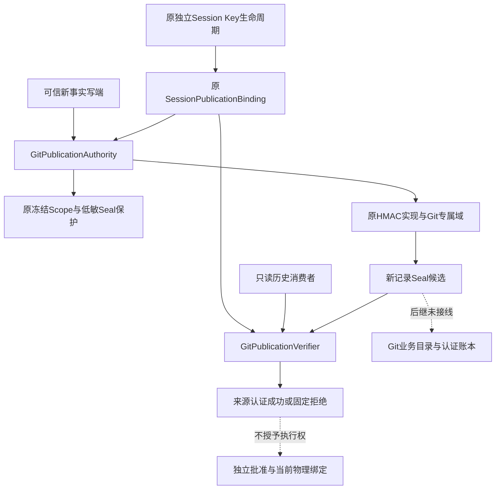
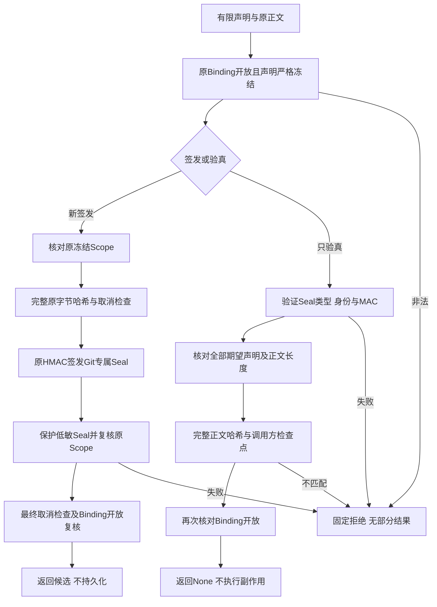
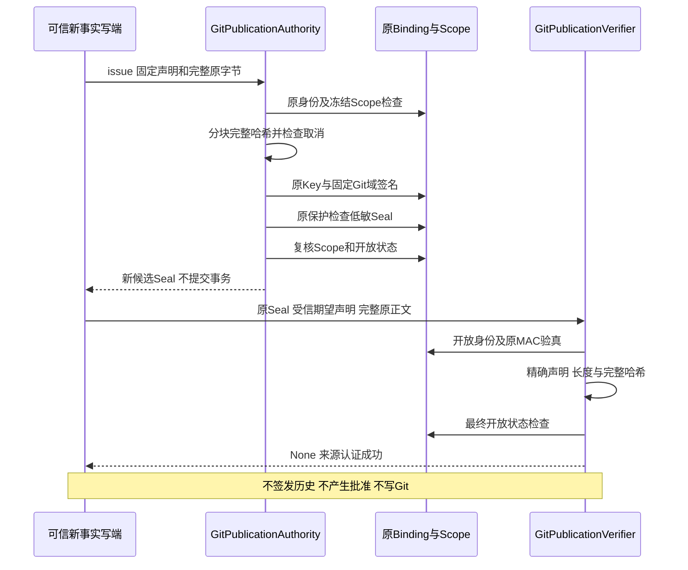
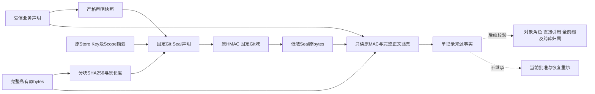

# R4 Git业务记录来源认证：总体与详细设计

## 1. 需求背景与当前范围

完整Git对象、普通文件树、目标树及Diff已有内容验真实现，但SHA、OID和普通GitDB JSON不证明业务来源。
后继产品交付需要把对象目录、关联和领域阶段绑定到原Session独立Key、调用、Route及认证前缀。
另建Git密钥文件、借用模型API Key或在备份期间补签旧JSON都会破坏现有身份和恢复边界。

本变更在原Session认证模块内提供**有限Git记录签发与只验真端口**，复用原HMAC及Key生命周期。
它交付来源认证基础，不代表对象业务目录闭包、GitDB全前缀、默认Checkpoint/Commit或Backup v2已经接线。
元数据提交是研究基线；本候选代码、测试、发行物及结果由[统一验证包](../validation/git-record-publication-2026-10-01-v1/README.md)分别绑定。

## 2. 设计目标、非目标与不变量

### 2.1 目标

1. 原逻辑Store/Key和Git专属MAC域共同约束证明，不复制或导出新Key。
2. 有限业务声明绑定原Thread/Turn/Call/Route、交付ID、记录ID、发布epoch、记录种类和前缀位置。
3. 完整实际字节、长度和正文SHA进入证明，禁止语义相同JSON替代原字节。
4. 新事实签发必须使用原冻结Scope，并经过原低敏Seal公开保护；只读消费者没有公共签发方法。
5. 历史验真不重签，不需要当前Scope公开许可，也不因此授予读取、批准或执行权限。
6. 取消、共享观察检查点、关闭及固定拒绝没有正文、Key、路径或第三方异常输出。

### 2.2 非目标

- 不初始化GitDB、创建表、修改Session Schema、保存CAS、运行Git或发布Artifact。
- 不检查对象角色、tree/commit直接引用、全部业务关系或独立可信前缀尾锚。
- 不把一条有效MAC解释成完整历史、防回滚证明、人工批准或恢复后外部Git绑定。
- 不实现任意用途签名、模型凭据管理、跨机Key迁移或通用加密平台。
- 不冻结完整Git产品容量；64MiB是复用的内部单记录认证观察上限，不替代完整树/总量决策。

### 2.3 不变量

| ID | 不变量 | 失败边界 |
| --- | --- | --- |
| GP-1 | 仅五种固定记录用途 | 未知kind、额外字段及非法声明整体拒绝 |
| GP-2 | 原Store/Key及专属域 | 错身份/Key/其他域不能通过 |
| GP-3 | 完整原字节绑定 | 字节变化、尾随、长度变化均拒绝，不规范化JSON |
| GP-4 | 严格冻结声明 | 未校验model_copy/model_construct不能绕过字段验证 |
| GP-5 | 只读无签发 | Verifier仅identity/verify，备份Scope拒绝新签发 |
| GP-6 | 原Scope才能签发 | Scope漂移、替身保护、公开保护失败不返回候选 |
| GP-7 | 生命周期共享 | Binding关闭后两个端口拒绝，不持有新Key副本 |
| GP-8 | 取消不转成功 | 哈希检查点及公开保护的原取消/期限错误保持 |
| GP-9 | 来源不是权限 | 验真不执行Git、不补签、不修复账本或批准 |

## 3. 总体架构与系统上下文



Session持有认证能力，Delivery仍持有对象/领域语义。两者没有新增数据库或第二套密钥管理。
虚线表示后继产品职责，不是本候选已经开放的接口。

## 4. 架构决策、源码映射与取舍

| 职责 | 当前源码/符号 | 决策及取舍 |
| --- | --- | --- |
| 有限声明与严格快照 | [git_publication_contracts.py](../../src/harnessix/session/git_publication_contracts.py)：`GitDeliveryRecordClaims`、`snapshot_git_delivery_claims` | 独立小合同模块，不依赖GitDB、Provider或执行器 |
| 原Store/Key生命周期 | [store_publication.py](../../src/harnessix/session/store_publication.py)：`SessionPublicationBinding` | 添加两个能力对象，共享原可变Key；不创建Git Key文件 |
| 有限签发/验真 | 同文件：`GitPublicationAuthority`、`GitPublicationVerifier` | 验真对象没有公共issue；Python私有属性不是抵御恶意宿主反射的隔离机制 |
| 规范MAC | 同文件：`_claims`、`_signed`、`_verified` | 沿用排序JSON、固定Identity及SHA256 HMAC，只增加固定域 |
| 完整正文观察 | 同文件：`_git_body_digest` | 每64KiB检查、只哈希实际bytes，不解码或规范化正文 |
| 原Scope与保护 | [publication_seal.py](../../src/harnessix/session/publication_seal.py)：`original_artifact_scope_digest`；[publication.py](../../src/harnessix/agent/publication.py)：`protect_json` | 原Artifact Scope校验复用，但Git MAC域与Artifact用途独立 |
| 备份只验真Scope | [state_backup_validation.py](../../src/harnessix/product_config/state_backup_validation.py)：`_VerificationOnlyScope` | 能验证已有证明，不允许新公开保护或新签发；本变更不改备份布局 |
| 现有内容验真 | [git_material_cas.py](../../src/harnessix/delivery/git_material_cas.py)、[git_tree_closure.py](../../src/harnessix/delivery/git_tree_closure.py) | 内容正确与业务来源认证分开，后继组合而非相互替代 |

MAC使用原Session Key和固定域分离，避免同Key跨用途混淆；不意味着各用途独立Key。
正文不进入Seal，Seal不提供保密性；原记录仍属于私有状态，不得未经当前保护出站。

## 5. 类、接口设计与数据结构设计

### 5.1 有限声明

`GitDeliveryRecordClaims`为严格、冻结、extra-forbid Pydantic合同。Python入口先检查实际UUID/int/str，
并核对原模型字段集合，再直接重建原字段；不先序列化，以免标量子类或未知copy字段被规范化掩盖。
Seal的JSON入口沿用严格JSON UUID解码，不能将JSON字符串拒绝规则误用于合法持久声明。

| 字段 | 类型/约束 | 语义 |
| --- | --- | --- |
| `delivery_id` | 实际UUID | 一次产品交付意图身份，不是Worktree或用户分支 |
| `thread_id/turn_id/call_id` | 实际UUID | 预期原会话及调用；关联正确性仍由宿主读取认证Session证明 |
| `route_id` | 实际UUID | 原受信Action Route身份；UUID相同不能代替Route指纹核对 |
| `record_id` | 实际UUID | 当前业务实体/记录身份，禁止跨记录替换 |
| `publication_epoch` | 实际UUID | 当前发布批次身份，不等于Owner/Fence或执行许可 |
| `record_kind` | 五种Literal | `object_inventory/product_link/worktree_event/checkpoint/commit_event` |
| `sequence` | 实际int，1～2⁶³−1 | 后继账本序号；bool不能作为int进入 |
| `previous_sha256` | 64位小写十六进制 | 第一条必须全零，后续必须非零；具体前缀由调用方核对 |

### 5.2 Seal

`GitDeliveryPublicationSeal`继承原严格Identity：`version=1`、`purpose=git_delivery_record`、原`store_id/key_id`及`tag`。
新增冻结`claims`、原`scope_sha256`、完整`body_sha256`和`body_bytes`。Seal原bytes必须1～4096字节。
`body_bytes`只允许1～64MiB。MAC输入是固定Git域加排序、紧凑、非ASCII保留的规范声明JSON，排除tag自身。
完整正文使用原字节SHA256，不解析或重新序列化；实际Seal JSON的键顺序不是MAC声明顺序。

### 5.3 实际接口

```python
binding.git_verifier.identity() -> tuple[UUID, UUID]
binding.git_verifier.verify(
    seal: object,
    claims: GitDeliveryRecordClaims,
    body: object,
    *,
    checkpoint: Callable[[], None],
) -> None

await binding.git.issue(
    claims: GitDeliveryRecordClaims,
    body: object,
    protection: PublicOutputProtection,
    *,
    cancel: CancelToken,
) -> bytes
```

验真调用方必须给出从受信来源取得的期望声明，不能从未认证Seal提取字段并自称完成归属校验。
签发端必须使用Binding原Scope实例。它仅返回候选；后继Writer负责将原正文和对应Seal放入正确事务。
Verifier没有issue、Key导出、repair、resume或Executor方法；传给只读消费者的是Verifier，而不是整个Binding。

## 6. 完整业务流程与伪代码



```text
issue(claims, original_body, original_scope, cancel):
    require_binding_open(); claims = strict_snapshot(claims)
    scope_digest = require_original_scope(original_scope)
    body_digest = complete_bytes_hash(original_body, cancel.checkpoint)
    candidate = fixed_git_seal(original_store_key, claims, length, body_digest, scope_digest)
    sealed_bytes = original_sign(candidate, FIXED_GIT_DOMAIN)
    await original_public_protection(low_sensitive_seal, cancel)
    require_original_scope(original_scope); cancel.checkpoint()
    require_binding_open()
    return sealed_bytes

verify(seal_bytes, expected_claims, original_body, checkpoint):
    require_binding_open(); expected = strict_snapshot(expected_claims)
    seal = original_verify_mac(seal_bytes, original_store_key, FIXED_GIT_DOMAIN)
    require_exact_claims_and_length(seal, expected, original_body)
    require_constant_time_equal(seal.body_sha256, complete_bytes_hash(original_body, checkpoint))
    require_binding_open()
```

## 7. 时序与生命周期



Binding关闭清零原可变Key并关闭原Event Authority；两个Git端口都拒绝后续操作。
哈希回调若关闭Binding，验真最终开放检查拒绝；签发必须在最后Scope与取消回调完成后再次检查Binding，
不得返回此前签名但Key现已关闭的候选。实际Scope回查与最终取消检查两种关闭红例均保留。
同步哈希每64KiB检查领域取消或调用方共享期限，最大正文有硬上限；它不是无限流或后台任务。
签发在原异步公开保护处交付父Task取消；验真同步入口由调用方提供当前操作检查点。
原公开保护仍有其既定10秒期限，本接口不重新定义Git命令20秒或产品操作45秒预算。

## 8. 数据流、持久化与恢复



本切片零数据库迁移、零文件写入、零新Key发布。失败或取消没有持久事实需要恢复。
后继GitDB必须原正文/Seal同事务保存，并以独立可信尾锚证明全前缀；不能只验任意保留下来的有效记录。
已有备份验证Scope可使用原Key验真历史，但不能通过公开保护签发新候选；不补签无证明v1 GitDB。
MAC通过不允许自动续写未知效果、不恢复用户HEAD/Index/Ref，也不自动重新注册外部Worktree。

## 9. 异常、安全、可观测性与兼容

| 场景 | 当前错误/结果 | 不变语义 |
| --- | --- | --- |
| 非法声明、Seal、身份、域、长度、正文摘要 | `publication_history_unproven` | 固定公开错误，无正文/Key/路径 |
| Binding已关闭 | `publication_key_unavailable` | 不继续观察或签发 |
| 原Scope替换/漂移 | 原`publication_scope_changed`等合同 | 不降级到弱Scope |
| 低敏Seal保护拒绝 | 原公开保护错误 | 无候选返回；私有正文未出站 |
| 领域取消 | 原`TurnCancelled` | 不转换为来源成功或错误补签 |
| 验真检查点期限/自定义异常 | 原异常原对象 | 不吞掉、不重试、不返回部分成功 |

原Event、Projection、Artifact的域、JSON、版本和公共签名保持不变，原Session Key文件和数据库迁移不变。
Git记录正文可能包含私有路径或内容，因此正文不进入repr、Seal或公开保护输入；来源认证不提供加密。
公开Artifact仍须独立按当前材料保护和审批合同发布。本接口只给受信宿主，不给模型通用sign工具。

当前端口不另建日志、指标或诊断服务；调用方只可记录固定错误码、有限kind、序号及认证是否成功。
不得输出原正文、Seal tag、Key、保护材料或第三方异常内容，也不得从缺失观察推断效果未发生。

## 10. 测试、部署、发行验证与完成边界

测试覆盖五kind、所有身份/序号/前缀变更、错Key/Store、跨域、MAC/字段篡改、严格模型绕过、完整字节、
64MiB边界、取消、Scope漂移、验真无签发、备份Scope拒绝新签发、关闭及原事件/Artifact兼容。
源码与实际单一Wheel分别绑定，源码外Python3.12/3.13使用同一锁定输入验证；不把纯Python合同测试冒称原生Windows。
独立审查、验证执行范围、原失败和修复、完整输入SHA及四幅实际设计图见统一验证包。

部署继续使用统一Wheel和现有Python支持范围，无新增依赖、环境变量、数据库迁移或独立服务。
新增能力由受信宿主显式使用；没有新增公开CLI/SDK工具，默认产品Git写能力不因模块安装而开放。

**本切片完成不关闭R1/R4。** 对象业务目录、GitDB认证全前缀、Review Artifact与新批准、双工作树/派生事务、
默认Checkpoint/Commit、Backup v2和新根重授权仍按[完整业务详设](m09-r4-git-delivery-business-backup-closure.md)实施。
完整R3真实20 Trial、Windows11消费者、独立Beta和同候选R1～R6商业退出条件保持。
