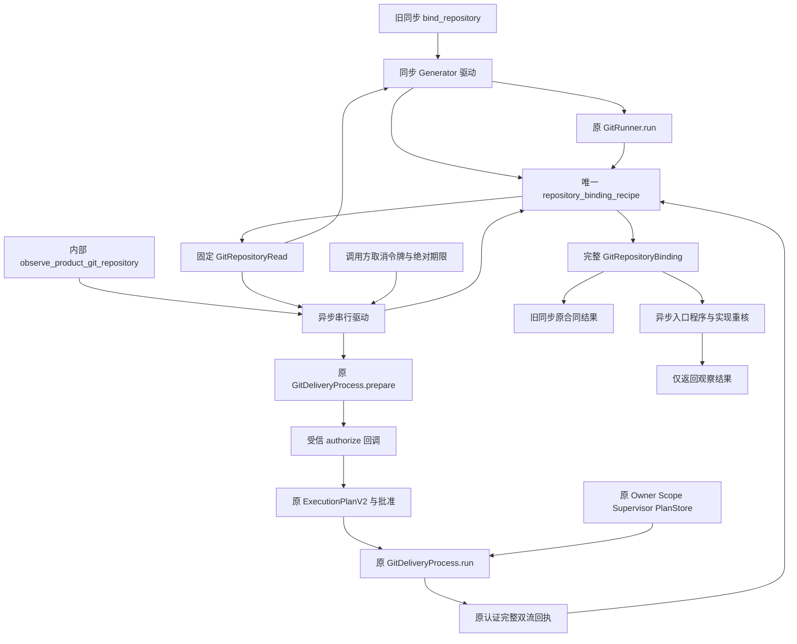
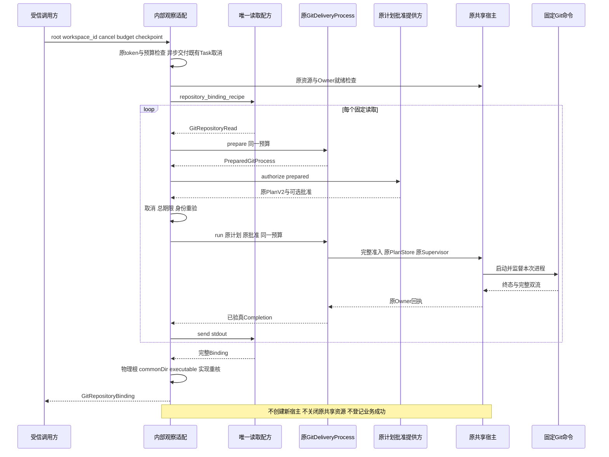
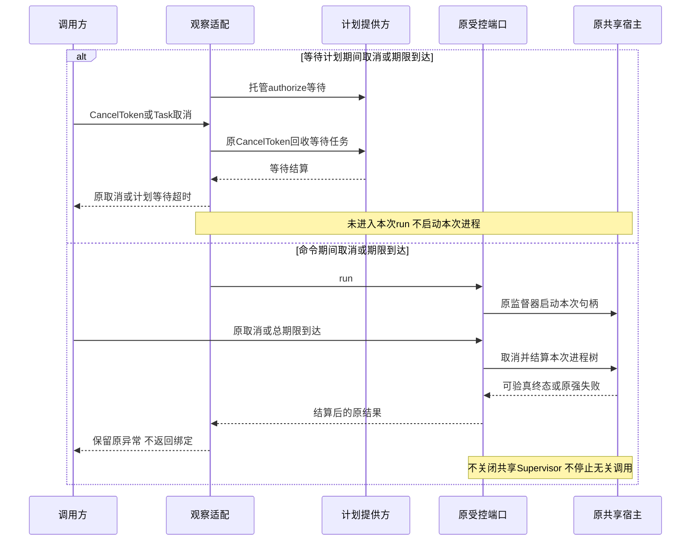

# 完整 Git 仓库绑定观察与共享读取配方设计

## 1. 变更摘要与需求背景

| 项目 | 当前合同 |
|---|---|
| 需求 | 产品内部能够在原受控进程宿主下取得完整 `GitRepositoryBinding`，与旧同步领域入口共用固定读取及拒绝逻辑 |
| 问题根因 | `GitDeliveryRuntime.bind_repository` 原先将仓库校验与同步 Runner 调用放在同一算法中，不能直接接入产品合作取消、总期限和原进程监督 |
| 设计结果 | 提取唯一 Generator 配方；同步入口以原 Runner 驱动，内部异步入口以原 `GitDeliveryProcess.prepare/run` 驱动 |
| 影响模块 | `delivery` 的读取配方与实现身份；`product_config` 的内部观察适配与命令批准身份 |
| 兼容边界 | 正常固定查询保持绑定 v1 字段、命令顺序、原支持范围及旧同步 API；畸形输出增强固定拒绝。实现摘要按实际代码重新计算，不保持旧摘要值 |
| 状态边界 | 完整仓库绑定观察已形成源码入口；产品 Git 写流程、业务证明、备份闭包与默认 Tool 接线不在本实现内 |
| 验收状态 | 测试矩阵见第13章；执行结果待实际记录，不以源码入口或测试定义代替验收 |

旧显式宿主负责干净来源校验、受管 Worktree、Checkpoint 和 Commit。产品内部已有受控命令端口及共享宿主，但“能运行一条固定 Git 命令”不等于“已完整取得仓库绑定”。只观察 HEAD 或只拼装摘要，会遗漏配置、属性、脏状态、commonDir、程序身份及原拒绝条件。

把旧同步 Runtime 放入后台线程也不能解决生命周期问题：同步 Runner 没有产品取消令牌；线程取消不能证明进程已停止；为该调用重开 Owner、Supervisor 或 PlanStore 会破坏原产品资源所有权。因此读取算法和执行效果必须分离，执行仍由原受信端口负责。

本设计是[Git 产品交付与业务备份闭包](m09-r4-git-delivery-business-backup-closure.md)的只读前置，不关闭该文档定义的业务交付范围。这里的“完整”指原仓库绑定配方全部完成，不指完整仓库历史归档、对象图闭包或产品交付成功。

## 2. 设计目标、非目标与不变量

### 2.1 设计目标

1. 仓库根、配置拒绝、完整有界 HEAD 树扫描、属性正文检查、HEAD／Tree、干净状态、commonDir 及绑定字段只维护一套算法。
2. 同步入口继续使用原 `_GitRunner.run`；异步入口不能调用同步执行、另启 subprocess 或自行创建进程宿主。
3. 每条读取先产生 `PreparedGitProcess`，再由受信 `authorize` 回调返回原正式计划与批准；原 `run` 负责实际准入。
4. 计划等待、全部命令及解析 checkpoint 共用调用方的 `CancelToken` 和同一 `GitOperationBudget` 绝对期限。
5. 返回前复核物理根、commonDir、alternates、Git executable 与实现身份；任何未完成或无法验真的读取不能返回部分绑定。
6. 适配层不改写原端口的强失败，不把取消或超时解释成已停止、已交付或可以自动重放。

### 2.2 非目标

- 不接通 A／T／D 创建或写入，不物化 prepared T，不创建 Checkpoint、Commit、Ref 或 Push。
- 不实现 `ProductGitDeliveryPlan`、`ProductGitDeliveryLink`、`ProductGitNativeBridge`、业务 MAC、业务快照或 Backup2。
- 不开放模型可指定 Git 参数、Shell、路径遍历、网络调用或默认 Commit／Checkpoint Tool。
- 不放宽脏来源、include、filter、sparse checkout、submodule、LFS 控制面或 attributes 转换规则；畸形输出强化拒绝，不要求保留原漏检或非领域异常。
- 不将观察摘要升级为原认证会话证明、批准、Lease、`WorkspaceSnapshot2` 或原生桥接。
- 不把多条 Git 读取宣称为原子快照；观察之后的使用仍需原领域重验。

### 2.3 必须保持的不变量

| 编号 | 不变量 | 约束 |
|---|---|---|
| RO-1 | 唯一配方 | 两个驱动消费同一 `repository_binding_recipe`，不各自维护配置或树拒绝分支 |
| RO-2 | 固定读取 | `GitRepositoryRead` 由配方产生，不是公共执行参数或批准凭证 |
| RO-3 | 原宿主唯一 | 异步观察要求真实 `GitProcessRuntimeHost`；不允许无宿主独立运行分支 |
| RO-4 | 计划独立核验 | 回调只返回原合同；批准不匹配时原 `run` 在保存 Plan、启动 Owner 前拒绝 |
| RO-5 | 总期限不重置 | 同一预算实例贯穿等待及所有 `prepare/run`；每条命令受剩余总期限约束 |
| RO-6 | 原字节先验真 | 配方只消费原端口确认完整、EOF、长度和摘要一致且未经保护变换的 stdout |
| RO-7 | 不发布部分成功 | 任一拒绝、身份变化、取消、超时或原强失败均终止配方，不返回部分绑定 |
| RO-8 | 观察不是授权 | `GitRepositoryBinding.digest` 不授予任何后继写能力 |

## 3. 总体架构与模块边界

以下实线仅表示当前仓库观察调用链，不包含待实现的产品写流程。



### 3.1 模块与源码位置

| 模块／源码 | 关键符号 | 单一职责与边界 |
|---|---|---|
| [`delivery/git_repository_recipe.py`](../../src/harnessix/delivery/git_repository_recipe.py) | `GitRepositoryRead`、`GitRepositoryRecipe`、`repository_binding_recipe` | 生成固定读取，消费字节并执行原校验；不启动进程、不创建 Plan、Owner 或 GitDB |
| 同上 | `repository_root_recipe`、`common_directory_recipe`、`safe_configuration_recipe` | 根确认、commonDir 解析和拒绝逻辑的可组合子配方；旧内部入口也直接复用 |
| 同上 | `drive_git_repository_recipe` | 同步驱动及 `finally` 关闭；IO 和命令异常仍属于原 Runner |
| [`delivery/git.py`](../../src/harnessix/delivery/git.py) | `GitDeliveryRuntime.bind_repository`、`_read_repository` | 旧 API 适配到唯一配方，不把旧整个 Runtime 异步化 |
| [`product_config/git_repository_observation.py`](../../src/harnessix/product_config/git_repository_observation.py) | `observe_product_git_repository`、`GitRepositoryReadAuthorization`、`_authorize_read` | 借原共享宿主驱动配方；约束计划等待、控制和终端复核 |
| [`product_config/git_delivery_process.py`](../../src/harnessix/product_config/git_delivery_process.py) | `GitDeliveryProcess`、`GitOperationBudget`、`PreparedGitProcess` | 原命令准备、准入、取消结算及原始流验真；不是完整业务 Runtime |
| [`product_config/git_process_host.py`](../../src/harnessix/product_config/git_process_host.py) | `GitProcessRuntimeHost`、`open_git_process_resources`、`save_git_process_plan` | 原资源引用、就绪检查、借用连接及监督器；借用分支不创建或关闭共享资源 |
| [`product_config/git_material_process.py`](../../src/harnessix/product_config/git_material_process.py) | `git_process_implementation_digest` | 将新观察适配纳入原命令批准实现摘要，避免身份遗漏 |
| [`delivery/git_identity.py`](../../src/harnessix/delivery/git_identity.py) | `_identity`、`_path_sha256`、`_executable_identity` | 复用路径、目录与程序身份观察，不另造原生身份类型 |
| [`delivery/git_contracts.py`](../../src/harnessix/delivery/git_contracts.py) | `GitRepositoryBinding`、`git_repository_binding_digest` | 原 v1 绑定字段、OID 格式与完整摘要合同 |
| [`execution/contracts.py`](../../src/harnessix/execution/contracts.py) | `ExecutionPlanV2`、`ExecutionApprovalCheckpoint`、`execution_is_approved` | 原完整计划及批准核验；观察适配不替代策略决定 |
| [`agent/cancellation.py`](../../src/harnessix/agent/cancellation.py) | `CancelToken`、`TurnCancelled`、`parent_cancel_checkpointer` | 原合作取消、等待任务回收及CPU阶段新增父Task取消交付 |

### 3.2 资源所有权

`GitProcessRuntimeHost` 持有原 `ProductStateOwner`、原 `ProcessSupervisor`、原 `SQLiteExecutionPlanStore` 和原 `SecretPublicationScope`。观察借用这些引用，不取得其关闭权，也不创建第二个 Owner。

检查要求 Owner 绑定同一状态根，Supervisor 根为该根的 `process-owner`，PlanStore 路径为 `execution-plans.db`，Supervisor 保护来源为同一 Scope，资源未关闭且 Owner 就绪。观察还冻结端口、Runner、状态路径与保护引用；替换引用不能绕过就绪检查。

原端口只有一个活动命令槽，忙时拒绝而不隐式排队。观察按配方串行执行；共享宿主不等于自动取得整组命令的仓库锁或业务 Lease。

## 4. 完整观察流程

### 4.1 固定读取配方

| 顺序 | 固定读取／本地检查 | 验证与结果 |
|---|---|---|
| 1 | 绝对路径、控制字符检查、严格解析；`rev-parse --show-toplevel` | Git 报告须非空、绝对且无控制字符，规范根必须等于输入规范根；子目录不能冒充仓库根，捕获真实目录身份 |
| 2 | `config --local --no-includes --null --get-regexp ^include(If)?\.` | 允许退出码0／1；有本地外部 include 配置则拒绝 |
| 3 | `config --includes --null --get-regexp ^filter\..*\.(clean\|smudge\|process)$` | 允许退出码0／1；存在可执行 filter 配置则拒绝 |
| 4 | `config --bool --get core.sparseCheckout` | 允许退出码0／1；值为 true 则拒绝 |
| 5 | `ls-tree -r -z --full-tree HEAD` | 非空输出须有完整NUL尾；按条目顺序解析ASCII元信息、正规mode-kind、严格OID和非空UTF-8路径；拒绝gitlink、commit类型、`.gitmodules`、`.lfsconfig` |
| 6 | 遍历到 `.gitattributes` 时执行 `cat-file blob <oid>`，通过后继续遍历 | 读取完整正文；包含 `filter` 或 `working-tree-encoding` 则按原语义拒绝，不只检查文件名；属性失败优先于之后条目的控制面失败 |
| 7 | `rev-parse --verify HEAD^{commit}`、`rev-parse --verify HEAD^{tree}` | 取得完整40／64位小写 OID，按 HEAD 长度识别 sha1／sha256；最终模型核对 Tree 格式 |
| 8 | `status --porcelain=v2 --untracked-files=all -z` | 输出必须为空；任何有输出的已跟踪或未跟踪变更均为脏来源冲突 |
| 9 | `rev-parse --git-common-dir` | 报告须非空且无控制字符；合法相对路径基于真实仓库根解析，不猜测 `<root>/.git`，捕获物理commonDir身份 |
| 10 | 检查 `objects/info/alternates` | 文件存在或为符号链接均拒绝，不共享外部对象来源 |
| 11 | `config --includes --null --list --show-origin`、`version` | 保留配置原字节摘要与 Git 版本；不把路径或配置正文作为返回字段 |
| 12 | 配方重核根／commonDir 物理身份及 alternates；异步入口追加程序／实现重核 | 通过后返回原 v1 完整绑定和 canonical digest；否则拒绝，不扩张旧同步取消合同 |

表内正则的竖线使用 Markdown 转义，实际参数以源码 tuple 为准。正常原固定查询的字段、顺序及支持范围保持，attributes 正文继续采用原保守子串检查。遍历到属性文件就暂停读取其正文，通过后才处理后继树条目，保持 submodule／LFS 错误码及 first-refusal 顺序。

畸形输出采用明确的拒绝增强：reported root 必须非空、绝对、无控制字符；commonDir 报告必须非空、无控制字符，仍允许原合法相对路径。非空 `ls-tree -z` 输出必须有NUL尾；普通条目仅接受 `100644 blob`、`100755 blob`、`120000 blob`，field OID 复用原 `validate_git_object_id`，路径必须非空。submodule／LFS 控制面继续先按原错误分类拒绝；其他非法字段返回 `git_tree_invalid`。根／commonDir 的NUL等异常报告固定拒绝为 `git_repository_invalid`，不原样传播路径 `ValueError`。这些变化修复原输出漏检，不扩大 Git 支持能力，也不将任意未知输出当合法结果。

普通命令 stdout／stderr 各沿用原1MiB上限。HEAD 树或 attributes 正文超限整体拒绝，不能截断后继续。该读取路径没有 `GitObjectRead` 材料用途，不借用8MiB专用对象材料额度，也不证明所有 blob 已形成对象闭包。

### 4.2 异步驱动的完整文字说明

1. 入口先执行原 `cancel.checkpoint()`、`budget.remaining()` 和 `await asyncio.sleep(0)`，交付进入观察前已待处理的父 Task 取消；随后确认真实共享宿主，捕获 Runner、状态根、Git executable identity 和领域 implementation digest。
2. `raw_check()` 依次检查外部取消、剩余总期限、调用方 checkpoint、端口关闭、冻结引用、程序身份及原宿主就绪；原 `parent_cancel_checkpointer(raw_check)` 将其包装为统一 `check()`，同时交付本次操作新增的父 Task 取消。
3. 启动配方。配方先执行本地校验，产生一个 `GitRepositoryRead`；没有启动命令或保存执行计划。
4. 用原 `port.prepare` 取得 `PreparedGitProcess`，绑定固定命令、环境、进程能力及同一个预算。无 stdin、私有 Index 或写材料。
5. 在剩余绝对期限内通过原 `cancel.run` 等待 `authorize(prepared)`。返回值必须是 `GitRepositoryReadAuthorization`，不能返回布尔值、摘要或自造“已批准”标记。
6. 再执行 `check()`，将返回的原 `ExecutionPlanV2` 和可选批准交给原 `port.run`。原端口核对完整参数、能力、环境、workspace 和批准，再在原 PlanStore 中记账、用原 Supervisor 启动。
7. 原端口结算命令、验真原始双流及保护快照后返回 `GitProcessCompletion`；驱动再检查控制，仅将已验真的 stdout 送回配方。
8. 配方解析或拒绝，产生下一条读取。每条均重复准备、等待计划、准入、监督和验真，不自动沿用前一条批准。
9. 全部完成后重核物理身份、原宿主、程序和实现，返回完整 `GitRepositoryBinding`。`finally` 始终关闭配方，不关闭共享宿主。

调用方 checkpoint 是同步的操作检查钩子，与 `ExecutionApprovalCheckpoint` 不同。它可以传播已有操作控制或领域约束，但不能被解释为批准证明。

## 5. 正常与失败时序

### 5.1 正常时序



计划的正式消费、保存与进程启动发生在原 `run` 的完整准入之后。回调自行持久化的审计仍属于回调原职责，观察适配不声称替外部回调撤销这些事实。原命令完成也不是 Checkpoint／Commit 结果。

### 5.2 等待计划与命令执行中的取消时序



期限不代表硬实时强制返回。计划提供方须遵守合作取消；原进程结算必须完成或保留强未知，不能为满足返回时限而遗留后台任务或提前释放 Owner。

## 6. 类与接口设计

### 6.1 配方接口

```python
type GitRepositoryRecipe[T] = Generator[GitRepositoryRead, bytes, T]

repository_binding_recipe(
    supplied: str | Path,
    workspace_id: str,
    *,
    platform: PlatformKind,
    executable_identity: str,
    implementation_digest: str,
    checkpoint: Callable[[], None],
) -> GitRepositoryRecipe[GitRepositoryBinding]

drive_git_repository_recipe(
    recipe: GitRepositoryRecipe[T],
    read: Callable[[GitRepositoryRead], bytes],
    *,
    checkpoint: Callable[[], None],
) -> T
```

Generator 的 yield 值是固定命令需求，send 值是已完成读取的原 stdout，`StopIteration.value` 是完整结果。退出码与完整流验真由驱动所调用的原 IO 端口负责，不向配方输入虚构的退出状态。

### 6.2 产品内部观察接口

```python
async def observe_product_git_repository(
    port: GitDeliveryProcess,
    root: Path,
    workspace_id: str,
    *,
    authorize: Callable[[PreparedGitProcess], Awaitable[GitRepositoryReadAuthorization]],
    cancel: CancelToken,
    budget: GitOperationBudget,
    checkpoint: Callable[[], None],
) -> GitRepositoryBinding: ...
```

入口无默认 authorize、取消、预算或操作 checkpoint，不能靠省略控制获得隐式准入。它消费受信宿主装配的端口，不是模型接口或默认产品能力广告。

| 类／字段 | 类型 | 含义与约束 |
|---|---|---|
| `GitRepositoryRead.cwd` | `Path` | 配方确认的执行目录，不提供公开任意 cwd 能力 |
| `GitRepositoryRead.arguments` | `tuple[str, ...]` | 固定用途参数及已观察 OID，不含任意 Shell |
| `GitRepositoryRead.accepted` | `tuple[int, ...]` | 默认 `(0,)`；无匹配配置查询显式允许 `(0, 1)` |
| `GitRepositoryReadAuthorization.plan` | `ExecutionPlanV2` | 受信回调返回的原正式计划，绑定本次 prepared 材料 |
| `GitRepositoryReadAuthorization.approval` | `ExecutionApprovalCheckpoint \| None` | 原策略要求批准时必须完整匹配；None 不等于任意执行许可 |
| `PreparedGitProcess.command/spec/capability` | 原命令／规格／能力模型 | 原端口构造并核验；不由配方伪造 |
| `PreparedGitProcess.budget` | `GitOperationBudget` | 与观察预算是同一实例，原 `run` 拒绝更换 |
| `PreparedGitProcess.material/write` | 原材料类型或 None | 仓库观察均为 None，不借用对象材料写入入口 |
| `GitProcessRuntimeHost.owner/supervisor/plans/protection` | 原资源引用 | 不创建新资源，不向配方泄露 Key，不转移生命周期所有权 |

两个读取／授权 dataclass 均为 frozen、slots 结构，但不可变数据不是权限。`authorize` 不负责替原 `run` 跳过核验；适配不会生成 `PolicyDecisionKind.ALLOW`。受信计划若已有 ALLOW 或 REQUIRE_APPROVAL，仍严格按原 `execution_is_approved` 规则消费。

## 7. 数据结构、数据流与持久化事务边界

### 7.1 原绑定 v1 字段

| 字段 | 来源与含义 |
|---|---|
| `spec_version` | 保持 `harnessix.git-repository-binding/v1` |
| `platform/workspace_id` | 本机平台与受信调用方工作区标识；标识本身不证明 Thread／Patch 归属 |
| `root_path_sha256/root_identity` | 规范根路径摘要与原 `_identity` 物理目录观察 |
| `common_directory_sha256/common_directory_identity` | Git 报告的实际 commonDir 路径摘要与物理身份 |
| `head_oid/head_tree_oid/object_format` | 固定 HEAD Commit、Tree 和 sha1／sha256 格式 |
| `status_sha256` | 完整干净状态输出的 SHA256；非空状态已拒绝 |
| `config_sha256` | 完整带 origin 的配置原字节摘要，不返回正文 |
| `git_executable_identity/git_version` | 原 Runner 的程序身份及版本字符串 |
| `implementation_digest` | 领域实现摘要，覆盖唯一配方 |
| `digest` | 除自身外全部模型字段的 canonical digest；最终模型核对 OID 长度与摘要 |

绑定使用原字符串身份合同，不等同于新创建 `RootIdentity`、`WorkspaceSnapshot2` 或 CAS Manifest。构造中临时候选模型仅用于计算摘要，最终结果仍经原模型构造和校验。

### 7.2 数据流与两层实现身份

1. 受信 root／workspace_id／控制进入配方；路径校验与命令材料不携带业务批准。
2. 固定读取进入原 prepare，产生新 ProcessSpec；`approval_arguments()` 将完整 command digest、ProcessSpec、受控适配 implementation digest 交给原计划绑定。
3. 原计划与批准进入原 run；完整准入后，使用原 PlanStore 和 Supervisor 产生正式命令事实及 Owner 回执。
4. 原始 stdout 在完整流验真和保护检查之后进入纯解析分支，逐项派生原绑定字段。
5. 领域 `git_delivery_implementation_digest()` 覆盖 `git_repository_recipe.py`；受控 `git_process_implementation_digest()` 另覆盖观察适配、材料适配、共享宿主及领域实现。旧批准不能通过修改适配后复用旧 command intent。
6. 结果只返回调用方。本实现不写新的 GitStore 业务记录、关联、目录、MAC 或备份剖面。

该观察不承诺整组命令的跨存储事务。已完成命令的原计划、Lease／Owner 账本不会因后续仓库拒绝而回退，也不会据此签发“交付成功”。用户仓库保持只读，但原产品执行账本可能增加命令事实，不能把只读描述成全局无持久化。

## 8. 核心伪代码

### 8.1 唯一配方

```text
配方(root, workspace_id, platform, executable_identity, implementation, check):
  repository = 确认规范精确根并读取show-toplevel
  root_identity = 原物理目录身份
  依次拒绝include、可执行filter和sparse
  核对HEAD树NUL尾，按条目顺序拒绝禁用控制面及畸形mode-kind/OID/空路径
  遇到属性条目就读取完整正文，保留原转换规则及first-refusal顺序
  head, tree = 读取并解析原完整OID
  status = 读取完整porcelain-v2状态
  若status非空：原脏来源冲突
  common = 读取Git报告的真实commonDir
  common_identity = 原物理目录身份
  拒绝alternates；读取完整config原字节和version
  check；重核根、common及alternates
  返回最终校验的原GitRepositoryBinding及完整摘要
```

### 8.2 异步驱动

```text
观察(port, root, workspace_id, authorize, cancel, budget, checkpoint):
  原cancel.checkpoint；原budget.remaining；await asyncio.sleep(0)
  交付入口已有父Task待取消，再冻结本次新增取消计数
  要求原共享宿主；冻结原引用、程序身份及领域实现
  raw_check = 原取消 + 剩余总期限 + 调用方checkpoint + 宿主/程序重核
  check = 原parent_cancel_checkpointer(raw_check)
  recipe = 唯一配方(..., check)
  try:
    request = 启动recipe
    循环：
      check
      prepared = 原port.prepare(request, 同一budget)
      authorization = 在剩余期限内以原cancel托管authorize(prepared)
      要求原GitRepositoryReadAuthorization类型
      check
      completed = 原port.run(prepared, 原plan, 原approval, 原cancel, 同一budget)
      check
      request或完整result = recipe.send(completed.stdout)
      若配方完成：退出循环
    重核物理根/common、原宿主/executable及实现
    返回完整result
  finally:
    recipe.close()
```

伪代码省略原 `run` 内部的启动和取消结算实现，不提供备用执行分支。任何异常直接传播，不增加通用“观察失败”包装。

## 9. 取消、超时、失败与恢复

### 9.1 统一取消与总期限

`GitOperationBudget` 在创建时冻结单调时钟绝对期限，合法秒数为大于0且不超过3600的有限数值。观察不建立新预算；默认单命令20秒上限仍由原 prepare 使用，并以剩余总期限约束 ProcessSpec。这个内部预算合同不等于未来产品写 Action 的期限默认值。

入口依次检查原 token 和预算，再以 `await asyncio.sleep(0)` 交付父 Task 已待处理的取消，而后才冻结本次新增取消计数。CPU 树解析、属性循环及最终返回使用原 `parent_cancel_checkpointer(raw_check)`；操作 checkpoint 回调新增 `Task.cancel()` 时，即使后续没有自然 await，也会交付 `asyncio.CancelledError`，不能返回绑定或继续下条命令。

计划等待采用 `asyncio.timeout(budget.remaining())` 和原 `cancel.run(authorize(...))`。回调返回后再次检查，避免回调在同步计算中耗尽期限或触发取消后仍启动命令。取消等待时原 `CancelToken.run` 回收托管任务；不安排无界后台批准工作。

观察适配没有独立取消令牌或 deadline，父 Task 检查复用原取消计数原语，不改写或清除取消。所有命令收到同一个外部 token。原 `run` 内部为正在执行的受管任务派生单次结算 token，传播外部取消并排空原任务；这不是重开观察操作或续期。父 Task 取消、token 取消与期限到达均不跳过结算。

### 9.2 失败、恢复与生命周期

| 失败窗口 | 行为与恢复边界 |
|---|---|
| 本地路径或配置拒绝 | 终止配方；此前完成的只读命令事实保留，不返回部分绑定 |
| 等待计划被拒绝、取消或超时 | 不进入该命令的 run；回收计划等待，不自动重试 |
| 原批准、命令或能力不匹配 | 原端口在保存本次计划和启动进程前拒绝；不能换摘要后沿用批准 |
| 命令启动或交接失败 | 由原共享宿主结算本次新句柄，不关闭共享 Supervisor 或停止原有无关句柄 |
| 命令执行取消或超时 | 结算原进程树和任务；取得原终态后传播结果，强未知优先于普通取消／超时 |
| 输出缺失、截断、变换或回执无法验真 | 原端口拒绝；原字节不能进入配方，不把可见前缀当完整数据 |
| 最终根、commonDir、程序、实现或宿主变化 | 绑定拒绝；必须重新观察、重新产生本次命令计划 |
| 进程退出或产品重启 | 不恢复 Generator、旧绑定执行权或旧批准；按原进程账本恢复规则结算，以新调用重新观察 |

观察自身没有业务 UNKNOWN 记录，也没有崩溃后“补交付成功”路径。原端口若返回 `git_process_unknown` 等强失败，必须保留该结论并停止，不基于只读意图自动重放失联的进程调用。

## 10. 可观测性与错误分类

| 分类 | 现有错误／信号 | 对外事实 |
|---|---|---|
| 根和目录无效 | `git_repository_invalid`、`git_binding_changed` | 无法建立原精确物理绑定 |
| 配置、树或属性不支持 | `git_config_unsupported`、`git_filter_unsupported`、`git_sparse_checkout_unsupported`、`git_tree_unsupported`、`git_attributes_unsupported`、`git_alternates_unsupported` | 原范围拒绝，不是可降级观察 |
| 脏来源 | `delivery_dirty_conflict` | 保持原干净来源合同 |
| 解析或命令失败 | `git_output_invalid`、`git_tree_invalid`、`git_command_failed` | 不生成部分绑定 |
| 宿主／计划／能力不一致 | `git_process_runtime_mismatch`、`git_process_plan_mismatch`、`git_process_budget_mismatch`、`process_capability_mismatch` | 禁止换宿主、换命令或换预算执行 |
| 准入、关闭或忙 | `approval_required`、`git_process_closed`、`git_process_busy` | 不自动批准、不隐式排队 |
| 取消与期限 | `TurnCancelled`、`asyncio.CancelledError`、`git_process_timeout` | 保留各自语义，返回前按原规则结算 |
| 原强失败 | 原 `git_process_unknown`、回执／控制强失败及其原原因组 | 适配不作二次弱化；原端口已有的强失败归一化保持不变 |
| 身份不可证明或改变 | `git_capability_unavailable`、`git_executable_invalid`、`git_repository_changed` | 无结果或绑定失效，不继续使用旧批准 |

沿用原 PlanStore、进程 Lease、Owner 回执和安全错误出口，不新增高基数日志、业务成功事件或统计平台。路径、配置正文、stdout／stderr 不直接进入公共错误说明；返回绑定以摘要描述配置和路径，配置摘要不是秘密脱敏替代品。

## 11. 安全、权限与信任边界

1. **读与执行分离**：配方不调用 subprocess；异步驱动只调用原 prepare/run。命令固定且通过原 `_GitRunner.prepare_command` 绑定环境、程序、空 hooks 与禁用可选锁等原保护，不另建 Shell。
2. **批准保持原始**：回调返回原 PlanV2 与 ApprovalCheckpoint，原 `run` 核对完整 `approval_arguments()`、provider evidence、workspace、secret及原执行批准，不由观察适配构造 ALLOW。
3. **宿主不可降级**：即使原通用端口支持独立资源用途，观察入口仍要求原共享宿主；保护 Scope 必须是同一引用，不能换成等值但可替换的外部来源。
4. **保护与原字节一致**：只有正常退出、EOF、完整长度与 SHA 均一致的双流可以消费；受保护材料命中拒绝，不能让脱敏后字节伪装原 Git 输出。
5. **物理与逻辑绑定分离**：目录和 executable identity 是原本机观察，不是对任意同用户安装篡改的操作系统封印；SHA 也不是 Session MAC 或权限。
6. **阶段批准不继承**：A 必须是真实干净来源，T2 必须保持 prepared 且不得向 A 发布，D materialize 与 Commit 各自需要原独立批准。本观察不授予这些任何一项效果。
7. **竞争边界明确**：最终物理重核不是 HEAD／Index／配置的原子冻结；后继领域使用仍需完整重验及原 Lease／批准，不以绑定缓存绕过保护。

## 12. 部署、兼容与回退

### 12.1 安装与受信装配

沿用项目[安装说明](../operations/installation.md)和[平台约束](../operations/platforms.md)安装对应代码版本及 Python／Git，不新增服务、监听端口、依赖、环境开关或数据库迁移。Git 必须是原 Runner 接受的绝对普通可执行文件，产品状态根与工作区不能重叠。

受信内部调用顺序为：原产品生命周期取得有效 Owner／Scope／Supervisor／PlanStore → 组成 `GitProcessRuntimeHost` 引用组 → 使用同一 Scope 和 Host 装配原 `GitDeliveryProcess` → 显式提供 authorize、cancel、budget 和 checkpoint → 调用观察。装配引用组不开放默认产品 Git Action，也不赋予批准能力。

### 12.2 兼容与回退单元

- 原 `GitDeliveryRuntime.bind_repository(root, workspace_id)` 同步签名、模型字段及正常固定查询命令顺序保持；子配方也供旧内部根／commonDir／配置入口复用。原支持范围与submodule／LFS错误码、first-refusal顺序保持；畸形输出新增固定拒绝，不承诺所有旧错误行为不变。
- 同步 Runner 仍是单命令超时的同步实现，不能宣传为已支持产品取消；异步合同只适用于受控观察入口。
- 两层实现摘要新增覆盖文件，因此升级后旧执行计划不能期待继续匹配；必须重新规划并按原策略取得批准。
- 回退需将配方、旧同步委托、观察适配及摘要覆盖作为一致源码单元处理，并先由原生命周期结算活动命令。不能只删除摘要引用的文件或关闭共享资源来实现回退。
- 本变更不产生新 GitDB Schema 或 Backup2 剖面，不需要业务数据迁移；原命令审计、Lease 与会话历史不能因回退删除或改写。
- POSIX／Windows 运行能力仍由原能力探测及 Owner 合同决定；源码共用不代表跨平台进程回收已通过验收。

### 12.3 Native18 精确源码绑定与历史角色边界

Native18 的[原合同](../../scripts/windows_git_native_branch_observation/contract.json)保持18条路径，不将新 recipe／adapter 作为额外路径加入。仅既有 `src/harnessix/delivery/git.py` 和 `src/harnessix/product_config/git_material_process.py` 两项分别刷新四个字节绑定叶：`bytes`、`sha256`、`crlf_bytes`、`crlf_sha256`，共八叶差异。新 recipe 由领域 implementation digest 覆盖，新观察 adapter 由原 process implementation digest 覆盖，原计划的完整意图核验因此不能复用旧批准。

原16行及全部27 selectors、13 Hooks 不变；原命令20秒、操作45秒、外部 watchdog 240秒、workflow step 300秒门禁不变。Native18 字节元数据更新不扩大执行范围，也不改变普通仓库观察的1MiB输出合同或专用材料的8MiB边界。

治理核验区分历史角色与 live 当前源码：历史角色四行按固定 `ROLE_REVISION` 的既定源码 bytes 校验，不能以当前 `git_material_process.py` 代替历史版本；live 按 `e8a0804986666edb613dee7b1c5fd6713777fc77` 基线限制为两项八叶变化，并逐项核对精确 current bytes。fullbytes anchors 随相应 meta 同步，不能只允许任意摘要变化而省略完整字节核验。

历史证据与结论保持原样，不读取、删除或覆盖旧证据来构造新的通过事实；新元数据不是 Windows／CDB／SDK 实际运行成功、产品写接线或业务备份验收。相关治理核验实际结果仍须独立记录。

## 13. 测试矩阵、源码映射与验收记录

### 13.1 测试表

本表规定应验证的合同；用例存在、平台支持及执行结果分别记录，不以计划矩阵代替实际覆盖。

| 编号 | 场景／负对照 | 断言 | 测试来源 | 结果 |
|---|---|---|---|---|
| R01 | 普通 clean clone，sha1／sha256 | 固定命令顺序、完整字段与同步 JSON 等价；每条有独立 Process 身份 | [配方测试](../../tests/delivery/test_git_repository_recipe.py)、[观察测试](../../tests/product_config/test_git_repository_observation.py) | 内部关联回归已验证；不表示Windows或业务闭环验收 |
| R02 | 精确根、子目录、无效路径；reportedroot空／相对／控制字符，commonreported空／控制字符 | 正常根与commonDir合同不变，畸形报告固定拒绝，NUL不泄露原ValueError | 配方测试、[普通clone集成](../../tests/delivery/test_git_repository_recipe_integration.py)、[旧领域回归](../../tests/delivery/test_git.py) | 内部关联回归已验证；不表示Windows或业务闭环验收 |
| R03 | include／filter／sparse；gitlink、控制文件、深层 attributes | 同步／异步保留原拒绝码；不只读取浅层属性文件名 | 配方测试、观察测试、旧领域回归 | 内部关联回归已验证；不表示Windows或业务闭环验收 |
| R04 | tracked／untracked 脏状态及 alternates | 原脏来源及 alternates 拒绝，无来源修改 | 配方测试、观察测试 | 内部关联回归已验证；不表示Windows或业务闭环验收 |
| R05 | 输出超限、无 EOF、长度／SHA不符、受保护字节 | 完整流验真拒绝，不消费前缀或变换结果 | 观察测试、[原受控命令测试](../../tests/product_config/test_git_delivery_process.py) | 内部关联回归已验证；不表示Windows或业务闭环验收 |
| R06 | 无宿主、错误类型、关闭端口、替换 Scope／Owner／Store／Runner | 固定 mismatch／closed，拒绝后不启动本次进程 | 观察测试 | 内部关联回归已验证；不表示Windows或业务闭环验收 |
| R07 | missing／rejected／DENY／another-plan／another-command | 保留原批准／计划错误，本次无 Plan 保存或 Owner 启动 | 观察测试、原受控命令测试 | 内部关联回归已验证；不表示Windows或业务闭环验收 |
| R08 | authorize 等待中 token／Task取消／总期限到达 | 等待任务排空；无命令启动；宿主仍可用 | 观察测试 | 内部关联回归已验证；不表示Windows或业务闭环验收 |
| R09 | authorize 返回时取消或预算已耗尽；多命令累计预算 | 检查后禁止启动，预算对象不替换、不重置 | 观察测试 | 内部关联回归已验证；不表示Windows或业务闭环验收 |
| R10 | 入口已有父Task待取消；CPU解析／最终checkpoint新增Task取消；命令执行／启动交接取消 | 入口异步交付与原父取消checkpointer生效；原进程树结算，无遗留任务；不关闭共享宿主或无关句柄 | 配方测试、观察测试、原受控命令测试 | 内部关联回归已验证；不表示Windows或业务闭环验收 |
| R11 | 原强未知、回执或控制强失败与取消同时发生 | 原强失败及原因保持，不被普通取消／超时覆盖 | 观察测试、原受控命令测试 | 内部关联回归已验证；不表示Windows或业务闭环验收 |
| R12 | 最后命令前后替换 root／commonDir／executable／实现 | 不返回旧绑定，保持物理及实现重核 | 配方测试、观察测试 | 内部关联回归已验证；不表示Windows或业务闭环验收 |
| R13 | 完成观察及关闭观察端口后再次借用原宿主 | 原 Owner／PlanStore／Supervisor 实际可继续运行，而非仅标志未关闭 | 观察测试 | 内部关联回归已验证；不表示Windows或业务闭环验收 |
| R14 | 来源文件、HEAD、Index、Ref、注册前后比较 | 无用户仓库写效果；不创建 A／T／D、业务关联或默认能力 | 观察测试、旧领域回归 | 内部关联回归已验证；不表示Windows或业务闭环验收 |
| R15 | Native18 与 e8基线比较；历史角色和live区分 | 仅两项各四叶；18路径、原16行、27 selectors／13 Hooks及期限门禁不变；历史ROLE_REVISION与精确current bytes分别核验 | 原 Native 治理合同及对应定点治理测试 | 内部关联回归已验证；不表示Windows或业务闭环验收 |
| R16 | 非完整NUL尾、畸形mode-kind／fieldOID／空路径；属性先于后继控制面失败 | 严格固定拒绝增强；原submodule／LFS错误码与first-refusal不变 | 配方测试、普通clone集成、[观察失败测试](../../tests/product_config/test_git_repository_observation_failures.py) | 内部关联回归已验证；不表示Windows或业务闭环验收 |

两组测试各由三个文件组成：[配方纯测试](../../tests/delivery/test_git_repository_recipe.py)、[配方支持模块](../../tests/delivery/git_repository_recipe_support.py)、[普通clone集成](../../tests/delivery/test_git_repository_recipe_integration.py)；[观察正常与取消测试](../../tests/product_config/test_git_repository_observation.py)、[观察支持模块](../../tests/product_config/git_repository_observation_support.py)、[观察失败测试](../../tests/product_config/test_git_repository_observation_failures.py)。支持模块复用原fixture与固定材料，不因拆分缩减用例范围。

### 13.2 有界验证命令与记录要求

功能验证仅显式选择下列六个测试文件，支持模块由其正常导入；普通 clone 使用自有临时测试仓库，不以当前开发工作区的脏状态作为功能结论。

```bash
uv run pytest \
  tests/delivery/test_git_repository_recipe.py \
  tests/delivery/test_git_repository_recipe_integration.py \
  tests/product_config/test_git_repository_observation.py \
  tests/product_config/test_git_repository_observation_failures.py \
  tests/delivery/test_git.py \
  tests/product_config/test_git_delivery_process.py
```

文档校验只向既有 documentation checker 传递本文显式文件，分别执行元数据、相对链接、章节和 Mermaid 检查；不使用全仓 changed-path 或根目录扫描。图形验收必须记录实际 Mermaid 渲染，结构检查不代替渲染。

| 验收项目 | 实际记录 |
|---|---|
| 六文件功能与回归测试及两组支持模块 | 待补充实际命令、代码状态、退出码、用例结果和证据位置 |
| 负对照及来源不写检查 | 保留最初14个坏输出红控制及配置／身份／取消／批准／流验真负例；完整SHA1／256观察比较来源HEAD、Index、对象、配置及工作文件字节与写时间 |
| 文档与结构检查 | 三图实际渲染及像素核验，470源码模块Mypy通过，272历史Schema字节不变；最终文档和治理结果见验证报告 |
| Native18 字节叶、历史角色与 fullbytes anchors | 待补充原范围不变与精确字节核验的实际结果；不改写历史证据 |
| POSIX／Windows 平台验证 | 实际安装包在macOS原POSIX Owner／Supervisor验证；未执行新增Windows本机观察，不以Native18离线身份门禁替代原生或业务验收 |

`code_revision`标识研究提交基线；[验证报告](../validation/git-repository-observation-2026-10-07-v1/README.md)记录单一Wheel、完整测试输入SHA及已安装模块来源。组件通过不表示跨平台业务验收或商用闭环完成。

## 14. 取舍、限制与风险

| 方案／风险 | 取舍与处理 |
|---|---|
| 为异步入口复制绑定算法 | 拒绝。两份拒绝逻辑容易漂移，复用 Generator 保证顺序与解析同源 |
| 后台线程运行旧 Runtime | 拒绝。不能借线程取消证明原进程回收，且可能绕开原 Plan／Owner |
| 新建观察专用 Supervisor／Store | 拒绝。严格借用原资源，原生命周期保持唯一 |
| Generator 驱动复杂度 | 接受小范围驱动代码，语义和拒绝条件保留在唯一配方；两条驱动都在 finally 关闭 |
| 每条命令分别取得计划 | 增加等待和审计成本，但维持原精确参数、能力与批准绑定；同一总期限覆盖等待成本 |
| 普通1MiB输出上限 | 超限整体拒绝而不缩小观察范围；不把业务8MiB材料能力混入普通绑定读取 |
| attributes 保守检查 | 保持既有误拒绝边界，不趁执行适配改造放宽原支持范围 |
| 目录／程序身份观察 | 可检测原合同内的替换，不构成 OS 封印或原子仓库快照 |
| 回调不合作取消 | 原任务必须结算，可能超过名义总期限；不承诺硬实时终止，不遗留后台等待 |
| 多调用并发 | 原端口单命令 busy 保护不等于整组观察互斥；调用方仍需原操作生命周期协调 |

## 15. 当前实现与待实现边界

| 能力 | 当前范围 | 后继范围 |
|---|---|---|
| 完整仓库绑定读取／拒绝 | 唯一配方，正常固定查询同步兼容，畸形输出拒绝增强，内部受控异步驱动 | 如变更支持范围，须独立设计与回归 |
| 资源与命令控制 | 严格借原 Host，原计划／批准，统一取消和期限，原强失败 | 不以此推导完整领域写阶段已异步接通 |
| 实现身份 | 领域摘要覆盖配方，命令摘要覆盖观察适配 | 后继写适配仍须纳入原批准身份 |
| A clean／T2 prepared／D materialize／Commit | 保留原领域和独立批准界限；本入口只观察 | 产品原生桥接、真实新根／事务及逐阶段接线仍待实现 |
| ProductPlan／Link／NativeBridge | 不生成、不认证、不持久化 | 原业务归属、派生证明与跨 Store 闭合仍待实现 |
| GitDB 与业务备份 | 不新增业务目录、快照或备份版本 | 必须另接通业务语义、材料引用和 Backup2 |
| 默认工具及验收 | 未因观察入口开放；结果记录待实测 | 默认产品 Commit／Checkpoint 与业务恢复需完整证据后独立开放 |

结论：本实现复用原安全边界完成完整仓库绑定观察的算法与受控入口。读取成功仅说明本次配方和原命令验真完成，不说明 A／T／D 写效果、产品交付关联、业务备份或默认工具已经完成。
