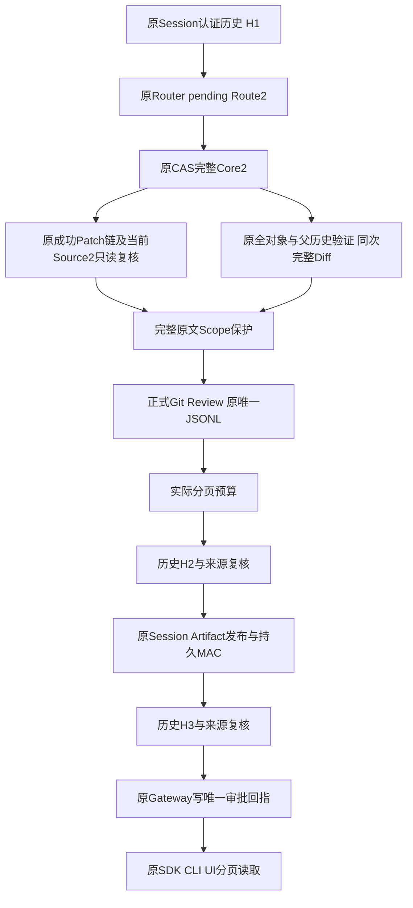
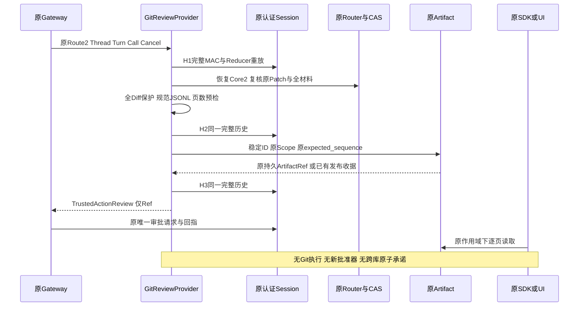
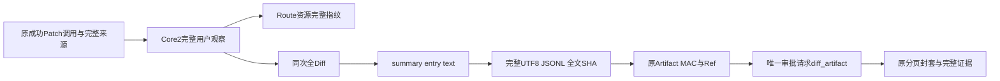

# 正式 Git Review 与原认证 Artifact 审批链详细设计

## 1. 需求背景与设计目标

Core2已完整绑定用户观察、原成功Patch链、Git对象范围和同次完整Diff，但尚无实际Review
生产者。Workspace Review最多16个文件，直接借其合同会截断Git来源；伪造Workspace事务
会错误表达归属。新增正式Git审阅合同，复用原Diff、JSONL编码、Artifact发布和用户审批。

目标：完整Core2从原Route资源恢复，原认证Session和成功Patch历史复核后，发布可完整分页
读取的真实Git审阅材料。不得截断作者、消息、文件、正文，不新增表、授权或批准写入器。
原生Source、父历史、Root/Owner/Scope/MAC、60秒观察期限及全部原容量门禁不放宽。

### 1.1 当前范围与非目标

这是内部正式Review组件及真实离线SDK验收，不默认注册Git写工具，不执行Git写入。
默认Planner/Executor、ProductLink/NativeBridge、A/T2/D、独立Commit与业务Backup2闭环
仍是后续商业验收前置。认证链和本组件回归通过不等于商业1.0验收通过。
CLI/UI原样显示JSONL；没有新增Git专用可视化Diff。SDK不强制用户读完后才能批准。

## 2. 源码研究与架构决策

| 既有入口 | 求证结论与取舍 |
|---|---|
| [材料验证](../../src/harnessix/product_config/git_delivery_plan_materials.py) | 返回同次全CAS、两树闭包和净变更验证后的完整GitTreeDiff，不重新计算第二份Diff |
| [Workspace Review](../../src/harnessix/delivery/trusted_action_contracts.py) | 公共Patch合同16文件，不能用于255路径Git来源；只共用原3000字符Chunk合同与规范编码 |
| [Artifact发布](../../src/harnessix/artifacts/action_review_store.py) | 原Session事务、持久MAC、稳定ID、先查询既有发布和唯一审批回指；不另建Review表 |
| [Artifact分页](../../src/harnessix/artifacts/sqlite.py) | 24KiB字节裁切与200条双门禁；抽出唯一页算法，生产者预检实际50页而非条数除法 |
| [UI读取](../../src/harnessix/product_ui/interaction_service.py) | 原50页/5秒及完整Ref、偏移、正文SHA核验不变，共享小型预算模块而不使后端依赖UI |
| [CLI](../../src/harnessix/agent_cli.py)及[SDK](../../src/harnessix/sdk/agent_client.py) | 消费通用JSONL/Ref，不要求Workspace事务ID；公共审批仍用patch_batch |

Git合同保存完整原ToolCall、Core内容地址、真实DeliveryID、两树身份和全文摘要。
新record_type保持summary/entry/text，summary具有独立spec_version；旧Workspace解析器
不接受新Git正文，旧Workspace字节与Schema保持。新解析器只以LF分记录，Unicode行分隔符
仍属于原文；连续索引、全文SHA和规范重编码共同拒绝重复键、缺省补全、乱序和同义字节。

## 3. 总体架构、核心流程与时序



H1证明当前真实调用与Patch来源，H2/H3拒绝合法事件追加或投影/认证变化。CAS摘要不是MAC，
完整Source2必须重新对应原成功调用、原账本和当前最终文件版本，包含净零路径与文件模式。
读取不重捕获Source、不追加CAS、不修复缺失历史。Artifact发布是唯一允许的本组件持久效果。





时序不是Session、Router、Git、CAS之间的原子快照。未来Executor仍必须重新核验Git
HEAD/config/index、Source、Owner和原正式批准；Review不得作为未来执行的能力凭证。

## 4. 模块、类与接口设计

| 模块/重点符号 | 职责与调用边界 |
|---|---|
| [Git Review合同](../../src/harnessix/product_config/git_delivery_review_contracts.py) | Summary、Entry、Document及全文完整性，数据不授予权限 |
| [Git Review Codec](../../src/harnessix/product_config/git_delivery_review_codec.py) | build/encode/decode，原严格模型递归与唯一JSONL，固定公开错误 |
| [Git Review宿主](../../src/harnessix/product_config/git_delivery_review_host.py) | 冻结原Session/Router/WorkspaceStore/Reader/Ports/Artifact Scope/Owner引用 |
| [Git Review生产者](../../src/harnessix/product_config/git_delivery_review.py) | 三次认证历史、Route/Core绑定、只读Source复核与原发布协调 |
| [原来源](../../src/harnessix/product_config/git_delivery_source.py) | collect与verify共用原Patch连续链和净Mutation组成，verify不写CAS |
| [唯一JSONL](../../src/harnessix/delivery/review_jsonl.py) | 原键序/UTF8/LF/1MiB规范编码，Workspace门面保持旧字节 |
| [完整原文保护](../../src/harnessix/domain/review_text.py)与[原公开保护端口](../../src/harnessix/agent/publication.py) | 对已知Git/Workspace审阅重建原文、核对全文SHA，再由原Scope保护；不提供认证或业务解析器 |
| [唯一分页](../../src/harnessix/domain/artifact_pagination.py) | 原24KiB裁切与200条/50页/5秒预算；[协议门面](../../src/harnessix/protocol/artifact_limits.py)避免UI跨层，不涉及业务鉴权 |

```python
build_product_git_action_review(core, diff, *, checkpoint) -> ProductGitActionReviewDocument
encode_product_git_action_review(value, *, checkpoint) -> bytes
decode_product_git_action_review(body, *, checkpoint) -> ProductGitActionReviewDocument
ProductGitReviewProvider(router, core_store, artifacts, reader,
                         *, snapshot_ports, workspace_scope)
await provider.review(route, thread, turn, call, cancel) -> TrustedActionReview
verify_git_delivery_source(thread, source, router, transactions,
                           *, checkpoint, snapshot_ports) -> None
```

workspace_scope必须来自原ToolRuntime.workspace_scope，与ScopedProtocolArtifactReader一致。
它包含原根身份及读策略，不等于Source.workspace_id或revision；不得用这两个摘要代替。
CoreStore与ArtifactStore必须连接同一原宿主资源；确切类型、Scope对象及Owner令牌需始终一致。

## 5. 数据结构与重点字段

| 字段 | 含义与一致性 |
|---|---|
| summary.spec_version | harnessix.product-git-action-review/v1；不冒充Workspace格式 |
| core_fingerprint / delivery_id | 原全Core内容地址与原Route外部身份 |
| call | 完整原ToolCall，保留作者、消息、目标与所有原参数；repr不泄露正文 |
| workspace_revision | 原完整Source2快照版本，不是Artifact访问作用域 |
| base_commit_oid / target_tree_oid | 原全对象范围中的准确40或64位OID |
| file_count / entries | 1..256个完整原DiffEntry；实际Source保留255路径及根资源上限 |
| diff_utf8_bytes / diff_sha256 | 原完整Diff UTF8字节数和SHA，不是JSONL正文SHA |
| chunks.sequence / text | 连续0起序号，每次生成1900字符，合同最大3000，原文不替换 |
| ArtifactRef.sha256 | 完整规范JSONL SHA，不能与原Diff摘要混用 |

正文每1900字符切块使最坏JSON转义行有余量，但仍按真实记录字节和原页算法校验。
有效的Git输入也可能因完整作者/消息summary超过24KiB、JSONL超过1MiB或超过50页而被拒绝；
这是正式审阅边界，不截断正文、拆改意图或放宽原上限。原64MiB Diff上限不是可发布额度。

## 6. 核心算法伪代码

```text
建立单次60秒单调期限；所有await和同步读取共用取消/期限/宿主检查点
H1 = 原Session认证完整历史；H1.thread == supplied Thread
要求同一活跃Turn中的完整pending Call，原Router.status == supplied Route2
Core2 = 原Route资源加载原CAS；同一Store/Key/Thread/Turn/Call
复核原Patch成功引用、连续链、所有最终版本和完整父历史；不重捕获
Materials = 原唯一全材料算法(Core2)；得到同次完整Diff
以原保护Scope检查整个Diff字符串；之后原Artifact Guard仍检查JSONL
Document = 完整Summary + 所有Entries + 连续原文Chunks
Body = 原规范编码；校验24KiB行、1MiB正文、10000记录及实际50页
H2 == H1；Route及Source再次一致
Ref = 原publish_action_review(稳定UUIDv5, 原Scope, H1.sequence)
H3 == H1；Route及Source再次一致
托管任务结算后父任务末端复核取消/期限/宿主及Ref TTL，无新增await后返回原Ref
```

## 7. 异常、取消、恢复与安全

| 场景 | 正式失败语义 |
|---|---|
| 合同、乱序、额外字段、同义字节或非UTF8 | 固定git_action_review_invalid，不公开作者/路径/正文/解析器错误 |
| Artifact行、总量、记录或50页超限 | action_review_limit；无部分Review或审批请求 |
| Session/Route/调用变化 | git_action_review_changed；不自动修复、补签或复用旧批准 |
| 原宿主、Scope、Owner替换/关闭 | git_action_review_host_invalid或原认证宿主错误；拒绝相同字节替身 |
| 原Source/父历史/模式变化 | 保留原来源、Snapshot及CAS错误；不重捕获为新来源 |
| 完整Diff跨块含受保护材料 | 原public_output_secret_leak；发布前拒绝，防止切块规避 |
| 取消或总期限到期 | 原取消/父Task取消及git_process_timeout；不重置预算 |
| COMMIT应答丢失 | 原发布先查稳定ID/body/归属收据；重试不得新建ID或重置TTL |
| 发布后H3/取消失败 | 可能留下受保护但无审批回指的Artifact；原读侧不可见，不登记成功 |

### 7.1 持久化、事务与恢复边界

正文及持久认证证明仅由原Session Artifact事务提交，原稳定ID保证相同调用的查询优先恢复。
原Gateway随后通过既有审批事务写入唯一diff_artifact回指；两个事务之间允许存在孤立Artifact，
没有审批回指的正文不得通过原Scoped Reader读取。Session、Router、CAS及Git物理状态不构成
跨库原子事务；重试只能核对同一调用、正文、归属和原收据，不能补签、延长TTL或重建来源。

ArtifactPublicationGuard在发布与每次读取时，对已知Git/Workspace Review在原10秒保护期限内
先完成原JSONL校验，再重建完整原文并核对记录顺序、字节数和SHA，调用同一原Scope全文扫描。
这防止重开后当前保护范围变化时通过分块规避检查。旧通用action_review格式沿原JSONL保护，
没有通用文本拼接的语义猜测；原Workspace规范字节、持久MAC及分页额度不变。
托管任务结算后父任务再次核对取消/期限/宿主，并拒绝过期Ref；不续期或另造Artifact身份。

无网络Provider、真实凭据、Keychain或模型费用；测试仅替换网络Provider为离线脚本，
Session/MAC/Scope/Owner/Git/Workspace/Artifact均为真实原实现。声明级Core/Diff测试与
实际认证正向链分开记录。测试临时Git注册不属于产品默认功能；禁止从验证通过推导商业完成。

## 8. 部署、可观测性与运维

仍采用原本地产品宿主与SQLite/CAS，无新服务、端口、数据库迁移或后台Worker。
公开观测仅有原错误码、Route/Core/Artifact身份及有界摘要；不记录Git配置值、密钥、
作者消息或Diff正文到日志。审阅原文只进入原受保护Artifact，沿原TTL/配额/归属读取。
安装验证须以wheel独立target导入新源码；使用现有受控依赖环境时不得称为全新依赖安装。

## 9. 测试矩阵与验收

1. 声明级：新合同/规范JSONL、完整文本、Unicode/二进制/rename/模式、大小与页数边界，
   严格模型、嵌套容器别名、旧代际拒绝、取消检查点；不计为认证正向证据。
2. 真实认证链：原SDK产生成功Patch2，实际Session签名pending Git Call/Route2，原CoreCAS、
   Source/父历史与全材料复核，原Artifact发布、Gateway回指、SDK分页与原拒绝流程。
   Git批准后执行不在本组件验收内，必须在后续默认执行链中单独验证。
3. 失败：历史合法追加与篡改、原资源对象替换、Scope/Owner变化、CAS缺失/污染、Source
   净零路径/最终文件模式变化、跨块受保护材料、发布故障和无引用Artifact不可读。
4. 回归：原Workspace Review字节/Schema、Artifact分页与审批、UI50页/5秒、CLI/SDK、
   原Git Source/Core/Route及严格治理门禁。不修改旧政策或商业验收阈值。
5. 原始失败与修复复验均保留；结果、安装源码一致性、manifest及Review Packet集中交付。
   具体实测统计以[验证报告](../validation/git-review-2026-10-07-v1/README.md)为准。

## 10. 风险与后续边界

审批页面目前为原始JSONL而非Git专属Diff渲染；完整性由生产者与原分页校验保证，但不证明
用户逐行阅读。5秒UI期限独立于60秒生成期限，不保证所有机器均满足显示SLO。原Root、
跨库历史和物理Git事实非原子；未来执行必须新鲜重验。业务Backup2和默认写入闭环未完成前
不得将本组件测试通过标记为默认Git交付或商业1.0完成。
