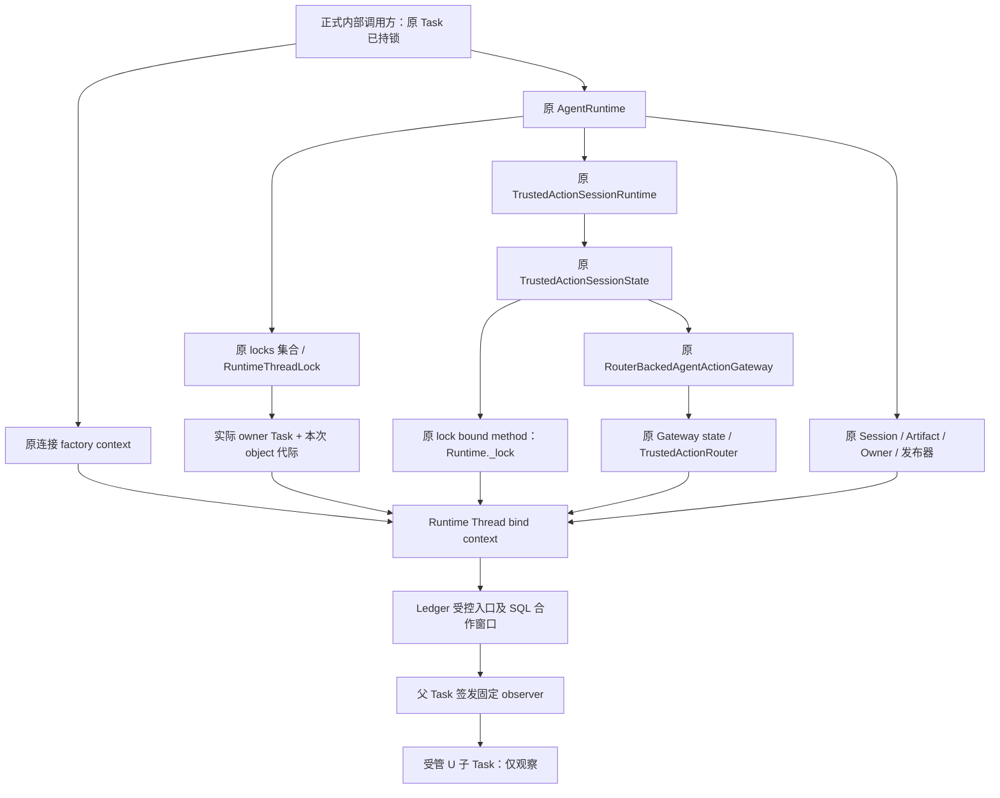
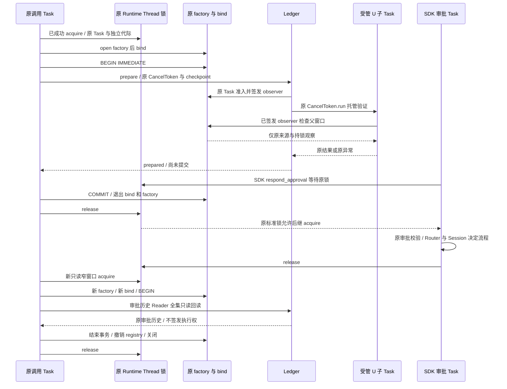
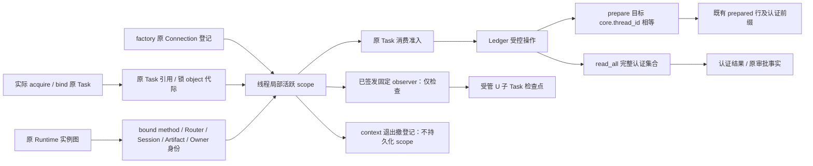

# Git prepared 原 Runtime Thread 临界区总体与详细设计

## 1. 需求背景与变更摘要

Git prepared 关联需要同时约束业务来源、专用 SQLite 原连接和实际 Runtime 的协作临界区。
原连接工厂已经区分准确 Task 的消费准入与受管 U 验证子 Task 的来源观察；
Runtime 原锁已经记录实际成功 acquire 的 Task。两者单独存在仍不能证明：
当前 Ledger 使用的 Router、Session、Artifact 和连接，确实属于该 Runtime 对应 Thread 的同一次持锁窗口。
仅核对 Thread UUID、`locked()`、相同数据库路径或相同对象内容，都不足以连接这些事实。

本变更提供正式内部 context，将已经持锁的原 Task、原工厂连接和原 Runtime 装配绑定；
Ledger 受控入口必须消费该 context，并在发布 prepared 关联时核对目标 `core.thread_id`。
受管 U 子 Task 继续通过父 Task 事先签发的固定 observer 复核来源，不获得持锁、释放或 SQL 准入权限。

| 项目 | 范围 |
|---|---|
| 已实现生产元素 | `git_prepared_runtime_thread.py`、Ledger 的 Runtime observer 接入、`RuntimeThreadLock.observe_owner()` 及独立 acquire 代际 |
| 新增能力 | 活跃原连接与原 Runtime Thread 持锁生命周期绑定、装配实例身份复核、prepared 目标 Thread 核对 |
| 保持能力 | 原连接来源、Owner、认证前缀、事务 epoch、材料及 U 验证、原审批历史、原取消与期限合同 |
| 调用方式 | 原调用方先持 Thread 锁，再打开原 factory、进入 bind；context 覆盖 BEGIN、业务读写、COMMIT 或 ROLLBACK |
| 不新增 | 数据库 Schema、迁移、可复制授权 Token、模型请求、计费请求、公共 SDK／协议接口或独立服务 |
| 未接范围 | 全部 dispatch 与默认 Git 写工具装配；本组件不构成 B7 闭合或完整 Git 交付 |
| 验证状态 | 组件正控已有终态；扩展回归及原审批期限问题仍未封板，整体发布保持 NO-GO |

`status: current` 表示正式内部组件的当前设计，不表示全部回归、真实 B7 全 scope 或发布已经准入。
源码提交与安装候选分别由版本字段及独立交付记录绑定；设计文档不替代原件或发布门禁。

## 2. 设计目标、非目标与验收边界

### 2.1 设计目标

1. 只接受精确 `AgentRuntime`、`UUID`、`sqlite3.Connection` 和既有正式 SQLite 组件；
   不将兼容接口、子类或同字节替身当作原宿主。
2. bind 入口必须证明当前 Task 已持该 Runtime 原 `_locks[thread_id]`；
   不通过自动取锁或新建替代锁补出证明。
3. 冻结原 Runtime → `TrustedActionSessionRuntime` → 原 `TrustedActionSessionState`
   → 原 Gateway state → Router，以及同一 Session、Artifact、Owner 和发布器引用。
4. 锁 observer 绑定原 Task 与本次成功 acquire 的独立 `object()` 代际；
   即使同一 Task 释放后重新获取同一锁，旧 observer 也不得恢复有效。
5. 活跃 context 按原 Connection 对象在 `threading.local` 私有 registry 登记；
   消费者必须是原 Task，不能借助继承的上下文值取得准入。
6. Ledger 的外部 checkpoint 前后均执行内部复核；
   外部回调正常返回不能掩盖锁、装配、来源或事务已经变化的事实。
7. 新 prepared 关联的 `link.plan.core.thread_id` 必须等于 scope 的 Thread；
   `read_all()` 继续认证全集，不能按 scope Thread 隐藏其他 Thread 的关联。
8. 正常和异常退出均撤销 registry；原取消、首失败及原异常实例不由新增末端检查覆盖。

### 2.2 非目标

- 不自动获取、转交或强制释放 Runtime Thread 锁；不改变通用 Runtime 执行与取消流程。
- 不对裸 `sqlite3.Connection.execute()` 安装 authorizer 拦截，不把 Python 私有宿主代码隔离为不可信进程。
- 不承诺任意私有 host 代码恶意移除锁、绕开受控入口并提交后，已提交内容仍可撤回。
- 不证明 SQLite 实际 FD、OS 原子 no-follow、跨库原子快照或实际 Git Ref／config 的终端保护。
- 不新增批准、执行 claim、持久 Fence、授权 Token、approved Writer 或默认 Checkpoint／Commit 注册。
- 不以组件测试替代 P1 响应性、三平台安装验收、R3 实际编码质量或完整 R4 验收。

### 2.3 验收判据

验收须分别证明原 Task 正常窗口、错误 Thread 拒绝、代际撤销、装配替换拒绝、
受管 U 子 Task 观察兼容而 SQL 消费拒绝、窄窗口审批交互、异常实例保留和全部既有 SDK 消费链兼容。
数据库未提交变化由调用方回滚；成功回读不增加业务写入。所有断言均需同候选真实测试结果，
不能从源码结构或单项正常用例推导已通过。当前仅记录设计与源码映射，不作最终验收结论。

## 3. 选型、总体架构与模块边界

### 3.1 方案选型

| 方案 | 判断与原因 |
|---|---|
| 只检查 `locked()` 或 Thread UUID | 无法证明当前持有者、原锁实例或同一次 acquire，拒绝 |
| 新增独立业务锁 | 与 Runtime 原审批／取消锁脱节，形成双临界区，拒绝 |
| bind 自动调用 `_lock()`／acquire | 隐藏调用方责任，可能对非重入锁二次等待，拒绝 |
| ContextVar、Task 名称或整数 ID | 上下文继承或非实例身份不足以证明原 Task，拒绝 |
| 单纯要求每次检查者都是原 Task | 会误拒绝合法 U 验证子 Task 的内部检查点，拒绝 |
| 允许子 Task 建窗口或重新签发 observer | 将观察升级为消费／执行权，拒绝 |
| 可序列化 Token、持久 Lease 或新 Schema | 不适用于仅本次进程内原实例事实，且扩大恢复及授权面，拒绝 |
| 原持锁事实 + Task 准入 + 固定只读 observer | 复用现有锁、连接与控制链，采用 |

### 3.2 架构图



调用方负责原锁与事务，bind 只建立进程内活跃关系。Runtime 是锁集合与会话装配的来源；
`TrustedActionSessionState.lock` 必须是原 Runtime 的原 `_lock` bound method，
而非行为类似的函数。Gateway 的原 state 指向 Ledger 实际消费的 Router；
Artifact 的 Session 必须就是 Runtime store。Owner 与发布器仍由原 Session／Runtime 生命周期管理。
父 Task 先通过消费准入，才能签发用于子 Task 的 observer；observer 不返回数据库、锁或执行能力。

### 3.3 模块职责

| 模块 | 责任 | 不承担 |
|---|---|---|
| [Runtime 原锁](../../src/harnessix/agent/runtime_thread_lock.py) | 标准异步互斥、实际 owner Task、独立 acquire 代际、固定持锁观察 | Git 业务认证、持久 Fence、跨进程锁 |
| [Runtime](../../src/harnessix/agent/runtime.py) | 原装配、原锁集合、当前 Task 持锁检查、既有执行／审批／取消 | 为 bind 自动扩大所有工具的锁区间 |
| [Runtime Thread scope](../../src/harnessix/product_config/git_prepared_runtime_thread.py) | 活跃连接绑定、原实例冻结、原 Task 准入、固定 observer、Thread 匹配 | 建库、取锁、BEGIN／COMMIT／ROLLBACK、授权签发 |
| [原连接工厂](../../src/harnessix/product_config/git_prepared_link_connection.py) | 原 Connection／Task 登记、路径 pin、存活核验及来源观察、退出关闭 | Runtime 装配证明、实际 FD 认证 |
| [Ledger](../../src/harnessix/product_config/git_prepared_link_ledger.py) | 内部控制组合、全集认证、prepared 发布、目标 Thread 核对 | 宿主提交／回滚、真实 Git 写入 |
| [Prefix SQL](../../src/harnessix/product_config/git_prefix_sql.py) | 原 Task SQL 合作窗口、progress 首失败、事务 epoch、WriteWindow 来源 | 裸 SQL authorizer、业务锁获取 |
| [审批历史 Reader](../../src/harnessix/product_config/git_prepared_approval_history.py) | 复用 Ledger `_control` 的全集只读历史／决定来源回读 | 将历史 approved 事实转成新执行授权 |

## 4. 核心流程、调用顺序与时序

### 4.1 正常业务流程

| 阶段 | 正常路径 | 失败与退出责任 |
|---|---|---|
| 原锁与连接 | 原 Task 已持原 Thread 锁，打开原 factory，再进入 bind | 不满足原事实时拒绝，不能自动取锁或改用普通连接 |
| 事务与控制 | 调用方 BEGIN／BEGIN IMMEDIATE；Ledger 原 Task 准入及内部前后复核 | 事务由调用方管理，控制失败不继续业务发布 |
| 业务认证 | 认证全集、原材料与原 U；prepare 另核对目标 Thread 并发布、回读 | 坏行、目标不匹配或原来源变化均失败，不隐藏非目标行 |
| 同步末端 | 完成原终端读集合和内部复核 | 不新增 await 或外部回调绕开末端合同 |
| 提交与收束 | 调用方在 bind 内 COMMIT 或结束只读事务，随后撤登记、关连接、释放锁 | 未提交异常在 bind 内回滚并保留首失败，再逆序退出 |

必须按锁 → factory → bind → 事务的顺序嵌套，逆序退出。Ledger `prepare()` 成功返回时仍未提交；
调用方须在 bind 内完成提交或回滚，而不是先退出 bind 再处理事务。
正常退出 bind 才执行末端 `_require_scope(database).check()`；异常退出直接撤销登记，
不以这次新增末端检查替换已发生的异常。回滚是调用方行为，不是 bind 的隐式功能。

prepare 先核验已有全集，再认证目标，核对 Thread，然后新增原 prepared 关联与认证前缀并完整回读。
read_all 仍核验全部关联和完整前缀；scope 的 Thread 只证明当前消费者的临界区，
不是数据库行过滤条件。其他 Thread 的坏行仍导致失败，不允许以隐藏行实现成功。

### 4.2 父子 Task 与审批交互流程时序图



U 子 Task 通过原 `CancelToken.run(..., preserve_failure=True)` 产生；它可以调用父 Task 已签发的
Runtime 与连接 observer，不能重新进入 `_require_scope`、重新签发 observer、取 SQL epoch／WriteWindow
或成为锁 owner。来源 observer 的固定内部检查可能读取原连接的路径报告；这不等于向子 Task 开放任意 SQL。

SDK 审批响应由既有 `AgentRuntime._reply_approval()` 获取同一 Thread 锁。
正确主路径是在 prepared 数据库窗口完成提交、撤销登记、关闭连接并释放锁后，才等待正式 SDK 审批响应；
测试可让独立审批 Task 提前排队，但父 Task 不得在持锁窗口内等待其完成。
否则父 Task 等待审批、审批等待原锁，形成非重入锁依赖环。

批准之后重新打开只读窄窗口，使用审批历史 Reader 而非将仍要求 pending 的旧 Ledger 回读当作批准回读。
历史 Reader 的 `approved`／`decision_not_linked` 仅表示原审批事实，
不表示 Git 决定已经发布、默认 Writer 已接入或实际 Git 操作已经执行。
SDK 测试中 `_decide` 停止后台 `_spawn` 是执行前测试隔离，不属于新增生产流程或业务效果证据。

## 5. 接口设计与调用合同

| 接口 | 入参与输出 | 前置条件、行为与错误边界 |
|---|---|---|
| `RuntimeThreadLock.observe_owner()` | 无参数，返回 `Callable[[], None]` | 签发时原 Task 必须持锁；冻结原 owner 与代际；消费时仅观察该次持锁仍存在 |
| `bind_prepared_git_runtime_thread(database, runtime, thread_id)` | 同步 context，yield 无载荷 | 精确活跃工厂 Connection、原 Runtime、原 Task 已持目标锁；同一 Connection 不得重复 bind；不获取锁、不控制事务 |
| `_runtime_check(runtime, thread_id)` | 返回固定检查闭包 | 原内部辅助函数；检查原装配并冻结身份；闭包可供固定 observer 消费 |
| `_require_scope(database)` | 返回内部 `_RuntimeThreadScope` | 活跃 registry、原 Task、活跃原 factory 登记、固定检查全部成立；不供外部提交 witness |
| `_prepared_runtime_thread_observer(database, router, artifacts)` | 返回无参数固定观察闭包 | 先原 Task 准入；Router 与 Artifact 必须是 scope 原实例；之后只检查原登记与原装配／持锁生命周期 |
| `require_prepared_git_runtime_thread(database, thread_id)` | 成功无返回载荷 | 原 scope 准入；精确 UUID 且值等于 scope Thread；供 prepare 目标核对 |
| `ProductGitPreparedLinkLedger.prepare(route_id, *, cancel, checkpoint)` | 返回 `ProductGitPreparedLink` | 原受控宿主、scope 及已有写事务；结果仍未 COMMIT；失败由调用方回滚 |
| `ProductGitPreparedLinkLedger.read_all(*, cancel, checkpoint)` | 返回完整 tuple | 原 scope、原受控宿主、已有事务；全集认证，不按 scope Thread 筛行 |

上述 bind／require 是正式内部组件接口，不进入模型工具 Schema、公开 SDK 参数或协议数据。
调用方只能提供原实例，不能提供“已检查”布尔值、任意闭包、可复制 scope 或历史锁证明替代原事实。
Ledger 构造本身只保存资源；强制 context 的位置是实际受控操作 `_control`，而非构造即取得执行授权。

`observe_owner()` 消费不检查观察者是不是 owner；这一点用于原合法子 Task 和固定回调观察。
签发、`require_current_owner()`、`release()` 仍只允许原持有 Task，三者不能由 observer 结果替代。
运行时未打开、组件关闭或原锁归属失败保留既有错误，不保证所有失败统一转换成 scope 错误。

## 6. 数据结构、重点字段与数据流

### 6.1 scope 字段

`_RuntimeThreadScope` 是 `@dataclass(frozen=True, slots=True)`，不序列化、不写入 Session 或 GitDB。

| 字段 | 实际类型／来源 | 约束 |
|---|---|---|
| `thread_id` | 原调用方的精确 `UUID`，已通过 Runtime 原锁检查 | 用于目标 prepared 关联匹配；不是 read_all 的过滤器 |
| `task` | bind 时的实际 `asyncio.current_task()` 对象 | 必须非空；消费窗口要求当前 Task `is scope.task` |
| `router` | `runtime._trusted_actions._state.gateway._state.router` | observer 签发时 Ledger Router 必须 `is` 原实例 |
| `artifacts` | `runtime._artifacts` 的原 `SQLiteArtifactStore` | observer 签发时 Ledger Artifact 必须 `is` 原实例 |
| `check` | `_runtime_check` 返回的固定闭包 | 冻结原装配及 acquire 代际；不是外部可提交的授权能力 |

scope registry 是模块私有 `_owned = threading.local()` 的
`scopes: dict[sqlite3.Connection, _RuntimeThreadScope]`。
键就是原 Connection 对象，不使用路径、哈希、字符串 ID 或 `id()` 作为可重放证明。
同一 OS 线程的多个 asyncio Task 可以看到线程局部映射，所以准入另用准确 Task 实例比较。
不同连接可独立登记；同一连接在活跃 bind 内重复登记拒绝。没有 ContextVar 继承准入。
正式正常 context 的父 Task 在该窗口内仍处于运行或等待状态；当前 scope 不增加 `Task.done()` 额外检查。
锁原语针对已完成 Task 的附加 worker 防护建议暂缓，不属于已实现语义、当前验收承诺或本切片生产断言。

### 6.2 锁与原连接的相关事实

| 状态 | 内容 | 生命周期 |
|---|---|---|
| `RuntimeThreadLock._owner` | 真正成功 acquire 的 `asyncio.Task` 引用 | 成功 acquire 后记录；原 Task release 后清空 |
| `_owner_generation` | 每次成功 acquire 独立创建的 `object()` | observer 按 `is` 比较；不采用递增数字、UUID、Lease 或可复制 Token |
| 原连接 registry | `(path, before_pin, after_pin, original_task)` | 仅原 factory context 活跃期间存在；退出撤销并关闭 |
| 原 SQL 控制对象与 `epoch` | 原 `_SQLCheckpoint` 对象、事务边界计数 | 仅 SQL 合作窗口有效；与锁 acquire 代际不同，不能互相替代 |

连接来源登记与 Runtime scope 登记分别位于各自模块的线程局部 registry，
不能因为都使用 `threading.local` 就将其视作同一凭据。
`_registered_prepared_connection()` 对已登记连接仍核对原 Task；bind 不允许把普通连接降格注册为产品连接。
原路径 pin 与 `PRAGMA database_list` 用于来源一致性，仍不是 SQLite 实际 FD 证明。

### 6.3 原装配身份快照

`_runtime_check` 首先要求 Runtime 开放和原 Task 持锁，再从真实对象图取值，不接受 caller 声明的装配。
初始检查包含精确 Runtime／Lock／TrustedActionSessionRuntime／SQLite Session／Artifact／Gateway／Router 类型。
原 `TrustedActionSessionState` 与 Gateway state 冻结的是实例身份，不新增它们的持久合同。

| 身份关系 | 初始及持续约束 |
|---|---|
| `runtime._locks[thread_id]` | 始终是原 `RuntimeThreadLock` 实例，原 observer 的 owner／generation 仍有效 |
| `runtime._trusted_actions`、`actions._state` | 始终为原 actions 与原 state，浅复制同内容也不接受 |
| `state.lock` | 初始为 `MethodType`；`__self__ is runtime`，`__func__ is AgentRuntime._lock`；持续 `is` 初始 factory |
| `state.gateway`、`gateway._state`、`gateway_state.router` | 均为原实例，Gateway 不能关闭 |
| `runtime.store`、`state.store`、`artifacts.session` | 都指向同一个原 `SQLiteSessionStore` |
| `runtime._artifacts`、`artifacts._publication` | 原 Artifact 与原 guard，后者初始非空且持续不替换 |
| `runtime._owner`、`session._runtime_owner_token` | 初始非空并保持原对象身份；复用既有 Owner，不签发新 Token |
| `session._publication` | 初始非空并保持原发布器身份；原业务认证不减少 |
| `runtime._public_output_protection` | 保持初始引用，包括原合同允许的空值；不新增非空或新类型要求 |

重新访问 `runtime._lock` 可以产生另一个 bound method 对象；
不能因此替换构造时已经冻结在 `state.lock` 的原 method，即使 self 和 function 相同。
该严格性证明的是实际装配连续性，不是一般鸭子类型兼容性。

### 6.4 数据流图



输入来自原 acquire、原 factory 和 Runtime 组合根；经过准入后，
prepare 仅写既有业务行与认证前缀，read_all 仅返回原全集认证结果。
observer 传递的是固定检查行为，不传递 SQL 准入或可恢复的证据载荷。
Task 引用、代际 object、scope 和装配快照都不进入持久数据、模型上下文或公开诊断。

## 7. 持久化、事务、并发与幂等

### 7.1 事务责任

本变更无 DDL、数据库版本、迁移、表／字段／索引变更，也不改变原 prepared 编码、MAC 用途和 Key 管理。
bind 不开始、不提交、不回滚事务；原 factory 也不自动 COMMIT，关闭时未提交事务沿 SQLite 原行为回滚。
正式调用方必须在活跃 bind 内显式完成事务，关闭回滚只是最后的既有资源收束，不是提交策略。

写窗口用已有数据库的写连接和调用方 `BEGIN IMMEDIATE`，只读窗口用原 `read_only=True` 工厂和 `BEGIN`。
工厂只打开已存在的普通文件；目录准备和既有数据库初始化不是 bind 的责任，
不得从 SDK 测试的临时初始化推导默认产品启动新增建库行为。

### 7.2 并发责任

原 Thread 锁仍非重入。调用方已持锁时，bind 只验证原 owner；嵌套独立连接不得重复获取同一锁。
测试辅助 [git_runtime_thread_scope](../../tests/support/git_runtime_thread_scope.py) 可在测试外层获取锁，
或在已经核验当前 Task 持锁时直接复用；这不表示生产 bind 会自动获取锁。

同一 Thread 的审批／取消按原锁排队；其他 Thread 沿原 Runtime 锁粒度运行。
该锁不是 GitDB 全库锁，不是 Git 仓库 Ref 锁，也不保证 Session、Audit、CAS、Artifact 与 GitDB 的跨库原子性。
read_all 不因消费者持 Thread T1 锁就省略 T2 关联，仍执行原跨库观察、认证和终端复核。
因此“全集读取”与“全部 Thread 已被独占”必须分开表述。

### 7.3 幂等与提交边界

prepared 精确重试仍使用原 route 身份与完整关联相等判断；新 scope 不制造新业务 ID，也不自动重试。
读取目标、返回已有相同关联与新关联发布，均受相同 Runtime scope 约束。
COMMIT 确认丢失、进程退出后的对账与恢复沿原合同处理；旧 scope／observer 不能恢复或重放。

scope 覆盖 COMMIT 仅表示正常调用链在整个事务期间仍处于原持锁 context。
它不拦截裸 COMMIT；正常 context 的退出检查发生在 body 完成之后。
若任意私有 host 代码恶意释放锁后直接 COMMIT，末端拒绝不具备撤销已提交内容的能力。
该情形不属于本组件可证明的隔离或事务补偿边界，不能宣传为“所有 SQL 均被强制授权”。

## 8. SDS 核心逻辑与详细伪代码

以下为源码等价逻辑和正式内部调用约束，不新增公共 API，也不将示意函数当作已接入的 dispatch。

### 8.1 锁 owner 观察与 acquire 代际

```text
acquire():
    task = 实际 asyncio.current_task()
    无 task -> runtime_thread_lock_unowned
    acquired = await 标准 asyncio.Lock.acquire()
    在无新增 await、无外部回调的同步区间：
        owner = task
        owner_generation = object()  # 每次成功获取都独立
    返回 acquired

observe_owner():
    调用 RuntimeThreadLock.require_current_owner(本锁)
    冻结 owner 与 owner_generation
    返回 observer():
        若未 locked，或 owner 不是冻结 Task，或 generation 不是冻结 object：
            抛出原 runtime_thread_lock_unowned
        否则返回 None，不登记观察者、不授予 release 权限

release():
    require_current_owner()
    标准 release()
    owner = None
    owner_generation = None
```

使用基类的 `RuntimeThreadLock.require_current_owner(self)` 签发 observer，
不经子类覆盖的检查跳过签发准入。等待被取消、超时或未恢复执行的已唤醒等待者，
均不能覆盖原 owner／代际；成功获取后不新增挂起点。原标准锁的等待和唤醒合同保持。

### 8.2 Runtime 装配固定检查

```text
_runtime_check(runtime, thread_id):
    核对精确 AgentRuntime 与 UUID
    runtime._ensure_open()
    runtime._require_thread_lock(thread_id)  # 只查已登记原锁，不新建
    取原 lock；核对精确 RuntimeThreadLock
    observe_owner = lock.observe_owner()  # 原持有 Task 在此签发
    从原 Runtime 读取 actions、session、artifacts、state、gateway、factory
    核对精确正式组件，以及原 MethodType.__self__ / __func__
    核对 state.store 与 artifacts.session 就是原 session
    冻结原 gateway_state、router、runtime Owner、既有 Owner token、发布器和 protection
    必需的 Owner／token／发布器／guard 为空 -> scope 无效

    check():
        observe_owner()  # 原 Task 与同一次 acquire 仍成立
        runtime._ensure_open()
        逐一按 is 核对第 6.3 节全部原引用及 Gateway 未关闭
        任一变化 -> git_runtime_thread_scope_invalid

    check()
    返回固定 check
```

持续检查不再次申请锁或重新签发代际，否则会将已经撤销的旧窗口重新解释成有效窗口。
Owner token 是既有 Session 的内存 owner 事实，不是本组件新增可复制 Token。

### 8.3 bind、原 Task 准入与固定 observer

```text
bind(database, runtime, thread_id):
    核对精确 Connection 及当前原 Task 的活跃 factory 登记
    check = _runtime_check(runtime, thread_id)
    task = 实际 current_task；必须非空
    从原 actions 取得 router 与 artifacts
    取本线程 scopes 映射；同一 database 已登记 -> 拒绝
    scope = 冻结的五字段 _RuntimeThreadScope
    scopes[database] = scope
    try:
        yield None
        _require_scope(database).check()  # 仅正常退出执行新增末端检查
    finally:
        删除 scopes[database]  # 正常、错误、取消均撤销

_require_scope(database):
    scope = 本线程 scopes[原 database]
    不存在或当前 Task is not scope.task -> scope 无效
    当前原 Task 的 factory 登记不存在 -> scope 无效
    scope.check()
    返回 scope

_prepared_runtime_thread_observer(database, router, artifacts):
    scope = _require_scope(database)  # 签发者必须是原 Task
    router is not scope.router 或 artifacts is not scope.artifacts -> 拒绝
    返回 observe():
        当前本线程 scopes[database] is not 原 scope -> 拒绝
        scope.check()  # 只观察父持锁／装配；不调用消费准入

require_prepared_git_runtime_thread(database, target_thread_id):
    scope = _require_scope(database)
    target_thread_id 不是精确 UUID 或其值不等于 scope.thread_id -> 拒绝
```

异常在 `yield` 内抛出时不继续执行正常末端检查，因此 scope 撤销不覆盖该异常。
observer 即使被保留，在 registry 撤销、原锁释放／换代或原装配置换后也拒绝。
子 Task 只能消费已经签发的 observer；无法将 observer 当作 `_require_scope` 返回值或 SQL 准入凭据。

### 8.4 Ledger 控制组合与发布逻辑

```text
_control(ledger, 原 cancel, 原 budget, checkpoint, read_set):
    核对原 CancelToken、精确 Connection 及 require_git_review_host
    冻结 ledger 资源引用
    observe_connection = 原 Task 签发的原连接来源 observer
    observe_thread = 原 Task 签发的 Runtime Thread observer
    进入原 observe_prepared_state
    epoch = None

    raw_internal():
        cancel.checkpoint()
        budget.remaining()
        原 host 检查
        observe_connection()
        observe_thread()
        原 prepared state 不变检查
        核对 ledger 所有资源引用仍是原实例
        epoch 非空时，核对原 SQL 控制实例与原事务 epoch

    internal = parent_cancel_checkpointer(raw_internal)
    control():
        internal()
        checkpoint()  # 原外部回调只执行一次
        internal()    # 回调正常返回后仍须复核

    control()
    没有已有事务 -> git_delivery_store_transaction_required
    在原 Task 进入 git_prefix_sql_window(checkpoint=control)
    捕获原 transaction epoch
    yield control；正常返回再 control()
    原 SQL 窗口末次外部回调结束后：
        不再 await，不再调用外部 checkpoint
        使用 checkpoint=internal 的新原 SQL 窗口
        read_set.require_sql -> terminal -> require_sql -> internal

prepare(route_id):
    先原异步取消交付点，建立既有 GitOperationBudget
    进入 _control 及原总期限 timeout
    拒绝 query_only 写入；确认原写事务合同
    完整 _read_all，认证目标原关联及 U
    require_prepared_git_runtime_thread(database, link.plan.core.thread_id)
    复核原行／anchor／total_changes
    同 route 完整相等 -> 返回原关联，不新增发布
    否则沿原 Prefix Writer 发布 prepared 行、事件与认证前缀
    check()；完整 _read_all 复核；原终端控制完成
    返回 link，不 COMMIT

read_all():
    使用相同 _control、原总期限及原认证链
    核验整个物理前缀，再逐个认证全部关联与 U
    不添加 WHERE thread_id，不因 scope Thread 不同跳过行
    复核完整行、anchor、total_changes 和终端读集合
    返回全部关联，不修改数据库
```

首次异步交付点、原父取消检查、U 子 Task 托管和同步终端顺序均保留。
在 scope 之外仅构造 Ledger 不会写入；实际 `prepare`／`read_all` 及复用 `_control` 的历史 Reader 必须失败关闭。

### 8.5 正确的窄窗口内部调用与 SDK 分段

```text
原内部消费者(调用方已持锁，使用原 cancel 与 checkpoint):
    runtime._require_thread_lock(thread_id)
    with open_prepared_git_connection(已有 path, read_only=False) as database:
        with bind_prepared_git_runtime_thread(database, runtime, thread_id):
            try:
                database.execute("BEGIN IMMEDIATE")
                link = await 原 Ledger.prepare(route_id, cancel=cancel, checkpoint=checkpoint)
                require_prepared_git_runtime_thread(database, link.plan.core.thread_id)
                database.execute("COMMIT")
            except BaseException:
                若还有活跃事务，在当前 bind 内尝试 ROLLBACK
                回滚次生错误按原宿主清理合同处理，不能覆盖首次异常
                重新抛出首次异常
    返回 link

正式 SDK 交互的分段约束:
    A. 原调用方取得 Thread 锁 -> 上述数据库窄窗口 -> 关闭连接 -> 释放锁
    B. 在 A 之外 await 正式 SDK respond_approval 或 cancel_turn
       不把审批 Task 等待包含在 A 的锁与数据库事务内
    C. 原调用方重新取得 Thread 锁 -> 新只读 factory -> 新 bind -> BEGIN
       await 原审批历史 Reader.read_all/read_decided
       在 bind 内结束只读事务 -> 撤销登记 -> 关闭连接 -> 释放锁
```

提交前的显式 require 是调用方核对示例，不表示 bind 安装了 COMMIT 拦截器；
它不能替代 Ledger 原材料、认证、取消与期限控制。示例不引入额外 await／外部回调夹在末次 scope 核对与 COMMIT 之间。
如果原回滚本身失败或连接已经关闭，保留首次异常，沿原资源关闭合同收束，不伪造回滚成功。
不能将异常清理描述成新增事务补偿机制。

## 9. 失败、恢复、取消与超时

### 9.1 首失败与资源收束

bind body 的 `KernelError`、普通异常、`asyncio.CancelledError` 或原领域取消直接传播，
`finally` 仅撤销 scope registry。正常退出才执行新增末端检查；body 失败后不得再运行该检查覆盖原失败。
原连接 context 异常退出不执行正常尾部 checkpoint，仍撤销连接登记并关闭。
原 SQL 窗口将 progress 捕获的首次异常保存在 `interrupted`，按原合同优先传播原异常实例，
不将其降为泛化 `sqlite3.OperationalError` 或新增 scope 错误。

调用方在 bind 内回滚未提交变化，随后依次退出 scope、factory 和锁。
原 `_control` 的正常同步末端仅在既有成功路径执行；失败不通过重捕获、重签或新 scope 追认。
锁 release 仍要求原持有 Task。恶意修改私有 registry、猴子补丁破坏锁或任意 `__exit__` 重写，
不属于可保证原异常与锁释放的隔离边界。

### 9.2 取消与期限不变

Ledger 的入口 `await asyncio.sleep(0)`、`parent_cancel_checkpointer`、原 `CancelToken`、
`GitOperationBudget(_BASELINE_TIMEOUT_SECONDS)` 和原 `asyncio.timeout` 保持。
既有总预算为 60 秒；同次操作内 SQL、认证和 U 验证共享原剩余期限，
bind 不另建 Token、deadline，不续期，也不将每个子步骤重置为完整预算。
原专用写连接的 SQLite busy timeout 与原 Prefix progress／trace 合同不变。
progress 每 1000 步检查不保证每条短 SQL 都触发，因此原显式入口和前后检查仍必需。

锁等待本身没有由 bind 新增的超时或取消通道。Ledger 预算不自动覆盖外部取得锁前的排队时间，
也不把调用方 BEGIN／COMMIT／ROLLBACK 全部变成新的 deadline 拦截区域；这些边界沿原调用合同。
已有父 Task 取消、Token 取消与 Turn 到期不是同一种信号，不能混称为“立即释放锁”。

通用 Runtime 的顺序仍是 `_cancel` → `_record_cancel` → 获取原 Thread 锁并写取消状态
→ 再取消 active Token。本变更不修改该顺序。
若把长耗时工具、模型等待或整个 Git 工作流包进原 Thread 锁，取消请求可能一直排队，
尚未执行到 Token.cancel；不能借“有 Token 检查”宣称该整体加锁方案响应及时。
数据库窄窗口也可能包含现有昂贵认证，不能仅以“窄窗口”命名推导 P1 已达标。

### 9.3 恢复边界

进程退出或 Runtime 关闭后，原 registry、Task、锁代际和 observer 均不能作为恢复凭据。
再次读取必须由当前正式 Runtime、当前原 Task、当前取得的锁与新 factory／bind 重新进入。
不能延用旧 Thread 锁证明、重新赋值 registry 或将旧 prepared 结果当作当前批准。
数据库事务恢复、确认丢失、历史备份 Loader、Router 先行与 Session 后提交的审批恢复仍沿各自原合同。
新增 scope 不改变这些合同，也不将 prepared Reader 扩展为全生命周期恢复器。

## 10. 安全、权限与信任边界

| 边界 | 当前保证 | 不能推导的结论 |
|---|---|---|
| Runtime 装配 | 原组件实例、原 bound method、Owner 与发布器连续性 | 同内容副本也可作为正式宿主 |
| 锁生命周期 | 实际 owner Task 与同一次 acquire object 代际 | 所有 Runtime dispatch 已全程持锁 |
| 原连接 context | 原 Task 的活跃 factory 登记及原来源观察 | 原 SQLite FD 已被认证、裸 execute 全部被授权过滤 |
| U 子 Task | 父签发固定 observer 可复核父窗口 | 子 Task 可以签发窗口、消费 epoch／Writer 或 release |
| Ledger 受控入口 | 无 scope 拒绝、控制前后复核、prepare Thread 相等 | 任意私有代码直接 SQL 均受同样门禁 |
| 全集只读 | 原全集／非目标行仍认证，坏行不能隐藏 | 持一把 Thread 锁就独占全部 Thread 或跨库快照 |
| 提交 | 正常链在原持锁 bind 内提交 | 已恶意越界提交的数据可由尾部检查撤销 |

本方案用于正式内部组件的协作式原实例校验，而不是防御同进程任意恶意 Python host 的沙箱。
正常调用链按合同持锁，Ledger 受控入口强制 context；两项必须同时成立，不能互相替代。
本变更不新增 `set_authorizer`；原 Prefix SQL 的 progress／trace 是合作中断和事务代际观察，
不是完整 SQL 授权器。线程局部 registry 也不是加密封存、OS FD pin 或跨进程能力。

原 Owner、MAC、材料、Review、U 绑定、输出保护和审批指纹不放宽。
observer 不返回 Task／对象地址／连接正文，不序列化、不上传、不进入模型提示词。
无新增模型请求或费用请求；测试以临时隔离 fixture 和真实本地 SDK／产品组件链验证，
不需要真实业务环境、私有账本、封存材料或外部项目数据。

## 11. 可观测性与错误分类

复用现有 `KernelError` 与原异常传播，不新增遥测服务、日志 Schema 或包含私有对象的诊断接口。
失败输出只保留原有限错误码和正式提示；不输出 owner、Task 名称／对象地址、代际、数据库内容或 SQL 正文。

| 错误／信号 | 来源与含义 | 处理 |
|---|---|---|
| `git_runtime_thread_scope_invalid` | 无活跃 scope、非原 Task、Thread 不匹配或原装配身份变化等 | 拒绝受控入口／结果；未提交变化由调用方回滚 |
| `runtime_thread_lock_unowned` | 未持原锁、签发者不是原 Task，或观察到原 acquire 已撤销 | 保留原锁错误，不转成批准或自动重新获取 |
| `git_prepared_link_host_invalid` | 原 factory 来源、连接 Task、路径或存活合同失败 | 保留连接层拒绝；不能改成通用连接继续 |
| `runtime_closed`／既有关闭错误 | Runtime 不开放或原组件关闭 | 原错误直接传播，不重新打开冒充同一 scope |
| `git_delivery_store_transaction_required` | Ledger 无调用方已有事务 | 不自动 BEGIN |
| `git_delivery_store_read_only` | prepared 发布使用只读连接 | 不自动重开写连接 |
| `git_prefix_sql_control_required`／`git_prefix_sql_owner_invalid` | 原 SQL 窗口缺失或消费者／来源变化 | 不从 observer 或历史 epoch 恢复准入 |
| `publication_history_unproven` 等原认证错误 | 原前缀、事务代际、材料或业务来源不能成立 | 不跳过坏行、不补签、不修复 |
| `git_process_timeout`／`git_baseline_timeout` | 原操作或原 U 验证期限耗尽 | 沿原优先级与期限合同失败，不续期 |
| 原 checkpoint 异常、`TurnCancelled`、`CancelledError` | 上游首失败或原取消 | 保留原异常实例及原 Task／Token 语义 |

observer 过期不是可自动恢复的瞬态连接故障，不能通过 catch 后复用旧结果或自动重试获得执行权。
如需验证错误分类，用指定测试中的异常对象身份、数据库行与写计数断言，
不新增业务正文或敏感信息日志。

## 12. 测试方案、源码映射与验证状态

### 12.1 新增测试与否定样例

| 场景 | 源码／测试定位 | 必须证明的断言与当前证据边界 |
|---|---|---|
| 原窗口跨 await、prepare、COMMIT、只读重开 | [scope 测试](../../tests/product_config/test_git_prepared_runtime_thread.py)：`test_actual_scope_lives_through_commit_and_child_is_only_an_observer` | 原 Task 在提交后、退出前仍持锁；旧 observer 退出后拒绝；重开只读无新增业务写入 |
| 有原连接与原锁但没有 bind | 同文件：`test_actual_connection_without_runtime_scope_is_not_product_authority` | prepare、read_all、history 都拒绝；不能将工厂登记当作 scope |
| 持其他 Thread 的真实原锁 | 同文件：`test_real_held_lock_for_another_thread_cannot_publish_target_link` | 目标 core Thread 不同必须拒绝，即使其他原事实成立 |
| 同 Task release 后 reacquire | 同文件：`test_same_task_release_reacquire_cannot_restore_an_issued_scope` | 新锁 owner 检查可成功，但旧代际 observer 永久失效；只能新 bind |
| 同内容装配置换 | 同文件：`test_actual_runtime_replacements_cannot_borrow_the_old_scope` | 浅复制 actions／state／Session／Artifact／Owner 或换锁实例不能借用旧 scope |
| U 子 Task 的观察／消费分离 | scope 正控及 [锁 observer 测试](../../tests/agent/test_runtime_thread_lock_observer.py) | 已签发 observer 成功；子 Task require scope、重新签发、SQL 窗口或锁 release 拒绝 |
| SDK 审批排队后继续 | scope 测试：`test_sdk_approval_waits_for_original_database_window_then_completes` | 原窗口内审批仍 pending；窗口提交并释放后审批完成；新历史只读窗口回读原决定，不证明 Git 效果 |
| 每 acquire 独立 object 及原锁绑定 | 锁 observer 测试：代际循环、不同锁、不同 owner、等待者取消／超时 | 旧 observer 不因重取、换 Task 或另一锁持有而恢复；未成功 acquire 不改原代际 |
| 回调／wait_for／取消清理 | 锁 observer 测试：callback、实际 acquiring Task、父子取消、原异常实例 | 观察不等于签发或 release；标准等待语义与首失败身份保持 |
| 全集含其他 Thread | [Ledger `_read_all`](../../src/harnessix/product_config/git_prepared_link_ledger.py) 与既有非目标坏行测试 | 当前源码无 Thread 过滤；多 Thread 混合全集的同候选专项结果仍须验证，不能由目标 Thread 负控替代 |

否定样例不得写成放行示例：无锁直接 bind；原锁已释放后继续用旧 observer；
scope 存活时替换原 state.lock 为 lambda／另一个 method；U 子 Task 自建 SQL 窗口；
BEGIN 在 bind 前或 COMMIT 在 bind 后；持锁 await 同 Thread SDK 审批；
为让 read_all 成功过滤其他 Thread 的坏关联；把历史 approved 结果解释为真实 Git 写入授权。
裸 execute 绕开受控入口属于明确的能力边界，不作为“已实现 authorizer 拒绝”的测试断言。

### 12.2 七个既有 SDK 文件与回归映射

| 文件 | 原回归责任 | 接入注意事项 |
|---|---|---|
| [prepared Ledger](../../tests/product_config/test_git_prepared_link_ledger.py) | commit／只读重开／精确重试／回滚／确认丢失／取消及业务语义 | `_database` 已采用 async context：原锁 → factory → bind；事务清理在 bind 内 |
| [prepared controls](../../tests/product_config/test_git_prepared_link_controls.py) | 宿主替换、真实材料／MAC／策略、连接路径变化、原取消与期限 | 嵌套故障连接复用已验证原 Task 持锁，不能二次 acquire |
| [prepared terminal](../../tests/product_config/test_git_prepared_link_terminal.py) | 最后认证之后 Session／CAS／Review／anchor 变化及末回调失败 | helper 漏迁移已发现并保留失败；四处 mixed-with 消费由独立测试 worker 迁移，结果仍待核验，不归为生产断言根因 |
| [terminal callbacks](../../tests/product_config/test_git_prepared_link_terminal_callbacks.py) | 同步末端不重入共享回调、原构造回调恢复、原材料消失拒绝 | 不得为 scope 兼容删除末端校验或新增共享回调 |
| [approval history](../../tests/product_config/test_git_prepared_approval_history.py) | pending／approved／denied／cancelled、原审批恢复、原异常身份及全集 MAC | prepared 窗口结束后调用正式 SDK 决定，再新开历史只读窗口 |
| [decision source SDK](../../tests/product_config/test_git_decision_source_sdk.py) | 原批准来源只读、非目标原 MAC 坏行拒绝 | 目标只读仍先验全集；不借结果签发 Writer 或增加模型请求 |
| [U consumption](../../tests/product_config/test_git_link_user_observation_consumption.py) | 原 U 消费、漂移、非目标坏 U、首失败、发布后回滚、精确重试及到期 | 保留原受管子 Task，审批／取消在数据库窄窗口之外，不重捕获 U |

### 12.3 生产源码阅读顺序

| 顺序 | 源码与符号 | 对应设计 |
|---|---|---|
| 1 | [Runtime](../../src/harnessix/agent/runtime.py)：构造装配、`_lock`、`_require_thread_lock`、`_record_cancel`、`_cancel`、`_reply_approval` | 原装配与锁归属来源、审批／取消先取锁的边界 |
| 2 | [TrustedActionSessionRuntime](../../src/harnessix/agent/trusted_action_runtime.py) 与 [Session state](../../src/harnessix/agent/trusted_action_session.py)：`build_session_state`、`state.lock` | Runtime 原 bound method 如何进入持久审批协调层 |
| 3 | [Gateway](../../src/harnessix/trusted_actions/agent_gateway.py) 与 [Router](../../src/harnessix/trusted_actions/router.py) | 原 Gateway state 到原 Router，不用外来资源替身 |
| 4 | [Session](../../src/harnessix/session/sqlite.py)：`runtime_owner`；[Artifact](../../src/harnessix/artifacts/sqlite.py) | 原 Owner token、同一 Session 和发布器身份 |
| 5 | [原锁](../../src/harnessix/agent/runtime_thread_lock.py)：`acquire/observe_owner/release` | 每 acquire 独立 object 及观察／owner 分离 |
| 6 | [原连接](../../src/harnessix/product_config/git_prepared_link_connection.py) 与 [新 scope](../../src/harnessix/product_config/git_prepared_runtime_thread.py) | 活跃 context 登记、原 Task 准入及固定 observer |
| 7 | [Ledger](../../src/harnessix/product_config/git_prepared_link_ledger.py)：`_control/_prepare/_read_all`；[SQL 窗口](../../src/harnessix/product_config/git_prefix_sql.py) | 控制前后内部复核、目标 Thread 与全集不筛行、首失败及事务 epoch |
| 8 | [U 验证](../../src/harnessix/product_config/git_user_observation.py) 与 [取消](../../src/harnessix/agent/cancellation.py) | 合法 U 子 Task、父取消与 preserve_failure 原合同 |
| 9 | [审批历史 Reader](../../src/harnessix/product_config/git_prepared_approval_history.py) 与 [产品装配](../../src/harnessix/product_config/server.py) | 历史消费共享 scope，默认产品未因此注册新 Git 写流程 |

### 12.4 验证状态与可重复执行范围

候选使用独立 Python 3.12.7、原依赖锁及 Git 2.53，生产导入来自非 editable site-packages。
原锁及 observer、新增实际 SDK scope、完整核心目录、Ledger 提交／重开和修订后的末端故障测试
均已获得终态结果；准确数量、Wheel 身份和原件由独立交付记录绑定，不在设计文档中拼接成绩。

扩展回归不等同组件正控。旧终端替身引用已移除入口，旧历史次数注入没有涵盖完整 U，
对应测试接入已按现行语义修订并复验；原失败保留。两条原审批正控在原 Turn 期限内未完成，
独立复核与扩展 consumer 回归仍在执行，整体回归及 P1 不标记为通过。
不扩大 60 秒消费期限、120 秒 Turn 窗口，不延续 TTL，不删用例或降低认证覆盖。

本设计包含十四节及三个真实编译的 Mermaid 图；元数据、源码／测试链接与完整文档门禁独立核验。
组件正控、完整回归、响应性、三平台业务验收和商用发布属于不同证据层级。

## 13. 部署、兼容、升级与回退

### 13.1 部署与兼容

这是既有进程内正式内部组件变更，无独立端口、后台服务、配置开关、模型参数或新增依赖。
不新增 Schema，不进行 GitDB／Session 迁移，不轮换 Key，不改变原持久数据格式。
内部组件接线不是默认产品装配已经接通的证据；安装候选与生产环境验收须单独绑定版本。

Runtime scope 模块、Ledger 接入和锁 observer／代际实现须作为匹配代码集合发布，
不能只更新 Ledger 留下缺失接口，或只更新 scope 而继续允许消费者跳过它。
所有正式内部消费者必须将持锁顺序、原 factory、bind 与事务范围接成一致调用链。
已有无 scope 的 Ledger 调用会失败关闭，这是内部准入收紧，不是 public SDK 参数变更。

不将测试辅助的自动取锁包装器带入生产 bind。旧测试同步 context 向 async helper 的迁移
必须保留原断言和首失败，不删除 negative case，也不把整个 `_case`、人类审批等待或长工具执行包在一把锁中。
原 read-only 端口、非重入锁、Owner、Key、progress／trace 和预算配置继续沿用。
本机源码或测试证据不能外推为 Linux／Windows／macOS 安装运行全部完成。

### 13.2 升级与回退

升级先停止相关活跃内部窗口，按原 Runtime 关闭合同撤销旧 context、释放资源，再启动完整匹配候选。
不得在活跃 scope 期间热替换 actions、state、factory、Owner、Session、Artifact 或锁集合成员。
旧进程的 observer 与代际不可转移；新进程必须重新取得原锁、打开连接并 bind。

无持久迁移意味着数据格式通常不需回迁，但不意味着可随意混装不同版本代码。
回退应替换完整匹配候选并重启，不能通过删除 Ledger 检查、关闭 observer 或吞掉错误临时恢复旧调用。
回退到没有 Runtime scope 的版本会重新暴露对应准入缺口，不能作为安全验收完成。
已有默认 Git 写工具仍不启用；若后续执行链已产生真实业务效果，
其 Backup2、真实 Git 状态和回滚验收另按原交付合同处理，本组件没有补偿该效果的能力。

## 14. 风险、取舍与开放门禁

| 风险／取舍 | 当前控制与准确限制 |
|---|---|
| 严格实例身份误拒绝合法装配 | 仅用于正式原内部组件；原 method、state、Owner 和发布器连续性必须同候选验证，不放宽为同内容比较 |
| U 子 Task 被误当作新消费者 | 签发原 Task 准入与固定 observer 消费分离；保持原 U 托管及首失败，不授予 SQL／release |
| 同 Task 重取锁使旧窗口复活 | 每 acquire 独立 `object()`，旧 observer 永久失效；新窗口需新 bind |
| 外部 checkpoint 正常返回却已改装配 | Ledger `internal → checkpoint → internal` 及原同步末端复核；不增加一次外部回调 |
| 持锁 await 审批／取消造成依赖环 | 数据库窄窗口结束后再等待 SDK 同 Thread 操作；不在同 Task 重入非重入锁 |
| 锁窗口内昂贵认证造成排队与事件循环阻塞 | 取消仍先取原锁再 Token；不扩大为整工具锁，原 SQL 期限不放宽，P1 继续开放 |
| 原连接路径 pin 被误称为 FD 认证 | 保留原合作式来源检查；实际 SQLite FD、原子文件替换防护仍未解决 |
| 尾部检查被误称为提交拦截／撤回能力 | bind 不装 authorizer、不接管事务；正常链持锁，恶意私有 host 越界提交不提供补偿保证 |
| 全集认证增加成本或隐藏跨 Thread 风险 | 不筛其他 Thread、不截断全集；规模、跨库竞争与期限需实际验证，Thread 锁不等于全库锁 |
| 测试 fixture 迁移遗漏 | 对七个既有 SDK 文件逐点核验 async context 与事务范围，保留 terminal helper 已发现的测试接入失败；独立迁移不作为生产断言根因 |
| 已完成 Task 的附加原语检查扩大范围 | 正常正式 scope 依附仍活跃父 Task；额外 `Task.done()` worker 防护暂缓，不承诺当前已经实现 |
| 工作区代码与固定 revision 范围不同 | frontmatter 记录基线，最终同候选源码、依赖、测试与安装证据另行冻结；当前不填最终 artifactHash |

本切片提供 B7 所需的一个内部原 Runtime Thread scope，**不自动闭合 B7**。
**真实 B7 全 scope：NO-GO。** 正式 `current` 设计与完整产品准入结论是不同维度，
不得因文档状态、环境纠正、阶段测试进度或内部组件已经落地而转换为 GO。
以下门禁保持开放，且不能因本文完成或组件测试成功关闭：

1. **全部 dispatch 与默认 Git 接线：OPEN**。新 scope 没有覆盖全部执行入口，默认 Git Checkpoint／Commit／Writer 未接；
   真实默认写入链、正式决定发布、NativeBridge、A／T2／D、独立 Commit、Backup2 及完整恢复仍需各自验证。
2. **B7**：原 DB 实际 SQLite FD、全部实际消费者与正确持锁／事务范围的完整接线仍缺证；
   scope、路径 pin、原 Task 归属和同次 acquire 只能证明各自有限事实。
3. **B4**：实际 Git Ref／config 在末轮异步 U、同步终端与 COMMIT／真实执行边界的保护仍开放；
   本组件不新增实际 Git 防漂移事务或末端保护机制。
4. **P1**：真实负载的事件循环响应、取消排队、同步 SQL／认证阻塞与稳态 SLA 仍开放；
   不允许以整体加锁、扩大期限或减少原认证规避该门禁。
5. **R3 与产品验收**：真实编码评测、三平台正式安装、有限 Beta 与完整 R4／发布退出条件仍独立开放。

取舍结论：复用原锁、原工厂、原 Owner 与 Ledger 控制，仅补活动实例关系和 acquire 连续性；
不扩大公开授权、不改通用执行／取消、不承诺任意私有 host 隔离。
当前状态为实现设计待同候选验证，而非完整 Git 交付、安全门禁闭合或产品发布完成。
