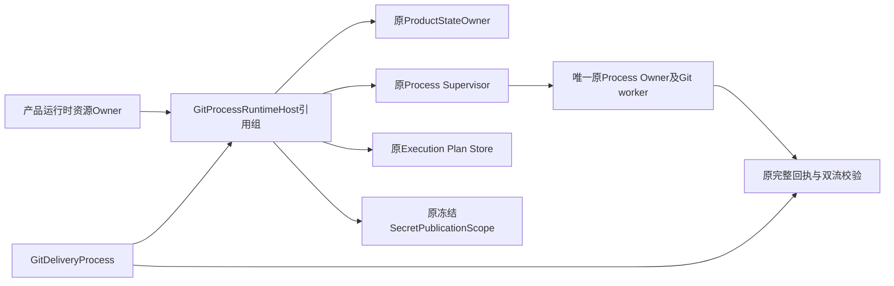
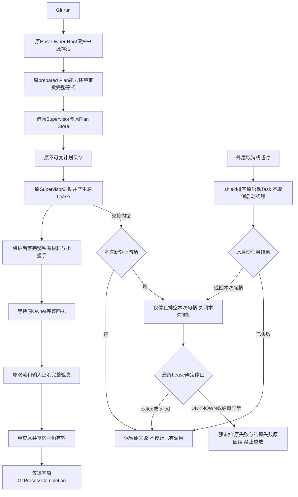
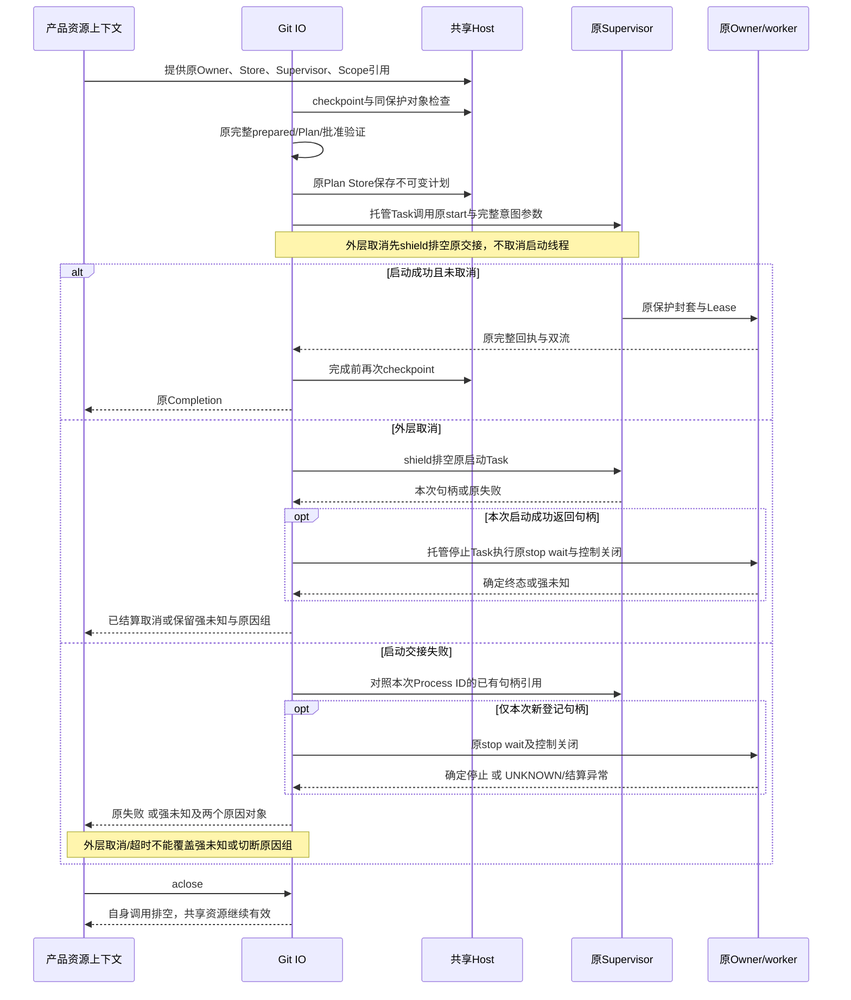
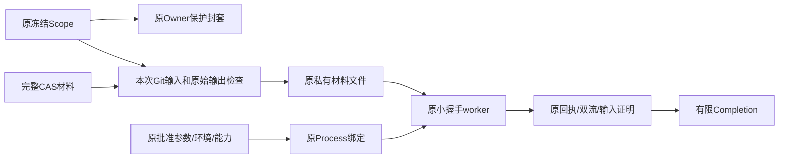

# Git IO共享产品宿主总体与详细设计

## 1. 需求背景

完整Git交付要求同一次产品启动内共享原Process Supervisor、Execution Plan Store和产品状态Owner。
原内部Git IO每次执行另开Supervisor和计划库，不能直接成为默认产品完整交付的执行端口。
本变更消除该生命周期接缝，保留独立内部宿主的旧用途；不新增HTTP/Worker服务、权限系统或业务库。

## 2. 设计目标与非目标

- 显式借用真实原产品资源，读取与完整材料写入走同一个Supervisor和原Owner回执。
- Git端口关闭仅取消、排空自身调用，不关闭产品级Supervisor、计划库或保护作用域。
- 原计划参数、能力、环境、审批、工作区身份、期限及原始流校验保持。
- 缺失、关闭、不同Root或不同保护来源须在启动前拒绝；运行后失效不宣称交付成功。
- 本变更不是默认Git Planner/Executor装配，不处理A/T/D或完整Checkpoint/Commit。
- 原完整Git SDD v9、联合备份/Restore、三平台消费者及R1～R6完成条件不变。

## 3. 总体架构与模块边界



Host是普通Python资源引用，不是可序列化授权凭据。批准仍由原Execution Plan及Checkpoint验证；
完整产品Route实际claim仍由原Router/Audit验证，不能由Host替代。每个受监督命令仍有原独立Process ID，
共享的是Supervisor实例、计划库和作用域，不是让所有命令共用同一个原生PID。

## 4. 接口设计与数据结构

| 字段/接口 | 类型或职责 | 不变量 |
| --- | --- | --- |
| `GitProcessRuntimeHost.owner` | 原`ProductStateOwner` | 原上下文有效，Root未处于未决恢复 |
| `supervisor` | 原POSIX或Windows Supervisor | 精确原实现类型；同Root/process-owner；未关闭 |
| `plans` | 原`SQLiteExecutionPlanStore` | 同Root/execution-plans.db；未关闭；不新建连接 |
| `protection` | 原`SecretPublicationScope` | 精确冻结实现；Supervisor引用同一个作用域 |
| `checkpoint(state_root)` | 原资源存活与地址复核 | 不创建Store、Lease、Plan或批准 |
| `GitDeliveryProcess(...,runtime_host=host)` | 可选内部资源借用 | 原output_redaction必须与Host.protection是同一个对象 |
| `open_git_process_resources(...)` | 异步生命周期装配 | 借用分支不创建或关闭外部资源 |
| `save_git_process_plan(...)` | 原不可变Plan持久化 | 借用分支调用原计划库；独立分支保持旧连接窗口 |
| `start_git_process(...)` | 原Supervisor启动交接与异常结算 | shield持有原启动Task；外层取消先排空本次交接，只回收其句柄，不停止已有Process ID或关闭共享宿主 |

源码位于[资源借用实现](../../src/harnessix/product_config/git_process_host.py)、
[原Git IO](../../src/harnessix/product_config/git_delivery_process.py)及
[原材料准备与摘要](../../src/harnessix/product_config/git_material_process.py)。
实际审批约束复用[原Supervisor](../../src/harnessix/processes/supervisor.py)与
[原Process绑定](../../src/harnessix/processes/supervision_planner.py)，不修改其拒绝等式。

## 5. 业务流程与时序



任一原preflight失败均不新增Process Lease或Git效果；启动后的失败沿原停止/排空、
材料未知效果与临时文件清理流程处理。Completion不是业务Checkpoint/Commit或任务成功。



## 6. 数据流与保护快照



借用分支仅接受原`SecretPublicationScope`，其材料在作用域存活期间固定；禁止替换为可轮换的
调用者保护实现。Git本次保护适配先取得同Scope快照，原Supervisor随后从同对象构造封套。
不改共享Supervisor的保护字段，不向Git目标环境注入Key，不持久化新的秘密副本。
独立端口原结构化OutputRedactionSource用途仍保留，原封套完整校验不变。

## 7. 核心逻辑伪代码

```text
run(prepared, original_plan, original_checkpoint, original_budget):
  if runtime_host exists:
    runtime_host.checkpoint(original_state_root)
    require output_redaction is runtime_host.protection
  validate all original prepared / argv / stdin / environment / capability / approval
  open original resource window:
    borrowed: checkpoint; freeze same Scope values; yield same Supervisor
    standalone: open original Supervisor, retain original close window
  save original immutable Plan using original Store
  start_task = owned task holding original start and failure settlement
  shield-await start_task
  on outer Task cancellation:
    drain start_task without cancelling its thread-backed startup
    if start_task failed: propagate its actual error and cause group
    if start_task returned a handle:
      owned stop_task settles only this returned handle
      shield-drain stop_task even if caller is cancelled again
    rethrow cancellation only after confirmed settlement
  inside owned start_task on original startup failure:
    compare original Supervisor's handle with its pre-start reference
    settle only a newly registered handle, preserving peer/replay calls
    require final Lease in {exited, failed}; unknown becomes strong failure
  stage protected full input, send original bounded control input, wait and drain
  authenticate original full raw streams and input proof
  borrowed: checkpoint again; do not close shared Store or Supervisor
  return original Completion only

outer cancellation or timeout:
  drain this operation's original task
  if task failed with an already normalized strong Git error:
    rethrow that same error, preserving its original cause group
  otherwise retain the original Process-error normalization and cancellation contract
```

## 8. 持久化、失败与恢复语义

原execution-plans.db和process-owner/process-leases.db结构不变，无新数据库、记录类型或MAC用途。
借用时计划库冲突由原不可变Plan Store拒绝；原相同Process ID重放仍由原Supervisor拒绝。
端口取消/超时仍只影响其当前受监督调用；完整材料已可能送达却无法验真时仍为未知效果，禁止自动重放。
作用域、Owner或共享资源在执行期间失效时不能返回成功。外部资源关闭由原产品上下文负责；
借用端口不拥有其生命周期，不通过重新打开资源“修复”失效Host。

### 8.1 启动交接窗口的失败结算

原Supervisor在`start`返回前可能已经创建实际Owner进程并将句柄登记到`_handles`。
随后首次回执检查失败或取消时，调用者尚未取得返回句柄。独立模式可由外层Supervisor关闭窗口
回收进程，但借用模式不能关闭产品级Supervisor，因此必须明确处理这一交接窗口。

[`start_git_process`](../../src/harnessix/product_config/git_process_host.py)在调用原`start`前保存
本Process ID的已有句柄引用；异常后只对新登记且与原引用不同的句柄调用原
`settle_input_failure(...,uncertain=False)`及`aclose`。原同ID重放拒绝不能停止此前已运行的调用，
其他Process ID的并行调用也不受影响。停止与等待可验真后重抛原失败；停止结算失败则返回
`git_process_unknown`，原因使用`BaseExceptionGroup`保留原失败与结算失败两个实际异常对象。
该强未知不能被取消降级，禁止自动重放。

原`wait`可能正常返回`unknown`，原`aclose`也允许关闭UNKNOWN句柄的控制通道，因此两个调用
没有抛错不代表停止已验真。helper在关闭后要求最终Lease为`exited`或`failed`；UNKNOWN或其他
非确定终态均作为停止结算失败进入上述原因组。原Supervisor的UNKNOWN策略和持久记录不被改写。

仅在异常后查询句柄集合不足以覆盖更早的交接：真实Owner可能已经由`to_thread`创建，
或启动请求已实际写入控制管道，但原协程尚未登记句柄。取消await不会取消该后台线程。
当前包装器因此以托管Task持有**完整原start及其异常结算**，外层只shield等待；
外层取消先复用原`_drain`排空该Task，而不是取消启动协程并从暂时为空的集合推断无效果。
若启动返回句柄，再以另一托管Task执行本次stop/wait/aclose及末次Lease验证；
重复外层取消也不能切断该结算。若启动自身已强失败，则重抛其实际异常和原因组。

这不修改原Supervisor、数据库、Owner请求或执行批准。Owner仍接收原持久`lease.deadline`，
原Git预算与父操作期限不续期；调用者等待停止不表示获得新的执行时间。
包装器不持有或停止其他Process ID，旧同ID重放仍在原Supervisor准入阶段拒绝。

外层`_raise_uncertain_settlement`对已归一化的`git_process_unknown`、
`git_material_effect_unknown`和`git_material_stage_changed`重抛原异常对象，保留既有原因组。
原其他Process错误仍转换为原有限`git_process_unknown`；强失败优先于取消/超时的规则不变。
这避免调用者在清理等待期间取消或超时时，重新建错切断已保存的因果证据。

本规则覆盖原Supervisor已经登记本次句柄的交接异常；不宣称修复所有底层进程创建窗口。
本次不修改原Supervisor源码、计划批准、执行参数或Owner协议。

## 9. 安全边界与取舍

资源组直接持有实际引用，避免路径字符串重开和第二Owner锁。精确原类型是内部宿主边界，
不是对任意同用户Python内存篡改的隔离承诺。原OS边界、Supervisor能力和批准仍不可绕过。
不接收模型参数构造Host；不为任意命令新增ALLOW或降级到subprocess.run。
计划指纹的原Process实现摘要增加固定资源适配文件，旧批准不能沿用改变后的实现。
完整产品交付的父意图与固定效果命令派生仍必须独立完成，不复制父批准伪造子计划。

## 10. 测试与验收

[共享宿主测试](../../tests/product_config/test_git_shared_process_host.py)覆盖真实SHA256材料写入、
原始回执、原同Supervisor句柄/同Plan库、端口关闭后宿主继续可用；新增拒绝与关闭故障应覆盖
不同Root、不同Scope、已关闭Store/Supervisor/Scope、Owner失效、未批准及取消后的资源存活。
同一共享宿主另以[完整容量矩阵](../../tests/product_config/test_git_shared_process_capacity.py)覆盖
SHA1/SHA256与blob/tree/commit各完整8MiB写入及独立新批准回读，不使用小材料替代容量验证。
[源码身份反例](../../tests/product_config/test_git_shared_process_digest.py)验证固定Host源码变化
会改变原实现摘要，已批准旧计划在保存Plan或创建Lease之前拒绝；不编辑共享安装文件。
原[Git IO合同](../../tests/product_config/test_git_delivery_process.py)和
[完整材料合同](../../tests/product_config/test_git_material_input.py)须进行受影响回归。
另以[启动交接测试](../../tests/product_config/test_git_shared_process_startup.py)在真实原Owner与
同时运行的另一共享进程下覆盖回执失败、取消、同ID重放和停止结算失败：检查当前新进程停止、
已有并行进程继续存活、共享资源不被关闭，以及强未知原因保留两个实际异常对象。
这是生命周期测试，使用中性Python受监督进程，不冒充实际Git写入、Windows或商业质量验收。
同文件另有十项组合：原Owner停止后只移除自有夹具终态回执，让原`refresh`持久化UNKNOWN，
与停止直接抛错分别组合普通启动失败、启动取消、调用者Token取消、Task取消及总期限耗尽。
断言位置是最终端口调用者，包括强未知、原因组两个原对象、实际进程已退出和peer继续存活。
不以helper直接调用结果替代外层竞争语义，也不将“等待正常返回”当作确定停止。
初始RED及每次实际运行分别保存；没有运行的场景不得声明通过。

## 11. 部署、兼容与回退

仅增加Python内部显式装配，默认独立端口行为保留；不修改CLI配置、安装通道或默认Tool列表。
无Schema迁移，不修改六库备份布局。新Plan实现摘要变化要求重新规划及批准，不能重写旧记录。
源码外Windows、完整产品效果、业务Backup v2和消费者安装仍须独立验收。

## 12. 当前实施边界与后续

本变更已实现共享资源借用和启动交接异常结算，最终主仓同候选169项通过：
共享宿主14项、完整8MiB容量6项、旧合同133项、源码身份2项、启动交接及UNKNOWN/外层停止14项。
438件生产源码、七个测试文件与五个配置/辅助输入共450件前后零漂移。
初版155项、直接回收版159项与最终169项分开保存，不将旧字节结果继承为新实现验证。
实际数量、范围、源摘要和四幅渲染图见[验证资料](../validation/git-shared-process-host-2026-10-03-v1/README.md)。
共享IO可用不表示完整Git交付已接线。
后继仍按完整Git SDD v9执行A/T/D、Bridge、双批准、Checkpoint/Commit、联合快照与新根恢复，
不以本内部生命周期适配关闭R1/R4或商用门禁。

## 13. 可观测性与错误分类

| 原错误或新增有限错误 | 实际含义 | 效果与处理 |
| --- | --- | --- |
| `git_process_runtime_mismatch` | Host类型、Root、资源关闭或保护对象不匹配 | 启动前拒绝，不创建新Plan/Lease；不重开原资源 |
| `product_state_owner_invalid` / `product_state_restore_pending` | 原Owner失效或存在未决恢复 | 保留原Owner错误，不绕过恢复门 |
| `approval_required` / `git_process_plan_mismatch` | 原批准或完整意图参数等式失败 | 原规则保持，不修改原计划补批准 |
| `git_process_timeout` / `TurnCancelled` | 原命令或总期限、真实取消 | 排空当前调用，不关闭产品级资源 |
| `git_material_effect_unknown` | 完整材料可能送达后未完成验真或最终Host无效 | 不报成功、不自动重放，沿原只读对账 |
| `git_process_unknown` | 本次已登记启动句柄的停止/等待无法完成验真 | 保留原失败和结算失败；不报已回收、不自动重放 |
| 原保护Scope错误 | 原Scope关闭或保护材料不可用 | 启动前无新效果；已送达用途沿原未知效果分类 |

原计划ID、Process ID、Lease及完整回执仍通过原存储/诊断端口关联，不新建观察账本。
共享Scope材料、原始stdout/stderr及内部动态路径不新增到公开错误消息或日志。
这些错误只描述内部IO结算，不提供完整编码任务的质量或业务成功结论。

## 14. 源码映射与阅读顺序

1. [GitProcessRuntimeHost.checkpoint](../../src/harnessix/product_config/git_process_host.py)：
   精确原资源类型、地址、存活和同Scope复核；没有能力签发。
2. [GitDeliveryProcess.run / _run_process](../../src/harnessix/product_config/git_delivery_process.py)：
   原prepared、计划/环境/能力/审批和取消总期限校验，新增Host原引用检查。
3. 同文件`_execute_process`调用`open_git_process_resources`，借原Supervisor；
   `save_git_process_plan`借原连接保存不可变计划，独立用途保留旧短连接窗口。
4. [PosixProcessSupervisor.start](../../src/harnessix/processes/supervisor.py)：Windows复用原准入，
   原工作区、能力、环境、批准和唯一Process ID拒绝保持；实际原Owner负责控制和回执。
   调用前由`start_git_process`保存已有句柄，交接异常只停止本次新登记句柄，详见§8.1。
5. [Git材料准备](../../src/harnessix/product_config/git_material_process.py)与原`_complete_process`：
   同Scope保护后落完整材料、小握手、原完整原始回执；输入后异常仍保留未知效果。
6. 原共享窗口正常返回前再检查Host，Git端口`aclose`仅取消/排空自身活动任务。

[资源、关闭与取消测试](../../tests/product_config/test_git_shared_process_host.py)、
[完整容量测试](../../tests/product_config/test_git_shared_process_capacity.py)和
[实现身份反例](../../tests/product_config/test_git_shared_process_digest.py)分别对应上述边界。
[启动交接反例](../../tests/product_config/test_git_shared_process_startup.py)对应§8.1的异常与并行隔离。
