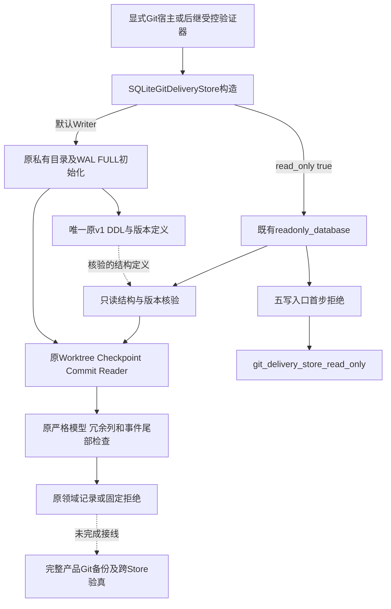
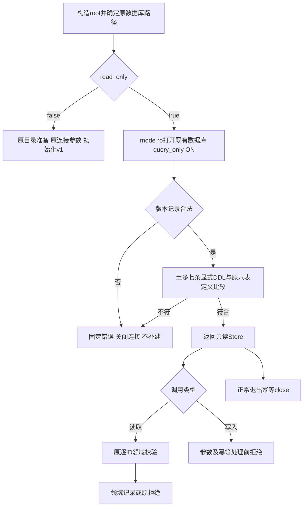
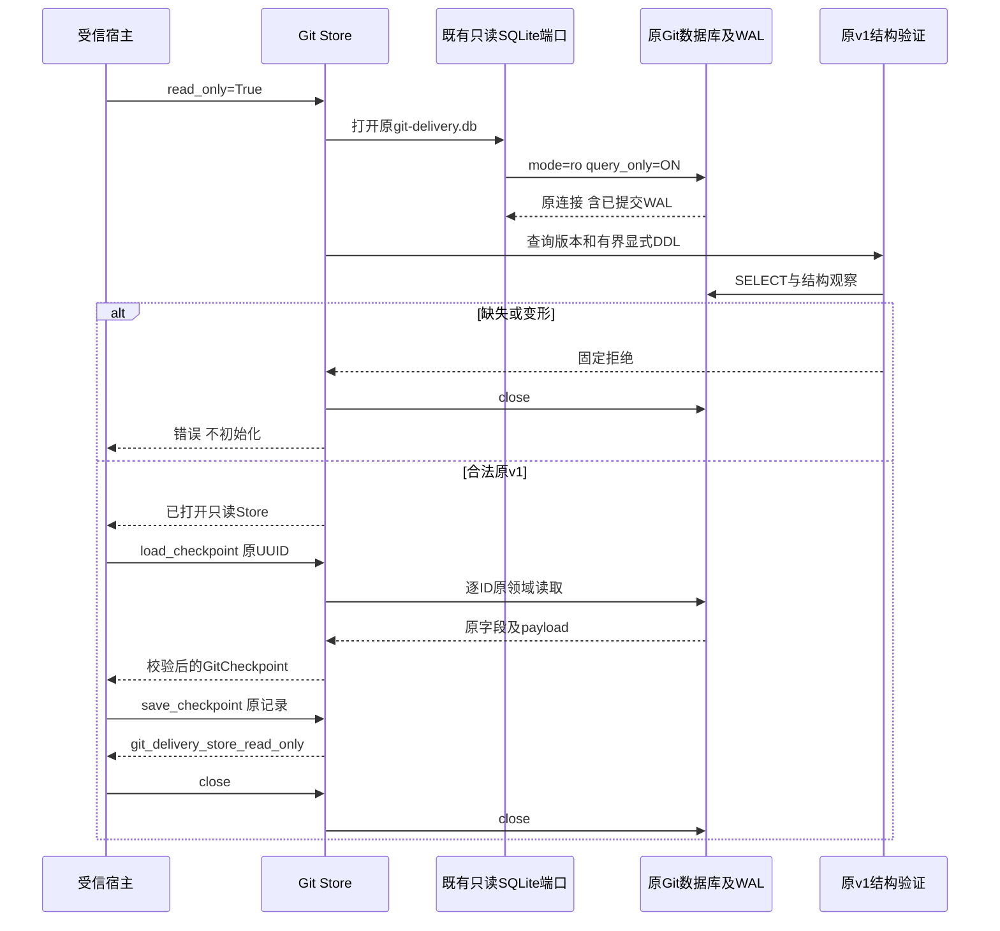
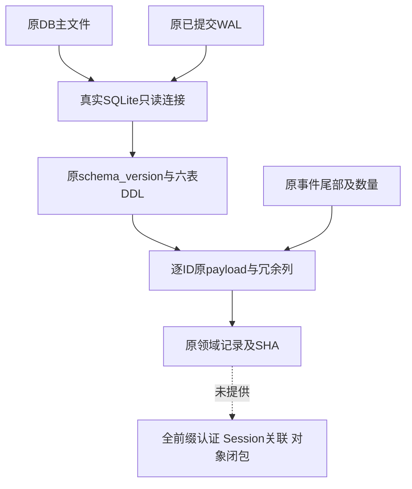

# Git交付账本只读访问总体与详细设计

## 1. 需求背景与设计目标

首发要求正式产品提供本地Commit、Checkpoint和Rollback闭环。当前默认产品只接通Patch和Rollback，
Git来源与HEAD基准为只读前置，Git交付仍是显式宿主组件。其账本构造函数会创建目录、初始化表、
设置WAL及文件权限，不能直接拿写端作为后续停机备份和恢复验真的Reader。

本变更为已有`SQLiteGitDeliveryStore`增加明确只读模式，与已有SQLite领域Store保持一致，
不新建第二份解析器、通用存储框架或独立服务。只读模式读取原v1模型，禁止全部写入口；
未知版本、缺失或变形结构必须拒绝，不能通过初始化补齐缺失证据。

### 1.1 本次交付范围

- `read_only=True`复用原SQLite只读连接，真实读取已提交WAL，不使用`immutable=1`忽略活跃数据。
- 原六表DDL与版本记录只读核验；结构读取最多七条显式DDL，额外表/视图/触发器/显式索引拒绝。
- 五个公开写入口在参数处理与幂等返回前拒绝，数据库层`mode=ro`仍独立保护。
- 默认Writer沿用原结构、版本、CAS、事件及序列化合同；原长类的DDL职责提取，不放宽结构治理。
- 完整设计、真实Git正控、数据库拒绝/故障关闭、双Python及受影响回归同步交付。

### 1.2 非目标与未完成边界

此模式不是备份发布器、全事件链认证器或Git对象归档器，不认证任意调用方的数据库来源。
它不增加Session/Route/Checkpoint跨库身份、不接通新Tool，不创建默认产品Git目录，
不把Git库加入现有六库备份白名单，不恢复用户Ref或Worktree注册，不自动重试UNKNOWN。
多次Patch连续链、Commit和Checkpoint完整产品接线仍保留，不缩减为仅一次Patch或仅Checkpoint产品。

## 2. 源码依据、复用与取舍

| 当前实现 | 源码位置与设计影响 |
|---|---|
| 默认产品打开Plan、Audit、Workspace事务和Lease | [`action_runtime.py`](../../src/harnessix/product_config/action_runtime.py)的`_open_action_dependencies`；不能将读取Git配置当作已装配写交付 |
| 默认目录仅Patch、Rollback和条件Process | [`action_composition.py`](../../src/harnessix/product_config/action_composition.py)；本变更不修改该目录 |
| 原Git Store构造具有初始化副作用 | [`git_store.py`](../../src/harnessix/delivery/git_store.py)；新增明确只读路径，保留原模型Reader |
| 六个领域Store已有只读连接 | [`sqlite_readonly.py`](../../src/harnessix/sqlite_readonly.py)及[`delivery/store.py`](../../src/harnessix/delivery/store.py)；复用`mode=ro`、`query_only`和真实WAL语义 |
| 原停机备份要求闭合布局 | [`state_backup_contracts.py`](../../src/harnessix/product_config/state_backup_contracts.py)、[`state_backup_files.py`](../../src/harnessix/product_config/state_backup_files.py)；不偷偷新增业务目录或放宽未知目录拒绝 |
| 恢复不回退用户仓库外部Git效果 | [`state_restore_flow.py`](../../src/harnessix/product_config/state_restore_flow.py)；后继必须定义对象材料与外部绑定对账 |
| Git工作树/提交领域记录带SHA和序列 | [`git_contracts.py`](../../src/harnessix/delivery/git_contracts.py)；复用原验证模型，不把SHA称为MAC或来源认证 |

选择在已有Store上增加关键字参数，而非复制一个只读Store类：Reader和Writer共享模型解析、
冗余列检查及原事件尾部检查，减少语义漂移。DDL只保留在
[`git_store_schema.py`](../../src/harnessix/delivery/git_store_schema.py)，Writer初始化和Reader核验使用同一份定义。
不采用SQLite`immutable`或`nolock`，不牺牲已提交WAL可见性和原锁语义。
官方[URI文档](https://www.sqlite.org/uri.html)说明`mode=ro`与`immutable`含义不同，
[WAL文档](https://www.sqlite.org/wal.html)说明只读连接仍可能涉及WAL/SHM协调。

## 3. 总体架构与模块边界



Store持有连接、生命周期和领域接口；Schema模块只负责原DDL初始化及结构核验，
不访问Workspace、Git执行器、Approval、Session或Key。既有SQLite端口负责URI及查询只读设置。
默认产品装配不消费这个新模式；后续验证器必须在已认证Root和明确静默窗口内调用。

## 4. 核心流程与时序





正常读取不会反向调用Writer补数据。结构核验异常由构造函数关闭已打开连接，原异常传播；
打开连接本身失败时对象不返回，也不创建Root或空数据库。

## 5. 类设计、接口设计与重点字段

| 类/方法 | 责任与约束 |
|---|---|
| `SQLiteGitDeliveryStore(root, *, read_only=False)` | 加性关键字接口；默认Writer不变，True只读打开原路径 |
| `_initialize()` | 委托唯一`initialize_git_store`；只在Writer路径调用 |
| `_require_writable()` | 五个公开写入口首步执行；包括已有计划/Checkpoint的幂等请求 |
| `load_worktree(id)` | 原严格模型、冗余列及原尾部事件/计数检查，不补写事件 |
| `load_checkpoint(id)` | 原严格模型和冗余列、Digest校验；不检查实际Git对象存在性 |
| `checkpoint_for_worktree(id)` | 原Worktree到Checkpoint查询；未找到仍返回None |
| `load_commit(id)` | 原严格模型、冗余列及原尾部事件/计数检查；不自动查外部Ref或重试Commit |
| `save_worktree/transition_worktree/save_checkpoint/save_commit/transition_commit` | Reader固定拒绝；Writer原状态机和CAS保持 |
| `initialize_git_store(database)` | 运行唯一原DDL及原版本插入/拒绝规则，没有新迁移 |
| `verify_git_store_schema(database)` | 版本先验后最多七条显式DDL比较，非Writer初始化函数 |

| 字段 | 重点语义 |
|---|---|
| `_root` | 原宿主指定Git账本Root，不是已认证产品Root凭证 |
| `_path` | 固定`_root/git-delivery.db`；URI转义由原端口完成 |
| `_read_only` | 宿主选择的访问模式，不来自模型Tool参数 |
| `_db` | 原SQLite连接；Reader双重受`mode=ro/query_only`限制 |
| `_closed` | 保持原幂等关闭；构造后验证失败也置为已关闭 |
| `_SCHEMA_VERSION` | Schema模块固定原值`1`，不因新增只读模式升级格式 |
| `_SCHEMA_SQL` | 原六张STRICT表及约束的唯一声明；原序列化数据、唯一键和外键保持 |

URI中的中文、空格、`#`和`%`按文件名读取，不允许改变访问模式。
`?`文件名只在支持它的POSIX测试，不构造Windows非法文件名作为原生合同。

## 6. 数据结构、数据流与核验范围

原表结构不变：metadata保存版本，worktrees/commits保存当前状态，
两份events保存原序号，checkpoints保存原领域快照。读取不新增任何业务表或关联字段。



显式DDL比较规范空白并去掉声明的`IF NOT EXISTS`，不忽略字段、STRICT、外键或唯一约束。
SQLite生成的自动索引没有显式SQL，不纳入这六条声明；额外显式索引、View或Trigger不得被默许。
最多读取七条，任一第七条即无法等于原六表集合，不遍历任意大的伪造Schema清单。

记录Reader仍沿用原校验边界：严格模型、摘要、冗余列、事件尾部与数量。
**这些检查不等于全部历史事件链合法、不等于原来源MAC，也不证明Checkpoint对象闭包完整。**
后续完整备份Verifier必须另核对全事件前缀、跨Store身份和Git对象材料，不能复用此模式宣称已经完成。
多次load不建立跨查询或跨Store全局原子视图；完整备份/恢复核验仍须原静默Owner窗口。
WAL可见性正控只证明已提交事实可读，不宣称并发写入中的多份领域观察天然一致。

## 7. 核心业务逻辑伪代码

```text
constructor(root, read_only):
    set original root/path, closed=false, access mode
    if read_only:
        db = original_readonly_database(path)
        try:
            require schema_version exists and equals original v1
            require at_most_7_explicit_definitions == original_6_definitions
        except:
            close db using original lifecycle
            propagate fixed failure
        return
    prepare original private directory
    open original Writer with WAL/FULL and original busy timeout
    initialize original schema and original version metadata

each_public_mutator(...):
    require not read_only before argument processing or idempotent return
    execute original Writer logic

each_original_reader(id):
    select original record by id
    validate original model, redundant columns and original checks
    return original domain record
```

最小调用示例：

```python
from harnessix.delivery.git_store import SQLiteGitDeliveryStore

# root来自受信宿主，不能直接使用模型提供的目录作为认证来源。
with SQLiteGitDeliveryStore(root, read_only=True) as store:
    checkpoint = store.load_checkpoint(checkpoint_id)
```

## 8. 持久化、失败语义、取消与恢复

| 场景 | 错误和副作用边界 |
|---|---|
| 未知路径或原文件不存在 | 原`sqlite3.OperationalError`；不创建目录/数据库，不转入Writer |
| 非原版本 | `git_delivery_store_version`；不迁移或补写metadata |
| 缺metadata、缺表、变形DDL、额外显式DDL或坏数据库 | `git_delivery_store_corrupt`；已打开连接有界关闭，不补建 |
| Reader调用五个写入口 | `git_delivery_store_read_only`，先于参数和幂等分支，不写行、事件或文件权限 |
| 原记录缺失/损坏 | 原领域not_found/corrupt码，不换解析器或补签 |
| 锁争用/IO失败 | 原SQLite语义和端口0.1秒连接等待，不无限重试 |
| 正常退出或结构核验失败 | 原close，关闭后不可继续使用连接 |

同步SQLite方法不接受新的异步取消令牌，不承诺瞬间中断正在执行的SQLite调用。
异步产品恢复/验证未来仍由原Owner及期限控制调用范围；本模式不新增后台任务或隐含重试。
Reader不设置journal_mode、不chmod、不mkdir、不补建业务状态；真实WAL读取涉及SQLite自身共享内存协调，
不能把“业务零写入”夸大为任何文件系统元数据都不变化。
停机快照的DELETE模式测试才能单独证明所测文件集合、正文和模式完全不变。

## 9. 安全、兼容、部署与可观测性

只增加内部领域接口和一个Schema职责模块，无新依赖、Schema版本、Config、服务或公开Protocol。
旧正式v1账本直接可读；原Writer默认行为和已有产品状态布局保持。
Root的私有权限、原路径归属、平台边界和完整备份回执认证仍由上游受控宿主负责，
本类构造不代替这些检查，也不扩充当前备份白名单。

错误采用固定领域码，不输出原payload、文件正文、目录、凭据或SQL异常正文。
没有新增日志、Metric、Span或管理平台；诊断可使用原记录UUID、指纹、序号及固定错误分类。
底层`mode=ro`与入口guard各自独立；测试关闭query_only后直接SQL写入仍必须被只读连接拒绝。
新连接关闭后不会恢复或重放Worktree/Commit效果。

部署仍使用原Wheel，不需要数据库服务。后继产品写接线仍须先完成Git账本、对象材料、
Worktree外部注册和备份恢复闭合；不能只把DB文件加入备份就广告完整恢复。
状态回退不会自动回退用户Ref，恢复的新目录身份不继承旧Worktree Binding。

## 10. 测试验证与验收边界

| 组别 | 必须证明 |
|---|---|
| 真实Git正控 | 原实际Worktree、Checkpoint和Commit在只读重开后逐字段相同；正常Writer仍可推进 |
| 原格式兼容 | 原提交DDL创建的实际v1库无需迁移；只读不是同源码新格式自证 |
| 写入拒绝 | 五个写入口、幂等请求、非法入参先拒绝；query_only关闭后mode=ro仍拒绝SQL写 |
| 真实WAL | 活跃Writer已提交而未checkpoint的事实可读，不用immutable或只复制主DB冒充 |
| 文件边界 | 未知Root不创建；DELETE停机快照文件Hash/模式不变；特殊URI路径不混淆 |
| 结构负控 | 原版本2、缺metadata/表、变形表、View/Trigger/显式索引及坏数据库拒绝，不补建 |
| 生命周期 | 核验失败真实close；正常close幂等，SQLite连接/句柄不泄漏 |
| 关联回归 | 原Git/Push组件、Checkpoint数据保护、正式Git来源及现有完整备份恢复保持 |
| 静态与文档 | Strict Mypy、原可读性阈值、Ruff、Schema、完整设计和实际图形渲染 |

新测试见[`test_git_store_readonly.py`](../../tests/delivery/test_git_store_readonly.py)，
原组件测试见[`test_git.py`](../../tests/delivery/test_git.py)及
[`test_git_checkpoint_guard.py`](../../tests/delivery/test_git_checkpoint_guard.py)。
原完整状态备份/恢复关联测试不等于Git对象已纳入备份；新Reader也不改变该事实。
原生Windows和源码外安装由对应候选实际结果证明，不从macOS或静态收集推导通过。
完整真实20 Trial、消费者Windows11、独立Beta、正式Git接线及商用R1～R6仍开放。

统一原件索引、实际源文件绑定、分层测试、源码外安装、Review Packet和Manifest见
[`只读Git账本验证交付`](../validation/git-store-readonly-2026-09-30-v1/README.md)。
