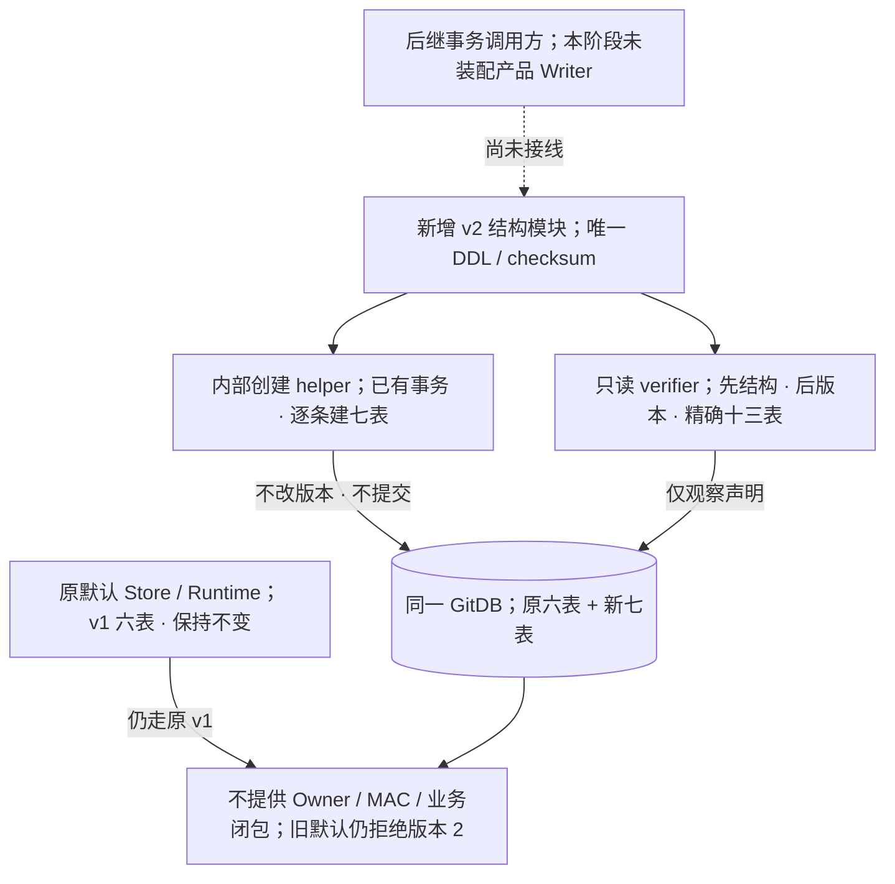
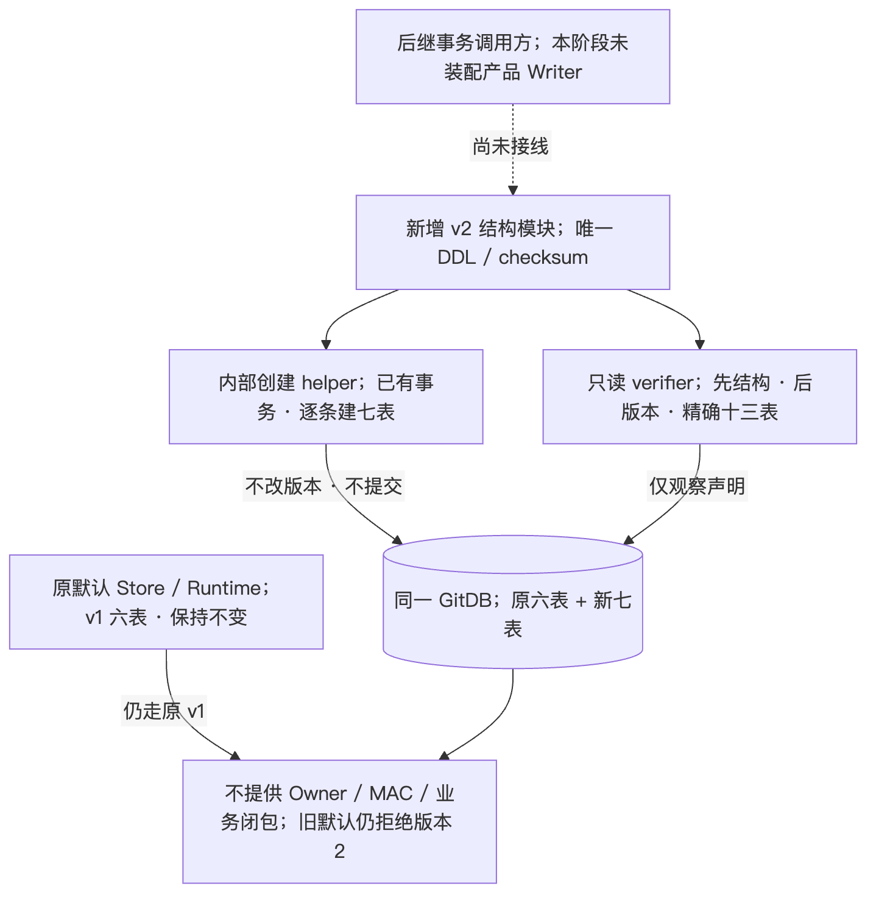
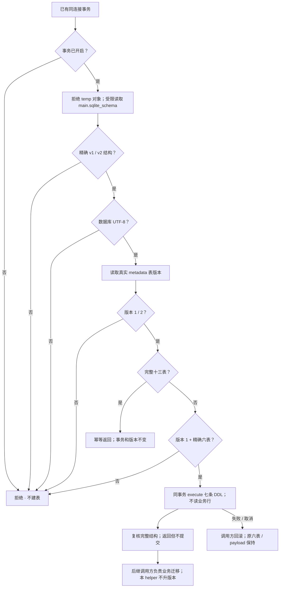
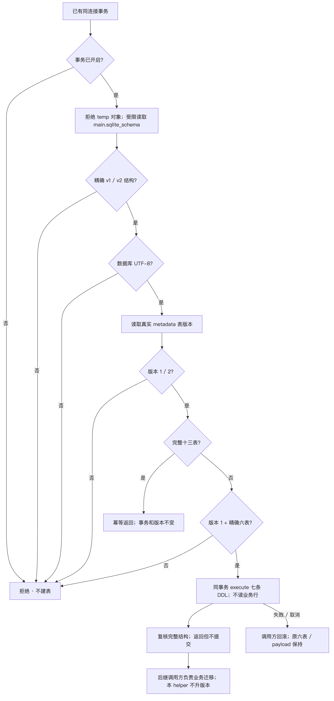
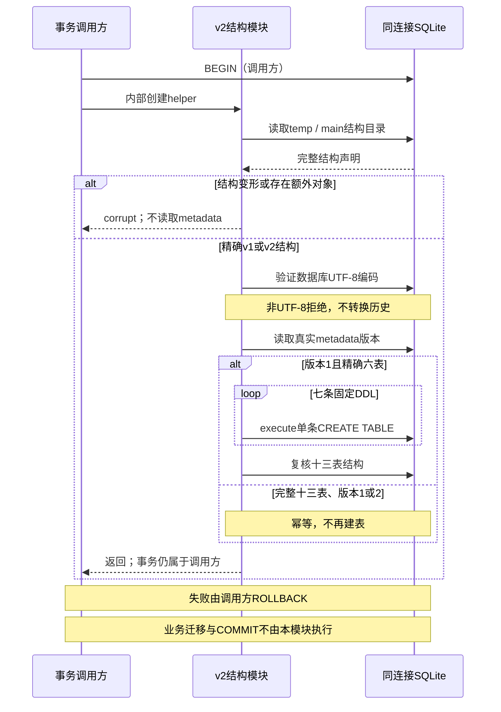
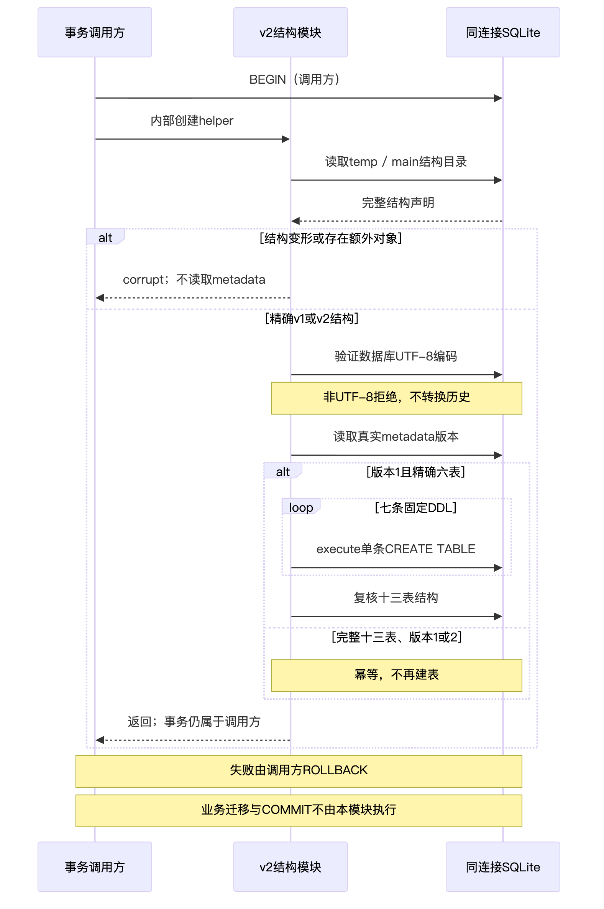
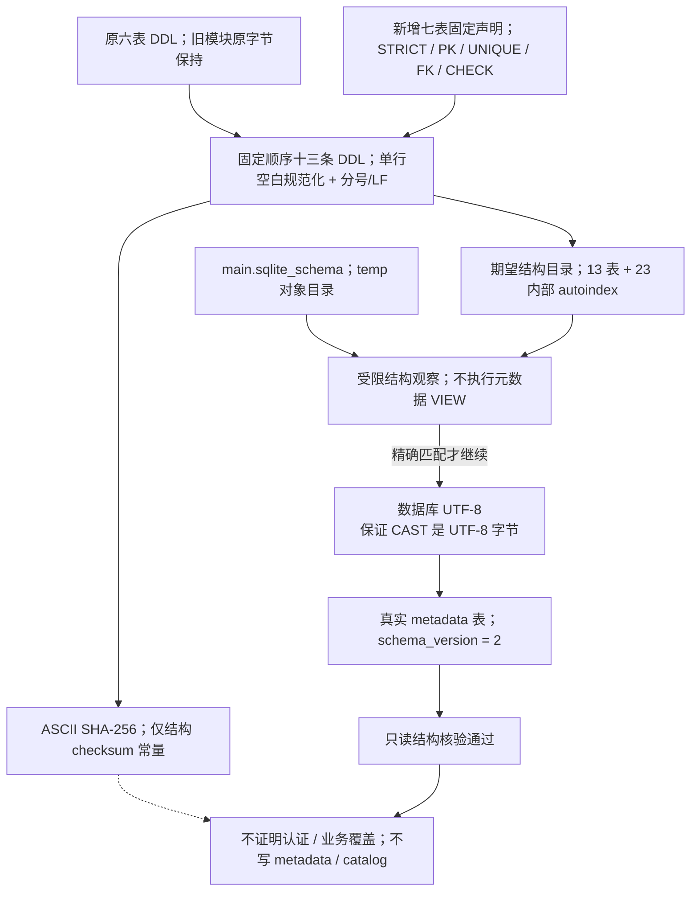
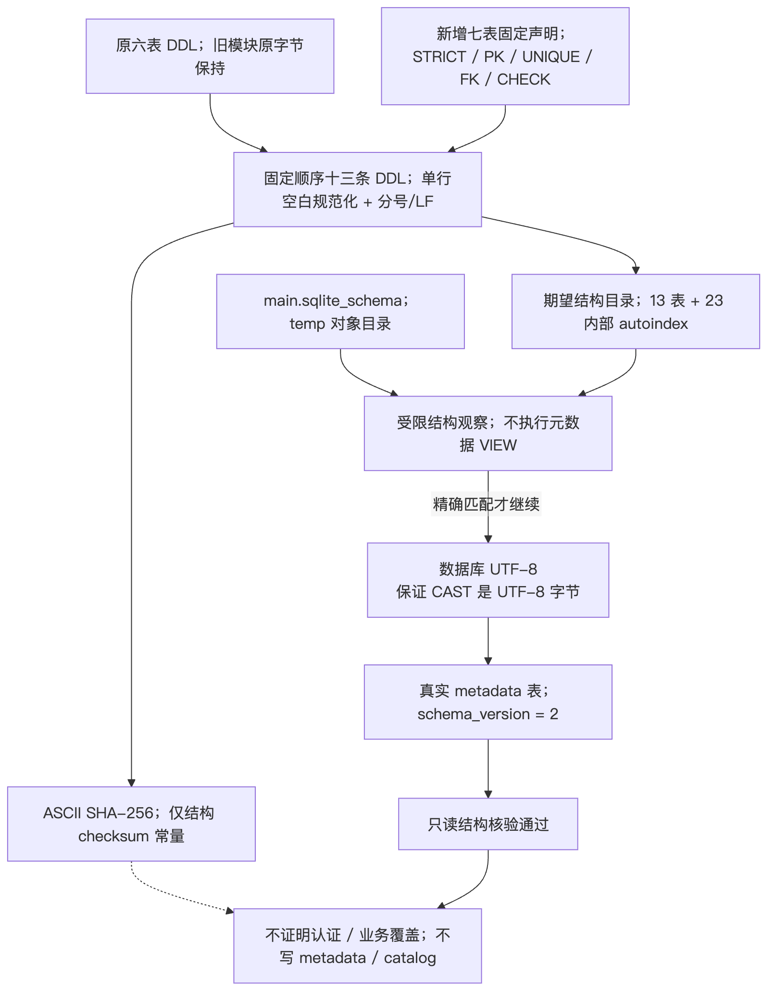

# GitDB v2精确结构合同：唯一DDL、同事务创建与只读核验

## 文档摘要

新增[结构模块](../../src/harnessix/delivery/git_store_schema_v2.py)，保留原v1六表，
按固定字段合同增加七表，共13表及23个PK/UNIQUE内部autoindex；不允许显式索引、VIEW或TRIGGER。
内部helper只在调用者已有的同连接事务内逐条执行DDL，不修改metadata、不自行提交或回滚。
只读verifier先核验完整结构与UTF-8编码，再读取已知真实metadata表，最后要求版本2和精确13表。
原[默认Store](../../src/harnessix/delivery/git_store.py)继续v1，读写及只读入口仍拒绝v2。

真实SQLite最终460项通过：新增正式主组363项（含UTF-16回归4项）、原Git/readonly组97项。
编码回归纳入tests默认选择器；原docs诊断仅保留为历史证据。
Ruff及格式检查通过；Mypy核验新增生产模块通过。四图已实际渲染并逐图视觉验收。
原缺API collection ERROR、metadata VIEW提前执行及UTF-16字节边界RED的公开脱敏投影与原SHA均保留。
完整日志、XML、输入摘要、四图及manifest见[验证报告](../validation/git-store-v2-schema-2026-10-02-v1/README.md)。

**本阶段仅完成结构合同，不完成业务迁移、Owner/Key装配、原子产品Writer、认证Loader、legacy全集、
对象闭包或W1/商用验收。** `code_revision`记录基线提交；新增未发布文件以[固定SHA](../validation/git-store-v2-schema-2026-10-02-v1/source-freeze.json)为身份。

## 需求背景

[完整Git产品设计第8章](m09-r4-git-delivery-business-backup-closure.md#8-持久化认证与跨存储一致性)
要求版本化精确结构、领域记录与认证发布的后继同库事务，以及完整前缀、尾锚和跨库关联验证。
旧v1精确六表不能通过“忽略额外表”兼容后继格式；已有普通SHA也不能代替认证历史证明。
因此先冻结可复用的结构定义，供后继Writer/Loader在真实业务与认证边界满足后接线。

本结构保持原schema模块、原六表SQL、已有metadata及旧payload原字节。
字段级设计来源的摘要记录于[inputs-before.json](../validation/git-store-v2-schema-2026-10-02-v1/inputs-before.json)，
不公开受限资料路径或正文。阶段集合、组合引用、内部索引和checksum位置在本详设中明确，不留隐含DDL选择。

## 设计目标

1. 唯一DDL身份：原六表加固定七表，精确列序、类型、NOT NULL、PK、UNIQUE、FK、CHECK及STRICT。
2. 事务归属不变：调用者已有事务；helper不BEGIN/COMMIT/ROLLBACK，不使用会隐式提交的executescript。
3. 迁移中态可复核：同事务已创建完整13表但metadata仍为1时，helper可幂等返回；verifier仍拒绝版本1。
4. 先结构后数据：存在额外/变形对象、部分表或非UTF-8编码时，不读取metadata版本，不修复任何结构。
5. 只读核验零业务观察：只读结构目录、编码与一个版本行，不读取或补签业务行，不创建表或持久化检查结果。
6. 保持尺寸合同：新增payload上限64MiB实际UTF-8字节；Seal为1..4096字节；不修改旧8MiB/64MiB业务边界。
7. 不扩大证明范围：结构正确不推出MAC有效、UUID规范、JSON canonical、领域合法起点/转移、Owner或恢复授权。

选型为独立小模块而非默认Store扩展：旧默认行为可原样验证，后继迁移不会被普通打开数据库隐式触发。
不引入Schema管理框架、迁移注册器、额外表、索引或metadata键。

### 风险与取舍

严格拒绝非UTF-8库而不转换历史，避免字节语义放大；既有UTF-16 v1库不自动迁移。
保留独立结构层而非提前装配Writer，使只读结构结论不会掩盖业务、认证与Owner缺口。

## 总体架构

当前生产仅提供常量、内部创建helper和只读verifier，不新增领域类、公开Store facade或默认Runtime接线。
旧v1模块仍是原入口的格式依据；新模块复用其六条DDL生成v2定义，不改原模块原字节。
后继事务调用方尚未在本阶段装配；图中的虚线明确这一边界。



[架构图源](../validation/git-store-v2-schema-2026-10-02-v1/architecture.mmd)



## 流程时序数据流

### 创建流程

- 检查同连接已有事务；缺事务立即拒绝，零DDL。
- 查询`temp.sqlite_schema LIMIT 1`，存在任何临时对象立即拒绝。
- 有界查询`main.sqlite_schema`，包含实际type/name/tbl_name/sql；不得先SELECT metadata对象。
- 要求实际目录恰为精确v1六表或完整v2十三表及对应内部索引；部分/额外/变形对象拒绝。
- 只读`PRAGMA main.encoding`，只接受UTF-8；不转换数据库或旧payload。
- 从已确定为真实普通表的`main.git_delivery_metadata`读取schema_version，只接受文本1或2。
- 完整v2结构、版本1或2：幂等返回，不再执行DDL；精确v1且版本1：逐条execute七条CREATE TABLE并复核完整结构。
- 返回时事务仍由调用者持有。业务验证、版本升级、COMMIT或失败ROLLBACK均不是本helper的职责。



[流程图源](../validation/git-store-v2-schema-2026-10-02-v1/flow.mmd)



### 事务时序与迁移中态

创建helper的合法结构中态是“完整13表、schema_version仍为1、调用者事务未结束”。
只读verifier复用相同观察顺序，但只有完整13表且版本为2才返回。
结构helper返回不表示迁移完成；后继业务事务在提交前还需完成完整legacy核验、认证与版本发布。



[时序图源](../validation/git-store-v2-schema-2026-10-02-v1/sequence.mmd)



### 数据流与有限观察

唯一DDL派生期望结构目录与checksum；实际目录与期望目录精确比较后，才允许观察真实版本表。
13表+23个autoindex共有36项期望对象；查询最多取37项以识别超额，temp目录最多观察一项。
这是结果读取上限，不是SQLite排序/读取的硬实时承诺；结构目录未执行任何业务VIEW。
checksum不进入metadata，不生成catalog或Seal，不签发迁移证明。



[数据流图源](../validation/git-store-v2-schema-2026-10-02-v1/data-flow.mmd)



## 接口设计

| 接口/常量 | 责任与结果 |
|---|---|
| `GIT_PRODUCT_LINK_PHASES: tuple[str, ...]` | 固定18个Link/LinkEvent阶段标签；不是FSM转换表 |
| `GIT_STORE_V2_DDL: str` | 固定顺序13条DDL的ASCII规范化拼接；用于结构身份，不能在活跃迁移事务中用executescript执行 |
| `GIT_STORE_V2_MIGRATION_CHECKSUM: str` | 规范化DDL的SHA-256模块常量；不写metadata、非MAC、非业务/迁移完成证明 |
| `_create_git_store_v2_tables(database: sqlite3.Connection) -> None` | 内部helper；已有事务、精确前置结构；逐条建七表或完整结构幂等返回 |
| `verify_git_store_v2_schema(database: sqlite3.Connection) -> None` | 只读精确核验版本2及完整13表；失败抛KernelError，不返回宽松bool |

调用者负责打开安全连接、持有真实Owner、配置FK、同连接事务、资源关闭和失败回滚。
本模块不更改connection的PRAGMA、row factory、isolation level或权限。
FK声明被精确验证，但SQLite FK是否执行取决于调用者连接的`foreign_keys`设置；本模块不替调用方启用或证明业务行的FK有效。
正式只读路径可复用[readonly_database](../../src/harnessix/sqlite_readonly.py)；本verifier自身不授予只读权限。

核心伪代码与实现一致：

```text
observe(conn):
  reject any temp object
  actual = bounded main.sqlite_schema declarations
  require actual == exact_v1 or actual == exact_v2
  require read-only main.encoding == UTF-8
  version = SELECT known main.metadata schema_version
  require version is 1 or 2
  return version, actual

create_v2_tables(conn):
  require conn.in_transaction
  version, actual = observe(conn)
  if actual == exact_v2: return
  require version == 1 and actual == exact_v1
  for each of seven new fixed declarations: conn.execute(declaration)
  require observe(conn).actual == exact_v2
  # 不控制事务，不升版本，不迁移业务

verify_v2(conn):
  version, actual = observe(conn)
  require version == 2 and actual == exact_v2
```

## 数据结构

### 原六表保持

`git_delivery_metadata`、`git_worktrees`、`git_worktree_events`、`git_checkpoints`、`git_commits`、`git_commit_events`
定义复用[原_SCHEMA_SQL](../../src/harnessix/delivery/git_store_schema.py)。仅为生成唯一声明移除`IF NOT EXISTS`并规范化空白；
不修改原模块、已有表DDL、行数据、元数据或旧业务SQL。

### 七表完整列及约束

所有新增列均NOT NULL；新表全部STRICT。以下“UUID”表示TEXT长度36的SQL结构约束，非规范UUID语法证明；
“SHA”表示TEXT、小写十六进制、长度64。原六表不追加这些新约束。

| 表 | 全部字段、类型及行内约束 | PK / UNIQUE / FK |
|---|---|---|
| `git_product_links` | route_id、delivery_id、thread_id、turn_id、call_id：UUID；action_kind：TEXT，仅checkpoint/commit；core_sha256、route_fingerprint：SHA；phase：TEXT固定18值；sequence：INTEGER 0..2^63−1；payload：TEXT ≤64MiB UTF-8字节 | PK route_id；UNIQUE delivery_id；UNIQUE(thread_id,turn_id,call_id)；UNIQUE(delivery_id,route_id)；UNIQUE(delivery_id,route_id,thread_id,turn_id,call_id) |
| `git_product_link_events` | route_id：UUID；sequence：INTEGER 0..2^63−1；phase：TEXT固定18值；payload：TEXT ≤64MiB UTF-8字节 | PK(route_id,sequence)；FK route_id→Link.route_id |
| `git_native_bridge_index` | bridge_id、transaction_id、route_id、anchor_id、worktree_id：UUID；bridge_sha256：SHA | PK bridge_id；UNIQUE transaction_id；仅FK route_id→Link.route_id |
| `git_object_inventories` | inventory_id、delivery_id、route_id：UUID；phase：TEXT仅materials_ready/effect_closed；sequence：INTEGER 0..2^63−1；inventory_sha256、scope_sha256：SHA；payload：TEXT ≤64MiB UTF-8字节 | PK inventory_id；FK(delivery_id,route_id)→Link(delivery_id,route_id) |
| `git_object_inventory_events` | inventory_id：UUID；sequence：INTEGER 0..2^63−1；phase：TEXT仅materials_ready/effect_closed；payload：TEXT ≤64MiB UTF-8字节 | PK(inventory_id,sequence)；FK inventory_id→Inventory.inventory_id |
| `git_record_publications` | record_kind：TEXT固定五类；record_id、publication_epoch、delivery_id、thread_id、turn_id、call_id、route_id：UUID；sequence：INTEGER 1..2^63−1；previous_prefix、body_sha256、prefix_sha256：SHA；body_bytes：INTEGER 1..64MiB；seal：BLOB 1..4096B | PK(record_kind,record_id,publication_epoch,sequence)；FK(delivery_id,route_id,thread_id,turn_id,call_id)→Link对应五元组；product_link时CHECK record_id=route_id |
| `git_prefix_anchor` | singleton：INT，固定1；revision：INTEGER 0..2^63−1；genesis_epoch：UUID；body_bytes：INTEGER 1..64MiB；body_sha256：SHA；payload：TEXT ≤64MiB UTF-8字节；seal：BLOB 1..4096B；CHECK body_bytes=length(CAST(payload AS BLOB)) | PK singleton；无额外FK |

五类record_kind固定为：`object_inventory`、`product_link`、`worktree_event`、`checkpoint`、`commit_event`。
Publication只存正文长度/摘要而不存正文，其body_bytes只校范围，不能与Seal字节数相等约束。
Anchor有真实payload，其body_bytes必须等于实际字节数且为正；Seal长度独立校验。

singleton采用SQLite STRICT支持的`INT NOT NULL PRIMARY KEY`，而非rowid别名`INTEGER PRIMARY KEY`：
实际SQLite后者对NULL自动生成1，会掩盖必填结构负例；INT保持整数约束并真实拒绝NULL，不增加表、列或显式索引。

### 阶段与引用决定

Link/LinkEvent完整18值：

```text
prepared, approved, materials_ready, anchor_intent, anchor_ready,
native_patch_intent, native_patch_prepared, native_bridge_closed,
delivery_worktree_intent, delivery_worktree_ready, checkpoint_intent,
checkpoint_closed, commit_intent, commit_closed, result_closed,
unknown, diverged, failed
```

这是checkpoint/commit流程标签并集，不强迫commit重做A/T/D。
prepared/domain0合法起点、Inventory的materials_ready/domain0及effect_closed/domain1对应关系、递增序号、
阶段完整性和合法转移均由后继领域FSM与认证Loader验证；SQL只固定声明标签和整数范围。
不会通过CHECK把一个孤立行宣称为合法产品历史。

BridgeIndex的anchor_id/worktree_id可能指向未来D意图，故不FK旧worktree表或外部TxDB；完整Bridge/T/domain跨库关系留给后继Loader。
Publication的五类record_id是多态实体引用，SQL不虚构统一实体表，也不通过NULL绕过真实引用。
Link二元和五元组合UNIQUE服务于冗余身份FK；真实插入测试拒绝混合两个已存在Link的身份。
一个Link可含不同Inventory身份/阶段；不擅加同OID、同phase或同route的额外唯一约束。

### 字节、类型与checksum

payload上限使用`length(CAST(payload AS BLOB))<=67108864`，不使用TEXT字符数。
SQLite CAST采用数据库编码，因此v2结构观察要求数据库UTF-8；UTF-16le/be拒绝，不改变或转换历史。
多字节真实边界测试覆盖五个payload列、恰64MiB Anchor及超一字符负例。
STRICT按SQLite规则仍可能转换可无损转换的输入；Python actual-bool/subclass、UUID语法、JSON canonical、正文摘要和Seal认证由正式边界验证。

唯一checksum规范：原六条DDL固定顺序在前，新增七条固定顺序在后；移除原`IF NOT EXISTS `；
每条用`' '.join(statement.split())`规范空白成为单行；每条后附`;`和LF；完整13条以ASCII编码计算SHA-256。
[实际唯一DDL文件](../validation/git-store-v2-schema-2026-10-02-v1/schema-v2.ddl.sql)直接取自模块常量，
checksum为`85f25eab50c7e3ed2a6575e2b177faf38a312915e527b19b5cac4aa6990f7cbf`。
不新增metadata键；后继完整canonical catalog可持有该checksum，本阶段不发布或认证catalog。
PK/UNIQUE生成23个内部autoindex，名称/type/tbl_name/NULL SQL一并匹配；额外显式index、view、trigger或sqlite对象均拒绝。

## 异常安全

### 失败、恢复与取消

| 错误/事件 | 实现行为 | 调用者责任 |
|---|---|---|
| `git_delivery_store_transaction_required` | helper缺事务先拒绝，零DDL | 取得合法同连接事务后再调用 |
| `git_delivery_store_corrupt` | temp对象、空/部分/额外/变形结构、非UTF-8、缺版本行、sqlite.Error或结构/版本组合不一致拒绝 | 不修复未知库；保留原库，失败回滚 |
| `git_delivery_store_version` | 版本不是1/2；verifier遇版本1拒绝 | 按版本明确选择，不降级伪装或自动升版 |
| DDL中途失败 | 已执行DDL可能仍在调用者未结束事务内，不自行提交/回滚 | 同连接ROLLBACK恢复原六表与旧payload |
| `KeyboardInterrupt`等非sqlite.Error | 原异常对象传播；不包装为成功，不控制事务 | 捕获取消并回滚；无硬实时或跨连接原子承诺 |

metadata VIEW顺序漏洞的最小复现：真实v1初始化后rename原metadata，建立同名VIEW，
VIEW的value调用注册函数并返回2；在已有事务内调用helper或verifier。
修复前最终虽抛corrupt，函数已调用1次；正式RED两例保留于[metadata-order-red.xml](../validation/git-store-v2-schema-2026-10-02-v1/metadata-order-red.xml)。
修复后先比对完整目录，变形结构被拒绝，两个路径函数调用均为0。
`LIMIT`不能阻止VIEW求值；本修复不是缩小metadata fetch数量，而是改变结构信任顺序，未修改原v1模块。

UTF-16最小复现：真实UTF-16 SQLite六表中，`汉`重复`67108864//3+1`次，
UTF-8已超64MiB而数据库CAST计数低于64MiB；修复前helper接受，正式[encoding-red.xml](../validation/git-store-v2-schema-2026-10-02-v1/encoding-red.xml)两例失败。
修复仅增加只读编码门禁，DDL/checksum不变；当前helper/verifier × 两端序共四例拒绝通过。
编码RED仅对当时加载实现证明缺口，不声称其所有临时测试输入事先完整不可变封包。

本模块不读取业务行以判断损坏，不修改权限、恢复、批准或安全策略，不通过结构通过补签旧行。
只读成功不证明数据库文件来源受信、未被回滚、业务行无删改、MAC或完整对象图有效。

## 可观测性

正常返回为None；失败只携带有限错误码与固定信息，不输出payload、Seal、Key或动态业务内容。
固定[source-freeze.json](../validation/git-store-v2-schema-2026-10-02-v1/source-freeze.json)记录新源码/测试SHA、行数与DDL身份；
[前后输入摘要](../validation/git-store-v2-schema-2026-10-02-v1/inputs-after.json)核对所列原源码/规范/锁文件未漂移。
所列输入不等于全仓扫描；并行非本切片源码不纳入本结构结论。

[结构事实](../validation/git-store-v2-schema-2026-10-02-v1/facts.json)、
[运行核验](../validation/git-store-v2-schema-2026-10-02-v1/verification.json)、
[Review Packet](../validation/git-store-v2-schema-2026-10-02-v1/review-packet.json)与
[manifest](../validation/git-store-v2-schema-2026-10-02-v1/manifest.json)提供有限可追踪证据。
manifest排除自身避免循环引用，包含PNG、MMD、DDL、文档、源码/测试摘要及原失败日志/XML；普通SHA不是认证Seal。

## 测试验证

最终实际命令在已有CPython3.12.7环境中执行；`PYTHONPATH=src:.`确保加载本切片源码，禁用pytest/字节码缓存，临时目录限于本证据目录：

```bash
export PYTHONDONTWRITEBYTECODE=1
export PYTHONPATH="$PWD/src:$PWD"
OUT="$PWD/docs/validation/git-store-v2-schema-2026-10-02-v1"
"$PYTHON" -B -m pytest -p no:cacheprovider --basetemp "$OUT/tmp-current" \
  --junitxml "$OUT/current.xml" \
  tests/delivery/test_git_store_schema_v2.py tests/delivery/test_git_store_readonly.py \
  tests/delivery/test_git.py
"$RUFF" check src/harnessix/delivery/git_store_schema_v2.py tests/delivery/test_git_store_schema_v2.py
"$RUFF" format --check src/harnessix/delivery/git_store_schema_v2.py tests/delivery/test_git_store_schema_v2.py
"$PYTHON" -B -m mypy --cache-dir "$OUT/mypy-cache" src/harnessix/delivery/git_store_schema_v2.py
```

| 验证组 | 实际数目/结果 | 主要覆盖 |
|---|---|---|
| 新增正式主组 | 363通过（含编码4项） | 精确13表/23内部索引、全部新列、STRICT/NOT NULL/范围/枚举/Seal/字节、FK/UNIQUE、无额外约束、同事务回滚、取消identity、只读文件零写、旧v1默认/拒v2、metadata VIEW零调用 |
| 正式编码回归子集 | 4通过，包含于363 | UTF-16le/be × helper/verifier拒绝，数据库完整serialize、total_changes及事务状态不变；保持UTF-8实际字节边界 |
| 原readonly组 | 85通过 | 原只读格式、真实文件/Store相关合同 |
| 原Git组 | 12通过 | 原Git交付基础回归 |
| 最终正式组合 | 460通过，零失败/错误 | 仅选择tests内主组363及原97项，不选择docs诊断、不重复累计中间运行 |
| 静态检查 | 核心两文件Ruff/格式通过；新增模块Mypy通过 | 历史诊断文件另单独Ruff/格式通过，不属于当前默认CI回归 |

原缺模块RED为一次collection ERROR、退出2、零功能测试；初期真实实现346项中344通过/2失败，
分别暴露singleton rowid别名NULL行为及FK负例先触发另一CHECK，失败语义保留；公开日志/XML仅作环境路径脱敏，原SHA另记录。
metadata顺序RED两例实际失败；编码RED两例实际失败；增加只读PRAGMA后，旧SELECT-only trace断言一次失败，
断言仅加入精确`PRAGMA main.encoding`后旧组合460项通过（359主组+4外部诊断+97原组）。
历史456项组合没有外部编码4项；历史459通过/1失败亦属于旧tests。当前将编码4项正式纳入tests，
主组363+原97=460，当前新test SHA冻结；不把docs诊断算作常规CI回归。
这些历史失败不覆盖、不伪装最终功能通过；重复运行与诊断不作为额外独立测试数量。

四图使用现有mmdc/Chrome离线实际渲染，逐图调用view_image核验文字、箭头与边框；初版字面换行标记修订后重渲染，
初版图像保留。实际尺寸与图源/PNG SHA见[视觉记录](../validation/git-store-v2-schema-2026-10-02-v1/visual-verification.json)。
未执行全仓回归、CI、Docker、网络、模型、凭据、真实账本或实际业务迁移；未验证原生Windows/Linux与安装wheel路径。

## 源码映射

| 位置 | 实际责任 |
|---|---|
| [git_store_schema_v2.py](../../src/harnessix/delivery/git_store_schema_v2.py) | 固定18phase、七表字段、原DDL复用、checksum、精确目录、先结构后metadata、UTF-8门禁、事务helper/只读verifier |
| [git_store_schema.py](../../src/harnessix/delivery/git_store_schema.py) | 原v1唯一六表及验证；原字节保持 |
| [git_store.py](../../src/harnessix/delivery/git_store.py) | 旧Store默认v1及读写行为；未接线v2 |
| [sqlite_readonly.py](../../src/harnessix/sqlite_readonly.py) | 正式只读连接创建；本结构verifier不替代连接权限 |
| [test_git_store_schema_v2.py](../../tests/delivery/test_git_store_schema_v2.py) | 正式363例真实SQLite结构/写入负例/只读/回滚/取消/metadata VIEW及UTF-16回归 |
| [test_utf8_encoding.py](../validation/git-store-v2-schema-2026-10-02-v1/diagnostics/test_utf8_encoding.py) | 历史四例真实非UTF-8结构诊断；不在默认testpaths，不充作当前正式回归 |
| [test_git_store_readonly.py](../../tests/delivery/test_git_store_readonly.py) | 原独立v1 DDL fixture及85例回归，未修改 |
| [test_git.py](../../tests/delivery/test_git.py) | 原12例回归，未修改 |

固定新源码SHA：`1036cd0295866e0198ef675fb9bf8838d8bc41586e2522ef1536bddd5f3275fe`。
固定新正式测试SHA：`56726dcb990e41bf8d2e62070e95ca6cbce41cd78b37c8877a23839d35575c5c`。
运行时实际导入归属与SQLite版本见[runtime.json](../validation/git-store-v2-schema-2026-10-02-v1/runtime.json)。

## 部署与回退

依赖沿用项目锁文件；运行环境须支持STRICT表，验证环境为CPython3.12.7/SQLite3.45.3。
该模块不提供独立迁移CLI、不创建状态根、不触发默认Store版本升级，不需改配置启用旧Runtime。
现有默认v1打开路径继续原六表/版本1；v2仅供后继明确装配使用。

后继产品启用前置仍包括真实Owner/安全连接与FK配置、完整legacy业务验真、领域FSM、认证Loader、
新catalog/genesis尾锚、完整跨库/对象引用验证及同事务原子发布。
完整结构但版本1不能作为已发布v2供正式verifier使用；不得单独UPDATE版本2伪装业务迁移完成。
本阶段测试中的版本更新仅用于临时SQLite结构fixture，不提供真实迁移示例或认证成功证据。

失败/取消由同连接事务拥有者ROLLBACK，真实DDL回滚测试证明原六表与旧payload恢复。
已正式发布v2的后继系统回退须按完整兼容备份整根恢复；不通过删七表、改版本行或补签历史伪装v1。
不改变原权利、安全、恢复或批准边界；本结构GREEN仅是完整GitDB原子持久化的必需前置，不关闭业务W1或全Git产品验收。
