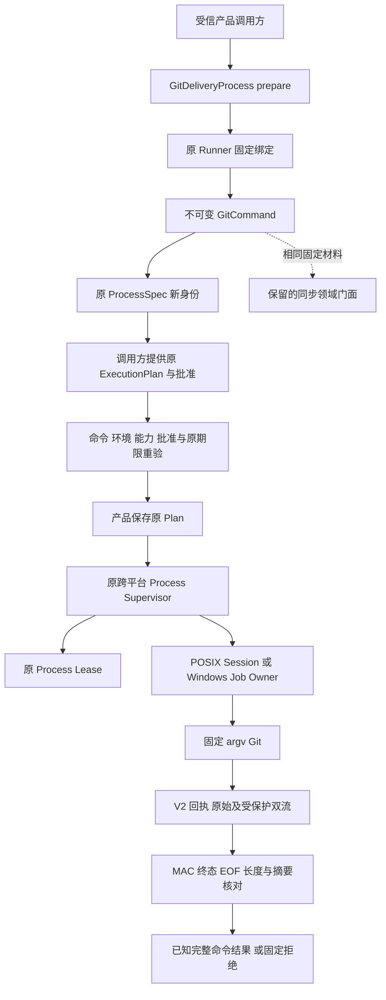
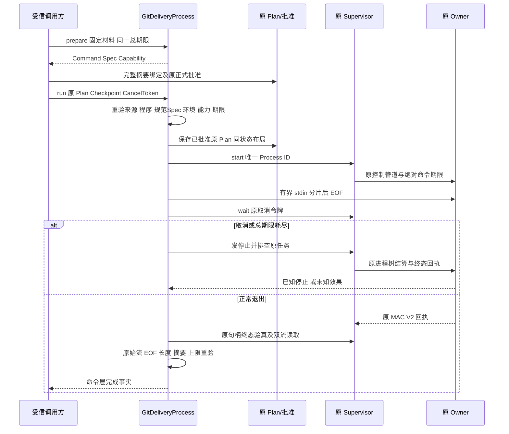
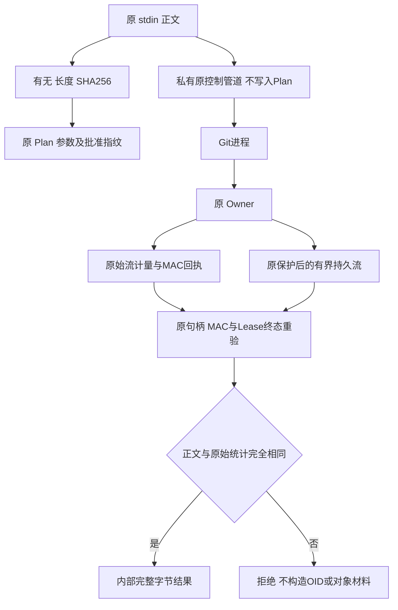

# Git 交付受控命令 IO 总体与详细设计

## 1. 需求背景

现有 `GitDeliveryRuntime` 已实现受管 Worktree、Checkpoint 和本地 Commit 的领域保护，
但其 `_GitRunner.run` 是同步 `subprocess.run`：仅在命令层设置超时，结束后才检查输出长度。
把整个领域方法交给线程并不能提供取消、跨命令总期限、进程树回收或耐久进程事实。
领域 Store 的 SQLite 连接也不能随意迁移到工作线程。

[完整 Git 业务闭包设计](m09-r4-git-delivery-business-backup-closure.md)将受控 IO 列为默认产品接线前置。
本变更先提供正式内部执行端口，复用已有独立 Process Owner、Execution Plan、审批、Lease 和回执。
它不添加独立服务，不替代完整的多 Patch、Checkpoint、Commit、对象材料与备份闭包。

## 2. 设计目标、范围与非目标

### 2.1 已实现范围

1. 同步领域与异步产品端共享同一固定命令、白名单环境和可执行文件身份材料。
2. 执行前验证原 `ExecutionPlanV2`、实际参数、环境、能力与批准，不自行生成 `ALLOW`。
3. stdin 的有无、长度和完整 SHA-256 进入意图绑定，正文不进入 Plan 或对象 `repr`。
4. 一个操作共享单调总期限；命令不能更换另一预算对象重新取得时间。
5. 取消覆盖启动期、输入期和等待期；原 Owner 结算后才返回，禁止隐式排队及自动重放。
6. POSIX 使用原 Session Owner，Windows 使用原 Job Object Owner；没有第二套进程树算法。
7. 正常退出后重新验证 V2 回执及双流原始观察。截断、非 EOF、脱敏改写和超限不能冒充 Git 元数据。
8. Plan 与 Lease 存入调用方指定的原布局；同 Process ID 再次运行沿原合同拒绝。

### 2.2 仍未完成的产品边界

默认目录尚未发布 Git 写 Tool；此端口不是 `ProductGitDeliveryExecutor`，也不派生产品批准。
原同步领域门面仍保留，尚未把全部领域算法转换为异步受控调用；同步旧门面不具有新增取消能力。
锚 A、投影 T、产品关联认证、完整 Diff 审批、对象目录、全事件前缀认证和 Backup v2 仍需实现。

原 Process stdin 上限为 1 MiB，当前新端口明确拒绝更大输入，不截断、不拆成多条 Git 命令。
原业务目标仍包含 8 MiB 文件与完整对象材料；后继必须增加有界受信材料通道，
不能把 1 MiB 控制管道当作业务对象容量上限，也不能据此宣称完整 Git 交付完成。
每个 stdout/stderr 的正常结果上限仍为原 1 MiB；完整 8 MiB 对象读取同样需要后继材料消费通道。

## 3. 源码研究、架构决策与取舍

| 求证对象 | 源码映射及结论 |
|---|---|
| 原同步执行及环境 | [`delivery/git.py`](../../src/harnessix/delivery/git.py)的 `_GitRunner`；保留旧接口，提取固定材料职责 |
| 唯一命令与 stdin 摘要 | [`git_command.py`](../../src/harnessix/delivery/git_command.py)的 `GitExecutionBinding`、`GitCommand` |
| 原物理身份观察 | [`git_identity.py`](../../src/harnessix/delivery/git_identity.py)；提取原路径、目录、程序身份算法，不改变摘要字段 |
| 新产品内部端口 | [`git_delivery_process.py`](../../src/harnessix/product_config/git_delivery_process.py)；规划、协调与执行职责分开，不增长原热点 |
| 原进程监督与唯一回收 | [`supervisor.py`](../../src/harnessix/processes/supervisor.py)的 `start`、`wait`、`aclose`；只有原端口控制 PID/Owner |
| 原批准与绑定 | [`execution/contracts.py`](../../src/harnessix/execution/contracts.py)的 `execution_is_approved`；[`supervision_planner.py`](../../src/harnessix/processes/supervision_planner.py)的 `build_host_process_binding` |
| 原始观察及终态验真 | [`owner_receipt.py`](../../src/harnessix/processes/owner_receipt.py)的 V2 回执；[`receipt_projection.py`](../../src/harnessix/processes/receipt_projection.py)的原终态读取 |
| 持久意图与停止事实 | [`execution/store.py`](../../src/harnessix/execution/store.py)、[`supervision_store.py`](../../src/harnessix/processes/supervision_store.py)；不新建业务账本格式 |

本地 Codex 源码 `codex-rs/core/src/exec.rs` 的 `ExecExpiration` 将取消和期限作为独立终止原因，
并通过原 `kill_child_process_group` 处理直接子进程退出后仍持有管道的后代。
借鉴的是“终止原因与完整进程树结算分离”的原则；本实现复用 Harnessix 原 Owner，不复制 Rust 算法。

架构将适配放在 `product_config`：该层本来就依赖 `delivery` 与 `processes`，
避免给领域包新增进程监督依赖或引入反向依赖环。唯一环境构造留在领域内部，
原私有程序/目录身份算法提取为同包模块。结构治理阈值、原公开包 `__all__` 均保持。

## 4. 总体架构与流程图



规划不启动进程，材料不授予执行权。同步旧门面只是共享材料，不经过新监督端；
不能将图中虚线解释成旧入口已有 Process Owner。新结果仅证明命令层事实，
Commit 是否成功仍必须由领域层复核对象、Ref CAS、来源和持久阶段。

## 5. 接口设计、类设计与数据结构

| 类/接口 | 职责、入参和返回 |
|---|---|
| `GitExecutionBinding.prepare` | 原 Runner 内部使用；输入 cwd、固定参数、stdin、私有 Index、允许退出码与期限，返回 `GitCommand` |
| `GitExecutionBinding.verify` | 启动前重建完整材料并比较；不启动或修复绑定 |
| `GitCommand.digest` | 固定 argv、环境、cwd 物理身份、程序身份、stdin 有无/长度/摘要及允许退出码 |
| `GitOperationBudget(seconds)` | 仅当前操作使用的单调总期限，0～3600 秒之间且不能为无穷/NaN；不是持久恢复授权 |
| `GitDeliveryProcess.prepare` | 返回 `PreparedGitProcess`；不创建 Plan/Lease，默认命令期限 20 秒并扣除总剩余时间 |
| `PreparedGitProcess.approval_arguments` | 返回版本、实现摘要、完整命令摘要及规范 ProcessSpec，供原 Plan 冻结 |
| `GitDeliveryProcess.run` | 输入原 Plan、CancelToken、同一 Budget 和可选批准 Checkpoint；返回 `GitProcessCompletion` 或固定拒绝 |
| `GitDeliveryProcess.aclose` | 关闭后拒绝新请求；活动操作发出停止并排空，不释放尚未结算的控制任务 |

### 5.1 重点字段

`PreparedGitProcess.command` 不含授权；`spec.process_id` 是新的唯一进程身份，不是交付 UUID。
`capability` 绑定当前平台 Owner 实现，运行时重新探测；`budget` 为原对象引用，不能跨重启复用。

`GitCommand.input_data`、`argv`、`environment`、路径和结果正文均不进入 `repr`。
`input_present` 区分关闭 stdin 与开启空 stdin；二者长度都为零但语义不同。
开启空 stdin 的原输入额度为 1 字节，实际不发送正文，仅关闭管道。
stdin 按原 64 KiB 控制分片顺序发送，总长不超过原 1 MiB；没有输入重试。

ProcessSpec 使用 `argv/pipe/foreground`，禁止 Shell、PTY 或后台替换。
`output_bytes` 为双流合计 2 MiB 保护线，最终逐流仍各检查 1 MiB。
stdout/stderr 原始 SHA 与持久正文 SHA 必须相同；默认保护策略不绕过，受保护变换导致固定拒绝。

实现摘要覆盖新适配、原 Git 领域文件、固定命令/身份和 Git Store 结构定义；
原 Process 能力另行覆盖 Owner 实现。源码改变导致旧执行材料不匹配，必须重新规划批准。
本变更不重写已保存的旧领域计划或历史批准。

### 5.2 批准、持久化与事务接口

`run` 不构造 Policy，消费原 `execution_is_approved`：DENY 拒绝；`REQUIRE_APPROVAL` 要求匹配批准；
ALLOW 沿原受信宿主语义且不允许多余 Checkpoint。本端口不是策略签发器。
后继产品桥必须证明已有产品批准如何缩小为固定子命令，不能为任意模型参数自动产生 ALLOW。

执行前复用 `build_host_process_binding`，使参数、能力和环境不匹配在创建私有状态前拒绝。
实际 Supervisor 在启动边界再次使用同一原校验，并核对原 WorkspaceSnapshot。
数据库连接只在当前异步执行线程使用；只有原 Supervisor 的启动/回执 IO 使用它已有的工作线程。

## 6. 时序图、数据流与核心伪代码





业务伪代码：

```text
准备命令：
  拒绝非法期限、退出码、stdin 类型、超出原输入额度或状态根重叠
  由唯一固定绑定观察 cwd/程序身份并构造原 Git 环境
  派生新的规范 ProcessSpec，期限不超过命令上限及总剩余时间
  返回材料；不启动、不产生授权

执行命令：
  检查原 CancelToken、同一总期限、关闭及忙状态
  重验规范Spec、固定命令、程序、能力、原 Plan 参数与根cwd
  按原批准合同拒绝无效授权，复用原环境/意图绑定检查
  创建任务前再次确认总期限；到期不得留下内部执行任务
  创建唯一内部操作任务，外层只等待 shield，不取消启动线程
  保存原 Plan，调用原 Supervisor 启动一次
  顺序发送有界 stdin，不重试；等待原取消与终态
  任一外层取消/超时：通知原任务停止，再排空
  停止未知或回执/控制失联优先于普通取消/超时
  正常退出后读取原 MAC V2 回执及完整持久流
  任一流超限、截断、未EOF或摘要不同即拒绝
  再验固定程序与 cwd 身份，返回命令事实；不宣称Commit成功
```

## 7. 失败、取消、超时与恢复语义

| 条件 | 明确行为 |
|---|---|
| 前置取消、总期限到期、无批准、参数/环境不匹配 | 不启动命令；不生成新的 Plan/Lease |
| 另一次运行尚未结算 | `git_process_busy`；不排队、不刷新期限 |
| 更换 Budget 对象 | `git_process_budget_mismatch`；同 argv 也拒绝 |
| 程序或 cwd 身份漂移 | 固定绑定错误；不按同路径重新授权 |
| stdin 超过原 1 MiB | `git_process_input_limit`；不截断、不执行 |
| 命令期限或总期限耗尽 | 先回收；已知停止后返回 `git_process_timeout` |
| 原 CancelToken / asyncio Task 取消 | 通知原内部任务并排空；已知停止后传播原取消 |
| Owner 未知、MAC/回执/输出损坏或控制失联 | 优先 `git_process_unknown`，禁止重放；普通取消不能覆盖未知效果 |
| 正常退出码不在原白名单、输出超限 | `git_command_failed`；不消费部分输出 |
| 原始流与正文不相同 | `git_process_output_changed`；不把脱敏/截断前缀当对象正文 |
| 同 Process ID 再运行 | 原 `process_already_exists` 拒绝；不自动生成新 ID 重试 |

总期限约束新工作启动与等待，不承诺危险的“到时立即返回而放弃回收”。
结算允许原终止宽限及回执读取开销；超过业务期限不再启动后继命令。
总期限触发时原 Lease 可能记录 `cancelled`，这是原停止协议的事实；
上层 `git_process_timeout` 表示整个操作耗尽，两者不能互相改写。

重启后只用原 Plan/Lease/回执观察端对账，失去原预算和控制句柄不能恢复执行权。
本模块未实现 Git 业务阶段恢复；后继仍须核对对象、Ref、worktree 注册和产品关联，
不能从某条命令退出零直接重放后续写入。

### 7.1 POSIX原始回执生产整改

初始真实Git端口验证在POSIX被原V1回执阻断，而不是Git命令执行失败。新端口继续要求V2，
不退回从脱敏Lease推导raw。POSIX pipe的running/exited/launch_failed/unknown现在从原
`CapturedProcessOutput.raw_observation`取得双流并由同一MAC发布；PTY保持V1。
旧回执仍按原版本读，不补零、不重签。默认Supervisor Reader已支持两个版本，机器Schema不变。

原进度位置与启动失败回执构造提取到唯一`owner_output.py`，Windows旧模块保留兼容导出。
POSIX按原Spec同时约束raw与保护后字节，EOF尾窗也复核额度；限额数值不增加。
该变更扩大了受影响的原Process回归范围，原失败与最终候选必须分别保留。

### 7.2 评审发现的启动前期限与实际cwd边界

原Supervisor按`Workspace根 / plan.workspace.cwd`派生实际cwd，而固定GitCommand已持有最终
绝对cwd。新端口仅接受`plan.workspace.cwd == "."`，否则在保存Plan与创建Lease前以
`git_process_plan_mismatch`拒绝，避免合法批准的相对子目录改变实际Git命令目录。
需要在子目录执行时，应以该子目录作为命令与Snapshot同一实际根，不能重复拼接。

最后一次总期限核验移至创建内部任务之前。核验过程中耗尽期限必须直接拒绝，不能因随后
`budget.remaining()`抛出异常而绕过停止/排空并清空活动引用。执行阶段仍用同一预算、取消令牌
和原Owner结算。真实启动观察负对照以及两级子目录批准负对照先复现3失败，再验证3通过，
不通过修改审批、Score、期限定额或成功端口规避缺陷。

## 8. 安全、部署与可观测性

所有路径、固定命令和环境由受信宿主构造，模型不能提供 executable、Git argv、环境、Index 路径或 Budget。
没有 Shell、凭据注入、代理继承或公网 Push。本端口默认只使用原 `file` 协议白名单，
但 `host_guarded` 不等于内核网络隔离，不能把白名单描述为强 Sandbox。

调用方指定的状态根必须绝对、与 Workspace 不重叠，并沿原 Process 私有目录合同处理。
计划使用原 `execution-plans.db`、进程使用原 `process-owner`；不扩展默认六库备份白名单。
部署无需中间件、服务或新依赖，macOS/Linux/Windows 采用相同产品接口并调用各自原生后端。
Windows CI 证明范围仅限实际 Runner 与执行步骤，不代替消费者 Windows 11 验收。

可观测事实为原 Plan ID、Process ID、Lease 状态、停止原因、V2 原始字节数/SHA/EOF和固定错误码。
公开日志不得记录 stdin、环境、命令参数、原始 stdout/stderr、个人路径或 Owner Token。
`GitProcessCompletion` 保留内部认证事实，不是模型可见输出协议；公开结果由后继业务适配投影。

## 9. 测试、验证与发布边界

新增测试使用真实原 Supervisor 与 Git/受控测试程序：固定环境、二进制分片输入、空输入、
参数与 stdin 意图绑定、原批准、漂移、总期限、忙/关闭、取消/Task 取消、进程树回收、
输出上限/脱敏负对照与同 Process ID 禁止重放。未知结算优先级另设独立失败注入，
失败注入不能替代真实进程回收正控。

原 Git、Checkpoint Guard、Push 和只读 Store 回归验证同步门面兼容；
完整关联测试覆盖产品目录、原 Process/Owner/回执及治理，源码外 Wheel 验证非 Editable 安装。
详细实际运行次数、原失败、日志摘要与制品哈希由同版本验证包记录，集合有重叠不得相加。

新增POSIX专项覆盖running/退出/启动失败/unknown的原始双流与MAC、取消、EOF尾窗限额、
脱敏缩小不能绕过raw限额、启动线程屏障取消和PTY V1兼容。失败/unknown从原MAC回执读取，
不放宽仅接受exited的成功投影；EOF测试保持关闭输出的目标存活，避免将退出权限竞态的unknown
误当作已知回收。原真实Supervisor、Owner、签名和Lease提交未由测试替代。

专项完整交付目录为[受控IO验证包](../validation/git-supervised-io-2026-10-01-v1/README.md)，
包含单一总体报告、结构化事实、验证结果、Review Packet、Manifest及实际设计图。

本变更不关闭 R3、不改变模型请求预算或评分器、不关闭完整 Git 商用门禁。
只有默认产品桥、完整业务材料与恢复闭包、原生和真实任务验证全部通过后，才能标记完整交付完成。
