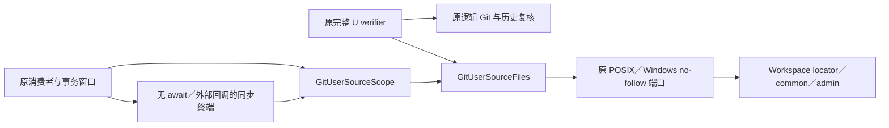
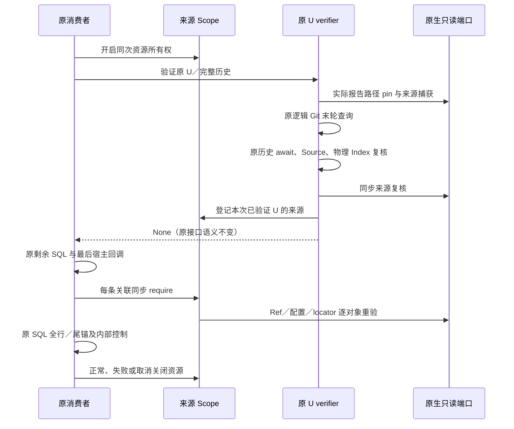
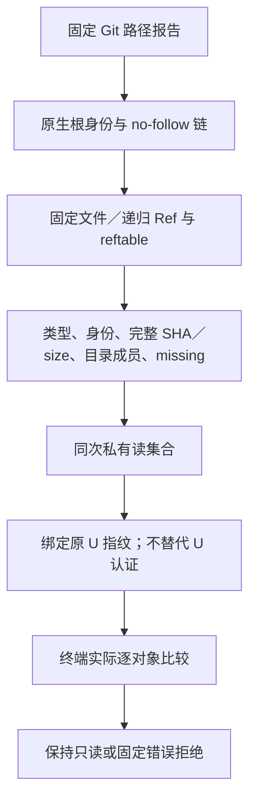

# Git 原生 Ref／配置末端来源复核详细设计

## 1. 变更摘要

本设计限定于 B4 的原生来源读集合：关闭原 U 末轮逻辑 Git 查询之后、消费者最后宿主回调之后的 Ref／配置持久漂移窗口。
不建立新数据库、第二套业务锁、后台服务或授权域，不装配默认 Git 写工具。
原生来源模块、同次 Scope 与两消费者接线已经实现，限定的安装态验证已完成；`code_revision` 是变更前生产基线，不表示下述增量已经发布。
完整 B4 仍要求执行临界区、COMMIT／实际 Git 效果的条件验证与失败恢复；本子切片不是跨库事务或外部 Git 写锁。

## 2. 需求背景与证据

原基线完整 U 已绑定 HEAD Commit／Tree／Ref、逻辑与物理 Index、工作区 Source、配置 origin/name/value SHA、认证会话历史及原宿主。
但逻辑 Git 查询完成后仍有历史 await 和外部 checkpoint；旧消费者终端只复核 SQL、工作区与认证事实，未复核 Ref／配置的实际文件。
独立安装态诊断确认两种反例：同配置 key 改 value，以及改为预先存在且指向同一 Commit 的另一 HEAD Ref。
两项均在原 verifier 真实返回后执行，旧 pending Reader 接受一条关联而全部 Store 保持只读；诊断绿色只证明窗口到达，不是安全验收。
原证据见[原生与末端研究交付](../validation/git-native-and-terminal-research-2026-10-08-v1/README.md)。

## 3. 设计目标、非目标与退出条件

目标：同次认证的实际 Ref／配置来源，在最后逻辑 Git 查询之前捕获，并在 U 结束及消费者无外部回调的同步终端逐对象重验。
每条关联都必须有其完成验证的来源读集合；同一 U 重读不能重复累计句柄。
失败保持原事务回滚责任，不补签、不重捕历史 U、不生成 Approval 或执行权。

非目标：连续 ABA 检测、任意进程内 native 攻击、原 SQLite FD 证明、决定 Writer、Git 效果提交、P1 callback 合同调整及三平台发布验收。
退出条件是来源负向／资源测试、真实原 SDK 窗口拒绝、原异常身份与只读边界以及同一新安装候选的必要回归；不是只看单元测试通过。

## 4. 总体架构与模块边界



消费者拥有资源生命周期；验证子任务仅借用同次 Scope，并在全部 U 验证成功后登记读集合。
原生来源模块只读固定目录成员，不解析业务审批，不接受模型指定文件或 SHA，也不发起 Git 子进程。
SourceScope 是私有操作资源容器，不是可持久化、可复制的认证凭证。
原 Session／Router／Workspace／GitDB 权威及原 Runtime Thread 临界区归属不变。

## 5. 核心流程与时序



来源捕获必须在最后逻辑 Git 查询之前；若在其后首次捕获，已漂移事实会被当作新基线，不能修复缺口。
U 末段保留原检查顺序和全部控制点，再追加来源重验；最后消费者终端不得 await、启动 Git 或调用外部 callback。
消费者返回后调用方仍拥有 COMMIT／ROLLBACK；该边界不宣称阻止返回后外部进程继续改 Ref。

## 6. 数据流程、数据结构与来源领域契约



| 根／成员 | 意义 | 比较边界 |
|---|---|---|
| Workspace `.git` | 原仓库定位器，普通目录或 linked-worktree 文件 | 文件观察完整正文；目录仅绑定原生对象身份，不枚举整个 GitDB |
| common／admin `HEAD` | 普通或 reftable dummy 定位；linked HEAD 属于 admin | 原物理类型、身份、正文 SHA |
| common／admin `config`、`config.worktree` | 原本地与可选工作树配置 | 文件／missing；目录与链接拒绝 |
| `commondir` | 原 common 路径选择器 | 原正文与身份，不能跟随替换 |
| `packed-refs` | files 后端压缩引用来源 | 完整文件／missing |
| `refs`、`reftable` | loose Ref／每工作树特殊 Ref／表栈与表成员 | 递归目录身份、完整成员及文件 SHA |

common==admin 去重。`gitdir` 仅用于工作树存活管理，Git 可以合法更新时间，故不以其 mtime 拒绝正常查询。
原 Index、Workspace Source 与认证历史仍走既有算法；不递归 objects／logs，不把对象存储不可变假设扩展为来源写锁。
固定 Reader 的子进程使用明确环境，未继承宿主任意 Git 环境变量；system/global 被关闭，include 与条件 include 仍被原安全入口拒绝。
原共享 Workspace 读取规则仍禁止 `.git`；来源模块只在本次私有原生根使用固定成员允许列表，不扩大模型或共享读取权限。
保留原完整配置 SHA，新的物理来源不替代配置语义检查；文件与 reftable 后端均需实际夹具求证，不静默把 reftable 当作 loose Ref。

## 7. 类与接口设计、重点字段

| 源码 | 职责／接口 | 重点字段 |
|---|---|---|
| [来源文件模块](../../src/harnessix/product_config/git_user_source_files.py) | `pin_git_user_source_files` 与 `GitUserSourceFiles.verify` | 私有原生根、逐对象捕获；路径／正文不公开 |
| [资源 Scope](../../src/harnessix/product_config/git_user_source_scope.py) | `pin`、`retain`、`require`、context 生命周期 | `_resources` 拥有一个原根集合；`_binding` 禁止同次换根；`_verified` 仅记录完成 U 验证的指纹 |
| [原 U verifier](../../src/harnessix/product_config/git_user_observation.py) | 原返回值仍为 None；私有可选 Scope | 原 U、原完整历史、原取消／预算／checkpoint |
| [Prepared 读集合](../../src/harnessix/product_config/git_prepared_link_observation.py) | 原终端逐关联 require | 原 evidence 全集与同次 source_scope |
| [Ledger 控制](../../src/harnessix/product_config/git_prepared_link_ledger.py) | 原控制窗口拥有 Scope | 最后外部回调之后只执行内部控制 |
| [原历史 Reader](../../src/harnessix/product_config/git_prepared_approval_history.py) | 同次 Scope 延续至决定来源终端 | 旧 pending 与新审批历史语义均不放宽 |

同次 Scope 只捕获一个固定根集合，后续关联重验而不重开资源；不会随关联数量线性累计句柄。
Scope 先登记资源再允许子任务 await；即便取消丢弃验证结果，原消费者 finally 仍可关闭资源。
相同 U 指纹只用于查找已验证资源，不是以可公开重算的 SHA 签发认证。

## 8. 核心逻辑伪代码

```text
进入原消费者控制窗口:
    开启来源 Scope 与原连接／历史／锁观察
    对全集每一关联:
        沿原 verifier 认证原 U
        在末轮 Git 之前捕获实际来源
        保留原 Git／历史／Source／Index 验证
        同步 compare(captured, native_now)
        retain(original_U, captured)
    完成原 SQL 全行与尾锚观察
    运行原最后宿主回调
    无外部回调的同步终端:
        对每一原 evidence:
            原 proof 终端校验
            require(original_U) 并 compare 实际来源
        再核对原 SQL 与内部控制
退出窗口: 关闭全部同次原生资源
任何失败: 不返回集合；调用方回滚原事务
```

## 9. 可观测性、错误分类、取消、超时与恢复

持久漂移、缺失完成来源或已关闭 Scope：`git_user_observation_changed`。
符号链接／Reparse、缺失父路径及不受支持对象：沿原生端口 fail closed，不发布原始路径。
每文件沿原 8 MiB、全来源 32 MiB、对象节点 10,000 上限，限额错误为 `git_user_source_limit`；超过时明确拒绝，禁止截断或降级为仅 SHA／最后一条。
checkpoint 的首个预创建异常实例必须原样穿透，包含 KernelError、OSError、TimeoutError 和取消；清理不得改写其身份。
操作失败不追写旧 U／MAC／事件，不改变原事务或历史；恢复应重新调用原完整认证流程，而非复用已经关闭的 Scope。

## 10. 安全与兼容

无外部 callback 的终端减少合作宿主变更窗口，但不能证明外部进程在整个事务期间未发生 ABA。
正式原子 Git 效果仍需要同一批准／条件 Ref 更新／结果恢复语义；不得由本子切片关闭完整 B4。
实现摘要加入新来源算法和 Scope 文件；旧 U 的 implementation digest 不匹配时按原规则拒绝，不静默改写旧认证历史。
这是尚未默认发布的内部 Git 能力升级，不修改 Agent Protocol 2.0、GitDB v2 DDL、原 Session Schema 或已封存验证数据。
来源节点上限是明确新增约束，较大 Ref 仓库只能拒绝，不能宣称任意规模仓库已支持。

## 11. 测试与验证计划

单位：不变、同 key 改值、same-OID HEAD 文本、nested refs／packed-refs／reftable、missing 创建、成员增删、同正文 inode 替换、根置换、链接拒绝、限额、首个异常身份、正常／失败资源关闭。
配方：原逻辑 Git 与历史／Source／Index 顺序不缩减；来源捕获及末端复核有明确顺序。
实际 SDK：使用原完整 fixture，after-original-U-return 两种漂移对 pending／审批历史消费者分别拒绝；原 SQL 行、写计数和其他 Store 不变。
发行：新冻结源码与 Wheel／非 editable 安装字节相等，保存原输入、JUnit、日志、manifest 与 Review Packet。
macOS 通过不能推导 Linux／Windows 已通过，合成 reftable 字节变化不能推导完整真实 reftable 编码已通过。
同一安装 Wheel 的原完整五项 SDK 集合得到四项漂移拒绝通过、一项同 Turn 双消费者正控过期失败（125.394 秒），原件保留。
两个正控分别置于各自独立原 Turn，完整六项集合 6/6 通过（588.95 秒）；不放宽 120 秒／60 秒或回调，P1 仍开放。
files／reftable 的普通与 linked worktree 四例真实 Ref 原语复验均拒绝 same-OID HEAD 变更；reftable 两例的物理 HEAD dummy 正文未变，证明必须观察表栈而非仅 HEAD 文件。

安装态原生／资源／配方完整单位集合 112 项通过、1 项原生 Windows 跳过；同一 Wheel 的七个核心目录 2815 项通过、1 项原生 Windows 跳过。
核心首轮投影遗漏 schema 造成 21 项缺文件失败；独立补齐 292 个原 Git spec 输入后复验，生产代码和测试断言不变。
错误工作目录启动的部分运行中断并保留，不纳入完整集合结果。558 个源码／Wheel／安装成员及 922 个验证输入以独立摘要固定；不将跨投影或重复结果相加。

## 12. 部署与回滚

无数据库迁移、外部部署或 Docker 设置变更。停用内部 Git 入口即可停止新消费；保留原事件／MAC／版本及失败证据。
不得通过删除历史、复签旧观察或关闭检查恢复兼容。既有默认 Coding Agent 读取／Patch 产品链保持原装配。

## 13. 风险、开放项与验收边界

P1 原同步检查成本保持原合同，新增完整来源扫描可能增加成本，须记录实测；不得通过降低检查频率关闭。
SQLite 实际 FD、B4 连续临界区与 COMMIT、B7 全 dispatch、决定 Writer、默认 Checkpoint／Commit、三平台和 R3 真实 Trial 仍开放。
R3 历史评分与 Beta 接受数不得由本组件测试提高。无有效新预算登记前不发起真实模型请求。

## 14. 源码研究与相关资料

Git 2.53 实际独立夹具已观察 files／reftable 的普通与 linked worktree 四种布局，配置来源均为固定命令行、common config 与 admin config.worktree。
正式依据：[Git 仓库布局](https://git-scm.com/docs/gitrepository-layout)、[Git 2.53 配置](https://git-scm.com/docs/git-config/2.53.0)、[Git 2.53 reftable 规范](https://github.com/git/git/blob/v2.53.0/Documentation/technical/reftable.adoc)、[原生端口](../../src/harnessix/workspace/snapshot.py)。
固定夹具证据与新发行验证应随本切片独立封存；旧 native／终端研究交付不可追写。
