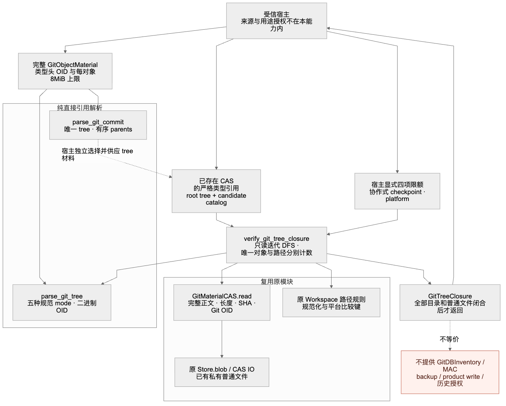
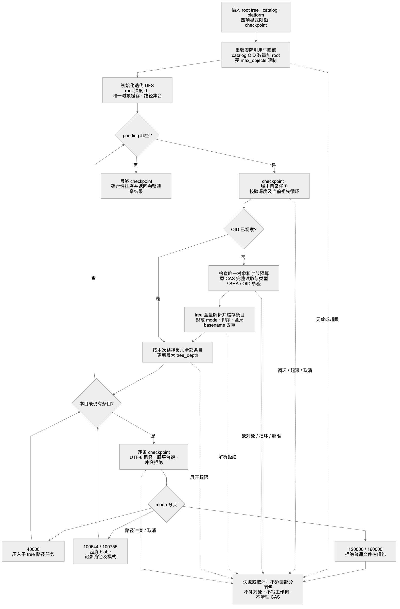
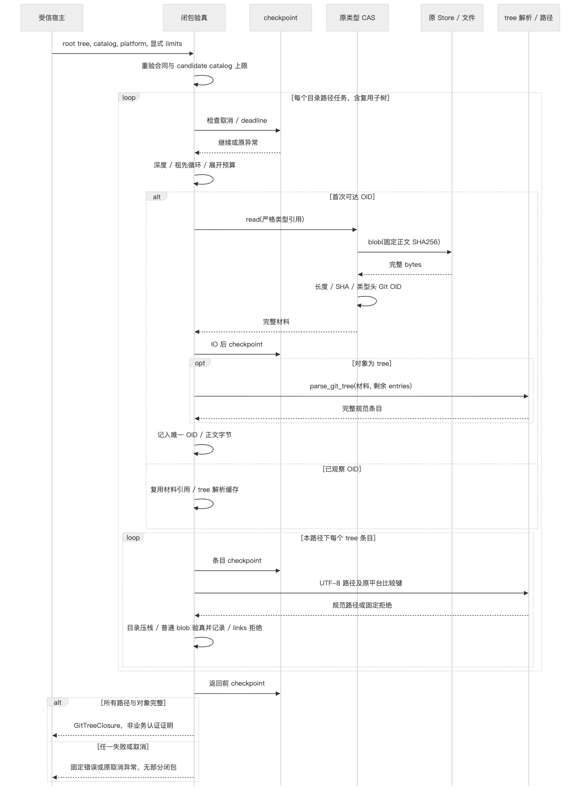
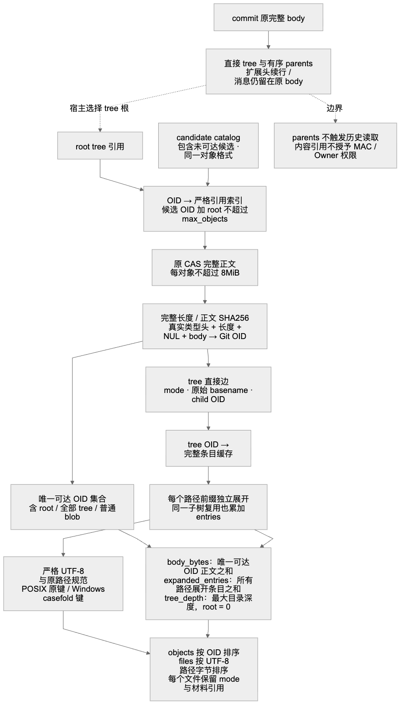
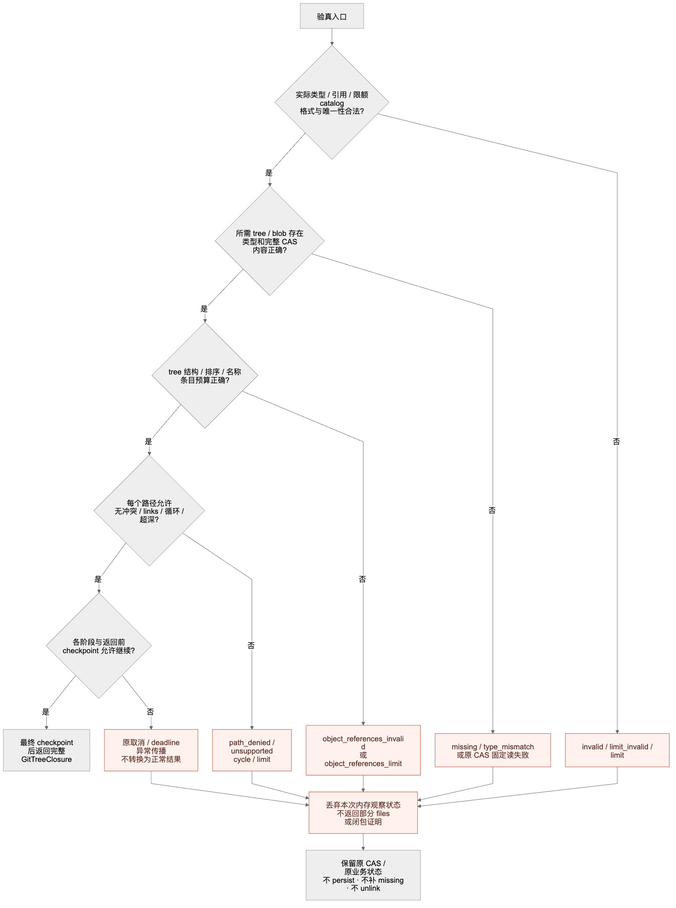

# Git 直接引用解析与完整普通文件树只读验真设计

## 1. 需求背景、文档身份与能力定位

本设计覆盖两个内部模块：`git_object_references.py` 的 tree／commit 直接引用解析，
以及 `git_tree_closure.py` 在原材料 CAS 上完成的普通文件树只读验真。
首版研究、依赖和比较基线为 `37a1f01b`；当前 `code_revision` 对应第11.4节的分层增量。
第17章保留初版记录并分别登记本增量，历史通过不能自动覆盖新实现。
未填写的结果不得解释为通过。

原 `GitObjectMaterial` 已按真实对象类型头、正文长度和完整正文计算 Git OID，
原 `GitMaterialCAS` 已将正文绑定到可完整回读的七字段类型引用。
这些能力仍不足以回答两个不同问题：

1. 一个完整 tree／commit 正文实际声明了哪些直接引用？
2. 给定 tree 根及候选材料，根下每个目录和普通文件是否都能从已有 CAS 完整验真？

只检查根 OID 会漏掉缺失子树和 blob；只检查候选对象数量会漏掉重复子树的路径展开；
只按 basename 排序会误读 Git 目录排序；只扫描 commit 中包含 `tree`／`parent` 的文本，
又会把消息或扩展头误当成引用。本设计分别解决二进制结构解析和有界路径闭合观察，
不将内容观察提升为授权、备份或产品交付成功。

### 1.1 源码定位

| 模块 | 核心入口 | 职责 |
| --- | --- | --- |
| [git_object_material.py](../../src/harnessix/delivery/git_object_material.py) | `GitObjectRead`、`GitObjectMaterial` | 类型、格式、每对象容量和真实 Git OID |
| [git_material_cas.py](../../src/harnessix/delivery/git_material_cas.py) | `GitObjectMaterialReference`、`GitMaterialCAS.read` | 严格引用、原 CAS 完整回读和内容绑定 |
| [git_object_references.py](../../src/harnessix/delivery/git_object_references.py) | `parse_git_tree`、`parse_git_commit` | 纯直接引用解析，无外部 IO |
| [git_tree_closure.py](../../src/harnessix/delivery/git_tree_closure.py) | `verify_git_tree_closure` | 候选目录约束、只读 DFS、对象与路径分别计数 |
| [store.py](../../src/harnessix/delivery/store.py) | `SQLiteWorkspaceTransactionStore.blob` | 原固定摘要地址读取，不通过写入口 |
| [workspace_cas_io.py](../../src/harnessix/delivery/workspace_cas_io.py) | `read_blob_body` | 完整普通文件回读、长度和 SHA 校验 |
| [paths.py](../../src/harnessix/workspace/paths.py) | `normalize_workspace_path`、`path_comparison_key` | 复用原平台逻辑路径及冲突规则 |
| [cancellation.py](../../src/harnessix/agent/cancellation.py) | `CancelToken.checkpoint` | 可供宿主组合的既有协作取消检查 |

## 2. 设计目标、非目标与取舍

### 2.1 目标

1. tree 按原始二进制正文解析全部条目，接受五种规范 mode，并精确绑定子对象类型和格式。
2. commit 只提取首行唯一 tree 与连续、有序 parent，不重写原正文、身份头、扩展头或消息。
3. 以原 CAS 中已有材料验真完整目录与普通文件，不允许缺失 tree／blob 形成部分成功。
4. 每对象保留原 8,388,608 字节上限；图总量由宿主明确提供四项非负整数限额。
5. 候选 OID 数量加 root、唯一可达正文、路径展开条目和目录深度分别受限。
6. 所有入口重验实际材料／引用／限额，不因 frozen 对象曾构造成功而免验。
7. 复用原 Workspace 路径规则；取消或 deadline 在 checkpoint 处传播，不返回部分闭包。

### 2.2 非目标

- 不实现 GitDBInventory、认证业务目录、MAC、Owner／Lease 授权或用途批准。
- 不实现完整 commit 历史闭合；parent 不自动获得 external-history 角色或缺失豁免。
- 不读取 Pack、索引、alternates、远端、用户 `.git`，不调用 Git 命令补齐对象。
- 不实施 backup、restore、checkpoint 发布、工作树写入、产品事务或角色登记。
- 不把普通文件树支持扩展为符号链接、gitlink／子模块落盘或跟随链接。
- 不执行完整 `git fsck`、签名验签、作者身份认证、日期合法性或邮箱真实性检查。
- 不建立共同静默快照、跨对象原子观察、孤儿 GC 或新的默认产品容量。
- 不增加平台适配层，不宣称原 POSIX 规则额外覆盖 macOS Unicode 等价冲突。

### 2.3 主要取舍

| 方案 | 选择理由与代价 |
| --- | --- |
| 完整材料后纯解析 | 在原每对象上限内严格检查结构；不依赖文本命令输出或解析半正文 |
| parser 接受 links，graph 拒绝 links | 保持直接引用语义完整；普通文件树验真不偷渡链接写入能力 |
| root 仅接受 tree | commit 的直接引用解析独立；宿主显式选择并供应 tree 材料 |
| 候选目录与可达对象分离 | 限制输入目录本身，同时不把未可达正文算入闭包或宣称已验真 |
| OID 缓存与路径展开分离 | 节省重复对象 IO，但保留每条业务路径及其预算消耗 |
| 显式栈 DFS | 不依赖 Python 递归深度；仍保留每条目录分支的祖先链和深度检查 |
| 原路径键复用 | 不复制 Windows 命名平台；继承限制和已知非目标而非扩大安全声明 |
| 同步、有界 IO 与协作 checkpoint | 无新线程／任务所有权；不承诺单次同步读或哈希中可即时抢占 |

## 3. 格式来源与原创实现边界

格式研究固定为 Git v2.53.0 原始源码，函数和行区间用于定位语义，不作为 Harnessix 的实现模板。

| 一手资料 | 求证主题 | 本设计使用边界 |
| --- | --- | --- |
| [tree-walk.c，`decode_tree_entry`，15+](https://raw.githubusercontent.com/git/git/v2.53.0/tree-walk.c) | tree 的 mode、名称终止符及算法相关原始 OID 宽度 | 对照字段边界；本实现使用独立的 bytes 游标和完整材料合同 |
| [fsck.c，`verify_ordered`，497+；`verify_headers`，782+；`fsck_commit`，896+](https://raw.githubusercontent.com/git/git/v2.53.0/fsck.c) | 目录尾 slash 排序、非连续重复、头边界及核心头顺序 | 对照解析不变量；不继承完整 fsck 验真范围 |
| [commit.c，`parse_commit_buffer`，436+；`read_commit_extra_header_lines`，1397+](https://raw.githubusercontent.com/git/git/v2.53.0/commit.c) | 直接 tree／parent 顺序与扩展头 continuation | 保留直接引用和原正文；不执行其对象库、graft 或历史替换路径 |

上述语义采用原创 Python 实现和下述业务伪码表达，不复制或翻译 Git GPL 源码算法片段。
更严格的应用路径策略与规范 mode 集合是 Harnessix 的输入合同，不能反向宣称它接受所有 Git 历史对象。

## 4. 总体架构与调用边界



图源：[architecture.mmd](../validation/git-tree-closure-2026-10-01-v1/diagrams/architecture.mmd)。

受信宿主提供完整材料、已有 CAS 引用、目标逻辑平台、限额及 checkpoint。
引用解析器只接受完整 `GitObjectMaterial`，不持有 CAS、数据库或命令执行器。
闭包验真器消费 root tree 引用和候选引用，通过 `GitMaterialCAS.read` 访问原完整文件 IO，
并通过原 Workspace API 校验逻辑路径。两者返回内存合同，不登记业务成功。

`parse_git_commit` 不被 `verify_git_tree_closure` 自动调用。
若宿主从 commit 开始，必须先验真完整 commit、调用直接引用解析器，
再从显式供应的候选材料中选择匹配 tree 引用。
这不意味着 parent 已完整备份，也不允许按同名字符串或外部路径替代 tree OID。

## 5. 接口设计、数据结构与领域契约

### 5.1 公共内部入口

```python
parse_git_tree(
    material: GitObjectMaterial,
    *,
    max_entries: int,
    checkpoint: Callable[[], None],
) -> tuple[GitTreeEntry, ...]

parse_git_commit(
    material: GitObjectMaterial,
    *,
    max_parents: int,
    checkpoint: Callable[[], None],
) -> GitCommitReferences

verify_git_tree_closure(
    cas: GitMaterialCAS,
    root: GitObjectMaterialReference,
    catalog: tuple[GitObjectMaterialReference, ...],
    *,
    platform: PlatformKind,
    limits: GitTreeClosureLimits,
    checkpoint: Callable[[], None],
) -> GitTreeClosure
```

`max_entries`、`max_parents`、四项图限额和 checkpoint 均必须显式提供。
`platform` 仅为 `posix`／`windows`，不是宿主路径或额外 macOS 平台。
checkpoint 是受信宿主无参数回调：正常返回表示允许继续，抛异常表示终止。
当前接口不提供 checkpoint 的运行时可调用性适配或默认空回调；配置错误不被包装成业务成功。

### 5.2 原材料与引用

| 字段 | 含义与约束 |
| --- | --- |
| `object_type` | `blob`／`tree`／`commit`，必须与实际解析用途及子边类型匹配 |
| `object_id` | 原对象格式对应的小写十六进制 Git OID；引用解析中的指针另拒绝全零 |
| `object_format` | `sha1`／`sha256`；同一次候选目录必须与 root 一致 |
| `body` | 原材料持有的完整不可变 bytes，最多 8MiB，正文不进入 repr |
| `body_sha256` | 完整原正文 SHA256，不是带 Git 类型头的 OID |
| `body_bytes` | 完整正文真实长度；引用必须为精确 int，拒绝 bool |
| `cas_digest` | 必须等于 `body_sha256`，只定位原正文 CAS 文件 |
| `version` | 原引用版本 `harnessix.git-object-material-reference/v1` |

Git OID 为所选算法对 `type + SP + decimal(body_bytes) + NUL + body` 的摘要。
CAS digest 为 `sha256(body)`。二者不能互换，正文相同也不免除类型头核验。
parser 要求精确 `GitObjectMaterial` 类型并重新构造；graph 对引用经严格 binding 重建，
对 `GitTreeClosureLimits` 也重新构造。字段经反射修改或实例不完整不能绕过入口重验。

### 5.3 解析返回合同

| 合同 | 字段 | 语义 |
| --- | --- | --- |
| `GitTreeEntry` | `mode` | 五种规范 ASCII 八进制文本之一，不隐式规范化非法 mode |
|  | `name: bytes` | 原始 basename；不进入 repr，parser 不擅自转码 |
|  | `child: GitObjectRead` | 精确子对象类型、OID 和原对象格式 |
| `GitCommitReferences` | `tree: GitObjectRead` | 唯一首行 tree 指针 |
|  | `parents: tuple[GitObjectRead, ...]` | 按原头部顺序保留全部 parent，含重复声明，不改成集合 |

### 5.4 图合同

| 合同 | 字段 | 语义 |
| --- | --- | --- |
| `GitTreeClosureLimits` | `max_objects` | 候选输入大小／候选唯一 OID 加 root／可达对象的共同上界 |
|  | `max_body_bytes` | 唯一可达 Git OID 的正文长度之和上界，含 root 和所有子树 |
|  | `max_entries` | 按全部目录路径展开的 tree 条目总数上界，不按 tree OID 去重 |
|  | `max_depth` | 最大目录 tree 深度，root 为 0 |
| `GitTreeFile` | `path` | 规范 UTF-8 逻辑相对路径，不进入 repr |
|  | `mode` | `100644`／`100755`；同一 blob 的不同模式仍独立保留 |
|  | `material` | 已完整验真的 blob 类型引用 |
| `GitTreeClosure` | `root` | 已重验的 root tree 引用 |
|  | `objects` | 唯一可达对象引用，按 OID 文本排序；不是整个候选目录 |
|  | `files` | 全部普通文件路径记录，按路径 UTF-8 字节排序，不进入 repr |
|  | `body_bytes` | 本次观察的唯一可达正文总字节数 |
|  | `expanded_entries` | 包括目录项在内的全部路径展开条目数 |
|  | `tree_depth` | 实际观察到的最大目录深度 |

四项限额的实际类型均为精确 `int` 且 `>= 0`，bool、负数、浮点及字符串均拒绝。
没有默认容量，没有由事务文件数量、角色或批准推导出的隐式豁免。
其余返回 dataclass 是 parser／verifier 的输出载体，不具备独立输入校验或业务认证能力；
外部自行构造一个同名结果不能替代调用验真入口。

## 6. tree 直接引用解析详细设计

### 6.1 二进制记录

每条记录为：`mode ASCII + SP + basename bytes + NUL + raw OID`。
SHA1 的 raw OID 为 **20 字节**，SHA256 为 **32 字节**，不是 40／64 字符的文本段。
raw OID 内出现零字节是合法二进制；只有整个 OID 全零被拒绝。
解析器以游标覆盖全部正文，末条 OID 不足、错误分隔或剩余无效尾部都不能忽略。
完整空 tree 合法，`max_entries=0` 时仅可接受没有条目的 tree。
mode 后第一个 SP 是分隔，后续 SP 属于原 basename；合法 leading-space filename
不得因为出现连续空格而被当成 mode 非法。名称是否可落入目标平台由 graph 的原路径规则另行判断。

### 6.2 五种规范 mode

| 原字面值 | 直接子对象类型 | parser | 普通文件树 graph |
| --- | --- | --- | --- |
| `40000` | tree | 接受 | 递归路径展开 |
| `100644` | blob | 接受 | 普通文件 |
| `100755` | blob | 接受 | 可执行普通文件；不执行正文 |
| `120000` | blob | 接受 | 拒绝 symlink，不跟随目标 |
| `160000` | commit | 接受 | 拒绝 gitlink，不加载子模块或历史 |

例如 `040000`、`100664` 或含额外前导零的 mode 不在本规范集合内，不能悄悄归一化。
parser 接受 link 只表示其直接引用可被结构化观察，绝不表示允许产品落盘。

### 6.3 名称、排序与非连续重复

basename 非空，不得为 `.`／`..`、含 `/`，或以 ASCII 大小写折叠等于 `.git`。
名称保持原 bytes，不在纯解析阶段施加目标平台 UTF-8／Windows 命名规则。

排序键为原名称附加目录 `/`，非目录附加 `NUL`，按 bytes 严格递增。
因此文件 `a.c` 排在目录 `a` 之前；普通 basename 的字符串排序不能替代此规则。
同时维护整棵单个 tree 的 basename 集合，不能只比较相邻名称。
例如普通文件 `foo`、普通文件 `foo.bar`、目录 `foo` 可按目录尾 slash 排序非连续出现，
但重复的原 basename `foo` 仍必须拒绝。

每条记录之前检查条目限额和 checkpoint，末尾再次 checkpoint。
超限不返回已解析前缀；结构非法不从后续位置重新同步、重试或补出条目。

## 7. commit 直接引用解析详细设计

### 7.1 头边界和顺序

首先以首个 `LF LF` 确定头／消息边界。若没有该分隔，允许没有消息的 commit，
但最后一条头必须有末尾 LF。既不能将合法无消息正文判为截断，也不能接受未终止头。
头区域不得为空或含 NUL。

头顺序为：唯一首行 `tree`，零到多条连续 `parent`，一条 `author`，一条 `committer`，
其后可有未知扩展头。核心头的值必须非空；tree／parent 值必须为精确格式、非全零的小写 OID。
在扩展区再次出现 tree／parent／author／committer 拒绝，不能从非连续 parent 续接历史。
parent 按原顺序原数量保留，重复 parent 不去重，并受显式 `max_parents` 约束。

### 7.2 扩展头、continuation 与原正文

扩展头名称保持原 bytes：非空，拒绝字节 `0x00–0x20` 和 `0x7f`，
允许非 ASCII 字节，不施加 UTF-8 转码。首个 SP 分隔值；未知扩展头的首 value 可以为空，
例如 `x-extra SP LF` 后接 continuation。不能将扩展头空值容忍扩大到 tree／parent 指针或 author／committer。
以 SP 起始的 continuation 必须跟随扩展头；不得作为孤立首行，也不得续接四个核心头。
例如 `gpgsig` 或未知扩展字段可含 continuation，但其内容不被验签、不转为引用，也不参与 parent 扩展。
重复未知扩展头不被改写为规范集合。

解析结果仅包含 tree／parents；未知扩展内容、续行缩进、作者字段和消息仍逐字节留在原材料 body 中。
当前解析不另复制大块签名数据，也不提供重序列化器。
消息中的 `tree ...`、`parent ...` 或扩展值中的相同片段不是引用。
分隔之后的消息可以没有末尾 LF；消息不是引用解析器的身份或 fsck 验真对象。

### 7.3 身份语义边界

author／committer 只检查其头结构、位置和非空值，不检查姓名、邮箱、时间戳或时区的完整 fsck 规则。
内容 OID 证明原字节与类型绑定，不证明作者真实性、签名有效或完整 Git 对象语义。
消息区域不按核心头规则重验，也不因消息内容形成外部历史授权。
`parents` 只是原直接声明，不触发 parent CAS 读取、历史追溯或 missing parent 豁免。

## 8. 图准入、预算与普通文件树规则

### 8.1 candidate catalog 准入

catalog 必须是精确 tuple，类型不符返回 `git_tree_closure_invalid`；
tuple 长度不超过 `max_objects`，长度超限及加入 root 后的数量超限返回 `git_tree_closure_limit`。
每个候选引用被重建，必须与 root 格式一致，任何候选 OID 重复均拒绝。
若 catalog 包含 root，其完整引用必须与 root 相等；否则以 root 补入索引。
最终候选唯一 OID 集合加 root 必须再次不超过 `max_objects`。

这同时限制未可达候选的输入规模；不能只限制最终 observed 数量而接收无限候选。
catalog 是本次受信输入索引，不是 GitDBInventory，不声明其中每个正文都存在或已验真。
未可达候选只完成引用结构准入，不读取正文、不占用 `body_bytes`、不进入返回 `objects`。
从任意可达边找不到 tree／blob 候选引用则失败，不能到对象数据库补齐。

### 8.2 四项预算的准确计数

| 预算 | 计数和检查点 | 不允许的替代 |
| --- | --- | --- |
| `max_objects` | candidate tuple、候选 OID 加 root；每个首次可达对象读取前 | 不只限制 objects 输出，不按 CAS digest 合并不同 Git OID |
| `max_body_bytes` | 每个首次可达 OID 的完整正文长度之和，含所有 tree 和 blob | 不计未可达候选，不只统计叶子、不只计前缀 |
| `max_entries` | 单次 tree 解析使用剩余预算；每个目录路径实例再累加整组条目 | 不因 tree OID 已缓存就略过其新路径展开 |
| `max_depth` | 每个目录任务出栈时校验，root 深度 0，子目录加 1 | 不以路径字符串段数或 Python 调用栈代替 |

正文唯一性按 Git OID，而不是正文 CAS digest：不同 Git 类型的同正文可能有不同 OID，
可达时分别计数。读取前可用严格引用长度做预算拒绝，但成功观察仍依赖原 CAS 对实际长度、SHA 和 OID 的完整重验。
正文字节统计不能把引用中的不可信数字直接当成已观察结果。

`max_objects=0` 不能成功，即使 root 为空 tree 也占一个对象。
`max_body_bytes=0`、`max_entries=0`、`max_depth=0` 可以容纳正文为空的 root tree，
前提是对象预算至少 1、catalog 合法且 root 材料完整存在。
`max_depth=0` 不禁止 root 下普通文件，但禁止深度 1 的子目录，仍受其它预算约束。

### 8.3 复用子树示例

root R 有目录 `a` 和 `b`，都指向同一子树 T；T 中的普通文件 `f` 指向 blob B。

- 唯一可达 OID 为 R、T、B，共 3 个；每个正文只验真一次。
- `body_bytes = len(R.body) + len(T.body) + len(B.body)`。
- root 展开 2 条，T 在 `a` 和 `b` 下各展开 1 条，`expanded_entries=4`。
- 返回普通文件 `a/f`、`b/f` 两条；不能因 B 或 T 去重而省略第二条路径。
- `tree_depth=1`；两个兄弟路径共享 T 合法，不是祖先循环。
- `max_entries=3` 必须失败，即使 `max_objects=3` 已足够。

### 8.4 路径规则与循环规则

每个 tree 条目，包括目录项，先严格 UTF-8 解码 basename，拼接逻辑相对路径，
再要求 `normalize_workspace_path(path, platform) == path`。
不修改非法原名，不把反斜线、重复分隔、`.` 或 `..` 自动清洗为另一条业务路径。
随后使用原 `path_comparison_key`，在目录和文件共同路径集合中拒绝冲突。

继承的原规则包括：总 UTF-8 路径最多 4096 字节、最多 128 段、不允许绝对／drive 路径、
反斜线、控制字符或非法段；Windows 另拒绝 ADS、尾点／尾空格、保留设备名和超长 UTF-16 段。
Windows 比较键为原 casefold 规则；POSIX 保持原规范路径。
这些是逻辑路径合同，**不是 macOS 文件系统 Unicode 归一化或所有 Windows 原生别名的新增证明**。

DFS 为每个目录路径携带当前祖先 OID tuple，祖先中再次出现该 tree OID 则拒绝循环。
全局对象缓存不能代替祖先检测，也不能把兄弟共享子树误判成循环。
mode 为 links 时拒绝普通文件树闭包，不跟随 symlink、不加载 gitlink commit。
具体错误优先取决于实际检查顺序，例如链接原名先触发路径拒绝时不改写成 unsupported。

## 9. 验真流程、时序与详细数据流

### 9.1 主流程



图源：[flow.mmd](../validation/git-tree-closure-2026-10-01-v1/diagrams/flow.mmd)。

1. 校验精确 CAS／limits 类型、平台，重建 limits 和 root，要求 root 类型 tree。
2. 准入候选索引，建立本次 observed、tree 条目缓存、路径集合及四项观察计数。
3. 将 root 的目录任务压栈，初始前缀空字符串、深度 0、祖先链空。
4. 每次出栈检查 checkpoint、深度、祖先循环，并按 OID 查找准确类型引用。
5. 首次可达对象先检查对象／正文预算，随后从原 CAS 完整回读；IO 后再次 checkpoint。
   tree 再全量解析，成功后才进入 observed 和正文计数；blob 无结构引用解析。
6. 无论 tree 是否已缓存，本目录路径都累加全部条目数量，更新最大深度。
7. 对每个条目进行 checkpoint 和平台路径检查；目录收集子任务，普通文件完整验真并记录，links 拒绝。
8. 将子目录逆序压入栈，保持原条目顺序的 DFS。普通文件最终排序与遍历顺序分离。
9. 全部任务完成后进行最终 checkpoint，才返回确定性排序的完整 `GitTreeClosure`。

### 9.2 调用时序



图源：[sequence.mmd](../validation/git-tree-closure-2026-10-01-v1/diagrams/sequence.mmd)。

每个首次可达对象的实际调用链为：
`verify_git_tree_closure → _Traversal.read → GitMaterialCAS.read → Store.blob → read_blob_body`。
原 IO 返回完整正文后，CAS 按实际正文重建 `GitObjectMaterial`，
校验正文长度、正文 SHA 和带真实类型的 Git OID。
tree 解析不绕过这一步；只有完成内容校验及结构解析的 tree 才进入条目缓存。
每个新的目录路径仍访问该缓存并展开条目，不再重复文件 IO，但不会略过路径、预算或取消检查。

### 9.3 数据流与身份区别



图源：[dataflow.mmd](../validation/git-tree-closure-2026-10-01-v1/diagrams/dataflow.mmd)。

数据流分成五层，不混合为单一“对象已可信”标记：

1. **来源和用途层**：宿主供应既有材料引用及明确 root。本接口不生成批准、Owner 回执或 MAC。
2. **内容层**：引用提供固定 CAS 地址、长度和正文 SHA；完整回读再以原格式和类型头验真 OID。
3. **直接边层**：tree 产生 mode／原 basename／child OID；commit 产生 tree 和有序 parent。
   parent 不作为普通文件树图边继续读取，消息及扩展头也不生成边。
4. **对象观察层**：catalog 限制输入 OID，observed 记录本次唯一可达 OID。
   每个可达正文计入字节一次，tree 条目解析结果按 OID 缓存，未可达候选不进入观察结果。
5. **路径观察层**：每个目录前缀构成独立路径任务，同一 tree 的缓存被多次展开。
   平台键封闭目录／文件命名冲突；路径展开条目及实际 tree 深度独立记录。

最终 `objects` 和 `files` 仅保存类型引用和规范路径，不重新序列化原 tree／commit body。
纯 parser 的原 body 仍由其材料对象持有；graph 不新增正文永久缓存或业务目录。
多个路径共享 blob 时，文件模式和路径仍各自保留。
文件排序采用路径 UTF-8 bytes，对象排序采用 OID 文本；不把 Windows casefold 键作为原文件名称。

## 10. 业务伪码与可核查不变量

以下为独立业务伪码，不是可替代原合同校验的调用实现。

### 10.1 tree

```text
要求显式条目上限为精确非负整数
按实际字段重建完整 tree 材料，核验真实类型头 OID
按对象格式选择 20 或 32 字节二进制 OID 宽度
游标从正文开头推进；已见名称集合为空
对每条完整记录：
    checkpoint；检查条目剩余额度
    识别规范 mode、非空 basename、NUL 和完整二进制 OID
    拒绝非法 basename、重复名称、全零 OID 或非递增路径排序键
    以 mode 对应类型和原对象格式构造精确子对象请求
    记录条目并推进游标，不修补坏记录
最终 checkpoint；仅返回完整 tuple
```

### 10.2 commit

```text
要求显式 parent 上限；按实际字段重建完整 commit 材料
checkpoint；只识别头区域，支持无消息且末头有 LF 的合法边界
要求首行唯一 tree；连续读取 parent，逐项检查上限并保留顺序
要求依次出现唯一非空 author 与 committer
其后只允许扩展头；续行只能跟随扩展头
拒绝后续重复核心头；不扫描消息，不验证扩展签名
最终 checkpoint；返回 tree 与原有序 parent tuple
```

### 10.3 graph

```text
重验实际 CAS、限额、平台、tree root 和全部候选引用
构建有界 candidate OID 索引，root 也占额度
初始化 observed、tree 条目缓存、全部路径键和计数；root 深度为 0
只读 DFS 每个目录路径任务：
    checkpoint；拒绝超深或祖先循环
    首次 OID：要求候选存在且类型匹配；检查对象与正文预算
        原 CAS 完整验真；checkpoint；tree 完整解析；记入 observed
    每条路径实例：累加 tree 全部条目，不能被对象缓存省略
    对每个条目：checkpoint；验证原平台规范路径与路径唯一性
        目录：建立深度加 1 的子任务
        普通文件：完整验真 blob 并记录原 mode 和路径
        links：拒绝
最终 checkpoint；返回全量有序结果，不返回部分文件清单
```

成功结果的不变量：每个文件和目录均来自可达 tree；每条可达普通文件边有完整且准确类型的 CAS 材料；
所有观察计数在显式限额以内；任何路径均未靠清洗或跳过条目才变成合法。

## 11. 可观测性、错误分类、失败原子性与取消



图源：[failure.mmd](../validation/git-tree-closure-2026-10-01-v1/diagrams/failure.mmd)。

### 11.1 错误表

| 错误码／异常 | 触发条件 | 行为 |
| --- | --- | --- |
| `git_object_references_invalid` | 材料／用途、tree 结构排序、名称、指针、commit 核心头或续行非法 | 固定文案；不含正文、basename 或输入 OID |
| `git_object_references_limit_invalid` | parser 限额不是精确非负 int | 在解析材料前拒绝 |
| `git_object_references_limit` | tree 条目或 parent 超限 | 无前缀结果 |
| `git_tree_closure_invalid` | graph 实际类型、候选结构、重复 OID、混合格式或 root 不一致 | 不返回闭包 |
| `git_tree_closure_limit_invalid` | 四项限额实际类型或数值非法 | 固定拒绝 |
| `git_tree_closure_limit` | 候选规模、唯一对象、正文、路径条目或深度超限 | 不返回部分文件树 |
| `git_tree_closure_missing` | 可达 tree／blob 的候选引用缺失 | 不查外部库、不补对象 |
| `git_tree_closure_type_mismatch` | root 非 tree，或子边请求与候选对象类型不匹配 | 不以同 OID 的另一类型替代 |
| `git_tree_closure_path_denied` | 平台、UTF-8、路径规范或平台比较键冲突 | 固定脱敏拒绝 |
| `git_tree_closure_unsupported` | 普通文件树遇到 symlink／gitlink | 不跟随、不写入 |
| `git_tree_closure_cycle` | 当前目录祖先链重复 OID | 无循环容忍或深度豁免 |
| 原 CAS 固定错误 | 候选正文文件缺失、损坏，长度／SHA／Git OID 不符等 | 传播原 CAS 稳定失败，不解释为 missing 可忽略 |
| checkpoint 原异常 | 取消、deadline 或受信回调中止 | 直接传播，不改成成功／部分闭包 |

错误类别只描述第一处实际失败，不承诺对多重坏输入一次报告全部问题。
没有异常恢复式跳过、sleep／retry 或部分结果登记。

### 11.2 checkpoint 与 deadline

parser 在解析开始、条目／头行／parent 处理和最终返回设置 checkpoint；
graph 在候选处理、目录任务、对象读取前后、每条路径和最终返回设置 checkpoint。
宿主可将原 `CancelToken.checkpoint` 与单调时钟 deadline 检查组合成回调。
超过 deadline 应由宿主抛出既有截止异常；本模块没有隐藏计时器、默认超时或自动延期。

当前同步 CAS IO、材料重建和单次 bytes 扫描内部没有逐字节 checkpoint。
每对象上限给出工作单位边界，但不等于硬实时取消或确定 wall-clock 最大延迟。
不能因提供 callback 就声称能在任何 os.read／哈希中立即停止。
若异步宿主另行托管同步 IO，线程拥有权和取消后 drain 必须由既有宿主边界负责；
本接口没有新增后台任务，也不授予调用方取消 Task 后遗留写线程的能力。

### 11.3 失败原子性

解析及遍历状态均为本次内存局部状态，末尾 checkpoint 成功后才构造返回完整结果。
某个晚期 blob 缺失、路径冲突或取消不会交付此前已积累的 files。
这是返回值原子性，不是跨 CAS 文件的事务性共同快照。
过程不调用 `persist`、`put_blob`、事务登记或 unlink；失败也不删除现有 CAS 孤儿。
文件系统读取可能具有原文件系统访问元数据行为，不将逻辑只读夸大为物理介质零副作用。

### 11.4 分层控制的实际计算／I/O 边界

原60秒深路径在准备阶段超时，栈采样将剩余成本定位到本模块的候选处理和实际闭包读取。
本增量复用 [Git 分层控制](../../src/harnessix/delivery/git_authentication_control.py)，不缓存来源认证、
不减少 CAS 回读，不把整个 DFS 或 `read` 标为纯算法，也不放宽对象、条目、深度或原期限。

| 源码阶段 | 认证与频检 | 约束 |
| --- | --- | --- |
| [`_catalog`](../../src/harnessix/delivery/git_tree_closure.py) | 仅原生控制在入口／出口完整认证，原循环本地频检 | 只重建严格引用声明，无 CAS；入口认证先于声明拒绝 |
| [`_Traversal.read`](../../src/harnessix/delivery/git_tree_closure.py) 的查询、预算与真实读取 | 保留原完整检查和读顺序 | 缺失、类型及预算失败仍先于 CAS；已观察对象仍只返回原引用 |
| 实际 CAS 返回后的检查与树解析 | 纯段入口对应原读后完整检查，解析频检本地；出口完整认证 | 进入后先 `check()` 再访问材料；退出认证成功后才登记 observed／字节计数 |
| DFS、路径展开与最终返回 | 保留原完整检查 | 不前移后续路径检查，不改变首个坏输入、重复子树展开或最终排序顺序 |

流程为“候选声明纯段 → 完整遍历检查 → 完整读前检查 → 原 CAS → 读后解析纯段 → 原计数登记”。
纯段异常直接传播原错误并撤销 token，不追加退出认证覆盖首个失败；成功出口的认证异常不返回部分闭包。
保存的本地检查点在 CAS、段外、异 Task／线程使用时回退完整检查，不重新绑定创建上下文。
未知函数、代理或子类维持原 checkpoint 调用轨迹；新增边界只适用于原生可信控制。
空 tree 及 blob 也须读后认证；blob 多一次成功出口完整检查，不把这种机制变化宣称为耗时改善。

新增负控由 `tests/delivery/test_git_tree_closure_layered.py` 覆盖实际只读 CAS、token、故障身份及旧轨迹。
设计不等于验收：以本轮冻结旧源码反控、最终非 editable 安装包回归和原深路径复验分别记录，
局部通过不关闭 P1、默认 Writer、恢复或 R3 真实编码门禁。

## 12. 持久化、安全与信任边界

### 12.1 原 CAS 边界

graph 只经原 read 路径消费已有固定摘要普通文件，不另建目录、缓存库或事务表。
Store 仍负责原完整长度／SHA、普通文件和平台私有文件约束；CAS 仍负责真实类型头 OID。
验真器不重新刷盘已有正文，不产生材料引用持久化，也不把单次读取代替原写入耐久证明。

宿主可用原 `read_only=True` 打开已存在 Store；这要求既有数据库和材料已就绪，
不得为“只读验真”先初始化一个新的可写 Store。
verifier 即使收到可写 Store 包装，也只发起 read，且不会替宿主修改 Store 权限。
开启只读数据库不等于对所有 CAS 文件取得共同锁或持有一套一致 snapshot handle。
只读调用范围是 graph 本身不发起写操作，不是 Store 构造或 SQLite 首次查询的物理文件零创建承诺。
原 SQLite 连接和首次 SQL 观察可能涉及 WAL／SHM 文件；
验证图调用的全文件字节、inode、mtime、rows 和 total_changes 快照时，
应先完成 Store 建立及必要 SQL 观察预热，再记录 graph 调用前后边界，仍保留 WAL／SHM 等全部文件。
不能将夹具观测边界校准表述为 graph 新增了数据库构造或 WAL 管理闭环。

### 12.2 内容绑定不是授权

root、catalog 和闭包结果不包含 MAC、Owner PID、Lease、批准、角色或 external-history 许可。
正确 OID 只能说明内容与真实类型头绑定；候选来源、受信同 UID 宿主及用途授权仍由原外层链负责。
闭包结果不是发布证明，不作为 Backup v2 inventory 或恢复许可直接消费。
声明为普通文件模式不意味着内容会执行，`100755` 只是保留模式差异。

### 12.3 观察安全与保密

引用不嵌入正文，正文、原 basename、路径和 files 不进入相应默认 repr。
错误使用固定文案，不将第三方异常或材料片段拼入诊断。
不过解析返回值仍含真实名称／路径；公开发布时必须经原数据分类与脱敏边界，
不能把 repr 隐藏当成完整审计脱敏机制。

本设计不建立对抗同 UID 恶意文件替换的新增沙箱或 MAC 信任根。
唯一对象在本次观察中去重，后续路径复用不重新读取该对象；
不同对象的读取时间可能不同，所以返回结果不是共同静默文件系统时刻的证明。
密码摘要碰撞假设与原材料合同一致，不引入对 Git OID 身份的额外密码学保证。

## 13. 兼容性、性能与资源治理

### 13.1 兼容性

- SHA1／SHA256 两种对象格式均按原材料选择，禁止同图混用。
- Git v2.53.0 是格式研究固定来源，不是 graph 运行时必须调用的 Git 版本。
- parser 保持原 bytes，graph 将目标文件名限定为原 Workspace 可接受的 UTF-8 逻辑路径。
  可解析的 Git 名称不必然可以作为产品文件路径。
- 正文末 LF、未知扩展及 continuation 不被格式化；原 OID 和原完整 body 不变。
- 不改变既有材料、七字段 CAS 引用、数据库 schema 或产品装配的兼容合同。

### 13.2 资源与复杂度

记候选数 C、唯一可达对象 U、可达正文总字节 B、展开条目 E、最大逻辑路径长度 L、目录深度 D。
候选准入为 O(C)；完整读取与哈希按 B 工作；路径检查及祖先复制分别受 E×L、E×D 约束；
最终排序约为 O(U log U + F log F)，F 为普通文件路径数。
缓存为唯一对象引用和 tree 条目，不是所有 blob 正文长期复制。
paths、files 和待处理目录仍随实际路径展开增长，所以不能只设对象预算而放开 E／D。
原 4096 字节／128 段路径限制继续生效，但不替代四项显式图预算。

代码遵守原模块／方法／复杂度治理，不以材料总目标或平台未验证为理由提高 600／100／20 护栏，
也不为原 Store 热点另设容量或可读性 waiver。
readability 的实际通过状态应由本次验证包记录，不由本章静态设计推定。

## 14. 部署、调用和维护

1. 随原 Harnessix 包分发两个内部模块；使用原 Python `>=3.12` 和既有依赖，
   不新增服务、数据库迁移、Git 安装器或平台维护副本。
2. 材料获取与持久化保持原批准／Owner／完整正文链；在调用 graph 前确认已有 CAS 材料可读取。
3. 宿主明确选择逻辑平台，提供完整 root 引用、候选 tuple、四项额度及 checkpoint。
   不从模型任意请求、默认事务容量或新产品配置字段隐式推导额度。
4. 在原 Store 生命周期内执行同步只读调用，成功后使用内存观察结果。
   不把结果自动接入产品写入、备份白名单、角色登记或新 Tool。
5. 任何后继业务能力需独立验证用途、认证目录、历史范围及持久化原子边界。
6. 格式兼容变动必须同时更新解析矩阵、实际来源版本、源码定位及本设计；
   不通过放宽错误规则兼容已损坏材料。

调用示意（参数均由宿主明确提供，无默认容量）：

```python
with SQLiteWorkspaceTransactionStore(existing_store_root, read_only=True) as store:
    closure = verify_git_tree_closure(
        GitMaterialCAS(store),
        root_reference,
        candidate_references,
        platform=target_platform,
        limits=GitTreeClosureLimits(
            max_objects=object_limit,
            max_body_bytes=body_limit,
            max_entries=entry_limit,
            max_depth=depth_limit,
        ),
        checkpoint=host_checkpoint,
    )
```

这段示意不自动设置 deadline、不获取批准，也不是新增公共 CLI 或产品入口。

## 15. 完整测试矩阵

下表规定待验证的行为，不等于每一项已有实际测试或已通过。
精确 selector、案例数、实际环境和 XML／日志结果需在第17章逐项绑定。
新测试归于 `tests/delivery/test_git_object_references.py` 和 `tests/delivery/test_git_tree_closure.py`；
既有材料／CAS／准入回归用于防止原合同退化，不由新 parser 用例代替。

### 15.1 直接引用解析

| ID | 场景与输入 | 预期合同 |
| --- | --- | --- |
| T01 | SHA1／SHA256 原始 tree，20／32 字节二进制指针含内部零字节 | 完整精确子 OID，不按文本宽度切片 |
| T02 | 五种规范 mode | child 类型正确；parser 接受 links |
| T03 | 空 tree，条目限额 0 | 返回空 tuple |
| T04 | 最后 OID 截断、缺 SP／NUL、无效尾字节 | invalid，无前缀结果 |
| T05 | 非规范 mode、前导零或任意额外 mode；规范 mode 后 leading-space 名称 | 坏 mode 拒绝；合法名称空格不得当成 mode 错误 |
| T06 | 空名、`.`、`..`、`.git` ASCII 大小写变体、斜线 | invalid |
| T07 | `a.c` 文件／`a` 目录合法顺序及反序 | 合法顺序接受；反序拒绝 |
| T08 | 相邻重复与 file／tree 非连续同 basename | 全部拒绝，不只比较前一项 |
| T09 | 全零子 OID／错误对象类型材料／被篡改实际字段 | 拒绝，重新验真实际合同 |
| T10 | max_entries 精确边界及少 1；bool／负数／非整数 | 边界接受；超限和非法限额分别拒绝 |
| T11 | parser 名称为非 UTF-8／反斜线 | 保持 bytes 解析；不能借此推导 graph 路径接受 |
| T12 | checkpoint 开始／中途／结束抛异常 | 原异常传播，无部分 tuple |
| C01 | 两格式合法 root commit、零 parent、多 parent | tree 正确，parent 原顺序保留 |
| C02 | 重复 parent 声明 | 保留原顺序和数量，仍消耗 parent 预算 |
| C03 | 空消息、无分隔但最终头 LF、消息无末 LF | 合法头边界接受 |
| C04 | 未终止头、空头、头 NUL、核心空值 | invalid |
| C05 | 首行非 tree、重复 tree、缺 author／committer、顺序错误 | invalid |
| C06 | 非连续 parent、扩展区重复核心头、全零／错误宽度 OID | invalid |
| C07 | gpgsig／未知扩展及 continuation／重复未知扩展／首空 value／非 ASCII 原 key | 引用不扩大，原 body 字节保持；核心头不继承扩展宽容规则 |
| C08 | 首行续行、核心头续行、tab 冒充 SP continuation | 按实际头结构合同拒绝 |
| C09 | 消息或扩展值含 tree／parent 文本 | 不提取虚假引用 |
| C10 | 非完整 fsck 的非空身份值 | 只验证头结构；不声称身份认证或 fsck 通过 |
| C11 | max_parents=0、精确边界、少 1、非法实际类型 | 无 parent 允许；超限／非法类型拒绝 |
| C12 | 材料用途错误、实际字段被改、各阶段 checkpoint | 重验及原取消传播，不返回部分引用 |

### 15.2 完整普通文件树

| ID | 场景与输入 | 预期合同 |
| --- | --- | --- |
| G01 | 两格式的空 root tree 与零正文／条目／深度预算 | 对象预算至少 1 时成功，指标均为 0 |
| G02 | 多层真实 tree／blob、100644／100755、二进制／空 blob | 完整文件路径、类型、模式及计数正确 |
| G03 | 直接材料／引用／CAS 或 limits 类型错误、字段反射篡改 | 实际重验，不信原构造成功 |
| G04 | 四项预算 bool／负数／字符串／浮点及缺显式参数 | 非法限额或调用错误，不使用默认产品容量 |
| G05 | candidate tuple 超预算，包括大量未可达 OID | 在读取正文前拒绝输入规模 |
| G06 | candidate 中重复 OID、格式混用、root 冲突 | invalid |
| G07 | root 省略／包含相等 root／root 加入后超预算 | 正确计入 root；边界按最终 OID 数拒绝 |
| G08 | 未可达合法引用但其 CAS 正文不存在 | 不读取、不计 bytes、不加入 objects；不冒充验真 |
| G09 | 可达 root／子 tree／blob 候选缺失 | missing，无外部补齐和部分 files |
| G10 | 引用存在但真实 CAS 文件缺失、截断、损坏或长度不符 | 原 CAS 固定失败，无错误正文泄露 |
| G11 | 同 OID 候选类型与边类型不符／root 非 tree | type_mismatch |
| G12 | 精确 8MiB 可达正文与超过原每对象上限 | 原完整容量保持；超限不能用图预算绕过 |
| G13 | 唯一对象／bytes 各自精确上限和少 1 | 成功与拒绝边界分别可核查 |
| G14 | 同一 blob 多路径及模式不同／同正文不同 Git OID | 路径与 mode 保留；唯一性按 OID 而非 CAS digest |
| G15 | 同一子树多路径复用，唯一对象预算足够但 entries 不足 | 仍逐 path 展开和超限，不省第二条路径 |
| G16 | root 深度 0、目录深度边界／少 1、root 普通文件 | 不把普通文件深度或对象数替代 tree 深度 |
| G17 | 祖先循环保护与兄弟共享子树 | 防御分支拒绝循环；共享子树不误拒绝 |
| G18 | links（120000／160000） | parser 可表示，graph unsupported，不跟随／加载 |
| G19 | 原始名非 UTF-8、反斜线、控制字符、绝对／drive、非法段 | path_denied，不修改成合法原名 |
| G20 | Windows casefold 冲突、ADS、保留设备名、尾点／空格、超长段 | 复用原路径规则拒绝；POSIX 不新增 Windows 规则 |
| G21 | 全路径 4096 字节／128 段边界，目录和文件键冲突 | 原平台限制仍生效，所有条目共享路径集合 |
| G22 | 最后一个 blob 缺失或晚期错误／返回前取消 | 不返回先前 files，无部分闭包 |
| G23 | 候选、CAS 前后、解析、目录、条目及最终 checkpoint | 取消／deadline 原异常传播，不伪装完成 |
| G24 | 已建立 readonly Store 并完成必要 SQL 预热后，真实 graph 调用；全文件 byte／inode／mtime 含 WAL／SHM，加 rows／total_changes 快照 | 只核查 graph 调用区间无新增写入、业务行或 CAS 删除，不宣称构造及首次查询零创建 |
| G25 | 确定性对象／文件排序，与候选输入次序不同 | objects 按 OID，files 按 UTF-8 路径字节 |

G17 的循环防御分支若使用受控夹具，应明确标记其隔离范围，
不把不能构造真实内容寻址循环的替代夹具称为真实 Git OID 循环验收。
G20 的纯逻辑平台测试不等于 Windows 文件系统现场；G24 也不等于完整 backup 或产品写入链验收。

## 16. 验证执行与交付要求

验证应保留原已失败案例，不降低 missing、unknown、长度、OID、路径和预算规则。
测试需要完整且真实材料及原 CAS 回读，而不是仅以测试替身声称所有对象存在。
新增焦点应与原材料／CAS／准入测试关联执行；完整发行物安装、原生平台和产品验收各自绑定证据。

精确测试入口文件为：

```text
tests/delivery/test_git_object_references.py
tests/delivery/test_git_tree_closure.py
tests/delivery/test_git_material_cas.py
tests/delivery/test_cas_write_authority.py
```

以上是选择器范围，不含执行命令结果。矩阵项的实测 selector 应细化到具体函数和参数。
源码及文档治理通过与产品验收分别记录；不能以图成功渲染或纯 parser 通过扩大业务范围。

## 17. 实际结果与输入身份记录

### 17.1 新增模块源码观察身份

| 文件 | 设计核对时的 SHA256 |
| --- | --- |
| `src/harnessix/delivery/git_object_references.py` | `54440de73fa7c76b59f0675f50e6bbbfd121835a9bce015060479ba3390d8132` |
| `src/harnessix/delivery/git_tree_closure.py` | `425094b04b0157a9b805aff171edc03f160af728db3fcbebb2533e8701138cce` |

这些是当前实际观察字节；闭包分层归属于当前 `code_revision`，不能替代最终完整验证输入目录。
新增代码如改变，必须同步本设计、选择器和验证输入，不能沿用旧 SHA 的通过结果。

### 17.2 实际测试结果与统一证据

| 验证项 | 精确 selector／输入摘要 | 环境及结果 | 日志／XML／发行物摘要 |
| --- | --- | --- | --- |
| 直接引用新增焦点 | `test_git_object_references.py` | macOS，310通过 | 两新文件合跑474通过，1.256秒 |
| 文件树新增焦点 | `test_git_tree_closure.py` | macOS，164通过 | 同上；原CAS与8MiB、只读观察区间实际验证 |
| 原材料／CAS／准入关联 | Delivery／Process／产品材料／备份恢复／重启 | 1707项，1649通过／58跳过 | 193.763秒；日志及XML逐字节绑定 |
| 原Git基准／来源关联 | `test_git_baseline.py`、`test_git_delivery_source.py`、`test_git_delivery_source_sdk.py` | 99项全部通过 | 37.658秒；与前关联组逐nodeid证明无交集 |
| 类型／静态／原readability护栏 | Ruff、423模块Mypy、规范报告及公共Schema | 通过 | 600／100／20及原热点规则保持 |
| 源码外安装回归 | 同一Wheel，保留原材料安装选择器及两新测试文件 | Python3.12／3.13各970通过／2跳过 | 实际安装及import审计，不是Editable／仓库src |
| 最终CI配置治理／发布文本 | 完整`tests/governance`、实际Wheel Secret及文档 | 治理302通过；Secret3930项零命中；440文档零问题 | 原治理FAIL保留，策略与期限不降低 |
| Windows原生范围 | 新候选必要门禁 | 尚未取得 | 不继承37a1f01的基线步骤；原3分钟超时保留 |
| 完整输入目录／实现提交归属 | 1241件完整输入，实际源码与安装字节 | 回归及打包后复读一致 | 新增实现属于包含本包的提交，不能误填为研究基线 |

功能回归及打包的完整输入 SHA256 为 `9da4e8aade250f1fe99ec87414db92bde442155d6f101a69a9f9aa2c6a31eeba`；
唯一 Wheel SHA256 为 `2197aec571ae765107828a59a798c11d84e194bc8b6665b53079f077c4d7571f`。
后继完整治理发现诊断参数追加到run违反原精确命令合同，301通过／1失败原件保留。
诊断改放该步骤的`PYTEST_ADDOPTS`，原run、所有选择器及3分钟不变；同一治理函数增加env精确断言。
最终1241件目录为 `acc80cd4850883f291d733d2196f3ffcf698eb6a4d6608e97bc0d9a93b76c948`，
仅CI及其治理断言两项变更；全部生产源码、功能测试、构建与依赖保持逐字节相同。
两次目录及最终治理分别绑定，不将之前的功能／安装运行伪造为新配置下的重复执行。
两个关联组可合并为1806项、1748通过／58跳过，其他集合有交叠，不相加。
完整选择器、日志／XML／源码／发行物摘要、独立审查、Secret及最终文档门禁见
[统一验证包](../validation/git-tree-closure-2026-10-01-v1/README.md)。

测试结果必须记录 PASS／FAIL／SKIP 和实际选择器，不能用 planned matrix 数量充当实测案例数。
已有材料／CAS 的历史结果不能自动证明新增 tree／commit／graph 的实现通过。

### 17.3 图表验证范围

五张图使用 Mermaid CLI 和本机既有 Chrome 实际渲染 PNG，验证仅针对图源语法、
渲染成功、中文字形、标签可读性、连线及版面完整性。
实际渲染和逐张视觉检查完成情况见本节最终记录，不用于任何生产测试通过声明。

| 图 | 图源／PNG | 实际渲染 | 逐张视觉检查 |
| --- | --- | --- | --- |
| architecture | `architecture.mmd`／`architecture.png` | 成功；1395×1121 | 已实际查看最终 PNG；文字、节点与边界完整 |
| flow | `flow.mmd`／`flow.png` | 成功；1577×2398 | 已实际查看最终 PNG；循环、分支与失败连线完整 |
| sequence | `sequence.mmd`／`sequence.png` | 成功；1400×1892 | 已实际查看最终 PNG；参与者、循环与返回可读 |
| dataflow | `dataflow.mmd`／`dataflow.png` | 成功；886×1556 | 已实际查看最终 PNG；OID／正文／路径与计数层次完整 |
| failure | `failure.mmd`／`failure.png` | 成功；1612×2163 | 已实际查看最终 PNG；拒绝分支与状态留存可读 |

实际使用既有 Mermaid CLI **11.6.0**，未安装依赖。可在仓库根目录复现：

```bash
export PUPPETEER_EXECUTABLE_PATH='/Applications/Google Chrome.app/Contents/MacOS/Google Chrome'
for name in architecture flow sequence dataflow failure; do
  /usr/local/bin/mmdc \
    -i "docs/validation/git-tree-closure-2026-10-01-v1/diagrams/${name}.mmd" \
    -o "docs/validation/git-tree-closure-2026-10-01-v1/diagrams/${name}.png" \
    -w 2200 -H 1400 -s 1.5 -b white
done
```

实际渲染时序图首次使用宽度 1800，其余最终图使用 2200；宽度参数为浏览器视口而非 PNG 裁切宽度。
图源内嵌字体和主题配置。最终尺寸来自 PNG 头读取，不是仅根据渲染命令推定。

### 17.4 分层增量的实际结果

第11.4节已在当前 `code_revision` 落地，算法、实际读顺序和容量规则未变。
同一非 editable Wheel 的562成员源码／构建输入／归档／安装字节一致；
相关分层回归1232、树模块822、SDK准备16、SDK决定4、新增闭包95全部通过，零失败／错误／跳过。
95项含声明入口／本地／出口异常身份、真实只读CAS、原轨迹、跨Task／线程回退和绑定漂移；
冻结旧Closure面对最终95项为45失败／50通过，表示新分层契约差异，不是45个独立安全漏洞。
SHA-1／SHA-256的97层合成树均完整检查1089→794次、本地598次，CAS仍100次、输出一致；不作为时延成绩。
最终原负载v12（16文件／400目录／两个认证SDK Patch）仍在原60秒准备期限报`git_process_timeout`，未进入恢复。
v11曾因诊断器ENV仍指向旧安装包，在fixture开始前被来源检查拒绝；原失败保留，v12只修正绑定、未移除检查。
代码和证据局部通过不关闭P1、完整默认Writer、B4/B7、原生平台或R3真实编码门禁。
最新证据为本机 `Library/Application Support/Harnessix/verification/r4-layered-closure-20261009-v1` 的日志、XML、562成员绑定、快照与清单；
独立审查只覆盖静态代码/首83项测试，不冒充独立执行或完整业务验收；追加12项由最终安装包实测。

## 18. 维护和验收边界清单

1. parser 的五种 mode 与 graph 的普通文件子集不能混为同一接受范围。
2. 二进制 OID 宽度、目录排序和非连续重复检查保持原正文语义。
3. commit 消息、unknown extension、continuation、合法无消息 LF 不被丢弃或重写。
4. parent 保留顺序，但没有外部历史角色、允许缺失或认证授权含义。
5. 候选输入也受对象预算；可达 bytes 与每 path entries 分别计数，root 深度为 0。
6. 内容 OID、身份头结构和路径规则均不得冒充完整 fsck、签名或业务 MAC。
7. 新能力只读观察原 CAS；未来产品写入和备份必须独立完成其完整业务目标。
8. 未实测结果保持待填，逻辑 Windows 路径矩阵不扩大为原生 OS 验收。

## 19. 关联设计

- [完整对象材料](m09-r4-git-object-material-read.md)
- [完整对象输入与原监督边界](m09-r4-git-object-material-input.md)
- [原 CAS 完整材料持久化](m09-r4-git-material-cas.md)
- [Git Store 只读边界](m09-r4-git-store-readonly.md)
- [完整 Git 业务与备份闭合目标](m09-r4-git-delivery-business-backup-closure.md)

本文不新增 ADR，不将后继业务设计的 inventory、认证目录、历史和备份能力标为已实现。
