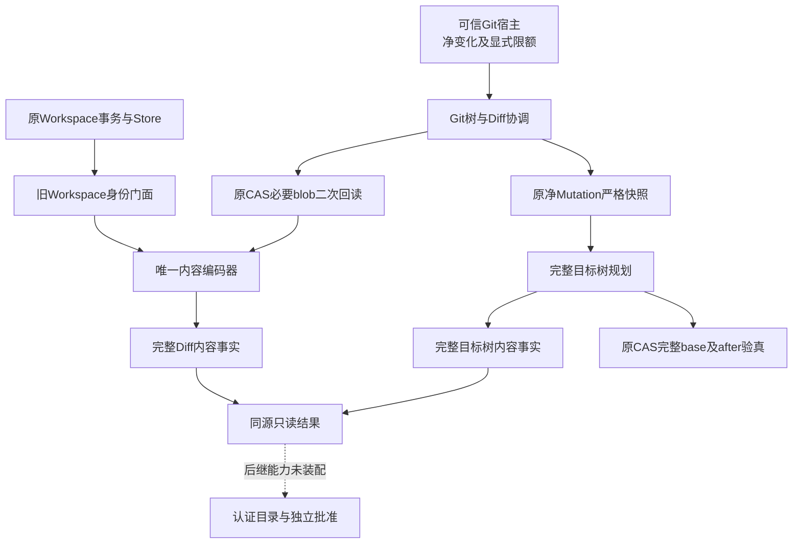
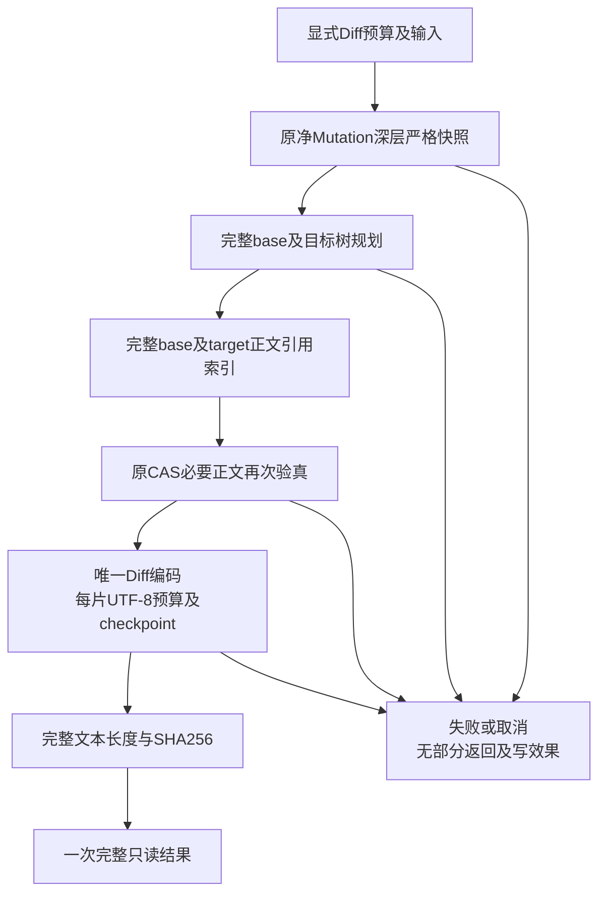
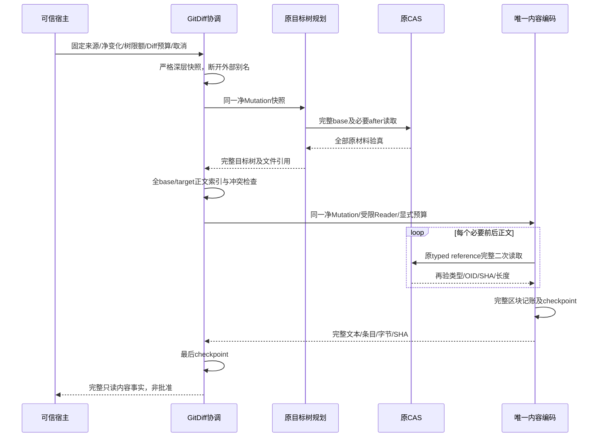
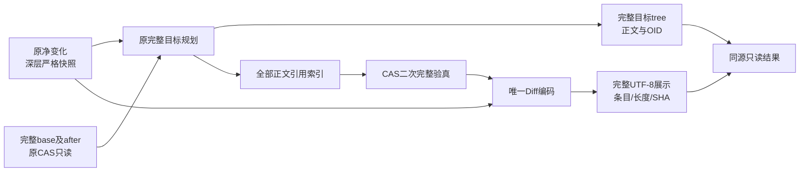

# R4完整Git目标树与Diff同源规划：总体与详细设计

## 1. 需求背景

[完整目标树规划](m09-r4-git-tree-projection.md)已经能从原CAS完整base和末after计算完整目标树。
原[Workspace Diff](../../src/harnessix/delivery/diff.py)则接受Workspace事务计划和Store，携带事务身份。
Git交付若伪造Workspace事务借用该入口，会使内容、实际RootIdentity及事务批准来源混淆；
另写一套Diff又会产生模式、重命名、二进制和字节容量规则漂移。

本变更提取唯一的只读内容编码器：旧Workspace门面保留原内容与身份合同，Git入口绑定完整树规划及同一净Mutation快照。
完整Diff为后继独立批准提供内容事实，**不是批准、认证回执或可执行补丁**。
本切片不开放默认Checkpoint／Commit、不增加数据库表，也不关闭R3/R4或商用发布。

## 2. 设计目标、非目标与不变量

### 2.1 设计目标

1. 同一严格重建的净Mutation同时决定完整目标树与Diff，外部对象别名不能在两阶段之间改变内容。
2. 原CAS完整base／after验真后，Diff正文再次由原CAS读取并核对类型、SHA、长度及Git OID。
3. 新增、删除、修改、模式、空文件、二进制、唯一重命名均提供完整结构化条目和完整展示文本。
4. 完整UTF-8字节逐片计数；超限整体拒绝，不截断、不分页替代、不返回半份结果。
5. 原Workspace接口、事务身份、历史文本、排序及原Document容量校验保持；没有第二套生产Diff算法。
6. 复用原路径、镜像、材料与树容量合同，支持两种Git对象格式及显式两平台路径语义。

### 2.2 非目标

- 不认证Session、Thread、对象业务角色、GitDB完整事件前缀或原批准。
- 不发布Artifact、生成Review ID、批准指纹、写CAS或Git对象、修改Index／工作树／Ref。
- 不实现新备份格式、完整Git历史、自动获取缺失对象、公网Push或产品默认容量。
- 不把自定义`diff --harnessix`审阅文本声明为`git apply`可执行的标准Patch。
- 不给旧同步Workspace函数增加不存在的取消接口，不改变既有历史Review展示。

### 2.3 不变量

| ID | 不变量 | 对应验证 |
| --- | --- | --- |
| GD-1 | 树和Diff同源 | 外层路径及内层mode别名被改动后，返回仍为冻结来源或整体拒绝 |
| GD-2 | 全base先验真 | 未改成员缺失／损坏也失败，不只检查修改文件 |
| GD-3 | 必要正文二次回读 | 规划后CAS篡改被原Reader拒绝，不能消费缓存正文 |
| GD-4 | 无Workspace身份伪造 | 新结果无transaction_id／RootIdentity／旧批准字段 |
| GD-5 | 完整字节预算 | 中文、emoji、模式／rename头及缺尾LF标记计入同一UTF-8总额 |
| GD-6 | 失败无部分返回 | 限额、Reader失败、取消和超时不返回可发布内容 |
| GD-7 | 规划无写效果 | 数据库行、total_changes及全部DB／CAS文件字节读取前后相等 |
| GD-8 | 旧表示逐字节不变 | 独立从d3175f7冻结的golden，旧门面正文／SHA／条目全部相等 |
| GD-9 | 内容不是权限 | 结果类型、SHA及OID均不能替代新批准、Owner或当前来源认证 |

## 3. 总体架构与模块边界



两个门面共用内容编码器，区别只在来源验证、缺尾LF表示版本和身份封装。
Git协调器依赖Delivery已有原CAS及完整树算法，不依赖Agent Loop、Provider、SDK或UI。
虚线不是已装配的产品接口；当前结果没有新的执行权限。

## 4. 源码对应、架构决策与取舍

| 实际职责 | 源码及核心符号 | 设计理由 |
| --- | --- | --- |
| 原事务身份门面 | [diff.py](../../src/harnessix/delivery/diff.py)：`build_workspace_diff` | 原签名与Document保留；不制造Git伪事务 |
| 唯一纯内容算法 | [diff_content.py](../../src/harnessix/delivery/diff_content.py)：`build_diff_content` | 模式、rename、binary、文本及排序规则只有一份生产实现 |
| 完整树与Diff协调 | [git_tree_diff.py](../../src/harnessix/delivery/git_tree_diff.py)：`prepare_git_tree_diff` | 先重建净Mutation，再使用原完整投影与原CAS二次正文读取 |
| 严格Mutation快照及完整投影 | [git_tree_projection.py](../../src/harnessix/delivery/git_tree_projection.py) | 深层重建before／after而非只复制外层引用；原验证器复用 |
| 原CAS验真 | [git_material_cas.py](../../src/harnessix/delivery/git_material_cas.py)：`GitMaterialCAS.read` | 原类型／Git OID／SHA／长度复核，不新增Blob Store |
| 领域条目与共同上限 | [contracts.py](../../src/harnessix/delivery/contracts.py) | 使用原WorkspaceDiffEntry及64MiB原上限，JSON Schema值不变 |
| 旧公开展示调用 | [transaction_action_executor.py](../../src/harnessix/delivery/transaction_action_executor.py)、[workspace_patch_review.py](../../src/harnessix/product_config/workspace_patch_review.py) | 仍由原Workspace门面封装Document，调用方身份语义不变 |

`StringIO`累积完整文本，避免保留全部逐行小字符串；这不是零拷贝流式Artifact，返回仍含完整文本。
统一Diff使用标准库`difflib.unified_diff`生成文本区块，不引入外部Git命令或第三方Diff依赖。
缺尾LF展示新增版本化Git门面，不将修正写入旧Workspace历史表示。

## 5. 领域契约、接口设计与数据结构

### 5.1 唯一内容接口

```python
build_diff_content(
    mutations: tuple[WorkspaceMutation, ...],
    read_blob: Callable[[str], bytes],
    *,
    max_utf8_bytes: int | None,
    checkpoint: Callable[[], None],
    missing_newline_markers: bool = False,
) -> WorkspaceDiffContent
```

内部编码器只消费宿主已验证的净Mutation，不自行赋予路径或读取权限。
`read_blob`以原正文SHA为键；旧门面传入原Store.blob，新门面只允许完整base／target确切材料引用。
`max_utf8_bytes`接受实际int的1～64MiB；bool、int子类及其他类型拒绝。None仅由旧门面使用，保留原Document终校验。
`missing_newline_markers`必须是实际bool；非法参数在Reader调用之前拒绝。
`checkpoint`与Reader异常原样传播，不把取消／超时变成缺文件、空正文或继续信号。

| WorkspaceDiffContent字段 | 业务语义 | 重点约束 |
| --- | --- | --- |
| `entries` | 全部结构化条目，按原路径／目标路径规则排序 | tuple；使用原WorkspaceDiffEntry；repr隐藏 |
| `text` | 完整审阅文本 | UTF-8严格编码；repr隐藏；不是标准可执行Patch |
| `utf8_bytes` | 完整文本UTF-8字节数 | 不是字符数，也不是正文镜像大小 |
| `sha256` | 完整展示文本字节SHA256 | 内容绑定，不是MAC、授权或物理耐久证明 |

`_Output.limit/size/stream`仅属于一次调用：写片前核对完整字节预算，再累积字符串。
`_rename_pairs`保留原唯一候选与已使用目标规则；`_append_change`处理单项前后正文；`_section`仅产出展示区块。
所有结果类frozen/slots，但内容事实仍不构成外部批准票据，不支持直接拼装后执行。

### 5.2 完整Git入口

```python
prepare_git_tree_diff(
    cas: GitMaterialCAS,
    root: GitObjectMaterialReference,
    catalog: tuple[GitObjectMaterialReference, ...],
    mutations: tuple[WorkspaceMutation, ...],
    after_catalog: tuple[GitObjectMaterialReference, ...],
    *,
    platform: PlatformKind,
    limits: GitTreeClosureLimits,
    checkpoint: Callable[[], None],
    max_diff_bytes: int,
) -> GitTreeDiff
```

| 参数／字段 | 含义与失败边界 |
| --- | --- |
| `root/catalog` | 固定base完整材料；没有材料则失败，不访问用户仓库补全 |
| `mutations` | 原完整净变化，先严格深层重建，不能在投影后改读调用者对象 |
| `after_catalog` | 必要末after原CAS blob引用；原完整投影负责核对类型与确切匹配 |
| `platform` | 显式posix/windows原路径规则，不根据本机猜测目标 |
| `limits` | 原四项显式树限额，base、目标及材料并集均受约束 |
| `max_diff_bytes` | 本次完整审阅预算，必须显式提供；不是产品默认容量决策 |
| `GitTreeDiff.projection` | 原完整base／目标及容量事实，repr隐藏 |
| `GitTreeDiff.content` | 同净Mutation产生的完整Diff，repr隐藏 |
| `GitTreeDiff.spec_version` | 固定`harnessix.git-tree-diff/v1`，构造参数不能选择其他版本 |

`references`以正文SHA映射完整blob引用；同SHA却有不同typed reference整体拒绝。
映射来自完整base与目标文件，不接受任意正文SHA作为外部路径读取入口。
返回不携带transaction_id、调用身份、批准ID、MAC或Artifact ID。

## 6. 核心流程、流程图与业务伪代码



1. 无效Diff预算在CAS读取前拒绝；有效声明不豁免原Mutation、路径、树和镜像合同。
2. 在进入完整树／CAS观察阶段前冻结独立净Mutation，内层before／after版本一并重建。
   快照逐项复制前仍执行宿主checkpoint；不承诺在所有宿主回调前完成或形成原子跨项观察。
3. 原Projection仍执行完整重验、全部base/after读取、首before比较及完整目标编码。
4. 建立全部base／target文件正文引用索引；SHA一致但typed reference不同不得择一接受。
5. Renderer每个必要正文只使用原CAS二次读取；规划期间读取成功不证明随后正文仍未被篡改。
6. 原唯一rename展示先生成，其他条目随后处理；结构化条目最终排序，文本顺序保留原规则。
7. 每个区块完整UTF-8字节记账，包括头、模式、rename及缺尾LF标记；限额拒绝时丢弃本次局部缓冲。
8. 末尾checkpoint成功后返回完整内容事实；没有SQL事务提交、外部写入或半份恢复标识。

```text
如果显式Diff上限无效：固定错误，零CAS读取
net = 原验证器严格重建全部净Mutation及内层版本
projection = 原完整目标树规划(cas, base, net, 必要after, 原四限额)
refs = 完整base与目标文件正文引用索引；冲突拒绝
read(SHA): 只接受refs中的原引用，并经原CAS完整回读
content = 唯一编码器(net, read, 显式预算, 原取消, 新缺尾LF表示)
最后checkpoint
返回(完整projection, 完整content, 固定版本)
```

## 7. 时序图与完整文字描述



原CAS与SQLite连接生命周期仍由宿主所有；此入口不跨线程传递连接。
时序中的Reader由协调器闭包实现，Renderer不持有Git仓库路径或CAS写权限。
每次回读必须重新验证当前正文，不通过规划缓存跳过第二次读取。

## 8. 数据流、持久化与事务边界



本变更没有持久化结构、迁移、数据库新表、Git写命令或Artifact发布。
数据流不包含模型新正文、用户Index快照或未登记外部文件读取。
原CAS全部输入事先持久化；规划结果的新tree仍仅在内存，不能把返回成功称为已Checkpoint。
结构化entries保存精确路径及版本；二进制展示只含摘要元数据，完整目标正文仍由原CAS验真，不能据此称文本含二进制Patch。
未来业务认证、独立批准、持久关联和Backup v2必须另行接线；当前内容结果不补签旧历史。

新Git表示仅按LF切分正文，CRLF的CR仍为完整原正文的一部分；孤立CR、U+2028、U+2029不作为文件行边界。
只有真正末行不以LF结束才增加缺尾LF标记。旧Workspace表示继续使用原splitlines行为，避免改写历史Review。

## 9. 失败、取消、超时与恢复语义

| 阶段／错误 | 对外结果 | 副作用及恢复 |
| --- | --- | --- |
| `git_tree_diff_limit_invalid` | 实际int或1～64MiB声明不合法 | CAS前拒绝；修正明确预算后重规划 |
| 原Projection／路径／镜像错误 | 原固定KernelError传播 | 不纠正路径或放宽容量，无部分计划 |
| 原CAS缺失／损坏／引用错误 | 原CAS错误传播 | 不从用户Git补材料，不把坏正文当空文件 |
| `git_tree_diff_invalid` | 完整正文索引缺失或typed reference冲突 | 不择一接受；无写效果 |
| `git_tree_diff_limit` | 完整UTF-8预算超限 | 不返回截断Diff，不声称分页足以批准 |
| Reader异常 | 同一异常实例传播 | 不包成成功或业务重试票据 |
| Turn取消／超时／其他checkpoint异常 | 同一异常实例传播 | 缓冲丢弃，无持久在途状态 |

重试只意味着宿主在当前有效来源及明确预算下重新执行只读规划，不意味着原批准可复用。
checkpoint贯穿rename候选、每项读取、每个展示区块、正文索引及返回边界。
标准库单次Diff计算、一次有界CAS读或hash不是可抢占调度：严格硬期限由上层受控任务负责，
本入口仅提供协作取消边界，不宣称能中断任意单次同步标准库操作。

## 10. 安全、权限与信任边界

- 旧Workspace门面仍依赖原事务来源；内部Renderer不是公开任意SHA读取服务。
- Git端先验全部完整树与首before；只给原base／target确切引用建立Reader，不能扩大为外部文件工具。
- 固定错误不带用户路径、正文、密钥或完整对象集合；text和entries不进入repr。
- 内容SHA、Git OID和dataclass冻结不能证明业务Owner、Lease、Thread归属、MAC或新批准。
- 保留原8MiB单对象／镜像、32MiB净镜像、256Mutation、四项显式树限额及64MiB原Diff上限。
- 不读取凭据、不触发Provider、不调用Docker或外部Git写命令；不使用旧Patch批准执行Git。

## 11. 可观测性、错误分类与容量

当前模块没有新日志或新事件表。可信宿主可记录阶段名、固定错误码、完整字节数、限额和耗时，
不得直接记录text、entries、正文SHA索引或原CAS路径；统计记录也不能代替内容及批准绑定。
唯一rename匹配最坏O(n²)，n受原256Mutation限制；完整目标树及正文引用集合由原四项限额约束。
展示返回需要完整字符串及UTF-8 hash输入，可能同时持有数份有界内容，不宣称恒定内存或零拷贝。
None旧路径仅保留原同步Document校验；新Git路径必须显式逐片限额，不能将None暴露为产品选项。

## 12. 测试、验证与验收矩阵

| 场景 | 真实证据要求 | 对应测试 |
| --- | --- | --- |
| 旧表示不变 | 原Git对象冻结golden逐字节正文、SHA、条目相等 | [test_diff_content.py](../../tests/delivery/test_diff_content.py) |
| 中文／emoji／CRLF／缺尾LF | 字节数及旧表示不变，新标记独立换行 | 同上 |
| 模式、binary、空文件、rename及歧义 | 原条目／模式及展示规则，不臆猜模糊rename | 同上 |
| 容量−1／恰好／+1及非法实际类型 | 逐片UTF-8精确限制，非法参数零Reader | 同上 |
| Reader／取消／超时 | 同实例异常传播，无半份返回 | 同上 |
| 两格式两平台完整目标 | 原真实SQLite CAS、未改／嵌套／空tree／模式，完整树与Diff一致 | [test_git_tree_diff.py](../../tests/delivery/test_git_tree_diff.py) |
| 路径／对象／四限额／原镜像容量 | 复用原拒绝，无mock替代CAS正控 | 同上及原Projection测试 |
| 规划后材料篡改 | 原CAS二次读拒绝 | 同上 |
| 调用者外层／内层别名改动 | 同一净Mutation快照，无树／Diff分歧 | 同上 |
| 无写效果 | DB行、total_changes、全部DB及CAS文件字节冻结比较 | 同上 |
| 唯一实际Wheel源码外验证 | 当前锁定安装输入、双Python、实际模块导入与包字节一致 | [统一验证包](../validation/git-tree-diff-2026-10-01-v1/README.md) |

本文不按测试数量判定商用完成。源代码测试、Wheel验证和Windows原生结果各自绑定候选，不能互相替代。

## 13. 部署、兼容与回退

无新依赖、CLI、公共SDK方法、协议Schema字段、DB迁移或持久数据格式。
旧`build_workspace_diff`签名及WorkspaceDiffDocument容量Schema保持，原安装与历史Review读取不迁移。
新增模块随原唯一Wheel分发；宿主必须显式装配参数，当前默认产品不开放Git写功能。
回退为回退代码包；没有新持久结果须逆迁移，不自动删除原CAS材料或修改任何用户Ref。
POSIX/macOS源码结果不证明Windows消费者环境，双Python源码外也不替代三平台同候选安装验收。

## 14. 风险、取舍与后继边界

1. 自定义文本不是标准可应用Patch；后继批准须同时绑定完整结构化条目、目标树与展示版本。
2. 新结果无业务认证；后继目录／角色与GitDB完整前缀必须先完成，再开放Checkpoint或Commit。
3. 完整Tree/Diff仍缺Artifact发布、新独立批准、双工作树／派生事务桥接、Backup v2及新根重授权。
4. 内部树及Diff预算不冻结产品总容量；不能把调用方任意大限额当作容量实测结果。
5. Windows剩余两项最低SHA256 Commit材料失败及五分钟退出仍需独立原生定位，不能凭本切片清除。
6. R3完整20 Trial、消费者Windows11、独立Beta和同候选R1～R6仍开放。

## 15. 交付证据与源码追踪

[统一验证包](../validation/git-tree-diff-2026-10-01-v1/README.md)提供完整输入目录、源码Hash、
实际单一Wheel与锁定安装输入、测试原件摘要、独立Review Packet、实际渲染图及Manifest。
基线Revision只用于说明研究起点；最终候选以完整源码输入目录及SHA绑定，不用基线冒充新提交身份。
旧d3175f7 CI终态单独记录，不计为本新候选原生通过，不改写旧失败或旧验证包。
