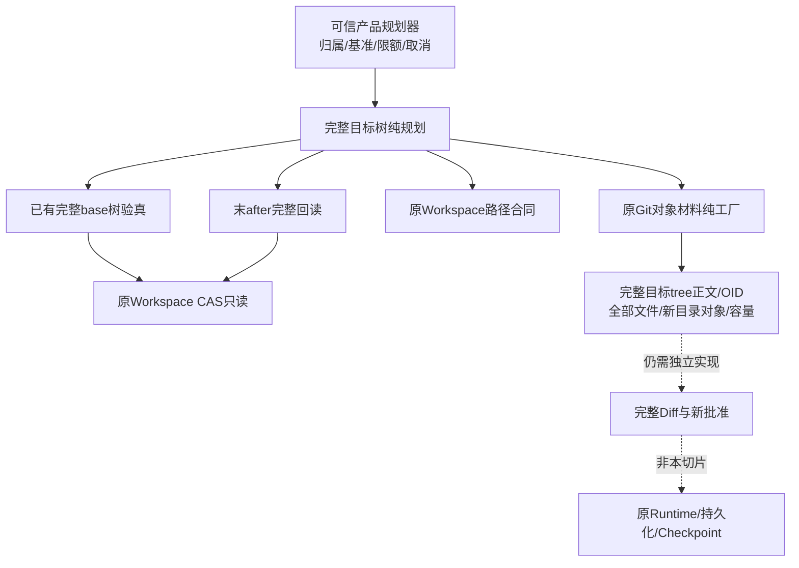
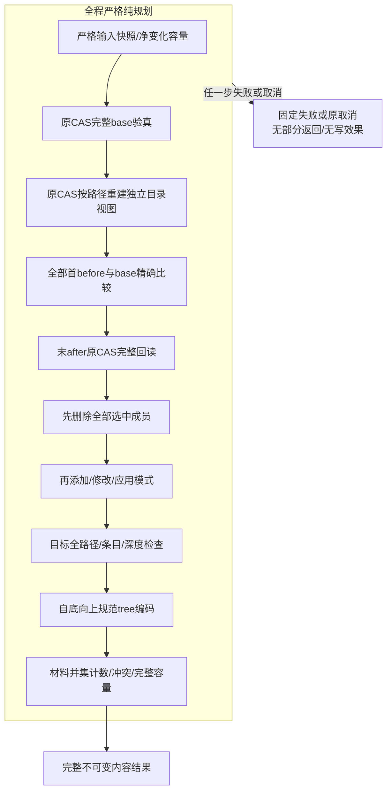
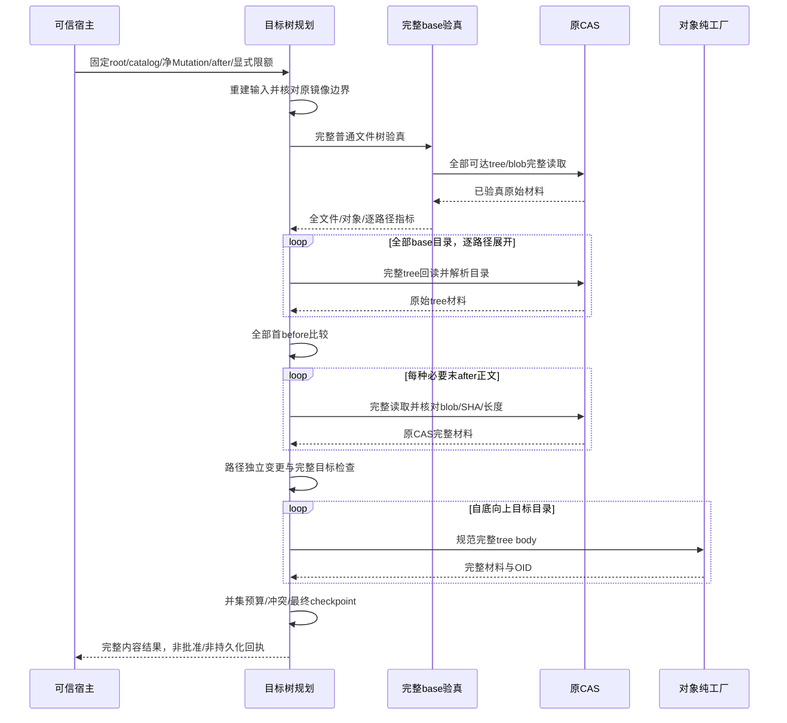
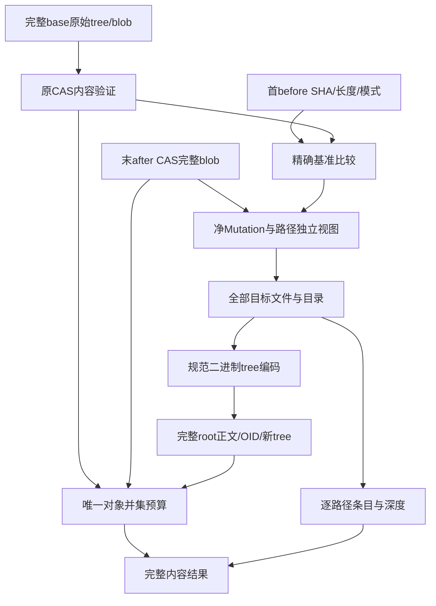

# R4完整目标文件树纯规划：总体与详细设计

## 1. 需求背景

默认产品已能从认证会话中归并持续多个Patch的首before与末after，并固定Git HEAD基准。
后续Checkpoint批准必须预先说明完整目标树，而不是只列出变化文件，或在批准后才让Git决定提交内容。
否则用户Index中的无关暂存、重复子树的错误共享、目录排序和空目录处理，都可能使实际目标超出审阅范围。

[完整树验真](m09-r4-git-tree-closure.md)已经从原CAS证明全部普通文件的正文、模式和路径，
但没有将净Mutation作用于完整base tree，也没有计算目标tree的完整原始正文和OID。
本设计补齐这一纯规划职责，不提前开放Git写入，也不以新的内部参数代替产品容量决策。

**状态边界：** 本文描述基于59e129e新增的实际纯规划实现，内容由最终1244件输入目录绑定。
第15章分别列出源码、安装、审查及最终治理状态；局部通过不关闭完整Git产品工作包。

## 2. 设计目标、非目标与不变量

### 2.1 设计目标

1. 完整base tree加全部净Mutation，确定性计算完整目标普通文件树和原始tree对象。
2. 首before必须与完整base内容、长度和模式一致；末after必须来自原CAS完整回读，不接受模型正文。
3. 保留全部未修改文件、可执行模式及无关空tree；只删除因选中删除而变空的目录。
4. 同OID重复子树按路径独立修改，正文去重不导致另一目录同时发生变化。
5. 规划期间不写CAS、Git对象、Index、工作树、Ref或数据库；缺失、超限、冲突和取消不返回部分计划。
6. 复用原对象材料、路径、Mutation和四项显式预算，避免第二套对象存储或Git执行平台。

### 2.2 非目标

- 不验证Thread归属、Session MAC、对象业务角色或GitDB认证前缀；这些由产品规划器使用前核对。
- 不持久化新对象，不创建工作树，不实施Checkpoint、Commit、Push或历史恢复。
- 不实现链接、gitlink、非UTF-8工作区路径、任意Git对象历史或完整fsck。
- 不从用户当前Index合成目标，不读取未登记的外部材料，不用`hash-object -w`或`write-tree`规划。
- 不默认冻结产品的总对象数、总材料大小、条目或深度上限；四项限额来自可信宿主。

### 2.3 不变量

| ID | 不变量 | 可验证结果 |
| --- | --- | --- |
| TP-1 | 输入先重验 | 原实例构造成功不代表当前字段仍合法；反射篡改或缺字段拒绝 |
| TP-2 | 完整base先验真 | 任何未修改成员缺失或损坏也整体失败，不能只验证触及路径 |
| TP-3 | 首before精确相等 | 存在性、SHA256、完整长度与模式逐字段相等 |
| TP-4 | 末after完整读取 | 类型为blob、同对象格式、原CAS回读及SHA/长度相等 |
| TP-5 | 目标恰好等于净变更 | 无关文件和目录保留；没有输入中的用户暂存内容来源 |
| TP-6 | 路径与对象两种去重分离 | 同OID子树可在多个路径展开，仅指定位置改变 |
| TP-7 | 未改空目录保留 | 不将整个base简单重建为文件列表而丢失原显式空tree |
| TP-8 | 材料与路径容量同时闭合 | base与目标所需材料并集去重计数；目标逐路径条目另计 |
| TP-9 | 规划无外部效果 | 无CAS新增、SQL变更、Git命令或用户文件写入 |
| TP-10 | 内容不是执行权限 | 返回值和OID不能替代批准、当前Owner、Lease或恢复重新授权 |

## 3. 总体架构与模块边界



实线表示纯规划需要的内容和函数依赖；虚线表示尚需后继产品接线的职责，不代表目前已经有批准执行路径。
规划模块置于Delivery，因为它只消费领域Mutation与对象材料，不依赖Agent Loop、UI、Provider或公共SDK。
原CAS实例由宿主传入；规划器不创建Store，不接管连接生命周期，也不生成第二套Blob目录。

## 4. 源码对应、选型理由与取舍

| 职责 | 对应源码 | 设计原因 |
| --- | --- | --- |
| 原对象材料与纯工厂 | [git_object_material.py](../../src/harnessix/delivery/git_object_material.py) | 统一三种类型、两种格式、原8MiB及header/OID算法，避免新编码器另算一套OID |
| 完整base闭包 | [git_tree_closure.py](../../src/harnessix/delivery/git_tree_closure.py) | 复用全部普通文件、重复子树、路径及只读边界 |
| 原tree二进制解释 | [git_object_references.py](../../src/harnessix/delivery/git_object_references.py) | 保留真实basename和目录排序，不使用人类可读Git输出前缀 |
| 新目标纯规划 | [git_tree_projection.py](../../src/harnessix/delivery/git_tree_projection.py) | 净变更、目录重建和并集预算单一职责；不扩大原Git Runtime热点 |
| 原净变更及镜像 | [contracts.py](../../src/harnessix/delivery/contracts.py) | 保持最多256路径、单镜像8MiB及总镜像32MiB，不另定义弱化Mutation |
| 产品来源 | [workspace_patch_source_contracts.py](../../src/harnessix/product_config/workspace_patch_source_contracts.py) | 同会话连续Patch的归并仍在原产品层，不在纯规划内追认归属 |
| Git基准 | [git_baseline_contracts.py](../../src/harnessix/product_config/git_baseline_contracts.py) | 固定HEAD/Index观察与原before；纯树算法不授予基准访问权限 |
| 路径与平台键 | [paths.py](../../src/harnessix/workspace/paths.py) | 不复制Windows大小写、保留名、ADS等规则 |

新的工厂从完整body计算OID，再使用原构造器重验。重复一次有界hash优于新增绕过构造验证的对象路径。
tree必须编码为规范原始二进制对象；不能把JSON、展示Diff或`ls-tree`文本作为持久材料。
目录按每个路径建立独立变更视图；对象正文仍可按OID去重，避免共享可变节点污染其他路径。
迭代遍历及自底向上编码避免把允许深度隐式限制为Python递归深度。

## 5. 领域契约、接口设计、数据结构与重点字段

### 5.1 纯规划入口

```python
prepare_git_tree_projection(
    cas: GitMaterialCAS,
    root: GitObjectMaterialReference,
    catalog: tuple[GitObjectMaterialReference, ...],
    mutations: tuple[WorkspaceMutation, ...],
    after_catalog: tuple[GitObjectMaterialReference, ...],
    *,
    platform: PlatformKind,
    limits: GitTreeClosureLimits,
    checkpoint: Callable[[], None],
) -> GitTreeProjection
```

| 参数 | 语义与拒绝边界 |
| --- | --- |
| `cas` | 原CAS适配，不接受任意读取回调或自定义外部查找器 |
| `root` | 固定base tree的内容引用，不证明它就是当前HEAD |
| `catalog` | base所需对象候选；缺失可达对象不自动读取外部仓库 |
| `mutations` | 全部净变化；实际tuple、规范唯一排序、原镜像容量，不能默默纠正路径或字段 |
| `after_catalog` | 末after确切需要的原CAS blob引用；同内容跨路径可复用，不接受无关额外正文 |
| `platform` | 原`posix`/`windows`路径合同，不从运行宿主自动猜目标平台 |
| `limits` | 四项必须显式；既约束base验真，也约束目标和材料并集 |
| `checkpoint` | 宿主提供取消与期限；不能捕获后转换成可继续的部分成功 |

入口不接受命令行、可执行文件、仓库地址、Secret、分支或正文字符串。
入口先完成净Mutation的规范快照，再进入完整base验真；base与after引用分别在所属读取阶段重建并验证。
无效after引用可能在base观察之后才被拒绝，不能宣称任何无效输入都产生零读取。
所有失败均无写效果或部分返回；返回的dataclass仅是一次内容观察，不能作为复用批准票据。

### 5.2 结果数据结构

| `GitTreeProjection`字段 | 含义 | 重点约束 |
| --- | --- | --- |
| `base` | 已完成的原完整树内容观察 | 不是Session/GitDB认证快照 |
| `root` | 完整目标root tree原始材料 | 有完整body和OID；尚未持久化 |
| `new_trees` | 纯计算的目标目录对象 | 按OID去重；不表示已写入CAS/Git |
| `files` | 全部目标普通文件及模式/材料引用 | 包含未修改文件，不是仅变化清单 |
| `objects_body_bytes` | base、必要after与新tree的唯一OID并集正文总量 | 同OID内容不一致拒绝，不用去重掩盖冲突 |
| `expanded_entries` | 目标树逐路径条目数 | 同子树在两路径出现须分别计数 |
| `tree_depth` | 目标最大目录深度，root为0 | 不等于文件路径字符数或Python栈深度 |

正文、文件路径和完整对象集合不进入默认repr。公开错误只使用固定类别，不打印这些字段。
SHA256、Git OID及CAS摘要分别证明不同内容绑定；均不单独证明物理耐久、业务来源或执行权限。

### 5.3 核心类与函数对应

| 源码符号 | 核心职责／数据 | 对应流程 |
| --- | --- | --- |
| `_version`／`_mutation`／`snapshot_git_tree_mutations`（原`_mutations`） | 实际标量类型、精确字段和原镜像容量；深层重建不可变净Mutation，后继与Diff共用 | 第1步 |
| `_directories` | 复读完整base的原tree，以路径集合保留显式空目录；不共享可变子树节点 | 第2步目录展开 |
| `_before` | 由base文件的SHA／长度／模式构造期望版本，完整比较所有首before | 第3步 |
| `_after` | 精确必要正文键`(SHA256, bytes)`；重新核对每个引用并完整回读 | 第4步 |
| `_apply` | 独立文件字典与目录路径集合；先删除、再加入，触及空目录自底向上裁去 | 第5～6步 |
| `_namespace` | 所有文件及目录的原平台比较键、目标条目与root0深度 | 第7步路径边界 |
| `_Objects` | `references`以OID计唯一材料，`body_bytes`计并集完整正文；同OID不同引用拒绝 | 并集预算贯穿 |
| `_encode`／`_trees` | 先估算单tree大小，自底向上规范编码；`new_trees`仅收录并集此前没有的OID | 第7步目标材料 |

这些辅助函数不是新增公共执行接口。`new_trees`不重复返回已有base材料，目标root仍以完整材料单独返回；
对象内容相同可去重，路径和模式含义不能去重。任何缓存或纯结果都不证明材料已经持久化。

## 6. 核心流程与完整文字描述



1. 输入重验覆盖实际类型、Mutation字段、规范路径及原镜像容量；不信任旧对象的创建时验证。
2. base完整验真先于应用任何变更；随后再次从原CAS回读tree并按路径展开独立目录集合，保证首before检查时已能拒绝目录占用。正文重复读取不赋予新权限，也不更改对象去重容量。
3. 首before按完整文件存在性、SHA、长度、模式比较；不能只比较Git OID或末after。
4. 末after从原CAS完整回读；模式和正文分别应用，同一blob可被不同模式引用。
5. 删除先于新增，最终检查目录/文件祖先冲突；不能把序列中暂时合法视为最终合法。
6. 目录视图保持无关空tree；删除成员触及的空目录递归移除，不做全局空目录清理。
7. 规范编码和并集容量全部成功后才返回；函数内没有外部发布事务，因此没有可恢复的半份目标树。

## 7. 时序图与权限界线



取消与期限checkpoint贯穿有界循环；原异常传播。单次同步CAS回读与hash仍是原8MiB有界工作，
不宣称能在任意操作系统读取指令中瞬时取消。宿主必须等待该有界调用结算再释放原Owner。

## 8. 数据流程与重点算法伪代码



```text
require严格输入、原Mutation容量和显式限额
base = verify_git_tree_closure(原CAS, 固定root, 完整候选)
directories = 从原base按路径完整回读和展开，不能按OID共享可变目录
for mutation in 全部净变化:
    require base首before == mutation.before的存在性/SHA/长度/模式
for 必要after正文:
    require 原CAS完整blob回读 == mutation.after的SHA/长度
    require 所有after引用恰好被需要，不补齐未知对象
先移除全部delete，再应用全部add/modify及模式
只移除被删除触及的空目录；其他空目录和未修改成员保持
require 全目标路径/比较键/条目/深度合法
for directory in 自底向上迭代顺序:
    body = canonical_modes_SP_UTF8_basename_NUL_binary_child_oid
    require body <= 原8MiB
    material = 原对象纯工厂(body)
    require 唯一OID并集无不同类型/正文引用冲突
require 全base/必要after/新tree并集对象数及正文总量在限额内
checkpoint()
return 完整结果  # 不写CAS/SQL/Git/Ref，不返回部分材料
```

## 9. 容量、失败语义与恢复

四项显式限额复用`GitTreeClosureLimits`，不是新的产品默认配额。并集正文包含保留base材料及新增对象，
不能只计算变化文件或每个tree分别通过后忽略总量。目标条目按路径展开，与唯一对象数不是同一指标。
每Mutation镜像及总镜像仍适用原8MiB/32MiB；容量变更需另行产品决策和整链验收。

| 失败类别 | 行为 | 禁止行为 |
| --- | --- | --- |
| 输入实际类型/字段损坏 | 按使用阶段重验并固定拒绝，具体顺序见第6章 | 隐式类型转换、补字段、修复规范路径 |
| 完整base缺失/损坏 | 原完整验真失败 | 忽略未修改成员或从外部自动拉取 |
| 首before不符 | 拒绝整个规划 | 用末after覆盖、猜测当前基准 |
| 末after缺失/不符 | 拒绝整个规划 | 将模型字符串、输出前缀当完整正文 |
| 目录/文件/平台冲突 | 全目标失败 | 静默覆盖另一比较键或无关子树 |
| 对象冲突/容量超限 | 无完整结果 | 裁剪材料、提高默认额度或清除旧历史 |
| 取消/期限 | 原checkpoint异常传播 | 部分成功、吞异常继续下一路径 |

该模块没有持久状态迁移。进程崩溃只丢弃内存规划结果；后续是否允许重新规划，由新宿主调用、
当前基准和原取消/Owner规则决定，不能从没有写效果推导旧批准自动有效。

## 10. 安全、可观测性与部署兼容

内部错误信息保持固定简体中文，不包括文件正文、路径、作者、消息或CAS材料。
观测可输出已验证的类型、计数及限额类别；不把未验证输入OID作为可信诊断身份。
Windows只复用原路径合同；本机双Python测试不等于Windows原生验收，不能宣称额外Unicode规范化保证。

无新依赖、Schema、数据库、CLI、Provider能力或安装步骤。新源码与测试输入须单独冻结，
实际发行Wheel及源码外导入需与该候选逐字节绑定，不能继承上一Wheel含有新模块的结论。
上层默认写入口继续关闭；必须完成[Git业务闭包设计](m09-r4-git-delivery-business-backup-closure.md)
中的完整Diff、新批准、业务认证目录、GitDB及Backup v2后，才能开放产品功能。

## 11. 完整测试矩阵

| ID | 场景 | 预期 |
| --- | --- | --- |
| O01 | 三对象类型、两格式、空/二进制/8MiB body | 工厂与真实Git原始hash结果相等，body完整 |
| O02 | 非真实bytes/type/format、超限、异常cls | 固定失败，无绕过原构造器 |
| P01 | 三操作、模式变化、多层目录、两格式 | 全部目标文件/OID与实际Git mktree差分一致 |
| P02 | 完整未修改成员、重复子树只改一处 | 另一目录与全部无关成员保持 |
| P03 | 无关显式空tree、删除触及目录变空 | 前者保留，后者递归移除 |
| P04 | before存在性/SHA/长度/模式任一错 | 整体拒绝，无自动基准修复 |
| P05 | after类型/格式/正文/长度/重复/无关引用错 | 整体拒绝，不能省略完整回读 |
| P06 | 路径非规范、平台比较键、祖先文件冲突 | 原合同失败，无静默覆盖 |
| P07 | 原镜像和四预算的精确边界/少1/实际类型错 | 精确接受或拒绝，预算按正确粒度 |
| P08 | frozen反射/model_construct产生的不合规字段、缺字段、合法外观标量子类 | 实际入口重验拒绝；不从完全等价的合法字段推断构造来源 |
| P09 | 各阶段checkpoint取消或期限 | 原异常，无部分结果或写效果 |
| P10 | 原CAS只读全文件/元数据/SQL观察 | 区间内字节、inode、mtime和行数据不变 |
| P11 | 已有材料、C2验真与产品来源关联 | 原8MiB、只读、Owner及来源安全不退化 |
| P12 | 实际安装与Windows原生 | 各自固定候选证据，不继承其他平台通过 |

真实Git只用于测试差分，不是生产规划器的命令依赖。观察区间必须在夹具必要首次SQLite查询之后建立，
仍包含WAL/SHM，避免把夹具初始化误计为规划写入或忽略真实变更。

## 12. 图示与验收材料

本设计包含总体架构、流程、时序和数据流的完整文字说明。发布前须实际渲染并逐张视觉检查图，
不能用Mermaid块存在替代渲染结果。统一验证包须含正式报告、Facts、Verification、Review Packet及Manifest；
原FAIL/后继PASS、函数/关联/治理/实际Wheel/原生环境分别绑定，集合重叠不相加。

四幅图使用既有Mermaid CLI 11.6.0和Chrome实际渲染，已逐张查看最终PNG。
首版架构标签的字面换行和横向数据流版式已改为正式换行及纵向版式；不把图示检查当作功能验收。

| 图示 | 实际尺寸 | 渲染与视觉检查 |
| --- | --- | --- |
| [总体架构](../validation/git-tree-projection-2026-10-01-v1/diagrams/architecture.png) | 998×710 | 中文字形、模块边界及后继虚线完整 |
| [核心流程](../validation/git-tree-projection-2026-10-01-v1/diagrams/flow.png) | 633×1280 | 全程失败边界、主链和完整返回可读 |
| [调用时序](../validation/git-tree-projection-2026-10-01-v1/diagrams/sequence.png) | 1363×1326 | 参与者、CAS回读及目录循环完整 |
| [数据流](../validation/git-tree-projection-2026-10-01-v1/diagrams/dataflow.png) | 658×902 | 正文、基准、目标与两种容量粒度明确 |

## 13. 产品接线、兼容性与后继职责

产品规划器使用本算法前，必须验证原Thread成功Patch链及当前固定HEAD/Index，收集完整受信材料。
使用结果后，必须生成完整Diff，将完整base/target、净Mutation、材料范围、限额及具体效果加入新批准指纹。
持久化、业务目录MAC、双工作树、新派生事务与Checkpoint/Commit执行继续沿原Runtime实现，
不得因纯算法返回OID就绕过这些职责，也不得将此切片宣布为完整Git产品或商用1.0。

### 13.1 真实Git差分夹具的运行版本与失败边界

原CI 36806972653的macOS和两个Linux Python任务各有四项setup错误：
夹具将实际`git version 2.55.0`与研究版本`2.53.0`作精确字符串比较，导致真正对象差分尚未执行。
原Windows首步骤独立达到三分钟期限；它不是上述版本断言失败的同一根因。

格式研究仍固定Git v2.53.0，运行夹具只使用当前PATH唯一Git，不包含维护者机器绝对路径。
`native_repo`校验可执行文件存在，保留隔离HOME、禁用全局/系统配置、禁用交互和自动fetch，
并在JUnit的testsuite属性记录实际版本。全部原SHA-1/SHA-256的`init`、`mktree`、
`hash-object`、`cat-file`、`ls-tree`及`commit-tree`差分继续实际执行；不支持的命令、
非零退出或20秒超时仍失败，不转换为skip，不只靠版本声明推断功能。
四项新增回归验证2.53、2.55、Windows版本后缀的PATH选择/记录及缺失Git的明确拒绝。
这些夹具回归是合成负对照，不证明相应消费者平台已通过真实编码。

官方命令接口以[git-init](https://git-scm.com/docs/git-init)和
[git-mktree](https://git-scm.com/docs/git-mktree)为依据；官方支持对象格式的说明不是本项目验收证据。
原完整输入及关联结果保留，新目录只更改此测试文件，C3生产模块和既有业务限制字节不变。

## 14. 风险、维护与评审检查清单

- 查找重复hash/路径实现、递归遍历、共享可变子树及输出前缀构造。
- 核对所有未改成员和空目录的保留，正文去重与模式/路径含义的分离。
- 核对并集容量及目标逐路径容量，取消和固定公开失败是否完整覆盖。
- 核对没有CAS持久化、SQL写入、Git命令、网络、用户Index或Ref操作。
- 新API、结果字段及错误码必须与最终源码一致；不能把规划名称当成已有公共接口。

## 15. 实施与验证状态

新增工厂41项、投影116项共157通过；初始旧关联796通过，两个集合与后继最终关联有重叠。
最终完整关联1868项为1810通过/58跳过；另一个原基准及产品来源/SDK组99通过。
逐案例身份比较无交集，最终源码联合1967项、1909通过/58跳过。不得把其他重叠结果相加。

原输入目录1244件SHA256为`8863ee5e6446c6f5763b4bf710560122e9058de9c2eca6d19e39fb7d52124799`；
最终1244件目录为`7dacd4ba2d587b0c050b81487cf11cd9c88d20a4d2a376cddee5f643b33730dd`。
唯一差异是第13.1节的测试夹具；C3两个生产模块及两个新增测试字节不变，最终关联组重新执行。

单次构建Wheel SHA256：`8d83e63a149481d87fd2812fdf45db479094c09b3babd9368d12448fa37f58a7`。
470个成员中的465个包成员/424个Python模块与源码和两次源码外安装逐字节一致，RECORD全量验证。
源码外Python3.12/3.13各1133项、1131通过/2个Windows数据访问守卫跳过；实际导入审计无源码回退。
构建前/后、每个解释器完成后与终态完整1244件输入复读一致；两个解释器不等于两个消费者OS。

独立静态评审未发现P0/P1/P2，审查者函数测试0，核对局部实际21件和两生产源码SHA；
追加版本夹具审查独立核对全部原差分和隔离配置。局部目录不是全仓或发行物验收。
原夹具排序错误、四项真实标量子类缺陷、规范语义标题缺失、版本断言CI失败、
JUnit属性警告和Worker目录文字错误均保留，根因与修正分别登记于[统一验证包](../validation/git-tree-projection-2026-10-01-v1/README.md)。

| 项目 | 实际状态 | 关闭证据 |
| --- | --- | --- |
| 对象纯工厂/完整目标算法 | 新焦点157通过，静态评审未见P0/P1/P2 | 工厂41项/投影116项；审查者0函数测试 |
| 原材料/C2/产品来源关联 | 最终联合1909通过/58跳过 | 两组1967案例，无交集 |
| 静态及规范 | 通过 | Ruff/Format、424模块Mypy、原可读性/Schema政策不变 |
| 原治理/Secret/文档 | 通过 | 治理302项；实际Wheel/仓库3947输入零命中；442文档零问题 |
| 单Wheel/源码外安装 | 两Python各1131通过/2跳过 | 465包成员、全部RECORD及实际导入审计 |
| 图示 | 四幅渲染及视觉检查通过 | 流程/时序按实际目录回读顺序重新渲染 |
| Windows消费者/真实质量/Beta | 未关闭 | 原R3/R4/R5各自完整证据 |

研究基线59e129e不包含新增实现；具体实现归属由最终输入摘要及包含本设计的提交确定。
本切片不证明业务授权、持久化完成或完整Git产品交付，不发布新的R3成绩。

## 16. 后继共享快照入口

[完整树与Diff同源规划](m09-r4-git-tree-diff.md)将原`_mutations`严格验证器命名为
`snapshot_git_tree_mutations`，完整投影继续使用同一原验证逻辑；增加入口callable/platform显式拒绝。
GitDiff先深层重建独立快照，投影与内容编码两阶段均消费这一净变化，避免外部before/after别名漂移。
原目标编码、原四限额及镜像容量没有放宽。初始59e129e的测试与制品证据仍仅属于原候选；
后继实际源码、八项失败与修复对照由[新统一验证包](../validation/git-tree-diff-2026-10-01-v1/README.md)绑定。
