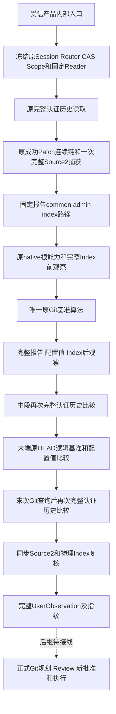
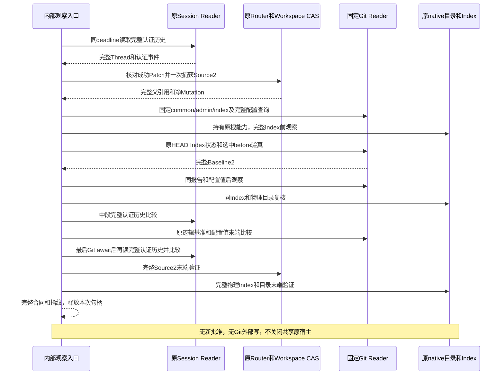
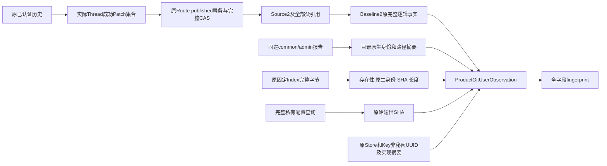
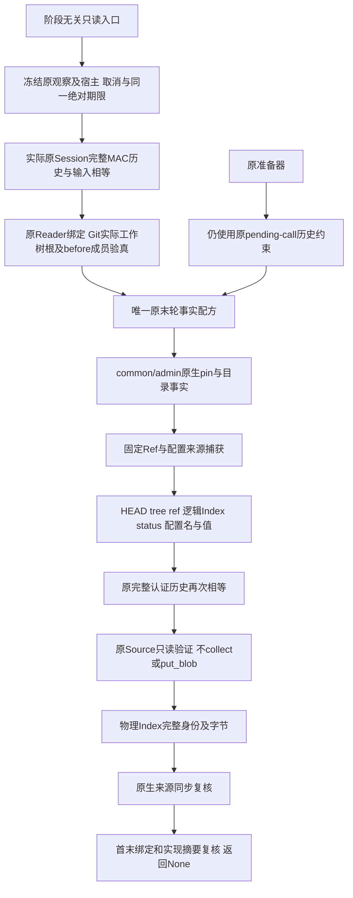
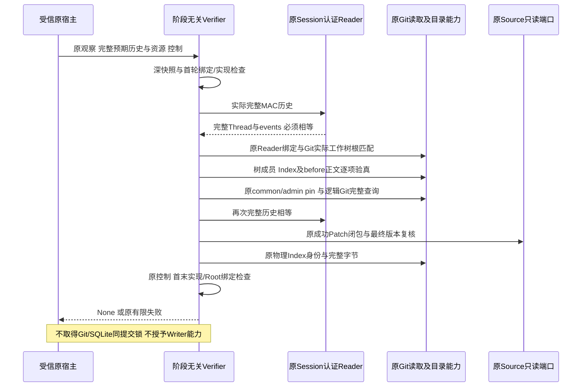

# 原认证会话到用户 Git 完整只读观察详细设计

## 1. 需求背景、目标与范围

Coding Agent 已在用户工作区 U 发布 Patch，此时 U 正常包含修改。原
`GitRepositoryBinding` 由领域 Runtime 从干净来源生成，承担后续私有锚 A 的正式准入。
把脏 U 直接交给该合同会被拒绝；允许其接受脏状态，则破坏 A 的生命周期与原安全约束。

原产品 Git 基准已能从成功 Patch 连续链核验首 before、最终 after、完整 HEAD/tree/ref、
逻辑 Index、status 和配置名称，但不单独持有 common/admin 原生目录能力，也未绑定
物理 Index 完整字节及完整配置值观察。普通 Thread 数据外形不是认证会话权威。

本变更新增独立的用户观察入口：借原 Session 认证历史、原 Router/事务/CAS 和原 Scope，
只捕获一次完整 Source2，复用唯一原基准算法，并对物理目录、Index、配置值与实际
会话历史建立完整前后观察窗口。它不创建或修改 Git 对象、Index、Ref、工作文件和工作树。

### 1.1 设计目标

- 在原认证会话与成功Patch链上取得完整Source2，不扩大旧干净仓库准入。
- 捕获实际U的完整逻辑、物理Index、目录及配置值事实，发现操作期间漂移即拒绝。
- 共同取消、期限与原生句柄生命周期可验证；原写效果与执行权始终独立。

### 1.2 已实现与未完成范围

| 当前实现 | 非本组件已完成范围 |
|---|---|
| 原 Session 完整认证 Reader 前后重放一致性核验 | 默认 Git Tool Catalog、正式 Planner/Executor |
| 同一实际 Session/Router/CAS/Scope 和固定读配方 | 新 Git Review 正文 producer、ProductLink 与 NativeBridge |
| 完整 Source2 一次捕获与原基准算法复用 | 新 A、prepared T2、D 物化和独立批准的 Commit |
| common/admin 目录能力、固定 Index 全文摘要和身份 | Git 业务备份、恢复重绑及跨库成功效果闭包 |
| 原逻辑基准、完整配置值及来源的末端复核 | 三平台原生业务、真实模型编码质量与商业 1.0 |

新 `ProductGitUserObservation` 是版本化完整数据合同，不是 MAC 或批准证明。原 Core1
没有该完整用户观察字段，不以旧 `config_names_sha256` 偷换成配置值摘要，不用另一字段
隐蔽承载观察指纹。后继正式规划必须显式绑定完整新观察代际，旧 Core1 字节仍兼容。

## 2. 源码研究、架构决策与取舍

### 2.1 原实现证据

| 原源码 | 实际职责与复用方式 |
|---|---|
| [认证历史 Reader](../../src/harnessix/session/sqlite_history.py) `read_authenticated_thread_history` | 同只读事务验证 Header、完整认证事件及 Thread 重放；认证数据外形自身不签发权限 |
| [Patch 来源](../../src/harnessix/product_config/workspace_patch_source.py) `completed_workspace_patches/load_owned_workspace_patch` | 同 Thread 成功 Call/Result、Route 与 published 原事务交叉核验 |
| [来源捕获](../../src/harnessix/product_config/git_delivery_source.py) `collect_git_delivery_source` | 持久结果顺序、连续链、根身份、净零路径和全部最终版本；完整父 Manifest/Chunk 保持 |
| [基准算法](../../src/harnessix/product_config/git_baseline.py) `_observe/_member` | 固定有限命令、严格输出、选中 Index 冲突与完整逻辑基准；不暂存或提交 |
| [原生根](../../src/harnessix/workspace/snapshot.py) `_open_native` | POSIX FD 链与 Windows 原句柄链；固定 index 不另写 no-follow 算法 |
| [干净仓库配方](../../src/harnessix/delivery/git_repository_recipe.py) `repository_binding_recipe` | 原 dirty 拒绝及 A 准入保持，不能借新 U 观察绕过 |

### 2.2 关键决策

1. 将 U 的用户观察与 A 的干净绑定分离，不扩大旧 Runtime 合同。
2. 只接受原 `SQLiteSessionStore`，不接受外部认证回调。先读取实际已认证历史，使用返回
   Thread 收集来源；输入 Thread 必须完整相等，操作末端再读认证历史，变化则拒绝。
3. Session、Router stores、事务 CAS、固定路径和原 `SecretPublicationScope` 共同冻结。
   同地址 Store、同字节 Scope 或可替换 Publication 均不是本次原能力。
4. 提取原 `_collect_baseline_from_source`，旧公开入口先收集一次来源再调用该唯一算法。
   新观察入口也只收集一次来源，不先重复生成 Source 再重新调用旧公开函数。
5. 新入口明确要求实际 Source2/Baseline2 和原 CAS；旧公开入口保留 Source1 兼容语义。
   不改版本号伪装，不重捕获缺失旧历史，也不让新入口降级。
6. 全阶段共用原 `GitOperationBudget`、原 Session Reader deadline、调用方 checkpoint
   和取消；取更短的原 60 秒基准期限，不能逐命令或阶段重新分配预算。
7. 配置绑定完整固定查询输出的原始 SHA（origin/name/value），不持久化值正文；名称摘要
   仍保持其旧语义。物理 Index 只保存完整内容 SHA、原生身份、存在性和长度，不复制用户 Index。

## 3. 总体架构、核心流程与数据流



图中最后一条为待接线依赖，不能解释成当前已执行 Git 写。观察窗口只提供已核验的
顺序事实，不承诺在非合作外部 Git 命令下形成跨数据库和文件系统原子快照。
后续原 Router 实际捕获及批准后原生验证仍必需。

### 3.1 时序图



### 3.2 数据流程图



原配置值、Index 正文和目录文本不进入输出合同或诊断日志。私有正文必须完整、未截断且
与raw统计等长同摘要。POSIX不据此声称已脱敏，Windows原脱敏流不等于raw时拒绝。

## 4. 模块、类与接口设计

| 文件与重点符号 | 单一职责 |
|---|---|
| [入口](../../src/harnessix/product_config/git_user_observation.py) `collect_product_git_user_observation` | 原控制与宿主冻结、托管异步操作和有限错误边界 |
| 同文件 `_collect` | 实际认证历史、唯一来源捕获及Source2准入 |
| 同文件 `_observe_user_baseline` | 原完整逻辑基准被物理观察包围，完整末端复核 |
| [宿主检查](../../src/harnessix/product_config/git_user_authority.py) `require_git_user_authority` | 原实际对象与路径冻结，返回同次可复核检查点 |
| [路径与能力](../../src/harnessix/product_config/git_user_observation_paths.py) `reported_git_path/PinnedGitUserDirectories` | 规范固定报告、原native能力、Index完整读与目录复核 |
| [正式合同](../../src/harnessix/product_config/git_user_observation_contracts.py) `ProductGitUserObservation` | 完整新代际数据和全字段指纹，无执行效果字段 |
| [原基准](../../src/harnessix/product_config/git_baseline.py) `_collect_baseline_from_source` | 旧、新两入口的唯一原算法，不重复来源捕获 |

入口参数为原 Thread、显式唯一 Patch UUID 集合、原 Router/transactions/reader，以及原
session、cancel、budget、checkpoint、snapshot_ports。完整观察值作为返回值；没有命令、
环境、任意 Index 路径、Policy 或批准参数。API仅供受信装配调用，不新增模型工具 Schema。

## 5. 数据结构与重点字段

| 字段 | 解释与拒绝边界 |
|---|---|
| `spec_version` | 独立用户观察v1，不改变旧RepositoryBinding/Core合同 |
| `store_id/key_id` | 原认证Publication的非秘密逻辑身份；不包含Key字节或MAC签发能力 |
| `baseline` | 必须完整Baseline2，包含实际Source2/全部父引用/全部净Mutation及原逻辑基准 |
| `common_directory_path_sha256/identity` | 原报告对应commonDir固定路径摘要和真实物理身份 |
| `git_directory_path_sha256/identity` | 当前U实际admin目录，不猜测它一定等于commonDir；支持linked工作树布局 |
| `index_file_observation` | 原有限Index合同，`absent`字段配对或完整file原生身份/SHA/size；不得导出正文 |
| `config_sha256` | 完整固定配置查询私有原始输出SHA，不是旧配置名称摘要，也不是原配置文件字节镜像 |
| `implementation_digest` | 七个产品层文件的配方摘要，不独立证明Session/native依赖实现身份 |
| `fingerprint` | 原canonical算法覆盖全部上述字段，仅排除自身指纹；不证明归属、批准或未来状态 |

原事务数1～256、Snapshot资源256、单文件/Index 8MiB、镜像32MiB、Core记录512KiB、
Native18/27 selectors/13 Hooks及原命令期限保持不变。新观察正文不能代替原受认证业务记录。

## 6. 核心业务伪代码

```text
冻结真实 Session/Publication/Scope/Router stores/CAS/Reader配方
固定共同 deadline = min(原操作绝对期限, 开始时间 + 原基准60秒)
每检查点同时消费 cancel、原budget、原caller checkpoint 和共同宿主身份
托管子操作:
  history = 原完整认证Reader(thread_id)
  要求输入完整Thread == history.thread
  source = 从实际history.thread选择原成功Patch，核对Route和published事务
  要求实际Source2并只捕获一次，禁止历史修复或降级
  核对Reader实际根 == 原Source2根
  路径仅取固定原Git完整报告，index必须等于admin/index
  持有原native common/admin根能力
    记录完整物理Index及完整私有配置输出SHA
    baseline = 原唯一基准算法(source, 同checkpoint与deadline)
    复核目录、报告、完整Index、完整配置值和实现
    中段再次原完整认证history比较
    末端比较原完整逻辑基准及完整配置值
    要求末次异步Git查询后再次原完整认证history完全相同
    再同步验证全部Source2与完整物理Index
    构造完整新合同，原全字段算法生成fingerprint
    最后消费同检查点，关闭仅本次句柄
  返回完整数据；不能登记成功、批准或Git效果
```

## 7. 取消、期限、失败、恢复与可观测性

父 Task 取消先交付，等待和CPU检查共用原parent取消检查器。托管子任务必须先回收，
才能向上层传播取消或超时；不得继续后台命令。原清理失败的优先级保持不变；
正常回收后实际调用方检查点异常保持原对象，
原生IO/基准错误转换只通过原 `UpstreamCheckpointError` 隔离控制来源，不能按码或类型
猜测其来源。原控制与宿主对象不被临时覆盖。

| 失败 | 当前语义与恢复要求 |
|---|---|
| 原Session证明缺失、损坏或Owner/Scope关闭 | 原认证Reader失败关闭，不补签、不重建历史 |
| 同地址或同字节宿主替身 | `git_user_observation_host_invalid`，无新观察结果 |
| 输入Thread或操作期间完整历史变化 | `git_user_observation_history_changed`，新调用重新规划 |
| 旧Source1或缺少完整CAS | 明确拒绝完整历史不可用，不降级 |
| common/admin/index报告畸形或链接 | 固定路径/原native错误，不输出路径和原始正文 |
| HEAD/Index/config值/来源/实现漂移 | 原基准或 `git_user_observation_changed`，不自动修复或沿用旧观察 |
| 原期限耗尽或等待超时 | 有限超时分类；保持更短原期限，不重试、不续预算 |
| 普通IO/完整输出不可用 | 有限读取错误；不公开第三方异常正文 |

允许原CAS为完整父历史追加内容，这是来源材料持久化，不是Git写或业务成功事件。
此API不保存新的Git业务记录，失败不产生可继续执行的观察。重开产品必须再次认证、
观察当前U及其实际绑定，不能从普通JSON数据恢复批准或复用旧句柄。后续完整业务恢复
必须消费原持久计划、认证Link及新批准，而不是重算旧意图。

完整认证历史读取采用初始、中段、末段三次交叉核验：中段变化后的HEAD或配置值
由末轮Git查询发现，末轮Git期间追加的认证事件由最后history发现。
最后认证历史读取后没有异步Git查询；同步Source2与Index核验结束后才返回。外部进程
仍可在最后观察之后修改Git，SQLite与文件系统之间也没有原子事务；后续执行必须重新
核验实际状态，不能把观察值当作不可变锁或批准。

配置正文仅用于私有固定命令观察。POSIX原Git读取端口不消费output_redaction，
`full_stdout()`只证明正文完整且与raw统计一致，不证明已脱敏；Windows原端口脱敏后
与raw不等则原完整性检查拒绝。新观察两平台均不返回、持久化或记录配置正文。

根身份验证使用原`capture_snapshot_facts`，目录逐项检查共同deadline和取消；不更改
原Native18。实现摘要仅覆盖七个产品层文件，全安装包的依赖一致性另由安装验证证明。

不新增携带代码、Index、配置或凭据的日志；保留固定测试结果、源码哈希、完整工具结果
和失败记录。离线ScriptedProvider只产生测试调用，实际认证Session/SDK/Patch链是集成
证据，不证明真实LLM编码质量、生产用户批准或商用发布。

## 8. 安全、部署与兼容性

不新增数据库、服务、网络、Keychain访问、安装渠道、迁移或Scope授权。原Root/Owner/
Scope/MAC/Lease边界保持；持有目录句柄不是对非合作用户Git命令的全局锁。
POSIX原FD链和Windows原逐段句柄链复用；在macOS执行逻辑Windows模型不构成原生验收。

旧公开基准和Source1/Baseline1兼容测试必须通过。原干净A绑定仍拒绝实际脏来源；新U
观察既不生产GitRepositoryBinding，也不直接调用领域创建/提交入口。代码回退不需要
回滚用户HEAD、Index、Ref或文件；原CAS新增无授权材料不能解释成效果或擅自删除。

## 9. 完整测试与验收要求

覆盖实际认证SDK成功Patch、连续多个Patch、原Stores重开、SHA1/SHA256、深父历史与
Source2全字段；保留无关已暂存/未暂存/未跟踪内容，完整Index/HEAD/Ref/工作文件不变。
同时覆盖坏宿主/旧Source/外传伪Thread、认证历史漂移、等字节Scope替身、取消/期限/回收、
Index身份/字节/common/admin/配置值/HEAD/来源漂移、链接/硬链接/特殊文件/超限和固定错误。
原基准、Source2、Session认证、保护输出、Native18及治理回归必须沿原参数运行。

验收报告需保存同候选安装包、真实导入位置、全部输入哈希、失败及修复后证据、图像、
完整Review Packet和制品清单；不得以单个绿测替代实际产品写闭环。

三次交叉读取仍存在最后H3读取期间或其后的HEAD/config独立变化窗口；它不是
跨库原子快照，不能仅凭观察值发布Git效果。后续实际执行必须重新核验当前
HEAD、配置、来源和物理Index，并按原失效语义拒绝陈旧计划。


## 10. 阶段无关的原观察只读复核

### 10.1 需求与总体方案

审批决定后的原历史不再满足准备器的pending-call条件；不能调用准备器私有`_history`追认决定，也不能重新collect来源、写CAS或刷新旧意图。新增`verify_product_git_user_observation`借用实际原Session认证完整当前历史，复核既有完整U观察，并返回`None`；不生成新观察、MAC、Route、审批、执行权或Git效果。

准备器末段与该入口共同复用`_verify_observed_git_state`。其源码位于 `git_user_observation.py`，新增 `git_user_source_files.py` 与 `git_user_source_scope.py` 也纳入实现摘要，形成九文件配方。准备器的原四文件摘要不是七文件摘要替代物，二者用途不变。



共享配方只接受两个内部绑定的语义closure，分别直接await原历史检查和同步执行原Source检查。它们由两个正式入口内部创建，不是新的对外回调API；不导入准备器形成反向依赖，也不创建后台Source任务。

### 10.2 正式内部接口与字段

```python
async def verify_product_git_user_observation(
    expected: ProductGitUserObservation,
    history: AuthenticatedThreadHistory,
    router: TrustedActionRouter,
    transactions: SQLiteWorkspaceTransactionStore,
    reader: GitReadRuntime,
    *,
    session: SQLiteSessionStore,
    cancel: CancelToken,
    budget: GitOperationBudget,
    checkpoint: Callable[[], None],
    snapshot_ports: WorkspaceSnapshotPorts,
    source_scope: GitUserSourceScope | None = None,
) -> None: ...
```

必须显式传入原`session`，否则不能重读并认证完整历史；`AuthenticatedThreadHistory`只有Thread与events，不持有Session连接。传入`transactions`而非自由Core声明，与原collect入口一致；调用方从同一原CoreStore取其store，仍由实际Session/Router/Ports共同绑定。

| 字段/资源 | 含义与拒绝边界 |
|---|---|
| `expected` | 原完整观察深快照，保留所有字段/基准/Source2/指纹；不重建缺失材料 |
| `history` | 普通数据预期，必须与本次实际原认证Reader完整结果相等；外形不构成证明 |
| `session` | 唯一实际认证读取来源；非原类型、Publication/Scope替换或错误固定路径拒绝 |
| `router/transactions/reader/ports` | 同原活跃资源、固定读取配方与Root，不能用同地址或等字节替身 |
| `cancel/budget/checkpoint` | 同次取消与原绝对期限；每命令不续期，回调正常返回后也复核停止和宿主 |
| `baseline.reader_binding/members` | 与原Reader合同、原HEAD树成员逐项一致，完整读取原before正文及Index阶段/flags；公开摘要可重算不构成真实性 |
| `implementation_digest` | 首末重新读原九文件，与冻结的原预期摘要比较；不是仅比较本次首末相等 |
| 返回`None` | 仅表示本次可观察复核未失败；不签发可执行事实，不承诺返回之后仍未变化 |

私有可选 `source_scope` 由原消费者拥有；逻辑 Git 末轮前捕获固定 Ref／配置来源，U 复核后登记并延续至消费者同步终端。
未传入时使用局部资源 Scope，返回值仍为 `None`；资源、来源成员与完整 B4 边界见[原生来源复核](m09-r4-git-terminal-source-files.md)。

### 10.3 顺序、时序与伪代码



```text
保留父Task入口取消交付
严格校验控制和原宿主，冻结原观察的完整模型
固定更短的原60秒上限与输入budget绝对期限
从原Session认证完整历史；必须与输入history完全相等
原Reader实现/绑定与冻结基准一致；原生Root与Git实际--show-toplevel均属于原U
复用原读取端口拒绝危险Git helper配置，不缓存此结论
逐项复用原_member算法：HEAD树对象、原before正文、Index阶段/flags一致
成员查询结束后原Reader合同仍相等
在原目录pin生命周期内：
    原目录facts相等
    原完整逻辑Git和完整配置值相等
    原完整认证历史再次相等
    原Source只读核验，不collect、不写CAS
    原物理Index身份和字节相等
    原控制成功
撤销目录能力，末轮绑定及原九文件摘要仍等于预期
正常结束返回None；失败保留原数据与原异常来源
```

准备器仍把原`_history`及原Source导入site封装为私有closure传入，保留`ToolExecutionScope.for_pending_call`、事实/Index不匹配原错误、原异常解包与原调用顺序。新入口不替换准备器的阶段约束，不降低检查频率。

## 11. 失败、恢复、安全及部署边界

- 预期历史伪造、增长或回放错配仍拒绝；不得只比UUID、事件数量、序号或Thread模型。
- 公开基准digest与观察fingerprint能由调用方重算，不可替代原Reader绑定或原树成员真实性；SHA1/SHA256负控必须修复摘要后再拒绝；core.worktree重定向即使更新配置和状态SHA也拒绝。
- 绑定、实现、Source、目录、物理/逻辑Index、HEAD/ref/status和配置值漂移按原有限错误拒绝，不修复。
- 外部checkpoint异常保留原对象；正常返回后取消/期限也不能返回成功。真实Session回滚/关闭结算失败保持原优先级，不被Verifier掩盖。
- 原Source、Audit和CAS读取可调用原构造回调；原受信装配不等于任意callback已认证只读。新增入口冻结原读取回调引用，操作期间替换拒绝；不全局覆盖共享属性。
- 同步CAS及文件读取仍不能被外层asyncio timeout即时抢占，P1保持开放；此改造不是响应性提速。
- 新接口无Schema/DDL/依赖/网络/模型配置；观察九文件实际源码变更会改变实现摘要。旧观察不能自动重签、升级或作为新配方有效输入。
- 源码格式归一化虽不改变AST，九文件 `implementation_digest` 仍按原字节规则变化；旧观察及Prepare凭证不可复用，必须按正式流程重新采集，禁止自动重签或迁移。
- 该接口是完整U末轮算法复用，不是连续终端见证，也不是外部Git锁。最后异步Git/历史观察与返回或COMMIT之间仍有变化窗口；B4/B7、approved Writer、NativeBridge、A/T2/D、Commit、Backup2与商用门禁不关闭。

## 12. 测试与源码追踪

| 入口/合同 | 对应测试及证据范围 |
|---|---|
| 新阶段无关入口 | [实际SDK验证](../../tests/product_config/test_git_user_observation_verification.py)：原认证MAC/成功Patch/真实Git，Provider仅替网络；不是模型质量或人工Beta |
| 唯一末轮配方与原准备器接线 | [配方顺序](../../tests/product_config/test_git_observation_verification_recipe.py)：模拟端口仅证明调用顺序、错误及pin关闭，不能作为认证正例 |
| 原观察和控制 | [原SDK观察](../../tests/product_config/test_git_user_observation.py)、[原Native控制](../../tests/product_config/test_git_user_observation_controls.py) |
| 原Source不写与最终版本 | [Source回归](../../tests/product_config/test_git_delivery_source_verification.py) |
| 原准备器及四文件配方 | [准备器](../../tests/product_config/test_git_checkpoint_preparation.py)、[摘要](../../tests/product_config/test_git_checkpoint_preparation_digest.py) |
| 原认证历史结算 | [Session历史](../../tests/session/test_authenticated_history.py) |

覆盖SHA1/SHA256、已修复公开摘要的原Reader绑定/成员OID伪造、实际Git工作树重定向及父仓库发现、before blob原生损坏、Index flags、末端Reader漂移及认证读结算优先级、连续Patch、已完成历史、原历史错配/增长、实际逻辑Git及物理目录/Index漂移、宿主替换、控制异常/取消/期限、无新Source捕获或业务写、原准备器顺序与阶段约束。RED原件与后继结果分别保存，源码和安装上下文不得混计。

## 13. 当前能力与验收边界

源码完成与范围测试结果须由对应固定验证报告给出，不由本文的设计描述推定。内部只读Verifier不自动装配模型工具、Git Writer或新的恢复流程。
原观察模型及业务计划Wire保持；既有数据与当前配方不匹配时拒绝，不补签。复核既有U不代表已完整实现approved决定历史、U连续终端、效果执行或商业1.0。
