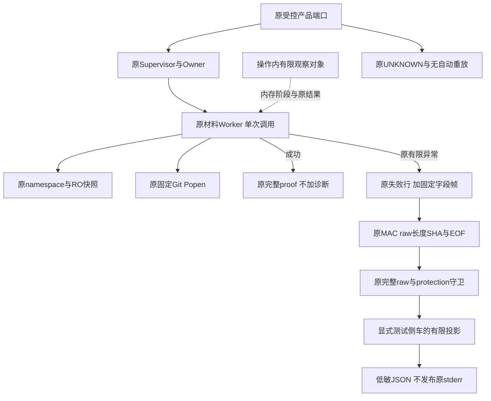
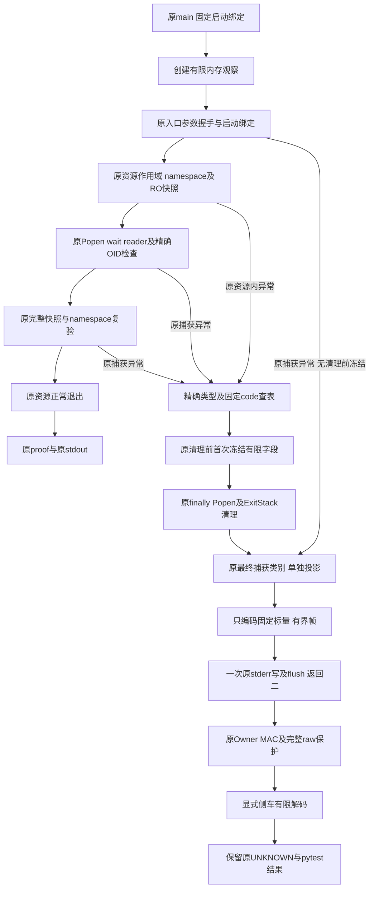
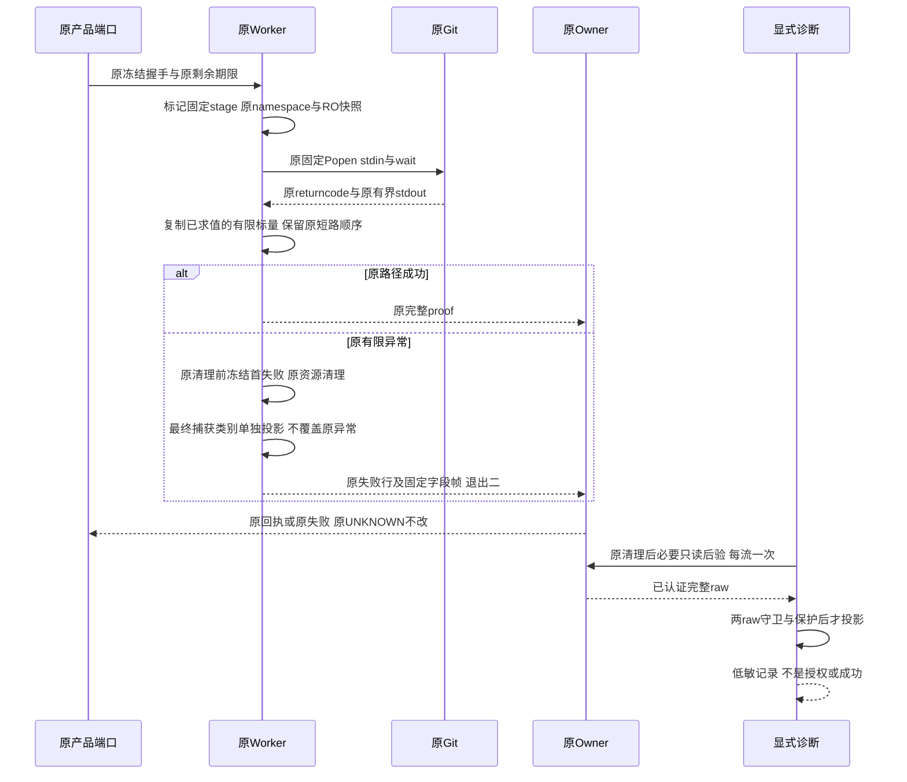
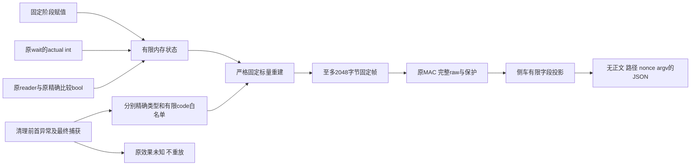

# Git材料Worker有限结构性失败观察：总体与详细设计

## 1. 需求背景与设计状态

固定96aa63c的[原生Run36841600538](https://github.com/carrie1988/Harnessix/actions/runs/36841600538)
保留两个最低SHA256 Commit真实失败。原输入送达、worker退出二、原MAC／完整raw／保护后验通过；
成功proof缺失，原强UNKNOWN未改变。四个有限文字信号仅命中worker固定失败行，不能排除任何内部原因。
[原诊断验证包](../validation/windows-minimum-commit-probe-2026-10-01-v1/README.md#7-单次v2实际windows结果)
没有保存stderr正文，也不能通过长度或摘要反推正文。

本设计对应已实现的观察候选。目标是在原worker调用中取得有限内部阶段和已经取得的Git输出检查事实，
减少反复猜测错误文字；不是修复未经证实的Windows根因，也不新增执行器或恢复权限。
完整Git产品交付、R3真实编码、Windows消费者验收、Beta及商用门禁继续按原退出条件实施。
实际验证范围及原失败见[统一验证包](../validation/git-worker-failure-observation-2026-10-01-v1/README.md)，
不得把观察实现当作已定位根因或原生修复。

## 2. 源码研究、目标与非目标

### 2.1 实际调用链

原[git_material_process.py](../../src/harnessix/product_config/git_material_process.py)：`_worker_argv`
使用固定基础解释器、`-I`和固定import root，经`runpy.run_module`启动受管worker。
原[git_material_worker.py](../../src/harnessix/delivery/git_material_worker.py)：`main`只接受固定三组参数，
读取有界握手，调用`run_worker`；后者依次验证启动绑定、命令、namespace、完整只读快照、Git、
快照复验、命令／namespace复验，最后构造proof。`_git`在原Owner进程树内启动一次固定命令，
读取至多66字节stdout，并检查原wait／reader结算、退出码和精确预期OID字节。

基线`4b2dda1`的`main`捕获`GitMaterialInputError`、`OSError`、`ValueError`、`TypeError`和
`subprocess.SubprocessError`，仅输出`git_material_worker_failed`并返回二。
实际错误类由[git_material_input_contracts.py](../../src/harnessix/delivery/git_material_input_contracts.py)：
`GitMaterialInputError`定义，不是Agent层的`KernelError`。其code入口能接受任意字符串，故不能直接输出code。
基线`implementation_digest`绑定四个材料模块和两个包入口；新候选完整绑定五个材料模块及两个入口，
不能遗漏新增可执行模块。新的main保留原捕获集合，额外输出有限帧或在编码故障时退回原marker。

### 2.2 设计目标与取舍

- 在同一次实际调用中标记固定阶段，记录原Popen是否返回、原Git退出码和原stdout校验bool。
- 只允许源码求证的有限错误code；未知code／类型固定降为未分类，不读取异常字符串、args、path或动态属性。
- 成功仍仅输出原proof；失败保留原固定行、退出二及原父端UNKNOWN，增加有界固定字段帧。
- 不新增业务材料、namespace、Git输出或Owner回执读取，不增加等待、线程、重试、Git效果、数据库、Key、审批或补签。
- 新观察模块必须完整纳入实现身份：`implementation_digest`每次调用由六份源码读取增至七份，另有正常模块导入成本；调用次数不变。这不是零新增源码读取，也不改变原业务IO容量。
- 原清理前只冻结一次有限首失败；最终捕获错误另列，不改变原异常优先级或清理次数。
- 不把诊断字段用作效果已知、成功、授权或自动恢复依据。

新增标准错误帧是可观测性合同变化，需要源码、发行物和原生回归；不以“只有日志”免除验证。
帧描述异常发生时的程序观察，不能仅凭字段宣称对象写入或Ref交付完成。

## 3. 总体架构与模块边界



拟新增`git_material_failure.py`只包含标准库的有限观察和编码／解码；不引入完整业务模型或第二套证明。
worker负责把阶段赋值放在原调用边界，把已经取得的结果复制为有限标量。
父产品端口不解码此帧、不改变原成功判定。显式测试侧车只在原后验全部通过后投影。
新模块必须进入原实现摘要；不能留下不被原worker源码身份绑定的可执行分支。

## 4. 接口设计、类和数据结构

以下为内部实际符号，不是公开Agent Protocol或模型工具接口；有限帧编码／冻结／解码及观察作用域位于
[`git_material_failure.py`](../../src/harnessix/delivery/git_material_failure.py)，
执行接点位于[`git_material_worker.py`](../../src/harnessix/delivery/git_material_worker.py)。

| 符号 | 单一职责与边界 |
| --- | --- |
| `GitMaterialFailureObservation` | 单次worker的可变内存观察；不含路径、正文、Key、OwnerToken或权限 |
| `encode_failure_observation(observation, error)` | 严格固定字段重建后返回有界bytes；不直接序列化异常或任意对象 |
| `freeze_failure_observation(observation, error)` | 清理前仅冻结第一次有限帧，不保存异常对象／args，不覆盖原异常 |
| `observe_failure_before_cleanup(observation, cleanup_stage)` | 仅内存观察作用域；在原Popen／ExitStack退出前冻结原有限异常，不替代资源管理 |
| `decode_failure_observation(stderr)` | 只识别完整固定帧、严格字段集合／类型／枚举；不是业务proof解码器 |
| `run_worker(..., observation=None)` | 内部可选观察接点，原实参和返回proof不变；不暴露为模型工具 |
| `_git(request, snapshot, observation)` | 原私有Git路径；追加内存观察，不改变Popen／IO／wait／drain调用 |

帧使用`harnessix.git-material-worker-failure/v1`，固定前缀`HX_GIT_MATERIAL_WORKER_FAILURE `，
单帧最多2048字节、LF结束。失败输出仍以原固定失败行开头，不包含第三方异常正文。

| 字段 | 类型与实际含义 | 不允许的推论 |
| --- | --- | --- |
| `schema` | 固定版本字符串 | 不是来源MAC或执行权限 |
| `stage` | 固定程序阶段枚举 | 是当前原调用边界，不是外部效果完成证明 |
| `error_code` | 清理前已冻结首失败的有限code；未冻结时为最终handler类别 | 不输出任意code、errno描述或异常类名 |
| `origin` | `pre_cleanup`或`handler`，区别首失败观察与最终捕获 | handler不证明清理前没有其他失败 |
| `handler_error_code` | main按原捕获集合取得的最终有限code | 与首失败code相同也不能证明没有清理覆盖 |
| `git_popen_returned` | 实际bool，原Popen上下文已取得进程对象后为True | False只表示未观察到返回，不能证明OS从未创建进程 |
| `git_returncode` | None或实际int，保留原POSIX／Windows联合范围`[-2**31, 2**32-1]`，不做符号或模转换 | 不是worker退出码、Ref成功或完整业务结果 |
| `git_stdout_complete` | None或实际bool；严格按原`is_alive → failed.is_set → code != 0 → len(output)`短路，非零退出但前两项通过时保持None | 不补做原未执行的长度检查，也不表示内容合法 |
| `git_stdout_expected` | None或实际bool，仅原精确预期OID比较时赋值 | 不替代完整快照／namespace复验、原回执和readback |

实际阶段：unobserved、entry、stream_mode、arguments、input、launch_binding、command、namespace、snapshot、
git_launch、git_wait、git_join、git_validate、git_cleanup、snapshot_recheck、command_recheck、namespace_recheck、
proof、resources_close、proof_output。没有执行到的观察保持None／False，不补推断。

原材料code白名单只来自四个实际材料模块：input_invalid、worker_invalid、worker_timeout、
binding_changed、body_changed、configuration_invalid、namespace_invalid、namespace_limit、private_invalid、
platform_unsupported、launch_mismatch、git_failed、proof_invalid、implementation_unavailable，均带原`git_material_`前缀。
严格原错误类型／code实际str才能查表；标量子类、异常子类或未知code只得到固定unclassified。
原有限捕获中标准内建错误可按精确类型归为固定os_error／value_error／type_error／subprocess_error，
不能调用任意异常getter或读取第三方错误文本。`_first_frame`是操作内只初始化一次的私有bytes／None：
仅保存经过严格重建的有限帧，冻结编码故障不覆盖原错误；最终编码重新验证其大小、规范字段及pre_cleanup来源。
它不是异常缓存、持久事实或可信授权。额外属性／标量子类和无效冻结bytes整体降为未观察。
其中`proof_invalid`仅为原合同模块保留的解码错误，不是当前main→run_worker→_git可达首失败原因，不能据白名单猜测实际原因。

## 5. 核心流程与伪代码



```text
main:
  observation = operation_local_finite_state()
  before each original boundary: set fixed stage only
  call original run_worker with same original arguments and local observation
  success: original encode_proof, stdout.write, stdout.flush, return zero
  original finite exception:
    first pre-cleanup finite frame retained without raw exception cache
    final caught category remains separate and original exception priority unchanged
    exact trusted exception type and exact str code -> fixed literal lookup
    unknown / malformed fields -> fixed unclassified values
    once original stderr.write(original marker + bounded fixed frame), original flush
    preserve original sink OSError handling and return two

git:
  before original Popen, wait, join, validation: set fixed stage
  after original Popen returns: mark observed handle
  copy original wait returncode; preserve original short-circuit check order
  copy only predicates actually evaluated; nonzero exit leaves completeness unknown
  only at original expected-OID comparison: copy comparison bool
  freeze first finite failure before original finally / context cleanup
  keep final caught code separate; never alter cleanup or exception precedence
  retain original kill/wait finally and original errors without retry

post_settlement:
  original receipt, each raw stream once, both full guards and protection all pass
  inspect complete frame from existing stderr bytes, not a new read
  missing / invalid / multiple / unsupported frames are not success
  preserve original proof and original UNKNOWN; never rerun effect
```

## 6. 时序与数据流





## 7. 失败、取消、持久化与恢复语义

不持久化新业务状态，不增加数据库、迁移、恢复入口或新Key。操作内状态在进程退出后丢弃；
诊断证据由固定候选的原测试日志投影登记，旧v1／v2记录不改写。
原取消、期限、父死亡保护、Owner／Job、kill／wait／reader结算、RO快照及资源释放保持。
stderr写入或flush的原OSError不触发第二次输出、执行或重试；成功路径没有失败帧。
纯诊断编码发生普通异常时退回原固定marker，原stderr仍只写／flush一次并返回二；不重执行业务。
清理前冻结失败也不得覆盖原异常；无新原始异常缓存。正常清理仍按原Popen与ExitStack分别执行一次。
未捕获类型不因观测而新增宽泛吞异常，KeyboardInterrupt／SystemExit仍不进入失败帧。

已有manifest实现摘要与新源码不一致必须继续拒绝，不跨Revision恢复旧未决执行。
新帧不触发父产品端口“已知失败”分类，不使UNKNOWN自动重放；副作用只能按原持久事实只读对账。

## 8. 安全、可观测性、兼容与部署

不读取或输出异常str／repr／args／filename、stderr动态正文、locals、环境、argv、Nonce、Token、Key、MAC。
观察对象不能序列化为任意字典；编码端和解码端均严格重建固定字段与实际类型。
无完整帧、重复帧、未知schema、额外字段、重复JSON key、字段错类型或范围、无LF末行均拒绝观察。
原受保护stderr整体仍需完整长度／SHA／EOF验真，不能只检帧摘要或未认证片段。

worker的stderr同时继承Git第三方输出，有限帧即使命中仍不作为可执行权威声明。
源代码身份、Owner回执、原调用阶段及独立复验必须分层记录；禁止据诊断字段改变安全决策。
侧车record升v3，保留v1／v2共有字段和四个文字bool；新结构性字段缺席与False／None分开说明。
产品握手和成功proof的字段／上限不变，新增模块进入原implementation_digest。
没有新依赖、默认pytest插件、任意脚本参数或远端接口；三平台源码外安装和实际Worker输入必须验证新发行物。

## 9. 完整测试与退出条件

| 范围 | 必需正反例与证据 |
| --- | --- |
| 纯编码／解码 | 全部阶段／错误code，原捕获类型，实际int／bool／None；未知code、子类、额外／缺字段、重复key、非UTF-8、截断、多帧、超限、敏感假正文及恶意getter |
| 原main | 成功只原proof；失败原marker和退出二；捕获集合不变；sink write／flush故障不重试；参数／握手／各内部阶段故障不泄原文 |
| 原Git调用 | Popen／wait／reader／kill／最终wait次数与原传参保留；超时／非零／输出失败／精确输出不匹配字段；完整成功仍复验全部原事实 |
| 侧车 | receipt／stdout raw／stderr EOF／protection拒绝前不解码；只用既有bytes；保留原13接点和原异常／UNKNOWN／原pytest结果；缺帧不冒充成功 |
| 真实本机／发行物 | 原两个完整SHA256 Commit／独立readback及受影响材料／生命周期回归，唯一Wheel包字节与源码／安装身份，不以源码兜底 |
| 原生Windows | 固定新Revision、named ref、attempt一、新fixture的原两个用例；原失败保留，不提高原20秒／45秒／五分钟或改断言 |

上表是完整验收要求；已执行集合和未执行原生项以统一验证包分别登记，不把计划记为PASS。
取得新结构性结果后仍须据真实根因修复并执行独立原生复验。
观察实现完成不等于Windows修复、完整Git产品交付、R3质量或1.0商用发布。
