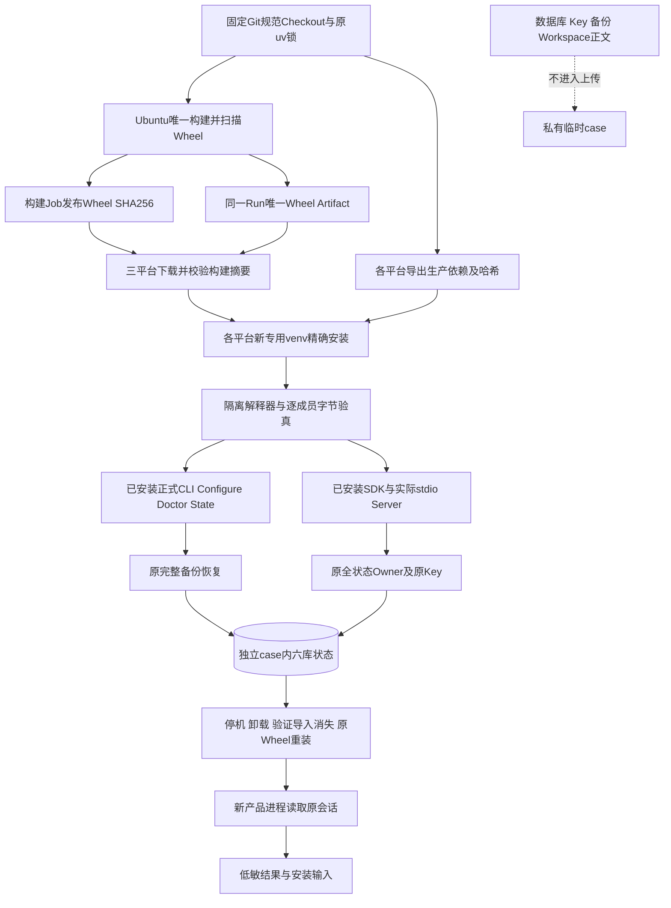
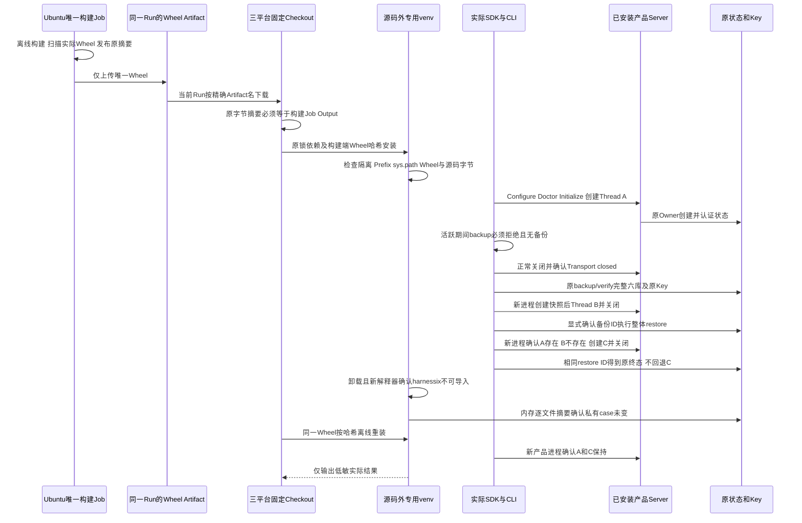

# R4 源码外安装、完整状态恢复与卸载重装验收详细设计

## 1. 文档摘要、需求背景与源码研究

开发环境中的`uv run`会使用源码安装及开发依赖，不能证明用户安装Wheel后可独立运行。
已有[macOS源码外恢复证据](../validation/product-restart-release-boundary-2026-09-29-v1/README.md#6-脱离源码安装与完整状态恢复)
完成实际SDK/CLI及完整状态恢复，但执行脚本绑定POSIX的`venv/bin`路径，没有验证卸载及重装。
R4要求三平台安装与生命周期证据；本切片复用正式入口，补统一、可拒绝、可复验的安装验收路径。

既有`e08d248`三平台生命周期全部通过，但各Job独立构建，Windows Wheel摘要与另两平台不同。
该事实不能证明同一发行物跨平台可用；后继工作流将构建收敛为一次，不改产品或恢复算法。
哈希差异的原始原因未完成归因，规范Checkout只是新的构建/来源契约，不追认旧差异由换行符造成。

源码求证基于[`AgentClient`](../../src/harnessix/sdk/agent_client.py)、
[`SubprocessAgentTransport`](../../src/harnessix/sdk/subprocess.py)、
[`run_product_stdio`](../../src/harnessix/product_config/server.py)、
[`state_main`](../../src/harnessix/product_config/state_backup_cli.py)以及现有完整备份/恢复正反例。
这些是实际装配端口；验收不直接构造SQLite Store，不替换Provider，不引入第二恢复算法。

## 2. 设计目标、非目标与架构决策

1. 在源码之外新建专用虚拟环境，依赖从原锁导出，按精确哈希安装，不临时解析浮动版本。
2. 以已安装解释器的`python -I -m harnessix`运行产品与CLI，排除源码路径和开发环境借用。
3. 保持实际State Owner、原Key及原认证机制；State地址由产品首次创建，不预建ACL或自动改权。
4. 完成活跃备份拒绝、六库/原Key备份验真、整体恢复、稳定restore ID及卸载重装后的会话读取。
5. 三平台分别产出实际结果；失败和缺失不能折算成功，不把CI宿主当作消费者OS支持声明。
6. 唯一构建Job先扫描实际Wheel并发布其摘要；三个安装Job消费同一Run同一Artifact，安装前核对原摘要。

非目标：真实编码任务、版本升级、独立Beta及1.0商用关闭。这些继续由R3、R4后续和R5验收。
同一Wheel卸载重装不称为版本升级；没有模型Turn不称为模型可用性或工具能力认证。
不新增安装器、更新器、备份平台、远程服务、公共Schema或数据库Migration。

## 3. 总体架构、模块边界与数据流



构建Checkout仅提供制品和固定来源，不进入产品`sys.path`。运行根与Checkout双向不能包含。
`canonical-wheel`仅在Ubuntu构建一次；`installed-product`矩阵不得再次构建。
Artifact名包含Revision、Run ID及Attempt，下载Action限定当前Run；构建摘要经Job Output传递，
不能从消费者自己的下载件重新计算后把该值冒作来源证明。消费端逐字核对后，pip输入仍使用构建端摘要。
专用环境下分`venv`和全新的`case`；`case`包含Git Workspace、源码外私有Config、State地址与备份地址。
构建输出、依赖输入及结果留在环境根，不能用上传整个环境根的方式收集证据。
脚本不是产品入口，未安装进Wheel；正式产品代码、权限和恢复合同不变。

## 4. 核心流程与时序



核心伪代码：

```text
build_one_canonical_wheel_scan_it_and_publish_its_digest()
download_exact_artifact_from_same_run_or_refuse()
require_downloaded_bytes_match_builder_digest_before_install()
verify_isolated_interpreter_specific_venv_and_source_revision()
compare_every_package_member_between_wheel_install_and_source()
create_new_case_or_refuse_without_deleting_old_files()
configure_dummy_environment_reference_and_invalid_provider_endpoint()
verify_doctor_and_original_product_owner_refusal()
backup_verify_restore_with_original_key_and_explicit_backup_id()
verify_original_thread_and_stable_restore_id_without_rewinding_new_state()
close_every_transport_then_snapshot_private_case_in_memory()
uninstall_only_harnessix_from_specific_venv()
require_fresh_interpreter_cannot_import_harnessix_and_case_unchanged()
reinstall_same_wheel_offline_with_required_hash()
require_case_unchanged_and_new_product_process_reads_original_threads()
publish_low_sensitivity_result_only_after_all_checks()
```

## 5. 接口设计、类设计与源码映射

| 实现 | 职责及合同 |
|---|---|
| [`check_environment`](../../scripts/installed_product_acceptance.py) | 实际`sys.flags.isolated`、Prefix和`sys.path`检查；Prefix必须为指定根的`venv`，不能卸载系统或其他虚拟环境 |
| `check_package_members` | 原Wheel内`harnessix/`逐成员与实际安装及固定源码比较；路径穿越、重复成员、缺失或变更字节固定拒绝 |
| `prepare_environment` | 读取实际Git HEAD并与输入40位Revision比较，核对安装包位置及实际分发版本；在目录线程完成 |
| `InstalledCase` | 独立夹具地址；`state`只是产品地址，`server_command`统一使用安装解释器，不依赖POSIX/Windows的CLI脚本路径 |
| `prepare_case` | 新建目录、Git Workspace、Sentinel和正式配置；已有case固定拒绝，不删除后重试 |
| `session` | 实际stdio握手、创建及读取Thread；30秒操作期限；finally关闭并核对Transport终态 |
| `verify_restore` | 复用原备份、验真及整体恢复CLI；活跃拒绝、原Key与稳定终态都必须成立 |
| `state_snapshot` | 仅对新建自有case的已关闭文件做内存摘要；遇到Symlink/Junction拒绝；摘要不公开 |
| `uninstall_reinstall` | 指定venv卸载、全新解释器导入拒绝、原文件不变及同一Wheel精确离线重装 |
| [三平台工作流](../../.github/workflows/installed-product-acceptance.yml) | 固定Checkout/Python；`canonical-wheel`唯一构建、扫描和发布摘要，三个消费者只下载、验真和安装；`fail-fast=false`保留各平台结果 |

复用的产品接口详设：[SDK](../modules/sdk.md)、[Product Config](../modules/product-config.md)、
[完整备份](m09-r1-product-state-backup.md)和[完整恢复](m09-r1-product-state-restore.md)。
本切片没有新的运行时领域接口；验收失败不能改写产品错误码或Store事实。

## 6. 数据结构、重点字段与持久化

`result.json`使用`harnessix.installed-product-acceptance/v1`，仅全部检查通过后写入。

| 字段 | 含义与限制 |
|---|---|
| `source_revision` / `wheel_sha256` | 实际Git HEAD及本次Wheel原字节；不是可移动main或包版本推导 |
| `product_version` / `platform` / `machine` / `python` | 实际安装元数据与运行环境；CI Windows Server不能冒称Windows 11验收 |
| `installed_package_members_verified` / `source_package_members_verified` | 与Wheel相同的包内实际文件数；不包含dist-info，也不是测试通过数 |
| `isolated` / `source_checkout_in_sys_path` | 执行隔离与源码借用事实，必须分别为true/false |
| `backup_file_count` | 当前空编码场景的六库与独立Key，必须为7；不外推有Artifact/Process场景的文件数 |
| `stable_restore_result`及恢复布尔字段 | 原SDK/CLI实际完成对应断言；必须结合成功Job和当前源身份读取 |
| 卸载/重装布尔字段 | 新解释器不可导入、私有case原字节保持、重装原会话可读 |
| `provider_turn_requests` / `commercial_release` | 本流程未发送Turn，值0/false；不作为线上Provider认证或商业通过 |
| `not_proven` | 明确保留真实编码、版本升级、Beta和消费者OS支持未证明边界 |

工作流新增`canonical-wheel.outputs.wheel-sha256`，通过消费端的`CANONICAL_WHEEL_SHA256`传递。
它来自构建Job中实际Wheel的SHA256，不是包版本或浮动Ref；三份原`result.json`的`wheel_sha256`
必须全部等于它，才能给出规范发行物三平台专项结论。原结果Schema和产品领域接口不变。
Artifact保留14天；若缺失或过期，需要新的完整Run，不能把另一Run的Wheel拼入当前结果。

CLI阶段日志仅记录固定phase/status，不展开子进程正文。失败退出1且不生成新的成功结果。
依赖导出含固定版本、平台Marker与哈希，初装不使用`--no-hashes`或动态依赖解析；重装明确`--offline --no-deps`。
原Key摘要及全部case文件摘要只驻内存；数据库、Key、备份正文和Workspace均不进入上传。

## 7. 失败、超时、取消、安全与恢复边界

- 不隔离、错误Prefix、源码路径借用、源码Revision错配、成员漂移或存量case均拒绝；不降级为源码运行。
- SDK操作30秒；CLI、卸载及重装各60秒；新解释器导入观察30秒；工作流15分钟。无自动重试或超时放宽。
- 活跃状态备份必须返回原`product_state_busy`且目标不存在；错误结果不能接受为“至少拒绝了”。
- 所有SDK调用finally关闭Transport；失败夹具保留原字节，不自动继续恢复、重放效果或删除状态。
- 卸载使用指定venv的解释器，只删除程序包；本流程不测试或提供用户数据清理命令。
- Provider仅使用合成环境引用及`.invalid`端点，没有发送Turn；不读取钥匙串或用户实际API Key。
- Job失败、缺少结果、仍在运行或结果身份不匹配均未通过。没有日志不能被解释为成功。
- 构建或Secret扫描失败，不发布规范Artifact，后继安装Job不执行；多Wheel、下载失败或摘要漂移在安装前拒绝。
- 构建与各消费者分别保持15分钟期限；增加来源依赖不增加模型请求、重试、用户状态访问或上传范围。

## 8. 测试、验证、错误分类与可观测性

[边界回归](../../tests/governance/test_installed_product_acceptance.py)覆盖不隔离、源码路径借用、
根目录重叠、错误venv、实际Wheel字节漂移、路径穿越、私有快照变更、存量case保留及上传白名单。
单元正例只证明这些拒绝边界，不证明产品安装；实际证明必须执行全新环境的完整脚本和新产品进程。

规范发行物回归直接执行工作流中生成pip输入的Python段，证明正常摘要可安装输入生成、
下载件篡改时没有输入生成；另核对唯一构建、同Run Artifact绑定、固定Action摘要和原七文件上传白名单。
真实Git临时仓库以自有配置模拟CRLF默认值，规范Checkout得到LF，对照目录及配置原字节保持。

三平台独立Job须核对固定源、实际Wheel及安装成员、原CLI/SDK结果、失败原件和低敏上传集合。
上传仅允许结果、requirements、Wheel输入及四份安装阶段日志，不上传整个环境目录。
失败公开`AcceptanceFailure`固定错误码或通用`installed_acceptance_failed`，不公开异常正文、路径和子进程stderr。

### 8.1 冻结诊断原件与活动源码格式边界

`e08d248`的三平台安装Job全部通过，常规Linux Job却在格式检查拒绝先前已冻结的
`diagnostics/session_storage_probe.py`。该原件保留当次观察器字节与Manifest，不为通过格式检查改写证据。
[`pyproject.toml`](../../pyproject.toml)仅将`docs/validation/**/diagnostics/*.py`及
`docs/validation/**/installation/*.py`界定为已封存诊断/安装执行原件，
不纳入自动源码格式/静态Lint；实际Runner、产品源码、测试及活动安装脚本继续原检查。
仓库Secret扫描仍以Git输入覆盖同一原件，源码制品也保留可读诊断；不是Secret或发行扫描白名单。
新增实际Ruff正反例证明活动未格式化源码仍拒绝、诊断原字节不改、Git/Secret扫描仍发现同一诊断文件内的合成规则命中。
原CI FAIL保持，只在后继固定候选重新执行门禁；不改写旧Manifest、旧Profile或许可判定。

### 8.2 规范Checkout与Git版本边界

构建及消费者Checkout步骤仅在该进程设置`GIT_CONFIG_COUNT=2`，分别传入
`core.autocrlf=false`及`core.eol=lf`。规范源码字节用于与同一Wheel逐成员对照，
不改用户全局Git配置、不重写工作树或历史Manifest；`.gitattributes`的`-text`原件仍保持原字节。
[Git官方配置契约](https://git-scm.com/docs/git-config#Documentation/git-config.txt-GITCONFIGCOUNT)
规定环境配置覆盖配置文件，但命令行`-c`仍具有更高优先级；Checkout不额外传入相反的`-c`选项。

这是CI构建/验收环境要求，不提高产品Git最低版本。该正反例需要支持上述环境配置及自有配置路径的Git；
本机旧Apple Git2.24.3不支持这组接口，不能把其LF默认行为当作规范Checkout成功。
本地复验使用现有Git2.53.0，原生CI使用各Job实际Git；不新增依赖安装或全局设置。

## 9. 部署、兼容、回退、风险与取舍

本工具是离线发行验收脚本，未进入产品Wheel或默认Runtime。使用新建私有运行根，
在其`venv`按原锁和Wheel哈希完成安装，再从该根执行：

```bash
/absolute/acceptance/venv/bin/python -I /absolute/checkout/scripts/installed_product_acceptance.py \
  --environment-root /absolute/acceptance --source-root /absolute/checkout \
  --source-revision <实际40位Git提交> --wheel /absolute/candidate.whl --uv /absolute/uv
```

Windows使用专用`venv/Scripts/python.exe`，产品CLI仍走`-I -m harnessix`，不硬编码`bin/harnessix`。
已有失败case不可复用；复验必须用新环境根，不清理旧结果伪造冷启动。
正式三平台支持仍受有限目标OS、原生核心编码、版本升级和Beta门禁约束。
选择固定Wheel而不是多个安装器降低组合数，选择真实Server/CLI而不是Store模拟保留数据保护语义。
小规模无模型生命周期不能替代真实编码，必须继续完成R3/R4/R5；R1～R6及1.0整体不因本切片自动关闭。

实际`e08d248`三平台独立Job已完成上述生命周期，原件见
[统一验证报告](../validation/installed-product-three-platform-2026-09-29-v1/README.md)。
三平台分别构建，Windows Wheel摘要与另两平台不同，不称为单一规范发行Wheel三平台验收或可复现构建；
Windows Server CI也不替代消费者Windows11。后继格式边界源码为`101f71e`，活动Runner及产品源码未改变。
规范工作流的实际跨平台结果须另行记录，旧三平台原件保持冻结；源码改为一次构建不等于实际验收已经通过。

`a4f7f33`的[规范Wheel三平台实测](../validation/canonical-wheel-three-platform-2026-09-29-v1/README.md)
已完成唯一构建、实际Secret扫描及三个消费者的完整生命周期；三份结果均为同一原字节摘要，专项通过。
这不追认旧独立构建的差异归因，不承诺可复现构建，也不关闭版本升级、消费者Windows11、R3/R5或商用门禁。
