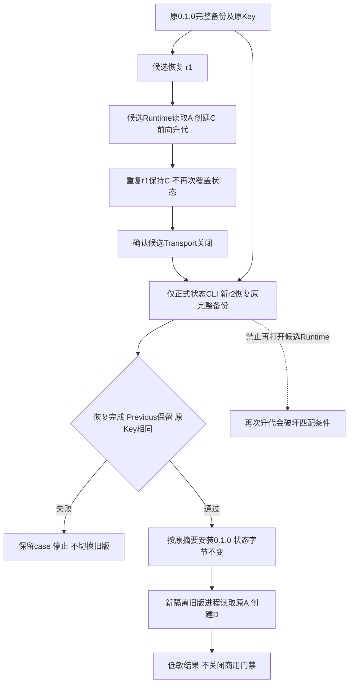
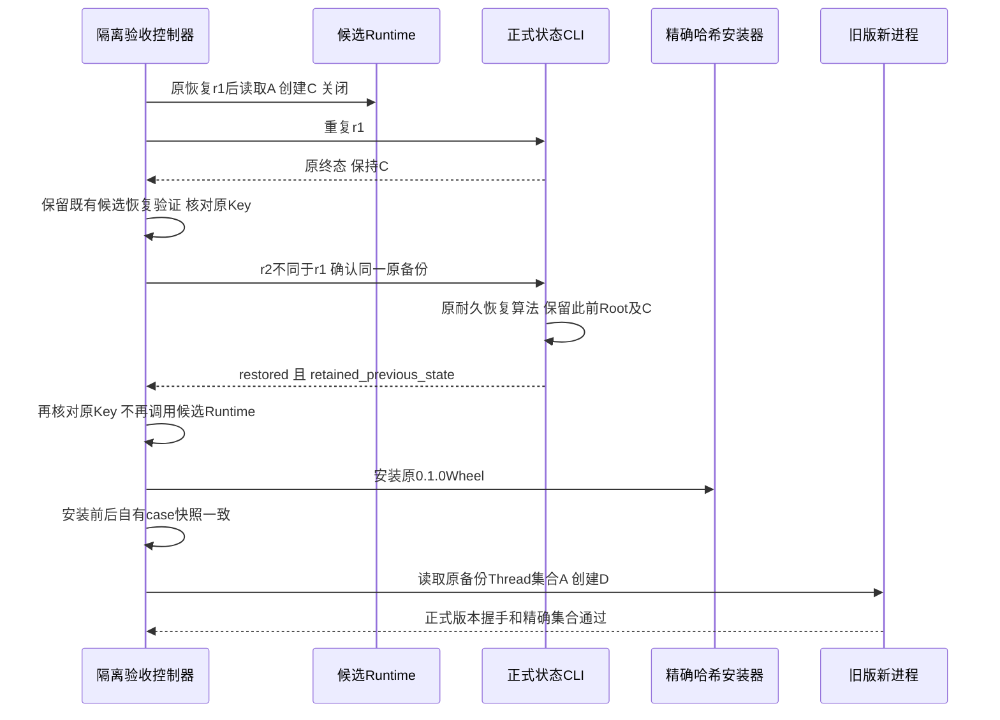

# R4 匹配完整备份与旧版本回退顺序详细设计

## 1. 文档摘要、需求背景与源码研究

不同版本回退的既有合同是“恢复与旧发行物匹配的完整状态，再启动旧发行物”，不是让旧Reader读取新Schema。
固定`702a89c`的源码外安装生命周期通过，但macOS本地及
[三平台Run 37692147486](https://github.com/carrie1988/Harnessix/actions/runs/37692147486)
的不同版本专项均在rollback阶段失败；原固定公开错误为`upgrade_phase_failed`，没有成功结果文件。
一次独立新根诊断只确认rollback子进程固定错误`upgrade_acceptance_failed`，没有捕获内层Store错误。
不得把源码推导的拒绝路径冒作实际异常码。

只读Schema元数据及固定源码证明一个必要流程缺陷：原0.1.0备份的Workspace/Audit/Execution版本分别为1/2/1，
进入旧包之前的活动状态却为2/2/1。候选恢复后，原`_restore_phase`启动当前Runtime读取A、创建C并验证同恢复ID幂等；
[`initialize_workspace_store`](../../src/harnessix/delivery/workspace_store_schema.py)在初始化时将Workspace v1前向升到v2。
随后重用原恢复ID不会撤销C，也不会重新恢复旧格式。验收器只安装旧Wheel，因而不满足匹配状态前提。
原0.1.0Reader只接受Workspace v1，其拒绝更高版本是正确边界，不应为了验收删除。

本设计修正验收调度，不变更生产恢复算法、产品Schema、认证、Owner或数据迁移合同。
原失败永久保留；修正后的真实演练必须另建根目录，不复用失败case或改写其证据。

## 2. 设计目标、非目标与架构决策

目标：保留候选恢复与稳定restore ID验证；在最后一次候选Runtime关闭后，以新restore ID恢复原完整备份；
旧包启动前不再打开候选Runtime；旧包读取备份中的原A并实际创建D。
恢复失败、Previous未保留、Key变化或恢复ID重用时，在旧包安装前停止。

非目标：Down Migration、自动更新、任意旧版本兼容、跨机器Key恢复、默认Git Writer、真实模型与编码质量认证。
不改变旧包拒绝新格式，不通过修改Schema元数据、删除迁移行或另造数据库获得绿色结果。
选择复用正式`state restore`，而非添加第二恢复平台；增加一次明确完整恢复的成本小于扩大Reader兼容合同的风险。

## 3. 总体架构、模块边界与数据流程



控制器只调度；正式恢复CLI负责耐久Plan、目录切换、Previous与原Key。旧/新Wheel以及源码成员仍由原验收器逐字验证。
恢复与安装均只操作独立`environment-root`下自有case及指定venv，不操作实际用户Workspace或默认状态目录。

## 4. 核心流程、时序与业务逻辑伪代码



```text
first = fresh_baseline_phase(create_A_and_full_backup)
fresh_candidate_phase(read_A_and_create_B)
r1 = new_uuid()
restored = fresh_candidate_restore_phase(first.backup, r1)
require_original_key_unchanged()
r2 = new_uuid(); require(r2 != r1)
state = original_cli_restore(first.backup, r2)
require(state.status == "restored" and state.retained_previous_state)
require_original_key_unchanged()
install_original_wheel_without_any_case_byte_change()
fresh_old_phase(expected_threads = first.threads, create_D)
publish_only_after_all_existing_assertions_pass()
```

## 5. 接口设计、类职责与调用链

| 源码符号 | 责任与前后条件 |
|---|---|
| [`accept_upgrade`](../../scripts/installed_product_upgrade_acceptance.py) | 入口参数保持；在原restore阶段之后、旧包切换之前增加匹配恢复 |
| `run_phase` / `_restore_phase` | 原候选恢复、A/C精确集合、同r1不回退C以及Transport关闭不变 |
| [`cli`](../../scripts/installed_product_acceptance.py) | 以指定已安装解释器执行`python -I -m harnessix state restore`，60秒有限期限 |
| `_switch_without_state_change` | 原venv离线按摘要安装；原case完整文件集合和字节快照必须不变 |
| `require_phase_threads` | 旧进程期望原备份集合，不使用候选恢复阶段生成的C |
| [`state_main`](../../src/harnessix/product_config/state_backup_cli.py)及[原恢复入口](../../src/harnessix/product_config/state_restore.py) | 原产品数据/权限/Journal合同，未修改 |

没有新类、新公共API、阶段枚举或生产Store。调用链为控制器→已安装状态CLI→原整体恢复→指定venv安装→新旧版SDK进程。

## 6. 数据结构、领域契约与重点字段

| 字段 | 含义与边界 |
|---|---|
| `restore_id` | r1：候选恢复验收身份；重复只返回原结果，不覆盖后续C |
| `rollback_restore_id` | r2：新的一次明确完整恢复；必须不同于r1，确认同一原backup ID |
| `first["threads"]` | 原0.1.0完整备份中的准确Thread集合；旧版恢复读取的来源 |
| `restored["threads"]` | 候选恢复后验证用集合，包含C；不再作为旧版回退预期集合 |
| `rollback_matching_backup_restored_before_version_switch` | 全流程成功后公开的低敏事实布尔值 |
| `rollback_reads_original_backup_threads` | 旧进程读取的是原备份集合，不是丢弃C的静默兼容 |
| `candidate_runtime_reopened_after_matching_restore` | 成功路径为false；匹配恢复后不启动候选Runtime |

最终结果保持`harnessix.installed-product-upgrade-acceptance/v1`，仅增加三个布尔事实。
Thread、Backup、Restore身份和Key均不进入公开结果。版本数字仅用于根因证据，不能替代实际认证读写验证。

## 7. 持久化、事务、并发、幂等与恢复

r1和r2均由原恢复Plan/Journal执行，不写第二套恢复记录，不直接修改SQLite。
第一次恢复保留含B的旧Root；r2再保留含C的候选Root，活动Root恢复为与旧Wheel匹配的完整备份。
因此C不在旧版本活动集合，但不因回退而丢弃其保留根。并发Writer由原Owner拒绝，阶段间先关闭所有Transport。
升级后存在未决外部效果时，整组备份恢复不能替代效果对账，不允许自动重试或回放。

## 8. 失败语义、取消、超时与异常

| 情况 | 处理 |
|---|---|
| r2等于r1 | `upgrade_restore_identity_reused`；不调用第二恢复或安装旧包 |
| 恢复非restored或Previous未保留 | `installed_restore_invalid`；不安装旧包 |
| 恢复CLI抛异常 | 控制器内部保留原异常实例；原顶层固定错误输出，不展开正文 |
| Key改变 | `installed_restore_identity_invalid`；不安装旧包 |
| CLI/阶段/安装超时 | 沿原60/180/120秒限制停止，保留case，无自动重试 |
| Ctrl-C | 原`upgrade_cancelled`、exit130，不生成成功结果；不是恢复Journal已撤销的证明 |
| 旧包精确读取或创建失败 | 原`upgrade_phase_failed`；保留已恢复状态及当前安装版本供显式检查 |

恢复失败后，活动状态可能已推进或处于待恢复阶段；不能假定异常等于无副作用。
按原`state recover`合同先对账，不能删case、覆盖失败日志或再次自动发起恢复。

## 9. 安全、权限与信任边界

保持原Key、认证Proof、Store身份、Owner、物理路径及原权限检查，安装目标仍只允许专用venv。
原0.1.0Wheel固定SHA256与来源Revision不变；候选Wheel需与固定当前源码552个包成员逐字相同。
不放宽旧Reader，不伪造version，不直接写Schema。私有case不上传，原Key与其字节比较仅在控制器内存发生。
此验收无模型Turn；虚构环境引用及`provider.invalid`配置不能证明供应商认证或编码能力。

## 10. 可观测性与错误分类

继续复用原CLI固定顶层码、原阶段结果和CI上传白名单，不加入原stderr异常正文或私有业务标识。
初始本地FAIL、一次诊断FAIL和三平台FAIL独立保留；后继PASS不能覆盖或改写原结论。
新结果明确绑定源码Revision、规范Wheel摘要、平台、Python、三个新增布尔事实及未证明边界。

## 11. 完整测试、真实验证与验收条件

六个新回归用例覆盖顺序、两种恢复拒绝、原异常身份、恢复ID重用和Key漂移；均先在原脚本RED，之后修正为GREEN。
其Schema替身只证明调度/阻止版本切换，不是实际DB、认证或安装验真。
新六项与既有两组安装边界共47项在Git2.53环境通过；首次Apple Git2.24旧CRLF控制用例1FAIL另存，未改变断言。
真实闭环需固定已提交脚本，在全新源码外根使用实际0.1.0/rc1Wheel、真实产品CLI/SDK验证。
三平台原生CI消费同Run唯一规范Wheel，必须全部产生原不同版本成功结果；不能以单元用例或原安装生命周期PASS关闭此专项。
固定`b1f8ec4`本地新根两份实际验收通过；[Run 37696128297](https://github.com/carrie1988/Harnessix/actions/runs/37696128297)
唯一规范Wheel构建及三平台原安装/不同版本回退均通过，46份低敏下载件核对原字节，
规范摘要仍为be30cacc，原Key、Previous、原A及新D断言保持。完整[报告及结果](../validation/matching-backup-rollback-2026-10-08-v1/README.md)保留原FAIL。
这只关闭固定版本对的安装回退子项；R4整体及R1～R6、真实Beta和商用版本仍开放。

## 12. 源码与测试映射、阅读顺序

1. [旧不同版本总体设计](m09-r4-different-version-upgrade.md)：固定版本对及完整备份合同。
2. [验收控制器](../../scripts/installed_product_upgrade_acceptance.py)：`accept_upgrade`中r1、r2、版本切换和精确集合来源。
3. [现有安装辅助模块](../../scripts/installed_product_acceptance.py)：隔离、60秒CLI、完整恢复与快照。
4. [Workspace Schema](../../src/harnessix/delivery/workspace_store_schema.py)：初始化v1→v2与实际v2记录准入后的v3。
5. [新顺序测试](../../tests/governance/test_installed_rollback_order.py)：格式替身及所有失败阻止旧包安装。
6. [三平台工作流](../../.github/workflows/installed-product-acceptance.yml)：唯一构建、相同发行物及低敏上传。

## 13. 部署、兼容、升级及回退

没有生产包代码变化，Wheel版本仍为内部`1.0.0rc1`。验收器只从固定Checkout运行，不进入Wheel。
操作手册要求停机、原Key与完整备份、全新恢复身份、恢复后不再打开候选Runtime、安装旧包并实际验真。
重复上一恢复ID是幂等查询，不是新的版本回退。安装旧包本身不修改状态，也不构成恢复。
三平台脚本均沿原Python3.12与原锁依赖，不新增中间件、Docker需求或付费请求。

## 14. 风险、限制、取舍与未完成项

确认的是必要验收顺序缺陷，不是原隐藏异常的唯一全链归因。通过新鲜实际演练才可确认修正闭环。
完整恢复明确将活动集合退到原备份，后续B/C只保留于Previous，使用者必须先处理所有未决外部效果。
不能推广到任意历史版本、消费者全部OS、Windows本地编码工具、R3成绩或独立Beta。
不扩展回退平台、不降低旧格式检查，优先完成可复验的现有手动版本生命周期。
