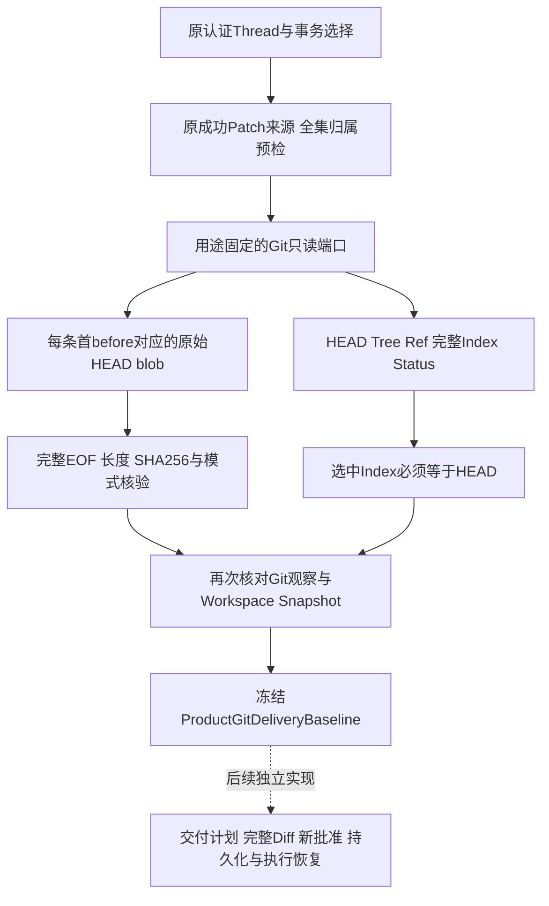
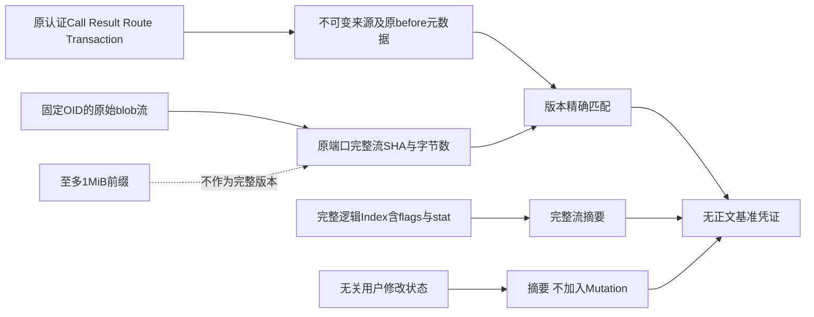
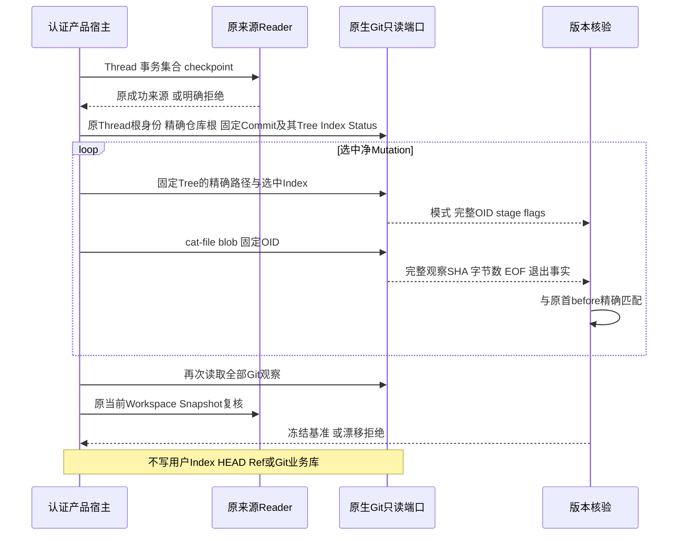

# 产品Git交付的只读基准与完整对象摘要设计

## 1. 需求背景、源码研究与设计目标

[产品Git来源](m09-r4-product-git-delivery-source.md)已经证明本认证Thread成功Patch的连续链及当前最终文件，
但没有证明首个before属于Git HEAD。直接把当前整个文件放入Commit，会夹带修改前已有的用户内容；
直接提交用户Index，会带入未授权暂存。原`GitDeliveryRuntime.bind_repository`要求干净来源，
不能以脏仓库开关消除这一生命周期差异。

本切片把完整源投影绑定到当前HEAD/Tree、原符号Ref、完整逻辑Index及当前Status。
每条选中路径的首before必须与HEAD普通blob的完整SHA-256、长度和模式一致；
选中路径的Index必须仍为相同HEAD版本，其他暂存或未暂存修改只观察摘要、不收集为交付内容。
后续Commit/Checkpoint仍需要独立完整Diff、新批准、Git业务持久化与备份闭合布局。

非目标：不发布Commit/Ref、不暂存、不创建受管Worktree或Git业务库，不读取模型指定命令，
不自动清理无关修改，不放宽原干净仓库宿主合同，不把摘要凭证当作Session授权。
本切片不关闭R4、三平台消费者验证或商用门禁。

源码依据：原[`GitReadRuntime`](../../src/harnessix/tools/git.py)已有固定宿主、取消、5秒单命令期限及原生Windows Owner；
[`ProcessStream`](../../src/harnessix/processes/contracts.py)保存完整观察SHA，即使前缀捕获截断；
[`CaptureProtocol`](../../src/harnessix/processes/capture.py)原停止线是`>=8 MiB`，
因此8 MiB合法blob需独立读取用途的9 MiB停止保护，但接受长度仍不得超过原8 MiB。
不扩充内存前缀1 MiB，不把前缀摘要当作完整内容。

Git官方[ls-tree](https://git-scm.com/docs/git-ls-tree)用于固定Tree的NUL分隔模式/OID/路径查询；
[cat-file](https://git-scm.com/docs/git-cat-file)用于原始blob查询，不使用filters或textconv；
[hash-object](https://git-scm.com/docs/git-hash-object)说明对象OID与原始正文摘要不同，因此不能
用Git SHA-1/256 OID替代Workspace SHA-256，也不能只检查文件长度。

## 2. 总体架构、流程图与数据流程





端口仍为本地宿主能力，不是OS Sandbox。独立交付用途固定关闭replace object、lazy fetch及所有Git协议，
关闭可选锁、外部attributes、用户级配置、fsmonitor、Hook和交互；只允许本模块生成的查询。
普通Coding Git读取不启用新用途，其原默认绑定与输出停止线保持不变。
交付用途以空值关闭fsmonitor，避免旧Git把`false`解释成外部帮助器。
Windows pipe Owner经[原始认证与安全发布分离](m09-r4-authenticated-raw-git-observation.md)提供v2双流统计。
交付用途在正常终态后重验同次原回执MAC、身份及Lease事实，不再以保护源是否存在决定原始证明。
旧v1回执仍报`git_baseline_raw_observation_required`，不得从脱敏统计补齐或关闭保护源绕过。
可解析正文必须完整且与原始数量/摘要一致，只有摘要用途的blob/Index/Status不恢复原始正文。
上述实现必须经原生Windows验证，不能据本机合同测试声称消费者验收通过。

## 3. 接口设计、类及数据结构

| 接口/字段 | 正式语义 |
|---|---|
| `GitReadRuntime(..., for_delivery=True)` | 仅受信宿主选择，目录广告不新增模型Tool；固定新绑定与9 MiB停止线，原默认false不变 |
| `collect_product_git_baseline(thread, targets, router, transactions, reader, cancel)` | 先执行原来源归属验证，再发出固定Git查询，最终返回冻结凭证 |
| `ProductGitDeliveryBaseline.source` | 完整原来源，含Thread、事务链、当前Workspace和净变化，不包含文件正文 |
| `head_oid / head_tree_oid / head_ref` | 固定完整commit/tree OID与符号Ref；detached HEAD记录HEAD，不自动切换分支 |
| `index_observation_sha256 / index_observation_bytes` | 完整`ls-files --stage --debug -z`输出的摘要/长度，含stat与flags；不是物理Index文件SHA，不能据此声称磁盘索引字节不变 |
| `status_sha256` | 固定Status完整结果摘要；无关内容不导出；重新观察变化则拒绝 |
| `config_names_sha256` | 配置键名观察；不查询HTTP Header、URL或凭据值；include/filter/sparse/partial clone键拒绝 |
| `reader_binding` | 原端口可执行文件、Workspace/Windows Owner能力及独立用途绑定，不能替代审批 |
| `members` | 每条净Mutation的HEAD普通blob OID与Git模式；新增路径必须HEAD及Index均不存在 |
| `digest` | 规范SHA，防意外改写；不是MAC或执行凭证 |

选中路径Index需stage0且与HEAD模式/OID一致；冲突、intent-to-add、不同暂存、assume-unchanged或skip-worktree拒绝。
逐路径`ls-files --debug -z`还要求原debug flags为零，不凭`-v`的H标签推断没有intent-to-add。
已有普通文件必须100644/100755，符号链接、tree、gitlink不作为普通文件接受。
字段容量沿原最多255不同触及路径、单镜像8 MiB、总镜像32 MiB；完整流观察不扩大这些接受上限。
元数据结果需完整前缀，引用或异常不猜测补值。

## 4. 时序图与核心逻辑伪代码



```text
验证原认证来源全集合；非法选择在任何Git IO之前拒绝
只接受启用固定交付用途的宿主端口
核对精确Repository Root，拒绝危险帮助器配置
宿主端口原生根身份必须与原Thread根身份一致
捕获固定HEAD及从该完整Commit派生的Tree、Ref、完整逻辑Index、Status及配置键名
for each source mutation:
  查询固定Tree路径、Index stage及flags，不查询用户参数命令
  before缺失 → HEAD及选中Index都必须缺失
  before存在 → HEAD普通模式、Index stage0/OID/模式必须精确一致
  读取固定OID原始blob；必须正常退出及完整EOF
  完整观察字节数和SHA-256必须等于原before，不使用捕获前缀
再次捕获全部Git观察，必须逐字段相等
复核原Workspace Snapshot，冻结基准摘要并返回
```

## 5. 持久化、事务、失败恢复、取消与超时

不新增Git业务账本、Worktree目录或备份路径。POSIX原端口仅保留有界内存输出；
Windows复用原Execution Plan及Process Owner事实，属于已经纳入正式备份的原Process布局，
不能宣称Windows操作完全无持久IO。只读基准对象本身不持久化；后续恢复需由认证来源重新生成，
不能信任模型提交的摘要或旧对象。

单命令保留5秒，整个观察有60秒期限；取消沿原进程树/Windows Job Owner回收，
不能启动线程尚未结束就重新发命令。同步来源扫描复用原checkpoint与有界文件端口。
输入、配置、前置版本、Index重叠、漂移、输出未完整、取消或期限失败均不签发基准。
跨调用不存在写入重试或`UNKNOWN`效果。后续有副作用阶段仍必须沿原Owner Fence及只对账恢复。

## 6. 安全、错误分类与可观测性

所有路径来自原认证来源；所有OID来自严格解析的固定Tree，SHA-1/256长度必须与HEAD一致。
符号Ref只删除一个Git行终止符，不用字符串strip删除合法非ASCII空白；复用正式branch Ref校验。
首检及两次正式配置观察共用helper键拒绝规则；终态Snapshot之后和返回之前均再次检查取消/期限。
配置值、blob正文、无关文件正文及原OS/进程异常不进入公共对象或错误。拒绝使用固定安全错误码。
流摘要只有完整EOF、正常退出及精确长度同时成立才是完整内容事实；前缀截断允许，流截断不允许。
Index逻辑摘要不能充当物理Index身份认证；后续交付必须使用私有Index且不修改用户Index。
凭证只绑定观察，不授权模型写Git。原干净来源、Lease、审批、恢复及公网Push延期保持。

## 7. 测试、验证与验收

真实Git、原产品Patch/SQLite场景覆盖新增/替换/删除、连续修改、SHA1/SHA256、可执行位、
无关脏文件和暂存保护、修改前已有内容、选中Index重叠、flags/冲突、错误根、不可达对象、
取消/期限、前后HEAD/Index/Status漂移、原Scratch镜像、Schema冻结与来源归属先行。
1 MiB以上及原8 MiB边界blob需证明完整流SHA而非前缀；异常输出用故障注入，与真实Git正例分开登记。
原普通Git默认用途负对照验证绑定、环境与8 MiB停止线未变化。原干净来源宿主及Checkpoint回归必须通过。
Windows原生专项需绑定后继候选，模拟不能替代真实NTFS/Job Owner及消费者Windows11验收。

## 8. 源码映射、部署、兼容与回退

来源以[`git_delivery_source.py`](../../src/harnessix/product_config/git_delivery_source.py)及
[`workspace_patch_source_contracts.py`](../../src/harnessix/product_config/workspace_patch_source_contracts.py)为事实源；
共享只读端口是[`tools/git.py`](../../src/harnessix/tools/git.py)，完整流证据是
[`processes/contracts.py`](../../src/harnessix/processes/contracts.py)及原Capture；
Windows复用[`git_read_windows.py`](../../src/harnessix/processes/git_read_windows.py)。
新基准Reader及冻结Schema需同时纳入模块设计与源码映射，不注册公共Tool或新增配置。

| 实现或合同 | 核心职责及对应测试 |
|---|---|
| [`git_baseline.py`](../../src/harnessix/product_config/git_baseline.py) | `_Queries`固定查询；`_observe`固定Commit与完整Index；`_member`逐路径版本/flags验证；`collect_product_git_baseline`归属先行、原生根绑定、60秒期限及终态核验 |
| [`git_baseline_contracts.py`](../../src/harnessix/product_config/git_baseline_contracts.py) | `GitBaselineMember`不存在/模式配对；`ProductGitDeliveryBaseline`严格路径、OID格式、Ref、来源及Digest一致性 |
| [`product-git-baseline-v1.schema.json`](../../spec/product-git-baseline-v1.schema.json) | 由唯一Schema生成器导出；额外字段、越界和跨字段伪造拒绝 |
| [`test_git_baseline.py`](../../tests/product_config/test_git_baseline.py) | 真实原产品Patch/SQLite/Git、大小对象、Index保护、漂移；端口故障注入单独标注 |
| [`test_git_delivery_reader.py`](../../tests/tools/test_git_delivery_reader.py) | 独立默认绑定载荷、宿主环境和参数、Capture精确停流线、模拟Windows固定用途与复验 |

无中间件、DB迁移或生产产品模式变更。普通Git目录不启用新用途；旧Session/Approval/Checkpoint不重写。
后继启用产品交付之前必须先完成Git业务库/对象/Worktree与正式备份/升级恢复的闭合设计，
再接完整Diff、新批准、Ref CAS与硬退出对账，不得先创建隐藏状态再补备份。

## 9. 限制、风险与取舍

当前版本匹配按原始字节及已有Workspace权限合同，不隐式执行CRLF、working-tree-encoding或filter转换，
也不把Git OID冒充文件SHA。Windows不能以模拟结果关闭原生验收；执行位、大小写及换行转换
需在完整三平台产品交付方案中明确，不以本切片绕过既有来源约束。
带保护源的Windows端口已接线受认证的双版本观察；原生验证、Git业务状态闭合、Diff及新批准/写入恢复
仍分别为后继验收条件，不能由原始读取合同通过推断产品交付完成。
配置双观察只拒绝观察到的漂移，不构成对恶意同UID进程持续篡改配置的OS隔离；后继副作用阶段仍需明确宿主信任边界。
返回凭证无认证能力，认证宿主必须重新读取原Thread并重新验证，后续新审批不能省略。
真实模型质量、费用未决、默认Docker Desktop、独立Beta及R1～R6仍开放。

8MiB端口边界专项使用原合同允许的二进制before及小型文本after，完整二进制Diff沿原摘要表示，
不把大文本Review的原1MiB容量提高。巨大文本替换的原拒绝路径不能被本基准功能宣称为可交付。
