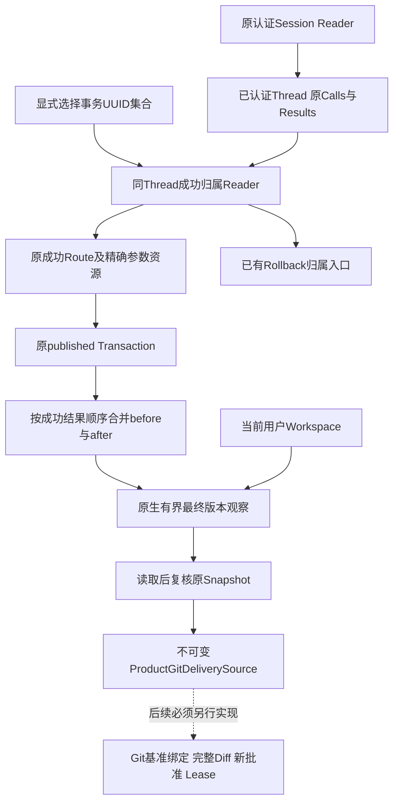
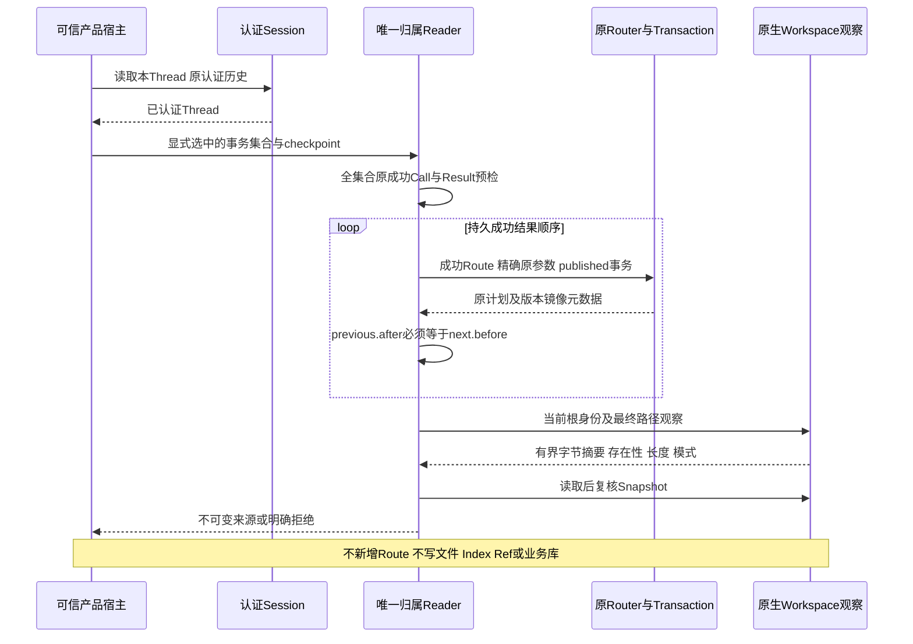

# 产品Git交付来源绑定与连续修改链设计

## 1. 需求背景、设计目标与完成边界

默认产品的`apply_patch_batch`先修改用户Workspace；原Git宿主组件则要求来源仓库干净，
并以原事务修改前的Snapshot和Git HEAD规划受管Worktree。成功Patch之后直接调用
`GitDeliveryRuntime.plan_worktree`会遇到脏仓库或Snapshot漂移，不能通过取消校验解决。
同一文件在实际编码任务中通常被连续修改，多次成功Patch也不能只导出最后一次修改的before镜像。

本切片实现产品Git交付的只读来源投影：选择本认证Thread成功Patch、验证原Route和Transaction，
合并连续before/after链，核对当前Workspace根与完整最终文件版本，得到版本化不可变来源。
产品回滚同时复用同一归属Reader，不新增第二套会话授权逻辑。

**本切片不注册Commit/Checkpoint Tool，不发布Git对象、不写Ref，不关闭R4。**
来源投影不等于Git HEAD绑定、不构成Approval，也不是其他Thread可以持有并使用的授权票据。
后续实际交付仍必须重新从认证Session验证来源，并经过独立完整Diff、新批准和原Lease。
公网Push、任意Git参数、自动暂存、覆盖用户脏文件和自动续写不属于首发接线范围。

## 2. 源码依据与架构决策

| 当前事实 | 源码位置 | 设计影响 |
|---|---|---|
| 产品Patch事务保存完整before/after和原Action Snapshot | [`trusted_action.py`](../../src/harnessix/delivery/trusted_action.py)的`WorkspacePatchTransactionPlanner.load` | 必须复用原Reader核对Route参数、资源、身份和Transaction，不只相信UUID |
| 产品Session有原Call、成功Result及稳定Action ID | [`approvals.py`](../../src/harnessix/agent/approvals.py)、[`models.py`](../../src/harnessix/agent/models.py) | 用Thread/Turn/Call/Tool Fingerprint确定原身份；Fork继承内容不授予原调用归属 |
| Rollback已有同会话成功Patch检查 | [`workspace_rollback.py`](../../src/harnessix/product_config/workspace_rollback.py) | 提取唯一归属Reader并保留原公开错误和Gateway行为 |
| 原Git来源要求干净 | [`git.py`](../../src/harnessix/delivery/git.py)的`bind_repository/plan_worktree` | 不直接复用为已发布Patch入口；保持原宿主合同不变 |
| 原生文件观察包含存在性、SHA、长度、模式和根身份 | [`snapshot.py`](../../src/harnessix/workspace/snapshot.py)、[`planner.py`](../../src/harnessix/delivery/planner.py) | 复用有界安全读取，不增加弱路径读入、文本重新编码或模式猜测 |
| 正式完整备份是闭合六库与Key/Blob集合 | [`state_backup_contracts.py`](../../src/harnessix/product_config/state_backup_contracts.py) | 不能先偷偷创建Git Store/受管Worktree，使正式备份遗漏新业务事实 |

选择只读投影先行，而非脏仓库开关或把代码复制进产品Runtime。该投影是Commit/Checkpoint必需前置，
但不修改原Git宿主来源与恢复语义。未接入产品交付之前不新增隐藏持久目录，也不改变旧备份格式。

## 3. 总体架构、流程图与数据流程



实线表示本切片实际实现，虚线表示未接入的后续交付流程。
Session负责认证，来源Reader不对任意调用方构造的`Thread`签发身份。
Reader只观察当前Thread自己的Turn，不把`fork_snapshot`当作原调用的归属证据。
先完成整个选择集合的会话归属筛选，再读取任何原Route、Transaction或Blob。
来源输出只包含ID、指纹、文件版本和当前Snapshot，没有文件正文或绝对Workspace路径。
无关用户文件只可能作为父目录条目参与Snapshot漂移保护，正文不读取、不导出。

## 4. 接口设计、类与数据结构设计

| 类或接口 | 责任、重要字段与约束 |
|---|---|
| `load_owned_workspace_patch(thread, target, router, transactions)` | 核对配对成功Call/Result、稳定Invocation ID、Route成功状态、原参数、原Transaction；返回引用和原记录 |
| `WorkspacePatchSourceReference` | `transaction_id`是稳定原Action ID；`turn_id/call_id`绑定本会话原调用；`route_fingerprint/transaction_fingerprint`分别绑定两条原计划 |
| `collect_git_delivery_source(..., checkpoint)` | 同步只读投影；宿主必须提供取消/期限检查回调；显式选择不扩大为整仓自动提交 |
| `ProductGitDeliverySource` | `spec_version=harnessix.product-git-delivery-source/v1`；`thread_id`、有序`patches`、当前`workspace`、有净变化的`mutations`及`digest` |
| `workspace` | 读取后复核的当前原生Snapshot；根ID必须与全部原事务相同，不要求当前文件与历史before相同 |
| `mutations.before/after` | 每条路径的首个before和最后after；必须逐次精确连续，比较存在性、SHA、长度和模式 |
| `patches` | 选择1～256个唯一UUID，输出遵循本Session成功结果的持久顺序，不遵循UUID排序或模型参数顺序 |
| `digest` | 所有正式字段的规范SHA-256；防止意外改写，不是MAC，不代替Session认证与新Approval |

净零路径仍观察和验证最终版本，通过后才不进入输出Mutation。
全部路径净零时明确拒绝无变化交付，不制造空Commit。
当前Snapshot最多256个资源，含根目录，因此本投影最多255个不同触及路径；
沿用单文件8 MiB、镜像总量32 MiB及正式Snapshot容量，不提高原上限。
合并路径按原平台比较键排序，连续链中的同路径模式变化不能丢弃。
[`product-git-delivery-source-v1.schema.json`](../../spec/product-git-delivery-source-v1.schema.json)由
[`generate_specs.py`](../../scripts/generate_specs.py)从正式模型生成；旧Schema不改写，来源Schema不加入模型Tool Catalog。

## 5. 时序图与核心业务伪代码



```text
checkpoint()
require unique UUID selection within original bound
preselect own completed Patch calls paired with successful results
require entire selection belongs to this Thread before reading any ledger
for selected result in persisted order:
    require original Route succeeded and arguments/resources exact
    require original Transaction published
    require same Workspace root and platform
    for mutation:
        if path seen: require previous.after == mutation.before
        retain first.before and current.after
capture current native Snapshot for all touched paths
require original root identity
for touched path:
    checkpoint()
    bounded_read_or_require_absent()
    require current_version == final.after
    checkpoint()
verify_current_snapshot_after_reads()
drop net_zero_members_only_after_validation()
require at_least_one_net_change()
freeze_versioned_contract_and_digest()
checkpoint()
return source
```

可信宿主的最小调用示例（不是新增SDK/Protocol方法）：

```python
from harnessix.product_config.git_delivery_source import collect_git_delivery_source

# Thread必须来自原认证Session Reader；router和transactions由同一产品Owner持有。
thread = await runtime.store.get_thread(thread_id)
source = collect_git_delivery_source(
    thread, (transaction_id,), router, transactions, checkpoint=cancel.checkpoint
)
# source只用于后继重新验证和交付规划，不能代替新批准或直接发布Git Ref。
```

## 6. 持久化、事务边界、失败恢复、取消与超时

| 情况 | 处理与副作用边界 |
|---|---|
| 未知UUID、其他Thread、Fork、未完成Call或失败/UNKNOWN Result | `git_delivery_source_not_owned`；全集合拒绝前不查询原Route/Transaction/Blob |
| Session成功投影与Route指纹、状态或原参数不符 | 原校验拒绝；不能将旧UUID包装成新成功 |
| 原事务非published | `git_delivery_source_not_published`；不根据Session成功字段猜测事务完成 |
| 少选同一路径中间一次修改 | `git_delivery_source_chain_broken`；不越过中间内容或自动纳入未选修改 |
| 后续用户/工具改动、根替换、缺失或模式变化 | `git_delivery_source_changed`或原生路径拒绝；文件、Index和HEAD保持不变 |
| 选择重复、类型非法、容量超限、全部净零 | 分别明确selection/limit/no_change拒绝，不扩大原容量 |
| 取消/期限检查抛出异常 | 原异常传播，不返回来源；不追加事务或恢复标记 |

投影没有新持久状态。进程退出后重新从原认证Session、Route和Transaction读取，不能缓存旧来源当成新批准。
IO是有界同步读取；回调在阶段/成员/读取后检查，不承诺瞬间中断内核IO或跨路径原子锁。
后续Executor仍需持有原Lease并在对象/Ref副作用前重验；本投影不能替代该步骤。
原回滚的未授权错误保持`workspace_rollback_not_owned`，非published来源保持`workspace_rollback_source_invalid`，
原新批准、逆向Diff、逐成员执行、UNKNOWN只观察恢复与公开错误保护不变。

## 7. 安全、兼容、部署、风险与取舍

仅随原Wheel分发内部来源模块，不加入公共Tool Catalog或新SDK方法。
无新增数据库、目录、迁移、Config字段、依赖、Git环境继承或模型调用。
原Git宿主仍要求干净来源；未达成正式产品接线前，不把内部来源投影称作可使用的Commit/Checkpoint功能。
MAC认证由原Session Reader负责，归属由原Call/Result及账本证明；来源SHA只证明完整性。

原R4剩余Git接线按以下依赖顺序实施，不新增独立服务：

1. **来源投影（本切片）**：连续修改链、完整最终版本、同会话归属和既有Rollback共用。
2. **Git基准及交付计划**：选择变化的首before必须与明确Git基准匹配，拒绝未授权内容进入提交；
   不自动暂存或改变用户Index/HEAD。明确新Git账本与完整停机备份的闭合布局后才启用持久状态。
3. **产品Tool闭环**：有限输入、新完整Diff/作者/消息/目标分支审批、同身份Checkpoint与Commit，
   独立拒绝/取消/超时、Ref CAS、对象/Ref硬退出只对账、跨会话与Fork负对照。
4. **同候选验收**：源码外Wheel、停机升级/回退、macOS/Linux和原生Windows11真实消费者编码路径；
   公网Push仍延期，R1～R6按原门槛关闭。

## 8. 可观测性、错误分类、验证与可追溯材料

当前可观测事实来自原Session成功Result、Route/Transaction指纹、当前Snapshot revision、
来源Digest及固定错误码；不新增日志正文、原始参数输出、Span、Metric或新的Telemetry服务。
选择/归属失败属于请求或授权拒绝，连续链/当前版本失败属于来源冲突，非published属于持久状态不满足，
原期限与取消异常保持调用方类型。内部Reader不新增公共错误出口；既有Rollback仍经原安全码表保护公开结果。
调试使用结构化来源引用定位原受保护账本，不把文件正文、个人路径或凭据复制到公开诊断。


[`来源专项`](../../tests/product_config/test_git_delivery_source.py)覆盖真实Patch批准、三操作、连续修改、
选择重排、遗漏中间修改、净零、未知/跨Thread/Fork、配对成功证据、非published账本、根/第三内容/模式、
取消、原期限传播、读取后漂移及合同完整性。容量专项的合成元数据只用于护栏负对照，
不称为实际大文件授权或容量验收。ScriptedProvider只替代网络模型，文件端口、Router和SQLite保持真实。
[`默认SDK来源专项`](../../tests/product_config/test_git_delivery_source_sdk.py)从默认产品原MAC Reader读取Thread，
在不追加模型请求的重开后取得逐字段相同来源；不以公共SDK摘要代替认证Thread。
[`正式回滚专项`](../../tests/product_config/test_product_patch_rollback.py)及
[`默认SDK/硬退出专项`](../../tests/product_config/test_product_rollback_sdk.py)保护实际产品既有行为。

专项结果、原失败、实际源文件Hash、Wheel身份、安装测试、Review Packet和材料清单统一记录在
[`专项交付目录`](../validation/git-delivery-source-2026-09-30-v1/README.md)。
所有本地通过只关闭该来源前置切片，不推导Git入口接线、R3真实质量或1.0商用发布。
